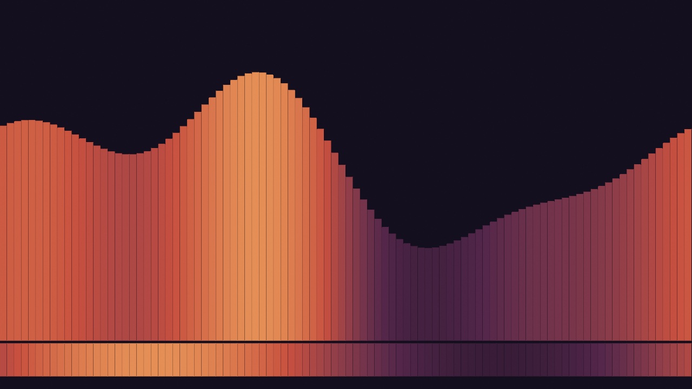
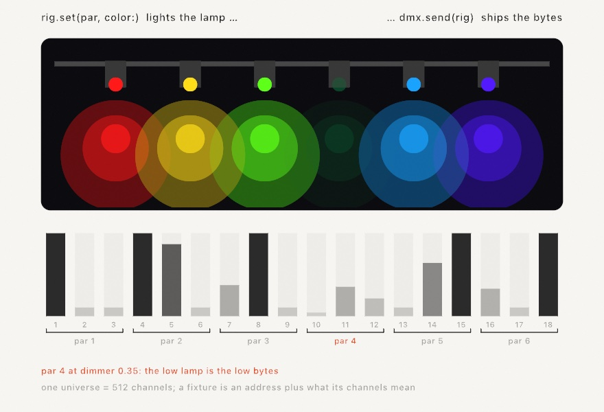
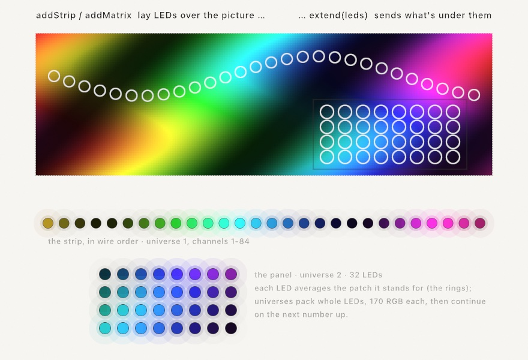

#### <sup>[Ollin](../README.md) → [Guide](README.md) → Chapter 32</sup>

---

# 32. Installations



Nobody is sitting in front of that. It is on a wall, it has been there since Tuesday, and it will still be there when the building shuts on Sunday. The band along its bottom edge is not decoration either. A strip of lamps is reading that band and lighting the wall under the screen with it.

[Chapter 31](31-SharingAndPerforming.md) sent work out as files and feeds. This chapter is the other way a piece leaves your desk: it stays where it is, and you go home. That turns out to be a different job. The output may not even be a screen, the frame budget stops being a preference, and a room does things to a sketch that a desk never does. By the end you'll have built the piece above, declared for a room rather than a window.

## Light instead of pixels: DMX

A lighting rig is a display with very few, very bright pixels, and a sketch can render for it too. Stage lighting speaks **DMX**, the protocol that has told dimmers, LED pars, and moving heads what to do since 1986. It travels over ordinary Ethernet in two dialects, **Art-Net** and **sACN**. The model is small. A *universe* is 512 channels of one byte each. A *fixture* listens at an address and reads a few consecutive channels. What each channel means is printed in the fixture's manual, whether that is red, green, blue, a dimmer, or a pan motor. You fill 512 bytes, you send them, the room changes.

```swift
import OllinDMX

let dmx = DMXSender()                           // sACN multicast: zero config
let par = DMXFixture.rgb(at: 1)                 // an RGB par on channels 1-3

override func draw() {
    var rig = DMXUniverse()
    rig.set(par, color: Color(hue: fract(time * 0.1), saturation: 1, brightness: 1))
    dmx.send(rig)                               // universe 1, every frame
}
```

`DMXSender()` with no address multicasts sACN, which any listening node on the network picks up with no addressing at all. `DMXSender(artNet: "192.168.1.60")` unicasts Art-Net to a node that wants it. Either way you send every frame, like a second `draw()` aimed at the room. The sender handles the wire's own etiquette. It sends changed data only, caps near DMX's own refresh rate, and keeps alive while nothing moves. A 60 fps sketch therefore makes a perfectly polite lighting console. The fixture sugar keeps the addressing in one place. Patch a `DMXFixture` per lamp with the roles its manual lists, and chain them with `nextAddress`. Then `rig.set(par, color:)` lands on whatever channels the layout names.



It works the other way around too. A `DMXReceiver` turns the sketch into a fixture. A real console fades channel 1, and `draw()` reads it as `dmx.level(1)`. Or `dmx.bind(channel: 1, to: $radius)` puts the fader on the same knob the inspector slider moves. That is exactly like [Chapter 28](28-SoundAndControl.md)'s MIDI and OSC bindings. The `Integration/DMXLoopback` example runs both ends on `127.0.0.1`. A sender chases colors across a drawn rig, and the rig is lit from what the receiver reads back. The whole path runs with no console and no hardware. When you do reach for real lights, two practical notes matter. macOS asks once for Local Network permission, attributed to the terminal you launched from. A free sACN monitor app will show you every universe on the wire. Use it while you find your fixture's address.

The rig's big sibling is the LED wall, and for that you stop filling channels by hand. An `LEDMap` lays the fixtures over the canvas itself. A strip is a run of sample points along a line or a curve, and a matrix is a grid of them. Every frame the map reads the rendered pixels under each LED and ships them through a `DMXSender`. That read happens on the GPU, over a few hundred points, never as a whole-frame readback. The wall is just the canvas, somewhere else.

```swift
let dmx = DMXSender()                     // or unicast to your pixel controller
let leds = LEDMap(sender: dmx)

override func setup() {
    leds.addStrip(from: Vector2(100, 540), to: Vector2(980, 540), leds: 144)
    leds.addMatrix(in: Rectangle(x: 390, y: 150, width: 300, height: 300),
                   columns: 16, rows: 16, universe: 2)
    extend(leds)                          // from here on it feeds itself
}
```

After `extend(leds)` you draw as if the wall didn't exist. Whatever lands under the mapped points is what the wall shows. Each LED averages the little patch of canvas it stands for, so a strip over fine detail glows steadily instead of flickering. On the wire the map packs whole LEDs into universes, 170 RGB pixels per universe, with longer runs continuing on the next number up. That is exactly the layout pixel controllers expect. Patch yours to the numbers `leds.universes` reports and you're done. The `Integration/LEDMapping` example runs it all on loopback, the drawn strip and panel lit from what a receiver reads back off the wire.



## When it gets slow: the cost row

The night before an opening is a bad time to discover that a piece runs at 24 frames a second. Sooner or later one will, and the useful question is not "is it slow" but "which half is slow".

Press **⌘/** for the inspector. Under the frame rate sit two bars and three counts.


The **CPU** bar is your `draw()` plus the encoding that turns it into GPU commands. Tessellation lives there: every fill and every stroke is cut into triangles before the GPU sees it. The **GPU** bar is what the card spent on the frame, taken from its own clock.

Both bars are drawn to the same scale, which is the length of one frame. At 60 frames a second that is 16.7 ms. So the longer bar is your problem, and two short bars mean you have room.

They are not stacked into one bar on purpose. The CPU is already building the next frame while the GPU draws this one, so the two overlap in time rather than adding up.

The counts underneath say what the frame asked for. **Draws** is the draw calls. **Passes** is the render passes, which is two for a plain sketch and one more for every layer and filter. **Batches** is the runs the drawer recorded, and a run breaks whenever the blend mode, texture, or clip changes.

That last one is the surprise. Ten thousand circles in a row cost one draw call. Ten circles that each change the blend mode cost ten. If the batch count is close to the shape count, group the shapes that share a state.

The rest of the reading is short:

- **CPU bar long?** You are making geometry. Hover Draws for the vertex count. Static geometry belongs in a [retained batch](../Docs/Drawing/Batches.md), recorded once and replayed from the card.
- **GPU bar long?** You are filling pixels. Look at the pass count, and give soft layers a smaller `renderTarget(scale:)`.
- **Both short and still slow?** Something outside the drawing is holding the frame, like a file read in the middle of `draw()`.

When you need to know which pass, hand the frame to Xcode:

```sh
MTL_CAPTURE_ENABLED=1 ollin MySketch.swift
```

Then **View ▸ Capture GPU Frame (⌘⇧G)**, or `captureGPUFrame()` from your own code. Ollin writes a `.gputrace` file that opens in Xcode's GPU debugger, and prints the frame's passes in order on the way past. Often that printed list is the whole answer.

## Leaving it running

Some pieces are not files. They go on a wall, or in a shop window, and stay there for a week with nobody watching them.

That is a different job from a sketch at your desk, and different things end it. The screen saver comes on at midnight. The display sleeps. Somebody unplugs the monitor to borrow it. None of that is your drawing's fault, and all of it stops the show.

One line asks Ollin to hold it off:

```swift
override var installation: Installation { .on }
```

Now the window takes the whole screen with no title bar, the pointer disappears, and the display stays lit with the screen saver held off. Command-Q still quits, whatever the piece covers.

You do not have to edit a sketch to try this, or to get out of it:

```sh
swift run --package-path Examples Example-Motion-Orbits --installation                 # any sketch, up on the wall
swift run --package-path Examples Example-Installation-Unattended --no-installation    # back to a window to work in
```

A single file goes up the same way. It has no target of its own, and the host that usually runs it keeps the window. The flag hands the sketch one:

```sh
ollin piece.swift --installation
```

That host does not reload on save. On a wall that is what you want: the piece runs the code you started it with. Plain `ollin piece.swift` is still where you work on it.

### What actually breaks is the clock

The screen saver is the obvious enemy. The clock is the real one, and it goes wrong twice.


First, a gap. When the display sleeps, no frames are drawn, and the first frame back happened eight hours after the last one. Read from the wall clock, that is a `deltaTime` of eight hours. Hand that to anything that moves by `speed * deltaTime` and it leaves the canvas forever, in one step.

So the sketch clock is not the wall clock. It is the sum of its own frame steps, and each step is capped at a quarter of a second. A gap becomes a pause, and the piece carries on where it stopped. You get this whether or not you declared an installation, because a laptop lid closes in the middle of an afternoon too.

Second, precision. Your `time` is a 64-bit number and stays exact for centuries. The copy your shaders read is a 32-bit one, and it cannot count seconds for a week. After a day the steps go uneven. After a week, adding one frame to it changes nothing at all, and every motion written inside a shader stops dead.

The fix is to give the shaders a clock that starts over. It is only free if the restart lands where the piece repeats, so it is tied to the loop you declare:

```swift
override var installation: Installation { .on }
override var loopDuration: Double? { 120 }     // two minutes a lap
```

Nothing moves at the restart, because the piece is back at the start of a lap anyway. A sketch with no declared loop keeps counting, since there is no free moment to jump at. Say `Installation(clock: .restarting(every: 600))` if you know one, or leave it alone.

### Picking up where it left off

Some pieces are the same every launch, because everything they draw comes from the clock and the seed. Those need nothing here.

Others grow. A wall that fills in one tile at a time, a reef that adds a polyp an hour, a drawing that accumulates. Three days in, that piece is not something you can rebuild from its seed. Getting back there means running the three days again.


So write the state down. Two lines: how often, and what.

```swift
override var installation: Installation { Installation(checkpoint: .every(seconds: 60)) }

@Saved var tiles: [Tile] = []
```

Every `@Saved` property goes into the file on that cadence, along with the seed, the clock, and every `@Param` value. A relaunch puts them all back before your first frame draws. The piece carries on.

Anything `Codable` can be saved, which includes your own structs once you mark them `Codable`. What cannot is anything living on the GPU: an accumulated canvas, a feedback layer, a simulation field. Those are textures the framework owns, and the checkpoint does not reach them.

You will edit the sketch while an old file is still sitting there, so every mismatch is made to cost only itself. Rename a property and the old value finds nothing. Change its type and it fails alone, named in the log, while everything else still restores. Damage the file and it is ignored. A piece on a wall that will not start is worse than one that started over.

`--fresh` ignores the saved state for one run without deleting it. That is the one to reach for when a piece comes back in a state you do not want.

### When it falls over

A piece on a wall crashes at three in the morning and nobody is there. The wall stays dark until somebody notices, which is usually the next day.

```swift
override var installation: Installation {
    Installation(checkpoint: .every(seconds: 60), restarts: .onFailure)
}
```

The process you start becomes a small watch with no window of its own, and your piece runs inside it as a child. When a run ends badly, the watch starts another one. Pair it with a checkpoint, or the piece comes back at the beginning every time.


Two things end a run badly. A crash is the obvious one. The other is a frame that never finishes. The process stays perfectly healthy and the picture freezes, which is what a viewer actually sees. So the piece writes a heartbeat every couple of seconds from the thread that draws. A main thread stuck in a frame stops writing it, and that silence is the only sign there is.

Quitting is not falling over. Command-Q ends the whole thing, watch included.

A piece that fails one second after it starts will not be fixed by starting it again. So each try waits longer than the last. After five short runs the watch gives up and says so in the log. One run of any real length clears that record. A slow `setup()` is not a stall either: a piece gets at least two minutes to draw its first frame, whatever limit you set.

### Gallery hours

A piece on a wall is in a building, and buildings have hours.

```swift
Installation(schedule: .open(from: 10, to: 18))
```

Outside them the screen goes dark and the display is allowed to sleep. The frames stop with it, and the clock stops with them. In the morning the piece carries on from where it stopped, not from where the day got to.


The other half is a piece that changes through the day. Name the parts of the day, and read the one you are in:

```swift
override var installation: Installation {
    Installation(schedule: [.from(6, "dawn"), .from(10, "day"),
                            .from(18, "dusk"), .from(20, "night")])
}

override func draw() {
    background(scheduledPeriod == "night" ? Color(white: 0.04) : .white)
}
```

Each part runs until the next one starts. The last one runs round to the first, which is how a night crosses midnight in one piece. `scheduledProgress` says how far through the current part you are, from 0 to 1, for a piece that slides rather than switches. The two halves are one list, so mix them: `.dark(from: 20)` is a part with nothing on screen.

Both readings work at your desk as well as on a wall. You can build a piece that changes at dusk without waiting for dusk.

### Fitting the wall

A projector is almost never square to what it is aimed at. It hangs off a beam, or sits on a shelf to one side, and your rectangle lands as a trapezoid.

So press **Command-K** on the running piece. Four handles appear on the corners. Drag each one onto the wall, and press Command-K again.


The numbers are kept under the display rather than under the sketch. The projector is out of true by the same amount whatever is playing. Line it up once and everything you show there opens square.

A wall longer than one projector takes two machines, each carrying a part of the canvas:

```swift
// The machine on the left.
Installation(projection: .init(shows: Rectangle(x: 0, y: 0, width: 0.6, height: 1),
                               blend: Insets(right: 0.2)))
```

The one on the right declares the mirror of that: `shows` starting at 0.4, and the same 0.2 fading in from its left. They are told the same number about the same band. Their two fades add up to one coat, so no bright bar runs down the join.

None of this reaches an export. A file has no wall to fit.

### Several displays, one machine

Two projectors do not have to mean two machines. A Mac with two outputs can carry both of them itself:

```swift
override var installation: Installation {
    Installation(displays: .spanning)
}
```


That spreads one canvas over every display the machine has, in the arrangement they are actually in. Two monitors side by side carry a half each. One above the other carries a band each. You declare no numbers at all, because the desk already says them.

The piece knows none of this. It draws one canvas, and the wall decides which part of that canvas each display carries. That is the same split as the two-machine wall above, with both parts on one machine.

For a wall that is not a plain row of monitors, declare the parts yourself. Two projectors overlapping in the middle is the usual case:

```swift
Installation(displays: .parts([
    .init(shows: Rectangle(x: 0, y: 0, width: 0.6, height: 1), blend: Insets(right: 0.2)),
    .init(shows: Rectangle(x: 0.4, y: 0, width: 0.6, height: 1), blend: Insets(left: 0.2)),
]))
```

Command-K raises the handles on every display at once, since a wall is lined up as one thing. The keys that move a corner go to the display you last clicked.

You will usually meet the wall for the first time in the room it is going up in. So look at it before then:

```sh
swift run --package-path Examples Example-Installation-ManyDisplays --rehearse 3
```

That opens one window per part on the desk you are at, side by side, each carrying its own part. It shows you the layout rather than the light. Two beams sharing a band add up to one coat; two windows sharing one would only hide each other.

The piece is drawn once a frame however many displays it goes on. What grows is the size it is drawn at, since each display wants its own part at its own resolution.

### Several windows, one world

A piece does not have to be one window. Run the same sketch three times and you have three windows on one desk, and they can look into one world rather than three.


What each window needs is to know where it is. `canvasOnScreen` says where this canvas sits on the desk. It is measured the way the canvas is measured, so all three windows describe the same desk in the same numbers:

```swift
guard let mine = canvasOnScreen else { return }
let onCanvas = worldPoint - Vector2(mine.x, mine.y)      // the desk, seen from here
```

Then draw in desk coordinates and move each point into this canvas at the last moment. Drag a window and the next frame reads the new place, so the world stays where it is while the window slides over it.

The other half is that nothing here talks to anything. The windows are separate programs, and separate programs are hard to keep in step. So make the whole world a function of the time of day, which they all read the same, and they cannot disagree. That is worth reaching for before anything with a network in it. The `Installation/ManyWindows` example is the whole thing, in about eighty lines.

### The log

An unattended run prints a line when it starts, when it resumes, and when the machine wakes or the displays change. The hours and the watch print their own. Send it somewhere you can read on Monday:

```sh
swift run --package-path Examples Example-Installation-Unattended >> ~/piece.log 2>&1
```

```
Ollin installation [2026-08-15 08:41:45]: running unattended; Command-Q quits
Ollin installation [2026-08-15 08:41:45]: resumed the run saved at 2026-08-14 23:07:12 (frame 4098, 68s in)
Ollin installation [2026-08-15 18:00:04]: dark until 10:00
Ollin installation [2026-08-16 03:12:08]: the screens woke
```


## Putting it together: the wall piece

The finished piece is one you could hang. Everything a room needs is in its declaration, and the drawing itself is deliberately calm, because a piece that stays up for a week is a different kind of thing from one that has to hold a scroll. Make `MySketches/WallPiece.swift`.

The first part is what the room needs to know. One `Installation` says fill the screen and keep it awake, write a checkpoint every minute, restart if you ever stall, and open and close with the building. `loopDuration` says the piece repeats every three minutes, which is what lets a shader clock stay small and a viewer feel the piece has a shape.

```swift
import Ollin
import OllinDMX

final class WallPiece: Sketch {
    override var canvasSize: CanvasSize { .size(1280, 720) }

    /// Everything the room needs to know, in one declaration.
    override var installation: Installation {
        Installation(checkpoint: .every(seconds: 60),
                     restarts: .onFailure,
                     schedule: [.from(6, "dawn"), .from(10, "day"),
                                .from(18, "dusk"), .from(21, "night")])
    }

    /// Three minutes a lap, so the piece is exactly where it was every three
    /// minutes and the shader clock never has to count a week.
    override var loopDuration: Double? { 180 }

    /// Which part of the day to draw. Leave it nil on the wall and the schedule
    /// answers; name one here to see any hour without waiting for it.
    let showing: String? = "dusk"
    var period: String { showing ?? scheduledPeriod ?? "day" }

    let palettes: [String: [Color]] = [
        "dawn":  [Color(hex: 0x1B1B2E), Color(hex: 0x5B4A78), Color(hex: 0xD98E73), Color(hex: 0xF3D9A4)],
        "day":   [Color(hex: 0x16324A), Color(hex: 0x3E7CA6), Color(hex: 0x9FD2E0), Color(hex: 0xF4F1E4)],
        "dusk":  [Color(hex: 0x140F1E), Color(hex: 0x53264A), Color(hex: 0xC7503F), Color(hex: 0xF0A860)],
        "night": [Color(hex: 0x05070F), Color(hex: 0x122744), Color(hex: 0x2E5C7A), Color(hex: 0x8FB8CE)],
    ]

    let leds = LEDMap(sender: DMXSender())

    override func setup() {
        noStroke()
        // The wall under the screen: one run of lamps reading the canvas above
        // them. After this the piece draws as if they were not there.
        leds.addStrip(from: Vector2(90, Double(height) - 54),
                      to: Vector2(Double(width) - 90, Double(height) - 54), leds: 96)
        extend(leds)
    }

```

The second part is the drawing, and it holds nothing between frames. Every bar's height comes from where it stands and how far along the lap the piece is, so a restart in the small hours puts it back exactly where the checkpoint left it. Nothing accumulates, so nothing drifts over a week.

```swift
    override func draw() {
        let ramp = Ramp(palettes[period] ?? palettes["day"]!)
        background(ramp.color(at: 0))

        // One lap of the loop, so nothing in the picture depends on how long the
        // machine has been switched on.
        let lap = loopProgress(over: 180) * .tau
        let columns = 96
        let step = Double(width) / Double(columns)

        for i in 0 ..< columns {
            let u = (Double(i) + 0.5) / Double(columns)
            // Three slow waves that share one lap, so their sum repeats with it.
            let swell = sin(lap + u * .tau) * 0.5
                      + sin(lap * 2 - u * .tau * 2) * 0.3
                      + sin(lap * 3 + u * .tau * 3) * 0.2
            let t = swell * 0.5 + 0.5
            let tall = Double(height) * (0.16 + t * 0.6)
            fill(ramp.color(at: 0.15 + t * 0.85))
            drawRect(corner: Vector2(Double(i) * step, Double(height) - tall - 90),
                     width: step - 1.5, height: tall)
        }

        // The band the lamps read, kept plain so a strip over it glows steadily.
        for i in 0 ..< columns {
            let u = (Double(i) + 0.5) / Double(columns)
            let t = sin(lap + u * .tau) * 0.5 + 0.5
            fill(ramp.color(at: 0.2 + t * 0.7))
            drawRect(corner: Vector2(Double(i) * step, Double(height) - 84),
                     width: step - 1.5, height: 60)
        }
    }
}
```


Read the declaration back and it is a list of the things this chapter is about. The screen saver never comes on. A power cut costs at most a minute. A stall fixes itself in the small hours with nobody there. The piece is dark outside opening hours, and it is a different color at dawn than at dusk. And the strip of lamps under it is lit by the same drawing, because an `LEDMap` reads the canvas rather than being told about it.

Then make it yours:

- Take `showing` off `"dusk"` by setting it to nil, and the piece follows the real clock. Set it to `"dawn"` to see the morning at any hour.
- Add `projection:` and press Command-K, then drag the corners onto a wall that is not square to the projector.
- Give it a second display with `displays: .spanning`, and make the piece read `displayIndex` so the two halves are not the same picture.
- Put the strip on a curve instead of a line, or add a matrix over the middle of the canvas.
- Run it as `swift run --package-path Examples Example-Installation-Unattended --no-installation` first, so you can work on it in an ordinary window.

## Where this comes from

DMX512 was standardized by the United States Institute for Theatre Technology in 1986, and it is still what a lighting desk speaks. It survived that long by being simple: 512 numbers, sent over and over, with nothing to negotiate. The two ways this chapter puts it on a network are later work on the same idea, Art-Net from Artistic Licence and sACN as ANSI E1.31. Correcting a projected rectangle onto a surface it is not square to is a projective homography, the same mathematics behind perspective in a camera. Edge blending two projectors into one picture is stage practice older than either.

A piece that has to run unattended is a reliability problem rather than a graphics one, and the answers here are the ordinary ones: bound the step, write down what you can lose, and restart when you stop. Full credits are in the project's [attribution notes](../ATTRIBUTION.md).

## Go deeper

- [Installation](../Docs/Output/Installation.md): leaving a piece running, what each part of the declaration turns on, the checkpoint file's shape, the schedule's parts, projection and blending, and several displays.
- [DMX](../Docs/Integration/DMX.md): universes and fixtures, Art-Net and sACN, the send cadence, the console-drives-the-sketch direction, and the LED map's sampling.
- [Profiling](../Docs/Tools/Profiling.md): reading the cost row, what to do about each answer, and capturing a frame for a closer look.
- Worked examples, in [`Examples/Installation/`](../Examples/Installation/): `Unattended` (the one-line declaration), `Resuming`, `Watched`, `Hours`, `Fitted`, `ManyDisplays`, and `ManyWindows`, plus [`Examples/Integration/DMXLoopback`](../Examples/Integration/DMXLoopback/Sketch.swift) and [`Examples/Integration/LEDMapping`](../Examples/Integration/LEDMapping/Sketch.swift).

---

[Contents](README.md#contents) · Previous: [Chapter 31, Sharing and performing](31-SharingAndPerforming.md) · Next: [Appendix A, Just enough Swift](A-JustEnoughSwift.md)
