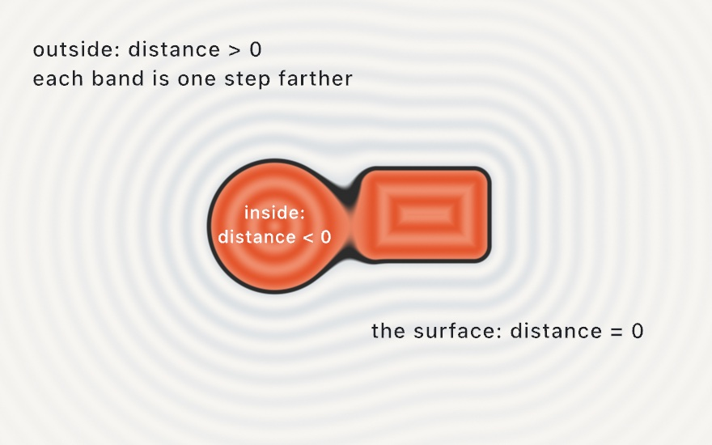
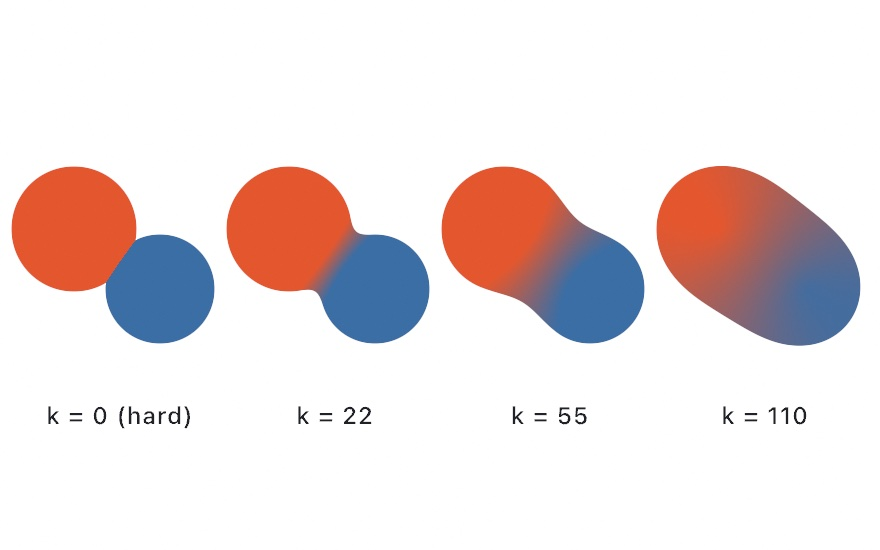
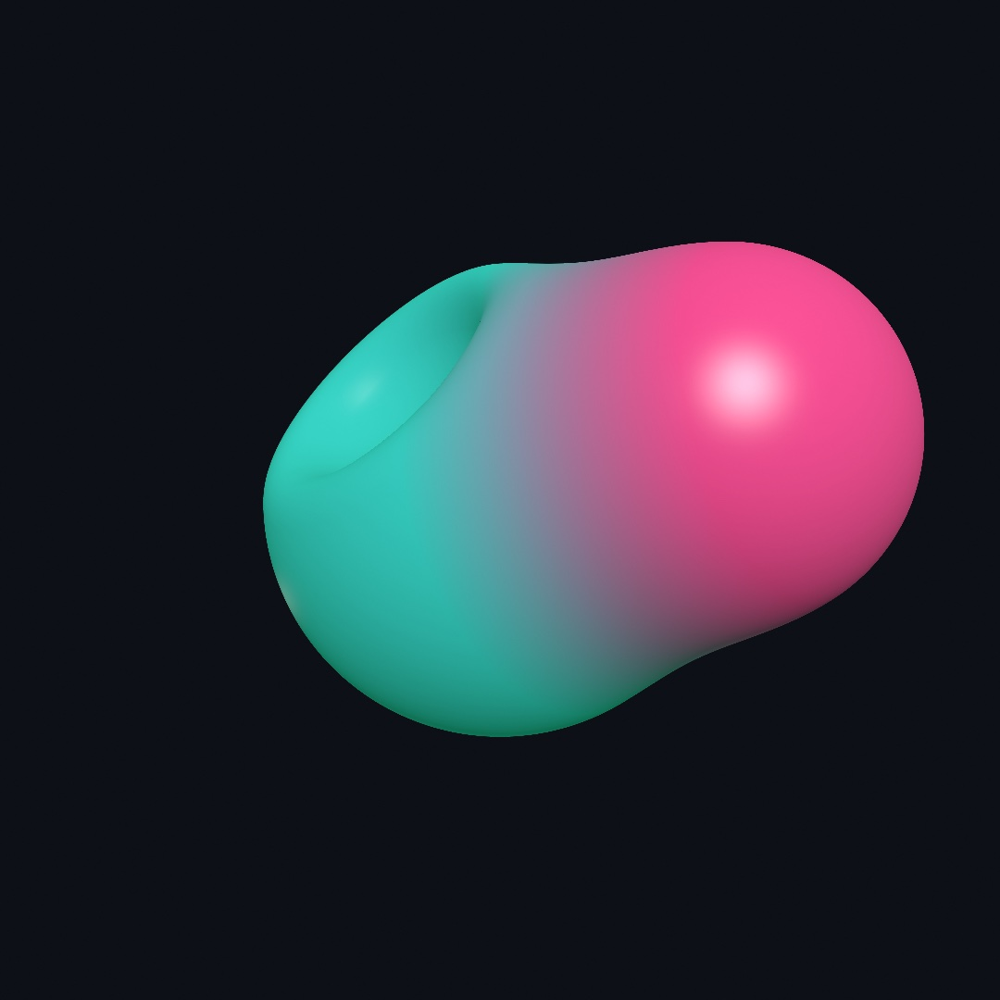
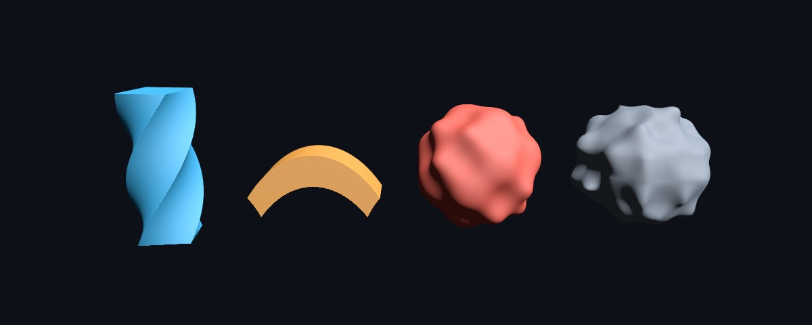
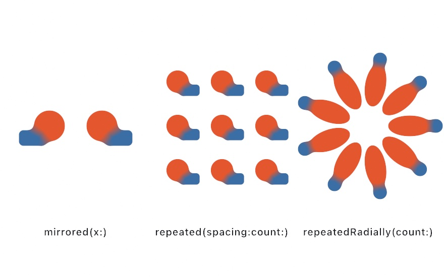
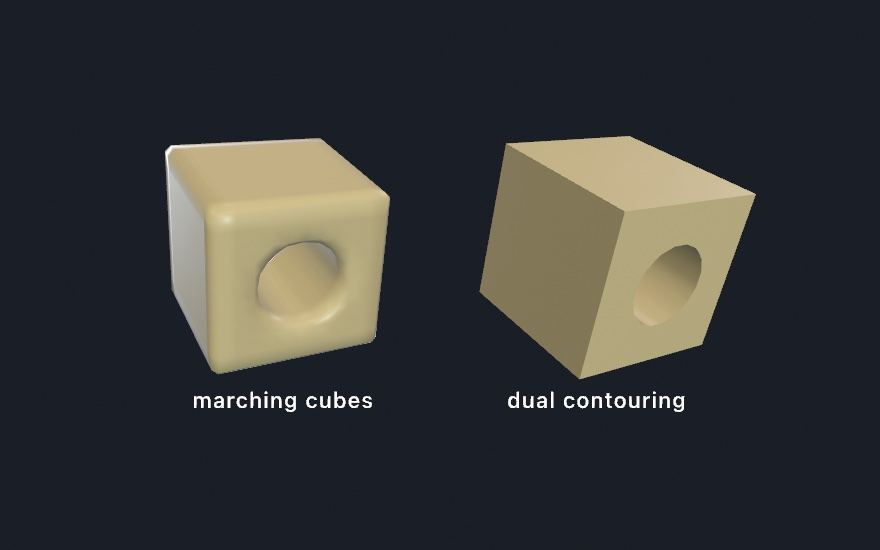

#### <sup>[Ollin](../README.md) → [Guide](README.md) → Chapter 32</sup>

---

# 32. Sculpting with fields


A shape stored as a distance field can melt into its neighbors, carve them, and stay one surface however you push it. This chapter builds shapes that way, flat on the canvas and then in space, where a tracer finds the surface by hopping along each ray. The sculpture above is four melted lobes, twisted a little and breathing slowly, and you can orbit it with the mouse. Other ways to combine fields, space folded into copies, fractals, and the way out into a mesh follow it.

## A shape as a question: the signed distance field

[Chapter 14](14-FieldsAndFlow.md) defined a field as an answer at every point. A **signed distance field** is a shape stored that way. Ask any point of the canvas and it answers with one number, how far away the nearest surface is. The sign says which side you are on. Positive is outside, negative is inside, and zero is on the boundary.

<picture>
  <source media="(prefers-color-scheme: dark)" srcset="Images/32-SculptingWithFields/FieldMap-dark.jpg">
  
</picture>

The shape is not stored as an outline. The bold line is only the set of places where the field answers zero. Each band around it is a set of places at one distance from the shape. You have seen the idea before. [Chapter 18](18-YourFirstShader.md) drew a circle from each pixel's distance to its center, with `smoothstep` softening the edge. [Chapter 21](21-PicturesYouSolve.md#a-field-you-measure-the-distance-field) measured a distance field from the marks on a layer. What is new here is what the representation allows. If two shapes are each a distance field, then combining the two answers at every point combines the shapes.

## Melting: the smooth minimum

The simplest combination is the union, both shapes at once. At every point you have two answers, one from each field. The nearer surface is the one that counts, so the union answers with the smaller of the two, their minimum. Taking the minimum joins the shapes with a hard crease where they meet, like two overlapping outlines in [Chapter 15](15-ShapesAsMaterial.md).

<picture>
  <source media="(prefers-color-scheme: dark)" srcset="Images/32-SculptingWithFields/MeltStrip-dark.jpg">
  
</picture>

The strip melts two circles. At `k = 0` the union is hard, and the circles meet in a crease. The **smooth minimum** removes that crease, and it takes one more number, `k`. Far from the seam, one answer is much smaller than the other, and the smooth minimum returns it unchanged. Near the seam, the two answers are almost tied, and there it answers a little less than both. A point in the gap that answered just above zero now answers zero or less. It counts as inside, so the edge moves out to it. That fills the crease with a curve. At an exact tie the dip is a quarter of `k`, and it shrinks to nothing where the two answers are `k` apart. So `k` is how wide the melt is. Along the strip, as `k` grows, the seam becomes a rounded inside corner, then a neck, and then the pair is one body. [Appendix B](B-JustEnoughMath.md#min-melts-max-trims) sets the smooth minimum beside `max`, the intersection.

The colors melt too. The smooth union blends the two shapes' colors across the seam, which is what makes the result read as one object. In Ollin the smooth minimum is `smoothUnion`, a method on the `SDF` value type:

```swift
import Ollin

final class Melt: Sketch {
    override func draw() {
        background(Color(hex: 0x101318))
        noStroke()
        let k = 20 + (sin(time) * 0.5 + 0.5) * 90

        let blob = SDF.circle(radius: 130).colored(Color(hex: 0xE4572E))
            .smoothUnion(SDF.rect(width: 240, height: 140, cornerRadius: 28)
                .colored(Color(hex: 0x3A6EA5))
                .at(130, 40), k: k)

        drawSDF(blob.at(width / 2, height / 2))
    }
}
```

<!-- Figure waiting on its prose: Images/32-SculptingWithFields/Melt.jpg (Figures/32-SculptingWithFields/Melt.swift), the melt in two dimensions, for the listing above. Rendered on the Mac at frame 0. -->

Run it and watch the seam. `SDF.circle` and `SDF.rect` are field values, like a `Shape` or a `Color`. `.at` moves one, `.colored` paints one, `.smoothUnion` merges two into a new field, and `drawSDF` draws whatever field you hand it in a single pass. Here `k` swings between 20 and 110 canvas points with `sin(time)`. It is the dial that does most of the work in this chapter, so put it on a parameter and try it.

The order of a chain matters. Every call wraps the field before it, so `circle.at(p).scaled(2)` scales the moved circle, and it lands twice as far out. `circle.scaled(2).at(p)` scales it in place and then moves it. Read a chain from the inside out and it always makes sense.

## Into space: `SDF3D` and `drawSDF3D`

Everything above lifts into 3D nearly unchanged. `SDF3D` builds fields in space, and `drawSDF3D` draws the merged surface through [Chapter 26](26-3DGently.md)'s camera, lit by its lights and shaded with its materials. `smoothSubtract` is the carving form of the same melt: it cuts one field out of another and rounds the edge of the cut.

```swift
import Ollin

final class FirstMarch: Sketch {
    override func draw() {
        background(Color(hex: 0x0D1017))
        camera(.orbiting(target: .zero, radius: 5.2, azimuth: 0.5,
                         elevation: 0.3, fieldOfView: .pi / 4))
        material(.jade)

        let blob = SDF3D.sphere(radius: 1).colored(Color(hex: 0x39D0C8))
            .smoothUnion(SDF3D.sphere(radius: 0.72)
                .at(1.0, 0.42, 0.1)
                .colored(Color(hex: 0xFF4F97)), k: 0.5)
            .smoothSubtract(SDF3D.sphere(radius: 0.55).at(-0.45, 0.75, 0.5), k: 0.25)

        drawSDF3D(blob)
    }
}
```



The two spheres are not two surfaces joined at a seam. They are one surface, because the field underneath is one function. Building that from triangle meshes would mean cutting both spheres and stitching a new surface between them. The 3D leaves include the mesh primitives, sphere, box, torus, capsule, cylinder, cone, and octahedron, and more, such as an ellipsoid. `line(from:to:radius:)` is a stroke between two points, for sketching limbs and branches for the melt to fill out. Fields and meshes share one scene and hide each other. The [combinators reference](../Docs/Drawing/Combinators.md#fields-3d) has the full catalog.

## How the picture gets made: sphere tracing

A mesh is triangles, and the GPU knows how to draw triangles. A field is a function, so it needs another way to become pixels. For each pixel, a ray leaves the camera, and the field is asked how far the nearest surface is. The answer is a promise that nothing is closer than that, so the ray can safely hop exactly that far. Then it asks again and hops again:

<picture>
  <source media="(prefers-color-scheme: dark)" srcset="Images/32-SculptingWithFields/MarchRay-dark.jpg">
  
</picture>

The hops shrink wherever the ray passes close to a surface, and they grow again in open space. No hop is longer than the distance to the nearest surface, so the ray lands on a surface without stepping through it. You can see them tighten as the ray passes over the lower shape. This is called **sphere tracing**. The same number that lets shapes melt steers the rays that draw them.

You get all of this without writing any of it. The setting to know is `raymarchQuality(_:)`. Tracing costs by the pixel, so the live window traces within a resolution budget. With the default setting, exports render at full quality. If a heavy field stutters while you sketch, `raymarchQuality(.performance)` lowers that budget to a quarter of the resolution. An explicit setting applies to exports too.

## Bending the whole form: distortions

Every field so far is a shape you could build from parts. A distortion bends a whole field at once. It is for a column that twists as it rises, a bar that curls, and a surface that ripples or turns to rock. Three of them reimplement Inigo Quilez's twist, bend, and displacement operators, and the fourth adds a noise relief.



Each one is a method on the field, like `.at`:

```swift
SDF3D.box(width: 0.8, height: 2.4, depth: 0.8)
    .twisted(1.2)                              // radians of twist per unit of height
SDF3D.box(width: 2.2, height: 0.5, depth: 0.7)
    .bent(0.6)                                 // radians of curl per unit along x
SDF3D.sphere(radius: 0.95)
    .displaced(amplitude: 0.1, frequency: 6)   // ripples from a product of sines
SDF3D.sphere(radius: 0.95)
    .roughened(amplitude: 0.15, frequency: 3)  // a noise relief, the rock look
```

`twisted` screws the cross-section around the y axis, and `bent` curls the form about the z axis. For another axis, rotate the field first: `.rotatedX`, `.rotatedY`, and `.rotatedZ` turn a field by an angle in radians about that axis through its origin. `amplitude` is how far the ripples or the relief push the surface, and `frequency` is how tightly they pack.

A distortion has a cost the plain shapes do not. A bent field no longer answers with the exact distance to its surface. It can answer a little more than the true distance, and a ray that hops that far could step through the surface. So the tracer takes shorter hops on a distorted field, sized to keep a ray from stepping through the surface. The stronger the distortion, the shorter the hops, so strong settings trace more slowly. The [`3D/Raymarching/RaymarchedDistort`](../Examples/3D/Raymarching/RaymarchedDistort/Sketch.swift) example shows all four, three with their amounts swinging.

## The light this needs: materials and shadows on a field

A field shades like a mesh, so the finishes of [Chapter 26](26-3DGently.md#materials) and [Chapter 28](28-MaterialsAndSurroundings.md) reach it. `material(.jade)` gives a melt its glow, an `environment(_:)` lights it as it lights a solid, and `castShadows()` grounds it. A field shadows itself, and it trades shadows with the meshes around it. `material(.glass(...))` works on one too. A tinted interior deepens over the same distance it would inside a mesh of that shape. So a green glass ball comes out the same green, drawn as a field or as a mesh. What is left is the light itself. [Chapter 33](33-TracedLight.md) follows it as it bounces and as it passes through glass, and shows what a frame can borrow from the frames before it.

## Putting it together: molten

The sculpture at the top of the chapter is one field built from the steps. Four lobes meet in smooth unions, and a twist bends the body. A polished glaze under studio light finishes it, over a floor that catches its shadow. Make `MySketches/Molten.swift`:

```swift
import Ollin

final class Molten: Sketch {
    override func setup() { seed(9) }

    override func draw() {
        background(Color(hex: 0x0D1017))
        cameraShowcase(target: Vector3(0, 1.0, 0), radius: 6.4,
                       elevation: 0.2, fieldOfView: .pi / 4.2)
        environment(.studio.lightingOnly())
        toneMap(.aces, exposure: 1.05)
        directionalLight(Color(white: 0.85), direction: Vector3(-0.5, -1, -0.35),
                         intensity: 0.55)
        castShadows()

        // The floor that catches the sculpture's shadow.
        material(.matte)
        fill(Color(hex: 0x30343F))
        drawPlane(width: 30, depth: 30)

        // The glaze: four lobes melting into one body, breathing.
        let breathe = 0.42 + signedNoise(time * 0.25) * 0.1
        let glaze = Color(hex: 0x9FDCD3)
        let body = SDF3D.sphere(radius: 0.8).at(0, 0.85, 0)
            .smoothUnion(SDF3D.ellipsoid(radiusX: 0.62, radiusY: 0.4, radiusZ: 0.62)
                .at(0.72, 0.5, 0.25), k: breathe)
            .smoothUnion(SDF3D.torus(radius: 0.6, tube: 0.19)
                .at(-0.55, 1.25, -0.1).rotatedZ(0.5), k: 0.4)
            .smoothUnion(SDF3D.sphere(radius: 0.4).at(-0.2, 1.95, 0.3), k: 0.5)
            .twisted(0.3)
            .colored(glaze)

        material(.dielectric(roughness: 0.07))
        drawSDF3D(body)
    }
}
```

Run it and drag to orbit. Here is how the steps show up in it:

- **The smooth minimum.** Three `smoothUnion`s join a sphere, an ellipsoid, a torus, and a small sphere into one body. The first melt's `k` comes from `signedNoise` of the slow clock. The seam between the big sphere and the ellipsoid at its foot eases in and out, and the body seems to breathe.
- **`SDF3D`.** The lobes are 3D leaves placed with `.at`, and `.colored` paints the finished body one color. The torus is moved and then turned. By the chain-order rule from the melting step, `.rotatedZ(0.5)` then swings it about the z axis through the origin. That moves its center about 0.7 units as well as tilting it.
- **Sphere tracing.** `drawSDF3D` traces the body, and `cameraShowcase` orbits it, so every frame traces it from a new place.
- **Distortions.** `.twisted(0.3)` screws the body a little around the y axis, after the unions, so the lobes twist together.
- **The light.** `.dielectric(roughness: 0.07)` is a smooth nonmetal, the finish of a glaze. The mesh floor and the traced field share the frame. The field drops its shadow onto the plane, and each would hide the other if they overlapped.

Then make it yours:

- Replace a lobe with `SDF3D.line(from:to:radius:)` and grow the drop a limb. A few chained lines and a big `k` are how creatures start.
- Trade the glaze for `.metal(roughness: 0.15)` with `environment(.sunset)`, and add [Chapter 33](33-TracedLight.md)'s `rayTracedReflections()` if your Mac traces.
- Carve it with one `smoothSubtract` of a large sphere, and the sculpture becomes a grotto.
- Turn the torus before you move it, with `.rotatedZ(0.5).at(-0.55, 1.25, -0.1)`. It tilts in place instead of swinging around the origin.

The sculpture breathes and turns on its own, so keep it as a video. `swift run OllinLive MySketches/Molten.swift --export-video molten.mp4 --seconds 12` records the first twelve seconds. An export renders every frame of the field at full quality.

## More ways to combine: the other verbs, joinery, the block form, and sculpting

Molten melts every lobe with one verb, `smoothUnion`. Fields combine in other ways too. They carve, keep only an overlap, or become a shape halfway between two. They meet in hard-edged joints, merge ordinary draw calls, and build up in a block the way clay does.

### Carving, overlapping, and halfway: the other verbs

The other verbs are the set operations of distance fields, and a morph. They are for cutting a hole, keeping where two shapes cross, and finding a shape between two. They come from Inigo Quilez's catalog, like the smooth minimum. The union takes the minimum of two answers, as the melting step showed. The intersection takes the maximum, so only the overlap answers inside. Subtracting negates one answer first, which swaps that shape's inside and outside, and then takes the maximum. What is left is the first shape wherever the second is not. The picture has six of them on one circle and one rounded rectangle.

<picture>
  <source media="(prefers-color-scheme: dark)" srcset="Images/32-SculptingWithFields/Verbs-dark.jpg">
  
</picture>

```swift
a.union(b)               // either
a.smoothUnion(b, k: 34)  // either, melted
a.morph(b, amount: 0.5)  // a shape halfway between the two
a.subtract(b)            // a with b carved away
a.smoothSubtract(b, k: 34)
a.intersect(b)           // only the overlap
a.smoothIntersect(b, k: 34)
```

These are [Chapter 15](15-ShapesAsMaterial.md)'s booleans on fields, plus two things outlines can't do. The smooth forms are one. `morph` is the other. It blends the two answers themselves, so at `0.5` you get an in-between shape rather than a crossfade of two pictures. Two modifiers go with them. `.rounded(12)` inflates any field with soft corners, and `.onion(8)` hollows it into a shell.

### Joins like joinery: the machined family

The machined family joins two fields with a shaped seam instead of a melt. It is for forms that should look built rather than poured: a chamfer, steps, a row of columns along the join. These follow hg_sdf, the distance-field library published by the demogroup Mercury. `chamferUnion`, `stairsUnion`, and `columnsUnion` shape the seam. Engrave and groove cut into a surface along another, tongue raises a ridge there, and pipe keeps only a round bead where two surfaces cross. The [combinators reference](../Docs/Drawing/Combinators.md#combining) has the full set, and the [`3D/Raymarching/RaymarchedJoinery`](../Examples/3D/Raymarching/RaymarchedJoinery/Sketch.swift) example builds with them.

### Merging ordinary draw calls: the block form

The block form merges draw calls instead of chained fields. It is for when you would rather draw than build a chain. Its scoped shape was studied from Shader Park, a library for sculpting with distance fields. Every call inside the block becomes a field, and the block joins them all when it closes:

```swift
translate(width / 2, height / 2)
fill(Color(hex: 0xE4572E))
smoothUnion(k: 18) {
    drawCircle(0, 0, 110)
    drawRect(center: Vector2(120, 30), width: 190, height: 80, cornerRadius: 20)
    drawNgon(-105, 40, 62, sides: 6)
}
```

Every analytic region shape can join a block: circles, rectangles, n-gons, and more. That includes shapes the `SDF` type doesn't name, like hearts and trapezoids. Polygons, paths, and filled arcs stay out. `drawNgon(x, y, radius, sides:)` is a regular polygon. Each call's own `fill` becomes its color in the melt.

### Building up and carving away: the sculpt block

The `sculpt { }` block turns the verbs into working state. It is for forms you build up rather than compose, the way a potter adds clay and cuts it away. Shapes `add()` on or `carve()` away, melting by the current `blend(_:)` amount, and the block reads top to bottom. Shader Park was studied for the sculpt block too.


```swift
sculpt {
    blend(0.3)                 // melt amount for what follows
    fill(Color(hex: 0xD96F4E))
    drawSphere(radius: 1.0)                                        // the body
    withState { translate(0, 0.95, 0)
                drawTorus(radius: 0.5, tube: 0.16) }               // a lip melts on
    carve()                    // now shapes cut away
    withState { translate(0, 1.1, 0); drawSphere(radius: 0.52) }   // the hollow
    add(); blend(0.05)         // back to adding, nearly hard
    withState { translate(0, 0.35, 1.05); rotateX(.pi / 2)
                drawTorus(radius: 0.34, tube: 0.09) }              // a ring on the front
}
```

Flip one `add()` to `carve()` and a bump becomes a dent. That one-word edit suits live coding.

## Space folded and detail without end: domain repetition and fractals

Molten is one body with nothing repeated in it. A field can also answer for many copies of one shape, and a few fields have detail at every scale. Both come from changing the question rather than the shape.

### Folding space: domain repetition

A domain operator rewrites each query point before the field answers. It folds the point across a mirror, wraps it into a cell, or rotates it into a wedge. It is for mirrored pairs, tilings, and rosettes, where one shape answers for many copies. These follow the domain operators of hg_sdf.

<picture>
  <source media="(prefers-color-scheme: dark)" srcset="Images/32-SculptingWithFields/DomainFold-dark.jpg">
  
</picture>

```swift
cluster.at(52, 0).mirrored(x: true)                               // a facing pair
cluster.scaled(0.72).repeated(spacing: Vector2(88, 88), count: 1)  // a 3×3 tiling
petal.at(82, 0).repeatedRadially(count: 9)                         // a rosette
```

There is still only one cluster. The mirror needs the cluster moved off its axis first, or it folds onto itself, and the tiling shrinks it to fit its cells. `count` is how many copies go to each side of the first, so `count: 1` makes a three-by-three tiling. The copies cost nothing to add, so a thousand-copy tiling costs what one copy costs. All three work in 3D too, where `repeatedRadially` fans a wedge around an axis and a mirrored melt becomes a symmetric creature. The radial fold is exact when the repeated content is symmetric within its wedge. An asymmetric cluster can show a faint seam where the wedges meet. So build the wedge symmetric about its center line, like the petal in the rosette panel.

### Infinite detail: the fractal leaves

Every leaf so far had a distance you could write down. A sphere's is the length of the point minus its radius, and the rest are a page of the same kind of algebra. Three leaves have no such formula. They are fractals. Each one is a rule applied to a point over and over, and the shape is the set of points the rule never flings away. They are for forms with detail at every scale. The Mandelbulb is Daniel White and Paul Nylander's find from 2009, and the Mandelbox is Tom Lowe's from 2010. The Menger sponge is Karl Menger's, from 1926. John C. Hart, Daniel Sandin, and Louis Kauffman first estimated a fractal's distance from how fast the rule flings a point away, in 1989.


```swift
SDF3D.mandelbulb(power: 8, iterations: 8, radius: 1.2)
SDF3D.mengerSponge(iterations: 3, size: 2.1)
SDF3D.mandelbox(scale: -1.5, iterations: 12, size: 2.2)
```

So the field estimates its distance instead. It runs the rule a few times from the query point and watches how quickly the point escapes. A point about to be flung far must be far from the set. A point that keeps circling must be near it. That rate becomes a length the tracer can hop by, and everything else in this chapter works unchanged. A fractal melts into a sphere, carves a box, mirrors, and repeats.

`iterations` sets the balance of detail and cost, since every hop runs the rule again. The bulb's `power` is its own shape. Eight is the classic value, and a fractional power is a different bulb, so sweeping it slowly makes it breathe. The box's `scale` plays the same role. The finest detail you can see is set by the tracer, not by the fractal. To look deeper, make the leaf bigger and raise `iterations` rather than moving the camera in. The [`3D/Raymarching/RaymarchedFractals`](../Examples/3D/Raymarching/RaymarchedFractals/Sketch.swift) example puts each one's settings in the inspector.

## The other way out: field to mesh

Molten stays a field from start to finish, traced to pixels every frame. Sometimes you want a field to become an object instead, one you can export, place a hundred times, or hand to a fabricator. `isosurface` does that. It returns an ordinary `Mesh`, so it lights, takes materials and shadows, and exports like anything else you draw.

### Soft spheres that add up: metaballs

Metaballs are soft spheres whose values add up, so balls near each other swell into one form. They are for blobs, drops, and anything that should fuse and part. Jim Blinn's 1982 blobby model named the idea. Ollin's balls follow the soft objects of Geoff Wyvill, Craig McPheeters, and Brian Wyvill (1986), whose influence reaches zero at a set distance.


```swift
var blobs = Metaballs()
blobs.add(at: Vector3(-0.9, 0.25, 0), radius: 0.62)
blobs.add(at: Vector3(0.5, -0.2, 0.15), radius: 0.52)
blobs.add(at: Vector3(1.4, 0.45, -0.2), radius: 0.40)
drawMesh(blobs.mesh(resolution: 26))
```

`radius` is the size a ball reads at on its own. Put two within reach of each other and the values in the gap add up to more than either one makes there. The surface swells across the gap, and the pair runs together. Move them apart and the bridge necks down and snaps. `level` is the value the surface is drawn at, as in `Metaballs(level: 0.4)`. Lowering it fattens everything and makes blobs merge from further away, and raising it thins them until they separate. A negative `strength`, as in `add(at:radius:strength:)`, carves into a neighbor instead of joining it.

At `resolution: 26` the triangles are big enough to see. Call `wireframe()` before `drawMesh` and they show, as in the right panel. Drawn solid, the same mesh still looks smooth, because its normals come from the field rather than from the flat faces.

### Any field as a mesh: isosurface

`isosurface` turns any field into a mesh, not only metaballs. It walks a grid of cubes through space, asks the field for a value at every cube corner, and stitches the crossings into triangles. It is for sculpting your own field and keeping the result. The method is marching cubes, from William Lorensen and Harvey Cline in 1987, the 3D form of the contours [Chapter 14](14-FieldsAndFlow.md) drew.

The one thing to know is which side it treats as solid. The surface wraps the region where the field runs above the level. So a distance function, which is negative inside, needs a minus sign in front of it.

The bump one ball is made of is yours to build from, too. `Metaballs.falloff(distanceSquared:radius:)` is what a ball of that radius reads at that squared distance from its center. It reads 1 at the center, a half at the radius, and nothing from twice the radius out. Feed it a radius that changes with the direction and the ball's rim wobbles. Feed it a distance measured in a squashed space and the ball stretches. The sum of such reads is a field like any other:

```swift
let wobbly = isosurface(at: 0.5, in: Box3(center: .zero, size: Vector3(3, 3, 3)), resolution: 48) { p in
    let r = 1 + 0.25 * signedNoise(p.x * 2 + 10, p.y * 2, p.z * 2)
    return Metaballs.falloff(distanceSquared: p.lengthSquared, radius: r)
}
```

`p.lengthSquared` is the squared distance from the center, with no square root taken.

`resolution` is how many cubes the grid has along the longest side of the box, and the shorter sides get proportionally fewer. The cost grows with the cube of `resolution`. `Box3(center:size:)` is the region the grid covers.

### Corners that stay sharp: dual contouring

Marching cubes can only put a vertex on an edge of the grid. A corner that falls inside a cube therefore comes out as a bevel across it. A block's corners are rounded to the size of a cell, and only a very fine grid hides it. Dual contouring puts one vertex in each cube, where the field's own normals say the surface is. It is for fields with edges to keep, and it comes from Tao Ju, Frank Losasso, Scott Schaefer, and Joe Warren (2002). Three faces meet at a corner, so the vertex lands on the corner, and a bored hole keeps its rim.



Ask for it with `method: .dualContouring`:

```swift
let box = Box3(min: Vector3(-1.3, -1.3, -1.3), max: Vector3(1.3, 1.3, 1.3))
let bored = isosurface(at: 0, in: box, resolution: 14, method: .dualContouring) { p in
    let q = Vector3(abs(p.x) - 1, abs(p.y) - 1, abs(p.z) - 1)
    let block = Vector3(max(q.x, 0), max(q.y, 0), max(q.z, 0)).length + min(max(q.x, max(q.y, q.z)), 0)
    let hole = (p.x * p.x + p.y * p.y).squareRoot() - 0.5
    return -max(block, -hole)
}
```

`block` is the distance to a box two units across, from Quilez's catalog. `hole` is the distance to a cylinder of radius 0.5 along z. `max(block, -hole)` is the subtraction from the verbs above, and the minus in front makes it solid for `isosurface`. Both blocks in the picture come from the same fourteen cells across, and only where the vertices sit differs. The extra work is about a dozen more reads of the field at every crossing.

So there are two ways out of a field, and they cost differently. `drawSDF3D` shades straight to pixels and pays by the pixel. `isosurface` makes geometry and pays by the volume, which grows with the cube of `resolution`. Reach for the mesh when you need an object, and for the traced field when you want it on screen.

## Where this comes from

Distance fields as a drawing medium are the craft of the demoscene and the Shadertoy community, and above all of Inigo Quilez. His catalogs of distance functions, the polynomial smooth minimum, and his raymarching articles underlie nearly everything here. The attribution notes credit them item by item. John C. Hart formalized sphere tracing in 1996. The entries after Molten name their own sources, and the full credits are in the project's [attribution notes](../ATTRIBUTION.md).

## Go deeper

- [SDF combinators](../Docs/Drawing/Combinators.md): the complete reference, including the machined joint family, gradient paint on merged fields, per-axis stretching, the infinite plane, the distortions, the fractal leaves, and the quality settings.
- [Isosurfaces and metaballs](../Docs/Generators/Isosurface.md): the mesh route in full, including all three merge arguments, how the marching handles the faces that could be joined two ways, and the resolution and cost rules.
- [Combining 3D features](../Docs/3D/Combining.md): what fields take (materials, shadows, environments) and where they differ from meshes.
- Appendix B draws this chapter's math, one picture per idea: [Per-pixel thinking and distance](B-JustEnoughMath.md#per-pixel-thinking-and-distance).
- Worked examples for the light on a field: [`Examples/3D/Raymarching/RaymarchedEnvironment`](../Examples/3D/Raymarching/RaymarchedEnvironment/Sketch.swift) lights a traced field with an environment. The same finishes on meshes are in [`Examples/3D/Materials/PhysicalMaterials`](../Examples/3D/Materials/PhysicalMaterials/Sketch.swift), [`Examples/3D/Materials/Glass`](../Examples/3D/Materials/Glass/Sketch.swift) (hold space to drop the traced view through the glass), [`Examples/3D/Environments/ImageBasedLighting`](../Examples/3D/Environments/ImageBasedLighting/Sketch.swift), [`EnvironmentGallery`](../Examples/3D/Environments/EnvironmentGallery/Sketch.swift) (steps through the eight bundled environments), and [`ProceduralSky`](../Examples/3D/Environments/ProceduralSky/Sketch.swift).
- Worked example for the mesh route: [`Examples/3D/Geometry/Metaballs`](../Examples/3D/Geometry/Metaballs/Sketch.swift), a cluster that keeps fusing and parting, with the merge level and the grid detail on parameters.
- Worked examples: [`Examples/Shapes/Combinators`](../Examples/Shapes/Combinators/Sketch.swift) and [`CombinatorsGradient`](../Examples/Shapes/CombinatorsGradient/Sketch.swift) in 2D; in 3D, [`Examples/3D/Raymarching/RaymarchedSDF`](../Examples/3D/Raymarching/RaymarchedSDF/Sketch.swift), [`RaymarchedShapes`](../Examples/3D/Raymarching/RaymarchedShapes/Sketch.swift), [`RaymarchedDistort`](../Examples/3D/Raymarching/RaymarchedDistort/Sketch.swift), [`RaymarchedSculpt`](../Examples/3D/Raymarching/RaymarchedSculpt/Sketch.swift), [`RaymarchedClay`](../Examples/3D/Raymarching/RaymarchedClay/Sketch.swift), [`RaymarchedJoinery`](../Examples/3D/Raymarching/RaymarchedJoinery/Sketch.swift), [`RaymarchedDomain`](../Examples/3D/Raymarching/RaymarchedDomain/Sketch.swift), [`RaymarchedRadial`](../Examples/3D/Raymarching/RaymarchedRadial/Sketch.swift), [`RaymarchedFractals`](../Examples/3D/Raymarching/RaymarchedFractals/Sketch.swift), and [`RaymarchedPlane`](../Examples/3D/Raymarching/RaymarchedPlane/Sketch.swift).

---

[Contents](README.md#contents) · Previous: [Chapter 31, Characters, vehicles, and cloth](31-CharactersAndCloth.md) · Next: [Chapter 33, Traced light](33-TracedLight.md)
