#### <sup>[Ollin](../README.md) → [Guide](README.md) → Chapter 32</sup>

---

# 32. Seeing

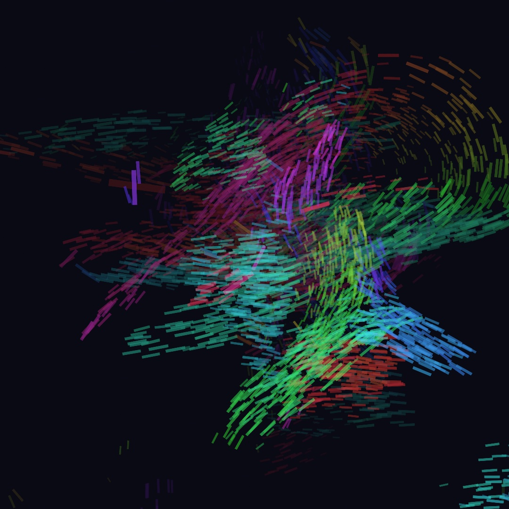

A camera gives a sketch someone to answer. You read the webcam first as a picture, then through trackers that turn each frame into values you read in `draw()`. They find a body's joints, a person lifted out as pixels, and the motion in the picture, on the Mac with nothing sent away. The brush above paints with that motion. After it come outlines and print, one thing followed, labels, models of your own, the camera in a 3D scene, the screen, and slit scan.

## The webcam is an image

Everything starts with `OllinVision`'s `Camera`, a source of frames you start once and then draw like any image.

```swift
import Ollin
import OllinVision

final class Mirror: Sketch {
    let camera = Camera()

    override func setup() { try? camera.start() }

    override func draw() {
        background(.black)
        drawFrame(camera)
    }
}
```

Run it and your camera's picture fills the canvas. `drawFrame(camera)` draws the latest frame letterboxed into the canvas, fitted without stretching like a photo in a mat. Until the first frame arrives, it shows a standard "Waiting for camera…" notice and returns `nil`. After that it returns the rectangle the picture landed in. Keep that rectangle, because the trackers below use it to place what they find. Using the camera needs permission, and macOS asks once, the first time `start()` runs. `Camera(.continuity)` uses a nearby iPhone as the camera, and `.external` a USB webcam.

### When there is no camera: stills and footage

Not every Mac has a camera, and a sketch may not have permission to use the one there is. `Camera.orStill(_:)` gives back a running camera where there is one, and a still picture where there is not. It takes the place of `let camera = Camera()` as a stored property:

```swift
import OllinSamplePhotos

let feed = Camera.orStill(SamplePhoto.reaching.load())
```

It starts the camera itself, so a sketch that uses it has no `start()` to call. What comes back is a **feed**, anything that hands out frames, the way a camera does. `drawFrame` and every tracker take a feed, so `drawFrame(feed)` draws it, and a tracker attaches to it as it attaches to a camera. On the first run, before you have allowed the camera, it hands back the still, and the next run finds the camera.

<picture>
  <source media="(prefers-color-scheme: dark)" srcset="Images/32-Seeing/StandingIn-dark.jpg">
  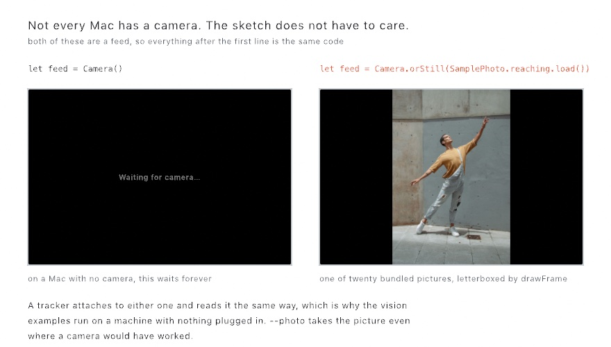
</picture>

Without that line, a Mac with no camera shows the notice on the left for as long as you leave it running. With it, the picture on the right arrives instead, drawn by the same `drawFrame` call, and the sketch never learns which one it got.

Ollin bundles [twenty pictures and a short film](../Docs/Drawing/SamplePhotos.md) for this. There are four faces, four whole figures, two tables from above, four streets, two landscapes, a page, a pair of hands and two surfaces. So a sketch that reads people has people to read, and the vision examples run on a machine with nothing plugged in. `--photo` on launch takes the picture even where a camera would have worked. Then you can take a screenshot of the window for a sketch that is normally live.

The film is a feed too. `VideoPlayer` plays a video file. `SampleClip.dance` is the bundled clip, a man dancing on a plain ground in front of a camera that never moves:

```swift
import OllinSamplePhotos
import OllinVideo

let film = try! VideoPlayer(url: SampleClip.dance.url)   // the bundled clip is always there

override func setup() {
    film.loops = true
    film.play()
}

override func draw() {
    drawFrame(film)
}
```

`try!` is safe here because the clip ships with Ollin. For a file of your own, `VideoPlayer(path:)` takes its path. Declare `var film: VideoPlayer?` and set it with `try?` inside `setup()`, and a missing file leaves it `nil` instead of stopping the sketch. The frames arrive on the GPU, so drawing them costs almost nothing, and `drawFrame` letterboxes them the same way.

While you build a sketch that reads people, rehearse it on footage. Standing in front of the camera for every change is tiring, and no two takes move the same way. A clip moves the same way every run, so the change you just made is the only thing that changed. Swap the camera back in once the sketch reads the film well. A tracker reads a clip only while it plays in the live window. During an export it reads nothing, because its frames arrive on the live clock.

## Trackers: attach, then read

Seeing more than pixels is the job of the **trackers**. Each one attaches to a feed and runs one kind of perception over its frames, publishing typed results your sketch reads every frame:

<picture>
  <source media="(prefers-color-scheme: dark)" srcset="Images/32-Seeing/TrackerFlow-dark.jpg">
  
</picture>

Here a `FaceTracker` finds faces. A face comes back with its **landmarks**, named points along its outline, brows, eyes, nose and lips:

```swift
import Ollin
import OllinVision

final class Faces: Sketch {
    let camera = Camera()
    lazy var faces = FaceTracker(camera)

    override func setup() { try? camera.start() }

    override func draw() {
        background(.black)
        guard let rect = drawFrame(camera) else { return }

        noFill(); stroke(.green); strokeWeight(2)
        for face in faces.faces {
            drawRect(face.bounds(in: rect))
            drawPolyline(face.landmarks(.faceContour, in: rect))
        }
    }
}
```

> **Swift note.** `lazy var faces = FaceTracker(camera)` builds the tracker the first time it's touched. So its declaration can mention `camera`, another property of the same class. Plain `let` properties initialize too early for that.

Every tracker follows that pattern. The analysis runs on a background thread, throttled to what the machine keeps up with. Under load it skips analysis frames rather than queueing them, and the displayed frame is never dropped. So your `draw()` stays smooth and reads the most recent result.

The second half of the diagram is about coordinates. Trackers report geometry in **normalized** coordinates, `0...1` across the frame, with the origin at the lower left and y pointing up. The canvas is pixels from the top left, with y pointing down, and the frame usually landed letterboxed somewhere inside it. So every result has to be flipped and scaled into the rectangle you drew the frame in. You never do that math yourself. Every result type carries `in:` helpers, among them `bounds(in: rect)`, `point(_:in:)`, and `landmarks(_:in:)`. Each takes the rectangle `drawFrame` returned and answers in canvas terms.

Pass `mirrored: true` to them when the sketch should answer like a bathroom mirror, left for left. It usually feels right for a sketch you stand in front of. `drawFrame` has no such switch. To show the feed flipped as well, draw it as `withState { translate(width, 0); scale(-1, 1); drawFrame(camera) }`, which flips the canvas left for right.

## The body as a controller: hands, faces, and bodies

The face listing drew what it found. A sketch can also steer by it. A fingertip can stand in for the mouse, a head's turn can swing a scene, and a raised arm can start something. The figure shows the named parts of the three flat trackers, and a fourth reads a body in space:

<picture>
  <source media="(prefers-color-scheme: dark)" srcset="Images/32-Seeing/Landmarks-dark.jpg">
  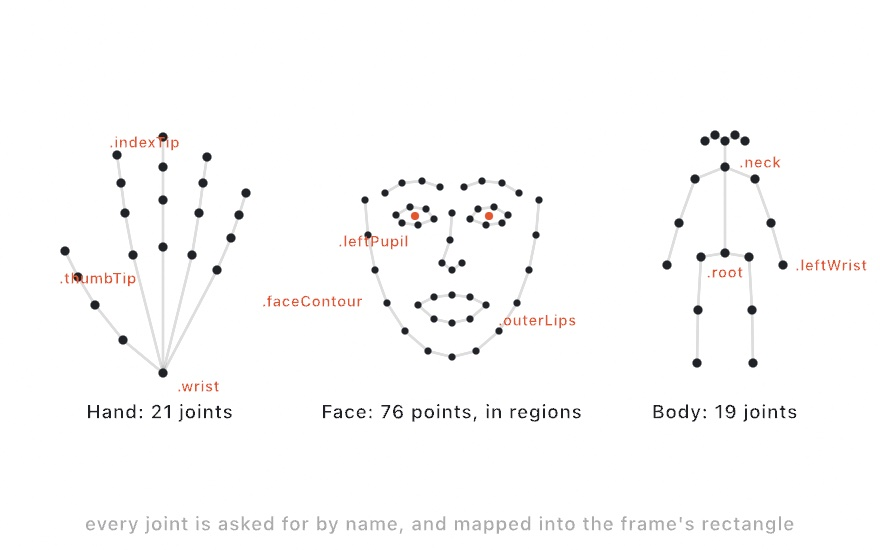
</picture>

**`HandTracker`** finds up to two hands, and `maxHandCount:` asks for more. Each is a `Hand` of 21 joints, the wrist plus four joints per finger, base to tip. `hand.point(.indexTip, in: rect)` is a fingertip as a canvas point. `finger(.index, in: rect)` gives one finger as a polyline, and `bones(in: rect)` the whole skeleton as line segments. Gestures come from arithmetic on a few joints. Thumb tip near index tip is a pinch. Five spread tips are an open hand. The index tip alone is a cursor that needs no mouse.

**`FaceTracker`** finds every face with its head pose and 76 landmark points. The points come in named regions: `.faceContour`, the brows, the eyes, `.nose`, the lips, and the pupils. The head pose is three angles in radians. `roll` tips the head toward a shoulder, `yaw` turns it left or right, and `pitch` nods it up or down. Each region comes back ready to `drawPolyline`, so a face overlay is a short loop.

**`BodyTracker`** finds every person as a 19-joint pose skeleton, head to ankles. Each body carries a **confidence**, a number from 0 to 1 for how sure the tracker is. Joints it can't see, or is unsure of, are left out, often the legs at a desk. So what you get is what the camera saw.

**`BodyTracker3D`** reads a person as positions in space instead. From the same ordinary webcam it places 17 joints in meters. So the sketch knows how far away someone is standing, and what their pose looks like from the side. You read it in whichever of three spaces suits what you're drawing. `point(_:in:)` and `bones(in:)` behave like the flat tracker's, for an overlay on the feed. `position(_:)` and the no-argument `bones()` give meters with the pelvis at the origin. Plotting `(z, y)` then draws the person from the side and `(x, z)` from above, views no camera was at. And `cameraRelativePosition(_:)` gives meters from the lens, which makes a joint's z its distance. `body.distance` is the shortcut for the whole person's.

```swift
lazy var pose = BodyTracker3D(camera)
// in draw(), with `rect` from drawFrame and `side` a spot to draw the side view:
if let body = pose.body {
    for (a, b) in body.bones(in: rect) { drawLine(a, b) }        // over the feed
    for (a, b) in body.bones() {                                 // seen from the side
        drawLine(side + Vector2(a.z, -a.y) * 200, side + Vector2(b.z, -b.y) * 200)
    }
}
```

`Examples/Vision/BodyPose3D` draws that side view in an inset beside the feed. The 3D tracker differs from the flat one in two ways. It follows only one person, so `body` is a single optional rather than a list. It also places the whole skeleton every time, guessing at the joints it can't see, rather than leaving them out. There's also `body.height`, an estimate of how tall the person is. `heightEstimation` says whether that came from real depth data or from scaling the skeleton to a standard height. Scaling is all a plain webcam can offer.

These trackers run trained models, programs that learned from many example pictures rather than rules someone wrote. The heavier ones, body pose and the segmenters in [the person as pixels](#the-person-as-pixels-lifting-the-subject), want Apple silicon. Every tracker exposes `isAvailable` and `unavailableReason`, and `drawStatus(reason, style: .warning)` turns the reason into the standard notice on the canvas instead of a silent nothing. Most trackers also read a single picture once, with no feed at all. The one-shot call is asynchronous, so a sketch waits for it with `waitFor`. `try? waitFor(photo) { try await FaceTracker.detect(in: $0) }` hands back the faces in `photo`, an `Image` you loaded.

## The person as pixels: lifting the subject

The joints reduce a person to a few points. Sometimes you want the person's pixels instead, to cut them out, glow them, or stamp them. Splitting a picture into its subject and the rest is called **segmentation**. **`PersonSegmenter`** finds the people in the frame. **`SubjectSegmenter`** finds whatever stands out, whether or not it's a person. Both hand back the same two pictures.

```swift
lazy var people = PersonSegmenter(camera)

override func draw() {
    background(.black)                       // or anything: this is the new backdrop
    guard let rect = camera.fittedRectangle(in: bounds) else { return }
    if let cutout = people.cutout { drawImage(cutout, in: rect) }
}
```

The block never draws the frame, since that would cover the new backdrop. `camera.fittedRectangle(in: bounds)` answers where `drawFrame` would have put it, so the cutout lands in the same place.

`matte` is a soft white silhouette, and its alpha says how much each pixel belongs to the subject. `tint(_:)` then turns it into a shadow, a glow, or a flat colored figure. `cutout` is the frame's own pixels with the background gone, ready to draw over whatever your sketch has already drawn. Both come back as ordinary `Image`s, so draw them into the same rectangle as the frame and they land on the picture.

Stamp the matte every frame without clearing and you have a trail of yourself. It is [Chapter 19](19-LayersAndEffects.md#the-canvas-that-keeps-everything-noclear)'s `noClear`, with a person as the brush. `PersonSegmenter` takes a `quality:` that trades edge detail for speed. `SubjectSegmenter` adds a `count` of how many separate subjects it found. While nothing in the picture stands out, `count` is `0` and `matte` and `cutout` are `nil`. Both need Apple silicon, like the pose trackers.

## The picture as a field: optical flow

The trackers so far find a person. The next one does not care who is in frame. It reads how every part of the picture moved. **`FlowTracker`** measures **optical flow**, meaning the motion of each part of the picture since the previous frame. [Chapter 14](14-FieldsAndFlow.md) taught fields as "an answer at every point", and this is the same idea. The difference is that the answers are measured from the world, not computed from noise:

<picture>
  <source media="(prefers-color-scheme: dark)" srcset="Images/32-Seeing/FlowArrows-dark.jpg">
  
</picture>

```swift
lazy var flow = FlowTracker(camera)
// in draw(), after `guard let rect = drawFrame(camera) else { return }`
if let field = flow.field {
    let push = field.vector(at: Vector2(mouseX, mouseY), in: rect)   // the motion under the mouse
    drawArrow(from: Vector2(mouseX, mouseY), to: Vector2(mouseX, mouseY) + push * 4)
}
```

`field` is `nil` until the second analyzed frame, because flow needs a pair. After that you can ask it anywhere. `vector(at:in:)` gives the motion under a point, `samples(in:every:)` a grid of arrows, and `averageFlow(in:)` the whole picture's drift. In the figure the arrows gather on the two arms and thin to almost nothing across the rest of him. His chest and his planted feet are just as present, and nearly still, so the field has next to nothing to report there. Flow reports motion, so a person standing quietly is invisible to it.

Motion can be measured only where the picture has texture. A blank wall or a solid backdrop doesn't read as zero. It reads as noise, because there is nothing to match from one frame to the next. If your scene is mostly flat, give it some texture before trusting the field there. Treat the sizes of the vectors as a signal to scale by a gain of your own, rather than as a calibrated speed. The measured field has its own name, `MotionField`, apart from [Chapter 14](14-FieldsAndFlow.md)'s generative `FlowField`. One is a rule you invent, and the other is motion the camera saw.

## Putting it together: motion paints

The finished sketch is the painting at the top. You stand in front of the camera, and your motion is the brush. Where the picture moved, strokes appear, colored by the direction of the movement and sized by its speed. Stillness paints nothing, and old gestures sink slowly into the dark. Make `MySketches/MotionBrush.swift`:

```swift
import Ollin
import OllinVision

final class MotionBrush: Sketch {
    let camera = Camera()
    lazy var flow = FlowTracker(camera)

    override func setup() {
        try? camera.start()
        seed(21)                    // the brush dabs land the same way every run
        noClear()
        background(Color(hex: 0x0A0A14))
    }

    override func draw() {
        // A faint veil each frame, so old strokes sink slowly into the dark.
        noStroke()
        fill(Color(hex: 0x0A0A14, alpha: 0.007))
        drawRect(0, 0, width, height)

        guard let field = flow.field else { return }

        // How far a picture moves between two frames depends on what it is, so
        // the brush reads speed against this frame's own fastest sample, with a
        // floor under it so a still room paints nothing at all.
        let fastest = max(field.samples(in: bounds, every: 40).map(\.flow.length).max() ?? 0, 0.001)
        let cut = max(fastest * 0.22, 3)

        // Fling brushes at random spots; paint only where the picture moved.
        for _ in 0 ..< 900 {
            let p = Vector2(random(0, width), random(0, height))
            let v = field.vector(at: p, in: bounds, mirrored: true)
            let strength = v.length
            guard strength > cut else { continue }
            let hue = v.angle / .tau + 0.5              // direction picks the color
            stroke(Color(hue: hue, saturation: 0.75, brightness: 1)
                .withAlpha(min(0.5, strength / fastest * 0.3)))
            strokeWeight((1.2 + strength / fastest * 4) * scale)
            drawLine(p, p + v * (36 * scale / fastest))
        }
    }
}
```

The brush uses the webcam as a feed, the optical flow field, and a canvas that keeps its marks. The camera's picture is never drawn. So the field is mapped onto the whole canvas, `bounds`, stretched to fit, since a painting has no picture to line up with.

`seed(21)` fixes where the random brushes land, though a live painting still changes with the room. Each frame starts with a veil, a rectangle of the background color at an alpha of 0.007. It is [Chapter 12](12-FlocksAndSwarms.md#roaming-wander-and-trails-from-noclear)'s fade over a canvas that is never cleared, so a stroke takes a few seconds to sink away. Then the brush reads the field once as a grid of arrows every 40 pixels, `samples(in:every:)`, and keeps the length of the fastest. The key path `\.flow.length` is [Chapter 7](07-Tiles.md)'s, and `?? 0` covers an empty grid, which has no fastest arrow. `max(…, 0.001)` keeps a still frame's near-zero lengths from being divided by later.

The fastest arrow sets the scale, because how far a picture moves between frames depends on what it shows. A hand waved at a webcam crosses tens of pixels between frames, and a dancer filmed across the room crosses a few. A brush tuned to one would paint nothing for the other. So `cut` is 22 percent of the fastest motion in this frame, with a floor of 3 pixels, and a still room paints nothing.

The loop throws 900 brushes at random spots and asks the field for the motion under each one. `mirrored: true` answers like a mirror, so motion to your left paints on the left of the canvas. A spot that moved less than `cut` is skipped with `continue`. The rest become strokes. `v.angle` is the motion's direction from [Chapter 10](10-Vectors.md), in radians from minus half a turn to plus half a turn. Dividing by `.tau`, a full turn, and adding 0.5 turns it into a hue from 0 to 1. So each direction has its own color. Faster motion makes a stroke more opaque, thicker, and longer, each measured against the fastest.

Then make it yours:

- Change what motion means by using `field.averageFlow(in: bounds)` to steer one big brush instead of 900 small ones. The sketch becomes a single line that follows the room.
- Paint with yourself instead of your motion. Swap the flow for `PersonSegmenter` and stamp the `matte`, tinted, wherever you stand, so motion leaves silhouettes.
- Drive the brush with `HandTracker`'s `.indexTip` instead of flow, and you're drawing in the air.

To rehearse the brush without standing up, swap `camera` for the film from [When there is no camera](#when-there-is-no-camera-stills-and-footage), with `film.play()` in place of `camera.start()`. The dancer then paints a picture like the one at the top of the chapter, flipped left for right by `mirrored: true`. When the clip loops back to its start, the jump reads as one burst of motion, and `flow.reset()` right after the jump clears it.

This sketch paints from what happens in front of it, so keep it live. A tracker reads nothing during an export, so the usual export flags have no motion to paint with. To keep a painting, record the window with the Mac's own screen recording, Shift-Command-5. Or send the sketch to another app while it runs, as [Chapter 39](39-Performing.md#live-feeds-into-other-apps) shows.

## Reading outlines and print: contours, rectangles, text, and codes

The brush read motion, and a still room gave it nothing. Much of what a camera sees holds still: a hand held up to it, a page, a card, a code on a phone. These trackers read the flat, high-contrast things in a picture, and they read them in a still frame as well as a moving one.

### A frame as vector shapes: ContourDetector

**`ContourDetector`** traces the boundaries between dark and light into closed vector outlines. It hands them back as [Chapter 15](15-ShapesAsMaterial.md)'s `Shape`s, holes and all. It is for turning a camera into a live vectorizer, with every shape ready for a boolean, a hatch, or a plotter. Following the border of a light region pixel by pixel is a classic of computer vision, from Satoshi Suzuki and Keiichi Abe's border following of 1985. Apple's Vision framework does the tracing here.

<picture>
  <source media="(prefers-color-scheme: dark)" srcset="Images/32-Seeing/Contours-dark.jpg">
  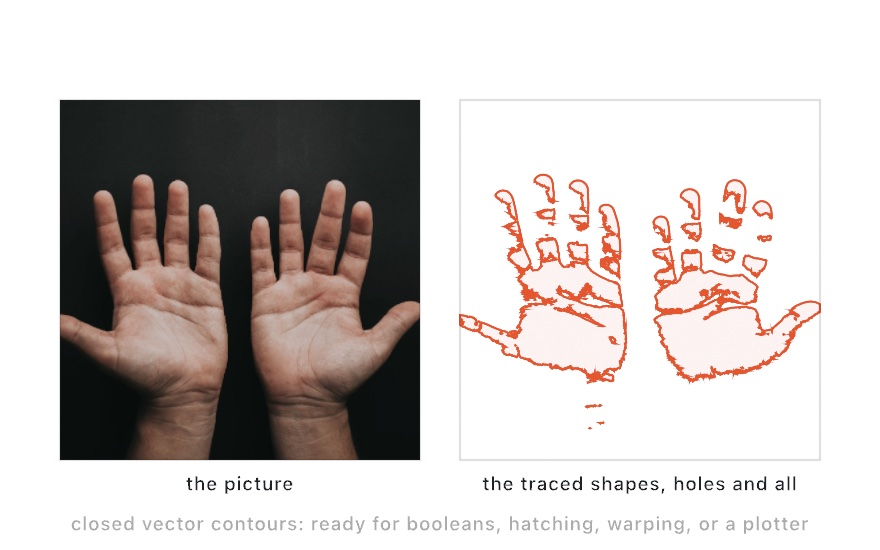
</picture>

The picture on the left is one of the bundled photographs, two palms lit against a black ground. A tracer wants that, one clear boundary between light and dark. On the right are the shapes the detector traced. The creases of each palm come back as holes inside the hand, and the finger joints break the fingers into pieces.

```swift
lazy var outlines = ContourDetector(camera, detectsDarkOnLight: false)

// in draw(), after `guard let rect = drawFrame(camera) else { return }`
noFill(); stroke(.orange)
for shape in outlines.shapes(in: rect) { drawShape(shape) }
```

The subject here is the light half of the picture, so the block asks for `detectsDarkOnLight: false`. Get that backwards and you trace the room instead of the hands. Once a camera frame is a list of `Shape`s, everything from [Chapter 15](15-ShapesAsMaterial.md) applies. Boolean it, offset it, hatch it, warp it, or export it as SVG for a plotter.

### Paper and screens: RectangleDetector

**`RectangleDetector`** finds rectangular things, a sheet of paper, a screen, a card on a desk, and reports each one's four corners. It works on them at an angle, so the corners come back in perspective rather than as an upright box. A document scanner needs that to flatten a page. It is classical computer vision, with no trained model, so it needs no Apple silicon, and Apple's Vision framework does the work.

<picture>
  <source media="(prefers-color-scheme: dark)" srcset="Images/32-Seeing/ReadingTheDesk-dark.jpg">
  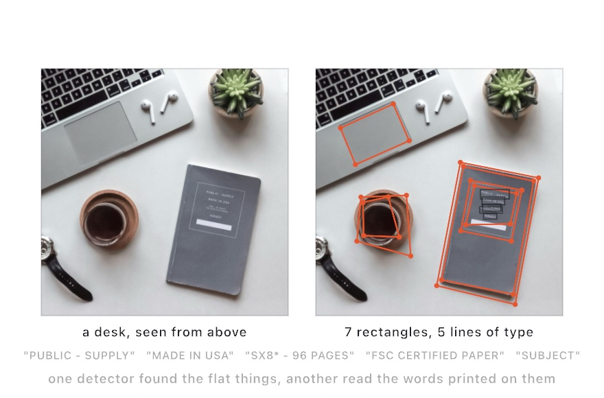
</picture>

The figure reads a photograph of a desk from above. Look at what counts as a rectangle. The trackpad and the notebook do, and so does the rim of the coffee cup, which is round.

```swift
lazy var cards = RectangleDetector(camera)

// in draw(), after `guard let rect = drawFrame(camera) else { return }`
noFill(); stroke(.green)
for card in cards.rectangles { drawPolygon(card.corners(in: rect)) }
```

A `DetectedRectangle` also offers `center(in:)`, `bounds(in:)` for the upright box around those corners, and a `confidence`. The initializer takes limits on aspect, size and confidence, for when you want to be fussy about what counts as one.

### Words off a page: TextRecognizer

**`TextRecognizer`** reads text off the feed with Apple's on-device text recognition. It is for a sketch that answers what is written in front of it, a sign, a page, a note held up to the camera. It runs on a model every Mac already has. The boxes on the notebook's cover in the figure above are its five lines.

```swift
lazy var reader = TextRecognizer(camera, quality: .accurate)

// in draw(), after `guard let rect = drawFrame(camera) else { return }`
noFill(); stroke(.green)
for line in reader.lines { drawRect(line.bounds(in: rect)) }
```

`reader.lines` is one `DetectedText` per line, each carrying its `text` and its `bounds(in:)`, and `reader.text` joins every line into a single string. The `quality:` argument trades speed for thoroughness. `.fast` keeps up with a live feed and is the default there, but it can miss small print. So the block asks for `.accurate`. `.accurate` reads more and is the default for a still image.

### Codes a phone can make: BarcodeScanner

**`BarcodeScanner`** decodes barcodes and QR codes. The QR code was designed in 1994 at the Japanese company Denso Wave to track car parts. Now anyone can make one on a phone. That makes it a friendly way to hand a running installation some input. A `DetectedBarcode` gives you the decoded `payload`, the `symbology` that says which kind of code it was, and `corners(in:)` for where it sits. Like the rectangle detector, it needs no trained model.

```swift
lazy var codes = BarcodeScanner(camera)

// in draw():
if let text = codes.barcodes.first?.payload { drawText(text, 40, 60) }
```

## Following one thing: ObjectTracker and TrajectoryTracker

The brush read every part of the picture at once. Sometimes one thing matters, a cup someone picks up or a ball someone throws. A detector looks at each frame fresh and finds whatever it has a model for. These two trackers follow one thing across frames instead. One is handed a thing to follow, and the other finds things that fly on its own.

### A patch you point at: ObjectTracker

**`ObjectTracker`** follows a patch of picture from frame to frame. You give it a box, and it keeps the box on that patch as it moves. It is for following something no recognizer has heard of, the thing you clicked. Following a patch this way is called visual object tracking, a long-standing job in computer vision, and Apple's Vision framework does the work.

```swift
lazy var tracker = ObjectTracker(camera)
var view = Rectangle(x: 0, y: 0, width: 1, height: 1)

override func draw() {
    guard let rect = drawFrame(camera) else { return }
    view = rect
    if let object = tracker.trackedObject {
        noFill(); stroke(.green)
        drawRect(object.bounds(in: view))
    }
}

override func mousePressed() {
    tracker.track(centeredAt: Vector2(mouseX, mouseY), size: 160, in: view)
}
```

Click something and the sketch follows it. Alongside its box, `trackedObject` carries a `confidence` that falls as the patch is hidden, leaves the frame, or moves too fast to keep up with. Fade an overlay by it, or give up below a threshold and ask for a new box.

### Things that fly: TrajectoryTracker

**`TrajectoryTracker`** waits for things that fly. It is for a sketch that answers a throw, a catch, or a bounce. Rather than being pointed at something, it watches for the curve of a thrown thing. A ball tossed or a pebble bouncing then arrives on its own as a `DetectedTrajectory`, a run of sightings with a parabola fitted through them. Galileo showed in 1638 that a thrown thing follows a parabola, and that shape is what the tracker looks for.

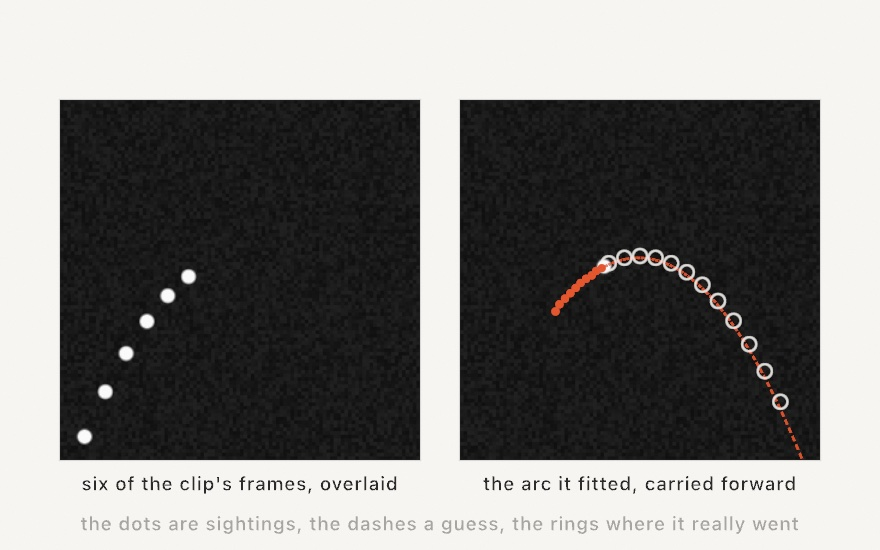

The dashed line runs past the last sighting. `equationCoefficients` is the fitted parabola in normalized coordinates, `y = c.x · x² + c.y · x + c.z`. Nothing stops you sampling it further, which is a guess about where the thing is going:

```swift
lazy var flights = TrajectoryTracker(camera)

// in draw(), with `view` the rectangle the frame landed in:
for arc in flights.trajectories {
    drawPolyline(arc.projectedPoints(in: view))              // the path so far
    let c = arc.equationCoefficients
    drawPolyline(stride(from: 0.5, through: 1, by: 0.02).map { x in
        VisionSpace.point(x, c.x * x * x + c.y * x + c.z, in: view)
    })                                                       // where it's headed
}
```

The block samples the right half of the frame, `x` from 0.5 to 1, which suits a flight moving right. For your own, start from the last sighting and step the way it is moving.

The clip in the figure shows the ball only on its way up. The pale rings are where it went in the frames the tracker never saw, and the dashed curve runs through them. A parabola has only three numbers in it, so a handful of sightings is enough to follow the rest of the flight.

It asks two things of you. Hold the camera still, because a moving camera turns the whole scene into motion. And be patient, because an arc is reported only once its object has been seen `minObservationCount` times, ten by default. Call `reset()` after the scene jumps, like a clip looping back to its start, so the jump isn't read as something flying. Each arc keeps a stable `id` as more of it comes into view, so you can gather sightings into trails that outlive any single frame. `detectedPoints(in:)` gives the raw sightings, and `projectedPoints(in:)` puts them on the fitted curve. The projected ones are smoother, and usually the ones to draw.

## What the picture is about: labels and saliency

The brush answered where the picture moved. Two trackers answer a question about the whole picture instead, what is in it and where an eye would go. Both run trained models, so both want Apple silicon.

### Words for the scene: ImageClassifier

**`ImageClassifier`** names what's in view, from a fixed vocabulary of about 1,300 everyday words. It reports no positions at all, only labels and how confident it is about each. It is for a sketch that reacts to its surroundings instead of drawing on top of them. The vocabulary is Apple's, trained into the classifier that comes with the Mac.

<picture>
  <source media="(prefers-color-scheme: dark)" srcset="Images/32-Seeing/AttentionAndLabels-dark.jpg">
  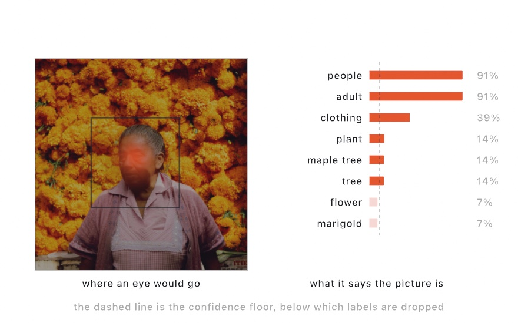
</picture>

The bars on the right of the figure are its list for a photograph of a woman in front of a wall of marigolds. The vocabulary is a hierarchy, so one clear subject lights up its whole family at once, which is why `people` and `adult` tie. Read the tail, though. The picture is more marigold than anything else, and `marigold` comes back at seven percent. A classifier tells you what it was trained to notice, which is not the same as what the picture is of.

```swift
lazy var classifier = ImageClassifier(camera)

// in draw():
for (i, found) in classifier.classifications.prefix(5).enumerated() {
    drawText("\(found.name) \(Int(found.confidence * 100))%", 40, 60 + Double(i) * 32)
}
```

The classifier scores every word it knows on every frame, nearly all of them near zero. `minConfidence`, `0.1` by default, keeps `classifications` down to the few that cleared it, and the dashed line in the figure marks that floor. `confidence(of: "plant")` answers for any word in the vocabulary, whether or not it cleared the floor. So "how much does this look like a plant" can drive a color or a speed straight from the room.

### Where an eye would go: SaliencyTracker

**`SaliencyTracker`** maps where an eye would go, which is called **saliency**. It is for spending detail, density, or attention where a viewer will look. The saliency map was proposed by Christof Koch and Shimon Ullman in 1985. Laurent Itti, Christof Koch, and Ernst Niebur built the classic model of it in 1998. Apple's Vision framework makes this one with a trained model. The glow on the left of the figure above is its map, and the dark box around her face is its region. The glow gathers on her face rather than on the wall of flowers around her, because faces and contrast are what people look at.

```swift
lazy var eyes = SaliencyTracker(camera)

// in draw(), after `guard let rect = drawFrame(camera) else { return }`
if let heat = eyes.heatMap {
    tint(Color(red: 1, green: 0.6, blue: 0.2, alpha: 0.7))
    drawImage(heat, in: rect)          // where an eye would go, as a glow
    noTint()
}
```

`heatMap` is a white image whose alpha is the salience, so a `tint(_:)` turns it into a glow over the picture. `regions` are the boxes it peaks in. And `salience(at:in:)` answers for one canvas point, which is the field-shaped reading of [Chapter 14](14-FieldsAndFlow.md). Use it as a density for stippling, a weight for where to spend detail, or an attractor for particles. There are two kinds, chosen with `mode:`. The default `.attention` predicts where people look, while `.objectness` highlights regions likely to hold separate objects, whether or not they draw the eye. The mode is fixed when you make the tracker, so read both by making two.

## Models of your own

The motion brush needed only what the Mac finds on its own. The entries below go past the built-in trackers on trained models you download, whose learned numbers are called **weights**. They are the one part of the chapter with a download step, because Ollin ships no weights. Run `Scripts/fetch-models.sh` once, and every file these entries and their examples need lands in `Models/`, skipping whatever is already there.

The fragments below write the plain `Models/` path, which works when you launch from the top folder of the repository. A sketch that lives elsewhere finds the folder with `sketchResource("file.mlpackage")`. It walks up from the sketch's own source file to the nearest `Models` folder. It hands back the file's path, or `nil` if there is none. That path keeps working wherever the sketch is launched from. Wrap it as `URL(fileURLWithPath:)` for the initializers below.

### A click cuts it loose: PointSegmenter

The segmenters in [the person as pixels](#the-person-as-pixels-lifting-the-subject) decide for themselves what the subject is. **`PointSegmenter`** hands that decision to you. Click a thing, any thing, and it comes loose from the picture. It runs SAM 2.1, the small version of Nikhila Ravi and colleagues' 2024 model for segmenting whatever a point asks for.

```swift
lazy var picker = PointSegmenter(camera,
    imageEncoderAt: encoderURL, promptEncoderAt: promptURL, maskDecoderAt: decoderURL)

override func mousePressed() {
    guard let rect = camera.fittedRectangle(in: bounds) else { return }
    if modifiers.contains(.shift) {
        picker.exclude(Vector2(mouseX, mouseY), in: rect)   // shift-click: leave this out
    } else {
        picker.pick(at: Vector2(mouseX, mouseY), in: rect)
    }
}

override func draw() {
    tint(Color(white: 0.3))                                          // the room, dimmed
    guard let rect = drawFrame(camera) else { return noTint() }
    noTint()
    if let pick = picker.pick { drawImage(pick.cutout, in: rect) }   // the picked thing, lit
}
```

A pick answers with the same `matte` and `cutout` pair as the other segmenters. It adds a `confidence`, and a `bounds(in:)` box for framing what it found. The first answer takes a moment, because the model studies the clicked frame once. After that the frame stays frozen and refining is nearly free. `include(_:in:)` adds a point the mask must also cover, and `exclude(_:in:)` a point it must not. Click the teapot, then shift-click the shadow that came with it, and the mask lets the shadow go.

The three URLs point at the model's three parts the fetch script pulled, `SAM2_1SmallImageEncoderFLOAT16.mlpackage`, `SAM2_1SmallPromptEncoderFLOAT16.mlpackage` and `SAM2_1SmallMaskDecoderFLOAT16.mlpackage` in `Models/`. `Examples/Vision/PointLift` is the whole loop, clicks and all.

### Bringing your own model: ModelTracker

When the built-ins run out, **`ModelTracker`** runs a Core ML model of your own over the same frames. It has the same attach-and-read shape. Core ML is Apple's format for trained models, and most published models convert to it: depth estimators, object detectors, style transfer, semantic segmentation.

It fills whichever read surfaces match what your model puts out. A classifier gives you `classifications`, `topClassification` and `confidence(of:)`, over your own vocabulary rather than Apple's. A detector gives you `objects`, labeled boxes you map with `bounds(in:)`. An image-to-image model, a depth estimator say, shows up in two forms at once. `map` reads its output as a value field, white-alpha and tintable, with `value(at:in:)` for the number under a point. `image` reads the same output as a picture, which is what you want from a model that paints rather than measures. And a semantic segmenter fills `classMask`. It knows which classes are in frame, which one sits under a point, and how to hand you any of them as a drawable mask.

```swift
lazy var depth = ModelTracker(camera, modelAt: URL(fileURLWithPath:
    "Models/DepthAnythingV2SmallF16.mlpackage"))

override func draw() {
    guard let rect = drawFrame(camera) else { return }
    if let map = depth.map { drawImage(map, in: rect) }
    let near = depth.value(at: Vector2(mouseX, mouseY), in: rect)   // 0 far … 1 near
}
```

The model in the block is Depth Anything V2, by Lihe Yang and colleagues, from 2024. `Examples/Vision/DepthRelief`, `ObjectDetection`, `DigitReader` and `PaintByClass` each show a different one of the four surfaces above. `StyleMirror` watches for a style model you train yourself from a picture you pick, with `Scripts/train-style-model.swift`, so nobody else's weights are involved.

Loading runs in the background, off the frame loop. `isLoaded` flips when the model is ready, and frames pass by until then. Expect the first launch of a freshly built sketch to sit for a few seconds while Core ML prepares the model for your Mac. Every later launch of that same build starts at once. A model file that's missing or won't load reports through the same `isAvailable` and `unavailableReason` pair the built-in trackers use. So you can tell the person in front of the screen what to do about it.

### Depth that holds still: DepthTracker

A single-image depth model decides each frame on its own. `Examples/Vision/DepthRelief` draws the depth as a field of disks, and pointed at a still room, its relief moves. The map shimmers, and the disks with it, because nothing ties one frame's answer to the next. **`DepthTracker`** runs a video depth model instead. It keeps what it saw over the last second and reads each new frame against that, so the map moves only when the scene does. The model is Video Depth Anything, by Sili Chen and colleagues, from 2025.

```swift
lazy var depth = DepthTracker(camera, modelAt: URL(fileURLWithPath:
    "Models/VideoDepthAnythingSmallF16.mlpackage"))

override func draw() {
    guard let rect = drawFrame(camera) else { return }
    let near = depth.value(at: Vector2(mouseX, mouseY), in: rect)   // 0 far … 1 near
    if let map = depth.map { drawImage(map, in: rect) }
}

override func keyPressed() {
    if key == "r" { depth.reset() }   // a new scene: anchor the depth again
}
```

The surface is the one `ModelTracker` gives a depth model, `map` and `value(at:in:)`, so a sketch swaps one for the other in a line. Two things are new. The depth is relative, nearer and farther rather than meters. The model keeps that scale consistent by anchoring on the first frame it sees. Move the camera to another room and call `reset()`, and the next frame becomes the anchor. And the numbers you read pass through a range that follows the scene slowly, `range`. It widens at once for something nearer or farther than anything so far, and eases back over a few seconds. So the picture never rescales between two frames.

The model is built rather than downloaded. Nobody publishes a Core ML version, so `Scripts/fetch-models.sh` makes one on your Mac from the published model. The build is a one-time step of a few minutes, and it needs Python. The tracker runs on the GPU, about fourteen readings a second on an M2. `Examples/Vision/DepthContours` draws the depth as contour lines. A parameter swaps in the single-image model, so you can watch the lines crawl and then hold still.

### A clip read whole for an export: DepthClip

A recording can be read whole instead of as it plays. You want that for an export, because a tracker over a playing clip reads nothing under `--export-video`, its frames arriving on the live clock. **`DepthClip`** takes a `VideoPlayer` and runs its file through the model once. It reads in windows of 32 frames, the way the model was trained to read. Each window is fitted to the one before it on the frames they share, so the whole clip sits on one scale. The pass takes a second or two a window and is kept on disk, so the next run opens at once. Then `map` and `value(at:in:)` answer for the frame under the playhead, the same calls as the tracker's. Here `player` is a `VideoPlayer`, set up like the film in [When there is no camera](#when-there-is-no-camera-stills-and-footage).

```swift
var depth: DepthClip?

override func setup() {
    player.play()
    depth = DepthClip(player, modelAt: URL(fileURLWithPath:
        "Models/VideoDepthAnythingSmallClipF16.mlpackage"))
}

override func draw() {
    guard let rect = drawFrame(player), let depth else { return }
    if !depth.isReady { return drawStatus("Reading the clip's depth… \(Int(depth.progress * 100))%") }
    if let map = depth.map { drawImage(map, in: rect) }
}
```

`DepthClip` reads the file, so the pass runs before the first exported frame. Frame `k` then carries the map of the clip frame it shows, every time. Make it in `setup()`, not lazily, so the export finds it. `Examples/Vision/FootageDepth` draws a clip's depth as contour lines, over the bundled footage of the *Voladores de Papantla*, flyers circling down a pole on ropes.

### Words as parameters: ConceptTracker

The classifier's `confidence(of: "plant")` answers only for the 1,300 words it was trained on. **`ConceptTracker`** answers for any phrase you can type. Give it a few phrases in plain language and it scores each one against the picture, every frame. It runs MobileCLIP, Apple's small model from 2024, by Pavan Kumar Anasosalu Vasu and colleagues. The scores follow the recipe of CLIP, by Alec Radford and colleagues, from 2021.

```swift
lazy var ideas = ConceptTracker(camera,
    imageModelAt: URL(fileURLWithPath: "Models/mobileclip_s0_image.mlpackage"),
    textModelAt: URL(fileURLWithPath: "Models/mobileclip_s0_text.mlpackage"),
    vocabularyAt: URL(fileURLWithPath: "Models/bpe_simple_vocab_16e6.txt"),
    concepts: ["a spooky scene", "a cheerful scene"])

// in draw():
let spooky = ideas.share(of: "a spooky scene")   // 0…1, every frame
```

Under it are two halves of one model. An image encoder turns each frame into a point in a shared space. A text encoder puts each phrase into the same space once, and keeps the result. A score is how close the two land. The scores are shares across your phrase set and sum to 1, so one phrase alone always reads 1. Give the tracker contrasts, the thing and its opposite, and the share moves across a range you can use. `similarity(of:)` reads the raw closeness instead, if you'd rather map the space yourself.

The phrases stay live. Set `concepts` to a new list, or ask `share(of:)` about a phrase it hasn't seen, and the newcomer joins the scoring a frame later. `Examples/Vision/TugOfWords` wires two phrase parameters to a tug-of-war rope, with each phrase editable in the inspector while the sketch runs.

## The camera in a 3D scene: the room as the light and the surface

The brush drew the camera's motion in 2D. A camera frame is an image, so it goes wherever an image goes, and that includes a 3D scene. It can be the light the scene is lit by, and a surface a mesh wears.

### The room as the light: Environment.feed

[Chapter 26](26-Meshes.md#surroundings-as-the-light-environments) lit its scenes with environments from somewhere else: a Venice evening, a studio, a synthetic sky. `Environment.feed(...)` uses the room you are in. Hand it the webcam, and its latest frame becomes the surroundings, so the room you are sitting in lights the thing you are making. The same idea, lighting a render with a photograph of real surroundings, is Paul Debevec's image-based lighting.

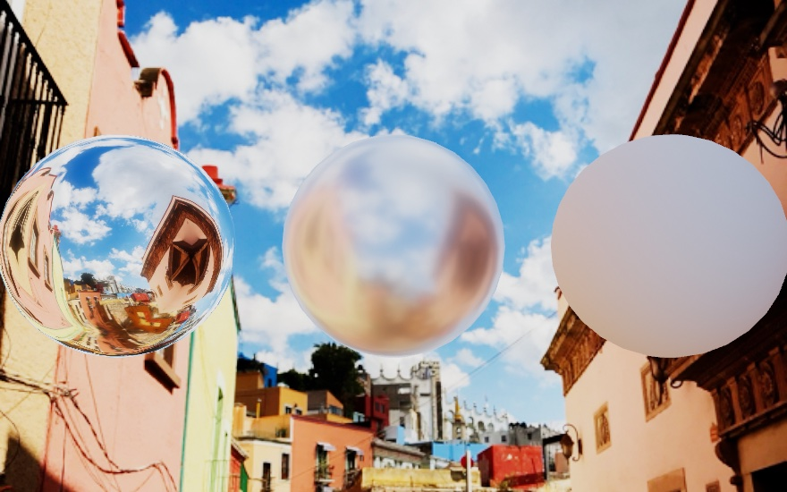

The picture behind the spheres is also the light on them. Walk past the camera and the reflections move with you. Hold up something red and the whole scene warms.

```swift
let camera = Camera()          // started in setup(), as above

override func draw() {
    drawFrame(camera)              // the room as the picture
    environment(.feed(camera))     // the room as the light
    fill(.white)
    material(.metal(roughness: 0.03))
    drawSphere(radius: 1.02)
}
```

A webcam only brings a window, and lighting needs a whole sphere of surroundings. So the half the camera can't see is filled with the mirror image of the half it can. The result is plausible rather than true, and plausible is enough for lighting. The feed never draws itself as the backdrop, the way Chapter 26's environments can. The wrap is made for lighting, not for looking at. Show the feed yourself with `drawFrame`, and the picture and the lighting stay one world. Any feed works the same way, such as a playing video, a screen capture, or the phone's camera. Until the first frame arrives, a neutral sky stands in. The `3D/Environments/LiveEnvironment` example is this entry, live.

### The room as the surface: textured

A camera frame is an `Image`, and [Chapter 26](26-Meshes.md#a-picture-wrapped-around-it-textured) put an image on a mesh with `textured(_:)`. So the room you are sitting in can be wrapped around a globe, and lit by itself, in two lines:

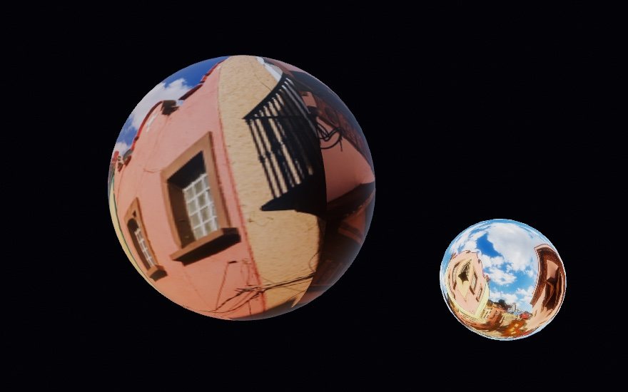

```swift
let globe = Mesh.sphere(radius: 1)            // any mesh with uvs

// in draw():
environment(.feed(camera))                  // the room as the light
if let frame = camera.frame {
    drawMesh(globe.textured(frame))         // the room as the surface
}
```

Set the texture every frame, because each capture arrives as a fresh image. A fresh image uploads to the GPU the first time it is drawn. So there is one upload per new frame, and nothing while the frame holds. That costs little for one surface and adds up across many. So put the feed on the surface that matters, and let the same feed light the rest. The `3D/Materials/LiveSurface` example does that, with the webcam.

## The screen and the past: ScreenCapture and SlitScan

The brush read the frame in front of it, from the camera, as it arrived. Two more sources change where a frame comes from and when. The screen hands over whatever is running on the Mac, and a history of frames lets each pixel come from a different moment.

### Drawing with the screen: ScreenCapture

`ScreenCapture` hands over any display, any app, or any single window as a live image. A browser, a map, a video call, a terminal, or another sketch becomes something to draw with. It runs on Apple's ScreenCaptureKit, the part of macOS that records the screen.

```swift
import OllinScreen

let screen = ScreenCapture(.mainDisplay)

override func setup() { screen.start() }
override func draw() { drawFrame(screen) }
```

It's a feed like the camera and the film. `drawFrame` letterboxes it, filters work on it, and a tracker attaches to it as it would to a camera.

```swift
let screen = ScreenCapture(.app("Safari"))
lazy var words = TextRecognizer(screen)     // reads the page as it scrolls
lazy var faces = FaceTracker(screen)        // finds faces in whatever is playing
```

You say what to capture as a value you write down, so the sketch records what it drew:

```swift
ScreenCapture(.app("Safari"))                    // every window one app has open
ScreenCapture(.window(matching: "Shopping list"))   // one window, by its title
```

An app matches on its name or its bundle identifier, and it has to match in full. A window matches any title that contains the text. That keeps `"Shopping list"` working when the title bar reads `"Notes: Shopping list"`. Naming something that isn't open yet is a wait rather than an error. The capture keeps looking and starts by itself when the window appears. A window captured on its own arrives at its own size with nothing in front of it, even when something covers it on screen.

Point a sketch at the screen it is drawn on and it would draw the window it is being drawn in, forever. So by default its own windows are cut out of the picture. Turn that off and the recursion becomes the picture:

```swift
screen.excludesOwnWindows = false
```

<picture>
  <source media="(prefers-color-scheme: dark)" srcset="Images/32-Seeing/ScreenAsMaterial-dark.jpg">
  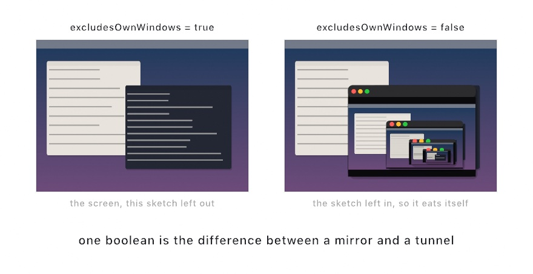
</picture>

The result is video feedback, which people have made by pointing a camera at a monitor since the 1960s. Here it costs one Boolean. How deep it goes depends on how fast the sketch draws compared with the capture, and it smears and drifts as you move the window. The figure's desktop is made up, and the nesting is what a live one does.

At `scale = 1` a capture arrives at the screen's full resolution, which on a Retina display is twice its size in points. `screen.scale = 0.5` quarters the pixels, and it is the setting to reach for when an effect chain slows down.

Recording the screen needs the user's consent, and macOS grants that to an application. A sketch run from the terminal has no application of its own. The consent goes to whatever launched it, which is Terminal, iTerm, Ghostty, or whichever terminal you use. The prompt names your terminal, and so does the entry in System Settings. Once you allow it there, every sketch you run from that terminal can capture with no further prompt. That also means everything you run from it can record the screen. Granting it doesn't reach a process already running, so allow it and then start the sketch again. `ScreenCapture.isAvailable` and `unavailableReason` tell you where you stand, and `drawFrame` puts the reason on the canvas for you.

### Every pixel its own moment: SlitScan

A `SlitScan` is a rolling history of frames. You push the newest one every time you draw, and it keeps the last few dozen. Then you ask it for a picture in which each pixel comes from a different moment. It is for motion laid out as a shape, a moving arm drawn as a fan of sleeves. Slit scanning started as a photographic technique, a physical slit with the film moving behind it. It made the stargate sequence of *2001: A Space Odyssey*, and became a delay per pixel once video was digital. Golan Levin's informal catalog of slit-scan works maps that history.

<picture>
  <source media="(prefers-color-scheme: dark)" srcset="Images/32-Seeing/SlitScanDelay-dark.jpg">
  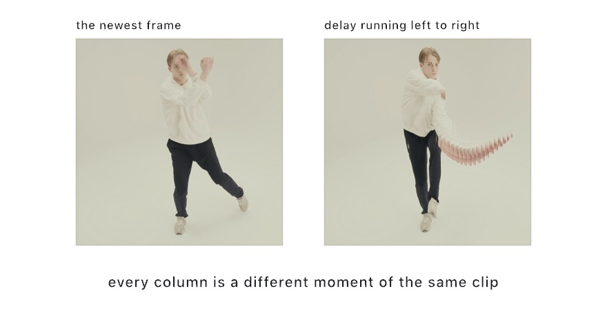
</picture>

```swift
let history = SlitScan(capacity: 48)

override func draw() {
    if let frame = camera.frame {
        history.append(frame.resized(width: 480, height: 270))
    }
    if let warped = history.image(delay: { uv in uv.x }) {
        drawImage(warped, in: canvasRectangle, fit: .contain)
    }
}
```

The closure decides everything. It receives a pixel's position as fractions across the picture, from the top left, and returns how far back to read there. In that answer, 0 is the newest frame and 1 is the oldest one still held. Returning `uv.x` makes the left edge now and the right edge the oldest moment held. So time runs back from left to right across the image.

The figure's history holds forty-eight frames of the bundled film, just under two seconds. The arm that swung through those two seconds comes back as a fan of sleeves toward the right. Each column caught it at another moment. The leg he kept planted looks ordinary. Any delay map works. `1 - uv.y` puts now at the bottom, since `uv.y` grows downward. `uv.distance(to: Vector2(0.5, 0.5)) / 0.71` makes time ripple outward from the center, with 0.71 about half the diagonal so the corners read the oldest frame. There's also a form that takes an `Image` as the delay map, so you can paint where time runs slow.

The history costs width times height times four bytes per frame, so push modest sizes, as the block does with [Chapter 9](09-Pictures.md)'s `resized`. Resizing costs some time every frame, so keep the size small. The first push fixes the size, and after that frames of another size are skipped with a note in the console. A camera frame pushes straight in. A film's frames live on the GPU, so push `film.snapshot()` instead.

> **Swift note.** If your sketch's class is itself named `SlitScan`, it hides the framework's type of the same name. Write `Ollin.SlitScan` then. Putting the module's name in front says you mean the framework's one.

## Where this comes from

Camera art that answers the people in front of it goes back to the 1970s. Myron Krueger's *Videoplace*, in the mid-1970s, let people play with their own silhouettes. David Rokeby's *Very Nervous System* turned body motion into sound in 1986. And Camille Utterback and Romy Achituv's *Text Rain* let falling letters rest on your outline in 1999. That lineage runs through today's interactive mirrors, and Golan Levin's writing on computer vision for artists maps it. Optical flow goes back to Berthold Horn and Brian Schunck, and to Bruce Lucas and Takeo Kanade, both in 1981. The perception itself is Apple's Vision framework and Core ML, running on the machine. Ollin adds the typed reading surface, mapped to the canvas, after the approach of Kyle McDonald's ofxCv addon for openFrameworks. The entries after the brush name their own sources. Full credits are in the project's [attribution notes](../ATTRIBUTION.md).

## Go deeper

- [Vision](../Docs/Vision/Vision.md): every tracker in detail, coordinate mapping, still images, availability.
- [Video](../Docs/Video/Video.md): loading and playing footage, analysis, the soundtrack, deterministic export.
- [Sample photos](../Docs/Drawing/SamplePhotos.md): the twenty bundled pictures and the film, with their credits.
- [A live camera environment](../Docs/3D/3D.md#live-environment): `Environment.feed` with any `VideoFeed`, how the unseen half is filled, and the neutral sky before the first frame. The `3D/Environments/LiveEnvironment` and `3D/Materials/LiveSurface` examples run it with the webcam.
- [Screen capture](../Docs/Integration/ScreenCapture.md): naming a display, app, or window, listing what's there, the permission story in full, and the feedback tunnel.
- [Slit scan](../Docs/Video/SlitScan.md): the frame history, both delay forms, memory cost, and the delay maps to try.
- Appendix B draws this chapter's math, one picture per idea: [Where things are](B-JustEnoughMath.md#where-things-are), [Fields and following them](B-JustEnoughMath.md#fields-and-following-them).
- Worked examples, people first: [`FaceTracking`](../Examples/Vision/FaceTracking/Sketch.swift), [`HandTracking`](../Examples/Vision/HandTracking/Sketch.swift), [`BodyPose`](../Examples/Vision/BodyPose/Sketch.swift), [`BodyPose3D`](../Examples/Vision/BodyPose3D/Sketch.swift), [`Lift`](../Examples/Vision/Lift/Sketch.swift).
- Then the picture itself: [`ContourTrace`](../Examples/Vision/ContourTrace/Sketch.swift), [`OpticalFlow`](../Examples/Vision/OpticalFlow/Sketch.swift), [`RectangleScan`](../Examples/Vision/RectangleScan/Sketch.swift), [`TextScan`](../Examples/Vision/TextScan/Sketch.swift), [`BarcodeReader`](../Examples/Vision/BarcodeReader/Sketch.swift), [`ObjectTracking`](../Examples/Vision/ObjectTracking/Sketch.swift), [`TrajectoryTracking`](../Examples/Vision/TrajectoryTracking/Sketch.swift), [`SceneLabels`](../Examples/Vision/SceneLabels/Sketch.swift), [`EyeCatcher`](../Examples/Vision/EyeCatcher/Sketch.swift).
- Models of your own: [`DepthRelief`](../Examples/Vision/DepthRelief/Sketch.swift), [`DepthContours`](../Examples/Vision/DepthContours/Sketch.swift) for depth that holds still, [`ObjectDetection`](../Examples/Vision/ObjectDetection/Sketch.swift), [`PaintByClass`](../Examples/Vision/PaintByClass/Sketch.swift), [`TugOfWords`](../Examples/Vision/TugOfWords/Sketch.swift) for phrase scoring, [`StyleMirror`](../Examples/Vision/StyleMirror/Sketch.swift), and [`DigitReader`](../Examples/Vision/DigitReader/Sketch.swift), which points a model at the sketch's own pixels with no camera anywhere. The rest live in [`Examples/Vision/`](../Examples/Vision).
- Footage and history: [`Examples/Video/VideoPlayback`](../Examples/Video/VideoPlayback/Sketch.swift), which ships with a short clip of the *Voladores de Papantla*, [`Examples/Vision/ContourTrace`](../Examples/Vision/ContourTrace/Sketch.swift), which traces a clip handed to it on launch, and [`Examples/Images/SlitScan`](../Examples/Images/SlitScan/Sketch.swift). [Chapter 34](34-Listening.md)'s `Soundtrack(of: player)` reads a clip's sound, so one clip can drive a sketch with its pixels and its music.
- The screen itself: [`Examples/Integration/ScreenCapture`](../Examples/Integration/ScreenCapture/Sketch.swift), which lists what your Mac can capture as the line of code that names each one, and puts the feedback tunnel on a parameter.

---

[Contents](README.md#contents) · Previous: [Chapter 31, Traced light](31-TracedLight.md) · Next: [Chapter 33, Depth and the iPhone as a sensor](33-DepthAndThePhone.md)
