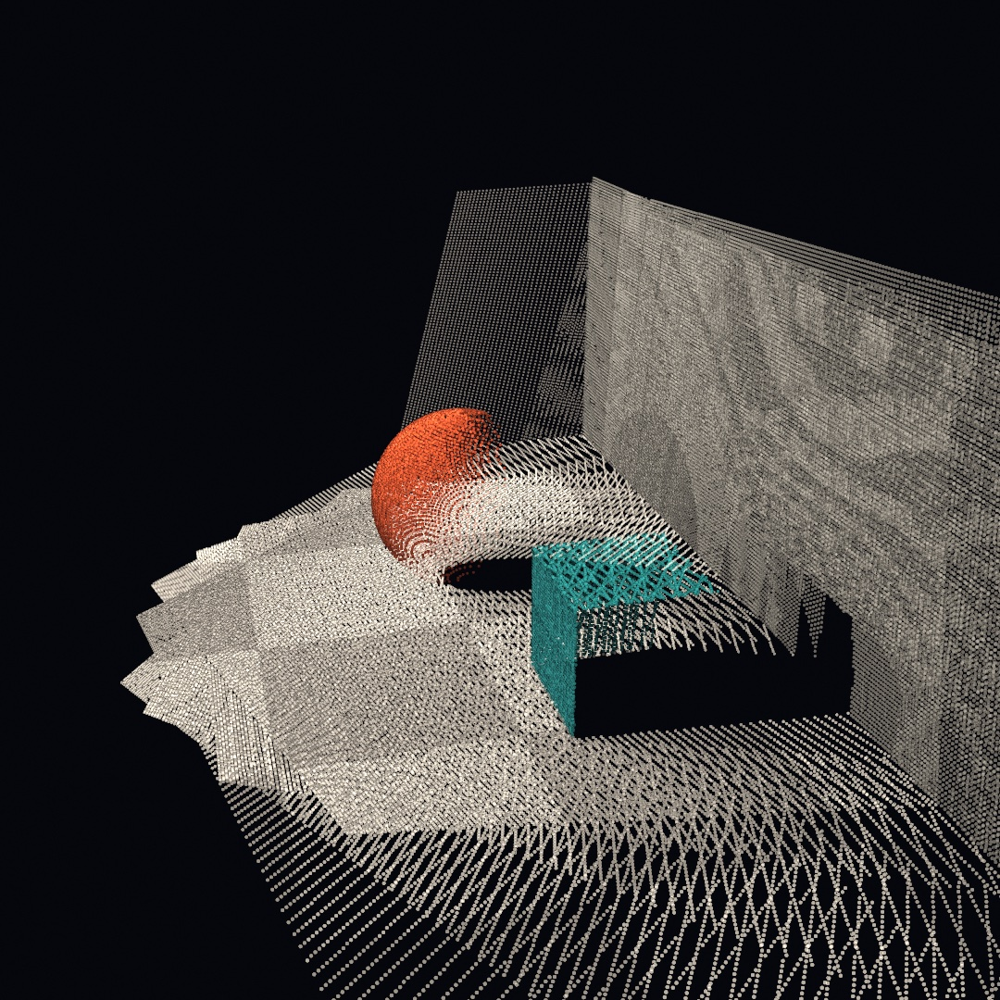
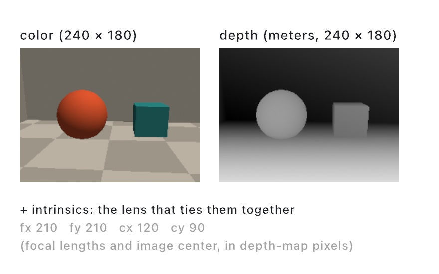
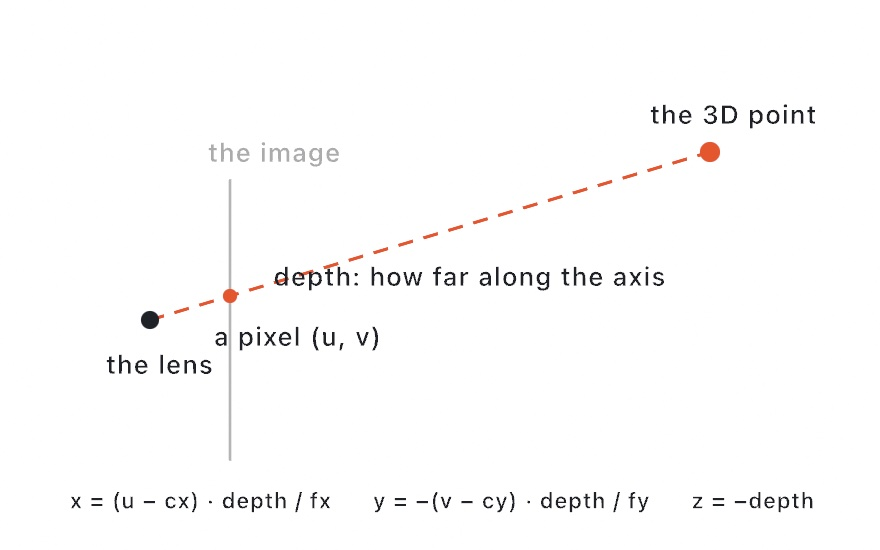
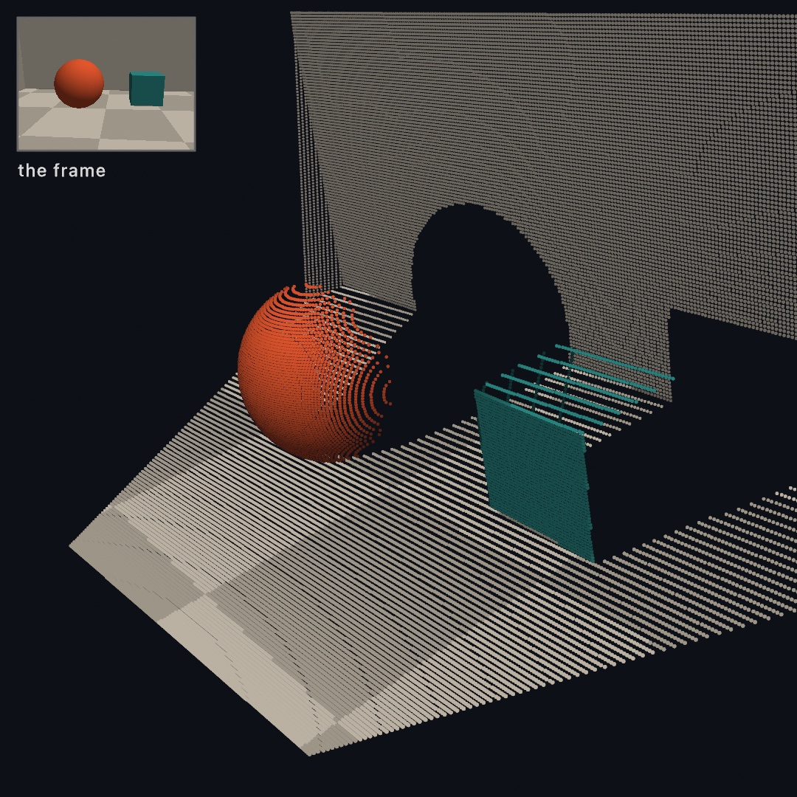
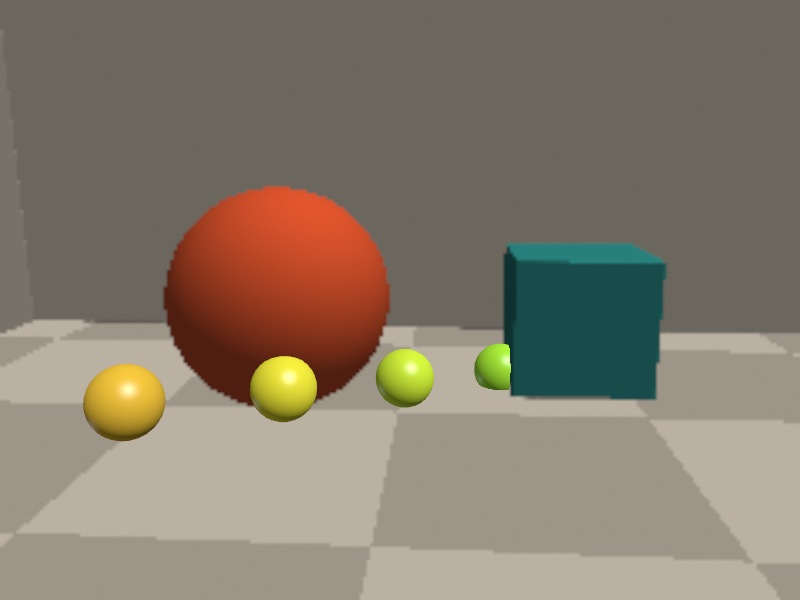
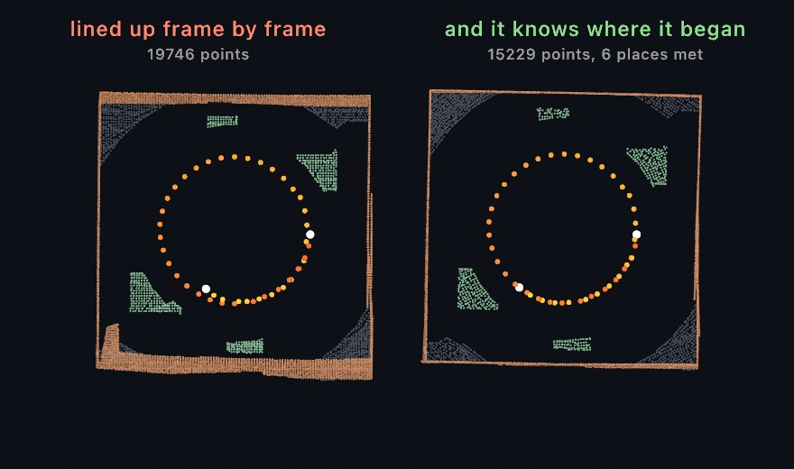
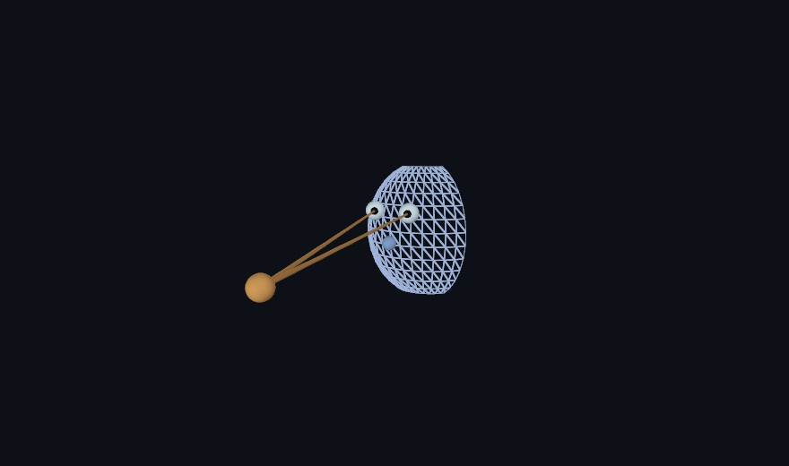
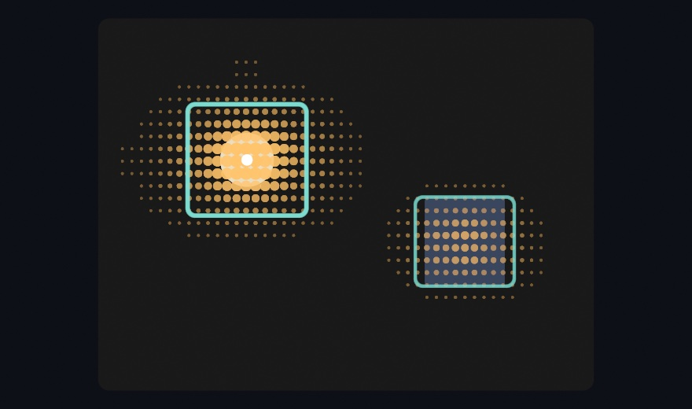
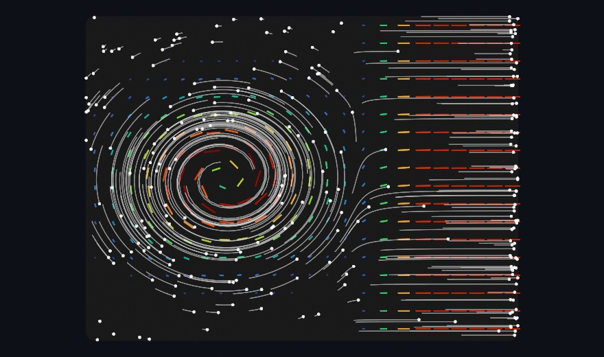
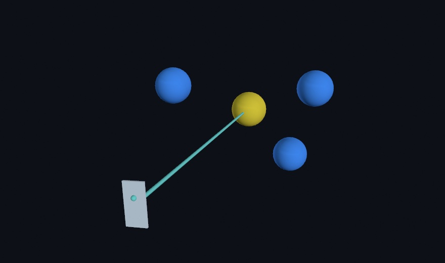

#### <sup>[Ollin](../README.md) → [Guide](README.md) → Chapter 33</sup>

---

# 33. Depth and the iPhone as a sensor



A camera flattens the world. A depth camera keeps one more number per pixel, the distance to what it sees. That number is enough to stand the picture back up. This chapter teaches what a depth frame is and how one frame becomes a cloud of points you can orbit. Then many frames fuse into one scanned room. All of it runs on any Mac, with a pretend depth camera written in Swift. It ends in the ghost room above, a room that scans itself into being.

After the room come the techniques it leaves out, still on the Mac. You can draw inside a depth frame, keep a long scan from drifting, and turn a cloud into a surface. Then come the real sensors: a recorded clip, a live stream, and Ollin Capture, the iPhone app. Last are the phone's other streams. They bring the room it builds, the people in front of it, and what its picture shows. They also make the phone in your hand an input.

## What a depth camera sees

A **depth camera** measures how far away each point is, as well as its color. The Pro iPhones carry one on the back, a **LiDAR** scanner, which times light as it bounces back from the room. Every iPhone with Face ID carries one on the front, the **TrueDepth** camera, which reads a pattern of dots it projects onto your face. Whatever the hardware, every depth source hands you the same three things. First a color image, then a depth map holding one distance per pixel in meters. Last come the **intrinsics**, a handful of numbers describing the lens that took them.

<picture>
  <source media="(prefers-color-scheme: dark)" srcset="Images/33-DepthAndThePhone/Anatomy-dark.jpg">
  
</picture>

In Ollin that bundle is one value type, `RGBDFrame`, and one call builds it. Here `color` is an `Image`, `depths` the depth map as a list of numbers, and `intrinsics` the lens numbers:

```swift
RGBDFrame(color: color, depth: depths, confidence: nil,
          depthWidth: 240, depthHeight: 180, intrinsics: intrinsics)
```

`confidence` can carry the sensor's own rating of each depth pixel, one number per pixel. It is 0 for low, 1 for medium, and 2 for high. A real sensor is least sure along the edges of things. `nil` means there is no rating, so every pixel counts as high.

This chapter's frames come from a pretend depth camera, `StageCamera`. It sits at the end of [`GhostRoom.swift`](Figures/33-DepthAndThePhone/GhostRoom.swift), about ninety lines. Copy it into your sketch file, below your own class, before you try the blocks in this chapter. Those lines march rays through a tiny staged room, [Chapter 30](30-SculptingWithFields.md#how-the-picture-gets-made-sphere-tracing)'s sphere tracing run on the CPU. They fill those arrays, colors from the scene and depths from how far each ray went. It's a pretend camera, but the frame it produces is a real `RGBDFrame`. So everything else in this chapter treats it as it would treat a LiDAR frame. The code does not change when a real one arrives.

> **Swift note.** `depth` is a plain `[Float]`, row by row from the top left, `0` where the sensor had no answer. Real depth maps are full of those holes, especially along silhouettes, and the calls that read them skip the holes.

## Standing the picture up

One pixel plus one depth is a 3D point. The recipe fits in a sentence. Slide the pixel off the image center, and scale by depth over the focal length. Then set the point that far out along the camera's forward axis.

<picture>
  <source media="(prefers-color-scheme: dark)" srcset="Images/33-DepthAndThePhone/Unproject-dark.jpg">
  
</picture>

That's called **unprojection**, and the intrinsics are the numbers the recipe needs: `cx` and `cy` the image center, `fx` and `fy` the focal lengths. The depth is measured along the camera's forward axis, not along the ray. The camera looks down its own −z, so the point's `z` is minus the depth. You'll rarely unproject one pixel at a time yourself. `pointCloud()` unprojects every depth pixel it trusts, colors each from the color image, and hands the result back as a `PointCloud`. By default it trusts only pixels rated `.high`, and `minConfidence:` lowers the bar.

```swift
// in setup(): a capture marches rays on the CPU, so take it once
let frame = StageCamera.capture(eye: Vector3(0.2, 1.05, 1.7),
                                target: Vector3(0, 0.45, -1.1))
let cloud = frame.pointCloud(pointSize: 0.013)
// …each frame:
camera(.orbiting(target: Vector3(0, 0, -2.9), radius: 4.4,
                 azimuth: 0.85, elevation: 0.35, fieldOfView: .pi / 4))
drawPointCloud(cloud)
```



The cloud sits in the capture camera's own space, in front of it along −z. So the orbit centers on a point at z −2.9. The picture has become geometry you can orbit. Behind the ball and the crate hang black voids, the parts of the room the camera never saw. Every real scan has them, and the next step fills them from more viewpoints.

For one point instead of all of them, `frame.unproject(normalized:)` lifts a single image position to its 3D spot in meters. The position is normalized, given as fractions from 0 to 1 across the image, as [Chapter 32](32-Seeing.md#trackers-attach-then-read)'s trackers give theirs. It reads a small window of depths around the position and takes their median, so a stray hole doesn't spoil it. That lifts a tracked 2D skeleton to its true depth, and the [RGBD reference](../Docs/3D/RGBD.md) shows it paired with the body tracker.

## One world from many frames

A single frame is a slice of the world, whatever the lens saw plus voids. The way past that needs one more ingredient, the **pose**: where the camera stood and which way it looked, written as a transform. A frame's cloud is in the camera's own space. Given the cloud and its pose, `WorldCloud`'s `add(_:transformedBy:)` places the points where they are in the room.

`WorldCloud` gathers the placed points. It divides space into small cubes called **voxels**, `voxelSize` meters on a side, and keeps one point in each cube, the most recent. So frames that overlap don't pile up points where they agree:

```swift
var world = WorldCloud(voxelSize: 0.02)

// `room` is the point the cameras look at, `eye` where this capture stands
let frame = StageCamera.capture(eye: eye, target: room)
world.add(frame.pointCloud(pointSize: 0.016),
          transformedBy: StageCamera.pose(eye: eye, target: room))
// …repeat from other eyes, then:
drawPointCloud(world.cloud)
```


Each capture is tinted coral, green, or blue, so you can see which frame saw what. `StageCamera.capture` takes a `tint:` for that. Three partial views make one room. The small spheres are the three camera positions, and the walls one frame couldn't see are filled in by the frames that could. `StageCamera.pose` knows where the pretend camera stood, with no error. A real phone reports its own pose, as the sensors after the ghost room show.

## Putting it together: the ghost room

The finished sketch turns the sweep itself into the picture. Nine frames of the staged room join the world one per second, drawn as light that adds up while the camera orbits. Make `MySketches/GhostRoom.swift`, with `StageCamera` copied in below the class:

```swift
import Ollin
import simd

final class GhostRoom: Sketch {
    let room = Vector3(-0.1, 0.4, -1.2)
    var world = WorldCloud(voxelSize: 0.012)
    var fused = 0

    override func draw() {
        background(Color(hex: 0x05070C))

        // One more frame of the sweep joins the world every 60 frames.
        let due = min(9, frameCount / 60 + 1)
        while fused < due {
            let a = -1.15 + Double(fused) * 0.29
            let eye = Vector3(room.x + sin(a) * 3.0, 1.1 + Double(fused % 3) * 0.25,
                              room.z + cos(a) * 3.0)
            let frame = StageCamera.capture(eye: eye, target: room)
            world.add(frame.pointCloud(pointSize: 0.011),
                      transformedBy: StageCamera.pose(eye: eye, target: room))
            fused += 1
        }

        cameraShowcase(target: room + Vector3(0, 0.2, 0), radius: 5.8,
                       elevation: 0.4, fieldOfView: .pi / 4)
        blendMode(.add)
        drawPointCloud(world.cloud)
        blendMode(.normal)
    }
}
```

The room uses the depth frame, the point cloud each frame stands up into, and the world cloud that places each one by its pose. Every 60 frames, one more viewpoint joins. `due` is how many should have joined by now, `frameCount / 60 + 1` capped at nine, and the `while` loop from [Chapter 10](10-Vectors.md#putting-it-together-the-swarm) catches `fused` up to it. The integer division drops the remainder, so `due` steps up once a second on a 60 Hz display. At 120 Hz, the other rate of [Chapter 3](03-MotionAndTime.md#the-clock), it steps twice as fast. Each eye stands on an arc around the room, `0.29` radians further along than the last, at one of three heights picked by `fused % 3`.

The cloud is drawn with `blendMode(.add)`, [Chapter 19](19-LayersAndEffects.md#how-new-paint-meets-old-blend-modes)'s additive light. Each cube still keeps one point, but more frames fill more of the cubes along a surface. So a surface many frames saw grows denser and brighter. `cameraShowcase` is the draggable orbit of [Chapter 25](25-3DGently.md#a-camera-and-a-sphere). `import simd` is there for `StageCamera`, which builds its poses with Apple's library of vector math.

The woven texture is the scan lines of the viewpoints interleaving. The solid patches are where many frames agree, and the voids are what no camera reached. Run it live and the room fills in frame by frame, and the orbit lets you look around what was scanned.

Then make it yours:

- Point it at a real room. With a LiDAR iPhone and [the capture app](#ollins-own-app-ollin-capture), swap `StageCamera` for a `PhoneDevice`'s `latestFrame` and `latestPose` and sweep your room. The `3D/Phone/PhoneWorldScan` example builds a scan that way.
- Restage the set. `StageCamera.scene` is a distance function, a plain Swift function from a point to how far it is from the nearest surface. [Chapter 30](30-SculptingWithFields.md#melting-the-smooth-minimum)'s smooth minimum is a short formula you can write into it: `min(a, b) - h * h * k / 4`, with `h = max(k - abs(a - b), 0) / k`. Melt a blob into the room that way and scan it. Its color comes from `shade(at:)`, which picks a color by where a point is.
- Rebuild it solid. Keep each `eye` in an array as the loop places it, and crop the cloud to the room's corner. Then hand both to `reconstructSurface(of:spacing:orientedToward:)`, as [the surface family](#from-the-cloud-to-a-surface-surface-reconstruction) shows. The ghost becomes a room you can light, shadow, and walk a camera through.

The assembly is what this one shows, so keep it as a movie. This writes twelve seconds of it, all nine frames and a few seconds of the finished room:

```sh
swift run OllinLive MySketches/GhostRoom.swift --export-video ghost-room.mp4 --seconds 12
```

## Drawing inside the picture: a depth frame as a stage

The ghost room turned each frame into points and let the picture go. A single depth frame can also stay a picture, with a depth at every pixel, and you can draw into it. Solids go behind what the camera saw, and flat marks sit at a depth.

### Solids behind the scene: drawDepthScene

`drawDepthScene(frame)` draws the color image as the backdrop, and writes the depth map into the depth buffer. A camera built from the frame's own lens, `camera(.intrinsic(...))`, puts your 3D drawing in the same metric space. So the scene hides what you place behind it. It is for putting things into a photographed room, a ball behind a real chair or a creature under a real table. It is [Chapter 25](25-3DGently.md#depth-that-hides-things-the-depth-test)'s depth test, fed from a camera's depth map instead of from solids you drew.



```swift
camera(.intrinsic(frame.intrinsics))
drawDepthScene(frame)

// A run of marbles marching into the room, in meters.
for i in 0 ..< 6 {
    withState {
        translate(-1.3 + Double(i) * 0.44, -0.32, -1.85 - Double(i) * 0.34)
        fill(Color(hue: 0.09 + Double(i) * 0.035, saturation: 0.75, brightness: 1))
        specular(0.5); specularSharpness(60)
        drawSphere(radius: 0.12)
    }
}
```

Count the marbles. Six were drawn, and the crate's depth hides the last ones and slices one in half. The marbles are ordinary solids from Chapter 25, tested against depths that came from a camera. That camera is the pretend one here, and a real one with a phone.

### Flat marks at a depth: depth compositing

Flat drawing can take part too. A label, a tag, or a halo belongs in the scanned room. [Chapter 25](25-3DGently.md#flat-drawing-that-knows-where-it-is-depth-compositing) taught `depth(at:)`, `project`, and `withBillboard` for putting 2D marks at a depth. They work the same in a metric scene like the marbles'. `depth(at:)` takes a point in meters, and `withBillboard` stands a mark at one:

```swift
withBillboard(at: Vector3(0.4, 0.1, -2.2)) {     // a point in the room, in meters
    fill(.white); drawCircle(0, 0, 12)          // hidden where the room is nearer
}
```

A gray depth map with no lens behind it is the other kind of scene. There `drawDepthScene(color:depth:)` draws it, and `depth(0.5)` takes a fraction of the map's own near-to-far range instead. The [depth compositing reference](../Docs/3D/DepthCompositing.md) covers both kinds side by side.

## Keeping a long scan straight: drift and loop closure

The ghost room placed each frame by an exact pose, because the pretend camera knows where it stood. A real camera only estimates its pose. Correcting drift and closing the loop keep a long scan straight when those estimates go wrong.

### When the camera loses its place: correcting drift

Sweep for a minute and the scan starts to fog. The camera's estimate of where it stands is a little wrong in every frame, and the errors pile up instead of canceling. That slow slide is called **drift**. A wall seen early and seen again late lands in two places.

`add(_:correcting:)` corrects it. It slides and turns each arriving frame onto the surfaces already fused, then merges it. It is for any scan that runs longer than a few seconds. The method is the iterative closest point fit of Paul Besl and Neil McKay, from 1992. It measures against surfaces, as Yang Chen and Gérard Medioni did the same year. Kok-Lim Low's linearization, from 2004, turns each round of the fit into a small set of straight-line equations.


The call takes a frame's `cloud` and `reportedPose`, the pose the camera reported with it:

```swift
let fix = world.add(cloud, correcting: reportedPose)
```

Both halves are the same nine captures, seen from the same angle. On the left the walls smear into one slanting sheet. On the right they meet in a clean corner. The corrected scan also holds about half as many points, because a smeared wall fills more space than a wall does.

The correction that worked is kept. The next frame starts from it, so the fit only has to find the newest error, and it costs little. Apply `world.correction` to anything else the camera reports in that space.

It refuses to guess. A frame may find too little to match, or its fit may jump too far or pin down too loosely. Then it gets no new correction of its own. It is merged at the correction carried from before, and `fix.isApplied` says so.

### Coming back to where you started: closing the loop

Correcting a frame has a limit that shows only over a long walk. It fixes the newest error and never revises the poses already laid down. So each frame agrees with the frame before it, and the chain of them comes out smooth, yet the chain can still lean. Go all the way around a room and back to the door, and the far wall is well away from where it is.

**`ScanGraph`** handles that. It is for a walk that comes back to where it began, around a room or through a building. It fuses and corrects as `WorldCloud` does. It also keeps a **keyframe** every so often, a saved frame of the scan rather than an animation key. A keyframe is a pose and a thinned copy of what that frame saw. When a new keyframe lands where an old one stood, the two are matched against each other. That match ties a late pose to an early one, so the chain becomes a loop that does not quite close. The difference is then shared out over every pose in between. That sharing is pose-graph optimization, written from the tutorial of Giorgio Grisetti and colleagues, from 2010.



The call is the same as `WorldCloud`'s, and its answer says when a loop closed:

```swift
var scan = ScanGraph(voxelSize: 0.025)

let update = scan.add(cloud, correcting: reportedPose)
if let loop = update.loop {
    print("been here before: the map moved \(loop.moved) m")
}
drawPointCloud(scan.cloud)
```

Both halves are the same walk, seen from straight above. From overhead a wall is a line, and a scan that leaned draws that line twice. The dots are where each half thinks the camera stood, and the white ones are the first and the last. The walk goes round a little more than once, so its second lap passes the walls its first lap saw. On the left, the second lap lands off the first, and the bottom wall is drawn twice. On the right the laps agree, the walls are single, and the scan holds a quarter fewer points.

What you get from this is a scan that agrees with itself, which is not the same as a scan in the right place. One match pulls the two ends of a walk together and shares the difference along everything between them. It does most of its work at the point of return. In a small room, nearly every frame can see something already fused. There the frame-by-frame fit has taken most of the drift out before the walk gets back, and there is little left to find.

It has two limits. A place is recognized by standing near it. A scan that has drifted further than `settings.searchRadius` before it comes back is out of its own reach. The match is then refused rather than guessed. And a camera facing one bare wall can slide along that wall and fit it as well at every spot. A match made there would record drift as though it had been measured. Only the fit's own sense of how well it is pinned down can catch that. So a room with things standing about in it is easier to scan than an empty corridor.

Run it for yourself with `swift run --package-path Examples Example-3D-Depth-ClosedLoopScan`, which walks a made-up hall twice side by side with the true walls drawn over both.

## From the cloud to a surface: surface reconstruction

The ghost room stays a cloud of points. The points are its look, but nothing in them has a face, a shadow, or a material. A surface built from the points does.

### A solid from a sweep: reconstructSurface

**`reconstructSurface`** turns a sweep into a solid. It fits a small plane to every point's neighborhood. Then it uses the sweep's own camera positions to decide which side of each plane faces the room. Last it pulls one mesh out of the planes. It is for a scan you want to light and shade, and it is the surface reconstruction of Hugues Hoppe and colleagues, from 1992.


Hand it the cloud, a spacing, and `eyes`, the camera positions of the sweep:

```swift
let mesh = reconstructSurface(of: world.cloud, spacing: world.voxelSize * 2,
                              orientedToward: eyes)
material(.dielectric(roughness: 0.55))
drawMesh(mesh)
```

Crop the cloud to the part of the room you want first, since the rebuild spreads its grid over the cloud's whole extent. The rim is torn where the data stops. Where no camera reached, the surface stops, and nothing is guessed. So the mesh can only be as complete as the sweep. A body you only arc in front of keeps an unseen back, and the rebuilt surface frays just past where its data stops. So walk around the things you care about.

When a sweep falls short anyway, `fitting: .robust` swaps the nearest-plane distance for a blend of all the nearby samples. The blend gives less weight to whatever disagrees with its neighbors. It is the robust fit of Cengiz Öztireli, Gaël Guennebaud, and Markus Gross, from 2009. It smooths noise, keeps creases, and trims away nearly all of the fraying that the plane fit leaves at open edges. Doorways and windows stay open either way, which is the shape a room has.

The camera path does double duty here. Every fitted plane has two sides, and the reconstruction turns each toward the cameras that plausibly saw it. So pass the sweep's positions in `orientedToward:` whenever you have them. Keep them in an array as the capture loop places each eye. Without them, orientation propagates point to point across the cloud. That works on a smooth single surface, and struggles where a camera would have known better.

Hand over the `PointCloud` itself, as the block does, and the colors come along. Bare positions give a surface in the fill color, like the figure's plaster. Each mesh vertex takes its nearest sample's color, so the room comes back in the colors the camera saw. Per-vertex colors multiply the `fill`, as a texture does. So the default white fill shows them untouched, and `fill(Color(white: 0.5))` dims the scan without touching its hues. The same trick paints any mesh, via `colored(from:)` for a cloud or `colored(by:)` for a rule.

What comes back is an ordinary `Mesh`, so everything [Chapter 25](25-3DGently.md) and [Chapter 26](26-Meshes.md) taught applies. That means materials, lighting, cast shadows, even `subdivided(_:)` to soften the scan.

### Points as their own material: particleSurface

Sometimes points are their own material rather than a scan, a splash, say, or a swarm dense enough to read as a body. `particleSurface` skins them as one blended form, with no cameras involved. It is the blended particle surface of Yongning Zhu and Robert Bridson, from 2005, written for sand that flows like a fluid. With `points` a list of positions, `particleSurface(of: points, radius: 0.05)` hands back one mesh. The [reference page](../Docs/Generators/SurfaceReconstruction.md) covers both calls, and the `3D/Geometry/SurfaceFromPoints` example puts the two side by side on one cloud.

## The real sensors: a recorded clip, a live stream, and the capture app

The ghost room ran on a pretend camera. Every call it made takes a real depth frame as well. So the code stays the same from here on, and only the source of the frames changes.

### Depth footage: Record3D clips and the live stream

The gentlest start is a **recorded clip**. Record3D, Marek Šimoník's iPhone app, records LiDAR or TrueDepth footage into `.r3d` files. Ollin opens them directly, every frame an `RGBDFrame`. A clip is for depth footage you edit against, re-render, and export the same way every time:

```swift
import Ollin
import OllinRecord3D

final class Replay: Sketch {
    var scan: Record3DRecording?

    override func setup() {
        scan = try? Record3DRecording(path: "/path/to/scan.r3d")
    }

    override func draw() {
        background(Color(white: 0.04))
        guard let scan, scan.frameCount > 0 else { return }
        let i = Int(time * scan.frameRate) % scan.frameCount
        guard let cloud = try? scan.pointCloud(at: i) else { return }
        camera(.orbiting(target: Vector3(0, 0, -1.5), radius: 2.5,    // in front of the lens
                         azimuth: time * 0.3, elevation: 0.2))
        drawPointCloud(cloud)
    }
}
```

Depth footage like this is what volumetric filmmaking works with. The same app also streams **live over USB**. Turn on USB streaming in the app's settings and plug the phone in. Call `start()` on a `Record3DDevice`, and keep the app on its live screen. The device then delivers `latestFrame` continuously, so the person in front of the phone becomes a live point cloud in your sketch.

### Ollin's own app: Ollin Capture

**Ollin Capture** is Ollin's own iPhone app. It runs **ARKit** on the phone, Apple's framework for placing a phone in the room it sees. It streams typed results the sketch reads like any other input. ARKit's **world tracking** follows where the phone is and which way it points as you move it, which is the pose a scan needs. The app is for the live phone as a whole sensor array. It sends a 3D **body skeleton** and up to three **faces**, each a deforming mesh plus 52 expression values called **blendshapes**. It sends up to four **hands**, each a 21-joint skeleton. There is also rear-LiDAR **world depth** with the camera's own pose, and **device motion**. A **person segmentation** matte comes from the rear camera, or mirrored from the front like a selfie:

```swift
import OllinPhone

let device = PhoneDevice()
device.start()                  // in setup()
// …in draw():
device.latestBody               // a skeleton in meters
device.latestFrame              // an RGBDFrame from the LiDAR
device.latestPose               // where the phone is, and which way it looks
```

The depth and the pose land in the types this chapter used, and the sketch never knows which sensor filled the frame. The `3D/Phone/PhoneWorldScan` example sweeps a room with `latestFrame` and `latestPose` in place of the pretend camera.

The app is built onto the phone from its Xcode project, since an iOS app cannot run from `swift run`. It needs an iPhone with an A12 chip or later on iOS 17 or later. The LiDAR streams need a Pro model, and the face and gaze streams the front TrueDepth camera. The [Record3D](../Docs/3D/Record3D.md) and [Phone](../Docs/3D/Phone.md) references cover the setup, and the `3D/Depth` and `3D/Phone` example groups are live starting points for each stream.

## The room from the phone: its mesh, its surfaces, and its light

The ghost room built a room out of points you fused yourself. A LiDAR phone builds the room on the device as you walk, and streams it. The flat surfaces in it and the light it is lit by come along.

### A surface the phone already built: the room mesh

[From the cloud to a surface](#from-the-cloud-to-a-surface-surface-reconstruction) rebuilt a surface on the Mac. ARKit reconstructs the room on the phone instead, and Ollin Capture streams the result. It is for a room to light, to hide things behind, or to bounce something off. Tap **Room** and what arrives already has faces and normals, and every triangle already knows what it is.


```swift
var room = Mesh(positions: [], indices: [])
var built: Int?

override func draw() {
    if device.sceneMeshVersion != built {      // only when a block changed
        built = device.sceneMeshVersion
        room = device.sceneMesh.mesh
    }
    drawMesh(room)
}
```

The `sceneMeshVersion` check matters. The room arrives in **blocks**. ARKit cuts the space into pieces and keeps improving each piece as you look at it again. So a piece turns up many times, and the newest reading replaces the last. `sceneMeshVersion` changes whenever that happens. A scanned room reaches hundreds of thousands of triangles, and `draw()` runs 60 or 120 times a second. Rebuilding the mesh every frame is the mistake to avoid here.

Then the labels. Every triangle carries a `PhoneSurface`, one of wall, floor, ceiling, table, seat, window, door, or unclassified. So the same room can be asked for three ways, as the three copies in the picture show:

```swift
let scan = device.sceneMesh
scan.mesh                          // all of it, one mesh
scan.mesh { surface in            // a color per triangle
    switch surface {
    case .floor: return Color(hex: 0x5FB681)
    case .wall:  return Color(hex: 0x9AA4BC)
    case .table: return Color(hex: 0xE8B25A)
    case .seat:  return Color(hex: 0xDD7A66)
    default:     return .white
    }
}
scan.mesh(of: .floor, .table, .seat)   // only the labels you ask for
```

A real scan has far more blocks than the picture.

Early in a scan almost everything reads `unclassified`, because ARKit decides what a surface is only once it has seen enough of it. `foundSurfaces` tells you which labels have appeared so far, so a sketch that keys off labels can say so while the room fills in.

So which do you want, points or a surface? Both come off the same sensor. The points are what the camera saw, and the mesh is what the phone decided was there. Take the points when you want to scatter, drift, or reconstruct them yourself. Take the mesh when you want something to light, to hide things behind, or to bounce something off. The `3D/Phone/PhoneRoomMesh` example paints the room by label, with a keyboard key to keep only the flat things you could set something down on.

### Somewhere to stand: flat surfaces

The mesh is the whole shape of the room, clutter and all. Most of the time you want far less than that, one flat surface to put something on. Room mode reports those too. ARKit finds a floor, a table top, or a wall as a single flat patch, and grows it as you look around. This needs no LiDAR, so it works on any phone that runs the app.


```swift
if let table = device.planes.largest(of: .table) {
    withState {
        translate(table.center + table.normal * 0.15)
        drawSphere(radius: 0.15)
    }
}
```

`largest(of:)` picks by real area, measured on the outline rather than on the box around it, so a long thin shelf never wins. For the ground, `floor` is the one to reach for, because it answers early. It gives you the labeled floor once ARKit has decided, and the lowest flat surface until then.

Every surface carries that outline: a convex polygon around everything the phone has seen of it. `plane.mesh` fills it in, and `plane.outline` is the same loop closed, ready for `drawTube`.

### The light in the room: PhoneLight

The phone also measures how bright and how warm the room is, a few times a second. It does this in every mode that runs the camera through ARKit, which leaves out Selfie, Touch, and Sketch. It is for a sketch whose light follows the room's.

```swift
ambientLight(device.latestLight?.ambient ?? Color(white: 0.4))
```

`ambient` is the room's own white, turned down by how bright the room is. The three swatches under the flat-surfaces picture above are three readings, a lamp, a working room, and a window. Switch a lamp on and the sketch warms with it.

Only Face mode knows where the light comes from, because ARKit works that out from the shading on a face. A world-facing camera has no face to read, so Room mode gives you brightness and color, and you aim your own key light.

## People from the phone: a body, hands, and a gaze

The ghost room placed its frames in one world, in meters. The phone places people in that world too. [Chapter 32](32-Seeing.md#the-body-as-a-controller-hands-faces-and-bodies) read hands, faces, and bodies from a webcam, and its 3D body tracker estimated meters from a flat picture. A LiDAR phone measures them.

### A pose you can dress in solids: the body

`latestBody` is more than dots. Every joint arrives with an orientation beside its position, so a solid part can sit at a joint and turn with it. It is for a figure you dress in solids that follows a person around the room. ARKit's body tracking makes the stream on the phone. `modelTransform(_:)` composes a joint's position and orientation into one pose, and `transform(_:)` puts that pose onto the transform stack in a single call. String `drawCapsule(from:to:radius:)` between the joints and the skeleton grows bones you can light.


In `draw()`:

```swift
if let body = device.latestBody {
    for (a, b) in body.bones() {
        drawCapsule(from: a, to: b, radius: 0.03)
    }
    if let pose = body.modelTransform(.head) {
        withState { transform(pose); drawSphere(radius: 0.11) }
    }
}
```

The camera never saw the blue forearm's joints. ARKit's rig, the standard skeleton it fits to a person, filled them in, and `isObserved(_:)` says so, part by part. Two more readings ride along. `scaleFactor` sizes the figure to the person in front of the camera. And `worldTransform` stands the skeleton where the person is, in the same ARKit world as the swept cloud and the room mesh. Walking across the room walks the figure across the sketch. The `3D/Phone/PhoneBodyFigure` example runs it live, a mannequin that follows you around the room.

### A hand you can reach in with: hands

The body stream draws a whole person, and the hand stream comes in close. Chapter 32's `HandTracker` reads the same 21 joints from a webcam. In **Hands** mode the phone finds up to four hands, each as 21 joints, the wrist and then four joints along every finger. On a LiDAR phone every joint also carries a position in meters, in the same world as the swept cloud and the room mesh. A hand points, pinches, and conducts, so this is the stream gestures come from.


In `draw()`:

```swift
for hand in device.latestHands {
    for (a, b) in hand.bones() {
        drawCapsule(from: a, to: b, radius: 0.006)
    }
    if let pinch = hand.pinchDistance, pinch < 0.02 {
        // thumb and index are touching: a click, made of air
    }
}
```

The orange hand is a right hand and the blue one a left, from `chirality`, which says which hand it is. The white bead sits where the blue hand pinches. `pinchDistance` measures thumb tip to index tip in meters. Under about two centimeters, the fingers are touching. A pinch can pluck a note, a spread can stretch a shape, and a fingertip can draw a ribbon through the room. A joint the model could not see stays absent. On a phone with no LiDAR, the same hands arrive flat, ready to map over the canvas with `point(_:in:)`. In the `3D/Phone/PhoneHands` example, a hand you hold up stands in the room as a small solid skeleton.

### Where a look lands: gaze

The face stream carries more than expression. Each face arrives with its two eyes and one extra point, `lookAtPoint`, where those eyes converge. The head says where you face, and the eyes say where you look. Chapter 32's `FaceTracker` reads the head's pose from a webcam, and the gaze is what the phone adds. It is for a cursor you steer with your eyes. It comes from ARKit's face tracking, which needs the front TrueDepth camera. Every position also comes in world coordinates, as `worldEyePosition(_:)` and `worldLookAtPoint`.



In `draw()`:

```swift
if let face = device.latestFace {
    let target = face.worldLookAtPoint
    for eye in PhoneEye.allCases {
        drawCapsule(from: face.worldEyePosition(eye), to: target, radius: 0.002)
    }
}
```

The shell is the face mesh drawn under `headTransform`. It stands where the head is and turns the way the head turns. The head points one way. The eyes look another, and both beams land on the same warm bead. Park a creature at that point, or steer a brush with a glance. The blink blendshapes pair with the eyes, so `.eyeBlinkLeft` is the left lid closing over `worldEyePosition(.left)`. The mesh also carries its texture coordinates, the same mapping on every face. A painted mask keeps its place while the face deforms. In the `3D/Phone/PhoneGaze` example, look past the phone and the bead lands where you look.

## The picture from the phone: words, attention, motion, and a known print

The ghost room kept only where things are. The phone can also read what its picture shows. The Mac did that in Chapter 32 with its text reader, its saliency map, and its optical flow. On a LiDAR phone it stands what it finds in the room, and it can find a printed picture you gave it.

### The words on the wall: text

The phone reads text, as [Chapter 32](32-Seeing.md#words-off-a-page-textrecognizer)'s `TextRecognizer` does. It is for a sketch that answers a sign or a label where it hangs. In **Text** mode it runs Apple's on-device recognizer over the rear camera. It streams every line it can make out, a sign, a book spine, or a note on a door. Each line arrives as a `PhoneText` with its string and the reader's confidence. On a LiDAR phone its four corners carry positions in meters, and `worldTransform` folds them into one matrix. Stand a drawing on that matrix and it hangs where the sign hangs.


In `draw()`, an underline under each line:

```swift
for line in device.latestTexts {
    guard let placement = line.worldTransform else { continue }
    withState {
        transform(placement)   // x along the words, y up the line, z off the surface
        drawCapsule(from: Vector3(-line.worldWidth / 2, -line.worldHeight / 2, 0),
                    to: Vector3(line.worldWidth / 2, -line.worldHeight / 2, 0),
                    radius: 0.004)   // an underline, drawn on the world
    }
}
```

The upright word stands on a wall and the flat one lies on a table, and neither needed different code. Each panel is the line's own quad. Type drawn inside it, [Chapter 8](08-Words.md)'s `textToShapes` run through `drawTube` and scaled by `worldWidth`, sits on its wall or its table. The frame does the placing. A line lifts all four corners or none, so `worldTransform` is either a real place or `nil`. The flat fallback draws the same lines over the canvas with `corners(in:)`. Underline a read word, replace it, translate it, or move it off its wall. In the `3D/Phone/PhoneWorldText` example, aim the phone at anything readable and the words stand in the room.

### What draws the eye: attention

Where a picture pulls the gaze is the next reading, as [Chapter 32](32-Seeing.md#where-an-eye-would-go-saliencytracker)'s `SaliencyTracker` gives it on the Mac. It is for spending detail or attention where a viewer will look. In **Attention** mode the phone runs Apple's on-device attention model over the rear camera, a model trained on where people look. Each reading arrives as a `PhoneSaliency`, a coarse heat map of visual attention and the regions it peaks in. The heat comes ready to draw as a tintable glow, and `salience(at:in:)` reads the pull under any canvas point.



In `draw()`, with `rect` the rectangle you draw the phone's camera frame into:

```swift
if let attention = device.latestSaliency,
   let heat = device.latestSaliencyHeatMap {
    tint(Color(red: 1, green: 0.72, blue: 0.3, alpha: 0.75))
    drawImage(heat, in: rect)          // attention as a warm glow over the frame
    noTint()
    for region in attention.regions {
        drawRect(region.bounds(in: rect), cornerRadius: 10)   // what stood out
    }
}
```

The figure reads the map the other way, as a field. Its dots are `salience(at:in:)` sampled on a grid, one query per cell, and the white bead sits at the strongest pull. Big values pull and small values let things be, so the same field drives stippling, particle drift, or where a brush is allowed to land. The frames are the model's regions, their line weight following its confidence. On a LiDAR phone each region's center also stands in ARKit world space. The thing being looked at keeps a place beside the room, the hands, and the words. In the `3D/Phone/PhoneAttention` example, point the phone at anything, and a bead moves across the frame to wherever the picture draws the eye.

### How the picture is moving: flow

The phone measures how its picture is moving, too. It is for a sketch that moves with what happens in front of the phone. In **Flow** mode it measures optical flow between consecutive frames of the rear camera, on the phone. Each reading arrives as a `PhoneFlow`, a dense field of motion vectors and the frame it was measured on. [Chapter 32](32-Seeing.md#the-picture-as-a-field-optical-flow) teaches the Mac's own `FlowTracker`, and the phone's field gives you the same reads over the same `MotionField`. It gives a grid of samples, for drawing the motion as arrows, and a vector under any point, for pushing something with it.



In `draw()`, with `rect` as before and `dust` a list of points your sketch keeps:

```swift
if let motion = device.latestFlow {
    for s in motion.samples(in: rect, every: 36) {
        drawLine(s.position, s.position + s.flow * 3)     // the field as arrows
    }
    for i in dust.indices {
        dust[i] += motion.vector(at: dust[i], in: rect)   // the field as a push
    }
}
```

The figure reads one field the two ways, a vortex on the left and a drift to the right. The streaks are `samples(in:every:)`, each the motion under one cell, its color following how fast the picture moves there against the reading's fastest motion. The dust is `vector(at:in:)` applied a few times over. Every grain read the push under itself and moved, and its trail is where that took it. A hand waved in front of the phone becomes a wind, and anything you draw can be blown by it.

One number the phone has that the Mac's tracker does not is `interval`, the time between the two frames a reading was measured across. The Mac analyzes frames as fast as it can keep up, so its gap changes with load. Its vectors are a signal to scale by a gain of your own. The phone measured both frames and knows how far apart they were, so a vector over `interval` is a speed. On both, motion can be measured only where the picture has texture, and a blank wall reads as noise rather than stillness. In the `3D/Phone/PhoneFlow` example, the streaks run over the camera frame. Five hundred grains of dust scatter when you wave and settle when you hold still.

### A picture it knows: markers

Reading is one way to recognize something. Knowing it by sight is the other. Give the capture app a picture and it will find that picture in the room, through ARKit's image tracking. It is for a print that becomes a stage, a card on a table or a poster on a wall. Drop the file into the app's own folder over the cable, in Finder, under Files, then Ollin Capture. Say how wide you printed it in the file's name, `poster@30cm.png`. ARKit places a print by its real width, and no image file carries one. Tap **Markers** and the phone starts looking.

Each find arrives as a `PhoneMarker`, and its `placement` carries what you need. That frame stands at the middle of the print. Its x runs across the width, y up the height, and z straight off the paper toward you. So the drawing code never mentions walls or tables.


In `draw()`, a cube floating off each print:

```swift
for marker in device.latestMarkers where marker.isTracked {
    withState {
        transform(marker.placement)                 // the print is now the x-y plane
        drawBox(width: marker.width, height: marker.height, depth: 0.002)
        translate(0, 0, 0.08)
        drawBox(size: 0.06)                         // a cube floating off the paper
    }
}
```

The card lies flat and the poster hangs upright. The figure's city of columns is drawn by one loop over both prints, whatever each one's angle, because `placement` carries it. `width` and `height` are meters, so a sketch written for a business card fits a poster by itself. Two things matter before you print. A picture is found by its detail, so a photograph or a dense drawing works where a flat logo does not. The app checks each reference as it loads, and says on its own screen when one is too plain. And a scanned object, an `.arobject` file in the same folder, is *found* once rather than followed. It marks a place, where a picture marks a moving thing.

Dropping files into the phone's folder leaves the sketch in two halves, the sketch in one place and its pictures on one phone. The sketch can carry them instead. `device.use(.markers)` asks for the mode. `device.look(for:)` hands over the pictures with the width each was printed at, and the phone rebuilds its library from what arrives. The [phone reference](../Docs/3D/Phone.md#saying-what-to-look-for-from-the-sketch) has both calls and the state the phone sends back, and the `3D/Phone/PhoneMarkers` example sends a bundled photograph this way.

## The phone in your hand: a wand, its ears, the glass, and the air

The ghost room's camera looked at the room, and so do the streams so far. The wand, the ears, the glass, and the air use the phone itself as the input. None of them needs LiDAR.

### Pointing at it with the phone: the wand

The phone knows where it is in the room. So it also knows where it is *pointing*, and that makes it a wand, something you aim at your own sketch. It is for picking things up, pushing them, and dropping them without a mouse. It comes from ARKit's world tracking alone. Tap **Wand**.



```swift
guard let wand = device.latestWand, wand.isTracked else { return }
```

A `PhoneWand` is a place, a direction, and a button. `wand.position` is where the phone is, in the same meters as everything else in this chapter. `wand.ray` is the line out of the back of it, the end you point at things:

Here `balls` is your list of ball centers, and `aimed` remembers which one the beam hits:

```swift
var aimed: (index: Int, distance: Double)? = nil
for (i, ball) in balls.enumerated() {
    if let along = wand.ray.hit(sphereAt: ball, radius: 0.13) {
        aimed = (i, along)                       // how far along the beam it sits
    }
}
```

That `hit` is a [`Ray3`](../Docs/Drawing/Geometry.md#ray3), the small value type that answers what a line runs into. It knows about a ball, a box standing square to the world, and a flat surface. It counts only what is in front of the origin, so a ball behind the phone is never hit.

The beam stops where it lands, because the hit told it how far to go, and `wand.point(at:)` turns that distance into a point. Draw the phone itself through `wand.placement` and it leans in your hand the way the real one does.

The button is the screen, and it arrives twice. `wand.isPressed` is whether a finger is down now, which is what a drag reads. `wand.pressCount` only ever rises, so a tap that landed and left between two `draw()` calls is still there to find. `lastPressCount` and `held` are properties your sketch keeps:

```swift
if wand.pressCount > lastPressCount, held == nil { held = aimed?.index }
lastPressCount = wand.pressCount
```

Keep last frame's number and compare. A counter that only rises tells you something happened, without asking you to be watching at the moment it did.

`wand.touch` is where the thumb sits while it is down, `-1` to `1` across and up, and `nil` while no thumb is on the glass. The pad is a few centimeters and the room is not. So read it as a speed rather than a place. With `reach` the held ball's distance along the beam, `reach += (wand.touch?.y ?? 0) * 0.8 * deltaTime` pushes it away and pulls it back. The `3D/Phone/PhonePointer` example has a ball you can pick up, carry, push out, and drop.

Before you build on it, know where the room's origin is. It is wherever the phone stood when Wand mode began. Lay your scene out in front of that spot, or expect to walk to it.

### What the phone hears: sound events

The phone has ears as well as eyes. Switch **Hear** on, under the modes, and it names the sounds around it, a dog, a kettle, applause, or a knock at the door. It is for a sketch that answers what happens in the room. Apple's sound classifier runs on the phone, so only the names cross the cable, never the audio. It needs no camera, which is why it is a switch and not a mode. It runs beside whichever mode is on.

[Chapter 34](34-Listening.md#sounds-with-names-soundclassifier) teaches the Mac's own `SoundClassifier`, and the phone's ears give the same two kinds of read. One is a level, for a question that rises and falls:


```swift
let music = device.sounds.confidence(of: "music")
```

The other is a trigger, for a thing that happens once. Here `rings` and `Ring` are your own, a list of marks and a mark, and so is the function that picks a spot for each label:

```swift
for event in device.sounds.events() where event.label == "dog_bark" {
    rings.append(Ring(at: place(for: event.label), born: time))
}
```

The figure spans eight seconds of readings, one window every three quarters of a second. A real phone sends about two a second. Read the rings. Each sits at the end of the window that crossed, a moment after the curve climbed over the line. The phone judges a second and a half of audio at a time. Speech climbs over the line once and stays there, and it rings once, not once per window. The dog barks, stops, and barks again, and rings twice. The clap rings once. Music stays under the line throughout and never rings at all, though its level is there for the asking.

An event is a crossing from below. The phone sends its whole judgment, every label with a number, and the Mac decides what counts as loud enough. The threshold is yours, `device.sounds.threshold`, and you can move it while the phone listens. Two sketches reading one phone can disagree about what counts.

`timeSinceHearing(_:)` is the third read, for a mark that fades. It says how long ago a sound was last at or over the threshold, so a sound that keeps going reads near zero. It does not drain. In the `3D/Phone/PhoneSounds` example, every sound that starts rings out in its own place on the canvas, a place found by hashing its name. A room settles into a map of its sounds.

### Playing the glass: touches

Tap **Touch** and the phone stops watching altogether. No camera runs, so no light readings arrive either. The screen under the modes becomes the surface, and the phone sends every finger on it. It is for playing a sketch with your fingers on the glass, the phone as a touch pad. The touches come from the phone's own touchscreen.


In `draw()`, with `pad` the rectangle on your canvas that stands for the glass:

```swift
for touch in device.touches.down {
    drawCircle(center: touch.point(in: pad), radius: 16 + touch.radius * 500)
}
```

`down` is the fingers on the glass right now. Each carries `position`, which runs `-1` to `1` across and up with the middle at zero. `point(in:)` maps that onto a rectangle on your canvas. Each also carries `radius`: how wide the contact is, as a fraction of the screen's width. Reach for that one first. Every iPhone reports it, and a fingertip and a flat finger are far apart. `force` is `nil` on almost every phone made since the 3D Touch years.

The other read is the one that happens once:

```swift
for tap in device.touches.taps() { rings.append(Ring(at: tap.point(in: pad), born: time)) }
```

Look at the third row. That finger landed and left between two of the draws marked along the top, which the figure spaces a quarter of a second apart. A real sketch draws far more often, so this matters for a tap shorter than a frame, or a sketch that runs slowly. So it was never in `down` when the sketch looked, and its tap is there anyway. The phone sends a message every time the set of fingers changes. Ollin reads every one of them, while `draw()` sees only the latest.

Here is how it knows. A finger keeps one number from the moment it lands until it leaves, and the phone never gives that number to another finger. So a number the Mac has not seen is a landing. So sliding a finger across the glass does not tap on every frame. It is also how you follow a tap into the drag it becomes. Keep the `id` the tap gave you, and ask `device.touches.touch(id:)` for it each frame.

`taps()` drains, so read it in one place. If two parts of your sketch need to know, `tapCount` is the same fact without taking it. It only ever rises, so compare it with last frame's number, as with [the wand's button](#pointing-at-it-with-the-phone-the-wand).

The `3D/Phone/PhoneTouches` example plays the glass, with the barometer's air pressure joining in.

### The air it is standing in: the barometer

The barometer reads the room without looking at it. Every iPhone since the 6 has one, a sensor for air pressure. It is for a control you play by raising and lowering the phone. Switch **Air** on, beside Hear, and its readings arrive beside whichever mode is running.

In `draw()`, with `lift` a number your sketch keeps:

```swift
if let air = device.latestAir {
    lift += (air.altitude - lift) * min(1, deltaTime * 3)
}
```

`altitude` is meters above wherever the phone was when it started measuring, not meters above the sea. A barometer knows how the pressure changed far better than it knows the pressure itself. The change is good to about a tenth of a meter. Lift the phone off the table and the number moves.

So it is a fader you play by standing up, and it costs no camera and no model. `pressure` is the weather's own number, about 101.3 kilopascals at sea level, and a door opening in a sealed room moves it.

## Where this comes from

Radiohead's *House of Cards* video, in 2008, brought the point-cloud look to a wide audience. Depth capture then spread through art practice after the Microsoft Kinect shipped in 2010 and hackers opened it to their own programs. James Frost directed it with the data artist Aaron Koblin. It was shot with lidar and with structured light, patterns of light projected onto the scene, rather than with a camera. The RGBDToolkit, from James George and his collaborators, and the volumetric films that followed turned depth footage into a medium you could edit. The unprojection math is the pinhole camera model, the base of photogrammetry and computer vision. Fusing posed depth frames into one model comes from SLAM research. There a moving camera builds a map while it finds its own place in it. It also comes from KinectFusion, by Richard Newcombe and colleagues in 2011. `WorldCloud`'s fit of each frame onto what is already fused is a small relative of it. The entries after the ghost room name their own sources. Full credits are in the project's [attribution notes](../ATTRIBUTION.md).

## Go deeper

- [RGBD frames](../Docs/3D/RGBD.md): the frame type, unprojection, depth-lifted pose (a 2D-tracked skeleton placed at its true depth).
- [3D](../Docs/3D/3D.md#point-clouds): `PointCloud` itself, its point sizing and colors, and how it sits beside the rest of the 3D path.
- [Record3D](../Docs/3D/Record3D.md): recorded `.r3d` clips and the live USB stream, frame by frame.
- [The iPhone capture app](../Docs/3D/Phone.md): setup, body, faces and gaze, hands, world depth with pose, the room mesh, the flat surfaces, the room's light, segmentation, text, attention, flow, markers, the wand, what the phone hears, touches, the air, and world fusion.
- [Depth compositing](../Docs/3D/DepthCompositing.md): `depth(at:)`, billboards, `drawDepthScene`, and the metric camera.
- [Surface reconstruction](../Docs/Generators/SurfaceReconstruction.md): rebuilding a scanned cloud as a mesh, skinning particle sets, and the holes and orientation details.
- Appendix B draws this chapter's math, one picture per idea: [Where things are](B-JustEnoughMath.md#where-things-are), [Into three dimensions](B-JustEnoughMath.md#into-three-dimensions).
- Worked examples: [`Examples/3D/Depth/DepthCloud`](../Examples/3D/Depth/DepthCloud/Sketch.swift) (a webcam depth model, no phone needed), [`Examples/3D/Depth/ClosedLoopScan`](../Examples/3D/Depth/ClosedLoopScan/Sketch.swift) (staged, no phone needed), [`Examples/3D/Depth/Record3DCloud`](../Examples/3D/Depth/Record3DCloud/Sketch.swift), [`Examples/3D/Depth/DepthLiftedPose`](../Examples/3D/Depth/DepthLiftedPose/Sketch.swift), [`Examples/3D/Phone/PhoneDepthCloud`](../Examples/3D/Phone/PhoneDepthCloud/Sketch.swift), [`Examples/3D/Phone/PhoneWorldScan`](../Examples/3D/Phone/PhoneWorldScan/Sketch.swift), [`Examples/3D/Phone/PhoneRoomMesh`](../Examples/3D/Phone/PhoneRoomMesh/Sketch.swift), [`Examples/3D/Phone/PhoneRoomPlanes`](../Examples/3D/Phone/PhoneRoomPlanes/Sketch.swift), [`Examples/3D/Phone/PhoneSounds`](../Examples/3D/Phone/PhoneSounds/Sketch.swift), [`Examples/3D/Phone/PhoneFlow`](../Examples/3D/Phone/PhoneFlow/Sketch.swift), [`PhoneBodyFigure`](../Examples/3D/Phone/PhoneBodyFigure/Sketch.swift), [`PhoneHands`](../Examples/3D/Phone/PhoneHands/Sketch.swift), [`PhoneGaze`](../Examples/3D/Phone/PhoneGaze/Sketch.swift), [`PhoneWorldText`](../Examples/3D/Phone/PhoneWorldText/Sketch.swift), [`PhoneAttention`](../Examples/3D/Phone/PhoneAttention/Sketch.swift), [`PhoneMarkers`](../Examples/3D/Phone/PhoneMarkers/Sketch.swift), [`PhonePointer`](../Examples/3D/Phone/PhonePointer/Sketch.swift), [`PhoneTouches`](../Examples/3D/Phone/PhoneTouches/Sketch.swift), [`Examples/3D/Geometry/SurfaceFromPoints`](../Examples/3D/Geometry/SurfaceFromPoints/Sketch.swift), and [`Examples/3D/Depth/DepthOcclusion`](../Examples/3D/Depth/DepthOcclusion/Sketch.swift).

---

[Contents](README.md#contents) · Previous: [Chapter 32, Seeing](32-Seeing.md) · Next: [Chapter 34, Listening](34-Listening.md)
