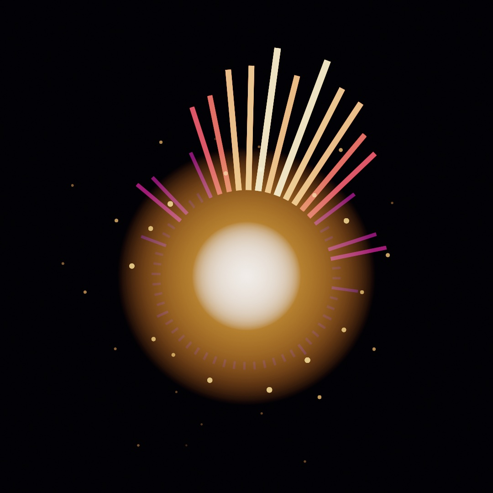
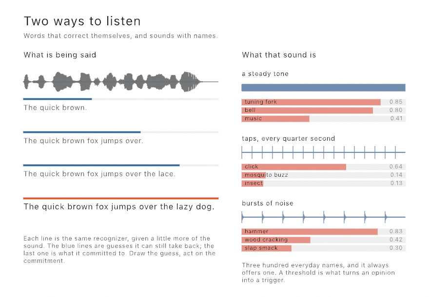

#### <sup>[Ollin](../README.md) → [Guide](README.md) → Chapter 34</sup>

---

# 34. Listening



Every sketch so far has listened to two things, the clock and the mouse. This chapter gives it ears. A microphone or a song becomes a handful of numbers you read in `draw()`, and the picture moves with the music. The numbers say how loud each band is, when a beat lands, which note is being sung, and which words were said. The sketch above does exactly that, and by the end you'll have built it. Hands come next, in [Chapter 35](35-ControlsAndSignals.md), where a knob, a fader, or a sensor you wired drives the same parameters. Making sound rather than hearing it is [Chapter 36](36-MakingSound.md).

## The first listening sketch

Sound reaches a sketch through `OllinAudio`, a small library you import alongside the framework. The simplest start is the microphone and one number, `amplitude`. That is how loud things are right now, roughly `0...1`, smoothed so it doesn't flicker.

```swift
import Ollin
import OllinAudio

final class Pulse: Sketch {
    let mic = AudioInput()

    override func setup() { try? mic.start() }

    override func draw() {
        background(.black)
        fill(.white)
        drawCircle(width / 2, height / 2, (60 + Double(mic.amplitude) * 700) * scale)
    }
}
```

Run it with `swift run OllinLive` like any sketch, say yes when macOS asks about the microphone (it asks once), and hum. The circle breathes with you. That's the whole shape of audio-reactive work: make a source in `setup()`, keep it in a property, read its values every frame. The rest of the chapter is just richer values to read.

> **Swift note.** `amplitude` is a `Float`, because audio hardware speaks 32-bit floats. Drawing wants `Double`, so you'll see `Double(mic.amplitude)` around every audio read. It's a conversion, not a calculation; nothing is lost that your eyes could see.

## A microphone we can print

A guide has a problem a live sketch doesn't. Every figure in these pages must render the same way on any machine, and no two rooms sound alike. [Chapter 33](33-DepthAndThePhone.md) solved this with a pretend depth camera, and this chapter fakes a microphone. `StageMic` is about thirty lines at the bottom of [`Anatomy.swift`](Figures/34-Listening/Anatomy.swift), the committed figure. It synthesizes a little band, then feeds the samples into a real `AudioAnalyzer`, the same analysis engine behind `AudioInput`. The band is a kick drum every half second and a hat between the kicks. Over that sit a held bass note, a slow four-note arpeggio, and a whisper of hiss. Every audio number in this chapter comes out of that analyzer, exactly as it would from the air. Only the air is missing. Swap `StageMic` for `AudioInput()` in any figure and it listens to your room instead.

The analyzer is worth meeting directly, because it's also the seam for sounds Ollin hasn't heard of. It's public, so anything that can produce a stream of samples can feed one.

## What the analyzer hears

Sound arrives as **samples**, which are measurements of air pressure, 44,100 of them per second. A microphone hands the analyzer that stream, and the analyzer answers three questions about the most recent instant.

<picture>
  <source media="(prefers-color-scheme: dark)" srcset="Images/34-Listening/Anatomy-dark.jpg">
  
</picture>

The top panel is the **waveform**, the samples themselves. One big slow swell, the kick's low thump mid-decay, carries fast wiggles on it, which are the melody. It's the honest raw material, and mostly you'll draw it only when you want an oscilloscope look.

The middle panel is the **spectrum**, and it's the reason audio-reactive visuals work at all. Sound is vibration, and pitch is how fast the vibration is. A low note shakes the air few times a second, and a high note many more. The rate is measured in hertz, meaning cycles per second. The spectrum splits the instant into how much energy sits at each speed, like a prism splitting light into colors. Suddenly the mix is legible. The kick's 55 Hz thump, the bass note at 110 Hz, and the melody near 659 Hz each get their own spike. The tool that computes this split is the Fourier transform. The analyzer runs it for you every frame, and `spectrum` is the result, an array of magnitudes from low frequencies to high.

Raw spectra are awkward to draw, though. The values are unnormalized, and the interesting musical action crowds into the first few bins. That is because hearing is logarithmic, so every doubling of frequency sounds like one equal step. That step is what an octave is. So the bottom panel is the read you'll actually use, **`bands(_:)`**:

```swift
for (i, level) in source.bands(24).enumerated() {
    let h = Double(level) * 300 * scale           // level is already 0...1
    drawRect(Double(i) * 34 * scale, height - h, 30 * scale, h)
}
```

`bands(24)` gives 24 bars spread the way hearing is, log-spaced, so the bass isn't crammed into one bar. Each is normalized to roughly `0...1` by a gain that adapts to the material. Each rises fast and falls gently, so bars look alive instead of jittery. A bar's height becomes a plain map to pixels, no hand-tuned scaling. Ask once per frame, with a fixed count.

Between the raw spectrum and the shaped bands sit three named conveniences, `bass`, `mid`, and `treble`. They are the energy in the low, middle, and high ranges. There is also `magnitude(in: 40...120)` for a range you pick yourself. Those are unnormalized like the spectrum, so scale them to taste.

## Hearing the beat

Loudness and spectrum answer "how much", but the other thing music has is **arrivals**. A drum hit is a moment, not a level. A visual that flashes on the drum reads as listening in a way a level meter never does.

<picture>
  <source media="(prefers-color-scheme: dark)" srcset="Images/34-Listening/BeatTimeline-dark.jpg">
  
</picture>

The detector behind this compares each instant's spectrum with the one just before and adds up the rises. A sudden brightening across many frequencies at once spikes that sum, and the analyzer counts it as a beat. A drum hit, a plucked string, and a note starting all do that. Three reads surface it:

```swift
source.beat            // a 0...1 pulse: snaps to 1 on each beat, fades over ~0.25 s
source.beatCount       // how many beats so far
source.timeSinceBeat   // seconds of audio since the last one
```

`beat` is the ready-made value, so multiply a radius by it and the picture throbs. `beatCount` is for firing something exactly once per beat, by comparing against a stored count, the way the finished sketch spawns sparks. Look at the timeline, where every kick lands and so does the quiet off-beat hat, with the same confidence. That's what the detector really is. Onset detection hears *arrivals*, sudden changes in the sound, not loudness and not "the beat" a drummer would tap. A soft hat is as sudden as a loud kick, so both count. For most visuals that's exactly what you want. When it isn't, `beatSensitivity` is the parameter, and a higher value asks for stronger arrivals before firing. The detector is deliberately steady the rest of the time, so held chords and drones don't drift into false triggers. The same recording always beats in the same places.

The detector says *that* a beat arrived, and it keeps no sense of tempo. Following the tempo of the room, so a sketch can play in time with a record, is `BeatFollower`. [Chapter 37](37-MusicByRule.md#playing-along-with-the-room-tempo-sync) teaches it once the sketch has notes of its own to play.

## The note being sung

Loudness and beats are about *when*. Pitch is about *what*. A voice holding a note, a bowed string, a whistle: each shakes the air at one rate, and the analyzer can name it.

```swift
if let heard = mic.pitch {
    drawText("\(heard.nearestPitch)", width / 2, 80 * scale)             // "A4"
    let y = map(heard.midi, 48, 84, height, 0)                   // pitch as a height
    drawCircle(width / 2, y, (20 + Double(heard.confidence) * 40) * scale)
}
```

`pitch` is nil when nothing is being sung: silence, a room, a noise with no repeating shape in it. That is why it reads with `if let`. When there is a note, it carries four things. `frequency` is the rate in hertz. `nearestPitch` is the nearest name on the piano. `cents` is how far above or below that name the voice sits, where a hundred cents is one semitone. `confidence` is how sure the detector is. A pure tone reads 1, a sung or bowed note above 0.9, and noise never passes 0.5, which is where reporting stops. `midi` puts the note and the cents back together as one number. Map that onto a position rather than `frequency`. The ear hears equal steps of it as equal steps, and an octave is always twelve of them. A doubling in hertz is not a fixed distance on any ruler. `nearestPitch` alone is the short read: `mic.nearestPitch` is a `Pitch`, and a `Pitch` prints as its name.

The detector does not look for the loudest frequency. It looks for the shortest delay after which the waveform repeats, a method called YIN. A note with harmonics repeats at its fundamental's period even when the fundamental is the quiet part, or missing altogether. That is also how the ear decides. So a bowed string reads at the string's note rather than at its brightest overtone. The window is about 50 ms, so a new note is heard that much after it starts. The reading is not smoothed, since a held note holds steady on its own. A sketch that wants a slow needle eases toward `midi` itself.

<picture>
  <source media="(prefers-color-scheme: dark)" srcset="Images/34-Listening/FollowingANote-dark.jpg">
  
</picture>

The top strip is four seconds of the bundled violin, one dot per window. The dots sit on the semitone lines because the player is in tune, and each is as solid as the detector was sure. The few dots an octave or more below the melody are double stops. Two strings at once repeat only at the period both share, and the reading lands there. One note at a time is the promise. A chord has no single pitch.

For a chord, read `chroma`. It is twelve values, C first, one per note name, each `0...1` with the loudest at 1, and every octave folded onto the same twelve. The middle strip is that read over the same four seconds, and the melody draws itself through the note names. A C major chord lights C, E, and G whatever octaves they sound in. It is the read for harmony: which notes are in the air, with the octave thrown away.

```swift
for (i, level) in source.chroma.enumerated() {                // C first
    let h = Double(level) * 200 * scale
    drawRect(Double(i) * 40 * scale, height - h, 36 * scale, h)
}
```

The bottom of the figure is a tuner: the note and the cents at one instant. The `Audio/Tuner` example is that face, live, with the trace and the twelve classes under it. It follows the violin by default. Run it with `--mic` and sing at it. The `Audio/GuitarTuner` example is the six-string kind. It compares `midi` to each open string and lights the nearest. The cents are read against that string's own pitch, not the nearest piano key, so a string a semitone flat still points at its peg.

## Four places sound comes from

Everything above reads the same off any source, so choosing a source is one line:

```swift
let mic = AudioInput()                                         // the room
let song = try AudioPlayer(resource: "track", withExtension: "m4a", in: .module)
let tone = Tone(frequency: 220, waveform: .sine)               // a note of your own
let sound = Soundtrack(of: player)                             // a playing video's audio
```

`AudioInput` is the microphone, permission and all. `AudioPlayer` plays a file and analyzes it as it sounds, taking `.m4a`, `.mp3`, `.wav`, and friends. The `Audio/FilePlayer` example ships with a violin recording and shows the shape. It's also the source that survives export. During a headless render it follows the export clock through the file, so an audio-reactive piece writes the same frames every time. [Chapter 38](38-FinishingASketch.md) has the whole export story. `Tone` is a modest oscillator that both sounds and feeds the analyzer, which makes it the self-contained option. The `Audio/Spectrum` example generates a gliding sawtooth and draws its own harmonics, with no permission and no file. And `Soundtrack` taps the audio of a playing `VideoPlayer` from [Chapter 32](32-Seeing.md)'s territory, so footage can drive visuals with its own music. One habit applies to all four. An audio file you bundle follows the same license care as any asset, so credit what you ship.

## Words, and what that noise was

Everything so far reads sound as a shape: how loud, which frequencies, when the beat landed. A sketch can also ask what it is hearing. Two listeners answer that, and both attach to any of the four sources above.

```swift
let mic = AudioInput()
var speech: SpeechListener!
var ears: SoundClassifier!

override func setup() {
    speech = SpeechListener(of: mic)
    ears = SoundClassifier(of: mic)
    try? mic.start()
}
```

That is two things listening to one microphone, which is fine. The source is tapped once, and the audio goes to everything attached to it, a `Soundtrack` analyzer included.

`SpeechListener` turns talking into words. It runs on your Mac, nothing is uploaded, and it asks for no permission of its own. The microphone asks for its own the first time you start it. The first use of a language may install its model, which takes a moment, and until then `unavailableReason` says so.



The left half of that figure is the thing worth understanding before you write any of this. Recognition guesses early and corrects itself as it hears more. Each line there is the same recognizer handed a little more of the same sentence. Three quarters of the way through it was sure the fox jumped over the lace. It was not wrong to say so; it just had not heard the rest yet.

So a listener gives you two reads, and they are for different jobs:

```swift
drawText(speech.caption, at: center)              // the guess, which may change
for phrase in speech.phrases() {                  // what it committed to
    if phrase.text.lowercased().contains("red") { palette = .warm }
}
```

**Draw the guess, act on the commitment.** `caption` is the running best guess, tail and all. It is trimmed to its last handful of words, so it does not run off the canvas. `phrases()` drains what the recognizer has finished with, each phrase handed out once, which is what makes it safe to trigger from. Trigger from `caption` and you will act on a word that gets taken back.

The other listener names sounds. `SoundClassifier` knows three hundred everyday ones, from `clapping`, `dog_bark`, `knock`, `glass_breaking`, and `police_siren` through every instrument family to `silence`. It too splits into a level and a trigger:

```swift
let musical = ears.confidence(of: "music")                   // rises and falls
for event in ears.events() where event.label == "clapping" { // happens once
    marks.append(Mark(at: center))
}
```

An event fires when a label crosses the threshold from below. A sound that goes on is one event, not one per moment it is still going. `timeSinceHearing("clapping")` is the read for a mark that fades, since draining is destructive and fading is not. An iPhone can listen the same way from across the room, and [Chapter 33](33-DepthAndThePhone.md#what-the-phone-hears-sound-events) reads its sounds with the same three reads.

The right half of the figure is the caution. Those three sounds are arithmetic, not recordings. They are a sine wave, a tap every quarter second, and bursts of noise. The classifier called them a tuning fork, a click, and a hammer, which is fair enough. But it always answers, whatever it hears, so a small number means very little. Read the top label, keep a threshold, and treat the rest as opinion.

Both of these are live only. Under an export nothing is playing, so nothing is heard, and both will tell you so instead of going quiet. When an exported piece needs words, work them out first:

```swift
override func setup() {
    caption = try? waitFor {
        try await SpeechListener.transcribe(resource: "voice", withExtension: "m4a", in: .module)
    }
}
```

That form is deterministic, which is the same promise the seed made in [Chapter 4](04-Randomness.md). The same audio gives the same words every time, so a captioned export renders identically on Tuesday. The `Audio/Listening` example is the live one, with a caption you can talk into and marks you can clap at.

## Putting it together: a playable instrument

The finished sketch wires the whole chapter together. `bands` is worn as a crown of spokes, and a core throbs on `beatCount`. Sparks are flung on each arrival, and two `@Param` parameters wait for whatever hands you have. Make `MySketches/Resonator.swift`, and bring `StageMic` along from [`Anatomy.swift`](Figures/34-Listening/Anatomy.swift). The committed figure with everything together is [`Resonator.swift`](Figures/34-Listening/Resonator.swift):

```swift
import Ollin
import OllinAudio

final class Resonator: Sketch {
    let mic = StageMic()

    @Param(24...96) var spokes = 56
    @Param(0.6...2.4) var brightness = 1.4

    struct Spark {
        var position: Vector2
        var velocity: Vector2
        var life: Double
    }

    var sparks: [Spark] = []
    var lastBeat = 0
    var pulse = 0.0

    /// Where the instrument sits: a touch below center, to leave the crown room.
    var mid: Vector2 { center + Vector2(0, 60 * scale) }

    override func setup() {
        seed(20)                              // the sparks re-fly the same way
    }

    override func draw() {
        mic.listen()
        let audio = mic.analyzer

        background(Color(hex: 0x06040E))
        toneMap(.aces)
        blendMode(.add)

        // The beat: snap the pulse up when a new one lands, let it fade.
        pulse *= exp(-deltaTime * 5)
        if audio.beatCount > lastBeat {
            lastBeat = audio.beatCount
            pulse = 1
            spawnSparks()
        }

        // The spectrum, worn as a ring of spokes: bass at the top, treble at
        // the bottom, mirrored left and right so the ring stays symmetric.
        let levels = audio.bands(spokes / 2 + 1)
        withState {
            translate(mid)
            rotate(time * 0.06)
            for i in 0 ..< spokes {
                let band = i <= spokes / 2 ? i : spokes - i
                let level = Double(levels[band])
                let angle = Double(i) / Double(spokes) * .tau - .pi / 2
                let dir = Vector2(cos(angle), sin(angle))
                let inner = 175 * scale
                let len = (14 + level * 290) * scale
                fill(Colormap.magma.color(at: 0.2 + level * 0.75)
                    .withAlpha(0.25 + level * 0.75 * brightness))
                drawOrientedBox(dir * inner, dir * (inner + len),
                                thickness: (3.5 + level * 9) * scale)
            }
        }

        // Sparks from past beats, flying and fading.
        for i in sparks.indices {
            sparks[i].position += sparks[i].velocity * deltaTime
            sparks[i].life -= deltaTime
        }
        sparks.removeAll { $0.life <= 0 }
        noStroke()
        for spark in sparks {
            let a = max(0, spark.life / 0.8)
            fill(Color(hue: 0.09, saturation: 0.5, brightness: 1).withAlpha(a * 0.9))
            drawCircle(spark.position.x, spark.position.y, (1.5 + a * 5) * scale)
        }

        // The core: a warm glow that swells on the beat, a hot center.
        let ember = Color(hex: 0xFFB65C)
        let glowRadius = (185 + pulse * 150) * scale
        fill(.radial(center: mid, radius: glowRadius,
                     Ramp([ember.withAlpha(0.3 + pulse * 0.5), ember.withAlpha(0)])))
        drawCircle(center: mid, radius: glowRadius)
        let coreRadius = (80 + pulse * 60) * scale
        fill(.radial(center: mid, radius: coreRadius,
                     Ramp([Color.white.withAlpha(0.95), Color.white.withAlpha(0)])))
        drawCircle(center: mid, radius: coreRadius)

        blendMode(.normal)
    }

    func spawnSparks() {
        for i in 0 ..< 14 {
            let angle = Double(i) / 14 * .tau + random(-0.15, 0.15)
            let speed = random(200, 380) * scale
            let dir = Vector2(cos(angle), sin(angle))
            sparks.append(Spark(position: mid + dir * 180 * scale,
                                velocity: dir * speed,
                                life: random(0.45, 0.8)))
        }
    }
}
```

Each spoke is a `drawOrientedBox`, which fills a thick bar between two points at whatever angle they happen to lie. A band level turns straight into a spike pointing out from the center. The additive blend and the ACES tone map from [Chapter 19](19-LayersAndEffects.md) are what make the glow feel like light instead of paint. The mirrored bands are an old trick that keeps a spectrum symmetric and calm. Watch it run and the crown breathes with the arpeggio while the core keeps time.

Then make it yours:

- Give it your ears by swapping `StageMic` for `AudioInput()`, starting it in `setup()`, and deleting the `mic.listen()` line (a live source feeds itself). Then play music at your Mac.
- Give it your hands with [Chapter 35](35-ControlsAndSignals.md#one-parameter-three-hands): `midi.bind(controlChange: 7, to: $brightness)`, or bind `/brightness` over OSC and play it from a phone on the sofa.
- Give it your music with an `AudioPlayer` and a favorite track, then tune `beatSensitivity` until the sparks land on the drums.
- Rebuild the crown, since the spokes are only `bands` and trigonometry. Try concentric rings, a horizon of bars, or [Chapter 14](14-FieldsAndFlow.md)'s flow field with its strength driven by `bass`.

## Where this comes from

The idea that any sound splits into pure vibrations is Joseph Fourier's (1822). The fast algorithm that made it real-time, the FFT, is Cooley and Tukey's (1965), and Ollin runs Apple's implementation.

Detecting arrivals by spectral flux is a standard technique from music information retrieval. Bello and colleagues survey it well in their onset-detection tutorial (2005). The real-time recipe Ollin follows is Böck, Krebs, and Schedl's online method (2012). The pitch tracker is YIN, the 2002 method of Alain de Cheveigné and Hideki Kawahara. It finds the delay after which a waveform repeats. It takes the first delay that repeats well enough rather than the best one, which is what keeps it from reporting an octave low. The twelve classes follow the pitch class profile Takuya Fujishima described in 1999. They are read off spectral peaks, the way Emilia Gómez's 2006 harmonic profile reads them.

The audio-reactive visual itself has a long lineage. It runs from Oskar Fischinger's hand-drawn sound films through the oscilloscope and music-visualizer traditions to today's VJ and live-coding scenes. Full credits are in the project's [attribution notes](../ATTRIBUTION.md).

## Go deeper

- [Audio](../Docs/Helpers/Audio.md): every source and read, `bands`, beats, the note heard as `pitch` and `nearestPitch` and the twelve classes as `chroma`, and feeding the `AudioAnalyzer` yourself.
- [Listening](../Docs/Helpers/Listening.md): the caption and transcript reads, phrases as triggers, languages and their models, the sound vocabulary and its threshold, bringing your own classifier, and the deterministic one-shot forms.
- [Synthesis](../Docs/Helpers/Synthesis.md): `Synth` and its voices, which [Chapter 36](36-MakingSound.md) is about, since a sketch that listens usually ends up playing too.
- Appendix B draws this chapter's math, one picture per idea: [Sound as numbers](B-JustEnoughMath.md#sound-as-numbers).
- Worked examples: [`Examples/Audio/Listening`](../Examples/Audio/Listening/Sketch.swift), [`Examples/Audio/Spectrum`](../Examples/Audio/Spectrum/Sketch.swift), and [`Examples/Audio/Tuner`](../Examples/Audio/Tuner/Sketch.swift).

---

[Contents](README.md#contents) · Previous: [Chapter 33, Depth and the iPhone as a sensor](33-DepthAndThePhone.md) · Next: [Chapter 35, Controls and signals](35-ControlsAndSignals.md)
