#### <sup>[Ollin](../README.md) → [Guide](README.md) → Chapter 35</sup>

---

# 35. Controls and signals

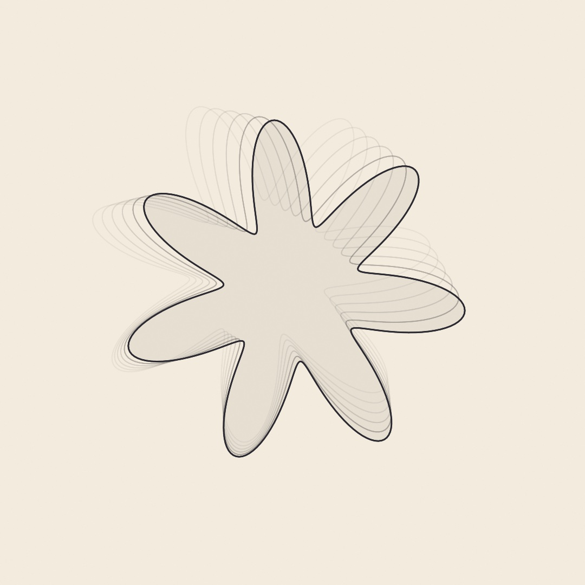

This chapter connects a sketch to controls and signals outside the inspector. They include MIDI knobs, a phone fader, a shared beat, a game controller, the weather, and a knock from the trackpad. Knobs and faders bind straight to your `@Param` values, and everything else reads in `draw()` as a level or a moment. The steps build the weather rose above, a rose that all of these move at once. After it come more hands (a table, sensors on a wire or over Bluetooth), published and smoothed parameters, and data from the web.

## Parameters from anywhere: MIDI and OSC

Since [Chapter 1](01-HelloOllin.md) you've tuned sketches with `@Param` parameters in the inspector. The inspector is one of several hands that can hold those parameters, and the first two outside it are MIDI and OSC.

**MIDI** is the protocol, the agreed format for messages, that music hardware has spoken since 1983. Knob boxes, fader banks, pad grids, and keyboards all speak it. A controller sends small messages, and `OllinMIDI` reads them. A knob sends a *control change*, a number from 0 to 127 under the knob's own number. A pad or a key sends a *note*, with a *velocity* that says how hard it was struck. In this fragment, `flash()` and `spawn(_:)` stand for functions of your own:

```swift
import OllinMIDI

let midi = MIDIInput()
override func setup() { try? midi.start() }
override func draw() {
    let level = midi.controlValue(7, default: 0)          // a knob, 0...127
    if midi.isNoteOn(60) { flash() }                      // a held pad
    for message in midi.messages() where message.isNoteOn {
        spawn(message.note ?? 0)                           // each strike, once
    }
}
```

`start()` connects to every device on the system, including ones plugged in later. Which control sends which number is up to the controller. So with new hardware, first run the `Integration/MIDIMonitor` example and touch every knob and pad. It draws each message as it arrives, so you can see which number each control sends.

The reads split two ways, and the same split comes back with every hand in this chapter. `controlValue` is a **level**, the knob's latest position, read fresh every frame. `messages()` hands you each **moment** once: every message since the last frame, oldest first. It drains the list as it reads, so a strike is never handled twice.

### Over the network: OSC

**OSC**, Open Sound Control, carries the same kind of message over the network, so the fader can be a phone on the same Wi-Fi. TouchOSC, Max, and TouchDesigner all speak it. A message is named by a path of words between slashes, such as `/fader1`, instead of a number:

```swift
import OllinOSC

let osc = OSCReceiver(port: 8000)
override func setup() { try? osc.start() }
override func draw() {
    let level = osc.number("/fader1", default: 0)          // usually 0...1
}
```

A **port** is a numbered door on your Mac that a program listens at, so 8000 tells the phone which program to reach. Point TouchOSC, or any app that speaks OSC, at your Mac's network address and port 8000, and its controls land in the sketch. The network address, or IP address, is shown in the Wi-Fi settings under Details. An `OSCSender` goes the other way, so a sketch can drive a mixer or a lighting desk too. You can try all of it with no hardware. The `Integration/MIDILoopback` and `Integration/OSCLoopback` examples send to themselves, so you see the round trip on a Mac with nothing plugged in.

## Musical time: MIDI clock and Link

A knob sets a value. Music also has a beat, and a sketch that moves with the music needs to know where that beat is. [Chapter 34](34-Listening.md#hearing-the-beat-onsets) heard beats in the sound itself. Gear and music software can also send the beat directly, which is steadier than listening for it.

Gear with a play button broadcasts its beat as *MIDI clock*, down the same cable as its knobs. A drum machine, a DJ mixer, and a DAW all do it, and they count in **bars**, groups of beats, usually four. A DAW, a digital audio workstation, is the program a musician records and arranges in. The message is simple. A MIDI clock sends one tick, twenty-four times per beat, for as long as it plays. The tick carries no tempo, no bar count, and no position. Everything musical is worked out by counting the ticks, and a `TempoClock` does the counting. Beside the ticks, the device sends start, stop, and continue messages, and it can send a position to start from.

<picture>
  <source media="(prefers-color-scheme: dark)" srcset="Images/35-ControlsAndSignals/MusicalTime-dark.jpg">
  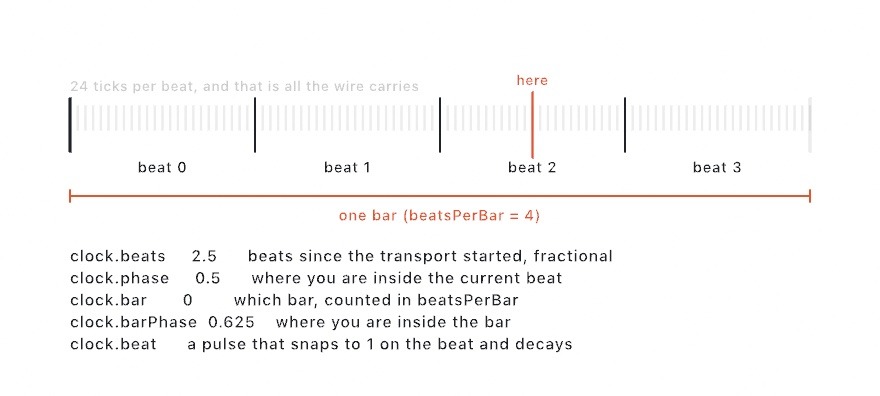
</picture>

```swift
lazy var clock = TempoClock(from: midi)
// in draw():
let throb = 1 + 0.3 * clock.beat     // snaps on each beat, eases off
let lap = clock.progress(over: 8)    // a 0...1 ramp every eight beats
```

`lazy var` lets the clock use `midi` from the same sketch, since a `lazy` property is made the first time it is read. The figure shows five reads at one moment. `beats` is the running count with a fraction, and `phase` is where you sit inside the current beat, as `0...1`. `bar` and `barPhase` are the same idea one level up, over however many beats you declare a bar to be with `beatsPerBar`. `beat` is a pulse that snaps to 1 on each beat and eases off. It is the same ready-made pulse the analyzer's `beat` gave you in Chapter 34. `progress(over:)`, the read the block uses for `lap`, gives a ramp that starts again every N beats. It is how you make a slow sweep that lands on the **downbeat**, the first beat of a bar.

Counting is why the grid can't drift. Each tick is one twenty-fourth of a beat by definition, so the position is arithmetic rather than an estimate. A sketch left running for an hour is still on the beat. The tempo is estimated, because nobody sends it. That estimate only smooths motion between ticks and never moves the grid itself.

MIDI devices add two details. Pressing play on the sending device arms the clock, and it starts on the next tick rather than at once. The MIDI convention works this way to keep the first beat exact. Some gear, DJ mixers especially, never sends a start message at all and runs its clock anyway. `TempoClock` then starts following from the first tick it hears. The `Integration/Tempo` example, in its MIDI mode, tries all of this with no hardware by sending clock to itself. [The MIDI reference](../Docs/Integration/MIDI.md#tempo-sync-tempoclock) has the full surface. A cable can also carry *where* a timeline is rather than how fast it goes. This is called timecode, and [Chapter 39](39-Performing.md#following-another-timeline-timecode) reads it to land a cue on the frame a video reaches.

### One beat for the whole room: Link

MIDI clock needs a cable, or at least a virtual one. Much music software shares its beat over the network instead, through a protocol called Link. Every app that joins the session agrees on one tempo and lands the same downbeat. That includes a DAW, a drum machine app on a phone, and another sketch on another Mac. There is nothing to set up beyond being on the same network.

```swift
import OllinLink

let link = LinkClock(tempo: 120)
override func setup() { link.start() }
override func draw() {
    let throb = 1 + 0.3 * link.beat      // the same pulse the MIDI clock gave you
    let lap = link.progress(over: 8)     // a 0...1 ramp every eight beats
}
```

`tempo: 120` is the tempo in beats per minute that the clock keeps until `start()` finds a session to follow. The reads are the ones `TempoClock` has: `tempo`, `beats`, `phase`, `beat`, `bar`, `barPhase`, and `progress(over:)`. So a sketch written against one clock moves to the other unchanged. Two things are new, and both come from how the session works.

First, every machine counts its own beats. Your `beats` might read 6.62 while the DAW's reads 1042.62. What the session shares is the place inside the bar:

<picture>
  <source media="(prefers-color-scheme: dark)" srcset="Images/35-ControlsAndSignals/SharedDownbeat-dark.jpg">
  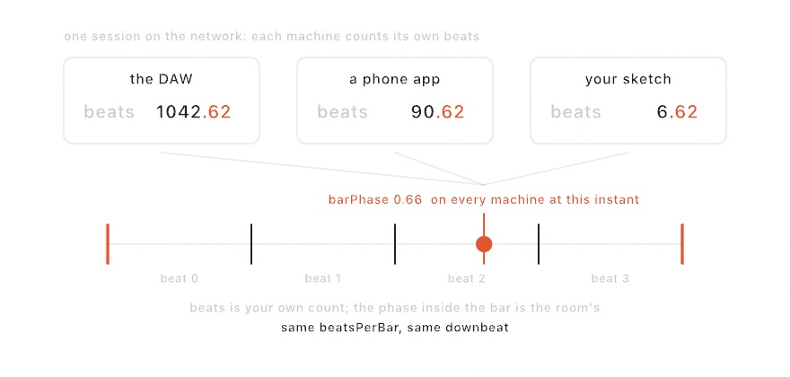
</picture>

`beatsPerBar` also sets the session's *quantum*, the length the machines line their phase up over. Set it to 4, and every other machine set to 4 lights its downbeat at the same instant as yours. So `barPhase` is the read to build on when the point is moving together.

Second, the beat never stops. A Link session has no pause: `beats` always advances. `isPlaying` is a shared flag that apps with a play button follow, and setting it starts or stops everyone who follows it. `tempo` can be set too. Setting it proposes a new tempo to everyone in the session, and the latest proposal wins, whoever makes it.

Alone, the clock runs at its own tempo, so the sketch behaves the same on a train as on stage. `peerCount` says how many others are in the session. The `Integration/Tempo` example, switched to its Link mode, puts all of this on screen, and two copies of it pulse together. [The Link reference](../Docs/Integration/Link.md) has the full surface, and how the session works underneath.

## One parameter, three hands: binding and smoothing

Reading `controlValue` every frame works, but a `@Param` already is a named value with a range and a control in the inspector. **Binding** wires an outside source straight onto it:

```swift
@Param(20...400) var radius = 120.0

override func setup() {
    try? midi.start(); try? osc.start()
    midi.bind(controlChange: 7, to: $radius)   // hardware knob, 0...127 → 20...400
    osc.bind("/radius", to: $radius)           // phone fader, 0...1 → 20...400
}
```

`$radius` with the dollar sign is the parameter itself rather than its value, the handle a binding holds on to.

<picture>
  <source media="(prefers-color-scheme: dark)" srcset="Images/35-ControlsAndSignals/BindingFlow-dark.jpg">
  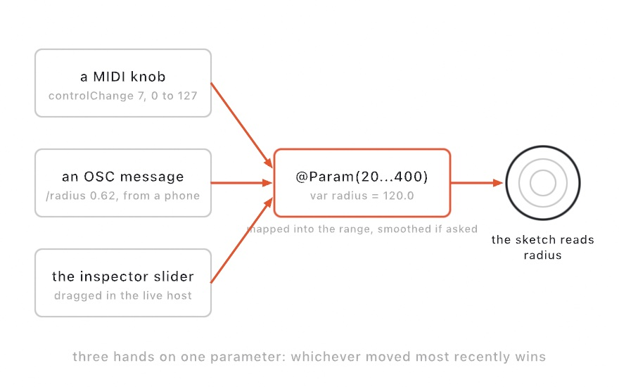
</picture>

Each incoming value is mapped into the parameter's own range and assigned. The sketch keeps reading plain `radius`, without knowing who moved it. The inspector slider, the knob, the phone, and plain assignment in code all stay live at once, and whichever moved most recently wins.

A knob sends whole steps, 128 of them, so a value that jumps from step to step can look jerky. Give the parameter a `smoothing:` and every source glides instead. `.eased(0.3)` is a fixed glide of 0.3 seconds. `.smoothed` is an adaptive filter that holds still at rest and follows quickly under a moving hand. The smoothing belongs to the parameter, so it applies to every hand at once.

A parameter can also hide its row in the inspector while another parameter gives it nothing to do, with a *show-rule*. The rose uses one: `$trailCount.show(when: $trails) { $0 }` shows the trail count only while trails are on. [Show-rules](../Docs/Helpers/Parameters.md#show-rules-parameters-that-come-and-go) in the reference has the rest, and the [`Examples/3D/Materials/Explorer`](../Examples/3D/Materials/Explorer/Sketch.swift) panel uses one on every finish that depends on another.

## Something to hold: game controllers

A game controller is a hand most people already own, and it needs no setup at all. In this fragment, `ship` is a `Vector2` property of your sketch, and `fire(from:)` is a function of your own:

```swift
import OllinController

override func draw() {
    background(.white)
    ship += controller.leftStick * 6
    if controller.wasPressed(.a) { fire(from: ship) }
    drawCircle(center: ship, radius: 30)
}
```

`controller` is player one, read fresh each frame the way you read `mouseX`. There is no setup call, no `start()`, and no permission.

<picture>
  <source media="(prefers-color-scheme: dark)" srcset="Images/35-ControlsAndSignals/ReadingAPad-dark.jpg">
  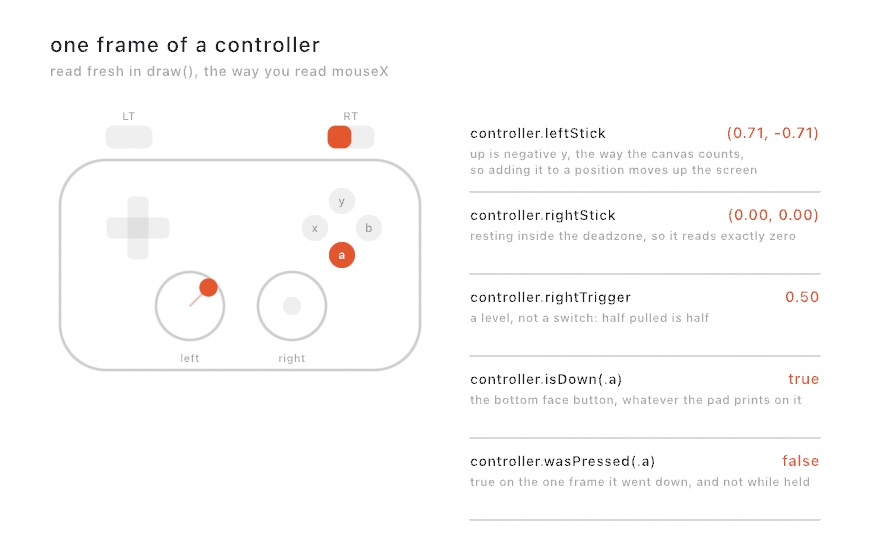
</picture>

The reads split the same way MIDI's do. A stick is a **level**, a number you read every frame like a fader. A button press is a **moment**. `wasPressed` is true on the one frame the button went down, and false while you keep holding it. So a sketch drops one thing per press without counting anything itself. A controller arriving or leaving is both, so `isConnected` is the state and `didConnect` is the moment.

A controller has no list to drain, unlike MIDI, because a hand can't press and release a button between two frames. A press lasts something like a tenth of a second, which is several frames. A drum machine can send faster than that, which is why MIDI has `messages()` and a controller doesn't.

With nothing plugged in, everything reads centered and nothing is pressed. The sketch still runs, so you can write it with no controller and try it later, and no call needs a check. Ask `isConnected` when you want to say "plug one in".

The figure shows two details. The sticks read in canvas terms, so pushing up gives a *negative* y value, and `ship += controller.leftStick * 6` moves up the screen. Buttons are named by where they sit rather than by what is printed on them. Button `.a` is the bottom face button, whether the pad in your hands calls it cross or A. So a sketch written on one controller works on another.

Some controllers can also sense motion. PlayStation and Switch controllers have motion sensors, and Xbox controllers have none. `gravity` says which way is down, so it reads the controller's tilt, and `rotationRate` reads how fast it turns. The sensors use battery, so they stay off until you ask:

```swift
override func setup() { controllersReportMotion(true) }
// in draw():
if controller.hasMotion { rotate(controller.gravity.x * 0.5) }
```

`hasMotion` is false both when the hardware has none and when nothing has asked for it, so check it before you read motion. A PlayStation pad also has a touchpad, under `touch` and `isTouching`.

Several people can play. `controller(2)` is player two, and a controller keeps its number while it stays connected. Unplugging player two doesn't turn player three into player two.

Because a controller is live input, an export reads it as centered and says so, the way Chapter 34's [listeners](34-Listening.md#words-and-what-that-noise-was-speech-and-sound-events) do. The `Integration/ControllerInput` example turns a pad into a drawing instrument. Its `map` parameter draws every stick, trigger, and button as it is read. It is a quick way to tell whether a controller is connected at all. The **deadzone** is the small area around a stick's center that reads as zero, 0.1 by default, and `controllerDeadzone(_:)` changes it. See [the controller reference](../Docs/Integration/Controller.md) for the rest, including running while another window is in front.

An iPhone can be held the same way. [Chapter 33](33-DepthAndThePhone.md#pointing-at-it-with-the-phone-the-wand) turns it into a wand you aim at a 3D sketch, with the screen as its button. [Its glass](33-DepthAndThePhone.md#playing-the-glass-touches) becomes a pad that reports every finger on it.

## The weather outside: Weather

Some signals come from no hand at all. The sky over a place changes on its own, and a sketch can read it the way it reads a slider. A `Weather` asks an online weather service about one place, again and again in the background, so the sketch draws what is true now:

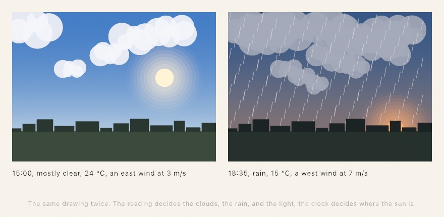

```swift
final class Sky: Sketch {
    private let sky = Weather(in: "Oaxaca")

    override func setup() {
        sky.start()
    }

    override func draw() {
        background(sky.isDay == true ? Color(hex: 0x9CC4E4) : Color(hex: 0x0A1230))
        let clouds = sky.cloudCover ?? 0
        fill(Color(white: 1, alpha: 0.8))
        drawCircle(center: center, radius: 60 + clouds * 200)
    }
}
```

Give it a place, as a latitude and longitude, or give it a name. A name is looked up once when the weather starts, and the reading then carries the place it turned out to be. The reads come in plain units: degrees, meters per second, millimeters in the last hour, and fractions of one for humidity and cloud cover. `condition` is the sky in a word (`.clear`, `.rain`, `.fog`, and so on), and `isDay` says whether the sun is up there.

Every read is `nil` until the first answer arrives, and it stays `nil` if the network is down from the start. So one fallback with `??` covers both. `sky.isDay == true` compares an optional with `true`, which is false while there is no answer yet. When something goes wrong, `problem` holds a sentence that says what, and the weather keeps any reading it already had. So keep drawing the last reading and put the notice over it. `updateCount` goes up by one for each new reading, so comparing it with a count you stored tells you when the sky changed.

An export reads the weather once and holds that answer for every frame. An export that fetched per frame would render something different each time you ran it.

The sun is the one thing a weather does not fetch. A `Place` made from a latitude and longitude works it out from the clock, with no network at all. `let place = Place(latitude: 17.06, longitude: -96.72)` is Oaxaca. `place.sun(at: Date())` gives the sun's `elevation` above the horizon and its `azimuth` around it, where `Date()` means now. So a weather made with `Weather(at: place)` can place its sun and color its sky before the first reading arrives. You can also build a `Weather.Reading` by hand and draw it with the same code, to try a rainy dusk on a sunny day.

The `Data/Outside` example is this section as a finished sketch. It draws the sky over Mexico City, with the clouds drifting on the wind and the rain leaning with it. The conditions come from Open-Meteo, an open service that needs no key, meaning no account to sign up for. Its limit is far above what a sketch asking every fifteen minutes needs. A sketch shown commercially, or a print that carries the numbers, should read the [reference page's note](../Docs/Helpers/Weather.md#source) on where the data comes from.

## Touch as an output: haptics

A sketch leaves the Mac as pixels, and in the next chapter as sound. The trackpad under your hand is another way out, because it can knock. In this fragment, `ball` is an object of your own that knows when it has just landed:

```swift
import OllinHaptics

override func draw() {
    background(.white)
    if ball.justLanded { playHaptic(.tap(intensity: 0.9, sharpness: 0.8)) }
    drawCircle(center: ball.position, radius: 24)
}
```

A `HapticPattern` is a value, like a color. It holds taps and hums on a short timeline of its own. Two numbers describe each one, both running 0 to 1. `intensity` is how strong it feels, and `sharpness` runs from a dull thud to a tight click. A hum also takes a length, and a `fadeIn` and `fadeOut` in seconds.

Patterns join into longer ones:

```swift
let heartbeat = HapticPattern.tap(intensity: 1, sharpness: 0.7)
    .then(.silence(0.12))
    .then(.tap(intensity: 0.55, sharpness: 0.5))

playHaptic(heartbeat.repeated(4, every: 0.85))
```

`then` puts one pattern after another, and `over` starts two together. `delayed(by:)`, `repeated(_:every:)`, `scaled(intensity:)`, `scaled(speed:)`, and `reversed()` do what their names say.

A Mac's trackpad has three fixed feelings and one strength, and it plays them one at a time. It also knocks only while its button is held down, so a knock asked for during a plain pointer move is not felt. Ask for touch during a drag, or while the player presses and holds. A pattern is translated before it is played:

<picture>
  <source media="(prefers-color-scheme: dark)" srcset="Images/35-ControlsAndSignals/FeltPattern-dark.jpg">
  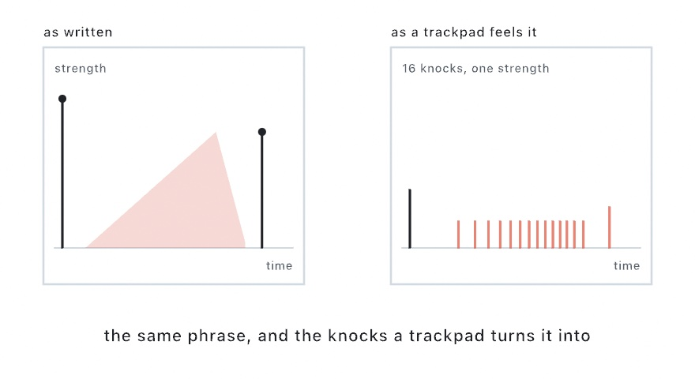
</picture>

Sharpness picks which of the three feelings each event asks for. Strength turns into *density*. A strong hum arrives as a fast run of knocks and a weak one as a slow run. A fade thins the run instead of lowering it. The hand reads a faster run as a stronger buzz. Anything under a floor is dropped, so a pattern that fades away ends in silence rather than one last stray knock.

Two habits follow. Play a pattern at the moment something happens, not every frame. And a pattern that leans on strength alone feels flat on a trackpad. Ask `hapticHardware` which kind of hardware you have, and give the trackpad fewer, crisper marks.

The `Integration/HapticRidges` example is three strips of ridges you drag across. It draws the plan along its bottom edge, so you can see what your pattern asked the hardware for. On a Mac with nothing to feel, and in every export, all of this does nothing and the sketch runs on. [The haptics reference](../Docs/Integration/Haptics.md#how-a-pattern-reaches-a-trackpad) shows how a pattern becomes knocks.

## Putting it together: the weather rose

The weather rose is an instrument with several hands on it. A rose of petals throbs on the shared beat and turns slowly with it. Two knobs and two faders set its size and how far it opens, the left stick moves it, and the wind pushes its trails. On every downbeat the trackpad knocks, which you feel while you hold its button down. Make `MySketches/WeatherRose.swift`:

```swift
import Ollin
import OllinController
import OllinHaptics
import OllinLink
import OllinMIDI
import OllinOSC

final class WeatherRose: Sketch {
    @Param(120...460, smoothing: .smoothed) var radius = 320.0
    @Param(0...1, smoothing: .eased(0.3)) var bloom = 0.6
    @Param(3...16) var petals = 7
    @Param var trails = true
    @Param(1...8) var trailCount = 5

    let midi = MIDIInput()
    let osc = OSCReceiver(port: 8000)
    let link = LinkClock(tempo: 96)
    let sky = Weather(in: "Oaxaca")
    var lastBar = -1

    override func setup() {
        try? midi.start()
        try? osc.start()
        link.start()
        sky.start()
        lastBar = link.bar                  // the first knock waits for the next bar

        // Three hands on each of the two parameters that matter most: the
        // inspector, a knob, and a fader.
        midi.bind(controlChange: 7, to: $radius)
        midi.bind(controlChange: 8, to: $bloom)
        osc.bind("/radius", to: $radius)
        osc.bind("/bloom", to: $bloom)
        $trailCount.show(when: $trails) { $0 }
    }

    override func draw() {
        // The sky: day or night, and the wind. Until the first reading
        // arrives, a calm afternoon with a light west wind.
        let isDay = sky.isDay ?? true
        let wind = sky.windSpeed ?? 2
        let bearing = (sky.windDirection ?? 270) * .pi / 180
        let downwind = Vector2(-sin(bearing), cos(bearing))
        let ink = isDay ? Color(hex: 0x2B2A33) : Color(hex: 0xF1E6CF)
        background(isDay ? Color(hex: 0xF3EBDD) : Color(hex: 0x10172B))

        // The beat: a throb on every beat, a slow turn every four bars, and a
        // knock under your hand on each downbeat.
        let throb = 1 + 0.1 * link.beat
        let turn = link.progress(over: 16) * .tau / Double(petals)
        if link.bar != lastBar {
            lastBar = link.bar
            playHaptic(.tap(intensity: 0.8, sharpness: 0.6))
        }

        // The left stick moves the rose, and the wind blows its trails.
        let middle = center + controller.leftStick * 180
        if trails {
            noFill()
            strokeWeight(2)
            for k in stride(from: trailCount, through: 1, by: -1) {
                let drift = downwind * (Double(k) * (12 + wind * 6))
                stroke(ink.withAlpha(0.5 / Double(k)))
                drawPolygon(rose(at: middle + drift, radius: radius * throb,
                                 turn: turn - Double(k) * 0.05))
            }
        }
        fill(ink.withAlpha(0.12))
        stroke(ink)
        strokeWeight(3)
        drawShape(Shape(rose(at: middle, radius: radius * throb, turn: turn)))

        // A feed that cannot reach its server says so, and keeps its last reading.
        if let problem = sky.problem {
            noStroke()
            fill(ink)
            textSize(22)
            drawText(problem, 40, height - 40)
        }
    }

    /// A rose with `petals` lobes. `bloom` sets how deep the gaps between them cut.
    func rose(at middle: Vector2, radius: Double, turn: Double) -> [Vector2] {
        (0..<360).map { i in
            let angle = Double(i) / 360 * .tau
            let reach = 1 - bloom * 0.5 * (1 - cos(Double(petals) * (angle - turn)))
            return middle + Vector2(cos(angle), sin(angle)) * (radius * reach)
        }
    }
}
```

It composes the steps in this order:

- **The parameters** come from [One parameter, three hands](#one-parameter-three-hands-binding-and-smoothing). Two of them matter most while you play, so `setup()` binds each one twice. The size goes to knob 7 and to the address `/radius`, and how far the petals open goes to knob 8 and to `/bloom`. With the inspector, that makes three hands on each. The drawing code reads plain `radius` and `bloom` and never knows which hand moved them. The size has `.smoothed` on it, and the bloom has a fixed glide of 0.3 seconds. The show-rule hides `trailCount` while `trails` is off, since then it has nothing to count.
- **The beat** comes from [One beat for the whole room](#one-beat-for-the-whole-room-link). The rose throbs on `link.beat` and turns with `link.progress(over: 16)`, which ramps once every four bars. Dividing that turn by the petal count moves the rose by one petal's width. So when the ramp starts again, the rose is back in the same pose, and the turn never jumps. The bar count changes once a bar, and that change is when the knock from [Touch as an output](#touch-as-an-output-haptics) plays. Comparing it with `lastBar` plays the knock at the moment the bar turns, rather than on every frame. `setup()` stores the bar the clock starts in, so the first knock waits for the next bar.
- **The stick** comes from [Something to hold](#something-to-hold-game-controllers). With no controller connected, `controller.leftStick` reads centered, so the rose sits in the middle of the canvas.
- **The wind** comes from [The weather outside](#the-weather-outside-weather). Every read is `nil` until the first answer arrives, so each one has a fallback. Together the fallbacks are a calm afternoon with a light west wind. The weather gives `windDirection` as the compass bearing the wind blows from, in degrees clockwise from north. So `downwind` points the other way, in canvas terms, with y growing down the page. Each trail is drawn one step further downwind than the last, and a stronger wind makes the steps longer. When the feed cannot reach its server, the sketch writes `problem` along the bottom and keeps drawing the last reading.
- **Day and night.** `isDay` picks dark ink on cream paper by day, and pale ink on night blue after dark. Day is the fallback.
- **The trails.** `stride(from: trailCount, through: 1, by: -1)` counts down, so the farthest trail is drawn first and the nearer ones land on top. Each is fainter by `0.5 / Double(k)` and turned a little behind the rose by `turn - Double(k) * 0.05`, so the trails lag as it turns.
- **The rose** itself is `rose(at:radius:turn:)`. It walks 360 points around a circle and pulls each one in by how far it sits from a petal's tip. `cos(Double(petals) * (angle - turn))` is 1 at a tip and -1 between two tips, so `bloom` sets how deep the gaps cut. The rose is filled with `drawShape(Shape(...))`, a [`Shape`](06-GridsAndRepetition.md#drawing-inside-a-shape-withclip) drawn the way [Chapter 7](07-Tiles.md#pieces-that-have-to-fit-polyominoes) draws one. `drawPolygon` fills only an outline with no dents, and a rose has a dent between every two petals. The trails have no fill, so `drawPolygon` draws their outlines.

Alone at a desk, with nothing plugged in and no network, it is a rose turning on its own beat on a calm afternoon. A line along the bottom says the weather can't be reached. Each hand you add joins without a change to the code. That goes for a knob box, a phone on the same Wi-Fi, a controller, and another app in the same Link session.

Then make it yours:

- Follow a cable instead of the network. Change the clock's line to `lazy var link = TempoClock(from: midi)` and drop `link.start()`. The reads the sketch uses are the same, so the rose now throbs to whatever sends MIDI clock.
- Publish the parameters. Add `extend(OSCQueryServer())` at the end of `setup()`, and an app that browses for OSCQuery builds a control for every parameter. It listens on its own port, 9000, so the phone fader bound on port 8000 keeps working. [The sketch that says what it takes](#the-sketch-that-says-what-it-takes-oscquery) explains it.
- Add a hand you build yourself. Open a `SerialPort` the way [A wire to the physical world](#a-wire-to-the-physical-world-serial) does. Then `serial.bind(to: $bloom)` puts a potentiometer on the same parameter as the knob and the fader.

This one is played rather than rendered, so keep it as a take. Press ⌘⇧R in the live host to start recording the window while you play, and press it again to finish the file. An export renders the sketch again on a fixed clock, and nothing you do while it renders reaches it. Chapter 39's [Keeping the take](39-Performing.md#keeping-the-take) has the rest.

## More hands: a table, a wire, and a radio

The rose takes its hands from things you can buy ready-made: a knob box, a phone, a game controller. Other hands you build or set up yourself. A table can see the objects set on it, and a sensor you wired can report on a cable or over Bluetooth. Each one reads with the same split into levels and moments, and most of them can bind to a parameter the way the knob does.

### A table you put things on: TUIO

A knob and a fader are one hand each. A table surface can follow several hands at once, and objects you slide, turn, and take away. A camera under the glass or a touch sensor tracks them. The tracker reports what it sees in TUIO, a protocol that rides on OSC. Use it for a sketch that people play together around a table, or one steered by printed tokens. Martin Kaltenbrunner, Till Bovermann, Ross Bencina, and Enrico Costanza set TUIO out for table interfaces in 2005. Ollin reads its 1.1 specification.

A tracker reports three kinds of thing, and each gets its own list. `cursors` are touches: a fingertip, a contact, a pointer from a phone app. `objects` are tagged pieces, printed markers the tracker can name and measure. Each one carries the `symbol` printed on it and the `angle` it is turned to. `blobs` are shapes it found but cannot name, such as a hand or a cup, each with a size and an area. The lists hold what is on the surface right now, with no history, because of how the protocol reports a touch ending:

<picture>
  <source media="(prefers-color-scheme: dark)" srcset="Images/35-ControlsAndSignals/SurfaceFrame-dark.jpg">
  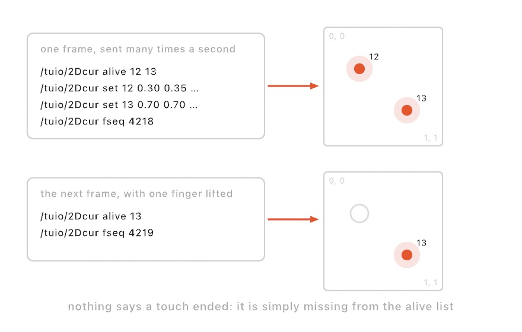
</picture>

A tracker sends everything on the surface many times a second. Each frame is the alive list of what is on the surface, then a `set` for every thing that moved, then the frame number. No message says that a touch ended. The touch stops appearing in the alive list, and Ollin drops it for you. Reading the touches needs no new import, since TUIO rides on OSC:

```swift
let surface = TUIOReceiver()          // port 3333, what trackers use by default

override func setup() { try? surface.start() }

override func draw() {
    background(.white)
    for touch in surface.cursors {
        drawCircle(center: touch.position(in: bounds), radius: 40)
    }
}
```

Positions come in measured from 0 to 1 across the surface, from the top left, which is the direction the canvas already counts in. `position(in: bounds)` lands a report on the canvas. Any other rectangle works too, so a table can drive one panel of the canvas.

The `id` on each report is what a sketch holds on to. It stays with one finger from the moment it lands until it lifts, so a stroke, a color, or a note can belong to it. Here `strokes` keeps one line of points for each finger:

```swift
var strokes: [Int: [Vector2]] = [:]

override func draw() {
    for touch in surface.cursors {
        strokes[touch.id, default: []].append(touch.position(in: bounds))
    }
    let here = Set(surface.cursors.map(\.id))
    strokes = strokes.filter { here.contains($0.key) }   // what is missing has lifted
}
```

`strokes[touch.id, default: []]` reads a finger's line, or an empty one the first time that finger appears. A `Set` is a collection with no order and no repeats, which makes asking whether it contains an id quick.

You do not need a table to try this. The [`TUIOSurface`](../Examples/Integration/TUIOSurface/Sketch.swift) example runs both ends. A stand-in tracker sends frames to `127.0.0.1`, the address that means this Mac, and what you see is drawn from what came back. Turn its `simulate` parameter off and point a table, a wall, or a phone app at this Mac instead.

### A wire to the physical world: serial

A light sensor, a bend sensor, or a homemade button doesn't arrive as a finished controller. It arrives as a bare part wired to a small computer board, a microcontroller such as an Arduino. The board reads the sensor and prints numbers. The sketch reads the numbers over a USB cable, which the Mac sees as a *serial port*. Use it when you want to build the controller yourself. This loop is the center of physical computing, the practice Tom Igoe and Dan O'Sullivan taught in their book *Physical Computing*. Wiring and then Arduino made such boards cheap and easy for artists to use.

<picture>
  <source media="(prefers-color-scheme: dark)" srcset="Images/35-ControlsAndSignals/SerialLoop-dark.jpg">
  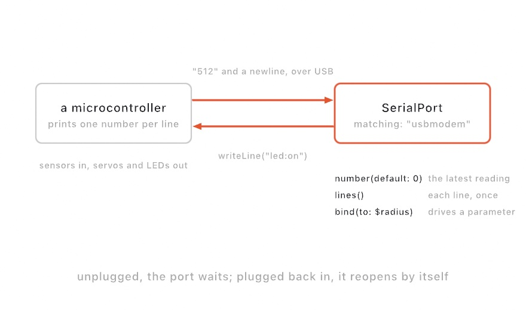
</picture>

The program on the board, its *firmware*, stays as simple as it can be. It reads the sensor and prints the number, one number per line, about thirty times a second. The sketch side is `OllinSerial`. In this fragment, `flash()` is a function of your own:

```swift
import OllinSerial

let serial = SerialPort(matching: "usbmodem", baudRate: 9600)

override func setup() { serial.open() }
override func draw() {
    let level = serial.number(default: 0) / 1023      // the latest reading
    for line in serial.lines() where line == "pressed" {     // each event, once
        flash()
    }
}
```

The *baud rate* is the speed of the wire in bits per second, and both ends must use the same one. The reads split into levels and moments again. `number(default:)` is the latest value, read fresh each frame, for a sensor that changes smoothly. `lines()` hands you every line since the last frame, once each, for events. `serial.bind(to: $radius)` wires the stream onto a `@Param`, mapped in from `0...1023`. It is the range a board's analog pin, a pin that measures a voltage, usually reads. So a potentiometer, a knob that sets a voltage, drives the same parameter the inspector slider does.

`matching:` finds the board by part of its name. Serial devices live at paths like `/dev/cu.usbmodem101`, and the number changes between plugs. The match runs again on every attempt to connect, so the port finds the board wherever it lands. That works even when the board is plugged in after the sketch starts. `open()` doesn't fail. It waits, and `lastError` says what it is waiting for. Unplug the board mid-performance, and `isOpen` goes false while the port keeps trying. Plug it back in and the values resume, and a board you reprogram mid-session reconnects the same way.

The wire runs both ways. `serial.writeLine("led:on")` sends a line back, and firmware that reads lines can drive lights, servos, and motors from the sketch.

You can also skip writing firmware. The Arduino software ships a program called StandardFirmata, and a board running it lets the Mac ask for its pins directly. `FirmataBoard` speaks that protocol, Firmata, over the same port. Make one with `let board = FirmataBoard(matching: "usbmodem")` and call `board.open()` in `setup()`. `board.analog(0)` is pin A0 as a number from 0 to 1, or nil until the board first reports it. `board.digital(2, pullUp: true)` is a button wired to ground, which `pullUp:` makes read `true` when it is pressed, and `board.write(13, true)` lights the board's LED. Asking a pin turns it on, and a board that resets is told everything again, so unplugging and plugging back in needs nothing from you.

With no board, the `Integration/SerialLoopback` example runs both ends of the wire. A stand-in device prints values into a `SerialPort`, and a click writes a line back that flips the wave. With a board, start with `Integration/SerialMonitor`, the way `MIDIMonitor` starts MIDI. It lists every device, opens the first USB one, and scrolls whatever the board prints. [The serial reference](../Docs/Integration/Serial.md) has the full surface.

### The same loop, without the wire: Bluetooth

A board can also report without a cable. So can a heart rate strap, a weather sensor, or a button on a keyring. Anything that speaks Bluetooth Low Energy, the short-range radio in phones and watches, keeps announcing itself to the Mac. `OllinBluetooth` reads it with the same kinds of read as the serial port, through Apple's CoreBluetooth. Use it for sensors a performer wears, or a board you want off the table. The standard values and their byte layouts come from the Bluetooth SIG's published specifications. A device offers its values as *characteristics*, named slots such as `.heartRateMeasurement`, grouped into *services* such as `.heartRate`. In this fragment, `mark(_:)` is a function of your own:

```swift
import OllinBluetooth

let strap = BluetoothDevice(service: .heartRate)

override func setup() { strap.connect() }
override func draw() {
    let beats = strap.number(.heartRateMeasurement, default: 60)   // the latest reading
    for reading in strap.readings() { mark(reading.time) }         // each arrival, once
}
```

Three things differ from the wire.

**A device is found, not plugged in.** `BluetoothDevice(matching: "strap")` takes part of the name a device advertises. `BluetoothDevice(service: .heartRate)` takes the first device that offers a kind of value, whatever it calls itself. `BluetoothDevice(id:)` takes one exact device. Prefer the service form for standard gear. Once a person has picked a device, prefer the identifier form, so your sketch does not connect to a neighbor's strap. To see what is around you, `BluetoothScan` lists the devices in range, strongest signal first, and the `Integration/BluetoothRoom` example draws them. That example needs no gear of your own, because a room is already full of phones, watches, and earphones announcing themselves.

**The system asks first.** macOS asks the person once, per app, before a program may use Bluetooth. Until that question is answered, the radio reports nothing at all, and it doesn't say it is off or refused. Under `swift run`, the question is asked for the terminal app you ran it from. So draw `strap.unavailableReason` somewhere, because it is a finished sentence naming what is wrong. A locked screen cannot show the question, so a sketch started on a locked Mac waits until someone unlocks it and answers.

**Bytes mean nothing until a format says so.** Serial hands you a line of text, and the number is right there. Bluetooth hands you bytes, and how to read them is part of the characteristic:

<picture>
  <source media="(prefers-color-scheme: dark)" srcset="Images/35-ControlsAndSignals/BytesIntoValues-dark.jpg">
  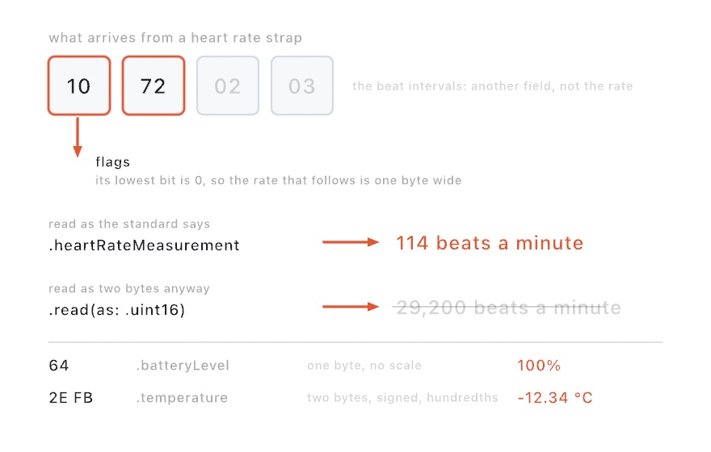
</picture>

Ollin already knows the formats of the standard values, so `.heartRateMeasurement`, `.batteryLevel`, `.temperature`, and the rest are read correctly with no extra work. For a board of your own, you say it once, `BluetoothCharacteristic(myUUID, as: .float32)`, where `myUUID` is the identifier your board gives its value. Everything after reads it that way. `BluetoothDevice(service: .uart)` connects to the serial line over Bluetooth that most maker boards speak, so a wireless board looks almost the same as the wired one.

The rest matches the wire. `strap.bind(.heartRateMeasurement, to: $radius, from: 50...180)` puts a pulse on a parameter. `strap.write("led on\n", to: .uartOut)` sends something back. `connect()` waits rather than failing, so a strap carried out of the room and back is picked up again by itself. `Integration/BluetoothSensor` is the place to start with a device you own: type part of its name into a parameter and watch everything it offers arrive. [The Bluetooth reference](../Docs/Integration/Bluetooth.md) has the full surface.

## More around the parameters: publishing them, and smoothing the rest

The rose binds its parameters by address, `/radius` and `/bloom`, and the phone has to be told those addresses by hand. It also smooths only its parameters. A sketch can publish its parameters so an app builds the controls itself. It can also smooth a value that is not a parameter at all.

### The sketch that says what it takes: OSCQuery

Typing addresses into a phone means keeping them in step with the sketch. Rename a parameter, and the fader that moved it points at nothing, with no error to tell you. **OSCQuery** removes the typing. The sketch publishes its parameters as a tree an app can browse, and the app builds its own controls from what it reads. Use it for a sketch other people will control, or one with more parameters than you want to type. Ollin follows the OSCQuery proposal that Vidvox published.

<picture>
  <source media="(prefers-color-scheme: dark)" srcset="Images/35-ControlsAndSignals/PublishedParameters-dark.jpg">
  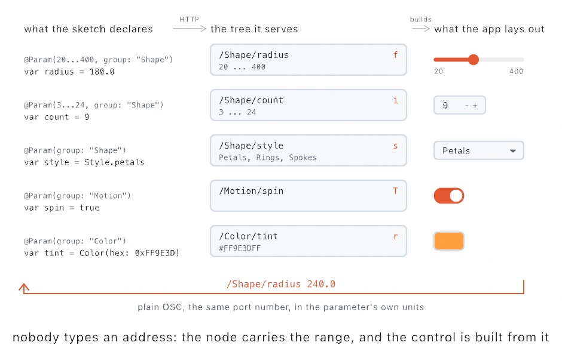
</picture>

Here is the sketch in the figure. The `extend` line is the only setup:

```swift
import OllinOSC

final class Wall: Sketch {
    enum Style: String, CaseIterable, ParamOption { case petals, rings, spokes }

    @Param(20...400, group: "Shape") var radius = 180.0
    @Param(3...24, group: "Shape") var count = 9
    @Param(group: "Shape") var style = Style.petals
    @Param(group: "Motion") var spin = true
    @Param(group: "Color") var tint = Color(hex: 0xFF9E3D)

    override func setup() { extend(OSCQueryServer()) }
}
```

> **Swift note.** `enum Style` declares a type of your own with a fixed set of cases, here three. `String` gives each case a name as text, and `CaseIterable` lets code list the cases. `ParamOption` lets the inspector and OSCQuery offer them as a menu. `group:` puts a parameter under a heading in the inspector.

Each parameter becomes a node at its own address. The group you declared becomes the folder in front of the name, which is why `radius` is published at `/Shape/radius`. The node carries what the parameter is (a number, a switch, a color) and what it accepts, such as `20...400`. So the app reads a range and lays out a fader that ends where your parameter ends.

The control follows the kind, the same way the inspector's does. A `Double` becomes a fader over its range, an `Int` a stepper, and an enum a menu of its cases, with their names capitalized. A `Bool` becomes a toggle, a `Color` a color well, and a `Palette` a well per stop. Anything you have already given the inspector is published with no more code.

Values come back as plain OSC. The app sends `/Shape/radius 240.0` to the address the tree named. It sends 240 rather than a fraction, because the tree told it the units. The value lands through the same path an inspector drag uses, so smoothing and clamping apply as they do there. One port number serves both halves: the tree over HTTP, the web's protocol, and the values as OSC. So there is one number to tell anybody.

You don't need the app to look. Open `http://your-mac.local:9000/` in a browser, with your Mac's own name in place of `your-mac`, and the tree is there as JSON. On the Mac itself, `localhost` is the same address, and `curl 'http://localhost:9000/Shape/radius?VALUE'` in Terminal fetches one node's value. So you can see what a sketch publishes without running a control surface at all.

Anyone on the network who has the address can move your parameters while the server is up. Use it in a studio or on a stage, and don't leave it open on a café's Wi-Fi. Set `advertises = false` before the server starts to keep the sketch off the list apps browse, and `stop()` closes both ports.

The `Integration/OSCQuery` example publishes a ring of marks and draws its own tree down the left. You see the picture and the listing side by side.

### A value that is not a parameter: `@Smoothed`

`@Smoothed` is `smoothing:` for a value that is not a parameter. Some values arrive from outside, continuously, and shake, with no parameter to hold them. `@Smoothed` calms such a value as it comes. A jittery mouse is one such value, and so are a tracker from [Chapter 32](32-Seeing.md#trackers-attach-then-read) and a phone aimed as a wand from [Chapter 33](33-DepthAndThePhone.md#pointing-at-it-with-the-phone-the-wand). It uses the same adaptive filter as `.smoothed`, the 1€ filter that Géry Casiez, Nicolas Roussel, and Daniel Vogel published in 2012. It holds steady while the signal moves slowly and follows quickly when it moves fast, which a plain average can't do.

<picture>
  <source media="(prefers-color-scheme: dark)" srcset="Images/35-ControlsAndSignals/SmoothedSignal-dark.jpg">
  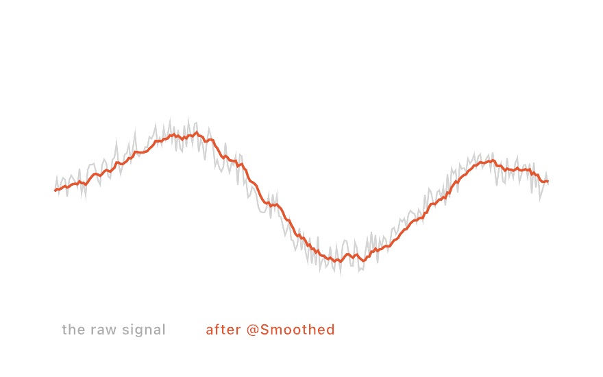
</picture>

Mark the property `@Smoothed`, feed it the raw value each frame, and read the calm one back:

```swift
@Smoothed var x = 0.0
// each frame: feed the raw value in, read the calm one back
x = mouseX
```

The [Animation](../Docs/Helpers/Animation.md#smoothed) page has the filter's settings.

## Data that arrives on its own: DataFeed and PushFeed

The rose reads the weather, a feed that already knows where to ask and what comes back. A sketch can read any address on the web the same way. It can ask again and again, or it can hold a connection open and let the other end send.

### Numbers that keep arriving: DataFeed

Reading once is right for a file, and wrong for a number that changes while your sketch runs. A `DataFeed` reads one web address over and over, in the background, so the sketch draws what is true now. A `Weather` is a `DataFeed` that knows its address. Use one for any number a server publishes: the tide, the river level, the earthquakes of the last hour.

<picture>
  <source media="(prefers-color-scheme: dark)" srcset="Images/35-ControlsAndSignals/NumbersThatKeepArriving-dark.jpg">
  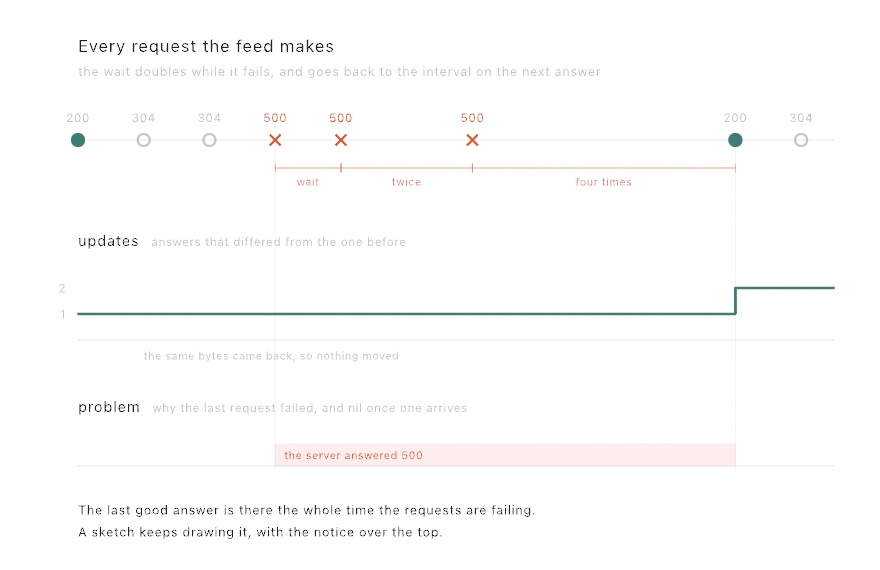
</picture>

The numbers along the top are the status codes a web server answers with. 200 carries an answer, 304 means nothing changed, and 500 is a server error. `updateCount` steps up only when the answer differs from the one before, and `problem` covers the stretch that failed.

```swift
final class Tide: Sketch {
    private let tide = DataFeed("https://example.org/tide.json", every: 600)

    override func setup() {
        tide.start()
    }

    override func draw() {
        background(.white)
        let level = tide.json["height"].number ?? 0
        drawCircle(center: center, radius: 40 + level * 20)
    }
}
```

`every:` is in seconds. What comes back is the same `JSON` and `Table` that [Chapter 9](09-Pictures.md#numbers-you-didnt-type-csv-and-json) read out of files. So the drawing code doesn't change when the numbers start arriving from the world instead of the disk. Before the first answer arrives, `json` reads as null, JSON's word for no value, and `table` and `text` are `nil`. They read the same if the network is down from the start. When something goes wrong, `problem` says what, and the feed keeps any answer it already had, the way the weather does.

`updateCount` counts only the answers that differ from the one before. So a poll that brought back the same bytes doesn't move it. This fragment keeps the last count it saw, and the time the answer changed, to start a fade from:

```swift
var seen = 0                    // properties of your sketch
var arrivedAt = 0.0

// in draw():
if tide.updateCount != seen {
    seen = tide.updateCount
    arrivedAt = time            // start a fade from this moment
}
```

Ask a server every ten minutes and most answers are ones you already have, so only a change should start a fade. The feed also treats the server politely. The next request waits for the last one to finish. An unchanged answer is asked for conditionally, so the server can reply with a short header and no body. A run of failures waits longer before each retry instead of asking a server that is already down. A sketch left on a wall for three weeks asks thousands of times, so the manners add up.

### Messages that arrive on their own: PushFeed

A `PushFeed` holds one connection open, and each message arrives the moment the other end sends it. Use it for sources that tell rather than wait to be asked, such as an encyclopedia's edits or a game's moves. A `DataFeed` asking those on a schedule either asks too often or hears too late. The address decides how the connection is made. `ws://` and `wss://` open a *web socket*, a connection both ends can send on. Anything else is read as a stream of *server-sent events*, the plain-web way a server pushes, which the WHATWG's HTML standard describes.

<picture>
  <source media="(prefers-color-scheme: dark)" srcset="Images/35-ControlsAndSignals/MessagesThatPushThemselves-dark.jpg">
  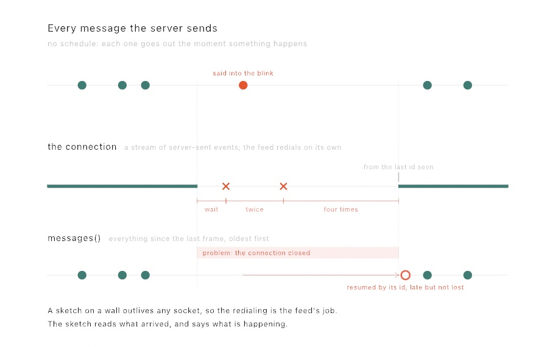
</picture>

You write the same code for either kind:

```swift
final class Edits: Sketch {
    private let edits = PushFeed("https://stream.wikimedia.org/v2/stream/recentchange")
    private var titles: [String] = []

    override func setup() {
        edits.start()
    }

    override func draw() {
        background(.black)
        for message in edits.messages() {
            titles.append(message.json["title"].text ?? "")
        }
        titles = Array(titles.suffix(24))          // the newest two dozen
        fill(.white)
        for (i, title) in titles.enumerated() {
            drawText(title, 40, 60 + Double(i) * 40)
        }
    }
}
```

The read to notice is `messages()`. On a busy stream, dozens of messages land between two frames, and the `json` and `text` reads show only the last of them. `messages()` hands over every message since the last frame, oldest first, so nothing slips between two frames. `updateCount` counts every message here, since each one was sent because there was something new to say.

The feed also stays connected by itself, as the figure shows. A dropped connection redials on its own, waiting a little longer after each failure. A stream of server-sent events that labels its messages with ids is resumed from the last one seen. So a message sent while the connection was down arrives late instead of being lost. On a web socket, the `greeting:` you give the feed is sent at every open, not once. That keeps a service that wants a subscribe message subscribed across every redial. Your sketch reads `isConnected` and `problem` to say what is happening, and keeps drawing everything that already arrived.

In an export, the feed waits for one message while `start()` runs, then holds it for every frame, the way the polled feed reads once. The `Data/Edits` example is this entry as a finished sketch. The encyclopedia's edits fall as rain, each drop sized by the bytes somebody just added or took away.

## Where this comes from

MIDI was created in 1983 by Dave Smith and Ikutaro Kakehashi, so that instruments from rival makers could talk to each other. It still does four decades later. Open Sound Control came from Matt Wright and Adrian Freed at CNMAT, Berkeley (1997), for the networked, higher-resolution setups that came after MIDI. The shared network beat is Ableton Link (2016), now spoken by most music apps. Ollin speaks its session protocol through an independent implementation, written from published protocol documentation. The weather comes from Open-Meteo, the open service of Patrick Zippenfenig and contributors. The entries after the rose name their own sources. Full credits are in the project's [attribution notes](../ATTRIBUTION.md).

## Go deeper

- [Parameters](../Docs/Helpers/Parameters.md): the typed `@Param` family, smoothing, show-rules, and the binding surface.
- [`@Smoothed`](../Docs/Helpers/Animation.md#smoothed): the filter's tuning parameters, the raw value and the jump, and `OneEuroFilter` for a value that is not a property.
- [MIDI](../Docs/Integration/MIDI.md): messages, the three reads, binding, and sending MIDI out.
- [OSC](../Docs/Integration/OSC.md): addresses and arguments, bundles, binding, and testing with a phone.
- [OSCQuery](../Docs/Integration/OSCQuery.md): the parameters published as a tree, what each kind becomes, and what a client sends back.
- [Link](../Docs/Integration/Link.md): the network tempo session in full, tempo and transport, the quantum, and what discovery and clock sync do underneath.
- [TUIO](../Docs/Integration/TUIO.md): touches, tagged pieces, and shapes from a tangible surface, the frame that commits them, and sharing one port with your own OSC.
- [Game controllers](../Docs/Integration/Controller.md): the sticks, triggers and buttons, the deadzone, motion and the touchpad, several controllers at once, and what an export reads.
- [Serial](../Docs/Integration/Serial.md): finding a board, the three reads, writing lines back, and staying connected through unplugs, and `FirmataBoard`, a board running StandardFirmata driven pin by pin with no firmware of your own.
- [Bluetooth](../Docs/Integration/Bluetooth.md): the room in range, the three ways to name a device, the formats that turn bytes into values, and the permission the first run has to get past.
- [Live data](../Docs/Helpers/LiveData.md): every parameter on `DataFeed`, what decides how the bytes are read, the conditional request and the backoff, and the entitlement a sandboxed app needs.
- [Weather](../Docs/Helpers/Weather.md): every read on `Weather` with its unit, the whole `Reading` and how to build one by hand, the condition words and their codes, `Place.sun(at:)`, and where the data comes from.
- [Haptics](../Docs/Integration/Haptics.md): writing and composing a pattern, the two kinds of hardware, and the four rules that turn a pattern into knocks.
- [Recording](../Docs/Output/Recording.md): keeping a take of a sketch while you play it, with its sound, from a key, a call, or the host's ⌘⇧R.
- Worked examples: the MIDI, OSC, serial, and controller examples in [`Examples/Integration/`](../Examples/Integration/), [`Examples/Data/Quakes`](../Examples/Data/Quakes/Sketch.swift) (a day of earthquakes, redrawn as the list changes), and [`Examples/Data/Outside`](../Examples/Data/Outside/Sketch.swift) (the sky over a city, drawn from a weather).
- Ahead of you: the Mac's own location, so a weather can follow the machine, and a paired Watch's heart rate are not in the framework yet. Each needs its own permission prompt, and a feed you point at an address needs none. When they land they join the signals in this chapter.

---

[Contents](README.md#contents) · Previous: [Chapter 34, Listening](34-Listening.md) · Next: [Chapter 36, Making sound](36-MakingSound.md)
