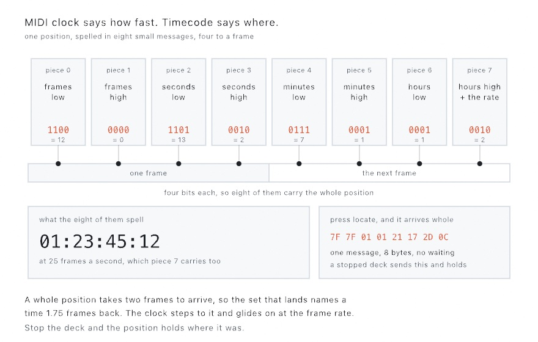

#### <sup>[Ollin](../README.md) → [Guide](README.md) → Chapter 35</sup>

---

# 35. Controls and signals

<!-- Hook image: the finished sketch, an instrument bound to a controller, an OSC fader, and a data feed. Waiting on the finished sketch and its render. -->

A sketch you tune only from the inspector is a sketch you play alone at a desk. This chapter hands it to everything else that can steer it. MIDI knobs, a phone fader over OSC, a DAW's clock, and a beat shared across the room come first. Then come a table of tagged pieces, a game controller, and sensors on a wire or over Bluetooth. Data arrives on its own too, from the web and from the weather outside. Knobs and faders bind straight to your `@Param` values, and everything else reads in `draw()` as a level or a moment. The trackpad answers back with a knock.

## Parameters from anywhere

Since [Chapter 1](01-HelloOllin.md) you've tuned sketches with `@Param` parameters in the inspector. The news here is that the inspector is only one of the hands that can hold those parameters.

**MIDI** is the protocol music hardware has spoken since 1983. Knob boxes, fader banks, pad grids, and keyboards all speak it. A controller sends small messages, and `OllinMIDI` reads them. A knob is a *control change* carrying a number `0...127`, and a pad is a *note* with a velocity:

```swift
import OllinMIDI

let midi = MIDIInput()
override func setup() { try? midi.start() }
override func draw() {
    let level = midi.controlValue(7, default: 0)          // a knob, 0...127
    if midi.isNoteOn(60) { flash() }                      // a held pad
    for message in midi.messages() where message.isNoteOn {
        spawn(message.note ?? 0)                           // each strike, once
    }
}
```

`start()` connects to every device on the system, including ones plugged in later. Which control sends what is the controller's business. So with new hardware, first run the `Integration/MIDIMonitor` example and touch everything. It draws each message as it arrives, and your controller introduces itself.

Knobs aren't the only thing MIDI carries. Gear with a play button also broadcasts its beat as *MIDI clock*. A DAW, a drum machine, and a DJ mixer all do. A `TempoClock` reads that into musical time, so motion lands on the beat instead of near it.

The wire itself is almost comically simple, and knowing that makes everything else make sense. A MIDI clock master sends one tick, twenty-four times per beat, forever. There is no tempo number in the message, no bar count, no position. Twenty-four ticks per beat is the entire protocol, and everything musical you want is derived by counting them.

<picture>
  <source media="(prefers-color-scheme: dark)" srcset="Images/35-ControlsAndSignals/MusicalTime-dark.jpg">
  
</picture>

```swift
lazy var clock = TempoClock(from: midi)
// in draw():
let throb = 1 + 0.3 * clock.beat     // snaps on each beat, eases off
let lap = clock.progress(over: 8)    // a 0...1 ramp every eight beats
```

Counting is why the grid can't drift. Each tick is exactly one twenty-fourth of a beat by definition, so the position is arithmetic rather than an estimate. A sketch left running for an hour is still on the beat. The tempo is estimated, because nobody sends it. That estimate only smooths motion *between* ticks, and never moves the grid itself.

The readers in the figure cover most of what you'll want. `beats` is the running count with a fraction, and `phase` is where you sit inside the current beat as `0...1`. `bar` and `barPhase` are the same idea one level up, over however many beats you declare a bar to be. `progress(over:)` is the one to reach for most. It gives you a ramp that resets every N beats, which is how you make a slow sweep that lands exactly on the downbeat.

`clock.beat` is the same ready-made pulse the analyzer's `beat` gave you in [Chapter 34](34-Listening.md#hearing-the-beat). A beat-reactive sketch can swap between hearing the room and reading the wire. That is worth knowing when the room is loud and the wire is honest.

Two behaviors to expect from real gear. Pressing play on the master arms the clock, and it starts on the *next* tick rather than immediately. That is the MIDI convention, and it keeps the first beat exact. And some gear, DJ mixers especially, never sends a transport message at all and simply free-runs its clock. `TempoClock` then starts following from the first tick it hears. The `Integration/Tempo` example (in its MIDI mode) rehearses all of this with no hardware, by having the sketch send clock to itself. [The MIDI reference](../Docs/Integration/MIDI.md#tempo-sync-tempoclock) has the full surface.

### Where it is, not how fast: timecode

The other position a cable carries is *timecode*. A video deck, a show controller, a lighting desk, or a DAW locked to picture broadcasts where it is rather than how fast it goes. It sends hours, minutes, seconds, and frames, as MIDI Time Code. A `TimecodeClock` reads it, so a sketch can land a cue on the frame the video hits it:

```swift
lazy var timecode = TimecodeClock(from: midi)
// in draw():
let t = timecode.seconds                                          // where the timeline is
drawText(timecode.timecode.map { "\($0)" } ?? "--:--:--:--", 40, 60)   // 00:01:30:12
```

The wire is worth one look, because it explains a behavior that is otherwise hard to place. A position is too big for a single MIDI message, so the sender spells it in eight small ones, four to a frame:

<picture>
  <source media="(prefers-color-scheme: dark)" srcset="Images/35-ControlsAndSignals/TimecodePieces-dark.jpg">
  
</picture>

Each message carries four bits, half of one number. The frames take two messages, the seconds two more, and so on up to the hours, whose last message carries the frame rate too. Eight messages take two frames to arrive, so the set that lands names a time 1.75 frames back. The clock steps to it and glides on at the frame rate, which is why `seconds` moves smoothly while `timecode` changes on frame boundaries.

Two more behaviors come off the same picture. Stop the deck and the messages stop, so the position holds where it was. Press locate and the deck sends the whole position at once, as the eight bytes on the right. The clock jumps there rather than waiting for a new set.

`timecode.timecode` is the frame the timeline is on, and `seconds` is the same moment as a number to compute with. `frameRate` is the rate once a set has arrived, and `isPlaying` says whether messages are still coming. Landing a cue is a comparison:

```swift
let cue = Timecode(hours: 0, minutes: 1, seconds: 30, frames: 12, frameRate: .fps25)
if timecode.seconds >= cue.totalSeconds { flash() }
```

The **Timecode** example (`Examples/Integration/Timecode`) plays the deck itself with an internal timer. You can watch cues flash under a scrolling timeline with nothing plugged in.

### Over the network: OSC

**OSC** is the networked cousin, the protocol of TouchOSC, Max/MSP, TouchDesigner, and most of the performance world. Messages are named by slash-paths and travel over the network, which means the fader can be a phone on the same Wi-Fi:

```swift
import OllinOSC

let osc = OSCReceiver(port: 8000)
override func setup() { try? osc.start() }
override func draw() {
    let level = osc.number("/fader1", default: 0)          // usually 0...1
}
```

Point TouchOSC (or anything that speaks OSC) at your Mac's IP and port 8000, and its controls land in the sketch. There's an `OSCSender` for the other direction, so a sketch can drive a mixer or a lighting desk too. And you can rehearse all of it with no hardware at all. The `Integration/MIDILoopback` and `Integration/OSCLoopback` examples send to themselves, so the round-trip is visible on any bare Mac.

### The sketch that says what it takes: OSCQuery

That still means typing addresses into the phone by hand, and keeping them in step with the sketch. Rename a parameter and the fader that moved it is pointing at nothing, silently. **OSCQuery** removes the typing. The sketch publishes its parameters as a tree an app can browse, and the app builds its own controls from what it reads:

```swift
import OllinOSC

final class Wall: Sketch {
    enum Style: String, CaseIterable, ParamOption { case petals, rings, spokes }

    @Param(20...400, group: "Shape") var radius = 180.0
    @Param(3...24, group: "Shape") var count = 9
    @Param(group: "Shape") var style = Style.petals
    @Param(group: "Motion") var spin = true
    @Param(group: "Color") var tint = Color(hex: 0xFF9E3D)

    override func setup() { extend(OSCQueryServer()) }
}
```

The `extend` line is all of it. Here is what it puts on the network:

<picture>
  <source media="(prefers-color-scheme: dark)" srcset="Images/35-ControlsAndSignals/PublishedParameters-dark.jpg">
  
</picture>

Each parameter becomes a node at its own address. The group you declared becomes the folder in front of the name, which is why `radius` serves at `/Shape/radius`. The node carries what the parameter is (a number, a switch, a color) and what it accepts (`20 ... 400`). So the app is not guessing. It reads a range and lays out a fader that ends where your parameter ends.

The control follows the kind, the same way the inspector's does. A `Double` becomes a fader over its range, an `Int` a stepper, an enum a menu carrying your own option names. A `Bool` becomes a toggle, a `Color` a color well, and a `Palette` a well per stop. Anything you have already given the inspector is published without another word from you.

Values come back the plain way. The app sends `/Shape/radius 240.0` to the address the tree named, as ordinary OSC. It sends 240 rather than a fraction, because the tree told it the units. The value lands through the same control an inspector drag uses, so smoothing and clamping apply exactly as they do there. One port number serves both halves, the tree over HTTP and the values over UDP, so there is one number to tell anybody.

Nothing about this needs the app. Open `http://your-mac.local:9000/` in a browser and the tree is there as JSON, and `curl 'http://localhost:9000/Shape/radius?VALUE'` reads one node. That makes it a good way to see what a sketch exposes without running a control surface at all.

Anyone on the network who has the address can move your parameters while the server is up. Treat it as a studio and stage tool rather than something to leave open on café Wi-Fi. `advertises = false` keeps the ports open while taking the sketch off the browse list, and `stop()` closes both.

The `Integration/OSCQuery` example serves a ring of marks and draws its own namespace down the left, so the picture and the listing are one thing seen twice.

## One beat for the whole room

MIDI clock needs a cable, or at least a virtual one. Most music software today shares its beat over the network instead, through a protocol called Link. Every app that joins the session agrees on one tempo and lands the same downbeat. That includes a DAW, a drum machine app on a phone, and another sketch on another Mac. Nothing is configured. Being on the same network is the whole setup.

```swift
import OllinLink

let link = LinkClock(tempo: 120)
override func setup() { link.start() }
override func draw() {
    let throb = 1 + 0.3 * link.beat      // the same pulse the MIDI clock gave you
    let lap = link.progress(over: 8)     // a 0...1 ramp every eight beats
}
```

The reads are the ones `TempoClock` just taught you: `tempo`, `beats`, `phase`, `beat`, `bar`, `barPhase`, `progress(over:)`. A sketch written against one moves to the other unchanged. Two things are new, and both come from how the session works.

First, every machine counts its own beats. Your `beats` might read 6.62 while the DAW's reads 1042.62. What the session shares is the place inside the bar:

<picture>
  <source media="(prefers-color-scheme: dark)" srcset="Images/35-ControlsAndSignals/SharedDownbeat-dark.jpg">
  
</picture>

`beatsPerBar` doubles as the session's *quantum*, the bar length the phase alignment works over. Set it to 4, and every other participant set to 4 lights its downbeat at the same instant as yours. So `barPhase` is the read to build on when the point is moving together.

Second, the beat never stops. A Link session has no transport freeze: `beats` always advances, and `isPlaying` is a shared flag that apps with a play button honor. Setting it starts or stops everyone who listens to it. `tempo` is writable too. Setting it proposes a new tempo to the whole session, and the latest proposal wins, whoever makes it.

Alone, the clock free-runs at its own tempo, so the sketch behaves the same on a train as on stage. `peerCount` says which is happening. The `Integration/Tempo` example, switched to its Link mode, puts all of this on screen; run two copies and they pulse together. [The Link reference](../Docs/Integration/Link.md) has the full surface, and how the session works underneath.

## One parameter, three hands

Reading `controlValue` every frame works, but there's a nicer arrangement. A `@Param` already is a named, ranged value with a control in the inspector. Binding wires an outside source straight onto it:

```swift
@Param(20...400) var radius = 120.0

override func setup() {
    try? midi.start(); try? osc.start()
    midi.bind(controlChange: 7, to: $radius)   // hardware knob, 0...127 → 20...400
    osc.bind("/radius", to: $radius)           // phone fader, 0...1 → 20...400
}
```

<picture>
  <source media="(prefers-color-scheme: dark)" srcset="Images/35-ControlsAndSignals/BindingFlow-dark.jpg">
  
</picture>

Each incoming value is mapped into the parameter's own range and assigned. The sketch keeps reading plain `radius`, without ever knowing who moved it. The inspector slider, the hardware, the phone, and plain assignment in code all stay live at once, and whichever moved most recently wins. One more line makes hardware feel good. Give the parameter a `smoothing:` and every source glides instead of stepping. `.eased(0.3)` is a fixed glide, and `.smoothed` is the adaptive filter that stays steady at rest and opens up under a moving hand. The softening belongs to the parameter rather than to the wire.

A panel that grows past a dozen parameters starts to hide the one you want behind the ones that don't matter yet. A *show-rule* trims it: tell a parameter to appear only while another parameter gives it something to do, and the inspector tucks the row away the rest of the time.

```swift
override func setup() {
    $echoAmount.show(when: $echo) { $0 }        // the depth parameter waits for the toggle
    $bands.show(when: $style) { $0 == .spokes } // spokes have a count; rings don't
}
```

The rule reads the other parameter live, so flipping the toggle brings the row back, and a group whose rows are all hidden drops its whole card. Hiding is display only. The parameter keeps its value, keeps persisting across reloads, and a MIDI or OSC binding keeps driving it while it's out of sight. The heaviest panel in the repo, [`Examples/3D/Materials/Explorer`](../Examples/3D/Materials/Explorer/Sketch.swift), runs a show-rule on every dependent finish scalar, which is why its glass parameters only appear under the shading model that reads them.

## A table you put things on: TUIO

A knob and a fader are one hand each. A table is a different thing: several hands at once, and objects you can slide, turn, and take away. Surfaces like that speak TUIO, which rides on OSC, so reading one needs no new import.

```swift
let surface = TUIOReceiver()          // port 3333, what trackers use by default

override func setup() { try? surface.start() }

override func draw() {
    background(.white)
    for touch in surface.cursors {
        drawCircle(center: touch.position(in: bounds), radius: 40)
    }
}
```

A tracker reports three kinds of thing, and each gets its own list. `cursors` are touches: a fingertip, a contact, a pointer from a phone app. `objects` are tagged pieces, printed markers the tracker can name and measure, so each one carries the `symbol` printed on it and the `angle` it is turned to. `blobs` are shapes it found but cannot name, a hand or a sleeve or a cup, each with a size and an area.

The lists are what is on the surface right now, not a history. That matters, because of how the protocol says goodbye.

<picture>
  <source media="(prefers-color-scheme: dark)" srcset="Images/35-ControlsAndSignals/SurfaceFrame-dark.jpg">
  
</picture>

A tracker sends the whole surface many times a second. Each frame is a `set` for every thing that moved, then the alive list, then the frame number that commits them. There is no message that says a touch ended. It simply stops appearing in the list, and Ollin drops it for you.

The `id` on each report is what a sketch holds onto. It stays with one finger from the moment it lands until it lifts, so a stroke, a color, or a note can belong to it:

```swift
var trails: [Int: [Vector2]] = [:]

override func draw() {
    for touch in surface.cursors {
        trails[touch.id, default: []].append(touch.position(in: bounds))
    }
    let here = Set(surface.cursors.map(\.id))
    trails = trails.filter { here.contains($0.key) }   // what is missing has lifted
}
```

Positions come in measured from 0 to 1 across the surface, from the top left, which is the direction the canvas already counts in. `position(in: bounds)` lands a report on the canvas, and any other rectangle works too, so a table can drive a panel rather than the whole screen.

You do not need a table to try this. The [`TUIOSurface`](../Examples/Integration/TUIOSurface/Sketch.swift) example runs both ends. A stand-in tracker sends real frames to `127.0.0.1`, and what you see is drawn from what came back off the wire. Turn its `simulate` parameter off and point a real table, wall, or phone app at this Mac instead.

## Something to hold: game controllers

A knob box is one kind of hand and a phone fader is another. A game controller is a third, and it's the one most people already own.

```swift
import OllinController

override func draw() {
    background(.white)
    ship += controller.leftStick * 6
    if controller.wasPressed(.a) { fire(from: ship) }
    drawCircle(center: ship, radius: 30)
}
```

`controller` is player one, read fresh each frame the way you read `mouseX`. No setup call, no `start()`, no permission.

<picture>
  <source media="(prefers-color-scheme: dark)" srcset="Images/35-ControlsAndSignals/ReadingAPad-dark.jpg">
  
</picture>

Three kinds of question, three shapes of answer, and the split is the same one this chapter has been making all along. A stick is a **level**, a number you read every frame like a fader. A button press is a **moment**. `wasPressed` is true on the one frame it went down, and false while you keep holding. A sketch drops one thing per press without counting anything itself. A controller arriving or leaving is both, so `isConnected` is the state and `didConnect` is the moment.

There's no queue to drain here, unlike MIDI, and that's a decision rather than an omission. **A hand can't press and release a button between two frames.** A press lasts something like a tenth of a second, which is several frames. A drum machine can send faster than that, which is why MIDI has `messages()` and this doesn't.

With nothing plugged in, everything reads centered and nothing is pressed. The sketch still runs, so you can write it on a train and try it later. No check is needed at every call site. Ask `isConnected` when you actually want to say "plug one in".

Two things the figure is really about. The sticks read in canvas terms, so pushing up gives a *negative* y value. Then `position += controller.leftStick * speed` moves up the screen. And buttons are named by where they sit rather than by what's printed on them. Button `.a` is the bottom face button, whether the pad in your hands calls it cross or A. A sketch written on one controller works on the other.

Motion is worth knowing about before you plan around it. PlayStation and Switch controllers have gyros; Xbox controllers have no motion sensors at all and never will. The sensors also cost battery, so they stay off until you ask:

```swift
override func setup() { controllersReportMotion(true) }
// in draw():
if controller.hasMotion { rotate(controller.gravity.x * 0.5) }
```

`hasMotion` is false both when the hardware has none and when nothing has asked for it, so check it rather than assuming. A PlayStation pad also has a touchpad, under `touch` and `isTouching`.

Several people can play. `controller(2)` is player two, and a controller keeps its number while it stays connected. Unplugging player two doesn't turn player three into player two.

Because a controller is live input, an export reads it as centered and says so, the same way the microphone did in [Chapter 34](34-Listening.md). The `Integration/ControllerInput` example turns a pad into a drawing instrument. A `map` parameter draws every stick, trigger and button as it's read. That is the fastest way to tell whether a controller is talking to the machine at all. See [the controller reference](../Docs/Integration/Controller.md) for the rest, including the deadzone and running while another window is in front.

## A wire to the physical world: serial

The last hand is the one you solder. A light sensor, a bend sensor, or a homemade button doesn't arrive as a finished controller. It arrives as a bare component wired to a microcontroller board. The board reads it and prints numbers, and the sketch reads the numbers. Hardware people call that loop physical computing, and it runs over a serial port.

The firmware side stays as simple as it gets: read the sensor, print it, one number per line, thirty-ish times a second. The sketch side is `OllinSerial`:

```swift
import OllinSerial

let serial = SerialPort(matching: "usbmodem", baudRate: 9600)

override func setup() { serial.open() }
override func draw() {
    let level = serial.number(default: 0) / 1023      // the latest reading
    for line in serial.lines() where line == "pressed" {     // each event, once
        flash()
    }
}
```

<picture>
  <source media="(prefers-color-scheme: dark)" srcset="Images/35-ControlsAndSignals/SerialLoop-dark.jpg">
  
</picture>

The two reads are the level-and-moment split this chapter has now made three times. `number(default:)` is the latest value, read fresh each frame, for a continuous sensor. `lines()` hands you every line since the last frame, once each, for discrete events. And the third read you can guess by now: `serial.bind(to: $radius)` wires the stream onto a `@Param`, mapped in from the `0...1023` an analog pin classically reads. A potentiometer on a breadboard drives the same parameter the inspector slider does.

`matching:` is worth a word. Serial devices live at paths like `/dev/cu.usbmodem101`, and the number changes between plugs. The match re-runs on every connection attempt, so the port finds the board wherever it lands. It even works when the board is plugged in after the sketch launches. The connection is patient by design too: `open()` doesn't fail, it waits, and `lastError` says what it is waiting on. Unplug the board mid-performance and `isOpen` goes false while the port quietly retries; plug it back in and the values resume. A firmware re-flash mid-session heals the same way.

The wire runs both directions. `serial.writeLine("led:on")` sends a line back, and firmware that reads lines can drive LEDs, servos, and motors from the sketch. Sensors in, movement out: the whole loop.

Or write no firmware at all. Every Arduino IDE ships a sketch called StandardFirmata, and a board running it lets the Mac ask for its pins directly. `FirmataBoard` speaks that protocol over the same port. `board.analog(0)` is A0 as a number from 0 to 1, `board.digital(2, pullUp: true)` is a button wired to ground, and `board.write(13, true)` lights the LED. Asking a pin is what turns it on, and a board that resets is told everything again, so a replug just works.

No board in the house? The `Integration/SerialLoopback` example runs both ends of the wire itself: a fake device prints values into a real `SerialPort`. Clicking writes a line back that flips the wave. With a real board, `Integration/SerialMonitor` is the introduction ritual, the way `MIDIMonitor` was. It lists every device, opens the first USB one, and scrolls whatever the board prints. [The serial reference](../Docs/Integration/Serial.md) has the full surface.

## The same loop, without the wire: Bluetooth

Cut the cable and the loop still holds. A heart rate strap, a weather sensor, a button on a keyring, a board of your own. Anything that speaks Bluetooth Low Energy announces itself to the Mac several times a second, and `OllinBluetooth` reads it the same three ways.

```swift
import OllinBluetooth

let strap = BluetoothDevice(service: .heartRate)

override func setup() { strap.connect() }
override func draw() {
    let beats = strap.number(.heartRateMeasurement, default: 60)   // the latest reading
    for reading in strap.readings() { mark(reading.time) }         // each arrival, once
}
```

Three things differ from the wire, and each is worth a sentence.

**A device is found, not plugged in.** `BluetoothDevice(matching: "strap")` takes part of the name a device advertises. `BluetoothDevice(service: .heartRate)` takes the first device offering a kind of value, whatever it calls itself. `BluetoothDevice(id:)` takes one exact device. Prefer the service form for standard gear. Prefer the identifier form once a person has picked a device, so your sketch does not connect to a neighbor's strap. To find out what is around you at all, `BluetoothScan` is the room, strongest signal first, and the `Integration/BluetoothRoom` example draws it. That one needs no gear of your own. A room is already full of phones and watches and earphones announcing themselves.

**The system asks first.** macOS asks the person once, per app, before a program may use Bluetooth. Until that question is answered the radio reports nothing at all: not off, not refused, simply silence. Under `swift run` the question is asked of the terminal, exactly as the microphone is. Two habits follow. Draw `device.unavailableReason` somewhere, because it is a finished sentence naming what is wrong. And remember that a locked screen cannot show the question. A sketch left running on a locked Mac waits there for as long as you leave it. That state is the one most often mistaken for a broken sketch.

**Bytes have no meaning until a value says so.** Serial hands you a line of text and the number is right there. Bluetooth hands you bytes, and what they are is part of the characteristic:

<picture>
  <source media="(prefers-color-scheme: dark)" srcset="Images/35-ControlsAndSignals/BytesIntoValues-dark.jpg">
  
</picture>

The catalog already knows the standard values, so `.heartRateMeasurement`, `.batteryLevel`, `.temperature`, and the rest read themselves. For a board of your own you say it once, `BluetoothCharacteristic(myUUID, as: .float32)`, and everything downstream reads it that way. And `.uart` is the de facto serial line over Bluetooth that most maker boards speak. A wireless board ends up looking almost exactly like the wired one above.

The rest is familiar. `strap.bind(.heartRateMeasurement, to: $radius, from: 50...180)` puts a pulse on a parameter. `strap.write("led on\n", to: .uartOut)` sends something back. `connect()` waits rather than failing, so a strap carried out of the room and back is picked up again by itself. `Integration/BluetoothSensor` is the introduction ritual for a device you own: type part of its name into a parameter and watch everything it offers arrive. [The Bluetooth reference](../Docs/Integration/Bluetooth.md) has the full surface.

## Numbers that keep arriving: DataFeed

Reading once is right for a file. It is wrong for a number that changes while your sketch is up. A `DataFeed` reads one address over and over, in the background, so the sketch draws what is true now rather than what was true at launch.

<picture>
  <source media="(prefers-color-scheme: dark)" srcset="Images/35-ControlsAndSignals/NumbersThatKeepArriving-dark.jpg">
  
</picture>

```swift
final class Tide: Sketch {
    private let tide = DataFeed("https://example.org/tide.json", every: 600)

    override func setup() {
        tide.start()
    }

    override func draw() {
        background(.white)
        let height = tide.json["height"].number ?? 0
        drawCircle(center: center, radius: 40 + height * 20)
    }
}
```

`every:` is in seconds. What comes back is the same `JSON` and `Table` you just read out of files. The drawing code doesn't change at all when the numbers start arriving from the world instead of the disk.

Before the first answer arrives, `json` reads as null and `table` and `text` are `nil`. That is also what they read when the network is down. A feed with nothing to draw is one state and not two, which is why the fallback in the line above covers both.

When something goes wrong, `problem` says what, in a sentence you can put on the canvas. It never takes away what the feed already had. Keep drawing the last good answer and put the notice over the top, the way the figure shows.

The number to watch is `updateCount`. It counts the answers that *differed* from the one before, so a poll that brought back the same bytes doesn't move it:

```swift
if tide.updateCount != seen {
    seen = tide.updateCount
    arrivedAt = time            // start a fade from this moment
}
```

That distinction is most of what makes a feed pleasant. Ask a server every ten minutes and most answers will be the ones you already have. Only the changes are news.

The rest is politeness, and the framework handles it. The next request waits for the last one to finish. An unchanged answer is asked for conditionally, so a well-behaved server can reply with a header and no body. And a run of failures backs off instead of hammering a machine that is already down. A sketch on a wall for three weeks is a guest on somebody's server.

One more thing worth knowing before you export. A headless export reads the feed once and holds that answer for every frame. An export that fetched per frame would render something different each time you ran it.

## Messages that arrive on their own: PushFeed

A `DataFeed` asks. Some sources would rather tell: every edit to an encyclopedia, every reading a machine takes, every move in a game somebody is playing right now. For those, polling is always either too often or too late. A `PushFeed` holds one connection open instead, and each message arrives the moment the other end sends it.

<picture>
  <source media="(prefers-color-scheme: dark)" srcset="Images/35-ControlsAndSignals/MessagesThatPushThemselves-dark.jpg">
  
</picture>

The address decides how the connection is made. `ws://` and `wss://` open a web socket. Anything else is read as a stream of server-sent events, the plain-HTTP way a server pushes. You write the same code either way:

```swift
final class Edits: Sketch {
    private let edits = PushFeed("https://stream.wikimedia.org/v2/stream/recentchange")
    private var titles: [String] = []

    override func setup() {
        edits.start()
    }

    override func draw() {
        background(.black)
        for message in edits.messages() {
            titles.append(message.json["title"].text ?? "")
        }
        titles = Array(titles.suffix(24))          // the newest two dozen
        fill(.white)
        for (i, title) in titles.enumerated() {
            drawText(title, 40, 60 + Double(i) * 40)
        }
    }
}
```

The read to notice is `messages()`. On a busy stream, dozens of messages land between two frames, and the familiar `json` and `text` reads only show the last of them. `messages()` hands over every message since the last frame, oldest first, so nothing slips between two draws. `updateCount` counts every message here, not just the changed ones. A poll can bring back what you already had; a push was sent because there was something to say.

The rest of the work is staying connected, and the feed does all of it, the way the figure shows. A dropped connection redials on its own, waiting a little longer after each failure. A stream that labels its messages with ids is resumed from the last one seen, so a message said into the blink arrives late instead of being lost. And the `greeting:` you give the feed is said at every open, not once. That is what keeps a service that wants a subscribe message subscribed across every redial. Your sketch's whole job is to read `isConnected` and `problem` and say what is happening, while it keeps drawing everything that already arrived.

In a headless export, the feed waits for one message while `start()` runs, then holds it for every frame. The polled feed reads once for the same reason. The `Data/Edits` example is this section as a finished sketch. The encyclopedia's edits fall as rain, each drop sized by the bytes somebody just added or took away.

## The weather outside: Weather

A feed can read any address, and the sky over a place is one of the addresses worth reading. A `Weather` is a `DataFeed` that already knows where to ask and what comes back, so a sketch reads the sky the way it reads a slider.


```swift
final class Sky: Sketch {
    private let sky = Weather(in: "Oaxaca")

    override func setup() {
        sky.start()
    }

    override func draw() {
        background(sky.isDay == true ? Color(hex: 0x9CC4E4) : Color(hex: 0x0A1230))
        let clouds = sky.cloudCover ?? 0
        fill(Color(white: 1, alpha: 0.8))
        drawCircle(center: center, radius: 60 + clouds * 200)
    }
}
```

Give it a place, as a latitude and longitude, or give it a name. A name is looked up once when the weather starts, and the reading then carries the place it turned out to be. The reads come in plain units: degrees, meters per second, millimeters in the last hour, and fractions of one for humidity and cloud cover. `condition` is the sky in a word (`.clear`, `.rain`, `.fog`, and so on), and `isDay` says whether the sun is up there.

Everything you learned about the feed still holds. Every read is `nil` until the first answer. A failure keeps the last reading and says why in `problem`. An export reads once and holds it. One thing is different. `updateCount` counts readings rather than bytes, because the service stamps every answer with the time it was made, and a sky that has not changed is not news.

The sun is the one thing a weather does not fetch. `place.sun(at: Date())` works out its `elevation` and `azimuth` from the place and the clock, with no network at all. Put the sun where the azimuth says and color the sky by the elevation, and the picture is right for the hour before the first reading arrives. The figure above is two readings drawn by the same code, a clear afternoon and a rainy dusk, each built by hand as a `Weather.Reading` so the figure needs no network either.

The `Data/Outside` example is this section as a piece. It draws the sky over Mexico City, with the clouds drifting on the wind and the rain leaning with it.

The conditions come from Open-Meteo, an open service with no key and a limit far above what a sketch asking every fifteen minutes needs. A piece shown commercially, or a print that carries the numbers, should read the reference page's note on where the data comes from.

## Touch as an output: haptics

A sketch already leaves the machine as pixels and as sound. There is a third way out, and the Mac has had it under your hand the whole time. The trackpad can knock.

```swift
import OllinHaptics

override func draw() {
    background(.white)
    if ball.justLanded { playHaptic(.tap(intensity: 0.9, sharpness: 0.8)) }
    drawCircle(ball.position, radius: 24)
}
```

A `HapticPattern` is a value, like a color. It holds taps and hums on a little timeline of its own. Two numbers describe each one, both running 0 to 1: `intensity` is how strong it feels, and `sharpness` runs from a dull thud to a tight click. A hum also takes a length, and a `fadeIn` and `fadeOut` in seconds.

Patterns join the way words make a sentence:

```swift
let heartbeat = HapticPattern.tap(intensity: 1, sharpness: 0.7)
    .then(.silence(0.12))
    .then(.tap(intensity: 0.55, sharpness: 0.5))

playHaptic(heartbeat.repeated(4, every: 0.85))
```

`then` puts one piece after another, `over` starts two together, and `delayed`, `repeated`, `scaled`, `speed`, and `reversed` do what they say. Nothing here reads your canvas and guesses. Touch is designed, the way the picture is.

Now the part that decides how a piece should be written. A trackpad is not a small speaker. It has three fixed feelings and exactly one strength, and it gives them one at a time. So a pattern is translated before it is played:

<picture>
  <source media="(prefers-color-scheme: dark)" srcset="Images/35-ControlsAndSignals/FeltPattern-dark.jpg">
  
</picture>

Sharpness picks which of the three feelings each event asks for. Strength turns into *density*. A strong hum arrives as a fast run of knocks and a weak one as a slow run, and a fade thins the run instead of lowering it. The hand reads a faster run as a stronger buzz, which is why this works. Anything under a floor is dropped, so a pattern that fades away ends in silence rather than one last stray knock.

Two habits follow from that. Play at the moment something happens, not every frame: touch marks events, the way a drum marks a bar. And if a piece leans on strength alone, it will read flat on a trackpad. Ask `hapticHardware` and give that case fewer, crisper marks instead.

The `Integration/HapticRidges` example is three strips of ridges you drag across. It draws the plan along its bottom edge, so you can see what your pattern really asked the hardware for. On a machine with nothing to feel, and in every export, all of this quietly does nothing and the sketch runs on.

<!-- Putting it together: the finished sketch goes here: an instrument bound to a controller, an OSC fader, and a data feed, built from this chapter's steps, with its full listing. -->

## Where this comes from

MIDI was created in 1983 by Dave Smith and Ikutaro Kakehashi so rival instruments could talk to each other. It was a rare act of industry peace that still works four decades later. Open Sound Control came from Matt Wright and Adrian Freed at CNMAT, Berkeley (1997), built for the networked, higher-resolution rigs MIDI predates. The shared network beat is Ableton Link (2016), now the common tongue of tempo across music apps. Ollin speaks its session protocol through an independent implementation, written from published protocol documentation. The print-a-number serial loop is physical computing's lingua franca. Tom Igoe and Dan O'Sullivan's *Physical Computing* taught it. Wiring and then Arduino put a serial-printing board in every art student's hands. OSCQuery follows the proposal Vidvox published, TUIO the 1.1 specification, and Firmata its published protocol. The pushed messages are server-sent events as the WHATWG HTML standard describes them, and the weather comes from Open-Meteo, Patrick Zippenfenig and contributors' open service. Full credits are in the project's [attribution notes](../ATTRIBUTION.md).

## Go deeper

- [Parameters](../Docs/Helpers/Parameters.md): the typed `@Param` family, smoothing, show-rules, and the binding surface.
- [MIDI](../Docs/Integration/MIDI.md): messages, the three reads, binding, and sending MIDI out.
- [OSC](../Docs/Integration/OSC.md): addresses and arguments, bundles, binding, and testing with a phone.
- [OSCQuery](../Docs/Integration/OSCQuery.md): the parameters published as a tree, what each kind becomes, and what a client sends back.
- [Link](../Docs/Integration/Link.md): the network tempo session in full, tempo and transport, the quantum, and what discovery and clock sync do underneath.
- [TUIO](../Docs/Integration/TUIO.md): touches, tagged pieces, and shapes from a tangible surface, the frame that commits them, and sharing one port with your own OSC.
- [Game controllers](../Docs/Integration/Controller.md): the sticks, triggers and buttons, the deadzone, motion and the touchpad, several controllers at once, and what an export reads.
- [Serial](../Docs/Integration/Serial.md): finding a board, the three reads, writing lines back, and staying connected through unplugs, and `FirmataBoard`, a board running StandardFirmata driven pin by pin with no firmware of your own.
- [Bluetooth](../Docs/Integration/Bluetooth.md): the room in range, the three ways to name a device, the formats that turn bytes into values, and the permission the first run has to get past.
- [Live data](../Docs/Helpers/LiveData.md): every parameter on `DataFeed`, what decides how the bytes are read, the conditional request and the backoff, and the entitlement a sandboxed app needs.
- [Weather](../Docs/Helpers/Weather.md): every read on `Weather` with its unit, the whole `Reading` and how to build one by hand, the condition words and their codes, `Place.sun(at:)`, and where the data comes from.
- [Haptics](../Docs/Integration/Haptics.md): writing and composing a pattern, the two kinds of hardware, and the four rules that turn a pattern into knocks.
- Worked examples: the MIDI, OSC, serial, and controller examples in [`Examples/Integration/`](../Examples/Integration/), [`Examples/Data/Quakes`](../Examples/Data/Quakes/Sketch.swift) (an hour of earthquakes, redrawn as the list changes), and [`Examples/Data/Outside`](../Examples/Data/Outside/Sketch.swift) (the sky over a city, drawn from a weather).
- Ahead of you: the Mac's own location, so a weather can follow the machine, and a paired Watch's heart rate are not in the framework yet. Each needs its own permission prompt, and a feed you point at an address needs none. When they land they join the signals in this chapter.

---

[Contents](README.md#contents) · Previous: [Chapter 34, Listening](34-Listening.md) · Next: [Chapter 36, Making sound](36-MakingSound.md)
