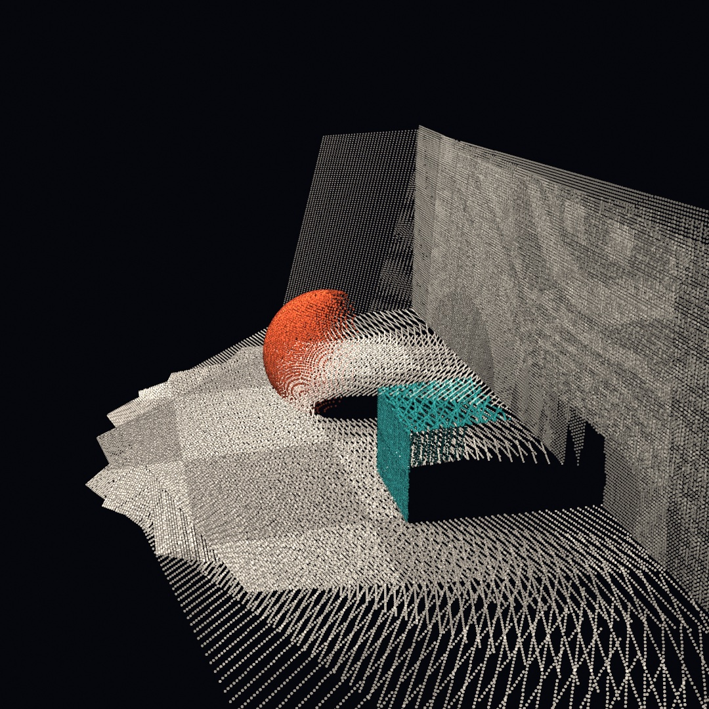
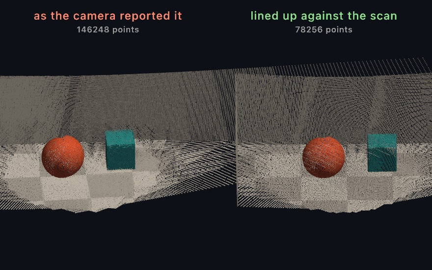
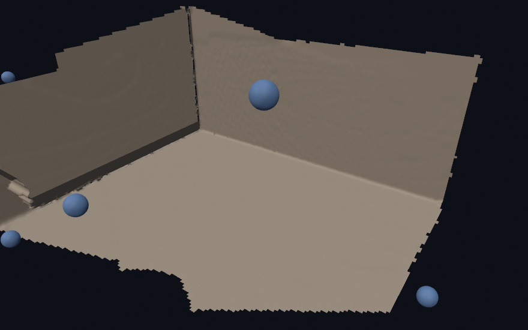
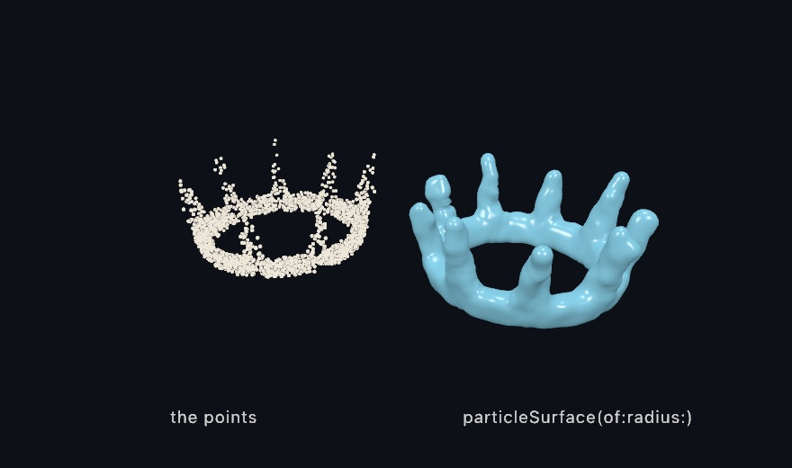

#### <sup>[Ollin](../README.md) → [Guide](README.md) → Chapter 35</sup>

---

# 35. Depth



Each pixel of a depth frame holds the distance to what it shows, and that is enough to stand the picture up in space. This chapter turns one frame into a cloud of points and fuses many into a room, on any Mac with a pretend depth camera. The ghost room at the top scans itself into being. The sections after it draw inside a depth frame, keep long scans straight, and build a surface, and [Chapter 36](36-ThePhoneAsASensor.md) brings the real sensors.

## What a depth camera sees

A **depth camera** measures how far away each point is, as well as its color. The Pro iPhones carry one on the back, a **LiDAR** scanner, which times light as it bounces back from the room. Every iPhone with Face ID carries one on the front, the **TrueDepth** camera, which reads a pattern of dots it projects onto your face. Whatever the hardware, every depth source hands you the same three things. First a color image, then a depth map holding one distance per pixel in meters. Last come the **intrinsics**, a handful of numbers describing the lens that took them.

<picture>
  <source media="(prefers-color-scheme: dark)" srcset="Images/35-Depth/Anatomy-dark.jpg">
  
</picture>

In Ollin that bundle is one value type, `RGBDFrame`, and one call builds it. Here `color` is an `Image`, `depths` the depth map as a list of numbers, and `intrinsics` the lens numbers:

```swift
RGBDFrame(color: color, depth: depths, confidence: nil,
          depthWidth: 240, depthHeight: 180, intrinsics: intrinsics)
```

`confidence` can carry the sensor's own rating of each depth pixel, one number per pixel. It is 0 for low, 1 for medium, and 2 for high. A real sensor is least sure along the edges of things. `nil` means there is no rating, so every pixel counts as high.

This chapter's frames come from a pretend depth camera, `StageCamera`. It sits at the end of [`GhostRoom.swift`](Figures/35-Depth/GhostRoom.swift), about ninety lines. Copy it into your sketch file, below your own class, before you try the blocks in this chapter. Those lines march rays through a tiny staged room, [Chapter 32](32-SculptingWithFields.md#how-the-picture-gets-made-sphere-tracing)'s sphere tracing run on the CPU. They fill those arrays, colors from the scene and depths from how far each ray went. It's a pretend camera, but the frame it produces is a real `RGBDFrame`. So everything else in this chapter treats it as it would treat a LiDAR frame. The code does not change when a real one arrives in [Chapter 36](36-ThePhoneAsASensor.md).

> **Swift note.** `depth` is a plain `[Float]`, row by row from the top left, `0` where the sensor had no answer. Real depth maps are full of those holes, especially along silhouettes, and the calls that read them skip the holes.

## Standing the picture up

One pixel plus one depth is a 3D point. The recipe fits in a sentence. Slide the pixel off the image center, and scale by depth over the focal length. Then set the point that far out along the camera's forward axis.

<picture>
  <source media="(prefers-color-scheme: dark)" srcset="Images/35-Depth/Unproject-dark.jpg">
  
</picture>

That's called **unprojection**, and the intrinsics are the numbers the recipe needs: `cx` and `cy` the image center, `fx` and `fy` the focal lengths. The depth is measured along the camera's forward axis, not along the ray. The camera looks down its own −z, so the point's `z` is minus the depth. You'll rarely unproject one pixel at a time yourself. `pointCloud()` unprojects every depth pixel it trusts, colors each from the color image, and hands the result back as a `PointCloud`. By default it trusts only pixels rated `.high`, and `minConfidence:` lowers the bar.

```swift
// in setup(): a capture marches rays on the CPU, so take it once
let frame = StageCamera.capture(eye: Vector3(0.2, 1.05, 1.7),
                                target: Vector3(0, 0.45, -1.1))
let cloud = frame.pointCloud(pointSize: 0.013)
// …each frame:
camera(.orbiting(target: Vector3(0, 0, -2.9), radius: 4.4,
                 azimuth: 0.85, elevation: 0.35, fieldOfView: .pi / 4))
drawPointCloud(cloud)
```


The cloud sits in the capture camera's own space, in front of it along −z. So the orbit centers on a point at z −2.9. The picture has become geometry you can orbit. Behind the ball and the crate hang black voids, the parts of the room the camera never saw. Every real scan has them, and the next step fills them from more viewpoints.

For one point instead of all of them, `frame.unproject(normalized:)` lifts a single image position to its 3D spot in meters. The position is normalized, given as fractions from 0 to 1 across the image, as [Chapter 34](34-Seeing.md#trackers-attach-then-read)'s trackers give theirs. It reads a small window of depths around the position and takes their median, so a stray hole doesn't spoil it. That lifts a tracked 2D skeleton to its true depth, and the [RGBD reference](../Docs/3D/RGBD.md) shows it paired with the body tracker.

## One world from many frames

A single frame is a slice of the world, whatever the lens saw plus voids. The way past that needs one more ingredient, the **pose**: where the camera stood and which way it looked, written as a transform. A frame's cloud is in the camera's own space. Given the cloud and its pose, `WorldCloud`'s `add(_:transformedBy:)` places the points where they are in the room.

`WorldCloud` gathers the placed points. It divides space into small cubes called **voxels**, `voxelSize` meters on a side, and keeps one point in each cube, the most recent. So frames that overlap don't pile up points where they agree:

```swift
var world = WorldCloud(voxelSize: 0.02)

// `room` is the point the cameras look at, `eye` where this capture stands
let frame = StageCamera.capture(eye: eye, target: room)
world.add(frame.pointCloud(pointSize: 0.016),
          transformedBy: StageCamera.pose(eye: eye, target: room))
// …repeat from other eyes, then:
drawPointCloud(world.cloud)
```


Each capture is tinted coral, green, or blue, so you can see which frame saw what. `StageCamera.capture` takes a `tint:` for that. Three partial views make one room. The small spheres are the three camera positions, and the walls one frame couldn't see are filled in by the frames that could. `StageCamera.pose` knows where the pretend camera stood, with no error. A real phone reports its own pose, as [Chapter 36's capture app](36-ThePhoneAsASensor.md#ollins-own-app-ollin-capture) shows.

## Putting it together: the ghost room

The finished sketch turns the sweep itself into the picture. Nine frames of the staged room join the world one per second, drawn as light that adds up while the camera orbits. Make `MySketches/GhostRoom.swift`, with `StageCamera` copied in below the class:

```swift
import Ollin
import simd

final class GhostRoom: Sketch {
    let room = Vector3(-0.1, 0.4, -1.2)
    var world = WorldCloud(voxelSize: 0.012)
    var fused = 0

    override func draw() {
        background(Color(hex: 0x05070C))

        // One more frame of the sweep joins the world every 60 frames.
        let due = min(9, frameCount / 60 + 1)
        while fused < due {
            let a = -1.15 + Double(fused) * 0.29
            let eye = Vector3(room.x + sin(a) * 3.0, 1.1 + Double(fused % 3) * 0.25,
                              room.z + cos(a) * 3.0)
            let frame = StageCamera.capture(eye: eye, target: room)
            world.add(frame.pointCloud(pointSize: 0.011),
                      transformedBy: StageCamera.pose(eye: eye, target: room))
            fused += 1
        }

        cameraShowcase(target: room + Vector3(0, 0.2, 0), radius: 5.8,
                       elevation: 0.4, fieldOfView: .pi / 4)
        blendMode(.add)
        drawPointCloud(world.cloud)
        blendMode(.normal)
    }
}
```

The room uses the depth frame, the point cloud each frame stands up into, and the world cloud that places each one by its pose. Every 60 frames, one more viewpoint joins. `due` is how many should have joined by now, `frameCount / 60 + 1` capped at nine, and the `while` loop from [Chapter 10](10-Vectors.md#putting-it-together-the-swarm) catches `fused` up to it. The integer division drops the remainder, so `due` steps up once a second on a 60 Hz display. At 120 Hz, the other rate of [Chapter 3](03-MotionAndTime.md#the-clock), it steps twice as fast. Each eye stands on an arc around the room, `0.29` radians further along than the last, at one of three heights picked by `fused % 3`.

The cloud is drawn with `blendMode(.add)`, [Chapter 19](19-LayersAndEffects.md#how-new-paint-meets-old-blend-modes)'s additive light. Each cube still keeps one point, but more frames fill more of the cubes along a surface. So a surface many frames saw grows denser and brighter. `cameraShowcase` is the draggable orbit of [Chapter 26](26-3DGently.md#a-camera-and-a-sphere). `import simd` is there for `StageCamera`, which builds its poses with Apple's library of vector math.

The woven texture is the scan lines of the viewpoints interleaving. The solid patches are where many frames agree, and the voids are what no camera reached. Run it live and the room fills in frame by frame, and the orbit lets you look around what was scanned.

Then make it yours:

- Point it at a real room. With a LiDAR iPhone and [the capture app](36-ThePhoneAsASensor.md#ollins-own-app-ollin-capture), swap `StageCamera` for a `PhoneDevice`'s `latestFrame` and `latestPose` and sweep your room. The `3D/Phone/PhoneWorldScan` example builds a scan that way.
- Restage the set. `StageCamera.scene` is a distance function, a plain Swift function from a point to how far it is from the nearest surface. [Chapter 32](32-SculptingWithFields.md#melting-the-smooth-minimum)'s smooth minimum is a short formula you can write into it: `min(a, b) - h * h * k / 4`, with `h = max(k - abs(a - b), 0) / k`. Melt a blob into the room that way and scan it. Its color comes from `shade(at:)`, which picks a color by where a point is.
- Rebuild it solid. Keep each `eye` in an array as the loop places it, and crop the cloud to the room's corner. Then hand both to `reconstructSurface(of:spacing:orientedToward:)`, as [the surface family](#from-the-cloud-to-a-surface-surface-reconstruction) shows. The ghost becomes a room you can light, shadow, and walk a camera through.

The assembly is what this one shows, so keep it as a movie. This writes twelve seconds of it, all nine frames and a few seconds of the finished room:

```sh
swift run OllinLive MySketches/GhostRoom.swift --export-video ghost-room.mp4 --seconds 12
```

## Drawing inside the picture: a depth frame as a stage

The ghost room turned each frame into points and let the picture go. A single depth frame can also stay a picture, with a depth at every pixel, and you can draw into it. Solids go behind what the camera saw, and flat marks sit at a depth.

### Solids behind the scene: drawDepthScene

`drawDepthScene(frame)` draws the color image as the backdrop, and writes the depth map into the depth buffer. A camera built from the frame's own lens, `camera(.intrinsic(...))`, puts your 3D drawing in the same metric space. So the scene hides what you place behind it. It is for putting things into a photographed room, a ball behind a real chair or a creature under a real table. It is [Chapter 26](26-3DGently.md#depth-that-hides-things-the-depth-test)'s depth test, fed from a camera's depth map instead of from solids you drew.


```swift
camera(.intrinsic(frame.intrinsics))
drawDepthScene(frame)

// A run of marbles marching into the room, in meters.
for i in 0 ..< 6 {
    withState {
        translate(-1.3 + Double(i) * 0.44, -0.32, -1.85 - Double(i) * 0.34)
        fill(Color(hue: 0.09 + Double(i) * 0.035, saturation: 0.75, brightness: 1))
        specular(0.5); specularSharpness(60)
        drawSphere(radius: 0.12)
    }
}
```

Count the marbles. Six were drawn, and the crate's depth hides the last ones and slices one in half. The marbles are ordinary solids from Chapter 26, tested against depths that came from a camera. That camera is the pretend one here, and a real one with a phone.

### Flat marks at a depth: depth compositing

Flat drawing can take part too. A label, a tag, or a halo belongs in the scanned room. [Chapter 26](26-3DGently.md#flat-drawing-that-knows-where-it-is-depth-compositing) taught `depth(at:)`, `project`, and `withBillboard` for putting 2D marks at a depth. They work the same in a metric scene like the marbles'. `depth(at:)` takes a point in meters, and `withBillboard` stands a mark at one:

```swift
withBillboard(at: Vector3(0.4, 0.1, -2.2)) {     // a point in the room, in meters
    fill(.white); drawCircle(0, 0, 12)          // hidden where the room is nearer
}
```

A gray depth map with no lens behind it is the other kind of scene. There `drawDepthScene(color:depth:)` draws it, and `depth(0.5)` takes a fraction of the map's own near-to-far range instead. The [depth compositing reference](../Docs/3D/DepthCompositing.md) covers both kinds side by side.

## Keeping a long scan straight: drift and loop closure

The ghost room placed each frame by an exact pose, because the pretend camera knows where it stood. A real camera only estimates its pose. Correcting drift and closing the loop keep a long scan straight when those estimates go wrong.

### When the camera loses its place: correcting drift

Sweep for a minute and the scan starts to fog. The camera's estimate of where it stands is a little wrong in every frame, and the errors pile up instead of canceling. That slow slide is called **drift**. A wall seen early and seen again late lands in two places.

`add(_:correcting:)` corrects it. It slides and turns each arriving frame onto the surfaces already fused, then merges it. It is for any scan that runs longer than a few seconds. The method is the iterative closest point fit of Paul Besl and Neil McKay, from 1992. It measures against surfaces, as Yang Chen and Gérard Medioni did the same year. Kok-Lim Low's linearization, from 2004, turns each round of the fit into a small set of straight-line equations.



The call takes a frame's `cloud` and `reportedPose`, the pose the camera reported with it:

```swift
let fix = world.add(cloud, correcting: reportedPose)
```

Both halves are the same nine captures, seen from the same angle. On the left the walls smear into one slanting sheet. On the right they meet in a clean corner. The corrected scan also holds about half as many points, because a smeared wall fills more space than a wall does.

The correction that worked is kept. The next frame starts from it, so the fit only has to find the newest error, and it costs little. Apply `world.correction` to anything else the camera reports in that space.

It refuses to guess. A frame may find too little to match, or its fit may jump too far or pin down too loosely. Then it gets no new correction of its own. It is merged at the correction carried from before, and `fix.isApplied` says so.

### Coming back to where you started: closing the loop

Correcting a frame has a limit that shows only over a long walk. It fixes the newest error and never revises the poses already laid down. So each frame agrees with the frame before it, and the chain of them comes out smooth, yet the chain can still lean. Go all the way around a room and back to the door, and the far wall is well away from where it is.

**`ScanGraph`** handles that. It is for a walk that comes back to where it began, around a room or through a building. It fuses and corrects as `WorldCloud` does. It also keeps a **keyframe** every so often, a saved frame of the scan rather than an animation key. A keyframe is a pose and a thinned copy of what that frame saw. When a new keyframe lands where an old one stood, the two are matched against each other. That match ties a late pose to an early one, so the chain becomes a loop that does not quite close. The difference is then shared out over every pose in between. That sharing is pose-graph optimization, written from the tutorial of Giorgio Grisetti and colleagues, from 2010.


The call is the same as `WorldCloud`'s, and its answer says when a loop closed:

```swift
var scan = ScanGraph(voxelSize: 0.025)

let update = scan.add(cloud, correcting: reportedPose)
if let loop = update.loop {
    print("been here before: the map moved \(loop.moved) m")
}
drawPointCloud(scan.cloud)
```

Both halves are the same walk, seen from straight above. From overhead a wall is a line, and a scan that leaned draws that line twice. The dots are where each half thinks the camera stood, and the white ones are the first and the last. The walk goes round a little more than once, so its second lap passes the walls its first lap saw. On the left, the second lap lands off the first, and the bottom wall is drawn twice. On the right the laps agree, the walls are single, and the scan holds a quarter fewer points.

What you get from this is a scan that agrees with itself, which is not the same as a scan in the right place. One match pulls the two ends of a walk together and shares the difference along everything between them. It does most of its work at the point of return. In a small room, nearly every frame can see something already fused. There the frame-by-frame fit has taken most of the drift out before the walk gets back, and there is little left to find.

It has two limits. A place is recognized by standing near it. A scan that has drifted further than `settings.searchRadius` before it comes back is out of its own reach. The match is then refused rather than guessed. And a camera facing one bare wall can slide along that wall and fit it as well at every spot. A match made there would record drift as though it had been measured. Only the fit's own sense of how well it is pinned down can catch that. So a room with things standing about in it is easier to scan than an empty corridor.

Run it for yourself with `swift run --package-path Examples Example-3D-Depth-ClosedLoopScan`, which walks a made-up hall twice side by side with the true walls drawn over both.

## From the cloud to a surface: surface reconstruction

The ghost room stays a cloud of points. The points are its look, but nothing in them has a face, a shadow, or a material. A surface built from the points does.

### A solid from a sweep: reconstructSurface

**`reconstructSurface`** turns a sweep into a solid. It fits a small plane to every point's neighborhood. Then it uses the sweep's own camera positions to decide which side of each plane faces the room. Last it pulls one mesh out of the planes. It is for a scan you want to light and shade, and it is the surface reconstruction of Hugues Hoppe and colleagues, from 1992.



Hand it the cloud, a spacing, and `eyes`, the camera positions of the sweep:

```swift
let mesh = reconstructSurface(of: world.cloud, spacing: world.voxelSize * 2,
                              orientedToward: eyes)
material(.dielectric(roughness: 0.55))
drawMesh(mesh)
```

Crop the cloud to the part of the room you want first, since the rebuild spreads its grid over the cloud's whole extent. The rim is torn where the data stops. Where no camera reached, the surface stops, and nothing is guessed. So the mesh can only be as complete as the sweep. A body you only arc in front of keeps an unseen back, and the rebuilt surface frays just past where its data stops. So walk around the things you care about.

When a sweep falls short anyway, `fitting: .robust` swaps the nearest-plane distance for a blend of all the nearby samples. The blend gives less weight to whatever disagrees with its neighbors. It is the robust fit of Cengiz Öztireli, Gaël Guennebaud, and Markus Gross, from 2009. It smooths noise, keeps creases, and trims away nearly all of the fraying that the plane fit leaves at open edges. Doorways and windows stay open either way, which is the shape a room has.

The camera path does double duty here. Every fitted plane has two sides, and the reconstruction turns each toward the cameras that plausibly saw it. So pass the sweep's positions in `orientedToward:` whenever you have them. Keep them in an array as the capture loop places each eye. Without them, orientation propagates point to point across the cloud. That works on a smooth single surface, and struggles where a camera would have known better.

Hand over the `PointCloud` itself, as the block does, and the colors come along. Bare positions give a surface in the fill color, like the figure's plaster. Each mesh vertex takes its nearest sample's color, so the room comes back in the colors the camera saw. Per-vertex colors multiply the `fill`, as a texture does. So the default white fill shows them untouched, and `fill(Color(white: 0.5))` dims the scan without touching its hues. The same trick paints any mesh, via `colored(from:)` for a cloud or `colored(by:)` for a rule.

What comes back is an ordinary `Mesh`, so everything [Chapter 26](26-3DGently.md) and [Chapter 27](27-Meshes.md) taught applies. That means materials, lighting, cast shadows, even `subdivided(_:)` to soften the scan.

### Points as their own material: particleSurface

Sometimes points are their own material rather than a scan, a splash, say, or a swarm dense enough to read as a body. `particleSurface` skins them as one blended form, with no cameras involved. It is the blended particle surface of Yongning Zhu and Robert Bridson, from 2005, written for sand that flows like a fluid. With `points` a list of positions, `particleSurface(of: points, radius: 0.05)` hands back one mesh. The [reference page](../Docs/Generators/SurfaceReconstruction.md) covers both calls, and the `3D/Geometry/SurfaceFromPoints` example puts the two side by side on one cloud.



On the left is a splash crown thrown up around a ring, as points. On the right, `particleSurface(of:radius:)` has skinned the same points into one form, and each spike ends in a rounded tip.

## Where this comes from

Radiohead's *House of Cards* video, in 2008, brought the point-cloud look to a wide audience. James Frost directed it with the data artist Aaron Koblin. It was shot with lidar and with structured light, patterns of light projected onto the scene, rather than with a camera. Depth capture then spread through art practice after the Microsoft Kinect shipped in 2010 and hackers opened it to their own programs. The RGBDToolkit, from James George and his collaborators, and the volumetric films that followed turned depth footage into a medium you could edit. The unprojection math is the pinhole camera model, the base of photogrammetry and computer vision. Fusing posed depth frames into one model comes from SLAM research. There a moving camera builds a map while it finds its own place in it. It also comes from KinectFusion, by Richard Newcombe and colleagues in 2011. `WorldCloud`'s fit of each frame onto what is already fused is a small relative of it. The entries after the ghost room name their own sources. Full credits are in the project's [attribution notes](../ATTRIBUTION.md).

## Go deeper

- [RGBD frames](../Docs/3D/RGBD.md): the frame type, unprojection, depth-lifted pose (a 2D-tracked skeleton placed at its true depth).
- [3D](../Docs/3D/3D.md#point-clouds): `PointCloud` itself, its point sizing and colors, and how it sits beside the rest of the 3D path.
- [Depth compositing](../Docs/3D/DepthCompositing.md): `depth(at:)`, billboards, `drawDepthScene`, and the metric camera.
- [Surface reconstruction](../Docs/Generators/SurfaceReconstruction.md): rebuilding a scanned cloud as a mesh, skinning particle sets, and the holes and orientation details.
- Appendix B draws this chapter's math, one picture per idea: [Where things are](B-JustEnoughMath.md#where-things-are), [Into three dimensions](B-JustEnoughMath.md#into-three-dimensions).
- Worked examples: [`Examples/3D/Depth/DepthCloud`](../Examples/3D/Depth/DepthCloud/Sketch.swift) (a webcam depth model, no phone needed), [`Examples/3D/Depth/ClosedLoopScan`](../Examples/3D/Depth/ClosedLoopScan/Sketch.swift) (staged, no phone needed), [`Examples/3D/Depth/DepthLiftedPose`](../Examples/3D/Depth/DepthLiftedPose/Sketch.swift) (a live stream from an iPhone, as in [Chapter 36](36-ThePhoneAsASensor.md#depth-footage-record3d-clips-and-the-live-stream)), [`Examples/3D/Geometry/SurfaceFromPoints`](../Examples/3D/Geometry/SurfaceFromPoints/Sketch.swift), and [`Examples/3D/Depth/DepthOcclusion`](../Examples/3D/Depth/DepthOcclusion/Sketch.swift).

---

[Contents](README.md#contents) · Previous: [Chapter 34, Seeing](34-Seeing.md) · Next: [Chapter 36, The iPhone as a sensor](36-ThePhoneAsASensor.md)
