#### <sup>[Ollin](../README.md) → [Guide](README.md) → Chapter 36</sup>

---

# 36. Making sound

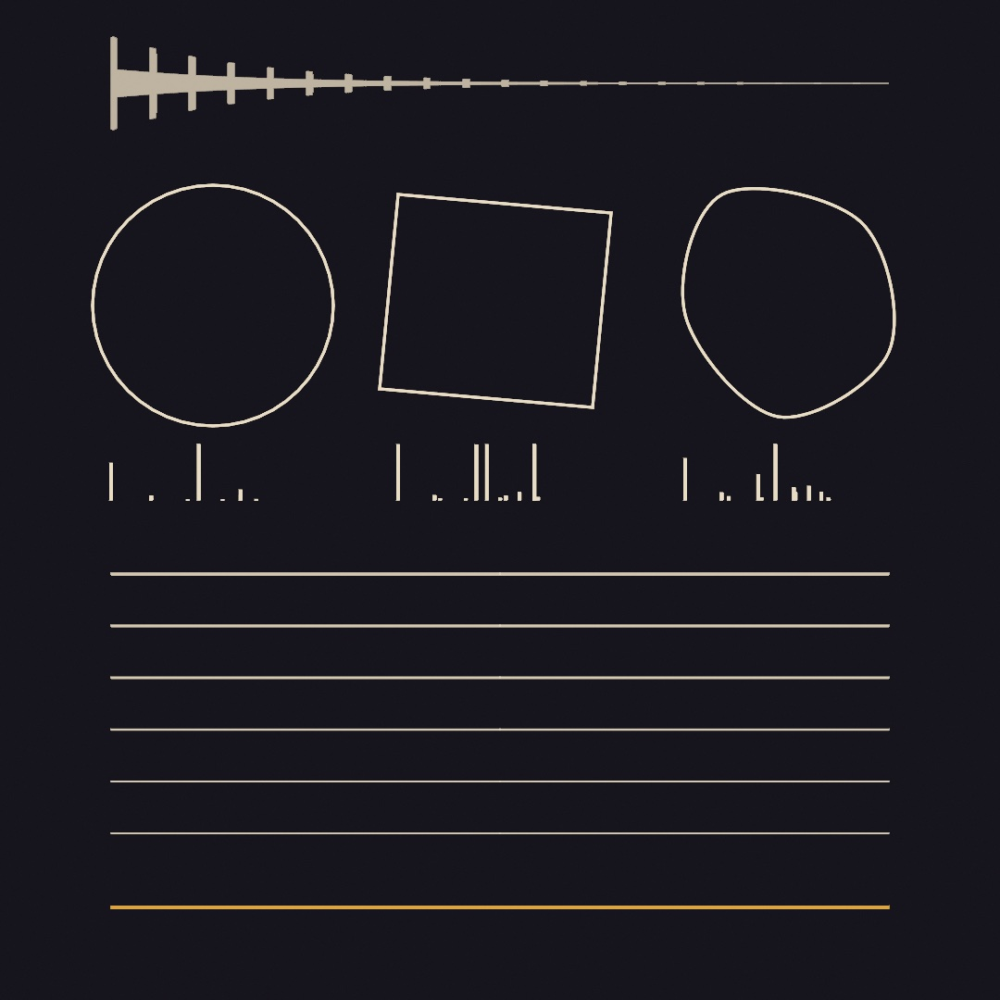

A synth inside the sketch gives it a voice, and you build that voice up from a single note. Physical models pluck and bow a string, strike a shape, and blow a tube. A chain of effects ends in a room you can draw. You play the workbench at the top with the mouse, and it needs no microphone, controller, or file. Other sources of sound follow it, then more effects including one you write, and notes you bend one at a time.

## A sketch that plays

[Chapter 34](34-Listening.md#four-sources-the-microphone-a-file-a-tone-and-a-video)'s `Tone` sounds one steady note, which is enough to feed an analyzer. For a sketch that plays notes, the instrument is `Synth`, and asking it for a note is one line:

```swift
let synth = Synth(.pluck)

override func mousePressed() {
    synth.play("C4", for: 0.4)
}
```

Nothing was started. The first note starts the synth's sound engine, so a sketch can't stay silent because you forgot to start it. Pitches are written however you already think of them. `"C4"` is a note name, `60` the MIDI number of the same note, and `60.5` the quarter tone between two keys. `for:` is how long to hold the note, in seconds, so it ends without being told to.

A held key wants a note that outlives one call, and that is the other half:

```swift
synth.noteOn("C4")     // sounds until told otherwise
synth.noteOff("C4")
```

A `Synth` plays up to sixteen notes at once by default, so chords and overlapping tails need no bookkeeping from you. When all sixteen are sounding, a new note takes the place of the quietest one already let go. If every note is still held, it takes the oldest. A note played with `for:` counts as let go from its start. So a melody over a held chord takes the places of its own earlier notes.

**What a note is made of** is a `Voice`, and the presets are the quick way in: `.pluck`, `.bass`, `.pad`, `.bell`, `.stab`, `.breath`, `.sine`. Assigning a new one leaves sounding notes alone, so you can change instrument between notes:

```swift
synth.voice = .bell
```

Inside a voice, three parts work in a row. An **oscillator** repeats one wave shape at the note's frequency, such as a sine or a sawtooth. A sawtooth rises in a straight line and drops back. An **envelope** shapes the note's level over time. A **filter** takes part of the sound away. Start with the envelope. It is what makes a bell sound like a bell and an organ like an organ, with the same wave underneath.

<picture>
  <source media="(prefers-color-scheme: dark)" srcset="Images/36-MakingSound/Voices-dark.jpg">
  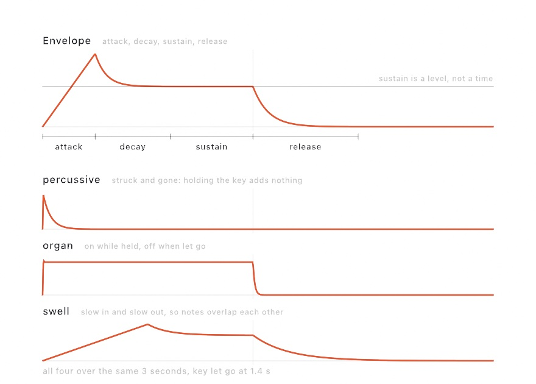
</picture>

An envelope has four numbers, and three of them are times. `attack` is how long the note takes to arrive, and `decay` how long it takes to settle. `release` is how long it takes to go once let go. `sustain` is different. It is the *level* the note rests at while held, not a length of time. Set it to zero and holding the key adds nothing, which is how struck things behave. So the `Envelope.percussive` shape sounds like a drum however long you hold the key. An envelope can also tell you its level at any moment, so you can draw it:

```swift
Envelope.swell.level(at: 0.7, heldFor: 1.4)   // where a note has got to
```

The filter changes the color of a note. The usual kind, a lowpass, removes the frequencies above its `cutoff`, which darkens the sound. A note that is bright when struck and darkens as it fades has a filter closing over it. `Voice.Filter.sweep(from:by:)` makes that gesture, and `.pluck` closes its filter over each note the same way.

A `Synth` is also an `AudioSource`, like the microphone, so every read in Chapter 34 works on the sketch's own playing:

```swift
drawCircle(width / 2, height / 2, 100 + Double(synth.amplitude) * 900)
```

A sketch that listened to the room can now listen to itself, so the picture can follow the notes it plays. The `Audio/Synth` example is a playable keyboard that does this.

One rule shapes the rest of this chapter. Sound is made on the **audio thread**, a separate thread that fills the speakers' next few milliseconds. It has to be on time, every time, so it can never wait. So each note carries its `Voice` to that thread as a fixed-size value. A voice holds no lists and no references, and nothing in it needs memory set aside. This rule explains some fixed limits, such as sixteen tones for a struck shape and eight parts for [a patch](#building-an-instrument-instead-of-choosing-one-patches-and-fm). It is also why anything large, such as a recording, is set on the synth, and a voice only says how to play it. Code of your own that runs on the audio thread follows the same rule. It does arithmetic on the sound and nothing else: no setting memory aside, no waiting on a lock, and no reaching back into the sketch.

## A string worked out sample by sample: the plucked string

The presets in the first step start with a wave, a shape an oscillator traces over and over. The envelope and the filter then carve it until it sounds like something. Most synthesizers work that way. A **physical model** starts from the thing that makes the sound instead:

```swift
let synth = Synth(.steel)
synth.play("E3", for: 3)
```

The synth now plays a string: a length of something under tension, with a disturbance running up and down it. It is worked out one sample at a time as it goes.

<picture>
  <source media="(prefers-color-scheme: dark)" srcset="Images/36-MakingSound/PluckedString-dark.jpg">
  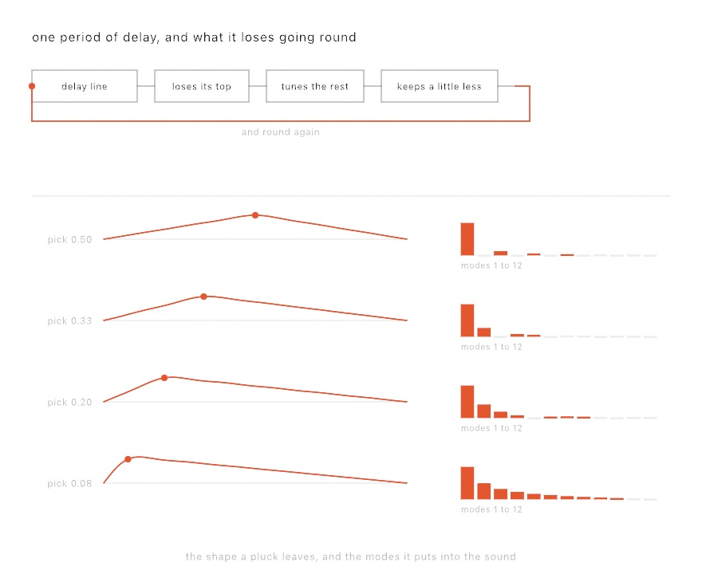
</picture>

The top of that picture is the model. A **delay line** one period of the note long holds the disturbance as it travels. A filter in the loop is what the string loses at each end, and it takes more off the high frequencies than the low. A little less comes back each time round than went out. Feed a burst of noise into the loop and it turns into a note by itself.

You get several things from the model without asking for them. The note attacks like a string, because that is how a disturbance settles into a loop. It darkens as it rings, because the high frequencies are lost faster than the low ones, so a long note changes color with nothing moving. And it answers to *where you pluck it*:

```swift
var string = PluckedString.steel
string.position = 0.5          // halfway along
synth.voice = Voice(plucked: string)
```

The lower half of the picture shows why. A string vibrates in several patterns at once, called **modes**. In the first mode the whole string swings, in the second its two halves swing opposite ways, in the third its thirds, and so on. Each mode adds one harmonic to the note, and each has points that stay still, called **nodes**. A pluck pulls the string aside at one point, so a mode with a node at that point is never set moving. Pluck halfway along and every even mode is missing, which is the hollow tone in the top row's gaps. Pluck near the end and they are all there, thinly, which is the nasal sound of a guitar played near the bridge. The shape on the left and the bars on the right show the same fact twice.

`Examples/Audio/Strings` is six strings you click wherever you want to pluck them. The shape it draws on each one is made of those same modes.

A string has three more settings. `hardness` is how quickly you let go, which decides how much of the string you set moving. `decay` is how long the note rings, and `damping` is how much sooner the bright part fades than the low part. A string also decides its own fade, so the envelope should stay out of the way. Ask for a note long enough to let it finish, or the release will cut it off mid-ring.

The tuning needs care too. The loop has to be one period long, to a fraction of a sample, and a whole number of samples can't manage that. At the bottom of the keyboard the rounding error hides in a loop hundreds of samples long. At the top, where a period is ten samples, rounding is out by most of a semitone. So the leftover fraction goes to an **allpass filter**, which delays the sound by part of a sample without changing its level. The loop filter's own small delay is counted into the same budget, so turning `damping` up can't pull the note flat.

## A shape you can hit: modal synthesis

A string is one length of one thing, and its model is one loop. Something struck works differently. Hit a plate, a bell, or a sheet of glass, and it makes a handful of pure tones at once. Each one fades at its own rate. The shape of the object decides which tones those are, and nothing else does.

```swift
let synth = Synth(.chime)
synth.play("C4", for: 4)
```

The chime is a bell, made from a list of frequency ratios a bell founder would recognize, and `.drum`, `.bar`, and `.glass` are beside it. The list can also come from an outline you draw. Here `synth` is the chime above, and `bell` is measured once in `setup()`, from the letter O:

```swift
var bell: StruckShape?

override func setup() {
    textSize(300)
    bell = StruckShape(textToShapes("O", at: Vector2(540, 540))[0])
}

override func mousePressed() {
    guard let bell else { return }
    synth.voice = Voice(struck: bell.body(struckAt: Vector2(mouseX, mouseY)))
    synth.play("C4", for: 3)
}
```

`StruckShape` measures an outline and can come back `nil` for one it can't measure, so `bell` is optional. `body(struckAt:)` gives the tones that answer a strike at one point, and `Voice(struck:)` plays them.

<picture>
  <source media="(prefers-color-scheme: dark)" srcset="Images/36-MakingSound/StruckShapes-dark.jpg">
  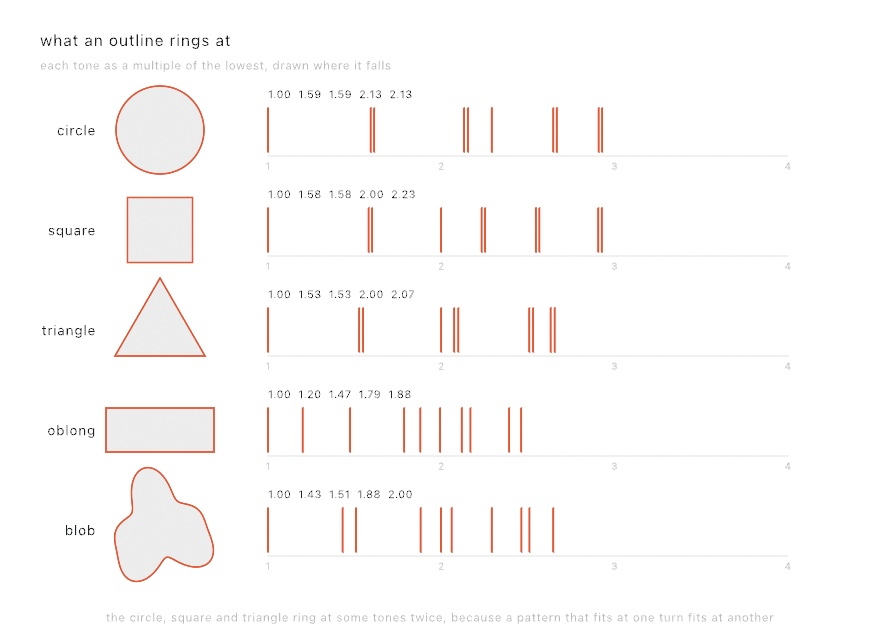
</picture>

Each row is the outline beside it, measured. The circle's ratios are the zeros of the Bessel functions, the functions that describe a round drumhead. They run 1, 1.59, 2.13, and 2.30 in turn. The square comes back at 1, 1.58, 2, and 2.23, within a hundredth of what a square membrane rings at. The blob comes back at whatever a blob rings at, which has no name.

The method is simple to state. A flat thing held at its edge can only vibrate in the shapes that fit inside its outline, with nothing moving at the rim. Finding those shapes is a kind of problem mathematicians call an eigenvalue problem, and the tones' frequencies are the square roots of its answers. Ollin lays the outline on a grid of points and solves it there.

Look again at the pairs. Some tones come twice because of the outline's symmetry. The triangle looks the same turned a third of the way round, the square a quarter, and the circle any amount. So a vibration that fits the shape also fits it turned, and the two ring at the same frequency. The oblong looks the same only turned halfway round or flipped, which doesn't pair its tones, and the blob has no symmetry at all. A real drum pairs its tones too, but it is never quite round, so its pairs sit a little apart and beat against each other. Two close pitches beat as a slow rise and fall in loudness, and that is part of a drum's sound.

Two practical things follow. **Measuring is slow and striking is fast**, so measure in `setup()` and keep the `StruckShape`. And **where you hit it decides which tones answer**. A mode that stays still at the point you hit gets nothing, the same rule as the pluck position. Hit a circle in the middle and most of its tones stay silent, because most of them have a line of stillness through the center.

`Examples/Audio/StruckShapes` is six of these you can click, and the bars under each one move as you move where you hit it.

## A note you keep playing: bowed and blown

The string and the shape have something in common. Both are set going once. You pluck, or you strike, and the note is decided at that instant. Everything after is the sound fading.

A bow keeps working on the string, and a breath keeps working on a tube. So the note has a middle, and you control it:

```swift
let synth = Synth(.cello)

override func setup() { synth.noteOn("G2") }

override func draw() {
    synth.pressure = 0.3 + 0.5 * abs(sin(time * 2))   // still playing it
}
```

`pressure` is how fast the bow is drawn, or how hard the tube is blown. It is read again every few milliseconds, so moving it moves the note that is already sounding. At zero there is nothing to hear, because nothing is being done to the string. An envelope can't give you this, because an envelope is decided when the note starts. `pressure` is whatever you are doing right now.

Both models are **digital waveguides**, delay lines that carry a wave along a string or down a tube and back. The bow, or the **reed**, the thin cane that vibrates in a clarinet's mouthpiece, works where they meet. Two behaviors come from the models themselves, with no setting that asks for them.

**Bow too fast for the force and the note breaks.** The string tears loose from the bow twice per cycle instead of once. The note jumps to the octave above. Over-bowing sounds the same on a real cello, and nothing in the code adds it. It is what the grip between bow and string does when you go past it. Bow with more `force`, a setting of `BowedString`, or draw slower, and the note settles back.

**The clarinet has no even harmonics.** Nothing filters them out. The tube is closed at the reed and open at the far end, so it holds a quarter of a wave instead of a half. A tube like that supports the odd harmonics only, which is why it sounds hollow and woody. It also sounds an octave below a tube of the same length that is open at both ends. In the model, all of that comes from one line that makes the loop half a period long instead of a whole one.

`Examples/Audio/Bowing` puts both under the mouse. Hold the button to play, move up and down to change the pressure, and press `B` to swap the bow for a reed.

## After the note: the effects chain

The workbench's strings and shapes make their sound. What happens to that sound afterwards is a chain of **effects**, each one working on what the one before it handed over:

```swift
synth.effects = [
    .distortion(Distortion(.softClip, mix: 0.3)),
    .delay(Delay(time: 0.28, feedback: 0.5)),
    .reverb(Reverb(.hall, mix: 0.4)),
]
```

A distortion bends the wave so it sounds gritty. A delay plays the sound again `time` seconds later, and `feedback` is how much of each echo comes back to echo again. A reverb puts the sound in a room. `mix` is how much of an effect you hear against the plain sound, from 0 for none of it to 1 for all of it.

Order matters, which is why the chain is a list. Distort first, and each echo is a copy of the gritty sound. Echo first, and the echoes pile up before the distortion, so they grind against each other. Swap the first two lines and you can hear which you have.

`synth.reverb = Reverb(.hall)` puts one room in the chain, or replaces the room already there, and many sketches need nothing more. Changing a setting while the synth plays costs nothing. Changing which effects are in the chain rewires it on the running engine, with no gap you can hear.

The workbench's chain uses two more kinds:

```swift
synth.effects = [
    .chorus(Chorus(rate: 0.6, depth: 0.3)),
    .delay(Delay(time: 0.3, feedback: 0.35, mix: 0.2)),
    .limiter(Limiter()),
]
```

A **chorus** plays a copy of the sound about twenty milliseconds late and keeps sliding that delay back and forth. `rate` is how many times a second it slides, and `depth` how far. The copy is never quite in tune with the original, so one voice sounds like several. A **limiter** keeps the level under a ceiling, whatever arrives. **Full scale** is the loudest level a sample can hold. A sound pushed past it **clips**, its peaks cut off flat, which sounds harsh. The limiter keeps a pile of echoes from clipping, so it belongs last in a chain. The family of effects after the workbench has the rest of their kinds.

### A room you can draw: convolution reverb

The reverb in that chain is one of four rooms that come with Ollin. Here is what a room is, so you can bring your own.

Clap once in a stairwell. What comes back is the stairwell: every surface and every distance, all at once, in the order the sound reached them. Record that and you have the room written down, as its answer to a single click, called its **impulse response**. Play an instrument through the recording and it sounds as if it were in the stairwell. Every sample of the sound starts its own copy of the click's answer, and the answers add up. Adding up copies this way is called **convolution**, and a reverb built from it is a convolution reverb. Here `stairwell.wav` is a recording in your sketch's folder:

```swift
if let stairwell = try? ImpulseResponse.resource("stairwell", withExtension: "wav", in: .module) {
    synth.reverb = Reverb(stairwell, mix: 0.4)
}
```

The room doesn't have to be real. A room is a rule over time, so you can draw one the way you draw anything else. `ImpulseResponse(seconds:_:)` calls your rule for every moment `t` of the room's answer. It hands the rule a random value between -1 and 1, called noise here, to use or ignore, and keeps what the rule returns:

```swift
let hall = ImpulseResponse.decay(seconds: 3, damping: 0.6)      // fading noise
let backward = hall.reversed()                                 // swelling toward its end
let ball = ImpulseResponse(seconds: 1.8) { t, noise in         // a dropped ball
    var sum = 0.0
    var at = 0.0, gap = 0.42
    for bounce in 0..<14 where t >= at {
        sum += exp(-(t - at) / 0.02) * pow(0.72, Double(bounce))
        at += gap
        gap *= 0.72
    }
    return sum * (0.5 + 0.5 * noise)
}
```

<picture>
  <source media="(prefers-color-scheme: dark)" srcset="Images/36-MakingSound/Rooms-dark.jpg">
  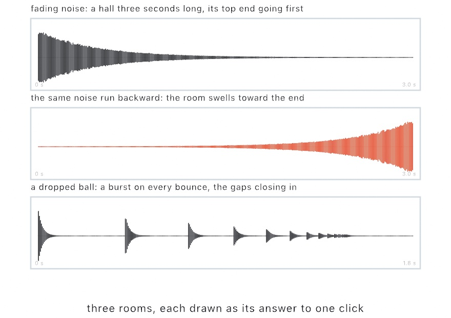
</picture>

Fading noise, random values that die away, is the plainest room there is. Real rooms lose their high frequencies first, which is what `damping` does. Run the same noise backward and the room swells toward its end instead of fading from the click, a sound records have used for decades. The ball is a burst on every bounce, each one 0.72 as loud as the last, with the gaps shrinking by the same ratio. A rule that ignores the noise gives a resonator instead, a room that hums at one pitch. `exp(-3 * t) * sin(.tau * 220 * t)` hums at A and tunes everything you play into it.

Every room is brought to the same level on the way in, so `mix` means one thing whether the recording was quiet or loud. Turn `mix` on a room that is sounding and its tail keeps going. Change the room itself, or its `preDelay`, and a fresh one starts. `Examples/Audio/Rooms` draws five rooms from rules and plays through each, with the room's answer to a click drawn above the instrument's trace.

## Putting it together: the workbench

The workbench is an instrument you play with the mouse. It has three outlines to strike, six strings to pluck, and one more string to bow. All of them play through the same chain of effects, which ends in a room drawn from a rule. Make `MySketches/Workbench.swift`:

```swift
import Ollin
import OllinAudio

final class Workbench: Sketch {
    struct Plate {
        let outline: Shape
        let modes: StruckShape
        let note: Pitch
    }

    // A room drawn from a rule: noise between two close walls, so the sound
    // comes back in a burst every eighth of a second as it fades.
    let room = ImpulseResponse(seconds: 2.5) { t, noise in
        let slap = t.truncatingRemainder(dividingBy: 0.125) < 0.02 ? 1.0 : 0.3
        return noise * slap * exp(-2.2 * t)
    }
    let hands = Synth(.steel)
    let bow = Synth(.cello)

    var plates: [Plate] = []
    let strings: [Pitch] = ["E2", "A2", "D3", "G3", "B3", "E4"]
    var plucks: [Int: (along: Double, time: Double)] = [:]
    var ripples: [(at: Vector2, time: Double)] = []
    var roomOutline: [Double] = []
    var bowing = false
    var bowSpeed = 0.0

    let left = 120.0, right = 960.0, bowY = 980.0
    func stringY(_ i: Int) -> Double { 620 + Double(i) * 56 }

    override func setup() {
        let chain: [Effect] = [
            .chorus(Chorus(rate: 0.6, depth: 0.3)),
            .delay(Delay(time: 0.3, feedback: 0.35, mix: 0.2)),
            .reverb(Reverb(room, mix: 0.35)),
            .limiter(Limiter()),
        ]
        hands.effects = chain
        bow.effects = chain

        // Three outlines to strike: a drum, a plate, and a shape drawn by hand.
        // Measuring each one is the slow part, so it happens once, here.
        let drum = Shape((0..<48).map { i in
            Vector2(230, 330) + Vector2(cos(Double(i) / 48 * .tau), sin(Double(i) / 48 * .tau)) * 130
        }, closed: true)
        let plate = Shape([Vector2(430, 210), Vector2(660, 230), Vector2(640, 440), Vector2(410, 420)],
                          closed: true)
        let blob = Shape(curveThrough: [Vector2(780, 210), Vector2(930, 240), Vector2(960, 380),
                                        Vector2(840, 450), Vector2(740, 340)], closed: true)
        for (outline, note) in [(drum, "C3"), (plate, "G3"), (blob, "D4")] as [(Shape, Pitch)] {
            if let modes = StruckShape(outline) {
                plates.append(Plate(outline: outline, modes: modes, note: note))
            }
        }

        // The room's answer to a click, as one peak per column across the top.
        let samples = room.channels[0]
        let step = samples.count / 840
        roomOutline = (0..<840).map { c in
            Double(samples[c * step ..< (c + 1) * step].map { abs($0) }.max() ?? 0)
        }
        let top = roomOutline.max() ?? 1
        roomOutline = roomOutline.map { $0 / top }
    }

    override func mousePressed() {
        let hand = Vector2(mouseX, mouseY)
        // An outline rings where you strike it, and that decides which tones answer.
        for plate in plates where plate.outline.contains(hand) {
            hands.voice = Voice(struck: plate.modes.body(struckAt: hand))
            hands.play(plate.note, for: 3)
            ripples.append((hand, time))
            return
        }
        // A string is plucked where you click along it, and that decides its tone.
        for (i, note) in strings.enumerated() where abs(mouseY - stringY(i)) < 20 {
            let along = (mouseX - left) / (right - left)
            guard along > 0.02, along < 0.98 else { return }
            var string = PluckedString.steel
            string.position = along
            hands.voice = Voice(plucked: string)
            hands.play(note, for: 4)
            plucks[i] = (along, time)
            return
        }
        // The last string sounds for as long as you hold it.
        if abs(mouseY - bowY) < 24 {
            bow.noteOn("G2")
            bowing = true
        }
    }

    override func mouseReleased() {
        if bowing { bow.noteOff("G2") }
        bowing = false
    }

    override func draw() {
        background(Color(hex: 0x16141C))
        let ink = Color(hex: 0xE9DCC4)

        // The bow: how fast you drag is how fast the bow moves.
        bowSpeed = bowSpeed * 0.85 + abs(mouseX - previousMouse.x) * 0.15
        bow.pressure = bowing ? min(1, bowSpeed / 10) : 0

        // The room across the top.
        stroke(ink.withAlpha(0.5))
        strokeWeight(1)
        for (c, peak) in roomOutline.enumerated() {
            let x = left + Double(c)
            drawLine(x, 90 - peak * 50, x, 90 + peak * 50)
        }

        // The outlines, each with the tones it rings at drawn below it. The
        // taller a bar, the more that tone answers a strike at the pointer.
        for (n, plate) in plates.enumerated() {
            noFill()
            stroke(ink)
            strokeWeight(3)
            drawShape(plate.outline)
            let middle = plate.outline.bounds?.center ?? .zero
            let hand = Vector2(mouseX, mouseY)
            let at = plate.outline.contains(hand) ? hand : middle
            let gains = plate.modes.gains(struckAt: at)
            let x0 = 120 + Double(n) * 310
            strokeWeight(4)
            for (ratio, gain) in zip(plate.modes.ratios, gains) where ratio <= 4 {
                let x = x0 + (ratio - 1) / 3 * 220
                drawLine(x, 540, x, 540 - gain * 60)
            }
        }

        // A strike leaves a ring that spreads and fades.
        ripples = ripples.filter { time - $0.time < 1.5 }
        for ripple in ripples {
            let age = time - ripple.time
            stroke(ink.withAlpha(1 - age / 1.5))
            strokeWeight(2)
            drawCircle(ripple.at.x, ripple.at.y, 10 + age * 120)
        }

        // The strings. A plucked one keeps the bend of the pluck, shrinking as it rings.
        for i in strings.indices {
            let y = stringY(i)
            var bend = 0.0, along = 0.5
            if let pluck = plucks[i] {
                let age = time - pluck.time
                bend = 16 * exp(-age * 1.4) * cos(age * 40)
                along = pluck.along
            }
            stroke(ink.withAlpha(0.8))
            strokeWeight(3 - Double(i) * 0.3)
            let apex = left + along * (right - left)
            drawLine(left, y, apex, y + bend)
            drawLine(apex, y + bend, right, y)
        }

        // The bowed string shakes as long as the bow is moving.
        let shake = 10 * bow.pressure
        let bowed = (0...60).map { k -> Vector2 in
            let a = Double(k) / 60
            return Vector2(left + a * (right - left), bowY + sin(a * .pi) * shake * sin(time * 70))
        }
        stroke(Color(hex: 0xD9A441))
        strokeWeight(4)
        drawPolyline(bowed)
    }
}
```

> **Swift note.** A few names in the listing are new. `previousMouse` is where the mouse was on the last frame. `Shape(curveThrough:closed:)` makes a smooth outline through a list of points. `as [(Shape, Pitch)]` tells Swift what the list holds, so `"C3"` is read as a `Pitch`. `samples[a ..< b]` is a slice, the part of an array from `a` up to `b`. `room.channels[0]` is the room's first channel as a list of samples.

It composes the steps like this:

- **Two instruments.** `hands` plays whatever you strike or pluck, and it takes a new `voice` for each note. Assigning a voice leaves the notes already sounding alone, so a struck plate keeps ringing under the string you pluck after it. `bow` is a cello that plays only the bowed string. It keeps its cello voice, while `hands` swaps its voice on every note, so the bow gets a synth of its own.
- **The outlines** come from [A shape you can hit](#a-shape-you-can-hit-modal-synthesis). Each one is measured once in `setup()`, since measuring is the slow part. A click inside one asks for `body(struckAt:)` at that point and plays it, so where you strike decides which tones answer. The bars under each outline show that before you strike. They are its `ratios`, from 1 to 4 across, and each bar's height is what `gains(struckAt:)` gives at the pointer. While the pointer is outside the outline, the bars show its middle. Move the pointer over the drum, and toward its middle most of the bars fall away.
- **The strings** come from [the plucked string](#a-string-worked-out-sample-by-sample-the-plucked-string). Where you click along one becomes its `position`. Near the middle the tone goes hollow, and near an end it thins. The drawn string keeps the bend of the pluck and shrinks as it rings. The drawing is only a picture of the pluck, and the sound comes from the model.
- **The bowed string** comes from [A note you keep playing](#a-note-you-keep-playing-bowed-and-blown). Pressing on it starts the note, and the speed of your sideways drag becomes `pressure`. The speed is smoothed from frame to frame, so the bow doesn't jump. Hold the mouse still and the note goes quiet, because nothing is being done to the string.
- **The chain** comes from [After the note](#after-the-note-the-effects-chain), and its order is deliberate. The chorus widens the sound, the echo repeats it, and the room holds the repeats. The limiter is last, so each synth's pile-up of all three stays under full scale. `let chain: [Effect]` is one list of effects, which `setup()` gives to both synths, and each keeps its own copy, since every `Synth` runs its own engine. The two limited outputs still add up at the speakers, so keep both a little quieter when they play loudly together.
- **The ripples.** A strike adds its place and time to `ripples`. Each frame draws a ring for it that grows and fades for a second and a half, then drops it.
- **The room** comes from [A room you can draw](#a-room-you-can-draw-convolution-reverb). Its rule is noise fading over two and a half seconds, loud for the first fiftieth of every eighth of a second. The sound is bouncing between two walls about twenty meters apart. The strip across the top is the same room drawn. Each column is the loudest sample in its slice of the room's answer to one click.

Then make it yours:

- Draw a room that hums. Replace the rule with `ImpulseResponse(seconds: 2) { t, _ in exp(-3 * t) * sin(.tau * 220 * t) }`. It ignores the noise, so the room rings at A and tunes everything you play into it.
- Strike a letter. Call `textSize(300)` in `setup()` and use `textToShapes("A", at: Vector2(760, 440))[0]` in place of the blob. Its hole is part of the outline, so it rings differently from a solid shape the same size.
- Blow instead of bowing. Make `bow` a `Synth(.clarinet)`, and the held line sounds as a tube, with the speed of your drag as the breath.

This one is played, so keep it as a recording of you playing it, which Chapter 39 calls a take, sound included. Press ⌘⇧R in the live host to record the window while you play, and again to finish the file. A recording finds the instruments a sketch holds and mixes what they play into the file, both synths here. Chapter 39's [Keeping the take](39-Performing.md#keeping-the-take) has the rest, and [Chapter 37](37-MusicByRule.md) plays instruments like these by rule instead of by hand.

## Other sources of sound: patches, recordings, wavetables, and grains

The workbench makes every sound from a physical model: a string, a shape, a bow. Those are one way to get a sound. You can also wire oscillators together by hand, start from recordings, read a row of drawn waves, or cut a sound into grains. Each of these is a kind of `Voice`, so the synth, the chain, and the room from the steps work with all of them.

### Building an instrument instead of choosing one: patches and FM

A **patch** is a voice you wire yourself, from parts called **operators**. Each operator is one oscillator with a frequency and a level, and one operator can push another. An operator's frequency is a *ratio of the note* rather than a pitch. Ratio 1 is the note, 2 the octave above, and 3.5 is not a note at all. When it pushes the other's frequency back and forth, many times a second, the technique is called frequency modulation, or **FM**. Use it for sounds a filter can't reach: brass, bells, metal, glass. John Chowning worked FM out at Stanford in the late 1960s and published it in 1973. It reached most people through the Yamaha DX7 synthesizer.

A filter can only take harmonics away, the higher frequencies a note is made of, and a sine has none to take. Modulation puts them in:

<picture>
  <source media="(prefers-color-scheme: dark)" srcset="Images/36-MakingSound/Modulation-dark.jpg">
  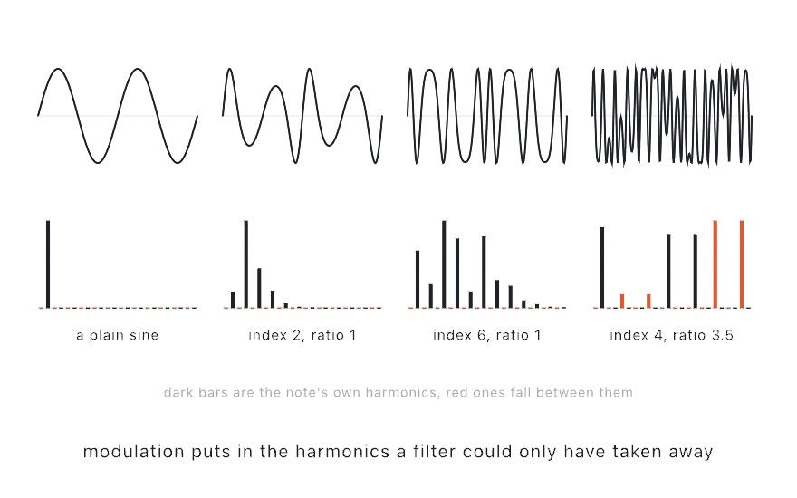
</picture>

Each column is one operator pushing another. The wave is on top, and below it is how much of the wave sits at each multiple of half the note's frequency. How hard one operator pushes is a number called the modulation **index**, labeled under each column. The plain sine has one bar and nothing for a filter to take. Turn the index up and a run of harmonics grows out of it, and the sine becomes brass. Move the ratio to 3.5 and some bars fall between the note's own harmonics, in red. Tones between the harmonics belong to no pitch in particular, which is the difference between a tone and a clang.

```swift
let bell = Patch.tone(.sine)
    .modulated(by: .tone(.sine, ratio: 3.5), amount: 4)

synth.voice = Voice(patch: bell, envelope: .percussive)
```

`amount:` is the index. Since each frequency is a ratio of the note, a patch is an instrument and not a chord. `Patch.bell`, the patch inside the `.fmBell` voice, uses 3.5 to sound like metal. The FM presets, `.fmBell`, `.fmBrass`, and `.fmBuzz`, are patches like this one. `Examples/Audio/Patching` puts the index and the ratio under your hand, with the patch drawn as it is wired.

A patch has at most eight operators, one of the fixed limits that come from the audio thread's rule in [A sketch that plays](#a-sketch-that-plays). A patch that would need more comes back unchanged and says so in the log. A patch with a piece silently missing would be a different instrument, and hearing that is harder than reading it.

### An instrument somebody recorded: sampled instruments

A **sampled instrument** starts from recordings of a real instrument instead of working the sound out. Use it when you want a piano to sound like a piano. The format most free libraries use is **SFZ**, a text file that lists which audio file answers which notes, with the audio files beside it. It is an open format that rgc:audio started and a community now maintains, and Ollin reads it from its published description.

```swift
synth.instrument = SampledInstrument.builtIn
synth.voice = Voice(sampled: Sampler(), envelope: .plucked)
synth.play("C4", for: 1.5)
```

`SampledInstrument.builtIn` is one small instrument Ollin carries, so you can hear this without downloading anything. It is a struck bar at five pitches, five semitones apart, made by a script rather than recorded from an instrument. Playing a note means finding the nearest recording and moving it to the note.

Moving it is the model, and also its limit. A recording plays at another pitch by being read faster or slower, which moves its pitch and its length *together*, the way a tape does. Move it far enough and the instrument audibly changes size: high notes go thin and hurried, and low ones slow and heavy. `Examples/Audio/Sampler` has a key that swaps the five recordings for one stretched over every note, so you can hear the difference. Full libraries ship hundreds of recordings for that reason, and why the nearest one is always chosen.

The recordings are set on the **synth**, and the `Voice` only says how to play them, for the reason in [A sketch that plays](#a-sketch-that-plays). Here `piano` is an instrument loaded from a file in your sketch's folder:

```swift
let piano = try? SampledInstrument(sfz: "Piano.sfz", in: .module)

// in setup():
synth.instrument = piano                                    // which recordings
synth.voice = Voice(sampled: Sampler(), envelope: .plucked) // how to play them
```

Where to find instruments, and their licenses, are on the [Synthesis](../Docs/Helpers/Synthesis.md#where-to-find-instruments) page. [VCSL](https://github.com/sgossner/VCSL) and [VSCO 2 Community Edition](https://versilian-studios.com/vsco-community/) are CC0, so you can do anything with them, including ship them. [Freesound](https://freesound.org/) sets a license per clip, from CC0 to attribution to non-commercial, so check each one. The [Philharmonia](https://philharmonia.co.uk/resources/sound-samples/) samples are free to make music with, but not free to pass on as a sampler instrument. Read their terms before you build on them.

### A wave you can draw: wavetables

An oscillator traces one shape, and a patch pushes a few shapes into each other. A **wavetable** is a third way: several one-cycle shapes, called frames, side by side. A note reads a blend of the two frames its position lands between. Use it for a held note that changes its whole shape as it sounds.

```swift
synth.wavetable = .basic                                     // sine, triangle, sawtooth, square
synth.voice = Voice(wavetable: WavetableScan(position: 0.4))
synth.play("C3", for: 2)
```

<picture>
  <source media="(prefers-color-scheme: dark)" srcset="Images/36-MakingSound/WavetableFrames-dark.jpg">
  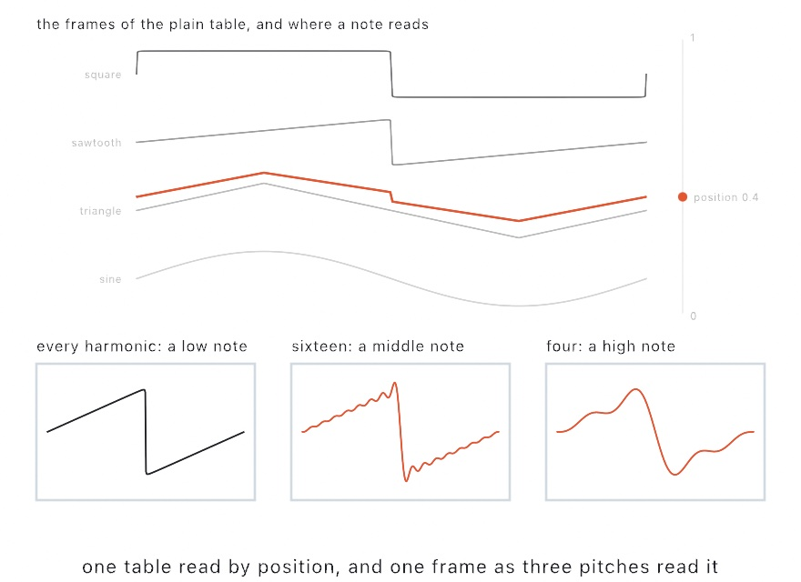
</picture>

The position runs up the stack, and the colored cycle is what a note at 0.4 reads: mostly triangle, a little sawtooth. Move the position and the wave changes shape, which an envelope and a filter can't do. A held note can travel that way:

```swift
synth.voice = .morph     // struck to the square end, settling back toward the sine
```

A `WavetableScan` carries the position, and a `sweep` with its own envelope moves it over the note. `.morph` starts at the first frame, jumps to the last as the note strikes, and slides most of the way back while it sounds. Give the sweep a slow attack instead, and a note opens up as it is held. `Examples/Audio/Wavetable` puts the position under the pointer and the sweep on a parameter, with the frames stacked on screen.

Like recordings, the table is set on the synth. Three come with Ollin. `.basic` is the four plain shapes, `.pulse` a square narrowing to a spike, and `.vowels` five mouth shapes a note sings through. Making your own takes a short rule. The rule gives the wave's value at each point of a cycle. `phase` runs 0 to 1 across one cycle, and `frame` runs 0 to 1 across the table:

```swift
synth.wavetable = Wavetable(name: "bend", frameCount: 8) { phase, frame in
    sin(.tau * pow(phase, 1 + 2 * frame))         // a sine bent harder in every frame
}
```

The bottom of the picture shows a quieter part of the design. A sawtooth has a sharp corner, and a sharp corner holds harmonics far above what a digital sound can carry. That limit is half the sample rate, the number of samples a second. Read too fast, those fold back down as a gritty ring that gets *worse* as the note goes up. So every frame is kept at eleven strengths, each with half the harmonics of the one before. A note reads the strongest one whose top harmonic still fits under the limit. The three panels are the same sawtooth as a low, a middle, and a high note read it. The corner softens, so the note stays clean. Every strength is built from the same harmonics, so nothing shifts when a note moves from one to the next.

### A sound in pieces: grains

A sampler reads a sound from one end to the other, so playing a recording a note higher makes it shorter. Pitch and length are one number. **Granular synthesis** takes them apart. Cut a few hundredths of a second out of a sound and give it an envelope so it doesn't click at either end. That piece is a **grain**. Play hundreds of grains a second and you hear the sound of the pile. Use it to hold one moment of a recording, or to crawl through a sound slower than it was recorded without changing its pitch. The idea is Dennis Gabor's, from 1947: any sound can be built from short pieces too brief to carry a pitch. Iannis Xenakis took it up as a composer, Curtis Roads made it a practical instrument, and Barry Truax first ran it in real time.

A granular voice has two clocks. The grains are read at whatever speed the note's pitch asks for. The place they are cut from travels at its own `speed`. Here a grain source is cut from one of the built-in bar's recordings:

```swift
synth.grainSource = GrainSource(recording: SampledInstrument.builtIn!.recording(at: 2, over: 0...127))
synth.voice = Voice(granular: GrainCloud(size: 0.08, density: 40, speed: 0))
synth.play("C4", for: 8)
```

`recording(at: 2, over: 0...127)` hands back the bar's third recording, counting from 0, set to answer every note from 0 to 127. The `!` is safe here because the bar ships with Ollin.

<picture>
  <source media="(prefers-color-scheme: dark)" srcset="Images/36-MakingSound/GrainClouds-dark.jpg">
  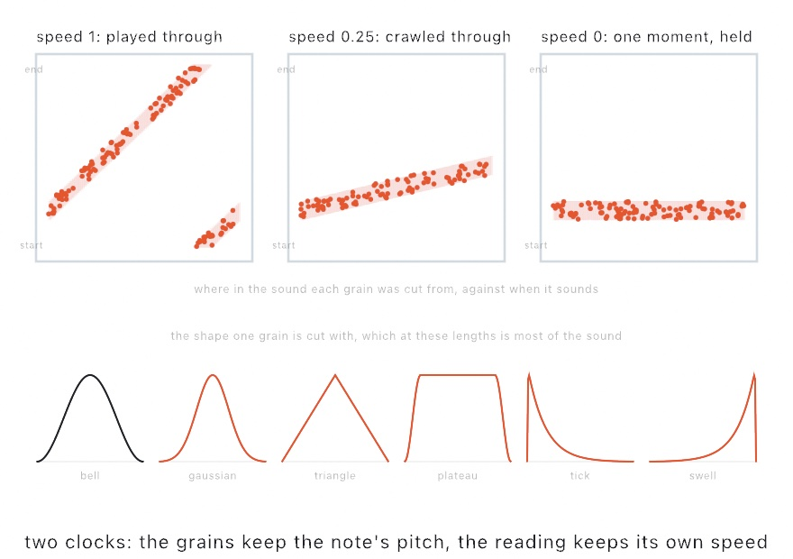
</picture>

Time runs across each panel, and the place in the sound a grain was cut from runs up it. At `speed: 1` the dots run diagonally, which is the recording playing as recorded. At 0.25 the same sound is crawled through at a quarter of the speed, and its pitch hasn't moved. At 0 the dots lie flat: the reading has stopped and the note hasn't. That last one holds one moment of a recording for as long as you like, which no other source in this chapter can do.

You can move the reading while the note sounds:

```swift
override func draw() {
    synth.grainScrub = mouseX / width         // drag the reading through the sound
}
```

`grainScrub` reaches notes that are already playing, the way `pressure` does, because it is read again every few milliseconds. Everything else about a cloud is read when the note begins.

The rest of a `GrainCloud` shapes the pile. `size` is how long one grain lasts. Under about 10 milliseconds a grain carries no pitch, and the cloud is pure texture. Over about 100 milliseconds, each grain is heard as a recognizable fragment. `density` is how many grains start each second. `positionJitter` is how far each one strays from the reading. A little of it keeps a dense cloud from sounding like one sound played very loudly. `pitchSpread` scatters the grains around the note, so an octave of it makes the cloud a chord of itself. `panSpread` spreads them from left to right, which is most of why a cloud sounds like a space rather than a point.

Two of those numbers need care.

**Loudness goes up with the square root of the density, not with the density.** Grains land on each other at random times, so what adds up is their power rather than their height. Four times as many grains is twice as loud. Any sounds that start independently add up the same way.

**`timingJitter` at 0 gives you a pitch you didn't ask for.** With no jitter, the grains arrive on a strict clock. If the reading is frozen, they all repeat the same piece of sound. The output then repeats `density` times a second, whatever the sound was. Set `density` to 220 and you hear an A, made from a recording of something else. You can play that as an instrument, and turning `timingJitter` up stops it.

The bottom row of the picture is the shape each grain is cut with, and at these lengths it is most of the character. `.bell` adds nothing of its own and is the default. `.plateau` is flat in the middle, so the middle of each grain is the sound as it was recorded. Use it for a cloud that should sound like its source. `.tick` is sharp at the front and gone, so a cloud of them is a rattle. `shape.level(at:)` hands the curve back, so you can draw the cut you chose.

Three presets come ready to play. `Voice.cloud` is a held moment spread wide, `Voice.smear` is the sound crawling past in pieces, and `Voice.rain` is short sharp grains one at a time. `Examples/Audio/Grains` draws the sound with the band the grains come from lit over it, and lets you drag that band by hand. The grain source, like a recording, is set on the synth, and the cut goes in the voice.

## Other effects: movement, levels, the spectrum, and one of your own

The workbench's chain uses a chorus, a delay, a drawn room, and a limiter. The chorus and the limiter each belong to a family of effects. Two more kinds follow them: effects that work on the spectrum, and an effect you write yourself. Each goes in `synth.effects` the same way, anywhere in the chain.

### Something that moves: chorus, flanger, phaser, tremolo

These effects move a sound. Each has one slow wave inside it and something that wave moves. The wave's `rate`, in cycles per second, and its `depth` are the two settings they share. Use them to make a held sound shimmer, sweep, or pulse. Ollin writes each from its standard technique.

<picture>
  <source media="(prefers-color-scheme: dark)" srcset="Images/36-MakingSound/Movement-dark.jpg">
  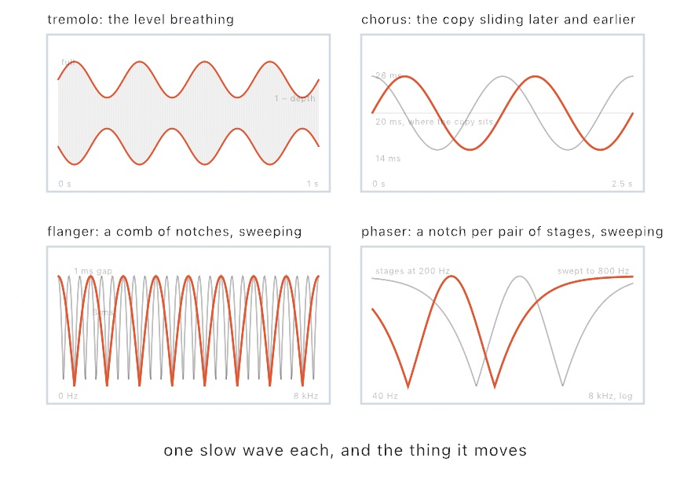
</picture>

```swift
synth.effects = [.chorus(Chorus(rate: 0.8, depth: 0.5))]
synth.effects = [.flanger(Flanger(rate: 0.25, depth: 0.7, feedback: 0.5))]
synth.effects = [.phaser(Phaser(rate: 0.4, stages: 4))]
synth.effects = [.tremolo(Tremolo(rate: 4, depth: 0.7))]
```

A **tremolo** moves the level. It rises and falls with the wave, from full down to whatever `depth` leaves, and nothing else changes. It is the plainest of these, and the one guitar amplifiers had a knob for. Set `spread` to 1, and the left and right sides breathe in turn, so the sound swings from side to side.

A **chorus**, from the workbench's chain, moves a copy of the sound, as [After the note](#after-the-note-the-effects-chain) describes. Voices that never quite agree sound like several, the way a choir does. The two sides slide a quarter of a cycle apart, so a chorus is wide by itself.

A **flanger** brings the same copy in close, a millisecond or so behind. That close, you no longer hear a second voice. The copy and the original cancel wherever the gap is half a wavelength, or one and a half, or two and a half. That cuts a row of gaps, called **notches**, through the spectrum like the teeth of a comb. The wave sweeps the gap, so the comb sweeps, and you hear a jet-plane whoosh. `feedback` sends the copy back to be copied again, which sharpens the teeth, and a negative value turns the comb inside out.

A **phaser** makes fewer notches, in a different way. The sound goes through a row of stages that each shift the timing of its frequencies, its **phase**, without touching its level. Added back to the original, the shifted parts cancel at one frequency for every two stages. The wave sweeps those notches up and down the spectrum. Four stages give two notches, the usual count, and the result is a softer swirl than the flanger's.

None of these adds a new sound. Each is the sound with a copy of itself, or the sound with a wave on its level. So a chorus, flanger, or phaser with a `mix` of 0 is the plain sound, and so is a tremolo with a `depth` of 0. Turn a setting while the sound plays and the motion carries on from where it was. [`Examples/Audio/Movement`](../Examples/Audio/Movement/Sketch.swift) plays one phrase through each of the four, with every setting on a parameter and the wave drawn over the trace.

### Something that holds a level: compressor, limiter, gate

These effects watch how loud a sound is and act on the level. Use them to even out a phrase, keep a pile of echoes from clipping, or clear hiss from the gaps between notes. All three follow the feed-forward design of Dimitrios Giannoulis, Michael Massberg, and Joshua Reiss, from 2012.

<picture>
  <source media="(prefers-color-scheme: dark)" srcset="Images/36-MakingSound/Levels-dark.jpg">
  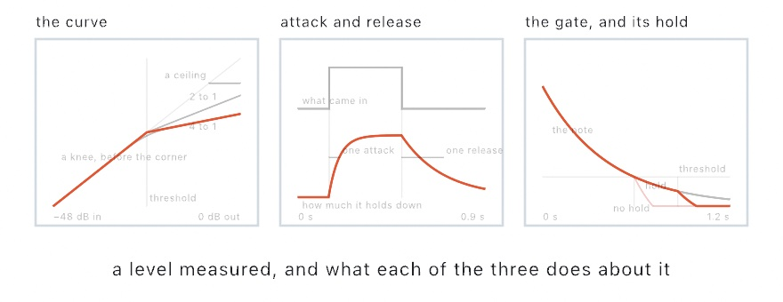
</picture>

```swift
synth.effects = [.compressor(Compressor(threshold: -18, ratio: 4, makeupGain: 6))]
synth.effects = [.gate(Gate(threshold: -40, hold: 0.08)), .limiter(Limiter())]
```

Every threshold here is in **decibels** below full scale, where 0 is as loud as a sample can be. A level you would mix at sits somewhere under -12, and a difference of 6 decibels halves or doubles the level.

A **compressor** works on what is over its `threshold`. A `ratio` of 4 means that four decibels over the line come out as one. The first panel shows the curve: below the threshold nothing happens, and above it the curve tilts. The result is a sound with a narrower range of loudness, which is why `makeupGain` matters. It brings everything back up with the loud parts still held. A `knee` bends the corner, so the holding starts before the threshold, and it makes a compressor harder to hear working.

`attack` and `release`, in the second panel, are how long the holding takes to come on and how long it takes to let go. A fast attack catches the very front of a note, where a plucked or struck sound has most of its level. A slow release keeps holding through the notes after a loud one, so a phrase breathes together. Neither is right. They are the difference between a phrase that keeps its shape and one that pumps, rising and falling in level with every loud note.

A **limiter**, from the workbench's chain, lets nothing leave above its `ceiling`, whatever arrives. It turns the level down the instant a peak arrives. So a single loud note lowers the sound around it for a `release` instead of clipping.

A **gate** works on what is under its threshold, and turns it down by `depth`. It takes hiss, hum, and room noise out of the gaps between notes. A decaying note passes under the threshold long before it is finished, so `hold` keeps the gate open for a while after the level drops. The third panel is a note with the hold and without it, and the one without is missing its tail.

The level is read from both sides at once. A loud note on one side lowers the other with it, so the sound stays where you placed it between left and right. Turn a setting while it plays and the gain carries on from where it is. One trick is missing. Ducking one sound under another needs a detector on one instrument listening to a different one, and each `Synth` runs its own engine. [`Examples/Audio/Levels`](../Examples/Audio/Levels/Sketch.swift) plays a phrase with accents through each of the three. The threshold is drawn across the meter, so you can watch the accents meet it.

### Something that takes the sound apart: pitch shift, freeze, stretch

Movement and level effects work on the sound as a wave. These take it apart first, into its **partials**, the separate frequencies a sound is made of. The tool is called a **phase vocoder**. It reads the sound in slices of about forty milliseconds and turns each slice into its partials, each with a level and an exact frequency. Then it puts them back together, moved or held. Use these to move a pitch without changing its length, or to hold one instant as long as you like. James Flanagan and Roger Golden built the phase vocoder at Bell Labs in 1966. Mark Dolson's 1986 tutorial made it something a musician could run. Ollin keeps each partial whole while it moves it, the way Jean Laroche and Mark Dolson described in 1999.

<picture>
  <source media="(prefers-color-scheme: dark)" srcset="Images/36-MakingSound/Spectral-dark.jpg">
  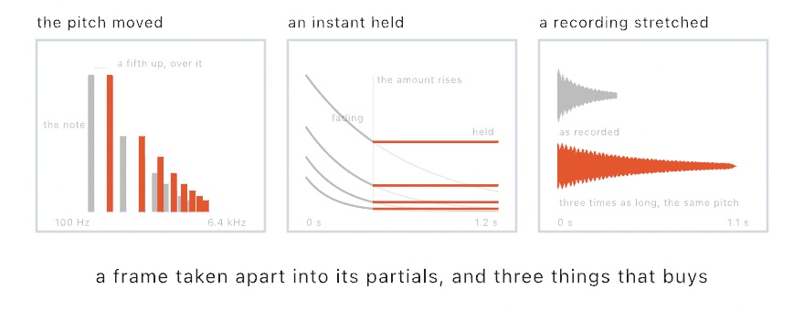
</picture>

The first two are effects in the chain. The stretch is done once to a recording, here the built-in bar's first one:

```swift
synth.effects = [.pitchShift(PitchShift(semitones: 7, mix: 0.5))]
synth.effects = [.freeze(Freeze(amount: mouseIsPressed ? 1 : 0))]
let bar = SampledInstrument.builtIn!
let slow = bar.recording(at: 0, over: 0...127).stretched(by: 3)
```

A **pitch shift** moves the pitch and leaves the length. A recording played an octave down in a sampler lasts twice as long, because pitch and length are one control on a tape. Here they are two, so a chord shifted a fifth up, seven semitones, still ends when it ended. With `mix` under 1, the original plays under the moved copy, which is called a harmonizer. The first panel shows the partials of a note, and the same partials a fifth higher over them.

A **freeze** holds an instant. The moment `amount` rises above 0, the spectrum of whatever is sounding is caught. That instant then plays for as long as the amount stays up. A struck chord becomes a held pad. The second panel is a note fading until the freeze, and then not fading at all. The amount is also the blend, so a freeze can be eased in, and back at 0 the instant is let go.

A **stretch** does the same kind of work once, to a recording. `stretched(by: 3)` gives a recording three times as long at the same pitch. It changes the length, so it is done in `setup()`, and a sampler plays the result like any other recording. To play `slow`, make it an instrument: `synth.instrument = SampledInstrument(name: "slow", recordings: [slow])`. The third panel is a struck recording and the same recording stretched, on one time axis.

These have two limits. The pitch shift and the freeze arrive one slice late, about forty milliseconds. That is short enough for a phrase and long enough to blur the start of a drum. And a pitch shift moves every partial up together, including the ones that give a voice its character. So a voice an octave up sounds like a small voice rather than a high one. [`Examples/Audio/Spectral`](../Examples/Audio/Spectral/Sketch.swift) puts all three behind a parameter, with the freeze on the mouse.

### An effect nobody wrote for you: custom effects

One more kind of effect is a closure you write. Use it for an effect Ollin doesn't ship, such as a wavefolder, a crush, or a wobble of your own:

```swift
synth.effects = [
    .custom("fold") { sound in
        for i in 0..<sound.frameCount {
            sound.left[i] = sin(sound.left[i] * 4)
            sound.right[i] = sin(sound.right[i] * 4)
        }
    },
    .reverb(Reverb(.hall, mix: 0.3)),
]
```

The sound reaches the speakers in **blocks**, a few hundred samples at a time. The closure is handed each block on its way and rewrites its samples in place, and that is all an audio effect does. This one is a wavefolder: push a sample past the top and it comes back down. That fills a plain tone with harmonics no filter could put there. `sound.left` and `sound.right` are the two channels, and `sound.frameCount` is how many samples each holds in this block. `sound.sampleRate`, the samples per second, lets you turn a frequency into a step per sample, and `sound.time` is a clock for anything that moves. The effect sits anywhere in the chain, so the reverb above hears the folded sound, and it reaches an export like every other effect.

The closure runs on the audio thread, under the rule from [A sketch that plays](#a-sketch-that-plays). It also can't write into a variable it captured from the sketch. So an effect that has to remember something between blocks takes its memory as `state:` and gets it back on every block. A filter, an envelope follower, or an echo of your own carries itself from block to block that way.

`Examples/Audio/Shaping` is three of these behind one parameter. They are a wavefolder, a crush that remembers each held sample in `state:`, and a wobble that breathes on `sound.time`. The sound going in is drawn dim, and the sound coming out bright.

## A note under the finger: expression

The workbench plays each note as a whole, struck, plucked, or bowed, and the synth's `pressure` reaches every bowed note at once. A note can also be shaped on its own while it sounds.

A keyboard's pitch wheel bends every note at once. A finger on a polyphonic-expression controller, such as a Seaboard or a LinnStrument, bends one note, presses into it, and slides along its key. The notes beside it are left alone. This is MIDI Polyphonic Expression, or **MPE**, a part of the MIDI standard. MIDI sends its messages on sixteen **channels**, separate lanes on one connection, and MPE gives each note a lane of its own. Use it for a sketch played on such a controller, or for any note you want to shape while it sounds.

`noteOn` hands the note back. Hold on to it, and you can tell that one note three things while it sounds:

```swift
let synth = Synth(.pad)
var note: PlayingNote?

override func mousePressed() { note = synth.noteOn("C4") }
override func mouseReleased() { if let note { synth.noteOff(note) } }

override func draw() {
    guard let note else { return }
    synth.bend(note, semitones: (mouseX / width - 0.5) * 4)   // across the window, two semitones each way
    synth.slide(note, 1 - mouseY / height)                    // up opens the filter
    synth.press(note, 0.8)
}
```

<picture>
  <source media="(prefers-color-scheme: dark)" srcset="Images/36-MakingSound/Expression-dark.jpg">
  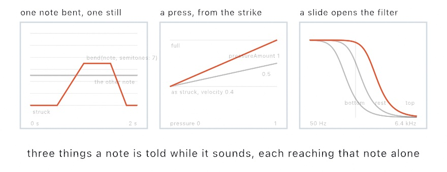
</picture>

`bend` moves the pitch, and every source but the struck body follows it. A grain cloud's bend reaches only the grains that start after it. The string is cut to a new length while it rings, and so is the tube. A recording is read faster, and a wavetable and a patch run faster. The struck body holds its pitch, because its tones were decided by the strike, the way a rung bell can't be retuned.

`press` is the note's own bow or breath on the cello and the clarinet. On a recording it does nothing, since a sampled instrument's recordings already carry their loudness. On the other sources it raises the note from the level it was struck at toward full, by the voice's `pressureAmount`.

`slide` opens the filter above the middle of the key and closes it below, by the filter's `slideAmount`, an octave each way by default. Each of the three glides over a few milliseconds, so a value handed over every frame moves the note smoothly.

A controller that speaks MPE puts each note on a channel of its own. `MIDIInput`, from `OllinMIDI`, reads it back as `heldNotes`, every held note with its bend, its pressure, and its slide already sorted out. Each held note has an `id` that stays with it while it is held, and its MIDI note number as `note`. Its `velocity` is how hard the key was struck, from [Chapter 35](35-ControlsAndSignals.md#parameters-from-anywhere-midi-and-osc). The wiring from there is a dozen lines. Start each note as it appears, let it go as it leaves, and hand each held note its three values every frame. `playing` is a dictionary from each held note's `id` to the note the synth is playing for it:

```swift
import OllinMIDI

let synth = Synth(.pad)
let midi = MIDIInput()
var playing: [Int: PlayingNote] = [:]

override func setup() { try? midi.start() }

override func draw() {
    let held = midi.heldNotes
    for note in held where playing[note.id] == nil {
        playing[note.id] = synth.noteOn(Pitch(Double(note.note)), velocity: note.velocity)
    }
    for (id, note) in playing where !held.contains(where: { $0.id == id }) {
        synth.noteOff(note)
        playing[id] = nil
    }
    for note in held {
        guard let sounding = playing[note.id] else { continue }
        synth.bend(sounding, semitones: note.pitchBend)
        synth.press(sounding, note.pressure)
        synth.slide(sounding, note.slide)
    }
}
```

The same read works on a plain keyboard. There the wheel and the **aftertouch**, pressure on keys already held down, belong to every note on the channel. The wiring doesn't care what is plugged in. [`Examples/Audio/Expression`](../Examples/Audio/Expression/Sketch.swift) is a surface the mouse plays through a virtual MIDI source. A bend from the mouse crosses Core MIDI the way a controller's does. A controller plugged in joins the same picture, and switching its `bowed` parameter on makes pressure the bow.

## Where this comes from

The plucked string is Kevin Karplus and Alex Strong's algorithm (1983). Averaging a wavetable's samples as it played turned a burst of noise into a plucked string. David Jaffe and Julius Smith published the extensions the same year. Ollin implements their version, tuned by an allpass filter and plucked at a position.

Hearing a shape has a famous question behind it, Mark Kac's 1966 "Can one hear the shape of a drum?". The answer is not always, since two different outlines can ring the same, but you can hear a great deal of a shape. Working the frequencies out from the outline is modal synthesis. Jean-Marie Adrien set it out for sound, and Kees van den Doel and Dinesh Pai developed it for struck objects. The bowed string and the blown tube are digital waveguides, the technique Julius O. Smith III developed. The bow's grip on the string comes from Michael McIntyre, Robert Schumacher, and James Woodhouse, who described how instruments oscillate in 1983.

Playing a sound through a recorded room is convolution. It was too slow to be useful until Thomas Stockham showed in 1966 that the fast Fourier transform made it quick. [Chapter 34](34-Listening.md#where-this-comes-from) credits that transform. William Gardner worked out in 1995 how to do it with no delay at all. The first stretch of the room runs directly and the rest through the transform, and Ollin uses that arrangement. The entries after the workbench name their own sources. Full credits are in the project's [attribution notes](../ATTRIBUTION.md).

## Go deeper

- [Synthesis](../Docs/Helpers/Synthesis.md): `Synth`, pitches, the `Voice` presets and what is inside one, envelopes, filters, delay and reverb, [a room of your own](../Docs/Helpers/Synthesis.md#a-room-of-your-own), [the four that move](../Docs/Helpers/Synthesis.md#the-four-that-move), and the effects chain.
- [Expression](../Docs/Helpers/Synthesis.md#expression): one note bent, pressed, or slid on its own, where each value goes on each source, and [reading a polyphonic-expression controller](../Docs/Integration/MIDI.md#per-note-expression-mpe).
- [The two that work in the spectrum](../Docs/Helpers/Synthesis.md#the-two-that-work-in-the-spectrum): the pitch shift and the freeze, what a frame late means, and [stretching a recording](../Docs/Helpers/Synthesis.md#stretching-a-recording).
- [Patches](../Docs/Helpers/Synthesis.md#patch): what an operator is, the named patches, and why eight.
- [Sampled instruments](../Docs/Helpers/Synthesis.md#sampled-instruments): loading an SFZ instrument, what a recording being moved costs, and where to find instruments you are allowed to ship.
- [Wavetables](../Docs/Helpers/Synthesis.md#wavetables): the built-in tables, making one from harmonics, drawn cycles, or a rule, and why a high note reads a softer copy.
- [Grains](../Docs/Helpers/Synthesis.md#grains): every cloud setting in turn, the six shapes, where a sound can come from, and what a strict clock and a full pile do.
- [Physical models](../Docs/Helpers/Synthesis.md#physical-models): all four models, their settings, why the tuning is exact, and how a shape is measured for its modes.
- [Recording](../Docs/Output/Recording.md): keeping a take while you play, with the sound of every instrument the sketch holds mixed into the file.
- Appendix B draws the idea this chapter rests on: [Sound as numbers](B-JustEnoughMath.md#sound-as-numbers).
- Worked examples, in [`Examples/Audio/`](../Examples/Audio/): `Synth` (a playable keyboard), `Strings`, `StruckShapes`, `Bowing`, `Rooms` (five rooms drawn from rules), `Patching` (the patch drawn as it is wired), `Sampler`, `OwnSampler` (an instrument made from your own `.sfz`), `Wavetable` (a row of cycles read by position, the frames stacked on screen), `Grains`, `Movement`, `Levels`, `Spectral` (the pitch moved, an instant held, a recording stretched), `Shaping` (three effects of your own), and `Expression` (a surface where each note is bent, pressed, and slid on its own).

---

[Contents](README.md#contents) · Previous: [Chapter 35, Controls and signals](35-ControlsAndSignals.md) · Next: [Chapter 37, Music by rule](37-MusicByRule.md)
