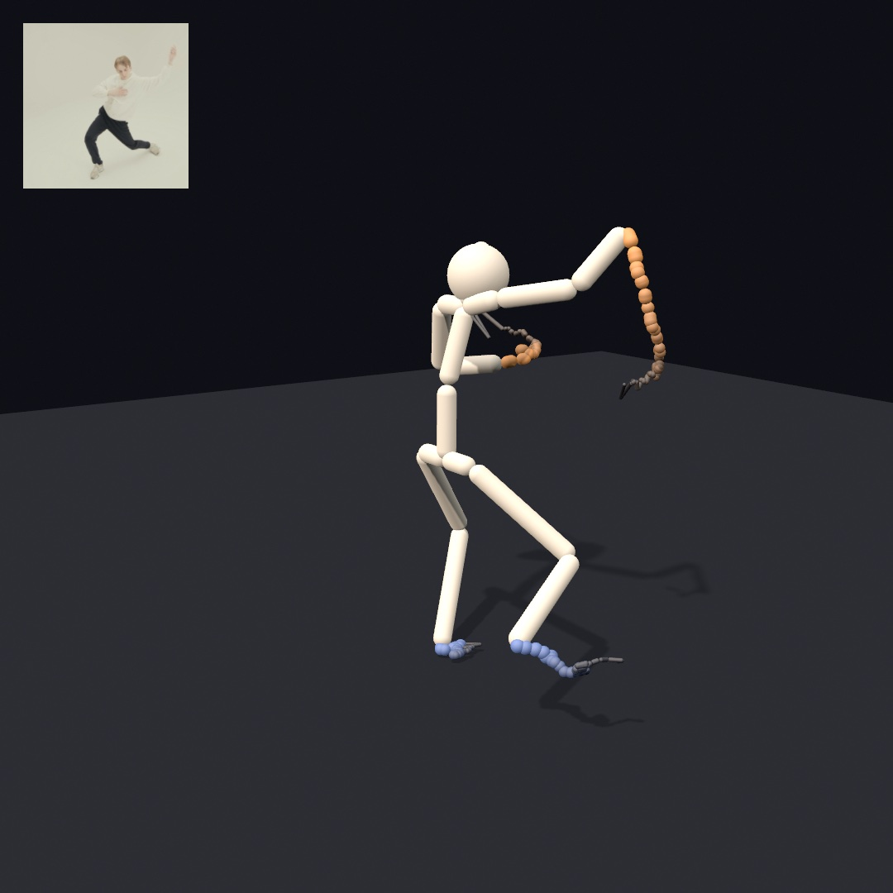
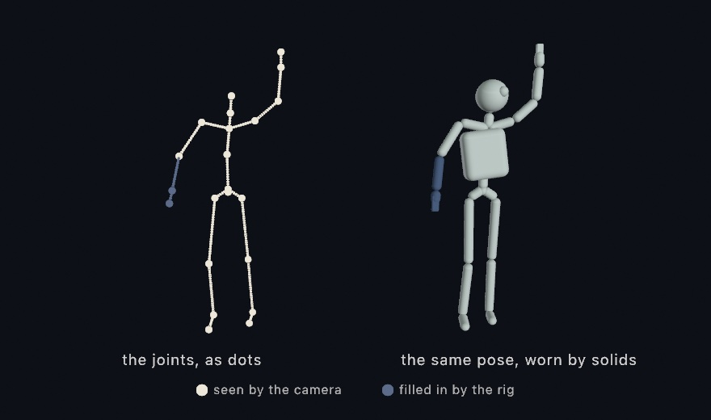
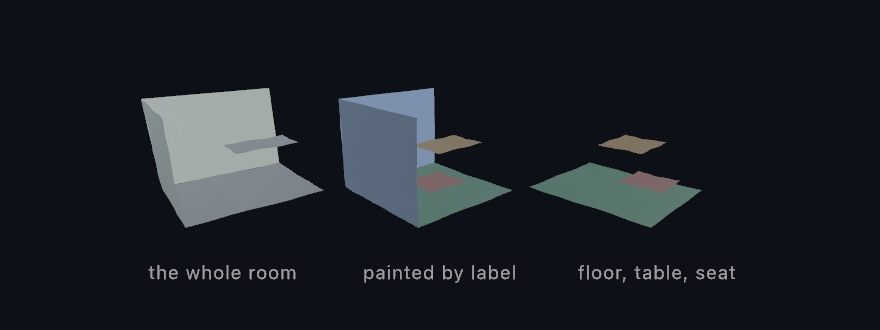
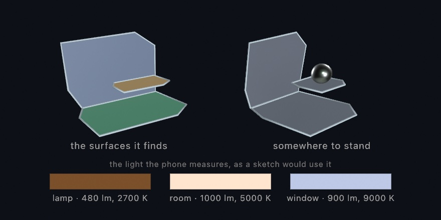
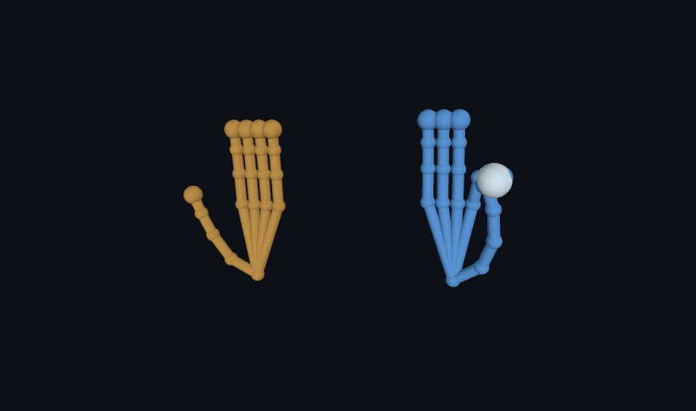
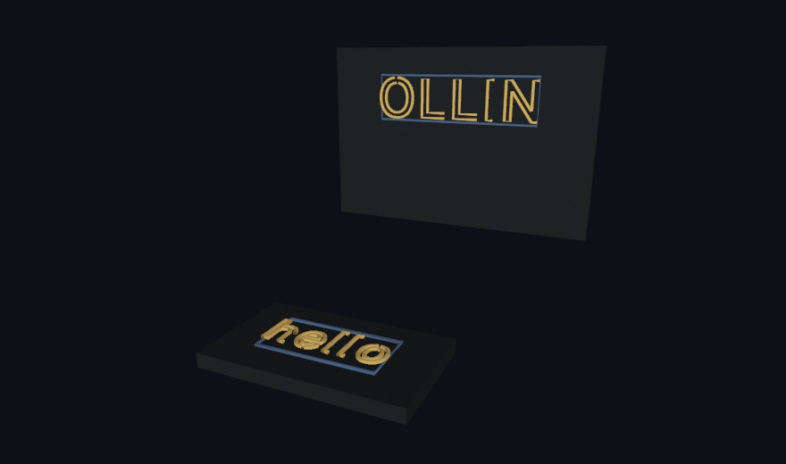
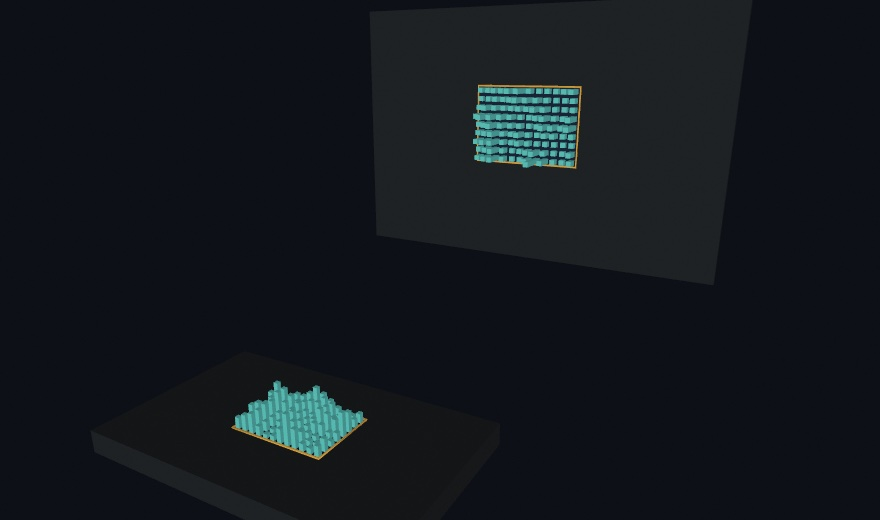
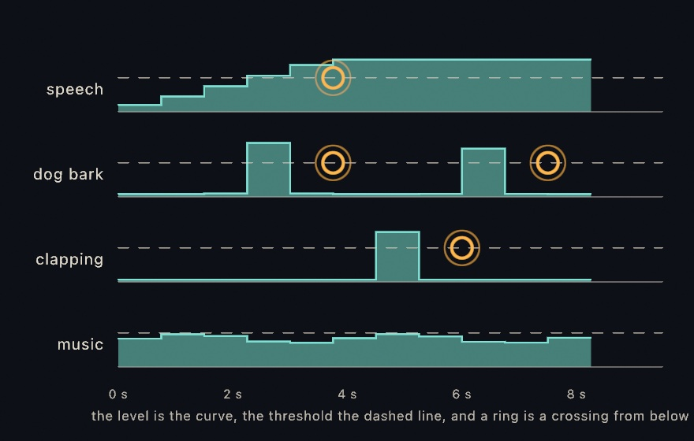

#### <sup>[Ollin](../README.md) → [Guide](README.md) → Chapter 36</sup>

---

# 36. The iPhone as a sensor



An iPhone carries a depth sensor, cameras, microphones, a touch screen, and a barometer, and it can stream what each senses to your sketch. Here you connect the phone, as depth footage or through its capture app, and the app reads a person as a skeleton in meters. The dancer at the top dresses that skeleton in solids, and it reads a film that ships with Ollin when no phone is connected. After it come the phone's other streams: the room, hands and a gaze, what its picture shows, and the phone in your hand.

## The real sensors: a recorded clip, a live stream, and the capture app

[Chapter 35's ghost room](35-Depth.md#putting-it-together-the-ghost-room) ran on a pretend camera, and so did the marbles, the long scans, and the rebuilt room after it. Every call they made takes a real depth frame as well. So their code stays the same, and only the source of the frames changes.

### Depth footage: Record3D clips and the live stream

The gentlest start is a **recorded clip**. Record3D, Marek Šimoník's iPhone app, records LiDAR or TrueDepth footage into `.r3d` files. Ollin opens them directly, every frame an `RGBDFrame`. A clip is for depth footage you edit against, re-render, and export the same way every time:

```swift
import Ollin
import OllinRecord3D

final class Replay: Sketch {
    var scan: Record3DRecording?

    override func setup() {
        scan = try? Record3DRecording(path: "/path/to/scan.r3d")
    }

    override func draw() {
        background(Color(white: 0.04))
        guard let scan, scan.frameCount > 0 else { return }
        let i = Int(time * scan.frameRate) % scan.frameCount
        guard let cloud = try? scan.pointCloud(at: i) else { return }
        camera(.orbiting(target: Vector3(0, 0, -1.5), radius: 2.5,    // in front of the lens
                         azimuth: time * 0.3, elevation: 0.2))
        drawPointCloud(cloud)
    }
}
```

Depth footage like this is what volumetric filmmaking works with. The same app also streams **live over USB**. Turn on USB streaming in the app's settings and plug the phone in. Call `start()` on a `Record3DDevice`, and keep the app on its live screen. The device then delivers `latestFrame` continuously, so the person in front of the phone becomes a live point cloud in your sketch.

### Ollin's own app: Ollin Capture

**Ollin Capture** is Ollin's own iPhone app. It runs **ARKit** on the phone, Apple's framework for placing a phone in the room it sees. It streams typed results the sketch reads like any other input. ARKit's **world tracking** follows where the phone is and which way it points as you move it, which is the pose a scan needs. The app is for the live phone as a whole sensor array. It sends a 3D **body skeleton** and up to three **faces**, each a deforming mesh plus 52 expression values called **blendshapes**. It sends up to four **hands**, each a 21-joint skeleton. There is also rear-LiDAR **world depth** with the camera's own pose, and **device motion**. A **person segmentation** matte comes from the rear camera, or mirrored from the front like a selfie:

```swift
import OllinPhone

let device = PhoneDevice()
device.start()                  // in setup()
// …in draw():
device.latestBody               // a skeleton in meters
device.latestFrame              // an RGBDFrame from the LiDAR
device.latestPose               // where the phone is, and which way it looks
```

The depth and the pose land in the types [Chapter 35](35-Depth.md) used, and the sketch never knows which sensor filled the frame. The `3D/Phone/PhoneWorldScan` example sweeps a room with `latestFrame` and `latestPose` in place of the pretend camera.

On the phone, the app runs one of these streams at a time, as a **mode** you tap by name on its screen. Two switches, Hear and Air, run beside whichever mode is on. The app is built onto the phone from its Xcode project, since an iOS app cannot run from `swift run`. It needs an iPhone with an A12 chip or later on iOS 17 or later. The LiDAR streams need a Pro model, and the face and gaze streams the front TrueDepth camera. The [Record3D](../Docs/3D/Record3D.md) and [Phone](../Docs/3D/Phone.md) references cover the setup, and the `3D/Depth` and `3D/Phone` example groups are live starting points for each stream.

## A pose you can dress in solids: the body

Of everything the app sends, the finished sketch reads one stream, the body. [Chapter 34](34-Seeing.md#the-body-as-a-controller-hands-faces-and-bodies)'s `BodyTracker3D` estimated a person in meters from a flat picture. The phone's version comes from ARKit's body tracking, which runs on the phone and estimates the person's size, as `scaleFactor` reports.

`latestBody` is more than dots. Every joint arrives with an orientation beside its position, so a solid part can sit at a joint and turn with it. It is for a figure you dress in solids that follows a person around the room. `modelTransform(_:)` composes a joint's position and orientation into one pose, and `transform(_:)` puts that pose onto the transform stack in a single call. Draw a capsule between each pair of joints with `drawCapsule(from:to:radius:)`, and the skeleton grows bones you can light.



In `draw()`:

```swift
if let body = device.latestBody {
    for (a, b) in body.bones() {
        drawCapsule(from: a, to: b, radius: 0.03)
    }
    if let pose = body.modelTransform(.head) {
        withState { transform(pose); drawSphere(radius: 0.11) }
    }
}
```

`bones()` gives the skeleton as pairs of points in meters. They are measured from the pelvis, which the stream calls the root, with y pointing up and z toward the camera.

The camera never saw the blue forearm's joints. ARKit's rig, the standard skeleton it fits to a person, filled them in, and `isObserved(_:)` says so, part by part. Two more readings come with it. `scaleFactor` sizes the figure to the person in front of the camera. And `worldTransform` stands the skeleton where the person is, in the same ARKit world as a swept cloud and [the room mesh](#a-surface-the-phone-already-built-the-room-mesh). Walking across the room walks the figure across the sketch. The `3D/Phone/PhoneBodyFigure` example runs it live, a mannequin that follows you around the room.

### When no phone is streaming: the film

The finished sketch should also run on a Mac with no phone attached. The same `BodyTracker3D` reads a body from any feed, and a playing film is a feed. `SampleClip.dance` is the film that ships with Ollin, one dancer in front of a camera that never moves, as [Chapter 34](34-Seeing.md#when-there-is-no-camera-stills-and-footage) showed:

```swift
let film = try! VideoPlayer(url: SampleClip.dance.url)   // the clip ships with Ollin
lazy var tracker = BodyTracker3D(film)
// in setup(): film.loops = true, then film.play()
```

The `bones()` of `tracker.body` come in nearly the same shape as the phone's. They are pairs of points in meters, measured from the pelvis, with y up. One direction differs. The film's model counts z away from the camera, and the phone's counts z toward it. Turn z around and the two agree:

```swift
if let body = tracker.body {
    for (a, b) in body.bones() {
        drawCapsule(from: Vector3(a.x, a.y, -a.z), to: Vector3(b.x, b.y, -b.z), radius: 0.03)
    }
}
```

The two skeletons differ in smaller ways too. The tracker places 17 joints to the phone's 22. A sketch reads `.centerHead` for `.head`, a wrist for a hand, and an ankle for a foot. The film's body carries no orientations, so `modelTransform(_:)` has no twin. And its figure is an estimate. It assumes a standard height, and it takes its up direction from the film's camera rather than from gravity. So a foot can hang above the floor while the other one stands on it.

## Putting it together: the dancer in solids

The finished sketch is the dancer at the top of the chapter. It reads a body from the phone while one streams and from the film when none does, and it draws both the same way. Each bone becomes a lit capsule on a floor. A trail follows each hand and foot, and the camera circles slowly. It puts together the capture app's `PhoneDevice`, the body, and the film in the phone's place. Make `MySketches/SolidDancer.swift`:

```swift
import Ollin
import OllinPhone
import OllinSamplePhotos
import OllinVideo
import OllinVision

final class SolidDancer: Sketch {
    let device = PhoneDevice()
    let film = try! VideoPlayer(url: SampleClip.dance.url)   // the clip ships with Ollin
    lazy var tracker = BodyTracker3D(film)

    let bodyColor = Color(hex: 0xEDE7DA)
    let handColor = Color(hex: 0xF2A65A)
    let footColor = Color(hex: 0x6C8CD5)
    let floorColor = Color(hex: 0x23262E)

    // Where each hand and foot has been, oldest first:
    // left hand, right hand, left foot, right foot.
    var trails: [[Vector3]] = [[], [], [], []]

    override func setup() {
        device.start()                     // the phone, if one is streaming
        film.loops = true
        film.play()
    }

    override func draw() {
        background(Color(hex: 0x0E1016))
        camera(.orbiting(target: Vector3(0, 0.85, 0), radius: 4.4,
                         azimuth: 0.9 + time * 0.12, elevation: 0.22,
                         fieldOfView: .pi / 4.5))
        lightingPreset(.studio)
        castShadows()

        material(.matte)
        fill(floorColor)
        drawPlane(width: 12, depth: 12)

        // The phone's body when a phone streams, the film's otherwise.
        var person: Person?
        var fromFilm = false
        if let body = device.latestBody {
            person = Person(body)
        } else if let body = tracker.body {
            person = Person(body)
            fromFilm = true
        }
        guard let person else { return }

        // Stand the figure on the floor: lift it until its lowest point
        // sits one capsule radius above y = 0.
        let radius = 0.035
        var lowest = 0.0
        for (a, b) in person.bones { lowest = min(lowest, a.y, b.y) }
        let up = Vector3(0, radius - lowest, 0)

        fill(bodyColor)
        for (a, b) in person.bones {
            drawCapsule(from: a + up, to: b + up, radius: radius)
        }
        withState {
            translate(person.head + up)
            drawSphere(radius: 0.11)
        }

        // Each hand and foot leaves a trail that thins and fades with age.
        for (i, end) in person.ends.enumerated() {
            let p = end + up
            if let last = trails[i].last, last.distance(to: p) < 0.002 { continue }   // it barely moved
            trails[i].append(p)
            if trails[i].count > 36 { trails[i].removeFirst() }                       // keep the newest 36
        }
        for (i, trail) in trails.enumerated() {
            let color = i < 2 ? handColor : footColor
            for k in 1 ..< trail.count {
                let t = Double(k) / Double(trail.count)      // near 0 oldest, 1 newest
                fill(Color.mix(floorColor, color, t))
                drawCapsule(from: trail[k - 1], to: trail[k], radius: 0.006 + 0.018 * t)
            }
        }

        // The flat film the dancer is read from, in the corner.
        if fromFilm {
            drawFrame(film, in: Rectangle(x: 28, y: 28, width: 200, height: 200))
        }
    }
}

// One body from either source, in the phone's terms: meters, the root at
// the origin, y up, and z toward the camera.
struct Person {
    var head: Vector3
    var ends: [Vector3]                 // left hand, right hand, left foot, right foot
    var bones: [(Vector3, Vector3)] = []

    init?(_ body: PhoneBody) {
        guard let head = body.position(.head),
              let leftHand = body.position(.leftHand),
              let rightHand = body.position(.rightHand),
              let leftFoot = body.position(.leftFoot),
              let rightFoot = body.position(.rightFoot)
        else { return nil }
        self.head = head
        ends = [leftHand, rightHand, leftFoot, rightFoot]
        bones = body.bones()
    }

    init?(_ body: Body3D) {
        // The film's body counts z away from the camera, and the phone's
        // counts it toward the camera. Turning z around makes them agree.
        func facing(_ p: Vector3) -> Vector3 { Vector3(p.x, p.y, -p.z) }
        guard let head = body.position(.centerHead),
              let leftHand = body.position(.leftWrist),
              let rightHand = body.position(.rightWrist),
              let leftFoot = body.position(.leftAnkle),
              let rightFoot = body.position(.rightAnkle)
        else { return nil }
        self.head = facing(head)
        ends = [facing(leftHand), facing(rightHand), facing(leftFoot), facing(rightFoot)]
        for (a, b) in body.bones() {
            bones.append((facing(a), facing(b)))
        }
    }
}
```

> **Swift note.** `init?` is an initializer that can fail. It gives back `nil` when a joint it needs is missing, so `Person(body)` is an optional. `Person` has two of them, one for each kind of body, and Swift picks the one that matches the argument's type. `facing` is a function declared inside the second one, so only that initializer can call it.

Here is what each part does:

- **Two sources, one shape.** `device.latestBody` answers only while a phone streams, so the sketch asks it first and falls back on `tracker.body`. `Person` turns either body into bones, a head, and four ends, in the phone's terms. So everything after the `guard` draws one kind of thing. `fromFilm` remembers which source answered, and only the film gets a corner.
- **Standing on the floor.** Both skeletons are measured from the pelvis, so the feet sit below zero. The loop finds the lowest point of any bone, and `up` lifts the whole figure until that point sits one capsule radius above the floor. The lift is worked out again every frame, so whichever foot is lowest is the one that stands.
- **The body.** Each bone is a capsule and the head is a sphere, in a matte finish under [the studio preset](26-3DGently.md#light-presets-and-the-kinds-of-light). `castShadows()` lays their shadows on the floor. The camera starts about 50 degrees to the side of the film's view and turns slowly. So you see the dancer from sides the film never showed.
- **The trails.** Each hand and foot keeps its newest 36 positions, and skips a frame when it has barely moved. Each step of a trail is a short capsule, thicker toward the newest end. `Color.mix` from [Chapter 2](02-Color.md#mixing-you-can-trust) fades it into the floor's color as it ages.
- **The corner.** `drawFrame(film, in:)` draws the film the figure is read from, so the flat picture and the figure sit side by side.

Then make it yours:

- Read yourself instead of the film. Declare `let webcam = Camera()`, call `try? webcam.start()` in `setup()`, and build the tracker on `webcam`. Draw `webcam` in the corner too, and [Chapter 34](34-Seeing.md#the-webcam-is-an-image)'s webcam takes the film's place.
- Keep more of the dance. Change the 36 to 600, and each trail holds a much longer stretch of the movement behind it.
- Turn the camera by hand. Set `azimuth: mouseX / width * .tau`, and moving the mouse turns the view around the dancer.

The sketch reads a playing film through a live tracker, so record the window rather than exporting it. `swift run OllinLive MySketches/SolidDancer.swift --record` records the window from the first frame until you quit. A tracker reads nothing during an export, so an export would draw the floor and no dancer. For an export, step the film yourself. Seek to each frame with `seek(to:)`, take a `snapshot()`, and measure it with `BodyTracker3D.detect(in:)` through `waitFor`. Each measurement takes a fraction of a second, so the export runs slowly, and it lands the same every time.

## The room from the phone: its mesh, its surfaces, and its light

The dancer read one of the phone's streams, and the rest follow here in groups, starting with the room around the person. [Chapter 35's ghost room](35-Depth.md#putting-it-together-the-ghost-room) built a room out of points you fused yourself. A LiDAR phone builds the room on the device as you walk, and streams it. The flat surfaces in it and the light it is lit by come along.

### A surface the phone already built: the room mesh

[From the cloud to a surface](35-Depth.md#from-the-cloud-to-a-surface-surface-reconstruction) rebuilt a surface on the Mac. ARKit reconstructs the room on the phone instead, and Ollin Capture streams the result. It is for a room to light, to hide things behind, or to bounce something off. Tap **Room** and what arrives already has faces and normals, and every triangle already knows what it is.



```swift
var room = Mesh(positions: [], indices: [])
var built: Int?

override func draw() {
    if device.sceneMeshVersion != built {      // only when a block changed
        built = device.sceneMeshVersion
        room = device.sceneMesh.mesh
    }
    drawMesh(room)
}
```

The `sceneMeshVersion` check matters. The room arrives in **blocks**. ARKit cuts the space into pieces and keeps improving each piece as you look at it again. So a piece turns up many times, and the newest reading replaces the last. `sceneMeshVersion` changes whenever that happens. A scanned room reaches hundreds of thousands of triangles, and `draw()` runs 60 or 120 times a second. Rebuilding the mesh every frame is the mistake to avoid here.

Then the labels. Every triangle carries a `PhoneSurface`, one of wall, floor, ceiling, table, seat, window, door, or unclassified. So the same room can be asked for three ways, as the three copies in the picture show:

```swift
let scan = device.sceneMesh
scan.mesh                          // all of it, one mesh
scan.mesh { surface in            // a color per triangle
    switch surface {
    case .floor: return Color(hex: 0x5FB681)
    case .wall:  return Color(hex: 0x9AA4BC)
    case .table: return Color(hex: 0xE8B25A)
    case .seat:  return Color(hex: 0xDD7A66)
    default:     return .white
    }
}
scan.mesh(of: .floor, .table, .seat)   // only the labels you ask for
```

A real scan has far more blocks than the picture.

Early in a scan almost everything reads `unclassified`, because ARKit decides what a surface is only once it has seen enough of it. `foundSurfaces` tells you which labels have appeared so far, so a sketch that keys off labels can say so while the room fills in.

So which do you want, points or a surface? Both come off the same sensor. The points are what the camera saw, and the mesh is what the phone decided was there. Take the points when you want to scatter, drift, or reconstruct them yourself. Take the mesh when you want something to light, to hide things behind, or to bounce something off. The `3D/Phone/PhoneRoomMesh` example paints the room by label, with a keyboard key to keep only the flat things you could set something down on.

### Somewhere to stand: flat surfaces

The mesh is the whole shape of the room, clutter and all. Most of the time you want far less than that, one flat surface to put something on. Room mode reports those too. ARKit finds a floor, a table top, or a wall as a single flat patch, and grows it as you look around. This needs no LiDAR, so it works on any phone that runs the app.



```swift
if let table = device.planes.largest(of: .table) {
    withState {
        translate(table.center + table.normal * 0.15)
        drawSphere(radius: 0.15)
    }
}
```

`largest(of:)` picks by real area, measured on the outline rather than on the box around it, so a long thin shelf never wins. For the ground, `floor` is the one to reach for, because it answers early. It gives you the labeled floor once ARKit has decided, and the lowest flat surface until then.

Every surface carries that outline: a convex polygon around everything the phone has seen of it. `plane.mesh` fills it in, and `plane.outline` is the same loop closed, ready for `drawTube`.

### The light in the room: PhoneLight

The phone also measures how bright and how warm the room is, a few times a second. It does this in every mode that runs the camera through ARKit. That leaves out Touch, Selfie, which is the front camera's matte, and Sketch, where the phone shows a sketch the Mac runs. It is for a sketch whose light follows the room's.

```swift
ambientLight(device.latestLight?.ambient ?? Color(white: 0.4))
```

`ambient` is the room's own white, turned down by how bright the room is. The three swatches under the flat-surfaces picture above are three readings, a lamp, a working room, and a window. Switch a lamp on and the sketch warms with it.

Only Face mode knows where the light comes from, because ARKit works that out from the shading on a face. A world-facing camera has no face to read, so Room mode gives you brightness and color, and you aim your own key light.

## More of a person from the phone: hands and a gaze

The phone sends more of a person than the body. Hands and faces arrive in the same world as the body and the room mesh, in meters. [Chapter 34](34-Seeing.md#the-body-as-a-controller-hands-faces-and-bodies) read both from a webcam, and the phone places them in the room, hands by LiDAR and faces by the front TrueDepth camera.

### A hand you can reach in with: hands

Chapter 34's `HandTracker` reads the same 21 joints from a webcam. In **Hands** mode the phone finds up to four hands, each as 21 joints, the wrist and then four joints along every finger. On a LiDAR phone every joint also carries a position in meters, in the same world as the swept cloud and the room mesh. A hand points, pinches, and conducts, so this is the stream gestures come from.



In `draw()`:

```swift
for hand in device.latestHands {
    for (a, b) in hand.bones() {
        drawCapsule(from: a, to: b, radius: 0.006)
    }
    if let pinch = hand.pinchDistance, pinch < 0.02 {
        // thumb and index are touching: a click, made of air
    }
}
```

The orange hand is a right hand and the blue one a left, from `chirality`, which says which hand it is. The white bead sits where the blue hand pinches. `pinchDistance` measures thumb tip to index tip in meters. Under about two centimeters, the fingers are touching. A pinch can pluck a note, a spread can stretch a shape, and a fingertip can draw a ribbon through the room. A joint the model could not see stays absent. On a phone with no LiDAR, the same hands arrive flat, ready to map over the canvas with `point(_:in:)`. In the `3D/Phone/PhoneHands` example, a hand you hold up stands in the room as a small solid skeleton.

### Where a look lands: gaze

The face stream carries more than expression. Each face arrives with its two eyes and one extra point, `lookAtPoint`, where those eyes converge. The head says where you face, and the eyes say where you look. Chapter 34's `FaceTracker` reads the head's pose from a webcam, and the gaze is what the phone adds. It is for a cursor you steer with your eyes. It comes from ARKit's face tracking, which needs the front TrueDepth camera. Every position also comes in world coordinates, as `worldEyePosition(_:)` and `worldLookAtPoint`.


In `draw()`:

```swift
if let face = device.latestFace {
    let target = face.worldLookAtPoint
    for eye in PhoneEye.allCases {
        drawCapsule(from: face.worldEyePosition(eye), to: target, radius: 0.002)
    }
}
```

`PhoneEye.allCases` is the list of both eyes, `.left` and `.right`, so the loop draws one beam per eye. The shell is the face mesh drawn under `headTransform`. It stands where the head is and turns the way the head turns. The head points one way. The eyes look another, and both beams land on the same warm bead. Park a creature at that point, or steer a brush with a glance. The blink blendshapes pair with the eyes, so `.eyeBlinkLeft` is the left lid closing over `worldEyePosition(.left)`. The mesh also carries its texture coordinates, the same mapping on every face. A painted mask keeps its place while the face deforms. In the `3D/Phone/PhoneGaze` example, look past the phone and the bead lands where you look.

## The picture from the phone: words, attention, motion, and a known print

A depth frame says where things are. The phone can also read what its picture shows. The Mac did that in Chapter 34 with its text reader, its saliency map, and its optical flow. On a LiDAR phone it stands what it finds in the room, and it can find a printed picture you gave it.

### The words on the wall: text

The phone reads text, as [Chapter 34](34-Seeing.md#words-off-a-page-textrecognizer)'s `TextRecognizer` does. It is for a sketch that answers a sign or a label where it hangs. In **Text** mode it runs Apple's on-device recognizer over the rear camera. It streams every line it can make out, a sign, a book spine, or a note on a door. Each line arrives as a `PhoneText` with its string and the reader's confidence. On a LiDAR phone its four corners carry positions in meters, and `worldTransform` folds them into one matrix, a transform of the kind `modelTransform(_:)` gave a joint. Stand a drawing on that matrix and it hangs where the sign hangs.



In `draw()`, an underline under each line:

```swift
for line in device.latestTexts {
    guard let placement = line.worldTransform else { continue }
    withState {
        transform(placement)   // x along the words, y up the line, z off the surface
        drawCapsule(from: Vector3(-line.worldWidth / 2, -line.worldHeight / 2, 0),
                    to: Vector3(line.worldWidth / 2, -line.worldHeight / 2, 0),
                    radius: 0.004)   // an underline, drawn on the world
    }
}
```

The upright word stands on a wall and the flat one lies on a table, and neither needed different code. Each panel is the line's own quad. Type drawn inside it, [Chapter 8](08-Words.md)'s `textToShapes` run through `drawTube` and scaled by `worldWidth`, sits on its wall or its table. The frame does the placing. A line lifts all four corners or none, so `worldTransform` is either a real place or `nil`. The flat fallback draws the same lines over the canvas with `corners(in:)`. Underline a read word, replace it, translate it, or move it off its wall. In the `3D/Phone/PhoneWorldText` example, aim the phone at anything readable and the words stand in the room.

### What draws the eye: attention

Where a picture pulls the gaze is the next reading, as [Chapter 34](34-Seeing.md#where-an-eye-would-go-saliencytracker)'s `SaliencyTracker` gives it on the Mac. It is for spending detail or attention where a viewer will look. In **Attention** mode the phone runs Apple's on-device attention model over the rear camera, a model trained on where people look. Each reading arrives as a `PhoneSaliency`, a coarse heat map of visual attention and the regions it peaks in. The heat comes ready to draw as a tintable glow, and `salience(at:in:)` reads the pull under any canvas point.


In `draw()`, with `rect` the rectangle you drew the phone's camera frame into. That frame is `device.latestSaliencyFrame`, the picture the reading was made on, drawn with `drawImage` like any image:

```swift
if let attention = device.latestSaliency,
   let heat = device.latestSaliencyHeatMap {
    tint(Color(red: 1, green: 0.72, blue: 0.3, alpha: 0.75))
    drawImage(heat, in: rect)          // attention as a warm glow over the frame
    noTint()
    for region in attention.regions {
        drawRect(region.bounds(in: rect), cornerRadius: 10)   // what stood out
    }
}
```

The figure reads the map the other way, as a field. Its dots are `salience(at:in:)` sampled on a grid, one query per cell, and the white bead sits at the strongest pull. Big values pull and small values let things be, so the same field drives stippling, particle drift, or where a brush is allowed to land. The frames are the model's regions, their line weight following its confidence. On a LiDAR phone each region's center also stands in ARKit world space. The thing being looked at keeps a place beside the room, the hands, and the words. In the `3D/Phone/PhoneAttention` example, point the phone at anything, and a bead moves across the frame to wherever the picture draws the eye.

### How the picture is moving: flow

The phone measures how its picture is moving, too. It is for a sketch that moves with what happens in front of the phone. In **Flow** mode it measures optical flow between consecutive frames of the rear camera, on the phone. Each reading arrives as a `PhoneFlow`, a dense field of motion vectors and the frame it was measured on. [Chapter 34](34-Seeing.md#the-picture-as-a-field-optical-flow) teaches the Mac's own `FlowTracker`, and the phone's field gives you the same reads over the same `MotionField`. It gives a grid of samples, for drawing the motion as arrows, and a vector under any point, for pushing something with it.


In `draw()`, with `rect` the rectangle you drew `device.latestFlowFrame` into, the frame the reading was measured on, and `dust` a list of points your sketch keeps:

```swift
if let motion = device.latestFlow {
    for s in motion.samples(in: rect, every: 36) {
        drawLine(s.position, s.position + s.flow * 3)     // the field as arrows
    }
    for i in dust.indices {
        dust[i] += motion.vector(at: dust[i], in: rect)   // the field as a push
    }
}
```

The figure reads one field the two ways, a vortex on the left and a drift to the right. The streaks are `samples(in:every:)`, each the motion under one cell, its color following how fast the picture moves there against the reading's fastest motion. The dust is `vector(at:in:)` applied a few times over. Every grain read the push under itself and moved, and its trail is where that took it. A hand waved in front of the phone becomes a wind, and anything you draw can be blown by it.

One number the phone has that the Mac's tracker does not is `interval`, the time between the two frames a reading was measured across. The Mac analyzes frames as fast as it can keep up, so its gap changes with load. Its vectors are a signal to scale by a gain of your own. The phone measured both frames and knows how far apart they were, so a vector over `interval` is a speed. On both, motion can be measured only where the picture has texture, and a blank wall reads as noise rather than stillness. In the `3D/Phone/PhoneFlow` example, the streaks run over the camera frame. Five hundred grains of dust scatter when you wave and settle when you hold still.

### A picture it knows: markers

Reading is one way to recognize something. Knowing it by sight is the other. Give the capture app a picture and it will find that picture in the room, through ARKit's image tracking. It is for a print that becomes a stage, a card on a table or a poster on a wall. Drop the file into the app's own folder over the cable, in Finder, under Files, then Ollin Capture. Say how wide you printed it in the file's name, `poster@30cm.png`. ARKit places a print by its real width, and no image file carries one. Tap **Markers** and the phone starts looking.

Each find arrives as a `PhoneMarker`, and its `placement` carries what you need. That frame stands at the middle of the print. Its x runs across the width, y up the height, and z straight off the paper toward you. So the drawing code never mentions walls or tables.



In `draw()`, a cube floating off each print:

```swift
for marker in device.latestMarkers where marker.isTracked {
    withState {
        transform(marker.placement)                 // the print is now the x-y plane
        drawBox(width: marker.width, height: marker.height, depth: 0.002)
        translate(0, 0, 0.08)
        drawBox(size: 0.06)                         // a cube floating off the paper
    }
}
```

The card lies flat and the poster hangs upright. The figure's city of columns is drawn by one loop over both prints, whatever each one's angle, because `placement` carries it. `width` and `height` are meters, so a sketch written for a business card fits a poster by itself. Two things matter before you print. A picture is found by its detail, so a photograph or a dense drawing works where a flat logo does not. The app checks each reference as it loads, and says on its own screen when one is too plain. And a scanned object, an `.arobject` file in the same folder, is *found* once rather than followed. It marks a place, where a picture marks a moving thing.

Dropping files into the phone's folder leaves the sketch in two halves, the sketch in one place and its pictures on one phone. The sketch can carry them instead. `device.use(.markers)` asks for the mode. `device.look(for:)` hands over the pictures with the width each was printed at, and the phone rebuilds its library from what arrives. The [phone reference](../Docs/3D/Phone.md#saying-what-to-look-for-from-the-sketch) has both calls and the state the phone sends back, and the `3D/Phone/PhoneMarkers` example sends a bundled photograph this way.

## The phone in your hand: a wand, its ears, the glass, and the air

The streams so far look at the room and the people in it. The wand, the ears, the glass, and the air use the phone itself as the input. None of them needs LiDAR.

### Pointing at it with the phone: the wand

The phone knows where it is in the room. So it also knows where it is *pointing*, and that makes it a wand, something you aim at your own sketch. It is for picking things up, pushing them, and dropping them without a mouse. It comes from ARKit's world tracking alone. Tap **Wand**.


```swift
guard let wand = device.latestWand, wand.isTracked else { return }
```

A `PhoneWand` is a place, a direction, and a button. `wand.position` is where the phone is, in the same meters as everything else in this chapter. `wand.ray` is the line out of the back of it, the end you point at things.

Here `balls` is your list of ball centers, and `aimed` remembers which one the beam hits:

```swift
var aimed: (index: Int, distance: Double)? = nil
for (i, ball) in balls.enumerated() {
    if let along = wand.ray.hit(sphereAt: ball, radius: 0.13) {
        aimed = (i, along)                       // how far along the beam it sits
    }
}
```

That `hit` is a [`Ray3`](../Docs/Drawing/Geometry.md#ray3), the small value type that answers what a line runs into. It knows about a ball, a box standing square to the world, and a flat surface. It counts only what is in front of the origin, so a ball behind the phone is never hit.

The beam stops where it lands, because the hit told it how far to go, and `wand.point(at:)` turns that distance into a point. Draw the phone itself through `wand.placement` and it leans in your hand the way the real one does.

The button is the screen, and it arrives twice. `wand.isPressed` is whether a finger is down now, which is what a drag reads. `wand.pressCount` only ever rises, so a tap that landed and left between two `draw()` calls is still there to find. `lastPressCount` and `held` are properties your sketch keeps:

```swift
if wand.pressCount > lastPressCount, held == nil { held = aimed?.index }
lastPressCount = wand.pressCount
```

Keep last frame's number and compare. A counter that only rises tells you something happened, without asking you to be watching at the moment it did.

`wand.touch` is where the thumb sits while it is down, `-1` to `1` across and up, and `nil` while no thumb is on the glass. The pad is a few centimeters and the room is not. So read it as a speed rather than a place. With `reach` the held ball's distance along the beam, `reach += (wand.touch?.y ?? 0) * 0.8 * deltaTime` pushes it away and pulls it back. The `3D/Phone/PhonePointer` example has a ball you can pick up, carry, push out, and drop.

Before you build on it, know where the room's origin is. It is wherever the phone stood when Wand mode began. Lay your scene out in front of that spot, or expect to walk to it.

### What the phone hears: sound events

The phone has ears as well as eyes. Switch **Hear** on, under the modes, and it names the sounds around it, a dog, a kettle, applause, or a knock at the door. It is for a sketch that answers what happens in the room. Apple's sound classifier runs on the phone, so only the names cross the cable, never the audio. It needs no camera, which is why it is a switch and not a mode. It runs beside whichever mode is on.

[Chapter 37](37-Listening.md#sounds-with-names-soundclassifier) teaches the Mac's own `SoundClassifier`, and the phone's ears give the same two kinds of read. One is a level, for a question that rises and falls:



```swift
let music = device.sounds.confidence(of: "music")
```

The other is a trigger, for a thing that happens once. Here `rings` and `Ring` are your own, a list of marks and a mark, and so is the function that picks a spot for each label:

```swift
for event in device.sounds.events() where event.label == "dog_bark" {
    rings.append(Ring(at: place(for: event.label), born: time))
}
```

The figure spans eight seconds of readings, one window every three quarters of a second. A real phone sends about two a second. Read the rings. Each sits at the end of the window that crossed, a moment after the curve climbed over the line. The phone judges a second and a half of audio at a time. Speech climbs over the line once and stays there, and it rings once, not once per window. The dog barks, stops, and barks again, and rings twice. The clap rings once. Music stays under the line throughout and never rings at all, though its level is there for the asking.

An event is a crossing from below. The phone sends its whole judgment, every label with a number, and the Mac decides what counts as loud enough. The threshold is yours, `device.sounds.threshold`, and you can move it while the phone listens. Two sketches reading one phone can disagree about what counts.

`timeSinceHearing(_:)` is the third read, for a mark that fades. It says how long ago a sound was last at or over the threshold, so a sound that keeps going reads near zero. It does not drain. In the `3D/Phone/PhoneSounds` example, every sound that starts rings out in its own place on the canvas, a place found by hashing its name. Hashing turns the label's letters into a number that comes out the same every run. A room settles into a map of its sounds.

### Playing the glass: touches

Tap **Touch** and the phone stops watching altogether. No camera runs, so no light readings arrive either. The screen under the modes becomes the surface, and the phone sends every finger on it. It is for playing a sketch with your fingers on the glass, the phone as a touch pad. The touches come from the phone's own touchscreen.


In `draw()`, with `pad` the rectangle on your canvas that stands for the glass:

```swift
for touch in device.touches.down {
    drawCircle(center: touch.point(in: pad), radius: 16 + touch.radius * 500)
}
```

`down` is the fingers on the glass right now. Each carries `position`, which runs `-1` to `1` across and up with the middle at zero. `point(in:)` maps that onto a rectangle on your canvas. Each also carries `radius`: how wide the contact is, as a fraction of the screen's width. Reach for that one first. Every iPhone reports it, and a fingertip and a flat finger are far apart. `force` is `nil` on almost every phone made since the 3D Touch years.

The other read is the one that happens once:

```swift
for tap in device.touches.taps() { rings.append(Ring(at: tap.point(in: pad), born: time)) }
```

Look at the third row. That finger landed and left between two of the draws marked along the top, which the figure spaces a quarter of a second apart. A real sketch draws far more often, so this matters for a tap shorter than a frame, or a sketch that runs slowly. So it was never in `down` when the sketch looked, and its tap is there anyway. The phone sends a message every time the set of fingers changes. Ollin reads every one of them, while `draw()` sees only the latest.

Here is how it knows. A finger keeps one number from the moment it lands until it leaves, and the phone never gives that number to another finger. So a number the Mac has not seen is a landing. So sliding a finger across the glass does not tap on every frame. It is also how you follow a tap into the drag it becomes. Keep the `id` the tap gave you, and ask `device.touches.touch(id:)` for it each frame.

`taps()` drains, so read it in one place. If two parts of your sketch need to know, `tapCount` is the same fact without taking it. It only ever rises, so compare it with last frame's number, as with [the wand's button](#pointing-at-it-with-the-phone-the-wand).

The `3D/Phone/PhoneTouches` example plays the glass, with the barometer's air pressure joining in.

### The air it is standing in: the barometer

The barometer reads the room without looking at it. Every iPhone since the 6 has one, a sensor for air pressure. It is for a control you play by raising and lowering the phone. Switch **Air** on, beside Hear, and its readings arrive beside whichever mode is running.

In `draw()`, with `lift` a number your sketch keeps:

```swift
if let air = device.latestAir {
    lift += (air.altitude - lift) * min(1, deltaTime * 3)
}
```

`altitude` is meters above wherever the phone was when it started measuring, not meters above the sea. A barometer knows how the pressure changed far better than it knows the pressure itself. The change is good to about a tenth of a meter. Lift the phone off the table and the number moves.

So it is a fader you play by standing up, and it costs no camera and no model. `pressure` is the weather's own number, about 101.3 kilopascals at sea level, and a door opening in a sealed room moves it.

## Where this comes from

The entries name their own sources as they go. Recorded clips and the live stream come from Record3D, Marek Šimoník's iPhone app. Most of the capture app's streams come from Apple's ARKit. The hands, text, attention, and flow come from Apple's Vision framework, and the sounds from Apple's sound classifier. Vision also reads the dancer's body out of the film, which Antoni Shkraba shot and shared on Pexels. The touches and the air come from the phone's own screen and barometer. Full credits are in the project's [attribution notes](../ATTRIBUTION.md).

## Go deeper

- [Record3D](../Docs/3D/Record3D.md): recorded `.r3d` clips and the live USB stream, frame by frame.
- [The iPhone capture app](../Docs/3D/Phone.md): setup, body, faces and gaze, hands, world depth with pose, the room mesh, the flat surfaces, the room's light, segmentation, text, attention, flow, markers, the wand, what the phone hears, touches, the air, and world fusion.
- [BodyTracker3D](../Docs/Vision/Vision.md#bodytracker3d): a body in meters from a webcam or a film, in place of the phone's body when no phone is there.
- [Sample photos and the film](../Docs/Drawing/SamplePhotos.md#film): the dance clip the finished sketch reads, with its credit.
- [RGBD frames](../Docs/3D/RGBD.md): the frame type both sources hand over, the same one [Chapter 35](35-Depth.md) read from a pretend camera.
- Worked examples: [`Examples/3D/Depth/Record3DCloud`](../Examples/3D/Depth/Record3DCloud/Sketch.swift), [`Examples/3D/Phone/PhoneDepthCloud`](../Examples/3D/Phone/PhoneDepthCloud/Sketch.swift), [`Examples/3D/Phone/PhoneWorldScan`](../Examples/3D/Phone/PhoneWorldScan/Sketch.swift), [`Examples/3D/Phone/PhoneRoomMesh`](../Examples/3D/Phone/PhoneRoomMesh/Sketch.swift), [`Examples/3D/Phone/PhoneRoomPlanes`](../Examples/3D/Phone/PhoneRoomPlanes/Sketch.swift), [`Examples/3D/Phone/PhoneSounds`](../Examples/3D/Phone/PhoneSounds/Sketch.swift), [`Examples/3D/Phone/PhoneFlow`](../Examples/3D/Phone/PhoneFlow/Sketch.swift), [`PhoneBodyFigure`](../Examples/3D/Phone/PhoneBodyFigure/Sketch.swift), [`PhoneHands`](../Examples/3D/Phone/PhoneHands/Sketch.swift), [`PhoneGaze`](../Examples/3D/Phone/PhoneGaze/Sketch.swift), [`PhoneWorldText`](../Examples/3D/Phone/PhoneWorldText/Sketch.swift), [`PhoneAttention`](../Examples/3D/Phone/PhoneAttention/Sketch.swift), [`PhoneMarkers`](../Examples/3D/Phone/PhoneMarkers/Sketch.swift), [`PhonePointer`](../Examples/3D/Phone/PhonePointer/Sketch.swift), and [`PhoneTouches`](../Examples/3D/Phone/PhoneTouches/Sketch.swift).
- [`Examples/Vision/BodyPose3D`](../Examples/Vision/BodyPose3D/Sketch.swift) draws a webcam's body from the side, with the tracker the finished sketch reads the film through.

---

[Contents](README.md#contents) · Previous: [Chapter 35, Depth](35-Depth.md) · Next: [Chapter 37, Listening](37-Listening.md)
