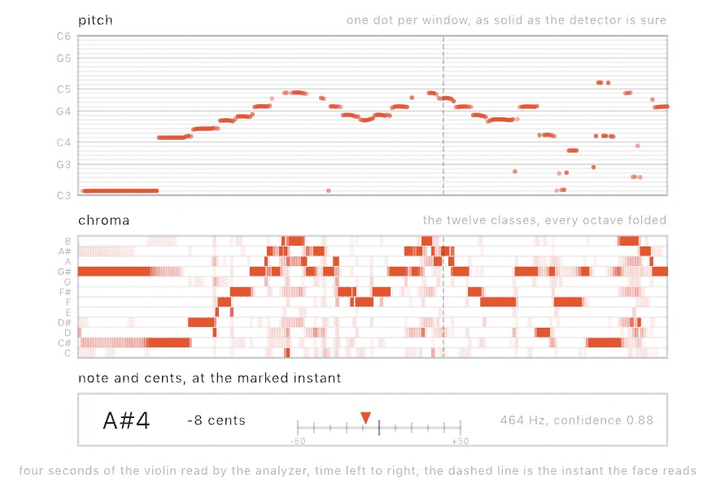

#### <sup>[Ollin](../README.md) → [Guide](README.md) → Chapter 37</sup>

---

# 37. Listening


Sound can move a picture once it becomes a few numbers: how loud the low, middle, and high parts are, and when a beat lands. You read those numbers from a microphone, a song, or a video, and learn which sound should move which part of a picture. The Resonator above throbs on every beat under a crown of spectrum spokes. The chapter then turns to the note being sung, and to the words and sounds a listener can name.

## Loudness from the microphone: `amplitude`

Sound reaches a sketch through `OllinAudio`, a small library you import beside the framework. The simplest start is the microphone and one number, `amplitude`. It says how loud things are right now, roughly `0...1`, and it is smoothed so it doesn't flicker.

```swift
import Ollin
import OllinAudio

final class Pulse: Sketch {
    let mic = AudioInput()

    override func setup() { try? mic.start() }

    override func draw() {
        background(.black)
        fill(.white)
        drawCircle(width / 2, height / 2, (60 + Double(mic.amplitude) * 700) * scale)
    }
}
```

Save it as `MySketches/Pulse.swift` and run it with `swift run OllinLive MySketches/Pulse.swift`, like any sketch. macOS asks about the microphone the first time, so say yes, and hum. The circle grows and shrinks with your voice. If it never moves, the reason is usually the permission, and `mic.unavailableReason` then holds a sentence that says so. A Mac with no microphone, such as a Mac mini, can listen to a song file or a tone instead, as [Four sources](#four-sources-the-microphone-a-file-a-tone-and-a-video) shows. Every sketch in this chapter has the same shape. You make a source, keep it in a property, start it in `setup()`, and read its values every frame. The steps that follow add richer values to read.

> **Swift note.** `amplitude` is a `Float`, because audio hardware works in 32-bit floats. Drawing wants `Double`, so you'll see `Double(mic.amplitude)` around every audio read. The conversion changes the type and keeps the value.

## Four sources: the microphone, a file, a tone, and a video

The microphone is one source of sound among four. Each source hands its sound to an **analyzer**, which turns it into the numbers you read, and the reads work the same on each. So choosing a source is one line. Here `track.m4a` is a file in the sketch's folder, and `player` is a `VideoPlayer` property from [Chapter 34](34-Seeing.md#when-there-is-no-camera-stills-and-footage). `lazy` lets the soundtrack use it, since a `lazy` property is made the first time it is read:

```swift
let mic = AudioInput()                                         // the room
let song = try? AudioPlayer(resource: "track", withExtension: "m4a", in: .module)
let tone = Tone(frequency: 220, waveform: .sine)               // a note of your own
lazy var sound = Soundtrack(of: player)                        // a video's sound
```

`AudioInput` is the microphone, permission and all, and it hears whatever the Mac's sound input is set to. `AudioPlayer` plays a file and analyzes it as it sounds, once you call its `play()`. It reads `.m4a`, `.mp3`, `.wav`, `.aiff`, and the other formats macOS plays. `try?` gives `nil` when the file is missing, so `song` is optional and you read it as `song?.amplitude`, the optional chaining from [Chapter 9](09-Pictures.md#making-it-narrower-without-squashing-it-seam-carving). The `Audio/FilePlayer` example plays a violin recording that ships with it.

`Tone` plays a steady wave at one pitch and feeds it to the analyzer as it sounds. It starts with `play()` too, and it lets a sketch hear itself with no permission and no file. On a `Tone`, `amplitude` is the volume you set, so its measured loudness is `tone.analyzer.amplitude`. The `Audio/Spectrum` example keeps a gliding `Tone` ready and draws its spectrum until the microphone is allowed. `Soundtrack` reads the sound of a playing video, so footage can drive the picture with its own music. An audio file you ship with a sketch needs the same license care as any other asset, so credit what you use.

The sources behave differently under an export. `AudioPlayer` follows the export's clock through its file, so a sketch driven by a file writes the same frames on every run. A video's sound reads as silence there. The microphone hears the room live while the frames render, so it never gives the same video twice. [Chapter 41](41-FinishingASketch.md#every-export-runs-without-a-window) covers exporting in full.

### A band that plays the same every run: `StageMic`

A room sounds different each time you run a sketch in it. A sketch tuned against the microphone never hears the same second twice. While you build, a source that plays the same music every run helps. `StageMic` is one. It is a short class at the bottom of [`Anatomy.swift`](Figures/37-Listening/Anatomy.swift), so copy it into your sketch's file.

`StageMic` works out a little band as numbers and feeds them into an `AudioAnalyzer`, the same analyzer every source above uses. The band is a kick drum every half second, with a hi-hat between the kicks. A kick is the low, thumping drum, and a hi-hat is a short tick of cymbal. Over them sit a held bass note, a slow four-note melody, and a little hiss. `StageMic` makes no sound you can hear. Each call to `listen()` feeds the analyzer the next sixtieth of a second, and you read the numbers from its `analyzer` property:

```swift
let mic = StageMic()                  // a stored property

// in draw():
mic.listen()
let level = mic.analyzer.amplitude    // the same reads as any source
```

Every value comes out of the same kind of analyzer a microphone feeds, so the reads mean the same things on both. The numbers differ a little, because the microphone's analyzer reads shorter stretches of sound. To switch, swap `StageMic()` for `AudioInput()`, start it in `setup()`, and delete the `listen()` line, because a live source feeds its analyzer by itself.

## What the analyzer hears: waveform, spectrum, and bands

Every source hands its sound to an analyzer, and the analyzer turns it into the numbers a sketch reads. Sound arrives as **samples**, measurements of air pressure taken tens of thousands of times a second, usually 44,100 or 48,000. The analyzer reads the most recent stretch of them three ways.

<picture>
  <source media="(prefers-color-scheme: dark)" srcset="Images/37-Listening/Anatomy-dark.jpg">
  
</picture>

The top panel is the **waveform**, the samples themselves, about 46 milliseconds of them. Two or three slow swells carry fast wiggles on them. The swells are the kick's low thump, and the wiggles are the melody. Draw the waveform when you want the look of an oscilloscope, the instrument that draws a signal as a moving line. Most mappings read the two panels below it.

The middle panel is the **spectrum**. Sound is vibration, and pitch is how fast the air vibrates. A low note shakes the air a few dozen times a second, and a high note thousands of times. The rate is measured in hertz (Hz), meaning cycles per second. The spectrum splits the instant into how much energy sits at each rate, the way a prism splits light into colors. Once it is split, you can read the mix. The kick's 55 Hz thump, the bass note at 110 Hz, and the melody near 659 Hz each get their own spike. The two smaller spikes to the right are the melody at twice its frequency and the click at the front of each kick. The tool that does the split is the Fourier transform, which [Chapter 21](21-PicturesYouSolve.md#a-picture-read-as-waves-the-fourier-transform) used to read a picture as waves. The analyzer runs it for you as the samples arrive. `spectrum` is the result, an array of magnitudes from low frequencies to high. Each entry is a **bin**, an equal slice of frequency, about 47 Hz wide on the microphone.

Raw spectra are awkward to draw. The magnitudes have no fixed range, and the equal slices don't match how you hear. Hearing works in ratios, so every doubling of frequency sounds like one equal step, and that step is an **octave**. The three octaves of bass from 40 to 320 Hz get about six bins, while the top octave alone gets hundreds. So the bottom panel is the read most sketches use, **`bands(_:)`**. The fragments in this section read from `mic`, the `AudioInput` of the first step. On `StageMic`, the same reads go through `mic.analyzer`:

```swift
for (i, level) in mic.bands(24).enumerated() {
    let h = Double(level) * 300 * scale           // level is already 0...1
    drawRect(Double(i) * 34 * scale, height - h, 30 * scale, h)
}
```

`bands(24)` gives 24 bars spaced the way hearing is, from about 40 Hz up, so the bass gets several bars instead of one. A gain, a multiplier that adapts to the music, scales each bar to roughly `0...1`. Each bar rises fast and falls gently, so the bars move without jitter. So a bar's height maps straight to pixels, with no gain for you to tune. Ask once per frame with the same count every time, because a new count starts the scaling over.

Between the raw spectrum and the shaped bands sit three named reads: `bass`, `mid`, and `treble`. They give the energy in the low, middle, and high ranges. `magnitude(in: 40...120)` reads a range you pick yourself. These three have no fixed range, like the spectrum, so scale them to taste.

## Hearing the beat: onsets

Loudness and spectrum answer "how much". Music also has arrivals. A drum hit is a moment, and a picture that flashes on the drum reads as listening in a way a level meter does not.

<picture>
  <source media="(prefers-color-scheme: dark)" srcset="Images/37-Listening/BeatTimeline-dark.jpg">
  
</picture>

The detector compares each new spectrum with the one before it and adds up every rise. A sudden brightening across many frequencies at once makes that sum jump, and the analyzer counts it as a beat. The sum is called **spectral flux**. A drum hit, a plucked string, and the start of a note all do that. The name for such a moment is an **onset**. Three reads report it:

```swift
mic.beat            // a 0...1 pulse: snaps to 1 on each beat, fades over ~0.25 s
mic.beatCount       // how many beats so far
mic.timeSinceBeat   // seconds of audio since the last one
```

`beat` is the ready-made value, so multiply a radius by it and the picture throbs. `beatCount` is for firing something once per beat. Compare it with a count you stored, and act when it has gone up. `timeSinceBeat` lets you draw a fade of your own length.

Look at the timeline. Every kick lands, and so does each quiet hat between the kicks. Onset detection hears sudden changes in the sound. It does not measure loudness, and it does not know "the beat" a drummer would tap. A soft hat is as sudden as a loud kick, so both count. To hear fewer beats, raise `beatSensitivity` above its default of 1.5, and a beat then needs a stronger arrival before it fires. A held chord, several notes at once, doesn't set it off. Neither does a drone, one note held under the music. The same samples always beat in the same places.

The detector says *that* a beat arrived, and it keeps no sense of tempo. Following the tempo of the room, so a sketch can play in time with a record, is `BeatFollower`. [Chapter 40](40-MusicByRule.md#playing-along-with-the-room-tempo-sync) teaches it once the sketch has notes of its own to play. A beat that several programs share over the network is the Link clock in [Chapter 38](38-ControlsAndSignals.md#one-beat-for-the-whole-room-link).

## From sound to picture: levels, moments, and decay

You can now read a level for each band and a moment for each beat. A music visual is mostly the choice of which read moves what. A few habits make the picture look like it is listening, and the Resonator is built on them.

**Which band drives what.** Low sounds are big and slow, and high sounds are small and quick. So let the bass bands drive the big shapes, such as a scale, a glow, or the weight of a line. Let the treble bands drive small, fast things, such as sparkle, grain, or a flicker at the edges. The middle bands carry most melody and voice, and they suit color and shape. Wired the other way round, the canvas swells on every hat. The Resonator puts the low bands at the top, where the music is loudest and the spokes grow longest. The high ones sit at the bottom.

**Levels and moments.** A level such as a band or `amplitude` changes all the time. So map it onto something that can change all the time, like a length, a brightness, or a position. A moment, such as `beatCount` going up, happens once, so let it start something: a burst of sparks, a flash, a new color. A level used as a trigger fires again and again while the sound stays loud. A level that moves too fast calms down with the source's `smoothing`. It runs from 0 for the raw reading to near 1 for a heavily damped one, and the microphone starts at 0.8.

**Decay.** A flash that lasts one frame is gone before the eye finds it. So a moment sets a value to 1, and the value falls back over a fraction of a second. The Resonator's core does this with one line every frame, `pulse *= exp(-deltaTime * 5)`. `exp(-deltaTime * 5)` is a number a little under 1, the fraction of the pulse to keep this frame. This is the [exponential decay](B-JustEnoughMath.md#exponential-decay) of Appendix B, scaled by `deltaTime` so it falls at the same speed at any frame rate. The pulse drops to about a third in a fifth of a second, and a larger number than 5 makes the tail shorter. A tail of a fifth to half a second reads as a hit, and a longer one starts to read as a level.

**A feed from the mixer.** At a show, a microphone in the room hears the crowd and the air conditioning. It also hears the speakers a moment late. Ask the sound engineer for a line from the mixing desk, a cable carrying the sound itself. Plug it into an audio interface, a box that brings sound cables into the Mac. Choose the interface on the Input tab of System Settings > Sound. Then set it to 48 kHz in the Audio MIDI Setup app, since that is the rate `AudioInput` expects. The sketch doesn't change, and the line carries the music alone at a steady level.

**Rehearsing on a recording.** `StageMic` gives you a band that plays the same every run. When you are tuning for a particular show, rehearse on its music instead. Play a recording of the set through `AudioPlayer`. The same second then gives nearly the same numbers on every pass, and exactly the same ones under an export. Once the mapping looks right on the recording, swap in the microphone or the mixer feed.

## Putting it together: the Resonator

The finished sketch reads `StageMic`, draws `bands` as a crown of spokes, and uses `beatCount` as the moment that throbs the core and throws sparks. Two parameters are ready for the knobs and faders of Chapter 38. Make `MySketches/Resonator.swift` and paste in `StageMic` from [`Anatomy.swift`](Figures/37-Listening/Anatomy.swift). The figure file with everything together is [`Resonator.swift`](Figures/37-Listening/Resonator.swift):

```swift
import Ollin
import OllinAudio

final class Resonator: Sketch {
    let mic = StageMic()

    @Param(24...96) var spokes = 56
    @Param(0.6...2.4) var brightness = 1.4

    struct Spark {
        var position: Vector2
        var velocity: Vector2
        var life: Double
    }

    var sparks: [Spark] = []
    var lastBeat = 0
    var pulse = 0.0

    /// Where the instrument sits: a touch below center, to leave the crown room.
    var mid: Vector2 { center + Vector2(0, 60 * scale) }

    override func setup() {
        seed(20)                              // the sparks re-fly the same way
    }

    override func draw() {
        mic.listen()
        let audio = mic.analyzer

        background(Color(hex: 0x06040E))
        toneMap(.aces)
        blendMode(.add)

        // The beat: snap the pulse up when a new one lands, let it fade.
        pulse *= exp(-deltaTime * 5)
        if audio.beatCount > lastBeat {
            lastBeat = audio.beatCount
            pulse = 1
            spawnSparks()
        }

        // The spectrum, worn as a ring of spokes: bass at the top, treble at
        // the bottom, mirrored left and right so the ring stays symmetric.
        let levels = audio.bands(spokes / 2 + 1)
        withState {
            translate(mid)
            rotate(time * 0.06)
            for i in 0 ..< spokes {
                let band = i <= spokes / 2 ? i : spokes - i
                let level = Double(levels[band])
                let angle = Double(i) / Double(spokes) * .tau - .pi / 2
                let dir = Vector2(cos(angle), sin(angle))
                let inner = 175 * scale
                let len = (14 + level * 290) * scale
                fill(Colormap.magma.color(at: 0.2 + level * 0.75)
                    .withAlpha(0.25 + level * 0.75 * brightness))
                drawOrientedBox(dir * inner, dir * (inner + len),
                                thickness: (3.5 + level * 9) * scale)
            }
        }

        // Sparks from past beats, flying and fading.
        for i in sparks.indices {
            sparks[i].position += sparks[i].velocity * deltaTime
            sparks[i].life -= deltaTime
        }
        sparks.removeAll { $0.life <= 0 }
        noStroke()
        for spark in sparks {
            let a = max(0, spark.life / 0.8)
            fill(Color(hue: 0.09, saturation: 0.5, brightness: 1).withAlpha(a * 0.9))
            drawCircle(spark.position.x, spark.position.y, (1.5 + a * 5) * scale)
        }

        // The core: a warm glow that swells on the beat, a hot center.
        let ember = Color(hex: 0xFFB65C)
        let glowRadius = (185 + pulse * 150) * scale
        fill(.radial(center: mid, radius: glowRadius,
                     Ramp([ember.withAlpha(0.3 + pulse * 0.5), ember.withAlpha(0)])))
        drawCircle(center: mid, radius: glowRadius)
        let coreRadius = (80 + pulse * 60) * scale
        fill(.radial(center: mid, radius: coreRadius,
                     Ramp([Color.white.withAlpha(0.95), Color.white.withAlpha(0)])))
        drawCircle(center: mid, radius: coreRadius)

        blendMode(.normal)
    }

    func spawnSparks() {
        for i in 0 ..< 14 {
            let angle = Double(i) / 14 * .tau + random(-0.15, 0.15)
            let speed = random(200, 380) * scale
            let dir = Vector2(cos(angle), sin(angle))
            sparks.append(Spark(position: mid + dir * 180 * scale,
                                velocity: dir * speed,
                                life: random(0.45, 0.8)))
        }
    }
}
```

Here is how it composes the steps:

- **The source.** `mic.listen()` feeds the next sixtieth of a second of `StageMic`'s band to its analyzer, and every read goes through `audio`, that analyzer. `mid` here is a property that works out a point a little below the center, where the instrument sits. It is a different thing from the `mid` band read. On a 120 Hz display the band plays at twice its speed, and `mic.listen(seconds: deltaTime)` keeps it in real time.
- **The levels.** `bands(spokes / 2 + 1)` asks for one more band than half the spokes. Spoke `i` reads band `i` down one side and band `spokes - i` back up the other. So the crown is a mirror image. The `? :` is the compact `if` from [Chapter 6](06-GridsAndRepetition.md#grids-that-arent-square-hexgrid-and-trianglegrid). Band 0, the bass, starts at the top, since the angle starts a quarter turn back, at `-.pi / 2`. `rotate(time * 0.06)` inside `withState` then turns the crown slowly, so the bass drifts around. `spokes` sets how many spokes there are, and `brightness` scales how opaque they are. A spoke's length, width, color, and alpha all grow with its level. `Colormap.magma` runs from magenta for the quiet bands to pale gold for the loud ones. Each spoke is a `drawOrientedBox`, which fills a thick bar between two points at any angle.
- **The moment.** When `beatCount` has gone past `lastBeat`, the sketch stores the new count, sets `pulse` to 1, and calls `spawnSparks()`. `pulse` then falls away with the decay from the mapping step, and it swells both the glow and the white core.
- **The sparks.** Each spark flies outward at its own speed and loses life by `deltaTime`. `removeAll { $0.life <= 0 }` drops the spent ones, where `$0` is each spark in turn. `seed(20)` makes the sparks fly the same way on every run.
- **The light.** The glow and the white core are circles filled with a radial `Ramp`, one of the gradients of [Chapter 2](02-Color.md). It fades to nothing at the edge. The [additive blend](19-LayersAndEffects.md#how-new-paint-meets-old-blend-modes) and the ACES [tone map](19-LayersAndEffects.md#brighter-than-the-screen-tonemap) from Chapter 19 make the overlaps glow like light instead of paint. `blendMode(.normal)` at the end puts the blend back for the next frame.

Then make it yours:

- Give it your ears. Swap `StageMic()` for `AudioInput()`, start it in `setup()`, and delete the `mic.listen()` line. Then play music at your Mac.
- Give it your music. Use an `AudioPlayer` with a track you like, and tune `beatSensitivity` until the sparks land on the drums.
- Give it your hands. [Chapter 38](38-ControlsAndSignals.md#one-parameter-three-hands-binding-and-smoothing) binds a knob on a MIDI controller, or a fader on a phone, to `brightness`.

To keep it, export a video:

```sh
swift run OllinLive MySketches/Resonator.swift --export-video resonator.mp4 --seconds 12
```

`StageMic` makes no sound, so the video is silent, and it comes out the same on every run. With your own song in an `AudioPlayer`, the export still follows the file frame by frame, and the video still has the picture only. To keep the music with the picture, record a run instead, with `--record` in place of the export flags. [Chapter 43](43-Performing.md#keeping-the-take) shows how a take records the sound the sketch is playing.

## The note being sung: pitch and pitch classes

The Resonator reads how loud each band is and when something arrives. A sketch can also ask which note is sounding, so the picture follows the melody or the harmony instead of the drums. One read names a single note, and another lists every note in the air at once.

### One note at a time: `pitch`

`pitch` names the note a voice, a bowed string, or a whistle is holding. Use it to let a singer steer the picture: a height that follows the melody, or a color for each note.

A held note is made of a **fundamental**, the rate you hear as its pitch, plus **harmonics** at two, three, and more times that rate. The detector is YIN, the 2002 method of Alain de Cheveigné and Hideki Kawahara. It does not look for the loudest frequency. It looks for the shortest delay after which the waveform repeats. A note with harmonics repeats at its fundamental's period, even when the fundamental is the quiet part or missing altogether. The ear decides the same way. So a bowed string reads at the string's note rather than at its brightest harmonic. YIN takes the first delay that repeats well enough, instead of the best one, which keeps it from reporting a note an octave low.

<picture>
  <source media="(prefers-color-scheme: dark)" srcset="Images/37-Listening/FollowingANote-dark.jpg">
  
</picture>

The top strip is four seconds of a violin recording. The detector reads about 50 milliseconds at a time, a stretch called a **window**, and each dot is one window. A **semitone** is the step from one piano key to the next, and twelve of them make an octave. The dots sit on the semitone lines because the player is in tune. Each dot is as solid as the detector was sure. The long run at the start is a double stop, two strings bowed at once. So are the few later dots an octave or more below the melody. Two notes together repeat only at the period both share, and the reading lands there. So `pitch` reads one note at a time, and a chord has no single pitch.

`pitch` is nil when nothing is being sung: silence, a room, a noise with no repeating shape in it. So you read it with `if let`. When there is a note, it carries five things:

- `frequency` is the rate in hertz.
- `nearestPitch` is the nearest note name: a letter for the note, `#` for the black key just above it, and a number for the octave. A4 is the A above middle C, the C near the middle of a piano keyboard.
- `cents` is how far above or below that name the note sits, where a hundred cents is one semitone.
- `confidence` is how sure the detector is. A pure tone reads 1, a sung or bowed note around 0.9, and noise stays under 0.5, where reporting stops.
- `midi` puts the note and the cents back together as one number. It uses MIDI's numbering, 60 for middle C and one more for each semitone up.

This draws the note's name, and a circle whose height follows the melody and whose size follows the confidence:

```swift
if let heard = mic.pitch {
    drawText("\(heard.nearestPitch)", width / 2, 80 * scale)             // "A4"
    let y = map(heard.midi, 48, 84, height, 0)                   // pitch as a height
    drawCircle(width / 2, y, (20 + Double(heard.confidence) * 40) * scale)
}
```

Map `midi` onto a position rather than `frequency`. The ear hears equal steps of `midi` as equal steps, and an octave is always twelve of them. An octave in hertz is a doubling, which has no fixed length on a ruler. A new note is heard about one window after it starts. The reading is not smoothed, since a held note holds steady on its own. A sketch that wants a slow needle eases toward `midi` itself. For the name alone, `mic.nearestPitch` is an optional `Pitch`, nil when nothing is sung, and a `Pitch` prints as its name.

The bottom of the figure is a tuner, the note and the cents at one instant. The `Audio/Tuner` example is that face, live, with the trace and the twelve classes under it. It follows the violin by default. Run it with `--mic` and sing at it. The `Audio/GuitarTuner` example is the six-string kind. It compares `midi` with the note of each open string, the string played with no finger on it, and lights the nearest. Its cents are read against that string's own pitch rather than the nearest piano key. So a string a semitone flat still points at its own tuning peg.

### Every note in the air: `chroma`

`chroma` lists which of the twelve note names are sounding, whatever octave each one is in. Use it for harmony, the notes sounding together, where `pitch` has no answer. A palette can change with the chord, or twelve lights can show the key, the set of notes the music uses. It follows the pitch class profile Takuya Fujishima described in 1999. The classes are read off the spectrum's peaks, the way Emilia Gómez's harmonic profile of 2006 reads them.

The middle strip of the figure above is `chroma` over the same four seconds, and the melody draws itself through the note names. It is twelve values, C first, one per note name, each `0...1` with the loudest at 1, and every octave folded onto the same twelve. So a C major chord, C, E, and G together, lights those three whatever octaves they sound in.

```swift
for (i, level) in mic.chroma.enumerated() {                   // C first
    let h = Double(level) * 200 * scale
    drawRect(Double(i) * 40 * scale, height - h, 36 * scale, h)
}
```

## Words, and what that noise was: speech and sound events

Everything the Resonator reads describes sound as a shape: how loud, which frequencies, when something arrived. A sketch can also ask what it is hearing, a word or a clap or a dog. Two listeners answer that. Each attaches to a microphone, a file player, a tone, or a playing video, and here both listen to the microphone:

```swift
let mic = AudioInput()
var speech: SpeechListener!
var ears: SoundClassifier!

override func setup() {
    speech = SpeechListener(of: mic)
    ears = SoundClassifier(of: mic)
    try? mic.start()
}
```

Two listeners on one microphone is fine. The source is tapped once, and the audio goes to everything attached to it.

### Words as they are spoken: `SpeechListener`

`SpeechListener` turns talking into text as it is spoken. Use it for captions a performer speaks into being, or for words that change the picture ("red", "stop", "again"). It runs Apple's on-device speech recognizer, the `SpeechAnalyzer` framework, so nothing is uploaded, and it asks for no permission beyond the microphone's. The first use of a language may download its model, which takes a moment and needs the network once. Until the model is in place, `unavailableReason` says so.

<picture>
  <source media="(prefers-color-scheme: dark)" srcset="Images/37-Listening/Listening-dark.jpg">
  
</picture>

Recognition guesses early and corrects itself as it hears more. Each line on the left of the figure is the same recognizer handed a little more of one sentence. Four fifths of the way through, its best guess was that the fox jumped over the lace, which fit what it had heard so far. So a listener gives you two reads, one for each job. In this fragment, `ink` is a `Color` property of your sketch that the word "red" changes:

```swift
drawText(speech.caption, at: center)              // the guess, which may change
for phrase in speech.phrases() {                  // what it committed to
    if phrase.text.lowercased().contains("red") { ink = .red }
}
```

**Draw the guess, act on the commitment.** `caption` is the running best guess, including its last words, which may still change. It is trimmed to its last few words, so it does not run off the canvas. `phrases()` drains what the recognizer has finished with, and hands out each phrase once, so it is safe to trigger from. A trigger on `caption` acts on a word that may be taken back.

### Sounds with names: `SoundClassifier`

`SoundClassifier` names the sounds around the microphone. It knows about three hundred everyday ones, from `clapping`, `dog_bark`, `knock`, `glass_breaking`, and `police_siren`, through every family of instrument, to `silence`. Use it to let the room's sounds place marks: a clap, a door, a laugh. It is Apple's Sound Analysis framework and the classifier Apple ships with it.

The right half of the figure above is the caution. Its three sounds are a sine wave, a tap every quarter second, and bursts of noise. The classifier called them a tuning fork, a click, and a hammer, which is fair. But it always answers, whatever it hears, so a small number means very little. Read the top label, keep a threshold, and treat the rest as opinion.

Like `SpeechListener`, it gives you a level and a trigger. In this fragment, `marks` is an array in your sketch, and `Mark` is a small type of your own that remembers where to draw:

```swift
let musical = ears.confidence(of: "music")                   // rises and falls
for event in ears.events() where event.label == "clapping" { // happens once
    marks.append(Mark(at: center))
}
```

An event fires when a label's confidence crosses the `threshold`, 0.6 by default, from below. A sound that goes on is one event, not one per moment it is still going. `events()` drains what arrived since the last call, the way `phrases()` does. For a mark that fades, read `timeSinceHearing("clapping")`, which you can ask every frame without using anything up. An iPhone can listen the same way from across the room, and [Chapter 36](36-ThePhoneAsASensor.md#what-the-phone-hears-sound-events) reads its sounds with the same reads.

Both listeners are live only. Under an export nothing is playing, so nothing is heard, and both say so in `unavailableReason` instead of going quiet. When an exported sketch needs words, work them out first, in `setup()`. Here `caption` is an optional `String` property of your sketch, and `voice.m4a` sits in its folder:

```swift
override func setup() {
    caption = try? waitFor {
        try await SpeechListener.transcribe(resource: "voice", withExtension: "m4a", in: .module)
    }
}
```

`waitFor` runs the work and waits for its answer, as in [Chapter 34](34-Seeing.md#the-body-as-a-controller-hands-faces-and-bodies). `SoundClassifier.classify(resource:withExtension:in:)` names the sounds in a file the same way, and it answers straight away, with no `waitFor`. These forms are deterministic, which is the promise the seed made in [Chapter 4](04-Randomness.md#seeds-randomness-you-can-keep). The same audio gives the same words every time, so a captioned export renders the same on every run. A system update can change the recognizer, and with it the words. The `Audio/Listening` example is the live one, with a caption you can talk into and marks you can clap at.

## Where this comes from

The idea that any sound splits into pure vibrations is Joseph Fourier's (1822). The fast algorithm that made it real-time, the FFT, is Cooley and Tukey's (1965), and Ollin runs Apple's implementation.

Detecting arrivals by spectral flux is a standard technique from music information retrieval. Bello and colleagues survey it in their onset-detection tutorial (2005). The real-time recipe Ollin follows is Böck, Krebs, and Schedl's online method (2012). The pitch and pitch-class entries name their own sources.

The audio-reactive visual has a long lineage. It runs from Oskar Fischinger's hand-drawn sound films through the oscilloscope and music-visualizer traditions. It reaches today's VJs, who mix video live to music, and live coding. Full credits are in the project's [attribution notes](../ATTRIBUTION.md).

## Go deeper

- [Audio](../Docs/Helpers/Audio.md): every source and read, `bands`, beats, the note heard as `pitch` and `nearestPitch` and the twelve classes as `chroma`, and feeding the `AudioAnalyzer` yourself.
- [Listening](../Docs/Helpers/Listening.md): the caption and transcript reads, phrases as triggers, languages and their models, the sound vocabulary and its threshold, bringing your own classifier, and the deterministic one-shot forms.
- [Synthesis](../Docs/Helpers/Synthesis.md): `Synth` and its voices, which [Chapter 39](39-MakingSound.md) is about, since a sketch that listens usually ends up playing too.
- Appendix B draws this chapter's math, one picture per idea: [Sound as numbers](B-JustEnoughMath.md#sound-as-numbers).
- Worked examples: [`Examples/Audio/Listening`](../Examples/Audio/Listening/Sketch.swift), [`Examples/Audio/Spectrum`](../Examples/Audio/Spectrum/Sketch.swift), and [`Examples/Audio/Tuner`](../Examples/Audio/Tuner/Sketch.swift).

---

[Contents](README.md#contents) · Previous: [Chapter 36, The iPhone as a sensor](36-ThePhoneAsASensor.md) · Next: [Chapter 38, Controls and signals](38-ControlsAndSignals.md)
