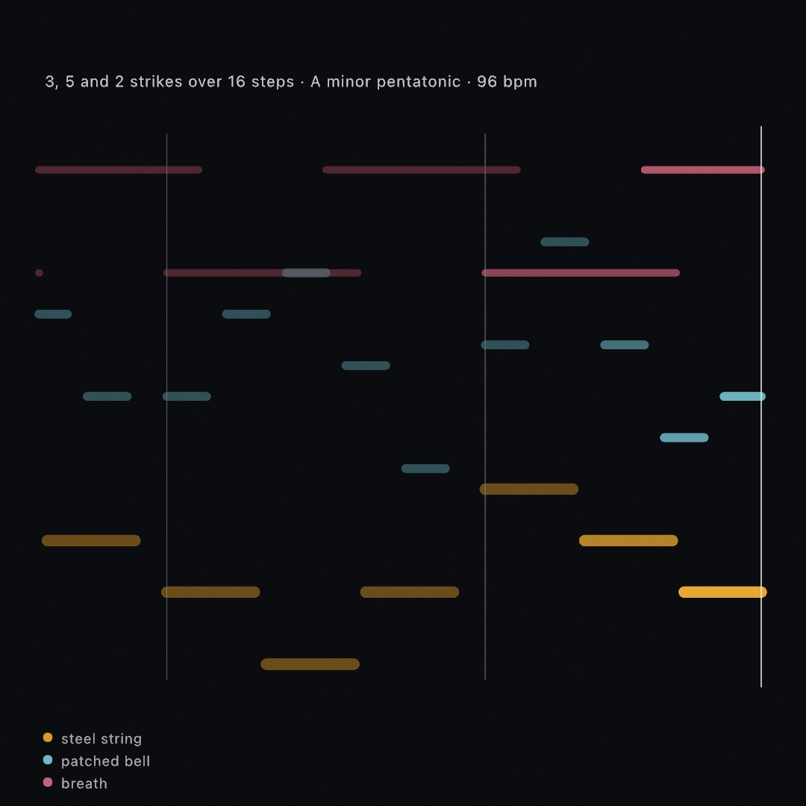
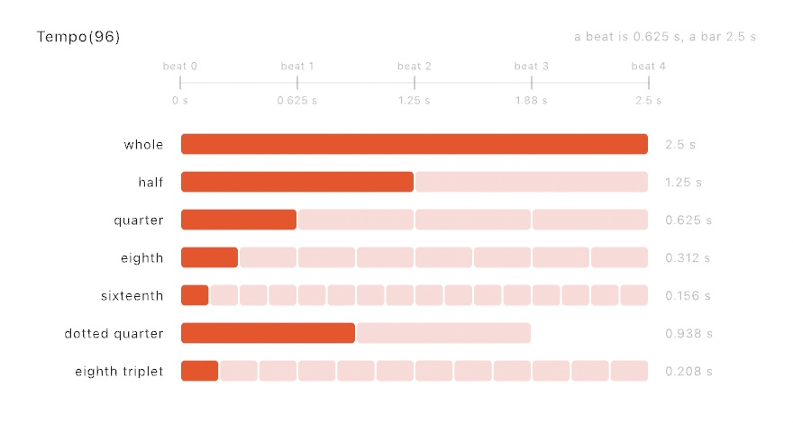
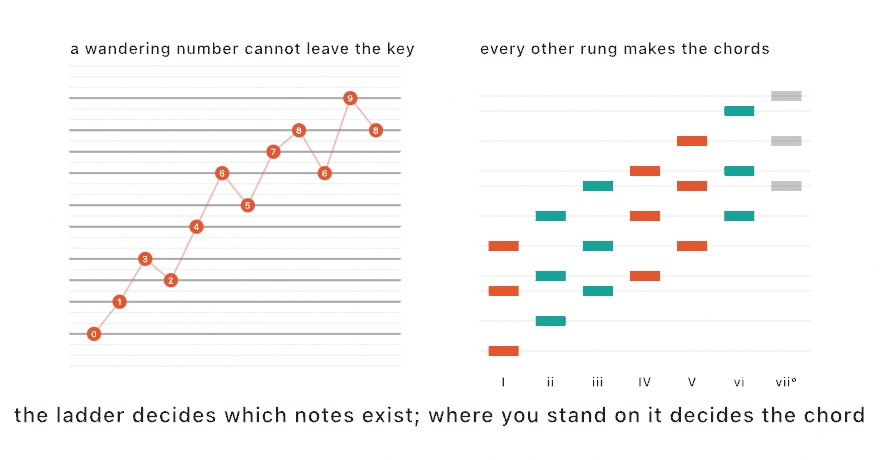
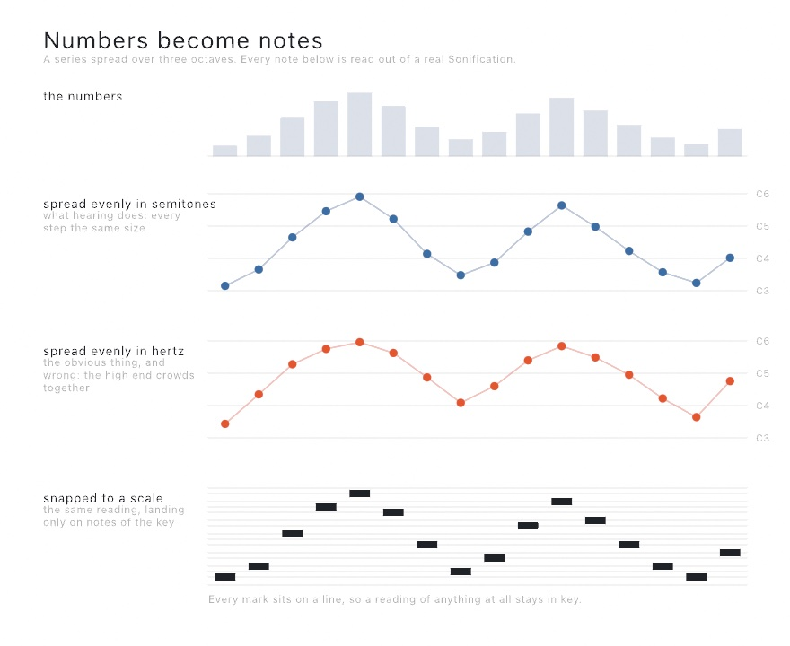

#### <sup>[Ollin](../README.md) → [Guide](README.md) → Chapter 37</sup>

---

# 37. Music by rule



A synth answers what a note sounds like and says nothing about which notes there are, or when. This chapter is that other half, music a sketch works out from a count of steps. Rhythms spread their hits evenly, a scale chooses the notes, and chords move under them. A small chain that learned a motif decides where a line wanders next. Then come a sequencer with a feel, tunings other than twelve, and playing along with the room. The chapter ends on sonification, sound placed around the listener, and MIDI files written and read back.

That picture is a record rather than a design. The piece drew it while playing it, one mark per note, and nobody wrote the notes down anywhere. Three rhythms decide when, a scale decides which, and a small chain that learned an eight-note motif decides where the low line wanders next.

## Music the sketch works out for itself

A synth answers what a note sounds like. It says nothing about which notes there are, or when. That half is the composition types, and the thing they have in common is that not one of them can tell the time.

Each answers a step number. Step 0, step 1, step 2, forever. Turning the sketch's clock into step numbers is one small counter's job, and a `Tempo` says how fast that clock runs:

```swift
let tempo: Tempo = 120
var counter = StepCounter(perBeat: 4)

override func draw() {
    for step in counter.steps(upTo: tempo.beats(at: time)) {
        synth.play(60, for: tempo.seconds(of: .sixteenth))
    }
}
```

It hands back a range rather than a single step. At any real tempo a frame lasts longer than a step, and a step that fell inside the frame still has to be played.

Keeping the clock outside is what makes the rest portable. `tempo.beats(at: time)` today, a beat detected in whatever is playing in the room, or a drum machine's own clock. That one arrives over the MIDI wiring of [Chapter 35](35-ControlsAndSignals.md#musical-time-midi-clock-and-link). None of what follows changes.

**`Tempo` is the one value that knows a second.** Everything else in this chapter counts beats. `tempo.beats(at: time)` is `time * 120 / 60`, written once and named. The same value answers the other question, how long a note lasts. A note's length is a `NoteLength`, in beats, with the names from the stave: `.whole` down to `.thirtySecond`. `.dotted` and `.triplet` derive the rest, and `tempo.seconds(of: .quarter.dotted)` is what to hand a synth's `for:`. Put the tempo on a `@Param` and it is a slider in beats per minute. A MIDI knob or an OSC address drives it like any other number.

<picture>
  <source media="(prefers-color-scheme: dark)" srcset="Images/37-MusicByRule/NoteLengths-dark.jpg">
  
</picture>

Read it across. At 96 beats a minute a beat is 0.625 seconds. A whole note holds for 2.5 and a sixteenth for 0.156. Two dotted quarters leave a beat over. That is why a dotted rhythm leans. Three eighth triplets fit where two eighths did. Every width and every number in the figure is read off the two types, so the picture is what they compute.

**`Rhythm` decides when.** Ask for a number of strikes over a number of steps and it spreads them as evenly as whole steps allow:

```swift
let rhythm = Rhythm(5, in: 16)
if rhythm[step] { synth.play(60, for: 0.1) }
```

<picture>
  <source media="(prefers-color-scheme: dark)" srcset="Images/37-MusicByRule/Euclidean-dark.jpg">
  
</picture>

Read the gaps column. However many strikes you divide over sixteen steps, the gaps come out in at most two lengths, and those two differ by one. That is the whole idea. What falls out of it is the surprise. `Rhythm(3, in: 8)` is the Cuban tresillo, and `Rhythm(5, in: 8)` the cinquillo. `Rhythm(7, in: 12)` begun three strikes in is the bell pattern played across west Africa and, after it, much of the Americas. An algorithm written for timing pulses in a particle accelerator turns out to produce the rhythms people were already playing.

The named ones are on the type, so you rarely have to remember which numbers. They are `.tresillo`, `.cinquillo`, `.bellPattern`, `.bossaNova`, `.samba`, `.aksak`, and a few more. Or write one out, which is what you want when the pattern is already in your head:

```swift
let clave: Rhythm = "x..x..x...x.x..."
```

**`Scale` decides which.** It turns whole numbers into notes, so a number arrived at any way at all stays in key:

```swift
let key = Scale(.minorPentatonic, root: "A3")
synth.play(key[step])
```

Degrees run past both ends: `key[5]` is an octave up, `key[-1]` the note below the root. This is the piece that does the most work for the least code. Feed a wandering number through a scale and it cannot play a wrong note.

Sometimes the number came from somewhere that is not music, like a mouse position or a sensor reading. Then `snap` moves it to the nearest note of the scale instead:

```swift
synth.play(key.snap(Pitch(40 + mouseY / 12)))
```

**`Chord` and `Arpeggio` decide what goes together.** A chord can be named, as `Chord("A3", .minorSeventh)`. It can also be built out of the scale, by taking every other note:

```swift
key.chord(on: 0)     // a triad on the root
key.chord(on: 1)     // a triad on the second degree
```

On a major scale those come out major and minor from the same call. That is the point of building a chord out of a key. The quality follows from where in the scale you started. Changing the key changes the chords along with it, rather than fighting them.

<picture>
  <source media="(prefers-color-scheme: dark)" srcset="Images/37-MusicByRule/ScaleLadder-dark.jpg">
  
</picture>

An `Arpeggio` plays a chord one note at a time, and like a rhythm it answers a step number:

```swift
let arp = Arpeggio(Chord("A3", .minorSeventh), .upDown, octaves: 2)
synth.play(arp[step], for: 0.1)
```

Read it at the step, rather than counting the notes you have played so far. That keeps the figure in its place in the bar, instead of restarting every time the rhythm strikes.

**`MarkovChain` decides what next.** Show it a phrase and it learns what tends to follow what:

```swift
var melody = MarkovChain(learning: [0, 2, 4, 2, 0, -3], seed: 4, loops: true)
melody.start(at: 0)

synth.play(key[melody.next() ?? 0])
```

`order` is how far back it looks. At 1 each element is picked from whatever followed the one before it. At 2 it looks at the last two, which tracks the source more closely and invents less. It is seeded, and it keeps its own generator rather than borrowing the sketch's. Adding one cannot shift anything else you were drawing at random.

Four small pieces, and together they are a piece of music:

```swift
for step in counter.steps(upTo: time * 104 / 60) {
    if pulse[step] { bass.play(key[melody.next() ?? 0], for: 0.34) }
    if figure[step] { chords.play(key.snap(arp[step]), velocity: 0.55, for: 0.22) }
}
```

That is `Examples/Audio/Generative`, drawn as three of those rings turning on one step count. The key, the figure, and the tempo are parameters you move while it plays. All of it repeats. The same seed gives the same melody, and the same two numbers give the same rhythm. A generated piece is something you can come back to, not something you had to be there to catch.

## Steps with a feel: the sequencer and the arpeggiator

The counter and a rhythm give you a grid. A drum machine gives you a grid with a feel. One step is struck harder than its neighbor. One plays some bars and not others. One is split into a roll, and the whole bar leans late on its offbeats. `StepSequencer` is that grid. Write one out, one token per step, and give it the beat:

```swift
var drums: StepSequencer = "36 . . 36 . . 36 . 38 . . 36 . 38 . ."
drums.swing = 0.58

override func draw() {
    let now = tempo.beats(at: time)
    let ahead = tempo.beats(at: time + deltaTime)
    synth.play(drums.events(upTo: ahead), tempo: tempo, from: now)
}
```

That loop differs from the one above in one way. The sequencer is asked for the notes up to where the music will be at the *end* of the frame. The synth is told where the music is *now*. The difference is a wait, and the synth waits it out to the sample. Without the wait, a note asked for in `draw()` lands with the frame that asked. That is fine for a note on the beat and not for swing. At 120 beats a minute a frame is 17 milliseconds, and a shuffle moves a note by 42. `play(_:velocity:for:after:)` is the piece underneath. Any note can take an `after:` in seconds, and a strum is three notes and three waits.

Each step is a `Step`: a pitch or a rest, a `velocity`, a `probability`, and a `ratchet`. Set them through the subscript, which wraps like a rhythm's:

```swift
drums[7] = StepSequencer.Step(42, velocity: 0.6, ratchet: 3)     // a roll of three
drums[13] = StepSequencer.Step(42, probability: 0.5)             // plays half the bars
```

<picture>
  <source media="(prefers-color-scheme: dark)" srcset="Images/37-MusicByRule/Sequencer-dark.jpg">
  
</picture>

Read the top block across. Swing moves only the second step of each pair, and by the same fraction every time. At 0.67 the offbeat lands on the last triplet of its pair, which is the shuffle. The downbeats never move, so the bar keeps its grid however hard it leans. The middle block is one lane over four bars. The chance step shows as an outline on the bars it stayed quiet, and the ratchet is three strikes in the time of one. The chance is a coin the seed tosses. The same seed plays the same bars the same way, so a pattern left partly to chance still repeats.

An `Arpeggiator` is the same idea for a chord: whatever is held right now, played one note a step in an order. Hold notes from a keyboard over the wire or from the sketch's own hand:

```swift
var arp = Arpeggiator(.upDown, octaves: 2, rate: .sixteenth)

override func draw() {
    arp.notes = midi.heldNotes.map { Pitch(Double($0.note)) }
    let now = tempo.beats(at: time)
    synth.play(arp.events(upTo: tempo.beats(at: time + deltaTime)), tempo: tempo, from: now)
}
```

An `Arpeggio` earlier in the chapter was a figure worked out once from a fixed set of notes. The arpeggiator follows the notes as they change. The bottom block of the figure shows two rules. A note added while the others are still held joins the ladder where it belongs, without the figure starting again. A new chord after silence starts from its first note. Turn `latches` on and letting go of every key keeps the last chord playing, which is the hold switch on the hardware. Nothing held means nothing played, but the count goes on underneath, so the next note lands on the grid.

`Examples/Audio/Sequencer` is a drum machine's grid with an arpeggiator under it. Three lanes, a swing slider, the hat's offbeats on a chance, two ratchets, and a chord that changes every bar from a progression. Click a cell to turn it on or off.

## Chords that come out of a key

The scale gave every number somewhere safe to land. Chords are the same idea one level up, and the useful way to write them down is as *degrees* rather than as names.

```swift
let changes = Progression("I vi IV V", in: Scale(.major, root: "C3"))

for step in counter.steps(upTo: time * 2) {
    pad.play(chord: changes.pitches(at: step), for: 1.8)
    bass.play(changes.root(at: step).transposed(by: -12), for: 1.6)
}
```

Degrees, because that is the fact that survives changing key. `I vi IV V` is the same progression in every key there is, and writing it this way means the qualities fall out of the scale instead of having to be said.

<picture>
  <source media="(prefers-color-scheme: dark)" srcset="Images/37-MusicByRule/Changes-dark.jpg">
  
</picture>

Those are the notes `pitches(at:)` actually hands back, in two keys, with nothing else changed. Every chord comes out different, and each one is whatever the scale's own notes make of that degree. Watch the second column, which is minor in the major key and major in the minor one. That is not a special case. It is what happens when the numeral only ever meant "start here and take every other note". `Examples/Audio/Changes` puts the key on a parameter so you can hear this happen while it plays. One thing about the labels. Ollin names every black key with a sharp, so the minor row's `G#` is the A flat a score would print. It is the same pitch either way.

There are named ones (`.pop`, `.blues`, `.twoFiveOne`, `.andalusian`), and there is a way to leave the cycle:

```swift
let changes = Progression("I vi IV V ii V", in: key).wandering(32)
```

That is the Markov chain from a few pages back, learned off the progression's own moves. It only ever makes a move the original made. Two bars in, it is somewhere the original never went, having got there by steps the original took. Seeded per call, so a wander you like is one you can ask for again.

When the chords do not all come from one key, write them out instead:

```swift
let changes = Progression(symbols: "Dm7 G7 Cmaj7 Cmaj7")
let chord: Chord = "F#m7"
```

Symbols do not survive a change of key and degrees do, which is the whole trade between the two.

## Twelve is a choice: tunings

Everything so far has divided the octave into twelve, because almost all the music you are likely to make does. It is worth knowing that this is a decision and not a law.

```swift
let tuning = Tuning.just.rooted(at: "C3")
synth.play(tuning[degree])
```

A `Tuning` is a list of frequency ratios and the interval they repeat over. It has the same shape as a `Scale`, so indexing degrees and snapping stray pitches work the same way.

Equal temperament is a compromise: it makes every key equally usable by making every interval except the octave slightly wrong. Play a held triad in `.equalTemperament` and then the same triad in `.just` and you can hear what that costs. The equal one beats, slowly and audibly; the whole number one locks and sits still. A piece that never changes key gives up nothing by being tuned the second way.

Past that there are more steps rather than different ones, in `.nineteen`, `.thirtyOne`, and `.quarterTones`. Then there is `.bohlenPierce`, which divides a *third* into thirteen and so contains no octave at all. Doubling a frequency is so familiar that a tuning without it sounds wrong before it sounds strange, and then stops sounding wrong. It works because odd harmonics still line up, which is why it suits the clarinet from earlier in this chapter and suits almost nothing else.

## Playing along with the room: tempo sync

[Chapter 34](34-Listening.md)'s beat detector told you *that* a beat happened. Getting from there to playing in time with one is a bit more:

```swift
let mic = AudioInput()                   // start it in setup(), as in Chapter 34
lazy var room = BeatFollower(mic)
var counter = StepCounter(perBeat: 2)

override func draw() {
    room.advance(to: time)
    for step in counter.steps(upTo: room.beats) {
        synth.play(key[step % 5], for: 0.2)
    }
}
```

`room.beats` is musical time inferred from what it is hearing. The same `StepCounter` that ran off `time` now runs off the record playing in the room. `room.rhythm(steps: 16)` hands back the pattern it heard as a `Rhythm`, which you can then play against.

Two things it does that are easy to get wrong if you write this yourself. A detector that fires on every eighth note reports twice the tempo, which is the same music. So anything outside a believable range is halved or doubled until it lands inside one. And the tempo is the *middle* of the recent gaps rather than their average. One missed beat doubles a gap, and that moves an average where it does not move a middle.

It hears arrivals rather than the beat a drummer would tap. A steady loop is followed well, and rubato is followed badly. `room.steadiness` is how much to trust it.

## Numbers you can hear: sonification

Everything so far invents what it plays. The other way to fill a scale with notes is to already have the numbers, and read them out.

```swift
let readings = Sonification(table, column: "temperature",
                            in: Scale(.minorPentatonic, root: "A3"))

for step in counter.steps(upTo: time * 2) {
    synth.play(readings, step: step, tempo: 120)
}
```

That reads a column of a table. The same call reads a line across a terrain, `Sonification(land, row: 32)`, or a row of a picture, `Sonification(photo, row: 200)`, as brightness. It answers a step number and owns no clock, like everything else in this tier, so the counter you already have drives it.

<picture>
  <source media="(prefers-color-scheme: dark)" srcset="Images/37-MusicByRule/Sonification-dark.jpg">
  
</picture>

Two decisions inside that call are worth pulling out, because neither is what you would write first and the figure is the argument for both.

**Pitch is spread evenly in semitones, not in hertz.** Hearing is logarithmic. The step from 220 Hz to 440 sounds like the step from 440 to 880, though the second is twice the size. Spread a series evenly in hertz and the whole bottom half of your data crushes into the top of the range. That is the middle row of the figure, the same numbers, unreadable. Spread it evenly in semitones and the shape survives.

**Snapping is what makes it music instead of a signal.** The bottom row is the same reading landing only on notes of the key. Nothing about the data changed; it simply cannot play a wrong note now. This is why `Scale` was worth having before there was anything to read.

One more piece, small and easy to skip:

```swift
marker.play(readings.reference(at: 20), tempo: 120)   // 20 degrees, sounded
```

A reference sounds one named value on exactly the same footing as the reading. Without one, a listener needs absolute pitch to know what any note means. With one, every note is heard as above or below something. It is a chart's grid line, in sound. It is the difference between a noise that rises and falls and a measurement you can actually read.

Which is the other reason this exists. A sketch that draws a column can read the same column out loud, from the same numbers, in one more line. `Examples/Audio/Sonification` does exactly that. A line across a landscape is drawn as a profile and played as a tune, with the playhead marking the note sounding. The picture and the sound are two views of one series, and one of them works for someone who is not looking.

## Spatial audio, and sound you can keep

Two things are left, and both are one line each.

A sound can come from a place in the 3D scene, with the camera as the ear:

```swift
cameraShowcase(.autoOrbit())
guard let eye = activeCamera else { return }

synth.place(at: Vector3(2, 0, -3), heardFrom: eye)
```

Both facts arrive in the same call because neither means anything on its own. A position says nothing until something is listening, and where the sketch is looking from is where it hears from. On headphones this is more than loudness. It is how much later the sound reaches one ear than the other, and what a head does to a sound arriving round it. Something behind you is behind you, rather than merely quiet. `Examples/Audio/Spatial` is three chimes standing still and one walking past them.

The other is that a sketch which plays carries its sound out of the window:

```sh
ollin Piece.swift --export-video piece.mp4 --frames 480
```

The file has the music in it. There is no record button and nothing to switch on.

This is worth a moment, because it is the one place in this chapter where an earlier decision is audible. The exporters drive a sketch on a fixed clock with no window and nothing playing. There are no speakers to send notes to, so the notes are written down as the frames are drawn. At the end the soundtrack is rendered through the same code that would have fed the speakers. The renderer could be used that way because it takes events and gives back samples and has no clock of its own. An export is that same code with the waiting taken out.

Which means the sound reproduces exactly the way the picture does. Export the same piece twice and the audio comes back sample for sample identical. A generated piece is something you can come back to, rather than something you had to be there to catch. That is the same promise the seed made in [Chapter 4](04-Randomness.md), arriving in a medium you cannot look at.

The two halves of this section meet, which is worth saying because it would be easy to assume they don't. Placing works by rewiring the audio graph, and an export has no audio graph to rewire. So where each instrument was and where it was heard from get written down as the frames are drawn, exactly the way the notes are. The finished soundtrack is rendered through a listener at the end. A chime that walks past your left ear on screen walks past your left ear in the file. Place from the first frame if you want that. The soundtrack machine is built once, and its shape is fixed then. An instrument that starts playing before it is ever placed will tell you so, rather than quietly coming out in the middle.


## Taking the piece with you: MIDI files

A sketch that works out music is a sketch that has music to lose. The composition types answer a step number and vanish when the window closes, and that is fine for a piece that is meant to be different every run. It is not fine for a phrase you liked. A Standard MIDI File is how music travels between programs, every sequencer and notation program reads and writes one, and a sketch can do both.

Writing one takes the notes you already have:

```swift
var phrase: [ScheduledNote] = []
var bar = 0.0
while bar < 32 {
    phrase += drums.events(upTo: bar)
    bar += 4
}
try MIDIFile(phrase, tempo: 112, name: "Pattern").write(to: "pattern.mid")
```

That is the whole of it. `events(upTo:)` hands back `ScheduledNote` values, and that is what a file is made of, so nothing has to be converted. The arpeggiator, the Markov chain, the progression, and the sonification all answer in the same values, which means any of them can be written out the same way.

Reading one gives you the same values back:

```swift
let song = try MIDIFile(resource: "prelude", in: .module)

override func draw() {
    let now = song.beats(at: time)
    let ahead = song.beats(at: time + deltaTime)
    synth.play(song.notes(from: now, to: ahead), tempo: song.tempo(at: now), from: now)
}
```

Which is the same shape as the look-ahead pair from the sequencer: ask for the notes up to where the music will be at the end of the frame, and play them from where it is now. A file is one more thing that answers when you ask it.

<picture>
  <source media="(prefers-color-scheme: dark)" srcset="Images/37-MusicByRule/MIDIFileFigure-dark.jpg">
  
</picture>

The top of the figure is a real file drawn as a piano roll, and everything in it came out of the file rather than out of the sketch that wrote it: the parts, their channels, the bar lines from its own time signature, the chord names from the markers it carries. Reading is not an approximation of what was written. It is the same music.

The bottom half is the part worth slowing down for. Every position in a MIDI file is a beat, never a second, for exactly the reason the composition types own no clock: a beat is what survives somebody opening the file and deciding it should go faster. What joins the two is the tempo map, which is a list of the places the speed changes, and `beats(at:)` and `seconds(at:)` walk it from either side. In the figure the piece drops to half speed at beat eight, so the second half of the bars take twice as long on the clock while sitting exactly where they were in the music. If you divided by one tempo instead, everything after that point would be wrong, and it would be wrong in the way that is hard to see: a playhead drifting slowly out of the picture it is meant to be marking.

A file carries more than notes. Control changes, the pitch wheel, the program each part asks for, the names, and markers all come back, and markers are the useful surprise: a name at a beat is somewhere to hang a change of scene, put there by whoever wrote the music rather than by you.

The last direction is live. A `Synth` will write down what it is asked to play, so a take improvised at the keyboard can be opened somewhere else:

```swift
override func keyPressed() {
    switch key {
    case "r": synth.startRecording(tempo: 96, name: "Take")
    case "s": try? synth.stopRecording().write(to: "take.mid")
    default: break
    }
}
```

The notes keep the timing they were played with, down to the wait each one was asked with, so a swung pattern arrives swung. The tempo you give it decides where the bar lines fall around what was played, and nothing else. `Examples/Audio/MIDIFiles` runs the whole circle: it composes eight bars, writes them to a file, forgets them, reads the file back, and everything you then see and hear comes off disk.


## Putting it together: the music box

The finished sketch plays by itself and draws what it plays. Three voices, one clock, three rhythms, one key. Make `MySketches/MusicBox.swift` and run it, because the picture is the smaller half of this one.

The first part is the piece. The bell is patched by hand rather than picked from the presets, the string is the model from [Chapter 36](36-MakingSound.md#a-string-worked-out-rather-than-drawn-the-plucked-string), and the breath is a preset. Everything about *when* comes from three Euclidean rhythms read at the same step number, and everything about *which* comes from the scale, so no note in it can be out of key. The low line's degrees come from the chain, which was taught an eight-note motif and now wanders inside its habits.

```swift
import Ollin
import OllinAudio

final class MusicBox: Sketch {

    // MARK: what plays

    let string = Synth(.steel, polyphony: 6)
    let bell = Synth(polyphony: 10)
    let air = Synth(.breath, polyphony: 4)

    let steps = 16
    let tempo: Tempo = 96
    var counter = StepCounter(perBeat: 4)
    var motif = MarkovChain<Int>(seed: 4)

    /// Every note the piece has played: when it started, in beats, how long it
    /// holds, which voice sang it, and how hard.
    struct Played {
        var beat: Double
        var pitch: Double
        var beats: Double
        var voice: Int
        var velocity: Double
    }
    var score: [Played] = []

    override func setup() {
        seed(4)
        // The bell is patched rather than picked: one sine bent by another at a
        // ratio that is nowhere near a whole number, which is what makes metal.
        bell.voice = Voice(patch: Patch.tone(.sine)
                                .modulated(by: .tone(.sine, ratio: 3.47), amount: 4.2),
                           envelope: .percussive)
        string.gain = 0.5
        bell.gain = 0.3
        air.gain = 0.14
        bell.reverb = Reverb(.hall, mix: 0.3)
        air.reverb = Reverb(.hall, mix: 0.45)

        motif.learn([0, 2, 4, 2, 0, -3, 0, 4], loops: true)
        motif.start(at: 0)
    }

    // MARK: the piece

    override func draw() {
        background(Color(hex: 0x0B0C10))

        let key = Scale(.minorPentatonic, root: "A2")
        let low = Rhythm(3, in: steps)          // three strikes, as evenly as sixteen allows
        let mid = Rhythm(5, in: steps)
        let high = Rhythm(2, in: steps)

        let beats = tempo.beats(at: time)
        for step in counter.steps(upTo: beats) {
            let at = Double(step) / 4
            if low[step] {
                let degree = motif.next() ?? 0
                play(string, key[degree], at: at, beats: 1.1, voice: 0, velocity: 0.9)
            }
            if mid[step] {
                let chord = Chord(key[0].transposed(by: 12), .minorSeventh)
                let figure = Arpeggio(chord, .upDown, octaves: 2)
                play(bell, key.snap(figure[step]), at: at, beats: 0.5, voice: 1, velocity: 0.55)
            }
            if high[step] {
                let inBar = ((step % steps) + steps) % steps
                let breath = Pitch(76 + Double(inBar % 3) * 5)
                play(air, key.snap(breath), at: at, beats: 2.4,
                     voice: 2, velocity: 0.35)
            }
        }

        drawScore(now: beats)
    }

    func play(_ synth: Synth, _ pitch: Pitch, at beat: Double, beats: Double,
              voice: Int, velocity: Double) {
        synth.play(pitch, velocity: velocity, for: tempo.seconds(beats: beats))
        score.append(Played(beat: beat, pitch: pitch.midi, beats: beats,
                            voice: voice, velocity: velocity))
    }

```

The second part is the drawing, and it knows nothing about sound. Every note the piece played was written into `score` as it went, so the picture is a read of that list: time across, pitch up, how long it holds as the length of the mark, how hard it was struck as its weight.

```swift
    // MARK: the score it leaves behind

    let window = 9.0                            // beats visible at once
    let voiceColors = [Color(hex: 0xF2B134), Color(hex: 0x7FD1E0), Color(hex: 0xE0728A)]

    func x(ofBeat beat: Double, now: Double) -> Double {
        map(beat, now - window, now, 60, width - 60)
    }

    func y(ofPitch pitch: Double) -> Double {
        map(pitch, 38, 88, height - 190, 200)
    }

    func drawScore(now: Double) {
        // The bar lines, so the pattern's period is visible rather than implied.
        stroke(Color(white: 1, alpha: 0.09))
        strokeWeight(1)
        var bar = (now - window - 4).rounded(.down)
        while bar < now {
            if bar.truncatingRemainder(dividingBy: 4) == 0 {
                let px = x(ofBeat: bar, now: now)
                if px > 40 { drawLine(px, 180, px, height - 170) }
            }
            bar += 1
        }

        // Every note as the length of time it holds, at the height of its pitch.
        strokeCap(.round)
        for note in score {
            let x0 = x(ofBeat: note.beat, now: now)
            let x1 = x(ofBeat: note.beat + note.beats, now: now)
            if x1 < 50 { continue }
            let age = now - (note.beat + note.beats)
            let fade = 1 - smoothstep(0, 2.5, max(age, 0))
            let ahead = note.beat > now
            stroke(voiceColors[note.voice].withAlpha((ahead ? 0.12 : 0.35 + note.velocity * 0.6) * max(fade, 0.18)))
            strokeWeight(6 + note.velocity * 10)
            drawLine(max(x0, 52), y(ofPitch: note.pitch), min(x1, width - 60), y(ofPitch: note.pitch))
        }

        // Where now is, and what is sounding under it.
        stroke(Color(white: 1, alpha: 0.5))
        strokeWeight(1.5)
        let head = x(ofBeat: now, now: now)
        drawLine(head, 170, head, height - 160)

        noStroke()
        fill(Color(white: 1, alpha: 0.55))
        textFont(OutlineFont.system)
        textSize(21)
        textAlign(.left, .top)
        drawText("3, 5 and 2 strikes over 16 steps · A minor pentatonic · 96 bpm", 60, 96)
        fill(Color(white: 1, alpha: 0.32))
        textSize(19)
        for (i, name) in ["steel string", "patched bell", "breath"].enumerated() {
            fill(voiceColors[i].withAlpha(0.75))
            drawCircle(64, Double(height) - 92 + Double(i) * 30, 6)
            fill(Color(white: 1, alpha: 0.4))
            drawText(name, 82, Double(height) - 102 + Double(i) * 30)
        }
    }
}
```

Read the picture back against the code and each voice's rhythm is in it. The gold marks land on three of the sixteen steps, as far apart as sixteen lets them be. The blue ones walk up and back down because an arpeggio is read at the step rather than restarted. The pink ones hold for two and a half beats each, which is why they overlap.

Then make it yours:

- Change the three strike counts. `Rhythm(7, in: 16)` under the string turns the floor into something you have to count.
- Give the bell a whole-number ratio, `3` instead of `3.47`. It stops being metal and becomes an organ pipe, and nothing else in the sketch changes.
- Swap `Scale(.minorPentatonic, root: "A2")` for `.hirajoshi` or `.blues`. Every wandering degree stays in the new key, because that is the one thing a scale guarantees.
- Put the tempo on a `@Param`, as `@Param(60 ... 160) var tempo: Tempo = 96`, and drag its slider while it runs. A MIDI knob binds to it the same way.
- Feed the same step number to something you draw in 3D, and let the piece move a scene rather than a score.

## Where this comes from

The even spread behind `Rhythm` is Eric Bjorklund's algorithm for timing pulses in a spallation neutron source. Godfried Toussaint connected it to musical timelines in 2005, along with the names of the rhythms it produces. Writing changes as numerals rather than names is figured bass and Roman numeral analysis, which is how music theory has written harmony down for centuries and for the same reason: the numbers are what survives a change of key. Full credits are in the project's [attribution notes](../ATTRIBUTION.md).

## Go deeper

- [Composition](../Docs/Helpers/Composition.md): rhythms, scales, chords, progressions, arpeggios, chains, tunings, following a beat, the step counter under all of them, and the [step sequencer](../Docs/Helpers/Composition.md#stepsequencer) and [arpeggiator](../Docs/Helpers/Composition.md#arpeggiator) that read the beat you hand them.
- [MIDI files](../Docs/Helpers/MIDIFiles.md): reading a `.mid` file into notes, writing one back out, the tempo map read from either side, what is carried and what is passed over, and recording a take off a live `Synth`.
- [Sonification](../Docs/Helpers/Sonification.md): the four sources, how the ends of the data are decided, the reference note, and reading a series by ear.
- [Spatial audio](../Docs/Helpers/Synthesis.md#placing-a-sound): placing a source in the room, the listener, and what an export writes.
- The Bonačić homage [`GFE164`](../Examples/Recreations/VladimirBonacic/GFE164/Sketch.swift): a relief of colored glass whose sixty-four tones come from the same arithmetic as its lights. A tone sounds whenever its square could light, one sine voice each, held by `noteOn` until the pattern moves on. Every tone is a whole multiple of 8 hertz, so each chord is a stretch of one harmonic series.
- Worked examples, in [`Examples/Audio/`](../Examples/Audio/): `Generative` (this chapter's music box with parameters), `Sequencer` (a drum machine's grid with an arpeggiator under it), `MIDIFiles` (eight bars written to a `.mid` file and played back from it), `Changes`, `ChordSymbols` (the same changes written as symbols instead of degrees), `Tunings` (one triad held through all seven), `PlayAlong` (a beat followed off the microphone), `Sonification`, `Spatial`, and `SoundInAnExport`.

---

[Contents](README.md#contents) · Previous: [Chapter 36, Making sound](36-MakingSound.md) · Next: [Chapter 38, Finishing a sketch](38-FinishingASketch.md)
