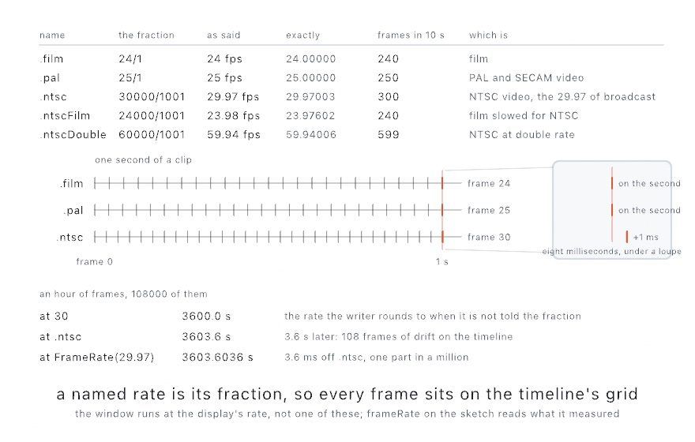

#### <sup>[Ollin](../README.md) → [Guide](README.md) → Chapter 38</sup>

---

# 38. Finishing a sketch

<!-- Hook image: the finished sketch, one keeper finished as a poster, a loop, and a plot, with its recipe read back. Waiting on the finished sketch and its render. -->

A sketch on your screen is a draft until it leaves as something that keeps. This chapter finishes one. A still can be drawn finer than it's saved, and motion leaves as video, a GIF, or a render slowed or settled first. Line work goes to a plotter, a machine's own G-code, embroidery, a shop drawing, or a show laser. A print can be separated into inks and proofed first, and a mesh can be printed, walked around, or looked into. A page can play the sketch in a browser, and a description can say what it shows. Every file comes from the sketch run on a fixed clock, so the same seed and frame make the same file every time. The recipe written into it brings that file back tomorrow.

## Leaving as files

<picture>
  <source media="(prefers-color-scheme: dark)" srcset="Images/38-FinishingASketch/ExportMap-dark.jpg">
  
</picture>

Every file export runs the sketch *headlessly*. No window opens, `setup()` runs, the clock advances to the frame you asked for, `draw()` runs, and the result is written. Because the offline clock is a fixed timestep, an export is deterministic. The same sketch, seed, and frame make the same file every time, however long the render takes. Sources follow the same clock. A video decodes by frame position, and an `AudioPlayer` feeds its analyzer the matching slice of its file each frame. Even an audio-reactive piece therefore exports with its beats in the same places. The flags live on any example's executable, and a loose sketch file gets the identical surface through the live host:

```sh
swift run OllinLive MySketches/Finale.swift --export poster.png --frame 200
swift run --package-path Examples Example-Basic-HelloCircle --export-sequence /tmp/out --seconds 5 --fps 60
```

`--export` writes one frame as a PNG, and `--export-sequence` writes every frame, lossless, ready for `ffmpeg` or an edit timeline. `--fps` takes a number or a broadcast name: `--fps ntsc` is 30000/1001 exactly, not 29.97. In code the same parameter is a `FrameRate`, and a plain number still stands in for one. Exports default to the best render quality (`.detail`), since a file has no frame rate to protect. `--render-quality` dials that down when you want a fast draft.

### Drawing finer than you save

Quality has a second dial, and it runs the opposite way from the first. `--render-scale 2` draws the frame at twice the width and twice the height. Then it averages every block of four samples back into one pixel. The file that lands is the size it always was. What changed is how much looking went into each pixel.

<picture>
  <source media="(prefers-color-scheme: dark)" srcset="Images/38-FinishingASketch/SamplingFiner-dark.png">
  
</picture>

The difference lives along the edges of filled shapes and the letters of outline text. Those reach the screen as triangles. Every pixel along an edge has to decide how much of one it covers, and more samples means a finer decision. Circles, rectangles, arcs, and every stroked line work their coverage out by formula instead. They are already as crisp as they will get, so the dial does nothing for them.

The cost is what the geometry says it is: four times the pixels at 2, sixteen at 4, which is the ceiling. That is a bad trade for a window that owes you a frame every sixteen milliseconds. It is a good one for a poster you will look at for a year.

```sh
swift run OllinLive MySketches/Finale.swift --export poster.png --render-scale 2
```

One thing the dial leaves strictly alone: a blur, a flare, and anything else you asked for with `postProcess` still measure in canvas pixels. A `.gaussianBlur(radius: 12)` is twelve pixels wide at every scale. A quality parameter that quietly resized your blur would not be a quality parameter.

### Rendering from code

Those flags are a command-line wrapper around one function, and the function is available to you directly:

```swift
if let frame = OllinApp.image(of: MySketch(), frame: 200) {
    // a CGImage, rendered with no window anywhere in sight
}
```

`OllinApp.image(of:frame:)` builds the sketch, runs `setup()`, advances the clock to the frame you asked for, renders, and hands back a `CGImage`. (`OllinApp.export` is that call plus a PNG writer, which is all `--export` is.)

This matters the moment you want to render *many* things, or render on your own terms:

- a contact sheet of twenty seeds,
- thumbnails for a catalog,
- a batch job over a folder of inputs,
- a test that checks a render hasn't changed.

All of them are a loop around this one call. None of them need a window, a display, or a person watching.

<picture>
  <source media="(prefers-color-scheme: dark)" srcset="Images/38-FinishingASketch/HeadlessCapture-dark.jpg">
  
</picture>

That figure is the call demonstrating itself. It's one sketch whose `draw()` renders a *different* sketch four times at four frames and lays out the results. A fresh instance is built per capture, so each render starts cleanly from `setup()`.

It's also how this guide is made. Every image you've seen in it is a committed sketch under `Guide/Figures/`. A small tool walks the folder and calls `OllinApp.image(of:frame:)` on each one. That's the reason nothing here can quietly rot. A listing that stops compiling fails the render. A figure that stops matching its prose is a file someone can open and run.

### The frame before the tone map

A PNG is the end of a road. The renderer composites in linear light, with numbers that run past white wherever a highlight is. The last step folds all of that into the range a screen can show, dithers it, and rounds it to eight bits per channel. That is the right file to look at. It is the wrong file to work on, because the part that was folded away is exactly the part a colorist reaches for.

`--export-exr` writes the frame one step earlier:

```sh
swift run OllinLive MySketches/StillLife.swift --export-exr frame.exr
swift run OllinLive MySketches/StillLife.swift --export-sequence /tmp/frames --seconds 2 --exr
```

What lands is an OpenEXR file, which is what compositing programs read. Its red, green, and blue hold the light itself. A highlight ten times brighter than white is still ten times brighter than white in the file. Its alpha holds the frame's coverage, the same transparency `background(.clear)` gives a PNG. If the sketch drew through a 3D camera, a fifth channel holds `Z`, the distance from the eye at every pixel, in the sketch's own units.

<picture>
  <source media="(prefers-color-scheme: dark)" srcset="Images/38-FinishingASketch/LinearFile-dark.jpg">
  
</picture>

That last one is worth sitting with. A compositor holding a depth channel can add fog after the fact, at a distance it picks. It can throw the background out of focus without the renderer knowing anything about lenses. A grade that pulls the exposure down finds the shape of a blown highlight instead of a flat white disk. None of it costs a re-render, which is the whole argument for the file.

The cost is size. It is written uncompressed, so a 1080 square frame with depth is about 14 MB, and a sequence adds up fast. Export the moments you need rather than the whole run. Two things are not in the file: surface normals and per-object mattes. Ollin shades in one pass and keeps no geometry buffer to write them from. `Examples/Export/LinearFrame` is a lane of glossy spheres under one hard lamp. It is built so both halves show: highlights ten times over white, and depth running from five units to the far plane.

## Motion: video and GIF

For a file you can post, skip the stitching and encode directly:

```sh
swift run OllinLive MySketches/Finale.swift --export-video finale.mp4 --seconds 12
swift run OllinLive MySketches/Finale.swift --export-gif finale.gif --seconds 4 --gif-width 540
```

Reach for video first, because it's almost always the right choice. The default `h264` plays everywhere. `--codec hevc` is better quality per byte when the file needs to be smaller. The two ProRes profiles are for edit timelines rather than for sharing. `--bitrate` (in Mbit/s) is the file-size dial, and a 1080-square piece looks clean around 10 to 15 in `h264`. The GIF is for the short loop. It's palette-limited and heavy per second, so keep it a few seconds and downscale with `--gif-width`. A piece where *every* pixel changes every frame defeats GIF compression entirely and balloons the file. The file is written as it is drawn, one frame at a time, so a long loop asks no more memory than a short one. The 256 colors are chosen from the first frame and kept, and a color that arrives later joins them on its own. `--gif-palette per-frame` picks a table for every frame, for a piece whose colors are never the same twice. A drifting full-canvas field is that kind of piece. [Chapter 3](03-MotionAndTime.md)'s perfectly looping phase tricks are exactly what a GIF wants.

### Leaving the background behind

A canvas that starts with `background(.clear)` leaves its background behind. The PNG gets an alpha channel, and so does the clip when the codec carries one. `--codec proRes4444` is the one for an edit timeline, and `hevcWithAlpha` makes a file a fraction of that size. The piece then lands over a camera feed or another layer in a compositing or VJ program rather than over black. `h264` has no alpha channel, so it composites over black and the export says so. The window paints the same frame over black too, so open the file to see the cut.

<picture>
  <source media="(prefers-color-scheme: dark)" srcset="Images/38-FinishingASketch/LeavingTheBackground-dark.jpg">
  
</picture>

The figure is one export drawn three times. The first panel is the PNG as an image editor shows it, with the checkerboard standing for the alpha. The second is the same file over another layer, which is what a compositor does with a `proRes4444` or `hevcWithAlpha` clip. The third is over black, which is what the window showed while you drew it and what `h264`, `hevc`, and `proRes422` keep. Look at the edge of the white ring in the first two. A pixel the ring half covers keeps the ring's white at half the coverage rather than turning gray. The bytes are premultiplied, which is what every reader of an 8-bit image with alpha expects. A blur or any other frame filter runs on that premultiplied frame, so it spreads the coverage along with the color. A live feed keeps the alpha as well. A Syphon client and a recording of a see-through canvas receive the frame with its coverage. In code, `VideoCodec.carriesAlpha` tells the two kinds of codec apart. `Examples/Export/Cutout` is the cluster of translucent lobes the figure was drawn from.

### The grid a broadcast asks for

A clip for a broadcast, a title for an edit, or a loop for a wall has a frame rate somebody else chose. `--fps` takes a number, but it also takes a name, and the name is the safer thing to type when the number is a fraction:

```sh
swift run OllinLive MySketches/Spot.swift --export-video spot.mp4 --seconds 30 --fps ntsc
```

`ntsc` is 30000/1001, the 29.97 of broadcast. `film` is 24, `pal` is 25, `ntscFilm` is 24000/1001, and `ntscDouble` is 60000/1001. In code the same parameter is a `FrameRate`, and a plain number still stands in for one, so `fps: 60` reads as it always did. `FrameRate(30000, per: 1001)` spells any other fraction, `frameDuration` is one frame's length in seconds, and `frames(in:)` is the count an export of that many seconds writes.

<picture>
  <source media="(prefers-color-scheme: dark)" srcset="Images/38-FinishingASketch/BroadcastGrid-dark.jpg">
  
</picture>

A name is the exact fraction, not its decimal. The video writer puts every frame on that fraction. At `.ntsc` the frames sit at multiples of 1001/30000 of a second rather than of 1/29.97. The loupe in the figure shows what that means. The thirtieth frame lands a millisecond past the second because that is where the grid puts it, and a broadcast timeline has the same grid. The foot of the figure is the failure a decimal invites. A writer that is not told the fraction rounds the frames onto a plain 30. A clip meant to run at 29.97 is then 3.6 seconds off by the end of an hour, 108 frames off its timeline. The named rate carries its fraction into the file's own clock, so nothing rounds. `FrameRate(29.97)` is the decimal as written, 2997/100, which differs from `.ntsc` by one part in a million. That is a tenth of a frame an hour, and a different rate, so name the broadcast rate when that is the one you mean. Every number in the figure is read from `FrameRate` itself. The live window runs at the display's rate, not one of these, and `frameRate` on the sketch reads what it measured.

## Slower than it happened

Some pieces move faster than the eye can follow. A collision, a burst, the half-second where the whole thing resolves. On screen you can only watch it again. In a file you can slow it down:

```sh
swift run OllinLive MySketches/Finale.swift --export-video slow.mp4 --seconds 4 --slow-motion 4
```

That renders four seconds of the sketch's own time and writes sixteen seconds of video. Nothing about the file changes: it still plays at its `--fps`. What changes is how many frames cover the run. The clock steps four times finer, so the sketch is asked for the moments in between. The motion then takes four times as long to play.

<picture>
  <source media="(prefers-color-scheme: dark)" srcset="Images/38-FinishingASketch/SlowerThanItHappened-dark.jpg">
  
</picture>

`--seconds` still counts the sketch's own time, as it always has. The export prints both numbers so you never have to work it out.

There is one trap, and it is worth knowing before you reach for this. **Motion measured in seconds slows down. Motion measured in frames does not.** A radius built from `sin(time)` is a function of the clock, so a finer clock slows it. So is a position advanced by `speed * deltaTime`. But a position advanced by a fixed step once per `draw()`, with no `deltaTime` in it, moves the same amount per frame however fast the clock runs. Give it more frames and it simply arrives at the same place at the same time. If your slow-motion export came out at ordinary speed, that is why, and [Chapter 3](03-MotionAndTime.md)'s `deltaTime` is the fix.

There is a second way, for when the first is too slow or your motion is measured in frames:

```sh
swift run OllinLive MySketches/Finale.swift --export-video half.mp4 --seconds 4 --slow-motion 2 --made-frames
```

`--made-frames` draws the frames it would have drawn anyway, and asks the GPU to build the ones in between out of the pair on either side. It is the same interpolator a live window can use. It hands you pictures your sketch never drew, so it says so on the console and writes `"madeFrames":true` into the file's own recipe. It needs a 3D scene under a perspective camera, and it does half speed only. Use it when a frame is expensive to draw, and use the drawn form the rest of the time. The full comparison is in [`Docs/Output/Export.md`](../Docs/Output/Export.md#slow-motion).

## Settled, then written

One more dial belongs beside these two, for the pictures that are not finished by one draw. A running mean, the `Accumulator` from [Chapter 19](19-LayersAndEffects.md) or a `LineSpray` through a lens, starts grainy and settles as the frames pile up, and it starts over the moment the camera moves. In a video of a turning scene every frame has a new camera, so every frame is the grainy first one. `--settle N` draws each written frame N times with the clock held, and writes the last:

```sh
swift run --package-path Examples Example-Rendering-LineSpray --export-video turn.mp4 --seconds 10 --settle 40
```

The clock does not move during the held draws, so a camera written against `time` stays put while the mean converges underneath it, and then the clock steps on. It costs N times a plain export, which is what a settled frame costs. The [export reference](../Docs/Output/Export.md#settled-frames) has what it refuses (a take, made frames) and why a piling `noClear` canvas is the one thing it does not settle.

## Vector: the plotter path

[Chapter 15](15-ShapesAsMaterial.md) promised that shapes held as geometry could leave as geometry, and `--export-svg` is that promise kept:

```sh
swift run OllinLive MySketches/Plot.swift --export-svg plot.svg
swift run OllinLive MySketches/Plot.swift --export-svg plot.svg --hatch
```

The exporter records each draw call at its own level, before any pixels exist. Circles become `<circle>`, polylines `<polyline>`, and shapes and outline text `<path>` with their fill rules. Transforms and opacity stay intact. The file opens in a browser, Inkscape, or Illustrator, and feeds a pen plotter's tooling directly. Since a pen has no fill, `--hatch` turns solid fills into parallel line work spaced by tone. Add `--cross-hatch`, or set `--hatch-spacing` and `--hatch-angle`. Stroke fonts and stroked geometry pass through as the single lines they already are. Images are the one thing that can't come along, because a vector file has no place for them.

The same recording writes as a **PDF** with `--export-pdf plot.pdf`, and that is the path to paper. One canvas pixel maps to one PDF point, so the paper presets on `CanvasSize` come out true to size. Declare `override var canvasSize: CanvasSize { .a4 }` and the exported page *is* that sheet, vector-sharp at any printer's resolution. `.usLetter` and `.a5` are there too, and `.landscape` turns the sheet. If the raster export should be print-grade too, `.a4.dpi(300)` renders the pixels at 300 dots per inch. The PDF page stays exactly A4. Everything the SVG carries, the PDF carries the same way, hatching included.

## A 3D scene on the plotter

A vector file has nowhere to put a lit surface, so everything [Chapter 25](25-3DGently.md) and [Chapter 26](26-Meshes.md) drew stops at the raster. `lineDrawing(of:)` is the way across. It takes the same meshes and the same camera and hands back 2D paths: the lines a draughtsman would draw, with everything the surfaces hide taken out.

```swift
camera(Camera3D(eye: Vector3(6, 4, 7), target: .zero))
stroke(.black)
noFill()
for line in lineDrawing(of: scene).paths {
    drawPolyline(line.points, closed: line.isClosed)
}
```

<picture>
  <source media="(prefers-color-scheme: dark)" srcset="Images/38-FinishingASketch/SceneAsLines-dark.jpg">
  
</picture>

Three kinds of line are kept, and between them they are what makes a drawing rather than a wireframe. The **silhouette**, where a surface turns away from the camera, which is the outline of a ball or a cylinder. A **crease**, where two faces meet at more than `creaseAngle`, which is the edge of a cube and the rim of a cap. And a **boundary**, where a surface ends. The tessellation inside a smooth surface is left out, which is why the ball above is a circle rather than a net. Lower the crease angle and gentler ridges start to show; set it to 0 and every edge is kept, which is the wireframe.

Everything handed to one call hides everything else in it, which is why it takes an array of meshes rather than one at a time. `Mesh.transformed(by:)` puts each where it belongs first, taking the same `MeshInstance` the instanced draws take. Two separate calls are two drawings that know nothing of each other, and the near one will not hide the far one.

The paths are ordinary line work, so everything in this chapter applies to them: `--export-svg` for the plotter's own tooling, `--export-gcode` to drive the machine directly, `--export-dxf` for the shop. They are also just paths on the canvas, so a brush, a wobble, or a hand-drawn stroke can go on them, which is how a technical drawing stops looking like one.

What the drawing leaves out is kept: `lineDrawing(of:).hidden` is the covered stretches, and drawing them faintly, or dashed, is the draughtsman's way of showing what is behind. That is the left panel above. The full reference is [`Docs/3D/LineDrawing.md`](../Docs/3D/LineDrawing.md).

## A page that plays it

A video carries pixels, and a page can carry what made them. `--export-web` records what the sketch draws over a duration, frame by frame at a fixed rate. It writes a page that plays the recording back in a browser:

```sh
swift run OllinLive MySketches/Ring.swift --export-web ring.html
swift run OllinLive MySketches/Ring.swift --export-web ring.html --inline
```

The recorder writes down the shape records the renderer would have received each frame. Nothing is rendered on the Mac, so nothing GPU-specific lands in the file. The page draws those records with the framework's own shape shader, carried from Metal to GLSL. The rewriter that does it is the one that brings [somebody else's shader](18-YourFirstShader.md#somebody-elses-shader) the other way. A frame on the page is the frame `--export` would have given you. A sketch that declares `loopDuration`, as [Chapter 3](03-MotionAndTime.md) taught, records one lap with no length given, and the page wraps it without a seam. On a lap, each motion is fitted to the sines it is made of, so the page evaluates it at any time from a few numbers. A parameter driven by a [formula](../Docs/Helpers/Formula.md) crosses as the formula, worked out live on the page's own clock and pointer. What fits neither travels as samples, and the page interpolates between them, so a slow motion records well at ten frames a second.

<picture>
  <source media="(prefers-color-scheme: dark)" srcset="Images/38-FinishingASketch/PageFromRecords-dark.jpg">
  
</picture>

The figure follows one ring of circles across. On the left is the frame the Mac renders. In the middle is what the recorder wrote instead of pixels. Twelve circles a frame, at thirty numbers each. The parts that never change are stored once, and the three that move are kept as columns. The sketch declared a lap, so each column is fitted to the sines it is made of. The page then works the motion out at any instant rather than stepping between frames. On the right is the page. Its canvas is drawn from those records by the framework's own shape shader carried to GLSL. Under it are the three parameters the exporter found it could wire, offered as a slider and two color wells. The size on the arrow is measured by asking for the page and counting its bytes. Most of it is the player and its shaders rather than the ring.

The first form is one self-contained file: open it, host it, drop it in an `iframe`. The second, `--inline`, is the canvas and one script block with no page around them, for a page you already have. Paste the two together where the picture belongs. The script leaves a handle on the canvas, `canvas.ollin`, that plays, pauses, and seeks. A reader whose system asks for less motion sees the first frame, still.

The sketch's parameters cross as controls. After the recording, the exporter probes each `@Param`: it sets the parameter to a few other values on a fresh sketch, records again, and fits what moved to a line in it. Every parameter whose every effect fits is offered, a slider, a stepper, a switch, a color well, laid out under the canvas in the standalone page and reachable through the handle in the inline one, so a page can set the sketch's colors to its own theme. Moving one moves the picture the way the Mac would have drawn it at that setting. A parameter that changes what is drawn, or moves a number some other way than along a line, stays at its recorded value, and the exporter says which and why.

What crosses today is the closed analytic shapes, with their fills, strokes, and transforms. Every stroke and fill of [Chapter 15](15-ShapesAsMaterial.md) crosses too: lines, polylines with their joins, beziers, polygons, shapes with holes, and outline text. A stroke crosses as the points and the style you gave it, and a polygon or a shape as its contours. The page expands them into the triangles the Mac would have drawn, through the framework's own expander compiled to WebAssembly, so a dense line drawing weighs its points rather than its bands. Outline text, and a fill under a gradient, cross as their triangles instead, a stroke with its anti-aliasing coverage on every vertex. A fill's edge is anti-aliased on the page through the same four samples the Mac uses. A blend mode crosses with them. The layered effects of [Chapter 19](19-LayersAndEffects.md) cross too: a layer drawn off-screen, every generator, the filters and combines that are one pass, a blur, and a bloom. So does a shader of your own from [Chapter 18](18-YourFirstShader.md), running live on the page's clock and pointer, and a `Visual` chain with it. A feedback layer keeps its state on the page, and so does a field like the reaction-diffusion of [Chapter 23](23-GridSimulations.md), which steps there. The fragment behind each effect is cut out of the framework's Metal with everything it reaches and rewritten to GLSL, so the page's blur is the framework's blur. A picture of [Chapter 9](09-Pictures.md) crosses once, as the file you loaded or as a PNG of its pixels. Text through the glyph atlas crosses as its quads over the font's page. So a wall of body text and a photograph both play on the page, and a gradient on a shape crosses with its ramp. The fields of [Chapter 30](30-SculptingWithFields.md) cross too: a composed field as its program, walked on the page by the same machine, and a raymarched field with its camera and its lights, the melt traced and lit on the page as it was on the Mac, down to the self-shadow under `castShadows()`. A clip, a picture that is a live texture, a mesh, or a field under an environment stops the export before a file is written. So does an effect that is a solve on the Mac. The message names the call and the frame it was met at, and those sketches leave as video. A page has a weight too: past 25 MB the exporter stops, says which part of the page is heaviest and whether fewer frames would take it away, and names the flag that writes the page anyway. The page's own reference is [`Docs/Output/Web.md`](../Docs/Output/Web.md).

## Driving the machine itself: G-code

An SVG hands your drawing to a machine's own tooling. Many machines skip the tooling: hobby plotters, laser cutters, and CNC routers run on G-code, a program of moves in millimeters. `--export-gcode` writes one from the same recorded frame:

```sh
swift run OllinLive MySketches/Plot.swift --export-gcode plot.gcode
swift run OllinLive MySketches/Plot.swift --export-gcode cut.gcode --gcode-machine laser
```

A machine needs real units, so the export asks for a physical width, the way a 3D print asks for its size. The flag maps the canvas to 150 mm wide unless `--gcode-width` says otherwise. In code, `GCode(.plotter(), width: 150)` carries the finer parameters: the pen lift, a laser's power and passes, a mill's depth per pass. A named sheet spares the arithmetic. `GCode(.plotter(), paper: .a4)` fits the drawing inside an A4 page with ten millimeters clear on every side, holding its height as well as its width. `--gcode-paper a4` does the same from the command line. Only line work travels. A stroke plots along its centerline and a fill contributes its outline, with `--hatch` shading fills exactly as it does for SVG.

<picture>
  <source media="(prefers-color-scheme: dark)" srcset="Images/38-FinishingASketch/OnTheSheet-dark.jpg">
  
</picture>

The figure plans one rose curve onto four sheets through the same planner the flag uses, and prints the size each came to. On A4 with the default margin the drawing is 190 millimeters square, the sheet's width less ten on each side. On A3 lying wide with a fifteen-millimeter margin, the sheet's height is the tighter fit. The drawing comes to 267 and sits at the left. The third sheet shows the rule the other way. A canvas twice as tall as it is wide scales down to the 277 millimeters an A4 leaves for height and comes out 156 wide. The drawing keeps the margin corner as its origin either way. That is why a narrower fit sits at the left of the page rather than centered on it. The program's header names the sheet. `PaperSize` carries the ISO A series from `.a0` to `.a6` and the US `.usLetter`, `.usLegal`, and `.usTabloid`, all portrait like the sheet in the ream. `.landscape` turns one, and `PaperSize(width:height:)` spells a size that is not on the list. `DXF(paper:)` and `--dxf-paper` size a shop drawing the same way.

The exporter plans the route before it writes a move. Open paths whose ends touch merge, so the pen stays down across them. Then a nearest-neighbor walk reorders the paths to keep the pen-up hops short:

<picture>
  <source media="(prefers-color-scheme: dark)" srcset="Images/38-FinishingASketch/MachineRoute-dark.jpg">
  
</picture>

The planner is public. `GCode.toolpath(_:in:)` returns the route as plain contours, with the drawn and travel lengths measured in millimeters. The `Export/Toolpath` example draws its own route and walks a pen along it at machine speed. One habit applies to a program from any tool: give it a dry run first, pen out, laser disarmed, cutter above the stock. [G-code](../Docs/Output/GCode.md) has the three machine profiles and every parameter.

## Thread instead of ink: embroidery

An embroidery machine is a plotter that sews. It moves a hoop under a needle, and every move ends with the needle going down. Ollin writes a frame as those moves, in the `.dst` file nearly every machine reads.

<picture>
  <source media="(prefers-color-scheme: dark)" srcset="Images/38-FinishingASketch/StitchPlan-dark.jpg">
  
</picture>

```swift
try OllinApp.exportEmbroidery(sketch, to: "leaf.dst", settings: Embroidery(width: 100))
```

```sh
swift run --package-path Examples Example-Export-Embroidery --export-embroidery leaf.dst
```

Three things change on the way from pixels to thread. A stroke becomes a running stitch: penetrations along the line, no farther apart than `stitchLength`, with every corner hit exactly. A fill becomes rows of running stitch across it, `fillSpacing` apart and connected end to end, so the thread stays down. And every color becomes a thread of its own, in the order you drew them. A `.dst` holds no colors, only stitches, jumps, and the stops between threads, so you load each thread as the machine asks for it. What you drew later is sewn later, and lies on top.

The width is yours to give, as it is for G-code, because a hoop has real millimeters. Between two paths the thread is sewn across when the hop is within the pitch, and carried over in a jump when it is not. The planner reorders the paths within each thread to keep those jumps short. The plan is public, so a sketch can draw its own stitches before anything runs, which is what the figure does. [`Docs/Output/Embroidery.md`](../Docs/Output/Embroidery.md) has the parameters and the things to check before you sew.

## A drawing for the shop: DXF

A laser shop, a waterjet, or a sign maker does not run your program. It opens a drawing in its own software and sets up the job there. That software reads DXF, the drawing exchange file, and it tells one job from another by the layer a line sits on. `--export-dxf` writes the frame as that drawing, with each color on its own layer:

```sh
swift run OllinLive MySketches/Panel.swift --export-dxf panel.dxf
```

```swift
try OllinApp.exportDXF(sketch, to: "panel.dxf", settings: DXF(width: 150))
```

<picture>
  <source media="(prefers-color-scheme: dark)" srcset="Images/38-FinishingASketch/LayerStack-dark.jpg">
  
</picture>

So the sketch's colors are the handle. Draw the outline in one color, the fold lines in another, and the engraving in a third, and the file arrives sorted into the three jobs. A layer is named by its color's bytes, `color-1B1040`, and carries the nearest of the nine colors a drawing can show, so the shop sees the same three colors you did.

The width is yours to give, as it is for G-code, because a drawing on a shop's screen has real millimeters. Strokes arrive as lines and polylines along their centerlines, and fills as their outlines, unless a hatching turns them into line work. A circle that nothing has skewed stays a circle, which a cutter drilling a hole prefers. Paths whose ends touch merge into one, and a clip cuts the work as it cuts the render. [`Examples/Export/Drafting`](../Examples/Export/Drafting/Sketch.swift) draws a box panel that way and lists the layers beside it, read from the planner. Whatever wrote the drawing, check its size against the material in the shop's software before anything moves.

## Drawing with light: a show laser

A laser draws with one moving dot. Two mirrors steer the beam. A fixed clock decides how often they are told where to point, and at each of those points the beam is lit or dark. Nothing in a laser holds a picture. What you see is one dot going round a loop fast enough that your eye keeps the whole shape.

That makes the geometry from [Chapter 15](15-ShapesAsMaterial.md) exactly the right material. `import OllinLaser` sends it:

```swift
import OllinLaser

let laser = LaserProjector(etherDream: "192.168.1.50")

override func setup() {
    laser.connect()
    laser.arm()                       // nothing goes out before this
}

override func draw() {
    background(.black)
    var frame = LaserFrame(canvas: bounds)
    frame.add(ring, color: .green)
    laser.send(frame)
    drawLaserPreview(laser.stream)    // watch it on screen too
}
```

A frame holds paths in canvas coordinates, the same numbers every drawing call takes. A `Shape` contributes its outlines. There are no fills in a laser, so shade a region with `Hatching`, the way the plotter does.

Between that frame and the projector sits the part worth understanding:

<picture>
  <source media="(prefers-color-scheme: dark)" srcset="Images/38-FinishingASketch/BeamPath-dark.jpg">
  
</picture>

Points are spread evenly along each line, so the beam moves at a steady speed and the line looks even. A few points are held at a sharp corner, because the mirrors have mass and would round it off otherwise. Between two shapes the beam goes dark and the mirrors travel. Points are held at both ends of that jump too. Otherwise the beam lights while the mirrors still move, and drags a tail across the gap. The shapes themselves are then visited near to near, since dark travel is time that buys nothing.

Time is the whole budget. The point rate divided by the frame rate is every point a frame can hold. At 20,000 points a second and 30 frames a second, that is about 660. Past it the frame still plays whole and repeats more slowly, which the eye reads as flicker. `stream.isOverBudget` says when you are there. Draw less, or set `spacing` wider.

The last part is not about pictures at all. A projector puts real power into a beam, and the mirrors are the only thing spreading it. So **a `LaserProjector` sends nothing until you call `arm()`**. Under that gate the brightness starts at half. A beam that stops moving is blanked, and so is a frame the sketch stopped feeding. Give the first run the same courtesy you give a cutter: low power, pointed at a wall, nobody in the beam.

The **LaserPreview** example is that preview with the parameters attached, and it runs with no hardware at all. [Laser](../Docs/Integration/Laser.md) has the rest, including the ILDA file that reaches a rig this library does not talk to directly.

## Printing one ink at a time: separations

Some presses can't print a full-color image at all. A risograph or a screen-printing rig lays down one ink per pass. It needs you to hand it a separate grayscale plate for each one. If you have never prepared work for that kind of press, the mental model is the useful part.

<picture>
  <source media="(prefers-color-scheme: dark)" srcset="Images/38-FinishingASketch/Separations-dark.jpg">
  
</picture>

Each ink gets a **master**, a grayscale image where black means "lay down full ink here" and white means "leave the paper bare". The press runs the paper through once per master, and the inks stack up. Because printing inks are translucent rather than opaque, overlapping them mixes: pink over blue makes a purple neither drum could print alone. That's why the three plain-looking plates above produce a picture with more colors in it than three. The plates are worth reading against the photograph: the flowers take nearly all the yellow drum has, the blue one leaves them bare and spends itself on her instead, and the pink drum runs mid-gray almost everywhere, which is what a warm picture asks of it.

```swift
override var printInks: [Ink]? { [.fluorescentPink, .blue, .yellow] }
```

Declare that on your sketch, export with `--export-separations`, and you get one master per ink plus a preview with registration marks on it. That preview is the sheet you check before committing to paper. Working the other way round, `artwork.separated(into:)` does the same job to any `Image` in code. You can look at the plates while you compose.

The interesting part is what happens for a color no single ink can make. Ollin searches for the combination of ink coverages whose overprint comes closest. It judges the way your eye judges, rather than by raw numbers. The space is the same perceptual one [Chapter 2](02-Color.md)'s color mixing uses. Draw in an ink's own color and it separates exactly. Draw anything else, including gradients and photographs, and it lands on the nearest mix those drums can actually reach.

One practical note carries over from [Chapter 9](09-Pictures.md)'s halftone. A press cannot hold a dot smaller than about two percent coverage. Anything fainter drops to bare paper rather than becoming invisible speckle. `separation.halftoned(pitch:)` rotates each ink's dot grid to its own angle, so the drums overprint into a rosette instead of a moire. `PrintSeparation.screenAngles(for:)` tells you which angle each ink got. `separation.dithered()` is the grainier alternative. [Print separations](../Docs/Output/PrintSeparations.md) has the full ink catalog, plus the screening details. The catalog carries the community-measured colors of the standard risograph line.

## Seeing the print before you print it

A screen makes color with light. A press makes it with ink on paper, and the screen wins. The electric cyan you picked in [Chapter 2](02-Color.md) is not a color four inks can lay down. It reaches the press and comes back as the nearest thing ink can do.

You can find that out on paper, a week later, at your own expense. Or you can ask first.

<picture>
  <source media="(prefers-color-scheme: dark)" srcset="Images/38-FinishingASketch/ProofBeforePrint-dark.jpg">
  
</picture>

A **profile** is a file that describes what one device does with color. Your shop hands you theirs for the press and paper the job will run on. Ollin carries a generic four-ink one for when you have not asked yet:

```swift
var press = SoftProof(.genericCMYK)     // or ICCProfile(contentsOf: theShopsFile)
postProcess(.softProof(press))          // the canvas, as it will print
```

That is a **soft proof**. Every color on the canvas is carried into the press's profile and back out again. Whatever comes home changed is exactly what the press is going to change. It runs on the GPU, so you can leave it on while you work and watch the piece the way the paper will hold it.

Two things always move on that trip. Saturated colors come back duller, because ink covers less ground than a lit screen. Blacks come back lighter, because ink on paper is not as dark as a black pixel. Ollin shows you both rather than flattering the picture. Paper color is the third, and you have to ask for it: `press.simulatesPaper = true`. A proof of cream stock reads as a wrong-looking white until you are expecting it.

The proof shows what changes. The **gamut check** names what is unreachable at all, which is the third panel above:

```swift
postProcess(.softProof(press, warning: .magenta, amount: 0))   // flag it, change nothing
artwork.outOfGamutFraction(press)                              // 0…1, how much is at risk
```

Print that fraction while you tune a palette. A few percent is ordinary. A third of the canvas means you are drawing in colors that will not survive, and it is easier to hear that now. The marigolds above are past half. A wall of cempasúchil is exactly the orange four inks reach for and miss, which is why the third panel is mostly gray.

When the sketch is ready, the same profile splits it into **plates**, one grayscale image per ink, black where that ink lands:

```swift
override var printProfile: ICCProfile? { .genericCMYK }
```

Declare that and `--export-plates poster.png` writes the four plates plus the proof, with registration marks, exactly as `--export-separations` does for spot inks. The separation also reports **total ink**, the sum of all four coverages at the heaviest spot. Ask your shop what they will take. Around 300% is usual for coated paper, and newsprint gives up sooner.

Both paths lead to a press, and the profile is what tells them apart. Spot separations are for a shop printing one named ink at a time, where no profile exists and Ollin has to model the overprint. Plates are for a press whose behavior has actually been measured, where there is nothing to model and the profile answers directly. [Print color](../Docs/Output/PrintColor.md) has the intents, the installed-profile lookup, and the screening.

## Something you can hold: a 3D print

A plotter turns a `Contour` into ink on paper. A 3D printer does the same job for a `Mesh`, and the call is just as short:

```swift
sculpture.normalized(scale: 60).write(to: "sculpture.3mf")
```

`normalized(scale: 60)` is doing the work that matters. A mesh carries bare numbers, and a printer needs millimeters. So this centers the shape on the origin, where a build platform wants it, and fits its longest side to 60 mm. The extension picks the format, and the file records that size.

Then there is the thing nobody warns you about, which is that a shape can look completely finished and still be unbuildable. A printer has to decide, for every point in space, whether it is inside the object or outside it. It can only answer that if the surface actually closes. Here are two copies of the same knot, one swept closed and one left open at its ends:

<picture>
  <source media="(prefers-color-scheme: dark)" srcset="Images/38-FinishingASketch/Fabrication-dark.jpg">
  
</picture>

On screen an open surface is exactly as convincing as a closed one. A printer is the first thing that ever disagrees.

So ask before you commit to plastic:

```swift
let check = sculpture.printCheck()
print(check.summary)        // "9360 triangles, 60.00 x 52.50 x 26.02 units: ready to print"
```

`printCheck()` reports whether the surface closes and whether neighboring triangles agree on which side is out. It also reports whether the whole thing is inside out, and how big the file says it is. When something is wrong, `problems` says so in words rather than numbers. A mesh that fails is still written, with a note. An open surface is a perfectly good thing to draw, and only fabrication needs it sealed.

Starting from a shape that closes by construction saves the repair work entirely. [Chapter 30](30-SculptingWithFields.md)'s metaballs and isosurfaces close by definition, since a field has an inside. So do the solid primitives and a tube swept with `closed: true`. A plane, or a lathe without caps, does not.

One last thing happens quietly on the way out. Ollin's meshes are flat-shaded. Every triangle carries its own three corners, so each face can hold its own normal, and neighboring triangles share no vertex at all. Read as a solid, that is not a surface with a few holes in it, it is nothing but holes. The writers merge those duplicate corners first and settle the winding against the mesh's own normals. They also stand the model up on z. Ollin's world is y-up and a build platform is not. You get a solid without having to know any of that, which is the point. See [Fabrication](../Docs/Output/Fabrication.md) for the details. `Examples/3D/Geometry/Fabrication` is the knot above, with parameters.

## Something you can walk around: USDZ

A printer takes one mesh. A whole 3D scene has somewhere else to go:

```sh
swift run Example-3D-Geometry-Solids --export-usdz piece.usdz
```

USDZ is the format Apple's platforms read without being asked. Double-click the file and Quick Look opens it. Send it in a message and it opens there too. Tap the AR button and the piece stands on the floor in front of you at whatever size the file says it is. Drop it into a visionOS app and it is already a model.

The thing to notice is what changed about the artifact. The stills, videos, and drawings above are *pictures of* the sketch, taken from where the camera happened to be, and the 3D print is one mesh out of it. This one is the whole scene. Whoever opens it picks their own angle.

Any `Scene` writes the same way, including one you loaded or built by hand:

```swift
scene.write(to: "piece.usdz")
```

And a frame becomes a scene when you ask for it:

```swift
let scene = OllinApp.spatialScene(of: sketch, frame: 120)
```

That hands back an ordinary `Scene`, the same kind [Chapter 26](26-Meshes.md) loaded from a file. You can look at what your own frame is made of, move a node, and write it out. One writer serves both paths, which is why the file and the frame cannot disagree.

Here is a frame drawn the ordinary way, beside the same frame written to a `.usdz` and opened again:

<picture>
  <source media="(prefers-color-scheme: dark)" srcset="Images/38-FinishingASketch/SpatialExport-dark.jpg">
  
</picture>

The surfaces come back exactly. The dust does not, and that is the rule worth carrying: **a model file holds surfaces**. Meshes travel, with their transforms, their colors, their textures, and as much of their finish as the format has a slot for. The camera and the lights travel too. A point cloud, a GPU particle system, and a raymarched field are not surfaces, so they stay behind. So does 2D drawing, which is why a labeled diagram arrives without its labels. Ollin prints one note for each thing it left, rather than letting you find out later.

If you want a field or a cloud to travel, give it a surface first. [Chapter 30](30-SculptingWithFields.md)'s `isosurface(at:in:field:)` and [Chapter 33](33-DepthAndThePhone.md)'s `particleSurface(of:)` turn one into a mesh, and a mesh always goes.

One number decides whether the model is furniture or a paperweight:

```swift
scene.write(to: "piece.usdz", metersPerUnit: 0.05)
```

A model file records how big one scene unit is, and nothing is scaled on the way out. At the default of 1 a sphere of radius 1 arrives two meters across. Most 3D sketches work at unit scale. Something between `0.01` and `0.1` is usually what you want for a piece someone will set on a table.

Lighting is the one place a spatial export deliberately gives something up. The lights travel, but an [environment](../Docs/3D/3D.md#environment-lighting) does not. A viewer supplies its own, and in AR that viewer is a camera looking at your actual room. A metal surface exported this way reflects wherever it ends up, which is a better answer than the studio it was made in. [Spatial](../Docs/Output/Spatial.md) has the full list of what carries. `Examples/3D/Geometry/SpatialExport` is a ring of solids with a save key.

## Something you can look into: spatial video

A model hands over a scene and lets someone choose an angle. That works because the scene is still. Motion cannot be handed over that way, so it gets handed over differently. It is recorded from two eyes at once, the way you already see the room you are sitting in.

```sh
swift run Example-3D-Geometry-SpatialVideo --export-spatial piece.mov --seconds 8
```

That writes **spatial video**, which is the format Apple's platforms record and play with real depth. Everything about the drive is the export you already know, the same fixed clock and the same determinism. The difference is that each frame is rendered twice, from two cameras a little way apart. The two views travel together in one file.

Two numbers decide what that looks like, and neither is a setting you get right or wrong. They are composition.

<picture>
  <source media="(prefers-color-scheme: dark)" srcset="Images/38-FinishingASketch/StereoPair-dark.jpg">
  
</picture>

**Convergence** is the distance at which the two eyes agree, and the diagram is what that means. Follow a line from each eye through an object to the screen: those two landing places are where each eye sees it. For something sitting at the convergence distance they land together, so it appears *on* the screen. For something nearer, the lines have already crossed by the time they get there, and the marks come out the wrong way round. Your eyes read that as an object in front of the screen, poking out. Farther away, the marks spread apart the ordinary way and the object sits behind. So choosing the convergence distance is choosing what the viewer is looking *into* rather than *out at*.

**Interocular** is how far apart the eyes stand, in world units, and it is the depth dial. Half reads flatter. Twice reads deeper, then starts to hurt. Left alone, Ollin puts the eyes 1% of the frame width apart, and that rule has a reason. It works out to the far background separating by 1% of the frame too. That is less than a viewer's own eyes span, so nothing ever asks them to point outward. Pointing outward is the one thing stereo must never do.

A sketch declares both the way it declares a loop:

```swift
override var stereoGeometry: StereoGeometry {
    StereoGeometry(interocular: 0.1, convergence: 6)
}
```

Leave either one out and it is worked out from the camera. The convergence distance defaults to whatever the camera is already pointing at. The reasoning is that you are looking at the thing the sketch is about. Either can also be overridden for one export with `--interocular` and `--convergence`, which is the fastest way to find out what they do. Push the near pillar of that example until it stops being pleasant, and you will have learned more than this section can tell you.

One detail is worth knowing because it explains something that could otherwise look like a bug. The frame is **drawn once and rendered twice**. Not drawn twice. Drawing again would roll the sketch's randomness a second time, and step every simulation a second time. Some of them are honest about not repeating exactly, so the two eyes would end up looking at different worlds. One draw, two cameras, and both eyes see the same instant.

The consequences of that are worth reading as rules. Anything the sketch already flattened while drawing keeps its one answer. A `project()`, a `depth(at:)` placement, and a billboard are all that kind of thing. Each lands flat on the screen plane in both eyes, which for captions and overlays is usually what you want. A 2D sketch has nothing to disagree about and comes out flat, and says so. So does an accumulating sketch, because its pile lives in one surface and there is only one of it.

Finally, the file records how far apart the eyes that shot it really were, so a player can scale the depth it shows. `--meters-per-unit` is how you say what a world unit is, exactly as for a model. [Spatial](../Docs/Output/Spatial.md#spatial-video) has the rest. `Examples/3D/Geometry/SpatialVideo` is a colonnade built to have depth worth recording, with both numbers on parameters.

## Reproducibility is part of the piece

A shared render is better when it can be *re-made*. Three habits from earlier chapters do the work here. Seed the randomness (`seed(…)` in `setup()`, [Chapter 4](04-Randomness.md)), so the export and the re-export are the same artwork, not siblings. Copy tuned `@Param` values back into their declarations once they feel right, because a headless export reads the defaults written in code, not the inspector. A value you want for one render only can ride the command line instead, which is the next section. And share the `.swift` file alongside the render when you can. In Ollin the sketch is the artifact. A reader holding the source holds the whole piece, seeds, parameters, and all.

The exports meet you halfway. Every PNG, SVG, PDF, and video Ollin writes carries a small **recipe** in its metadata. It holds the seeds the run used, the value of every `@Param`, and the git commit the code was at. The commit is marked dirty if you had uncommitted edits. It also records which frame at which rate produced it.

Image metadata has existed for decades, in the same place a camera writes its shutter speed and lens. Ollin puts something more useful there. Read it back with any metadata tool:

```sh
exiftool -Description poster.png
```

This matters when you need to recover a past render. You find an image from four months ago that you like. You have no memory of which of eleven variations produced it, and the sketch has changed since. The file tells you: seed 48213, these parameter values, that commit. Check out the commit, pass the seed, and you have it back.

One limit stays. GIF has no metadata slot in its format, so a GIF export carries nothing.

The other one has a fix. A recipe takes you back to the code only if that code still exists. Uncommitted edits often do not: the commit is marked dirty, and the next save overwrites what you rendered. Add `--capture-source` to any export and the code is kept for you.

```sh
swift run --package-path Examples Example-Randomness-Variations --export keeper.png --capture-source
```

Your working tree goes into the repository as a commit that sits on no branch, and the file is named after it. `keeper.png` becomes `keeper-93ae989.png`. Nothing you own moves: your branch, your index, and your edits are exactly where you left them. Months later the file name is enough to get the code back.

```sh
git show 93ae989:Sketch.swift
```

See [the details](../Docs/Output/Export.md#reproducibility-metadata) for every field the recipe holds, and [captures that know their source](../Docs/Output/Export.md#captures-that-know-their-source) for the rest of that flag.

### Passing the parameters back in

Reading a recipe is half of it. The other half is handing those values back to a run.

`--param name=value` sets one declared parameter for this run. It repeats, so a run carries as many parameters as you need.

```sh
swift run --package-path Examples Example-Live-Parameters --export keeper.png --param radius=40 --param paper=#101018
```

Each value is read against its own parameter. A number stays a number. A color is a hex string. A vector is two numbers with a comma between them. A menu choice is its name, spelled loosely: `easeOut`, `ease-out` and `"Ease Out"` all find the same one. The [Export page](../Docs/Output/Export.md#setting-a-parameter-for-the-run) lists every kind.

<picture>
  <source media="(prefers-color-scheme: dark)" srcset="Images/38-FinishingASketch/ParametersBackIn-dark.jpg">
  
</picture>

The three panels are one sketch rendered three times, with nothing but the flags changed. Under each render is the recipe the file carries, and it names the values the run was drawn with. That is the loop closing: a file tells you its parameters, and the flag hands them back.

The value is on the parameter before `setup()` runs, and it is applied again after. So what `setup()` builds reads it, it wins over a value the sketch sets for itself, and the new file's recipe names it. A frame can be rendered again from its own recipe, with the sketch on disk untouched.

Ask for a parameter the sketch does not have, or a value its kind cannot read, and the run stops and says so. It never renders something you did not ask for.

Which raises the obvious question: what does a sketch have? A piece you wrote last year, or somebody else's file, does not announce its parameters anywhere. `--list-params` asks it.

```sh
ollin Rings.swift --list-params
```

```
5 parameters, as --param takes them

  radius  Double  120      20...300
  rings   Int     5        1...12
  paper   Color   #FFFFFF
  style   menu    dots     Dots, Rings, Mesh Lines

  Paper
  grain   Double  0.35     0...1
```

The name, the kind, the value it holds, and what it will take. Every value is printed the way `--param` reads it back, so a line can be pasted straight into a flag. The listing runs `setup()` first and honors anything given beside it. So `--list-params --cue dusk` says what that cue holds, not what the file was written with.

## Saying what it shows: describable output

<picture>
  <source media="(prefers-color-scheme: dark)" srcset="Images/38-FinishingASketch/SayingWhatItShows-dark.jpg">
  
</picture>

Everything so far has been about the picture. Somebody using a screen reader gets none of it. They arrive at your window, or your exported drawing, and find a rectangle with nothing to say for itself.

One line answers that:

```swift
describe("A bay at noon, with a small boat crossing the water.")
```

That sentence becomes the canvas's accessible name. Turn on VoiceOver with ⌘F5 and the window reads it out.

A piece with things in it can name them:

```swift
describe("the sun", as: "a pale yellow disc high on the left", in: sunBox)
describe("the boat", as: "a small dark hull with one sail", in: hullBox)
```

Each named part becomes something a screen reader can move to. The `in:` region is optional, and worth giving: with one, a part can be found by position rather than only in order.

Now the habit that makes this work. **Write the words from the same numbers that draw the picture.** The figure above is one sketch. The sun's position places the disc *and* writes "high on the left". A description written that way cannot drift out of date, because there is nothing to keep in step.

```swift
let p = Vector2(x, y)
drawCircle(center: p, radius: r)
describe("the sun", as: "a yellow disc \(p.y < height / 2 ? "high" : "low")")
```

Call `describe` every frame. Naming a part again replaces what you said, so the list never grows. Empty text takes a part out when it leaves the picture. Naming it again puts it back in the same place, so the reading order stays put.

Keep the parts few. Describe what is there rather than how it is made. Say "a red circle drifting left", not "a `drawCircle` driven by `sin(time)`". Texture is not a part: the glow around that sun is worth drawing and not worth naming.

The words travel with the work. An exported SVG carries them as `<title>` and `<desc>`, which is where a browser and a screen reader look. A PDF carries the summary as its document title. PNG, GIF and video have nowhere standard to put it, so they carry nothing.

One thing Ollin will not do is write the description for you. It could list your shapes, and a list of shapes is not a description of what they mean. Only you know which circle is the sun.

See [Accessibility](../Docs/Helpers/Accessibility.md) for the rest. `Examples/Basic/Describing` is a day passing over that bay, saying what it shows as it goes.

<!-- Putting it together: the finished sketch goes here: one keeper finished as a poster, a loop, and a plot, with its recipe read back, built from this chapter's steps, with its full listing. -->

## Where this comes from

The pen-plotter revival that SVG export serves grew around the AxiDraw and the #plottertwitter community. They are heirs of the 1960s computer-art plotters this guide's recreations visit. Full credits are in the project's [attribution notes](../ATTRIBUTION.md).

## Go deeper

- [Export](../Docs/Output/Export.md): every flag, codec advice, GIF timing, SVG mapping, hatching, the named frame rates, and transparent output.
- [Web page](../Docs/Output/Web.md): the flag and its length, what crosses and what stops the export, the two forms, the handle on the canvas, and what the page weighs.
- [Print separations](../Docs/Output/PrintSeparations.md): the spot-ink model, the ink catalog, screening angles, and the overprint preview.
- [Fabrication](../Docs/Output/Fabrication.md): writing a mesh as STL, OBJ, or 3MF, real-world sizing, and what makes a surface printable.
- [G-code](../Docs/Output/GCode.md): the three machines and their parameters, a named sheet, what the planner does, previewing the route, and the dry run.
- [DXF](../Docs/Output/DXF.md): a frame as the drawing a shop program opens, each color on its own layer, with circles kept as circles and touching paths merged.
- [Line drawing](../Docs/3D/LineDrawing.md): a 3D scene as the line work a machine can follow, which edges are kept and why, placing several meshes so they hide each other, and what the hidden set is for.
- [Embroidery](../Docs/Output/Embroidery.md): a frame as the stitches a machine sews, with strokes as running stitch, fills as rows, and each color as its own thread.
- Worked examples: [`Examples/Export/`](../Examples/Export/).

---

[Contents](README.md#contents) · Previous: [Chapter 37, Music by rule](37-MusicByRule.md) · Next: [Chapter 39, Performing](39-Performing.md)
