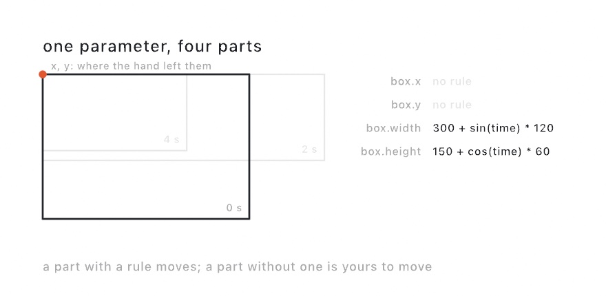

#### <sup>[Ollin](../README.md) → [Guide](README.md) → Chapter 39</sup>

---

# 39. Performing


A sketch can be performed as well as shown. This chapter puts the code itself on stage: a host where you type over the running picture and evaluate each change without stopping it, looks you save and call back, a take that records what you did and plays the night again through any export, parameters directed by keyframes, by a timeline, or by a rule, and live feeds that carry the picture into a VJ rig or a video call. The sketch above is the last state of a set you'll build in five evaluations.

## Performing the code itself

A stage is an output too. `swift run OllinLiveCoding` opens the performance host, where the sketch fills the window and the code rides over it as translucent text, part of the show:

<picture>
  <source media="(prefers-color-scheme: dark)" srcset="Images/39-Performing/StageDiagram-dark.jpg">
  
</picture>

The loop is different from the live-reload host you've used since [Chapter 1](01-HelloOllin.md). There is no file watching and no separate editor, so you type in the window and press **⌘↩** to evaluate. The buffer compiles in the background while the running sketch keeps drawing. On success the new sketch swaps in with the clock carried across, so a phase-driven motion never jumps mid-set. It swaps in twice: a plain build the moment it compiles, and the optimized build behind it when that is ready, the clock carried both times, so the edit shows sooner and the sketch still runs at release speed. [Live coding](../Docs/Tools/LiveCoding.md#the-evaluate-loop) has the numbers, and the flag for a sketch that should not start over twice. Tuned `@Param` values (including ones bound over MIDI or OSC) carry across too. A typo can't stop the show. The last good sketch keeps playing, the errors land in a strip along the bottom, and you fix and evaluate again. When the code should get out of the way, **⌃⇧H** hides it and the visuals keep the whole stage. Fullscreen for the projector is **⌃⌘F**. For a real set, `Scripts/OllinLiveCoding` builds the host in release mode so the framework renders at full speed.

Evaluation never writes your file (⌘S does), so you can riff as recklessly as the room deserves and keep only what worked.

What the swap does to the piece depends on what you changed. The host compares your buffer with the code the stage was built from. If you moved nothing but the inside of a method, the run carries on. `setup()` does not run again, so the canvas keeps what is piled on it, and `random()` picks up where it was. A long exposure you have been building for ten minutes survives the edit. Change a property, a signature, or `setup()` itself, and the piece starts over, which is what a swap has always done. The toast tells you which happened, and the editor lights the block you were standing in. To carry state of your own across an edit, mark it `@Saved`, the same word that carries a piece across a relaunch. [Live coding](../Docs/Tools/LiveCoding.md#what-the-edit-changed) has the whole rule.

You type with the framework's names in reach. The first letters of a call open a list under the caret, from the toolchain's own completion service: every drawing call, every color, every member of a value the buffer holds. Return or Tab takes the row, and the call lands with its arguments as placeholders that Tab walks. A dot after `Color` lists the palette. Escape opens the list when it is closed and closes it when it is open, so a stray Escape never drops the stage out of fullscreen. [Live coding](../Docs/Tools/LiveCoding.md#completing-a-name) has the keys, and the switch that keeps the list away until you ask.

The host's own actions answer to a controller too, beside the bindings your sketch makes for itself. Set a port in the inspector's Controls card and the host listens for OSC at `/ollin/evaluate`, `/ollin/code/hidden`, `/ollin/record`, and the rest. A second machine or a phone layout can run the show that way. For a pad or a fader, press Learn on an action and then press or move the control, and the host remembers it. Evaluate lands on a pad next to the ones playing the notes, and a fader rides the strip behind the code. None of this is in the sketch; it is the host's own preference. [Live coding](../Docs/Tools/LiveCoding.md#the-host-on-a-controller) lists the addresses.

The drag from [Chapter 1](01-HelloOllin.md#moving-something-by-hand) works on the stage too, through the code. Hold Command, and the shape under the pointer is outlined over the text. Drag it, pull a corner, or turn the knob, and the numbers change in the code the room is reading. The host evaluates that for you, so the shape stays where you left it and the clock carries. If you have typed since the last evaluation, the host asks you to evaluate first rather than guess which line moved.

### A look you come back to: cues

A set has looks it comes back to, and a look is every parameter at once. Save one as a *cue*. `saveCue("night")` does it in code, and a name typed into the Cues card under the parameters does it by hand. `cue("night", over: 2)` brings every parameter back to it over two seconds, and `nextCue()` walks the sheet in order. A cue can be called from anywhere a sketch reads: a key, a beat, a sensor.

<picture>
  <source media="(prefers-color-scheme: dark)" srcset="Images/39-Performing/CalledBack-dark.jpg">
  
</picture>

What eases and what jumps is decided by the parameter's kind, the same way it is on a track. A number, a color, a point, and a range have values between two settings, so they ease there, slow at both ends. A switch, a menu choice, and a piece of text have nothing in between, so they take the cue's value on the first frame of the fade. That is why the middle look in the figure is already lit while its dots are still growing. A cue called while another is still fading starts from wherever the parameters are, so a change of mind never snaps back first.

The hosts keep the sheet in `Sketch.cues.json` beside the sketch, so a reload never loses a look. On stage a MIDI program change calls a cue by number, `/ollin/cue` calls one by name, and a pad learned onto **Next cue** steps through the set. [`Examples/Live/Cues`](../Examples/Live/Cues/Sketch.swift) carries five looks on the number keys. [Cues](../Docs/Helpers/Cues.md) has the rest, including `--cue night` for a still at a saved look.

A cue is not a default. The **Save parameters** button above the card writes the values you turned into the `@Param` lines, which is where the piece starts. A cue is where it goes back to.

## Keeping the take

Every exporter in [Chapter 38](38-FinishingASketch.md) re-renders. That is their gift: a fixed clock, the same file every run, nothing left to chance. A performance is the opposite kind of thing. The parameter you rode, the evaluation that landed at the right moment, the note that answered the room: none of it happens twice. An export remembers the sketch; a recording remembers the night.

So the host records. Press **⌘⇧R** and a red chip starts counting on the stage. Play the set. Press **⌘⇧R** again and the take is a movie in `~/Movies/Ollin/`, picture and sound together, named after the sketch and the moment. The recording rides through evaluations, so a set that changed its code twelve times is still one continuous movie.

A sketch can also record itself, anywhere, with one pair of calls:

```swift
override func keyPressed() {
    guard key == "r" else { return }
    if isRecording {
        stopRecording()
    } else {
        startRecording()
    }
}
```

The sound needs no wiring. The recorder finds the instruments the sketch is holding, the same way the offline soundtrack does, and what they play lands in the file's audio track in sync. When the music comes from outside the sketch, record the room instead: `startRecording(audio: .microphone)` asks for the microphone and listens to the air.

For a run filmed from its very first frame, the watcher host takes a flag:

```sh
swift run OllinLive MySketches/Finale.swift --record
```

Stopping is generous on purpose. Quitting the host finishes the movie first, and so does Control-C in the terminal, because a take that ends badly should still be a take. The working example is [`Examples/Export/Record`](../Examples/Export/Record/Sketch.swift), an instrument you drag to play; everything else lives in [Recording](../Docs/Output/Recording.md).

## Playing the night again: replay

A movie remembers what the performance looked like. A *take* remembers the performance itself: the seed the run rolled, the clock it followed, every pointer move, every parameter you adjusted. It is one small JSON file, and playing it back walks the sketch through the same frames, pixel for pixel.

<picture>
  <source media="(prefers-color-scheme: dark)" srcset="Images/39-Performing/TheTake-dark.jpg">
  
</picture>

Four lanes are the whole file. The seed is one number, rolled once. The clock is one sample per frame, written down as the display drove it, jitter included. So a replay never smooths the night into an idealized version of itself. The pointer lane holds every move, press, and key, each stamped with the frame it preceded. The parameter lane holds where every `@Param` started and each change after, on its frame. Nothing else drives a deterministic sketch, so a fresh instance fed the same four lanes walks through the same frames. The two rows under the lanes are five frames drawn from those lanes twice, which is all a replay is.

```sh
swift run OllinLive MySketches/Finale.swift --record-take take.json   # play; quitting writes the file
swift run OllinLive MySketches/Finale.swift --replay take.json        # the run, again, exactly
```

During a replay your mouse belongs to the recording, so the keyboard becomes a transport. Space pauses. The arrows step one frame; with shift held they jump thirty. Home rewinds, End jumps to the last frame, and space at the end starts the night over. Stepping backward re-runs the sketch from the start up to the frame you asked for, which determinism makes exact. Finding the one frame worth keeping becomes arrow keys instead of luck.

The best part is what a take turns into afterwards. `--replay` composes with every exporter in [Chapter 38](38-FinishingASketch.md):

```sh
swift run OllinLive MySketches/Finale.swift --replay take.json --export-video night.mov
swift run OllinLive MySketches/Finale.swift --replay take.json --export still.png --frame 412
swift run OllinLive MySketches/Finale.swift --replay take.json --path-traced --export-video film.mov
```

A replayed video needs no `--seconds`; it renders the whole take. So the set you played live at sixty frames a second can re-render overnight at seconds per frame, exactly as performed. And `--seed` beside `--replay` keeps your gestures while `random()` walks a different world, so one good performance can audition many variations.

What replays is what drives the sketch: time, input, parameters, randomness. A camera feed or a microphone keeps playing live during a replay. A piece leaning on the room follows your recorded hands, not the recorded room. The whole contract, and the `Take` type under the flags, lives in [Replay](../Docs/Core/Replay.md).

## Directing the parameters: keyframes

A take remembers what you did. Keyframes say what should happen. You already have parameters: the `@Param` properties from [Chapter 1](01-HelloOllin.md). An *automation* moves them for you. A value is placed at one moment, another later, and a curve carries the first into the second.

```swift
override func setup() {
    automate($radius) { track in
        track.key(at: 0, 40)
        track.key(at: 2, 320, curve: .easeInOut)
        track.key(at: 4, 40)
    }
    automation?.loops = true
}
```

That is the whole idea. Every frame, before your `draw()` runs, the parameter is set to whatever its curve holds at the sketch clock. You stop adjusting the parameter and start writing down what it does.

Each key carries the curve that *leaves* it, so the last key's curve is never read. Five of them are named, and one is drawn:

<picture>
  <source media="(prefers-color-scheme: dark)" srcset="Images/39-Performing/ParameterOnACurve-dark.jpg">
  
</picture>

`.linear` is the straight line. `.easeIn`, `.easeOut`, and `.easeInOut` are the eases from [Chapter 3](03-MotionAndTime.md). `.hold` sits still and then jumps. `.bezier(x1:y1:x2:y2:)` is the one you shape by hand. Its two handles bend the clock as well as the value, the way a curve dragged in an editor does.

Not every parameter can travel. A number, a color, a point, or a range has values in between two settings, so it moves along the curve. A switch, a menu choice, and a piece of text have nothing in between. They step instead, holding what they were given until the next key takes over. That is the honest behavior, and it is why a fill toggle on a track blinks rather than fades.

How a pass plays is three properties. `loops` wraps at the end. `speed` scales the clock, so `2` runs twice as fast, and a negative speed runs the piece backwards from a `start` at the end. `length` holds past the last key before the wrap comes around, which is how you leave a beat of stillness in a loop.

Here is why keyframes sit in this chapter. The tracks read the sketch clock, and every exporter drives that clock at a fixed step. So the piece you directed renders exactly as it played:

```sh
swift run --package-path Examples Example-Motion-Automation --export-video directed.mp4 --seconds 12
```

An automation is plain data as well, which means a sketch can read its own tracks back and draw them. The [Automation example](../Examples/Motion/Automation/Sketch.swift) plots each of its four tracks under the stage, playhead and all. And `--automation file.json` drives the same parameters from a file instead of from code. The full surface is in [Automation](../Docs/Core/Automation.md).

### Directing by hand: the timeline panel

You do not have to write keys as code. In OllinLive, the timeline panel places them for you, at the moment you are looking at.

Click **Timeline** in the title bar, or press **⌘T**, and a floating panel opens with a ruler, a transport, and one lane per track. Try it on the Automation example:

```sh
swift run OllinLive Examples/Motion/Automation/Sketch.swift
```

<picture>
  <source media="(prefers-color-scheme: dark)" srcset="Images/39-Performing/DirectingByHand-dark.jpg">
  
</picture>

Every parameter row in the inspector carries a small diamond, and the diamond says what drives the parameter. Radius and Ground have tracks, so theirs are filled. Hue has none yet, so its diamond is hollow. Lit is worked out from a rule typed into its row, so it wears a function mark instead, and the next section is about that.

The loop has three moves. Scrub the ruler, or step a frame at a time, and the picture follows the playhead. Adjust a parameter in the inspector until the frame looks right. Then click the small diamond in that parameter's row, and a key lands at the playhead holding that value. A hollow diamond starts a track; a filled one already has one; clicking on a key takes it away.

The lanes draw what will happen. A number lane plots its curve, a color lane shows the blend as a band, and a switch steps. Drag a key to move it in time. Click one to pick the curve that leaves it, and a Bezier grows two handles you shape by eye. Option-drag the ruler to choose a stretch, and the loop button repeats it while you work. That region is the transport's alone, the tinted band on the ruler in the figure, and it never touches the piece itself.

Everything you place lands in `Sketch.automation.json` beside the sketch, the same file `--automation` and every export read. The live host reads it back on launch and across every reload, so the direction survives the edit loop. One rule to hold: a track your `setup()` writes for the same parameter wins that parameter, because the code is the artifact. The full tour is in [The parameter timeline](../Docs/Tools/Timeline.md).

## Writing the parameter as a rule

Keys say where a parameter is at a few moments. Sometimes you do not want moments. You want to say what the parameter *is*, and have it be that at every moment:

```swift
override func setup() {
    drive($radius, "190 + sin(time * tau / 6) * 80")
}
```

<picture>
  <source media="(prefers-color-scheme: dark)" srcset="Images/39-Performing/ParameterAsARule-dark.jpg">
  
</picture>

That is a *formula*, and the thing to notice is the quotation marks. The rule is text, not Swift source. Text can arrive at runtime. It can be typed into a field, read out of a file, or changed while the sketch is playing. None of that needs a recompile. That is the whole reason this exists beside the curves.

The field is real. In OllinLive, right-click the diamond of any number or switch in the inspector and choose **Write a Rule**, and a field opens under the row. Type the rule, press Return, and the parameter follows it from the next frame, with its diamond turned into a function mark and its slider dimmed. Get a character wrong and the row says so, with a caret under the character and the reason beneath, while the rule that was running keeps running. A rule written this way lands in the same automation file as the keys, so an export plays it. The panel page has the details in [Writing a rule in the row](../Docs/Tools/Timeline.md#writing-a-rule-in-the-row).

The arithmetic is the arithmetic you already write. `sin`, `clamp`, `lerp`, `smoothstep`, `noise`, `pi` and `tau`, spelled and ordered exactly as they are in `draw()` and in a shader. A formula reads `time`, which is where the pass stands, plus `frame`, `width`, `height`, `mouseX`, `mouseY`, and any of your other parameters by name:

```swift
drive($radius, "190 + sin(time * tau / 6) * 80")
drive($count, "8 + round(sin(time * tau / 12) * 5)")   // a whole number rounds
drive($edge, "radius / 22")                            // worked out from another parameter
drive($filled, "time % 6 < 3")                         // a switch, on when it is not zero
```

`edge` is the interesting line. It reads *this* frame's radius, not last frame's, because the parameter a formula names is always set first. That ordering is not a nicety. It is what keeps a formula a plain function of the clock. The same second gives the same picture whether the window runs at 60 a second or an export steps at 30.

The price of that promise is that two parameters cannot name each other, and a parameter cannot name itself. `"n + 1"` never settles on one frame. Ollin says so and leaves that parameter alone, rather than play a value that would drift with the frame rate. For a number that builds on itself, keep a plain property and step it in `draw()`, the way [Chapter 3](03-MotionAndTime.md) does.

A formula is a track like any keyed one. It loops, it plays at any speed, and it renders frame for frame through every export. It travels in the same `--automation` file too, written down as the text you typed. The [Formula example](../Examples/Motion/Formula/Sketch.swift) drives six parameters this way and prints the rule driving each one under the picture. The whole vocabulary is in [Formula](../Docs/Helpers/Formula.md).

Two spellings will catch you once. `-2^2` is `-4`, because a power binds tighter than a minus sign, the way a calculator reads it. And `-1 % 3` is `2`, not `-1`, because the remainder wraps rather than reflects, which is what makes a phase continuous as it crosses zero.

### A parameter that holds more than one number

A point holds two numbers. A color holds four. A rectangle holds four of its own. Each part takes its own rule, named where you write it:

```swift
drive($frame, width: "620 + sin(time * tau / 7) * 220")
drive($eye, x: "frame.x + frame.width / 2", y: "height / 2")
```

<picture>
  <source media="(prefers-color-scheme: dark)" srcset="Images/39-Performing/ParameterParts-dark.jpg">
  
</picture>

The part you leave out is the part you keep. That rectangle changes size while its `x` and `y` stay wherever you dragged them, and you can go on dragging them while the size plays. That is the reason to write a rule for one part rather than for a whole parameter.

One part of a parameter is a name too, spelled `parameter.part`. That is how `eye` above follows the rectangle it sits in. The name works whether keys carry that part or another rule works it out.

Three things to know before you write one. One call carries the whole parameter, so give every part at once, because a second call replaces the first. A pair of ends stays ordered, so a `lower` that climbs past `upper` lifts it along. And a color's parts are the plain 0-to-1 numbers with nothing holding them there, so write `saturate(...)` where you want a limit.

The [FormulaParts example](../Examples/Motion/FormulaParts/Sketch.swift) drives four such parameters and prints the rule driving each part under the picture.

## Live feeds: into other apps

Some pieces shouldn't become files at all. They should stay alive and go *into* something. **Syphon** is the macOS standard for handing GPU frames between running apps, and one line makes a sketch a source every VJ tool can see:

```swift
import OllinSyphon

override func setup() {
    publishSyphon(name: "Ollin")     // every frame is now a Syphon source
}
```

Resolume, MadMapper, VDMX, and other creative-coding frameworks all read it live, pixel-identical to your window, with nothing touching disk. It works the other way too. `SyphonClient` subscribes to another app's feed and hands you each frame as an `Image`. Draw it, warp it, or feed it to [Chapter 32](32-Seeing.md)'s trackers. Pair it with [Chapter 34](34-Listening.md) and the rig conversation goes both directions at once: visuals over Syphon, control over OSC or MIDI. The `Integration/SyphonLoopback` example runs both ends in one sketch, a video-feedback tunnel that watches itself. You can see the plumbing with no second app installed.

### The sketch as a webcam

Syphon is app-to-app, which means both ends have to have agreed to speak it. That covers the VJ world and misses everything else, including the one destination people ask about most: the browser. A web page asks the operating system for a *camera*, and no amount of Syphon will make it see one.

So the other publishing route makes the sketch an actual camera:

```swift
import Ollin
import OllinCamera

override func setup() {
    publishVirtualCamera()      // every frame now feeds a system-wide camera
}
```

After that, "Ollin Camera" is in the camera menu of every app on the machine. Zoom, Meet, QuickTime, OBS, Photo Booth, and any web page that asks for a camera can all take a sketch as their input. Your next video call can open on a reaction-diffusion field.

There's a one-time setup, and it's worth knowing why. A camera device is a piece of the operating system, not something a sketch can conjure. The device itself is a macOS **system extension**, installed by the Ollin Camera app in this repository. Launch it from `/Applications` and approve the extension in *System Settings ▸ General ▸ Login Items & Extensions ▸ Camera Extensions*. From then on the device exists whether or not any sketch is running. When nothing is publishing it shows a "no signal" test card. That is a friendlier thing for a video call to find than a black rectangle. If you publish without having installed it, nothing breaks: the sketch keeps drawing, and `isAvailable` and `unavailableReason` tell you what's missing.

Two facts about the frame will save you a confused minute:

- **The camera frame is a fixed 1280×720.** Your canvas is scaled to fit and centered. A square canvas therefore arrives with black bars down both sides. If a piece is destined for a call, `canvasSize = .size(1280, 720)` fills the frame exactly.
- **The camera runs at 30 fps.** A sketch running faster publishes every other frame. A slower one simply updates the camera at its own pace.

And when the picture looks wrong, suspect the *viewer* first. Photo Booth mirrors every camera preview like a selfie mirror. Text in your sketch reads backwards there, exactly as it would on the built-in camera. It also crops, because its preview pane isn't 16:9. Conferencing apps usually mirror your self-view while sending the unmirrored picture to everyone else. QuickTime's File ▸ New Movie Recording shows the frame as published, uncropped and unmirrored. It's the fastest way to see what other apps are really receiving.

## Putting it together: a set in five evaluations

What you'll build here is a short performed set. Open the host with a fresh buffer. Build the chapter's finale the way an audience would watch it grow, one evaluation at a time. [Chapter 18](18-YourFirstShader.md)'s `Visual` chains are the natural material for this kind of set, since every step is one added line:

<picture>
  <source media="(prefers-color-scheme: dark)" srcset="Images/39-Performing/SetSteps-dark.jpg">
  
</picture>

1. Start with breath. Type `drawVisual(.oscillator(frequency: 11, speed: 0.6, colorShift: 0.5))`, press ⌘↩, and drifting bands fill the stage.
2. Fold space by adding `.kaleidoscope(segments: 5)`, which turns the bands into a five-pointed mandala, still breathing.
3. Melt the fold with `.displaced(by: .noise(scale: 3, speed: 0.25), amount: 0.09)`.
4. Make it a print with `.posterized(levels: 6, gamma: 0.75)`, and the melt hardens into contour bands like a screen print.
5. Set it flying with `.rotated(time * 0.03)` and `.colorCycled(time * 0.04)`, a slow spin through the whole color wheel.

The finished buffer is the whole piece, and it's small enough to retype from memory, which is rather the point. The committed figure is [`Finale.swift`](Figures/39-Performing/Finale.swift):

```swift
import Ollin

final class Finale: Sketch {
    override func draw() {
        drawVisual(
            .oscillator(frequency: 11, speed: 0.6, colorShift: 0.5)
                .kaleidoscope(segments: 5)
                .displaced(by: .noise(scale: 3, speed: 0.25), amount: 0.09)
                .posterized(levels: 6, gamma: 0.75)
                .rotated(time * 0.03)
                .colorCycled(time * 0.04)
        )
    }
}
```

Then keep the set. Save the buffer with ⌘S. Render a shareable file with `swift run OllinLive MySketches/Finale.swift --export-video finale.mp4 --seconds 12`, or press ⌘⇧R before the first evaluation and keep the performed version instead, evaluations and all. And if a projector or a call is nearby, run `publishSyphon()` or `publishVirtualCamera()` while you perform. The same small sketch just left as a video, a take, and a live feed.

Then make it yours:

- Play the set differently by reordering the moves, or swap step 2's fold for `.repeated(x: 3, y: 3)` and the mandala becomes wallpaper.
- Wire [Chapter 35](35-ControlsAndSignals.md) in: `@Param` the oscillator frequency, bind it to a MIDI parameter, and the set gets a second instrument.
- Feed it eyes: `.displaced(by: .layer(feed), amount: 0.1)` over a layer you draw the webcam into, and the audience melts the piece.
- Perform an old friend, since any finished sketch from this guide runs in the host as-is. Try evaluating changes into [Chapter 23](23-GridSimulations.md)'s reaction-diffusion while it grows.

## Where this comes from

Live coding as a performance practice was organized by TOPLAP (founded 2004), whose manifesto demanded "show us your screens". The code-over-the-visuals layout of this host is that idea. Its most direct model is Olivia Jack's browser instrument Hydra, which made the pattern feel effortless. Alex McLean and the TidalCycles community built the musical wing of the same practice. Syphon is Tom Butterworth and Anton Marini's gift to the Mac's visual ecosystem, and the vendored framework carries their names. Full credits are in the project's [attribution notes](../ATTRIBUTION.md).

## Go deeper

- [Recording](../Docs/Output/Recording.md): recording a live run in real time, what the sound modes hear, and how a take survives an evaluation.
- [Syphon](../Docs/Integration/Syphon.md): publishing, receiving, discovery, and the loopback.
- [Virtual camera](../Docs/Integration/VirtualCamera.md): the one-time install, publishing, the test card.
- [Live coding](../Docs/Tools/LiveCoding.md): the evaluate loop, errors, recovery, and the keyboard reference.
- [Cues](../Docs/Helpers/Cues.md): looks you saved and call back, over a fade, from a key, the card, a program change, or `--cue`.
- [Replay](../Docs/Core/Replay.md): what a take holds, the transport keys, re-rendering a take through any export, and what stays live.
- [The parameter timeline](../Docs/Tools/Timeline.md): the panel, its lanes and keys, the rule field in the row, the transport, and the file it writes.
- [Formula](../Docs/Helpers/Formula.md): the whole arithmetic vocabulary a parameter's rule speaks, what it can name, and what it reports rather than throws.
- Worked examples: [`Examples/Live/`](../Examples/Live/) and [`Examples/Integration/SyphonLoopback`](../Examples/Integration/SyphonLoopback/Sketch.swift).

---

[Contents](README.md#contents) · Previous: [Chapter 38, Finishing a sketch](38-FinishingASketch.md) · Next: [Chapter 40, Handing it over](40-HandingItOver.md)
