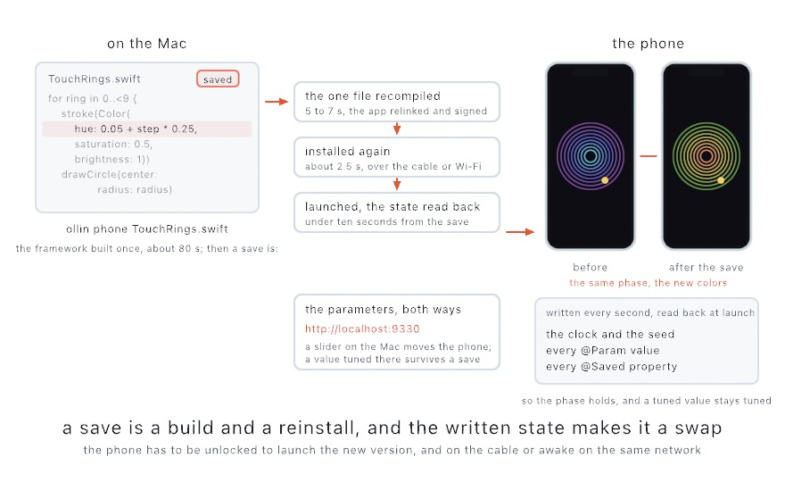
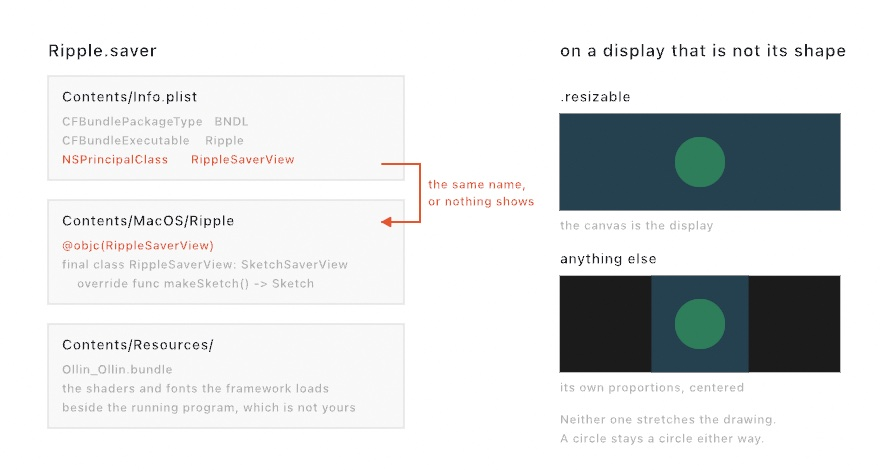
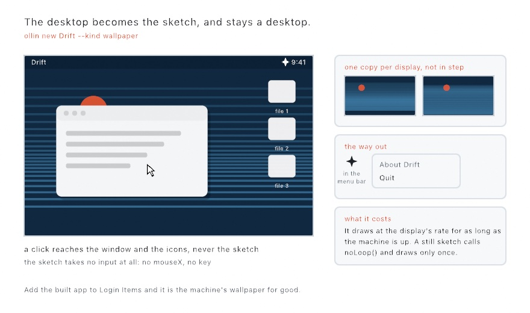
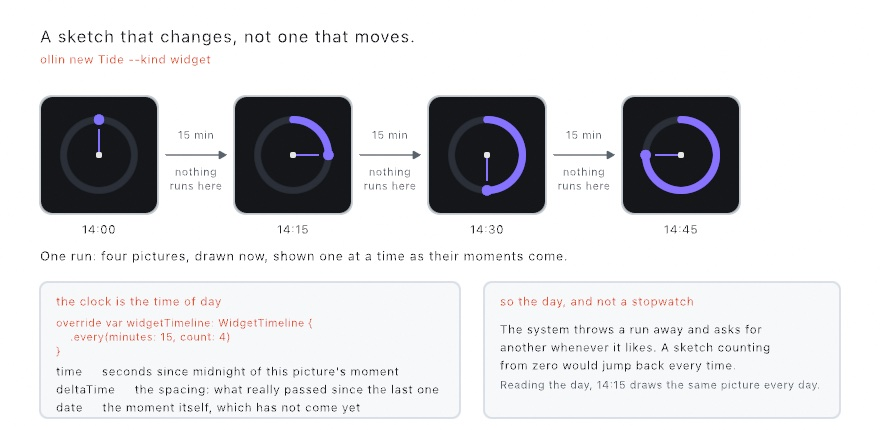
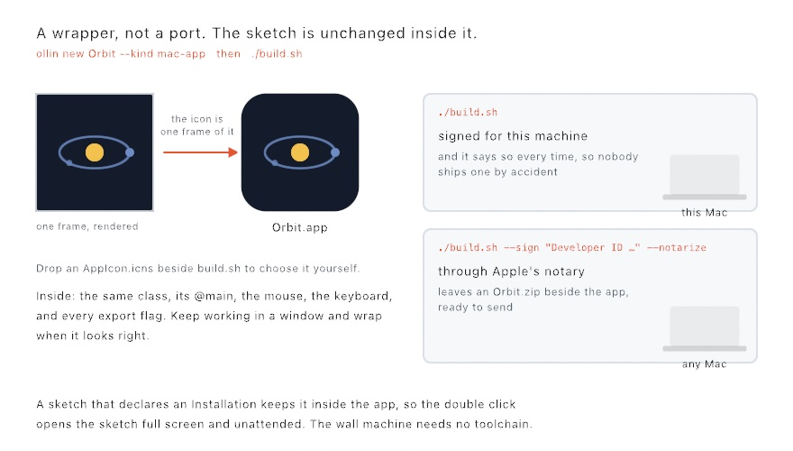
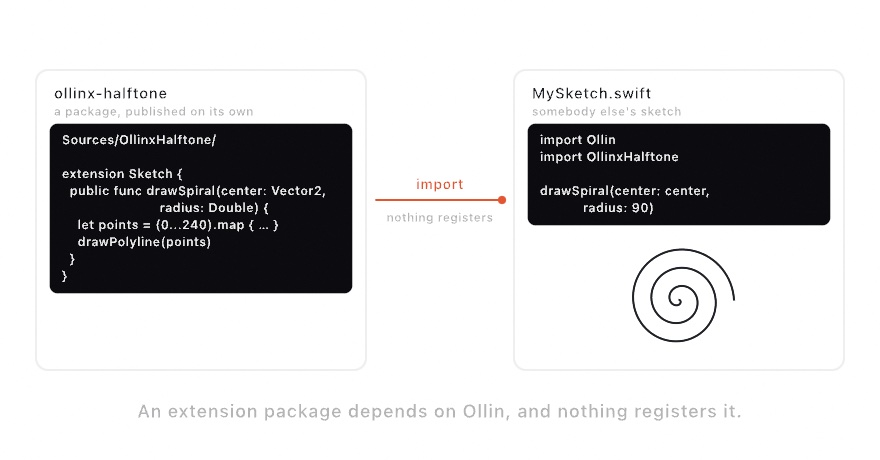

#### <sup>[Ollin](../README.md) → [Guide](README.md) → Chapter 40</sup>

---

# 40. Handing it over

<!-- Hook image: the finished sketch, still to be designed. Waiting on the finished sketch and its render. -->

The window you wrote a sketch in is only one place it can live. This chapter hands it over. Your phone takes it, with a finger for the mouse. The Mac takes it as a screen saver, a wallpaper, a menu-bar companion, or a widget. A friend who has never typed `swift` gets an app to double-click. Other programmers get behavior they can add to a sketch, and a package they can import. Every route wraps the sketch rather than porting it, so the `.swift` file stays the thing you work on.

## In your pocket: the sketch on the phone

A sketch written for the desk runs on a phone as it is. The renderer is the same, and so is `draw()`. A finger is the pointer, so `mouseX` and `mouseIsPressed` read the touch. Working on it is one command:

```sh
ollin phone Apps/OllinSketchApp/Sources/TouchRings.swift
```

The rings appear on the phone. Save the file, and under ten seconds later the phone shows the new version. The app writes its state down every second and reads it back when it launches. A save keeps the animation's phase and every value you tuned. It is `--keep-clock`, kept on the phone.

A phone runs only code signed inside its app, so nothing can be swapped into it while it runs. Each save is a small build and a reinstall. That sounds slow and is not. The framework builds once, and after that a save recompiles one file.

<picture>
  <source media="(prefers-color-scheme: dark)" srcset="Images/40-HandingItOver/SaveToPhone-dark.jpg">
  
</picture>

The figure is the loop. The file on the Mac is saved with one line changed, the hue of the rings. The save recompiles that one file and relinks and signs the app, about five to seven seconds. It installs the app again over the cable or Wi-Fi, about two and a half, and launches it. The phone on the right is what launches: the rings in their new colors, at the radii the old version had reached, because the app writes its state down every second and reads it back at launch. That state is the clock and the seed, every `@Param` value, and every `@Saved` property. So the animation keeps its phase, and a value you tuned stays tuned. The framework itself is built for the phone once, about eighty seconds, and not again for that sketch.

The phone's parameters open in a browser on the Mac, live in both directions. It is the [remote surface](../Docs/Integration/Remote.md) an installation is tuned from, pointed the other way.

Two limits are the phone's. It has to be unlocked for the Mac to open the app. And it has to be on the cable, or awake on the same network. [The sketch on the phone](../Docs/Tools/OnThePhone.md) says what comes along, what stays on the desk, and how to write the app by hand.

The app that command writes is its own, under the caches folder. To keep one, make it a project:

```sh
ollin new Rings --kind ios-app
```

Out comes the sketch, a host that owns the entry point, and the spec the Xcode project is written from. Run `xcodegen generate`, open the project, pick the phone, press Run. The signing team is the one question this kind asks that no other does, and Xcode asks it for you when it is left off. The generator window from [Chapter 1](01-HelloOllin.md) offers the same kind from its menu.

### Leaving it on the Mac

There is a way to hold the sketch without installing it at all. It keeps running on the Mac, and the phone shows its frames. The capture app from [Chapter 33](33-DepthAndThePhone.md) is the screen:

```swift
import Ollin
import OllinPhone

final class Pour: Sketch {
    let device = PhoneDevice()

    override var canvasSize: CanvasSize { .size(1080, 2340) }

    override func setup() {
        device.show(self)
    }

    override func draw() {
        background(Color(white: 0.05))
        if mouseIsPressed {
            drawCircle(mouseX, mouseY, 20 + pressure * 40)
        }
    }
}
```

That one call asks the phone for its **Sketch** mode. From then on the Mac compresses each frame as video and sends it down the cable, and the phone shows it full screen. The first finger on the picture is the pointer, as it is in the installed app, so the same `mouseX` and `mouseIsPressed` work both ways. The canvas is the phone's own shape, nine across and nineteen and a half down.

<picture>
  <source media="(prefers-color-scheme: dark)" srcset="Images/40-HandingItOver/ShowOnPhone-dark.jpg">
  
</picture>

Two connections share the cable. The pictures go down on one of their own, because they are most of what crosses it. On the sensor connection a picture would wait behind a sensor reading. Most pictures carry only what changed since the one before, and a whole picture goes out every second. A whole one also goes out when the phone connects or comes back to Sketch mode. When the cable is still busy, the Mac skips the next frame before it compresses it. A picture already made is never dropped, since every picture after it builds on it. The fingers and the tilt come back on the sensor connection, and the first finger becomes the pointer before the next `draw()`.

The loop is the live window's, not the phone's. Save, and the phone shows the edit as soon as the Mac has compiled it, with nothing built for the phone. The inspector and the console stay where you are working. `Examples/3D/Phone/PhoneCanvas` is the fuller version. A finger paints, and the paint falls the way you tilt the phone. The tilt is the same motion stream Chapter 33 reads.

The two ways answer different questions. The picture tells you how a piece looks and plays in the hand while you are still shaping it. The installed app tells you whether the phone's own GPU keeps up, and that the piece runs with no Mac nearby. [The sketch on the phone's screen](../Docs/3D/Phone.md#the-sketch-on-the-phones-screen) has how the pictures travel and what happens on a reload.

## Living in the system

A wall is one place a piece can wait. Your own machine is another, and it is a much shorter walk. Every Mac already has a screen that goes idle several times a day. It also has a list of things it could show while it does. Putting your sketch in that list takes two commands.

```sh
ollin new Ripple --kind screen-saver
cd Ripple && ./build.sh --install
```

Open System Settings, go to Screen Saver, and there it is. Nothing about the sketch changed to get there. It is the same class you would run in a window, and you can still open it in a window while you work on it.

<picture>
  <source media="(prefers-color-scheme: dark)" srcset="Images/40-HandingItOver/LivingInTheSystem-dark.jpg">
  
</picture>

A screen saver is not a program. It is a plug-in: a folder called `Ripple.saver` holding one binary, which the system loads when it needs something to show. So there is no `@main` anywhere, and one small class stands in for it:

```swift
@objc(RippleSaverView)
final class RippleSaverView: SketchSaverView {
    override func makeSketch() -> Sketch { Ripple() }
}
```

That is the whole of the wiring. `SketchSaverView` builds the canvas when the system starts the saver. It runs the frames off the display's own clock, and puts everything away when the saver is over. `@objc` pins the name so the property list can point at it.

### Two things are different, and neither is the framework's idea

**Your sketch gets no input.** A key or a click ends a screen saver. That is what a screen saver is for. A canvas that answered the click would be a canvas that swallowed it, leaving somebody hammering at a machine that will not come back. So the canvas stays out of the way entirely, and `mouseX`, `mouseY`, and `key` hold whatever they started at. Write the piece to run on `time` alone, which is how most of this guide's sketches already run.

**Your sketch cannot write files.** The system loads a screen saver into a sandbox that reads anything and writes almost nothing. Pictures, fonts, meshes, and clips all load as they always did. Exporting a frame does not, and neither does a checkpoint. None of that belongs in a screen saver anyway.

### Filling the screen, or sitting in the middle of it

A display is almost never the shape of a canvas. Which of the two you get is the sketch's own `windowMode`, the same property that decides it in a window:

```swift
override var windowMode: WindowMode { .resizable }
```

With that line, the canvas *is* the display: `width` and `height` are the screen's, and the drawing goes edge to edge. `ollin new` writes it for you, because filling the screen is what people mean by a screen saver. Take it out and a square sketch stays square, as large as fits, centered on black. Neither one stretches the drawing, which is the answer you want either way: a circle stays a circle on a wide screen.

### Building it again

Every edit needs a rebuild, so do the work in a window and install when it looks right:

```sh
ollin Sources/Ripple/Sketch.swift     # the same file, reloading as you save
./build.sh --install                  # when you are happy with it
```

The script signs the saver for this machine. Another Mac will refuse it. Handing a screen saver to somebody else needs a Developer ID and a trip through notarization, the same as an app. [The reference page](../Docs/Output/ScreenSaver.md) has those commands.

One more thing worth knowing before you build something ambitious for it. The system makes a separate saver for each display, so two screens run two copies of your sketch, each from its own first frame. They are not in step and they do not share anything. A piece that has to line up across two screens is the installation earlier in this chapter, not a screen saver.

## The desktop and the menu bar

The screen saver waits for you to leave. Two more surfaces work while you stay. The desktop can run a sketch behind the icons, and the menu bar can hold a moving strip of one beside the clock. Each is two commands, and the sketch stays an ordinary sketch.

```sh
ollin new Drift --kind wallpaper
cd Drift && swift run Drift
```

The desktop becomes the piece. Windows still stack over it, icons still sit on it, and clicks still land where they always did.

<picture>
  <source media="(prefers-color-scheme: dark)" srcset="Images/40-HandingItOver/BehindTheIcons-dark.jpg">
  
</picture>

The piece takes no input at all, which is the whole reason the desktop still works as a desktop. `mouseX`, `mouseY`, and `key` hold whatever they started at, and every click goes to the icon or the window under it. Write the piece to run on `time`, the way most of this guide's sketches already do.

The sparkle at the right end of the menu bar is the way out, because a window-less program has no other one. Each display runs its own copy, edge to edge, and the copies are not in step: they started at different moments and share nothing. `./build.sh --install` makes it an app in /Applications. Add that app to your Login Items and it is the machine's wallpaper for good.

It earns one honest note about cost. Wallpaper draws at the display's rate for as long as the machine is up, through every meeting and every compile. Calm pieces wear well here, and a still one can call `noLoop()` and cost nothing at all.

The menu bar is the same idea at the other extreme of size:

```sh
ollin new Pulse --kind menu-bar
cd Pulse && swift run Pulse
```

A strip 56 points wide appears among the status items and starts moving.

<picture>
  <source media="(prefers-color-scheme: dark)" srcset="Images/40-HandingItOver/SmallestCanvas-dark.jpg">
  
</picture>

It draws at 30 frames a second, a rate a surface that never goes away can afford. The sketch inside sees a canvas of the strip's own points, so `width / 2` is still the middle and everything this guide taught still works. It is simply the smallest canvas you will ever draw on. A click opens the strip's menu, and Quit is there.

Both kinds write the same wrapper [An app to hand somebody](#an-app-to-hand-somebody) describes, plus one line that keeps the app out of the Dock. A program with no window has nothing to show from a Dock icon. The reference pages ([wallpaper](../Docs/Output/Wallpaper.md), [menu bar](../Docs/Output/MenuBar.md)) carry the rest, the strip's width parameter among them.

## A widget, and what it does to a sketch

There is a fourth place in the system, and it is the one that changes what a sketch is. A widget sits on the desktop and in the notification panel, beside the weather and the calendar. Two commands again.

```sh
ollin new Ripple --kind widget
cd Ripple && ./build.sh --install
```

Open the app once, so the system sees what is inside it. Then right-click the desktop, choose Edit Widgets, and look for **Ripple**.

<picture>
  <source media="(prefers-color-scheme: dark)" srcset="Images/40-HandingItOver/AQuarterHourApart-dark.jpg">
  
</picture>

A screen saver, the wallpaper, and the menu bar all draw. A widget does not. The system asks for a handful of pictures at a time, keeps them, and puts each one up when its moment comes. Nothing runs in between. There is no frame rate on this surface. There are four draws an hour, and what somebody sees is the difference between two pictures rather than the motion between them.

So the piece has to be one that **changes** rather than one that moves. A dial that turns through the day works. A color that drifts from morning to evening works. A ball bouncing does not. By the time the next picture goes up, that ball has been somewhere else a thousand times, and nobody saw any of it.

### The clock is the time of day

`time` here is seconds since midnight of the moment being drawn. `time / 3600` is the hour, and the number runs from 0 to 86400 and starts over.

That is not the clock the rest of this guide uses, and the reason is worth a minute. The system throws a run of pictures away and asks for another whenever it likes. If `time` counted from the start of a run, the piece would jump back to the beginning every time it did. Reading the day instead, a quarter past two draws the same picture today as it will tomorrow, whichever run happened to draw it.

The rest follows from that. `deltaTime` is the spacing, which is what really passed since the picture before this one. `frameCount` is 1 every time, because each picture is the first frame of a sketch of its own. Nothing carries from one to the next, which is exactly what makes a moment reliable.

One more, and it is the one that catches people. A widget's pictures are drawn *before* their moments arrive, sometimes an hour before. A piece that asks `Date()` is asking about the wrong time. `date` is the moment being drawn, and at a desk it is simply now, so a piece written against it is right in both places.

### How far apart the pictures sit

The sketch says so, the same way it says how big its canvas is:

```swift
override var widgetTimeline: WidgetTimeline { .every(minutes: 15, count: 4) }
```

Four pictures a quarter of an hour apart, which covers the next hour. It is a wish rather than a promise. The system decides when it comes back, and it will not come back every minute for anybody. A quarter of an hour is the shortest spacing worth asking for.

The moments land on a grid counted from midnight, not from whenever the system happened to ask. A quarter-hour piece therefore steps at the quarter hours. The next run carries on that same grid rather than starting one of its own.

That grid has a consequence worth knowing before it puzzles you. A piece whose own period divides the spacing is caught in the same place every time, so it never appears to move at all. A run every fifteen minutes cannot show you anything that repeats every fifteen minutes. Pick a period that does not divide the day evenly, or read the day directly, as the piece in the figure does.

### Seeing the run without waiting for it

Waiting a quarter of an hour to judge a change is no way to work. The window still works, and there is one more command that matters more here than anywhere else:

```sh
swift run RippleApp --export-widget frames --size 360x360
```

That writes the whole run into `frames/`, one picture per moment, named by the moment. It is exactly what the widget will show, drawn by exactly the same call, and it takes a second. The flag works on any sketch, so you can try a piece on this surface before you wrap it for one.

The generated project has more in it than the others: three targets rather than one. A widget is two programs, the app the system finds it through and the widget itself, and two programs cannot share a folder of sources. [The reference page](../Docs/Output/Widget.md) has the split and the one public line that keeps your sketch an ordinary sketch.

## An app to hand somebody

The screen saver lives on your own machine. The other thing a finished sketch wants is to leave. It goes to a friend who has never typed `swift`, or to the gallery machine that will run the wall for a month. That is an app, and the path is the same two commands.

```sh
ollin new Orbit --kind mac-app
cd Orbit && ./build.sh
```

`Orbit.app` appears beside the script. Double-click it and the sketch opens in its window, the same window `swift run` would have given you.

<picture>
  <source media="(prefers-color-scheme: dark)" srcset="Images/40-HandingItOver/AppToHand-dark.jpg">
  
</picture>

Nothing about the sketch changed on the way in. It keeps its `@main`, its mouse, its keyboard, and every export flag. The app is a wrapper, not a port, so you keep working in a window (`ollin Sources/Orbit/Sketch.swift`) and wrap when it looks right.

Two of the wrapper's choices are worth knowing.

**The icon is the sketch.** The script runs the binary it just built, renders one frame, and folds that picture into the icon the Finder shows. The piece wears its own face, and the face changes as the piece does. Drop an `AppIcon.icns` beside `build.sh` when you would rather choose it yourself.

**The signature decides how far it travels.** `./build.sh` alone signs the app for this machine and says so every time, so nobody ships one by accident. Handing it to somebody else takes a Developer ID and one more flag:

```sh
./build.sh --sign "Developer ID Application: Your Name (TEAMID)" --notarize ollin-notary
```

That signs with the hardened runtime, sends the app through Apple's notary, and leaves an `Orbit.zip` beside the app, ready to send. Any Mac opens what is inside. [The reference page](../Docs/Output/App.md) has the one-time setup behind the `ollin-notary` name.

The app is also how the wall piece of [Chapter 41](41-Installations.md#putting-it-together-the-wall-piece) reaches its wall. A sketch that declares an `Installation` keeps it inside the app, so the double click opens the piece full screen, unattended, hours and all. The machine that runs it never needs the repo or the toolchain, only the app.

## Adding behavior without touching the sketch: SketchExtension

One more piece is worth knowing about once you have several sketches. It answers a question that comes up as soon as you want the same extra behavior in all of them. How do you add something to a sketch's life cycle without editing the sketch?

An **extension** is a small object that gets told when things happen. You register it once. From then on it hears about setup, and about each frame before and after the drawing. If it asks, it also hears about the finished rendered image.

```swift
extend(MyWatermark())
```

The reason this exists rather than you just adding lines to `draw()` is that some behavior isn't about the artwork. None of these belong in the piece, and all of them want to apply to every piece:

- a frame recorder,
- an on-screen readout of the frame rate,
- a guide overlay you toggle while composing,
- a logger that notes which seed produced which render.

Ollin's own frame-rate statistics work exactly this way, as an extension registered by the host rather than anything in your sketch.

One detail is worth flagging. Hearing about the rendered image is opt-in, through a property the extension sets. Reading pixels back from the GPU costs real time. An extension that only watches timing pays nothing. The [extension seam](../Docs/Core/Sketch.md#extensions) has the hook list.

## Giving it to somebody else

Say you have written a drawing call you keep copying between pieces. How does somebody else get it?

An Ollin extension is a Swift package that depends on Ollin. That is the whole format. Somebody adds your package, writes one `import`, and your call sits beside `drawCircle`.

<picture>
  <source media="(prefers-color-scheme: dark)" srcset="Images/40-HandingItOver/ExtensionShape-dark.jpg">
  
</picture>

It is straightforward because `drawCircle` is a method on `Sketch`. Yours is too:

```swift
extension Sketch {
    public func drawSpiral(center: Vector2, radius: Double) {
        drawPolyline(points)
    }
}
```

The rest follows from `drawPolyline`. The current `stroke` applies. The transform stack applies. Clipping, `symmetry`, and SVG export apply. You write none of it.

The command that made your first folder makes this one too:

```sh
ollin new Halftone --kind extension
```

The package is named the shared way. The folder is `ollinx-halftone` and the module is `OllinxHalftone`. The prefix follows openFrameworks' addon naming and OPENRNDR's own. No enforcement exists, but with no catalog to look in, a shared prefix is how packages get found.

Inside is a worked starter, tests that check something real, and a list of what to fix before publishing. One item on that list catches everybody. The generated manifest points at the copy of Ollin on *your* machine.

Pick what the starter is built on with `--seam`. A drawing call, as above. A GPU effect, written as a shader and wrapped so `layer.filtered(.vignette())` reads like a built-in. A source of frames, which any tracker from [Chapter 32](32-Seeing.md) then accepts. Or a lifecycle extension, which is the section you have just read, packaged. See [writing an extension](../Docs/Tools/Extensions.md) for all four, and for the parts of Ollin that are deliberately closed.

The generator window from [Chapter 1](01-HelloOllin.md) makes the same package. Pick **Extension package** from its kind menu. The seams take the place of the templates. The stage shows the starter's source instead of a running sketch, checked against the framework. A seam that stopped compiling says so before you press Create.

<!-- Putting it together: the finished sketch goes here, still to be designed, built from this chapter's steps, with its full listing. -->

## Where this comes from

Most of this chapter wraps a sketch in something Apple's platforms already provide. A screen saver is a plug-in for the ScreenSaver framework, and the wallpaper is a borderless window at the desktop's own level. The menu-bar strip is a status item, and a widget is a WidgetKit timeline of pictures. An app travels on a Developer ID signature that Apple's notary service has checked. The phone's pictures are HEVC, the video standard ITU-T and ISO published together in 2013. Each machine's media engine does the compressing and the decoding.

Screen savers began as a guard against a still picture burning into a monitor's phosphor. After Dark, from Berkeley Systems in 1989, made them something people chose for fun. The extension seam follows OPENRNDR's `extend`, which lets a program register extensions that run before and after its draw. The `ollinx-` prefix follows the addon naming of openFrameworks. Full credits are in the project's [attribution notes](../ATTRIBUTION.md).

## Go deeper

- [The sketch on the phone](../Docs/Tools/OnThePhone.md): what a save does, the parameters on the Mac, what comes along, the options, and an app of your own.
- [Screen saver](../Docs/Output/ScreenSaver.md): the project the generator writes, the sandbox a saver runs in, filling against fitting, and signing one for somebody else's machine.
- [Wallpaper](../Docs/Output/Wallpaper.md) and [menu-bar piece](../Docs/Output/MenuBar.md): a sketch behind the desktop and one in the menu bar.
- [Widget](../Docs/Output/Widget.md): the three targets a widget needs and why, the run and its grid, the clock a picture is drawn on, `--export-widget`, and the signing order the extension depends on.
- [Sketch as an app](../Docs/Output/App.md): the project the generator writes, the icon, and the one-time setup behind signing and notarizing.
- [Writing an extension](../Docs/Tools/Extensions.md): the four seams, the naming convention, the publishing checklist, and what is deliberately closed.

---

[Contents](README.md#contents) · Previous: [Chapter 39, Performing](39-Performing.md) · Next: [Chapter 41, Installations](41-Installations.md)
