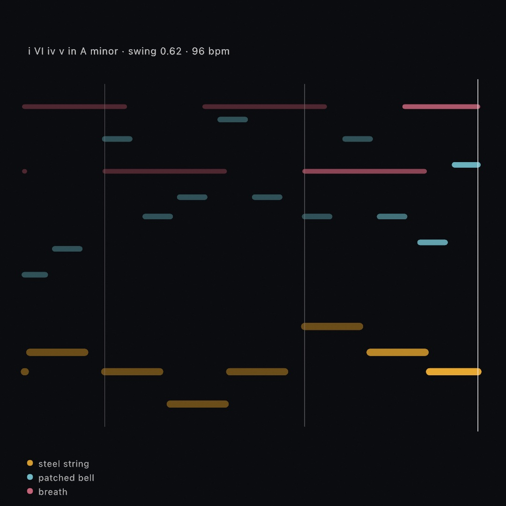
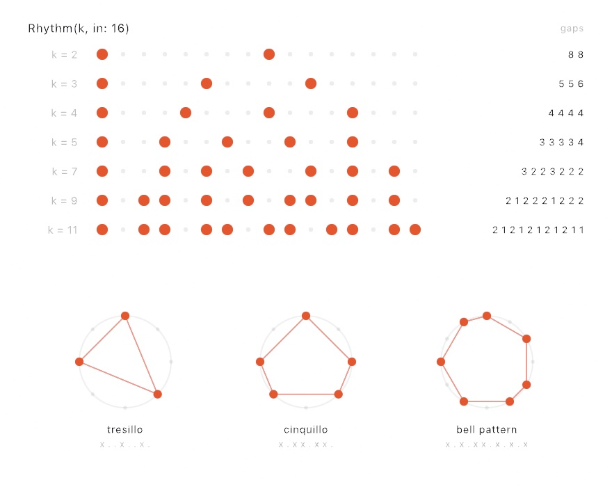
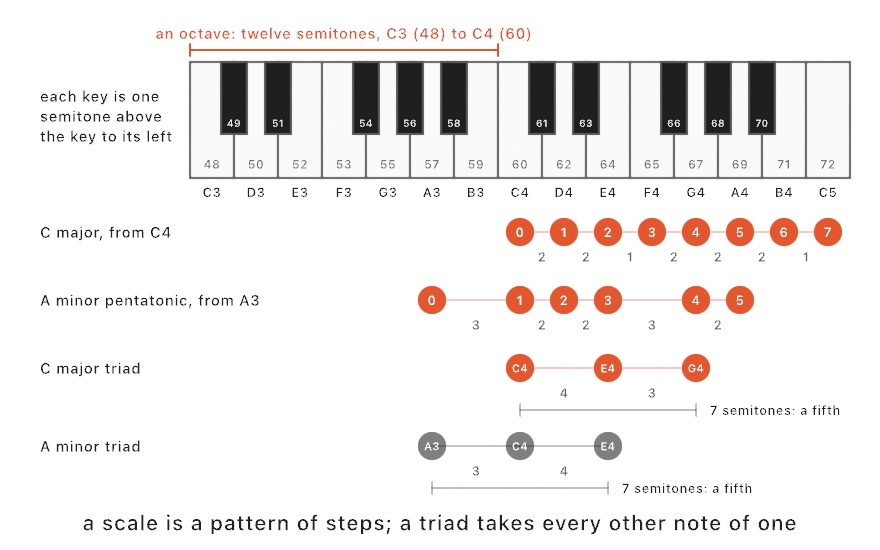
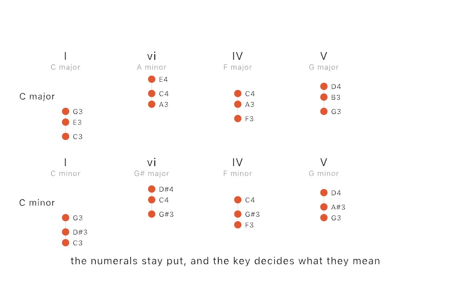

#### <sup>[Ollin](../README.md) → [Guide](README.md) → Chapter 40</sup>

---

# 40. Music by rule



Rules can decide which notes a sketch plays, and when. You learn rhythms spread evenly and swung, pitch as numbers, chords and progressions from a key, and a chain that learned a phrase. The music box above plays by itself, draws each note as it plays it, and writes what it played to a MIDI file. The families after it hold a sequencer, an arpeggiator, other tunings, a beat from the room, numbers played as notes, reading a file, and sound from a place.

## Beats and note lengths: `Tempo` and `NoteLength`

A synth decides what a note sounds like. It says nothing about which notes there are, or when they play. Music answers the "when" in beats. A **beat** is the steady pulse you would tap your foot to, and the **tempo** is how many beats pass in a minute. The types in this chapter count time in beats and steps rather than seconds, and one value turns seconds into beats.

A `Tempo` knows how long a beat lasts. `let tempo: Tempo = 120` is 120 beats a minute, so `tempo.beats(at: time)` is `time * 120 / 60`, two beats every second.

The same value answers how long a note lasts. A `NoteLength` is a length in beats, named the way written music names it. A quarter note lasts one beat, a half note two, and a whole note four. Each shorter name is half the one before, down to `.thirtySecond`. `.dotted` makes a length half as long again, and `.triplet` fits three notes where two would go. `tempo.seconds(of: .quarter.dotted)` turns a length into seconds, which is what a synth's `for:` takes.

<picture>
  <source media="(prefers-color-scheme: dark)" srcset="Images/40-MusicByRule/NoteLengths-dark.jpg">
  
</picture>

Read the figure across one bar of four beats. At 96 beats a minute a beat lasts 0.625 seconds. A whole note then holds for 2.5 seconds and a sixteenth for 0.156 seconds. Two dotted quarters fill three beats and leave one over. Three eighth triplets fit where two eighths did.

## One step at a time: `StepCounter`

The rhythms, scales, and chains that follow never read the clock. Each one answers a step number instead, step 0, step 1, step 2, and on. A **step** is one slot on a grid of equal slots, like the row of buttons on a drum machine. A `StepCounter` turns beats into step numbers. `perBeat: 4` makes four steps to a beat, so each step is a sixteenth note.

This loop goes in `draw()`. `synth` is a `Synth` from [Chapter 39](39-MakingSound.md#a-sketch-that-plays), and 60 is middle C:

```swift
let tempo: Tempo = 120
var counter = StepCounter(perBeat: 4)

override func draw() {
    for step in counter.steps(upTo: tempo.beats(at: time)) {
        synth.play(60, for: tempo.seconds(of: .sixteenth))
    }
}
```

`steps(upTo:)` hands back every step that fell due since the last call, as a range. At 120 beats a minute a step lasts 125 milliseconds. A frame on a 60-hertz display lasts about 17, so most frames get no step at all. A slow frame can cover two or three, and each of them still plays. If time jumps far ahead, after the machine stalls, the counter skips to where it landed rather than playing every step at once.

Keeping the clock outside the counter lets the same code follow other clocks. `tempo.beats(at: time)` is one source of beats. A beat heard through the microphone is another, in [Playing along with the room](#playing-along-with-the-room-tempo-sync). A drum machine's MIDI clock is a third ([Chapter 38](38-ControlsAndSignals.md#musical-time-midi-clock-and-link)). The code after the counter stays the same whichever one it follows.

## Hits spread evenly: Euclidean rhythms with `Rhythm`

A `Rhythm` decides which steps play. Ask it for a number of strikes over a number of steps, and it spreads them as evenly as whole steps allow. A **strike** is a step that sounds. Read a rhythm at a step and it answers true or false, so it goes inside the loop over steps. The step number wraps, so step 16 of a sixteen-step rhythm reads as step 0 again, and the counter can climb forever:

```swift
let rhythm = Rhythm(5, in: 16)
if rhythm[step] { synth.play(60, for: 0.1) }
```

<picture>
  <source media="(prefers-color-scheme: dark)" srcset="Images/40-MusicByRule/Euclidean-dark.jpg">
  
</picture>

Read the gaps column. However many strikes you spread over sixteen steps, the gaps come out in at most two lengths, and those two differ by one. Five strikes, for example, leave gaps of three and four steps.

Spreading hits this evenly gives rhythms people already play. `Rhythm(3, in: 8)` is the Cuban tresillo, and `Rhythm(5, in: 8)` the cinquillo. `Rhythm(7, in: 12, rotation: 3)` is the same spread started three steps later, at its third strike. It is the bell pattern played across west Africa and, after it, in much of the Americas. The method was written to time pulses in a particle accelerator. It works the way Euclid's method for the largest number that divides two others does, so these are called **Euclidean rhythms**.

The named ones are on the type, so you rarely have to remember the numbers: `.tresillo`, `.cinquillo`, `.bellPattern`, `.bossaNova`, `.samba`, `.aksak`, and several more. You can also write out a pattern you already hear, one character per step, with `x` for a strike and `.` for a rest:

```swift
let clave: Rhythm = "x..x..x...x.x..."
```

## Late on purpose: swing

Every step so far lands exactly on the grid, and players rarely do. The commonest lean is **swing**. Take the steps in pairs, and call the second step of each pair its **offbeat**. Swing delays every offbeat by the same fraction of its pair. It is written as where the offbeat lands in the pair. At 0.5 it lands halfway, which is straight, and at 0.62 a little late. At 0.67 it lands on the last third, the uneven rhythm called a **shuffle**.

A synth can wait before it plays. `play(_:velocity:for:after:)` takes a wait in seconds as `after:`, so the loop over steps can push each offbeat late:

```swift
let swing = 0.62

for step in counter.steps(upTo: tempo.beats(at: time)) {
    let late = step % 2 == 1 ? (swing - 0.5) * tempo.seconds(of: .eighth) : 0
    if rhythm[step] { synth.play(60, for: 0.1, after: late) }
}
```

`%` is the remainder after dividing, so `step % 2` is 1 on every second step. Two sixteenth steps make an eighth note, so `tempo.seconds(of: .eighth)` is one pair in seconds. At 120 beats a minute and a swing of 0.62, each offbeat waits 30 milliseconds.

The counter hands over a step on the first frame after it falls due. So every note can land up to a frame late, about 17 milliseconds on a 60-hertz display, and the wait adds to that. For a lean placed to the sample, the step sequencer in [Steps with a feel](#steps-with-a-feel-the-sequencer-and-the-arpeggiator) asks for its notes ahead of time.

## Notes as numbers: a pitch primer

A rhythm says when. The next steps choose which note, and that needs a few words from music. [Chapter 37](37-Listening.md#one-note-at-a-time-pitch) met some of them while it listened to a violin. This step lays them out on a keyboard.

<picture>
  <source media="(prefers-color-scheme: dark)" srcset="Images/40-MusicByRule/Keyboard-dark.jpg">
  
</picture>

A **semitone** is the step from one key of a piano to the next, black keys included. Twelve semitones make an **octave**, where the frequency doubles, and the bracket over the keys marks one, from C3 to C4. MIDI numbers count semitones, one more for each key up, and the figure prints each key's number. Middle C, the key marked C4, is 60. So a pitch is a number you can add to. Middle C plus 12 is 72, the C an octave up, and middle C plus 7 is 67, the G.

A **scale** is a choice of notes inside each octave. Its first note is the **root**, and the pattern repeats from the root of the next octave up. A scale is easiest to write as the steps between its notes, and the figure writes them under each row of dots. The major scale takes steps of 2, 2, 1, 2, 2, 2, and 1 semitones. From C that gives C, D, E, F, G, A, B, and C again, the white keys. A **pentatonic** scale has five notes, and the minor pentatonic takes steps of 3, 2, 2, 3, and 2. The second row starts it on A3, which makes A minor pentatonic, with the notes A, C, D, E, G, and A again. [Staying in key](#staying-in-key-scale) plays that scale. Start the same steps on another root and you get the same scale in a new **key**, the set of notes the music uses. That is a different meaning of the word from a piano's keys.

Each note of a scale is a **degree**, numbered by its place from the root. Musicians count degrees from 1. Ollin counts them from 0, like the positions in a list, so degree 0 is the root. The numbers in the dots of the top two rows are degrees. Degree 7 of the major scale is its root again, an octave up.

The distance between two notes is an **interval**, counted in semitones. Two intervals build most of the chords in this chapter. A **third** is three or four semitones, a minor third or a major third. A **fifth** is seven semitones. A **triad** is a chord of three notes: a root, the note a third above it, and the note a fifth above the root. On a scale, that means taking every other note. The bottom two rows of the figure are triads. C, E, and G make a **major** triad, four semitones and then three. A, C, and E make a **minor** triad, three semitones and then four. Both use only white keys, the notes of C major, so taking every other note skips one white key each time. The bracket under each shows that both span a fifth. Major usually sounds brighter, and minor darker.

## Staying in key: `Scale`

A `Scale` turns whole numbers into notes. Give it a kind of scale and a root, then read it at a degree. The `play` line goes inside the loop over steps:

```swift
let pentatonic = Scale(.minorPentatonic, root: "A3")
synth.play(pentatonic[step])
```

Degrees run past both ends. This scale has five notes, so `pentatonic[5]` is the root an octave up, and `pentatonic[-1]` is the note below the root. Any whole number lands on a note of the key, however it was arrived at, so generated music stays in key. Feed a wandering number through a scale and every note it plays belongs to the key. `.major`, `.minor`, `.blues`, and `.hirajoshi` are other kinds, and [Composition](../Docs/Helpers/Composition.md) lists them all.

Sometimes the number came from somewhere that is not music, like a mouse position or a sensor reading. Then `snap` moves it to the nearest note of the scale. `Pitch(...)` makes a pitch from a MIDI number, which can fall between two keys:

```swift
synth.play(pentatonic.snap(Pitch(40 + mouseY / 12)))
```

## Chords from the key: `Chord` and `Arpeggio`

A scale hands back one note at a time. A **chord** is several notes sounded together, and [the pitch primer](#notes-as-numbers-a-pitch-primer) built one as a triad. A `Chord` can be named by its root and its kind, as `Chord("A3", .minorSeventh)`. A **seventh chord** is a triad with a fourth note, a third above its fifth. A chord can also be built out of a scale by taking every other note. On C major:

```swift
let major = Scale(.major, root: "C3")
major.chord(on: 0)     // C, E, G: a triad on the root
major.chord(on: 1)     // D, F, A: a triad on the second note
```

The first comes out major and the second minor, from the same call. The steps between every other note differ from place to place in the scale, so the kind of chord follows from where you start. Change the key and the chords change with it.

<picture>
  <source media="(prefers-color-scheme: dark)" srcset="Images/40-MusicByRule/ScaleLadder-dark.jpg">
  
</picture>

The left panel is A minor pentatonic as a ladder over every semitone. A wandering run of numbers, fed through the scale, lands only on its rungs. The right panel stacks a triad on each degree of C major. Three come out major and three minor. The one on the seventh degree is **diminished**, three semitones and then three. It spans six semitones, one short of a fifth, which is called a diminished fifth. The numerals under them are how musicians name a chord by the degree it starts on. Capitals mean major, lowercase means minor, and the small circle after vii means diminished.

An `Arpeggio` plays a chord one note at a time, and like a rhythm it answers a step number:

```swift
let arp = Arpeggio(Chord("A3", .minorSeventh), .upDown, octaves: 2)
synth.play(arp[step], for: 0.1)
```

`.upDown` climbs through the chord's notes and comes back down, over two octaves here. Read it at the step number, not at a count of the notes played up to now. Then each note is the one the pattern holds at that point in the bar. A rhythm that strikes only some steps skips the notes in between, rather than walking through them one by one.

## What comes next: a `MarkovChain`

The scale keeps a line in key, but something still has to choose the degrees. A `MarkovChain` chooses them from habits it learned. Show it a **motif**, a short phrase, and it counts what tended to follow what. Then it picks each next element by those counts. The chain is a property of the sketch, `start(at:)` goes in `setup()`, and the `play` line goes inside the loop over steps:

```swift
var melody = MarkovChain(learning: [0, 2, 4, 2, 0, -3], seed: 4, loops: true)
melody.start(at: 0)

synth.play(pentatonic[melody.next() ?? 0])
```

The motif here is a list of degrees. `loops: true` treats it as a phrase that comes round again, so its last note leads back to its first. `start(at: 0)` places the chain at 0, so the first `next()` answers with what followed 0 in the motif. `next()` answers nil only when the chain has learned nothing, so `?? 0` falls back to the root.

`order:`, one more argument of the initializer, is how far back the chain looks. At 1, the default, each element depends only on the one before it. At 2 it looks at the last two, which follows the motif more closely and invents less. The chain is seeded, and it keeps its own random generator rather than borrowing the sketch's. So adding one does not change anything else you were drawing at random, and the same seed plays the same line.

## Chords that come out of a key: `Progression`

The chords of [Chords from the key](#chords-from-the-key-chord-and-arpeggio) stand still. A **progression** is a sequence of chords. Use one when the chords under a melody should change and still stay in key. The useful way to write one down is as degrees, in the numerals of the chords step. Music theory writes harmony that way, in what is called Roman numeral analysis.

In this fragment `pad` and `bass` are two synths. At 120 beats a minute `time * 2` counts beats, and a counter with `perBeat: 0.5` takes one step, one chord, every two beats:

```swift
let changes = Progression("I vi IV V", in: Scale(.major, root: "C3"))
var chordSteps = StepCounter(perBeat: 0.5)

for step in chordSteps.steps(upTo: time * 2) {
    pad.play(chord: changes.pitches(at: step), for: 1.8)
    bass.play(changes.root(at: step).transposed(by: -12), for: 1.6)
}
```

Four calls in the fragment are new. `pitches(at:)` is the chord at a step as a list of pitches, and `play(chord:for:)` sounds all of them at once. `root(at:)` is the root of that chord, the note it is built on, and `transposed(by: -12)` moves it down an octave, twelve semitones. Degrees survive a change of key. `I vi IV V` names the same progression in every key, and each chord's kind comes from the scale. Ollin ignores the case of a numeral, since the scale decides major or minor.

<picture>
  <source media="(prefers-color-scheme: dark)" srcset="Images/40-MusicByRule/Changes-dark.jpg">
  
</picture>

These are the notes `pitches(at:)` hands back, in two keys, with nothing else changed. Every chord comes out different, each one whatever the scale's own notes make of that degree. The second column is minor in the major key and major in the minor one. The numeral only ever meant "start here and take every other note". A musician would write the minor key's row as i VI iv v, in lowercase where the chords are minor. Ollin names every black key with a sharp, so the minor row's `G#` is the note a score would print as A flat. A **flat** is the key just below a letter, as a sharp is the key just above. So G sharp and A flat are the same pitch. `Examples/Audio/Changes` puts the key on a parameter, so you can hear the chords change while it plays.

A few progressions are named, such as `.pop(in:)`, `.blues(in:)`, `.twoFiveOne(in:)`, and `.andalusian(in:)`. A progression can also leave its cycle:

```swift
let changes = Progression("I vi IV V ii V", in: major).wandering(32)
```

`wandering(_:)` learns a Markov chain from the progression's own moves and plays 32 chords from it. It only makes moves the original made, but after a few bars it is somewhere the original never went. It is seeded per call, so a wander you like is one you can ask for again.

When the chords do not all come from one key, write them as chord symbols instead. A symbol names a chord's root and kind. `Dm7` is D minor seventh, `G7` a G seventh chord, `Cmaj7` C major seventh, and `F#m7` F sharp minor seventh:

```swift
let changes = Progression(symbols: "Dm7 G7 Cmaj7 Cmaj7")
let chord: Chord = "F#m7"
```

Symbols stay where they are when the key changes, and degrees move with it.

## Keeping what it played: writing a MIDI file

A **Standard MIDI File**, the `.mid` file, stores notes as MIDI messages with their timing. Every sequencer and notation program reads and writes one. The format is published by the MIDI Association beside the MIDI 1.0 specification. Write one to keep a phrase you liked, or to open the sketch's music in another program.

A `Synth` can write down what it is asked to play. `startRecording(tempo:name:)` starts a **take**, one recorded run of playing. `recordedSoFar()` hands back everything since as a `MIDIFile`, and the take goes on. In `keyPressed()`, `key` is the key just pressed on the Mac's keyboard:

```swift
override func setup() {
    synth.startRecording(tempo: tempo, name: "Take")
}

override func keyPressed() {
    if key == "s" { try? synth.recordedSoFar().write(to: "take.mid") }
}
```

`write(to:)` throws when the file cannot be written, and `try?` skips the write if it does. The notes keep the timing they were played with, each `after:` wait included, so a swung pattern arrives swung. The tempo you give decides only where the bar lines fall around what was played. `stopRecording()` hands back the same file and ends the take.

A file can hold several parts, called **tracks**, each on a MIDI channel of its own, numbered from 1 to 16. A program that opens the file shows each track as a line of its own. `MIDIFile.Track` wraps one synth's notes as a track, and the long form of `MIDIFile` puts tracks together. Here the progression's pad and bass, each started with `startRecording(tempo:name:)` in `setup()`, become two tracks:

```swift
let parts = [MIDIFile.Track(pad.recordedSoFar().notes, name: "chords", channel: 1),
             MIDIFile.Track(bass.recordedSoFar().notes, name: "bass", channel: 2)]
let file = MIDIFile(format: .parallelTracks, name: "Changes", tracks: parts,
                    tempoChanges: [MIDIFile.TempoChange(beat: 0, tempo: tempo)])
try? file.write(to: "changes.mid")
```

`.parallelTracks` is the kind of file whose tracks play together. `tempoChanges` gives the file its speed. Ollin writes the tempo into a first track of its own, which a sequencer shows as the song's tempo rather than as a part. A file built from tracks has none until you give one, and a program that opens it then assumes 120 beats a minute.

## Putting it together: the music box

The finished sketch plays by itself and draws what it plays. Make `MySketches/MusicBox.swift`, and run it with the sound on. It counts steps from a tempo, reads three Euclidean rhythms at the same step, and swings every offbeat late. Its notes come from one key. The bell plays each bar's chord of a progression as an arpeggio, and a Markov chain chooses the low line. Press S and what it has played so far is saved as a MIDI file.

The first part is the music. The bell is a patch from [Chapter 39](39-MakingSound.md#building-an-instrument-instead-of-choosing-one-patches-and-fm). One sine pushes another at a ratio of 3.47, which is not a whole number, so it sounds like metal. The string is the plucked string of [Chapter 39](39-MakingSound.md#a-string-worked-out-sample-by-sample-the-plucked-string), and the breath is a preset.

```swift
import Ollin
import OllinAudio

final class MusicBox: Sketch {

    // MARK: what plays

    let string = Synth(.steel, polyphony: 6)
    let bell = Synth(polyphony: 10)
    let air = Synth(.breath, polyphony: 4)

    let steps = 16
    let tempo: Tempo = 96
    let swing = 0.62                            // where each offbeat lands in its pair
    var counter = StepCounter(perBeat: 4)
    var motif = MarkovChain<Int>(seed: 4)

    /// Every note the sketch has played: when it started, in beats, how long it
    /// holds, which voice sang it, and how hard.
    struct Played {
        var beat: Double
        var pitch: Double
        var beats: Double
        var voice: Int
        var velocity: Double
    }
    var score: [Played] = []

    override func setup() {
        seed(4)
        // The bell is patched rather than picked: one sine bent by another at a
        // ratio that is nowhere near a whole number, which is what makes metal.
        bell.voice = Voice(patch: Patch.tone(.sine)
                                .modulated(by: .tone(.sine, ratio: 3.47), amount: 4.2),
                           envelope: .percussive)
        string.gain = 0.5
        bell.gain = 0.3
        air.gain = 0.14
        bell.reverb = Reverb(.hall, mix: 0.3)
        air.reverb = Reverb(.hall, mix: 0.45)

        motif.learn([0, 2, 4, 2, 0, -3, 0, 4], loops: true)
        motif.start(at: 0)

        // Everything the three voices play is written down, to save with S.
        string.startRecording(tempo: tempo, name: "steel string")
        bell.startRecording(tempo: tempo, name: "patched bell")
        air.startRecording(tempo: tempo, name: "breath")
    }

    // MARK: the music

    override func draw() {
        background(Color(hex: 0x0B0C10))

        let key = Scale(.minor, root: "A2")
        let changes = Progression("i VI iv v", in: Scale(.minor, root: "A3"))
        let low = Rhythm(3, in: steps)          // three strikes, as evenly as sixteen allows
        let mid = Rhythm(5, in: steps)
        let high = Rhythm(2, in: steps)

        let beats = tempo.beats(at: time)
        for step in counter.steps(upTo: beats) {
            let at = Double(step) / 4
            let bar = step / steps              // one chord of the progression a bar
            let late = step % 2 == 1 ? (swing - 0.5) * tempo.seconds(of: .eighth) : 0
            if low[step] {
                let degree = motif.next() ?? 0
                play(string, key[degree], at: at, late: late, beats: 1.1, voice: 0, velocity: 0.9)
            }
            if mid[step] {
                let figure = Arpeggio(changes.pitches(at: bar), .upDown, octaves: 2)
                play(bell, figure[step], at: at, late: late, beats: 0.5, voice: 1, velocity: 0.55)
            }
            if high[step] {
                let breath = Pitch(76 + Double(step % steps % 3) * 5)
                play(air, key.snap(breath), at: at, late: late, beats: 2.4,
                     voice: 2, velocity: 0.35)
            }
        }

        drawScore(now: beats)
    }

    func play(_ synth: Synth, _ pitch: Pitch, at beat: Double, late: Double,
              beats: Double, voice: Int, velocity: Double) {
        synth.play(pitch, velocity: velocity, for: tempo.seconds(beats: beats), after: late)
        score.append(Played(beat: beat + tempo.beats(at: late), pitch: pitch.midi,
                            beats: beats, voice: voice, velocity: velocity))
    }

    // Press S to save what has played so far, one track a voice.
    override func keyPressed() {
        guard key == "s" else { return }
        let parts = [MIDIFile.Track(string.recordedSoFar().notes, name: "steel string", channel: 1),
                     MIDIFile.Track(bell.recordedSoFar().notes, name: "patched bell", channel: 2),
                     MIDIFile.Track(air.recordedSoFar().notes, name: "breath", channel: 3)]
        let file = MIDIFile(format: .parallelTracks, name: "Music box", tracks: parts,
                            tempoChanges: [MIDIFile.TempoChange(beat: 0, tempo: tempo)])
        try? file.write(to: "music-box.mid")
    }

```

> **Swift note.** `MarkovChain<Int>(seed: 4)` makes an empty chain of whole numbers. The type in angle brackets says what the chain holds, which Swift cannot tell from an empty chain. `learn(_:loops:)` teaches it in `setup()`. `struct Played` is declared inside the class, which is how a type that only this sketch uses stays with it. The sketch's own `play(_:_:at:late:beats:voice:velocity:)` shares its name with the synth's, and Swift tells them apart by their labels.

A few lines need a closer look. `polyphony:` is how many notes a synth can sound at once, sixteen when you leave it out. The scale inside `draw()` is named `key`, which works because it is a local name. A property of the sketch cannot use that name, since `key` is already the sketch's last key pressed, which `keyPressed()` reads. `Double(step) / 4` is the step's time in beats, since there are four steps to a beat, and `step / steps` is its bar. `late` is the swing's wait, and the sketch's `play` hands it to the synth as `after:`. It also writes the note into `score` at the beat it sounds, wait included. `tempo.seconds(beats:)` turns a length in beats into seconds. The progression is in the same key an octave up, so the bell plays each bar's chord above the low line. `motif.next() ?? 0` is the Markov step's degree, fed through the key. The breath takes its pitch from the step's place in the bar, `step % steps`, which gives E5 on its first strike and D6 on its second. It snaps that to the key.

The second part is the drawing, and it knows nothing about sound. Every note the music played was written into `score` as it went. The picture reads that list, with time across and pitch up. How long each note holds is the length of its mark, and how hard it was struck is its weight. `drawScore` draws a faint line at every fourth beat for the bar lines, then each note, then a line at the current beat.

```swift
    // MARK: the score it leaves behind

    let window = 9.0                            // beats visible at once
    let voiceColors = [Color(hex: 0xF2B134), Color(hex: 0x7FD1E0), Color(hex: 0xE0728A)]

    func x(ofBeat beat: Double, now: Double) -> Double {
        map(beat, now - window, now, 60, width - 60)
    }

    func y(ofPitch pitch: Double) -> Double {
        map(pitch, 38, 88, height - 190, 200)
    }

    func drawScore(now: Double) {
        // The bar lines, so the pattern's period is visible rather than implied.
        stroke(Color(white: 1, alpha: 0.09))
        strokeWeight(1)
        var bar = (now - window - 4).rounded(.down)
        while bar < now {
            if bar.truncatingRemainder(dividingBy: 4) == 0 {
                let px = x(ofBeat: bar, now: now)
                if px > 40 { drawLine(px, 180, px, height - 170) }
            }
            bar += 1
        }

        // Every note as the length of time it holds, at the height of its pitch.
        strokeCap(.round)
        for note in score {
            let x0 = x(ofBeat: note.beat, now: now)
            let x1 = x(ofBeat: note.beat + note.beats, now: now)
            if x1 < 50 { continue }
            let age = now - (note.beat + note.beats)
            let fade = 1 - smoothstep(0, 2.5, max(age, 0))
            let ahead = note.beat > now
            stroke(voiceColors[note.voice].withAlpha((ahead ? 0.12 : 0.35 + note.velocity * 0.6) * max(fade, 0.18)))
            strokeWeight(6 + note.velocity * 10)
            drawLine(max(x0, 52), y(ofPitch: note.pitch), min(x1, width - 60), y(ofPitch: note.pitch))
        }

        // Where now is, and what is sounding under it.
        stroke(Color(white: 1, alpha: 0.5))
        strokeWeight(1.5)
        let head = x(ofBeat: now, now: now)
        drawLine(head, 170, head, height - 160)

        noStroke()
        fill(Color(white: 1, alpha: 0.55))
        textFont(OutlineFont.system)
        textSize(21)
        textAlign(.left, .top)
        drawText("i VI iv v in A minor · swing 0.62 · 96 bpm", 60, 96)
        fill(Color(white: 1, alpha: 0.32))
        textSize(19)
        for (i, name) in ["steel string", "patched bell", "breath"].enumerated() {
            fill(voiceColors[i].withAlpha(0.75))
            drawCircle(64, Double(height) - 92 + Double(i) * 30, 6)
            fill(Color(white: 1, alpha: 0.4))
            drawText(name, 82, Double(height) - 102 + Double(i) * 30)
        }
    }
}
```

Read the picture back against the code and each voice's rhythm is in it. The gold marks land on three of the sixteen steps, as far apart as sixteen lets them be. The blue ones jump around each bar's chord rather than climbing, and they move to a new chord at each bar line. The arpeggio is read at the step, and the bell strikes only every third or fourth step, so it skips the notes between. The pink ones hold for 2.4 beats and come every two beats, which is why they overlap. The swing moves an offbeat mark about a quarter of a step to the right, which is easier to hear than to see. `Examples/Audio/Generative` builds music the same way, with its kind of scale, its chord, and its tempo on parameters.

Then make it yours:

- Change the three strike counts. `Rhythm(7, in: 16)` under the string makes a low line busy enough that you have to count it.
- Set `swing` to 0.67 for a shuffle, or to 0.5 to hear the same music straight.
- Change the progression. `"i iv v i"` keeps closer to home, and `Progression.andalusian(in: Scale(.minor, root: "A3"))` steps down from the root. Every chord still comes out of the key.

To keep it, export a video. The file carries the music:

```sh
swift run OllinLive MySketches/MusicBox.swift --export-video music-box.mp4 --seconds 20
```

Or keep the notes themselves: press S while it plays, and open `music-box.mid` in any program that edits music.

Twenty seconds at 96 beats a minute is eight bars. An export drives the sketch on a fixed clock with no window and no speakers. So the notes are written down as the frames are drawn. At the end, the soundtrack is rendered through the same code that would have fed the speakers. The sound repeats the way the picture does. Export the same sketch twice and the audio comes back the same, sample for sample, which is the promise the seed made in [Chapter 4](04-Randomness.md#seeds-randomness-you-can-keep). `Examples/Audio/SoundInAnExport` shows it on its own.

## Steps with a feel: the sequencer and the arpeggiator

The music box strikes every hit at the same strength, and its swing can land up to a frame late. Its bell plays chords worked out in advance. Tools from hardware instruments go further. A step sequencer gives each step its own weight and chance, and places every note to the sample. An arpeggiator plays whatever chord is held at the moment.

### A grid with a feel: `StepSequencer`

A `StepSequencer` is a grid of steps in which each step carries more than on or off. Use it for drum parts and bass lines that should sound played rather than counted. It follows the grid of a hardware drum machine and has the same controls. Each step sets how hard it is struck, its chance to play, and its quick repeats, and the whole grid can lean late.

Write one out as a string, one token per step, where a number is a MIDI note and `.` is a rest. Its `swing` is the fraction of [Late on purpose](#late-on-purpose-swing). The loop goes in `draw()`, with `tempo` and `synth` as before:

```swift
var drums: StepSequencer = "36 . . 36 . . 36 . 38 . . 36 . 38 . ."

override func setup() {
    drums.swing = 0.58
}

override func draw() {
    let now = tempo.beats(at: time)
    let ahead = tempo.beats(at: time + deltaTime)
    synth.play(drums.events(upTo: ahead), tempo: tempo, from: now)
}
```

This loop differs from the counter's in one way. The sequencer is asked for the notes up to where the music will be at the *end* of the frame. The synth is told where the music is *now*. The synth waits out the difference, to the sample. Without the wait, a note asked for in `draw()` lands with the frame that asked for it. It is close enough for a note on the beat but not for swing. A frame lasts about 17 milliseconds on a 60-hertz display. At 120 beats a minute, a swing of 0.67 moves a note by 42 milliseconds. Underneath is the `after:` wait the music box swings with, which any note can use. A strum is three notes and three waits.

Each step is a `Step` with a pitch or a rest and three settings. `velocity` is how hard it is struck, from 0 to 1. `probability` is its chance to play on any one bar. `ratchet` squeezes several quick strikes into the step. Set them through the subscript, which wraps like a rhythm's:

```swift
drums[7] = StepSequencer.Step(42, velocity: 0.6, ratchet: 3)     // a roll of three
drums[13] = StepSequencer.Step(42, probability: 0.5)             // plays half the bars
```

<picture>
  <source media="(prefers-color-scheme: dark)" srcset="Images/40-MusicByRule/Sequencer-dark.jpg">
  
</picture>

Read the top block across. Swing moves only the offbeats, each by the same fraction. At 0.67 the offbeat lands on the last third of its pair, which is the shuffle. The first step of each pair never moves, so the bar keeps its grid however far it leans. The middle block is one lane over four bars. Each cell is as tall as its velocity, so the short one is a soft step. The chance step shows as an outline on the bars where it stayed quiet, and the ratchet is three strikes in the time of one. The chance comes from the sequencer's own `seed`, a property you set beside `swing` in `setup()`. The same seed plays the same bars the same way, so a pattern left partly to chance still repeats.

A sequencer's notes can go to a file without being played. `events(upTo:)` hands back `ScheduledNote` values, each a note with the beat it starts on, and the short form `MIDIFile(_:tempo:name:)` takes them as one track. Ask a fresh sequencer for one bar of four beats at a time, up to just before the next bar starts. A sequencer that has been playing live has moved its count on. This writes eight bars:

```swift
var phrase: [ScheduledNote] = []
for bar in 0..<8 {
    phrase += drums.events(upTo: Double(bar) * 4 + 3.99)
}
try? MIDIFile(phrase, tempo: 112, name: "Pattern").write(to: "pattern.mid")
```

The arpeggiator below answers in the same values, so its notes can be written out the same way.

`Examples/Audio/Sequencer` is a drum machine's grid with an arpeggiator under it. It has three lanes, a swing slider, the hat's offbeats on a chance, two ratchets, and a chord that changes every bar. Click a cell to turn it on or off.

### A chord played as it is held: `Arpeggiator`

An `Arpeggiator` plays whatever notes are held right now, one a step, in an order. Use it to turn chords from a keyboard, or chords the sketch chooses, into a moving line. It is the arpeggiator of a hardware synthesizer, which does the same with the keys under your hand.

The notes can come from a keyboard over MIDI, or from the sketch itself. Here `midi` is a `MIDIInput` from [Chapter 38](38-ControlsAndSignals.md#parameters-from-anywhere-midi-and-osc), so the sketch imports `OllinMIDI`, and `heldNotes` lists the keys held down on it:

```swift
var arp = Arpeggiator(.upDown, octaves: 2, rate: .sixteenth)

override func draw() {
    arp.notes = midi.heldNotes.map { Pitch(Double($0.note)) }
    let now = tempo.beats(at: time)
    synth.play(arp.events(upTo: tempo.beats(at: time + deltaTime)), tempo: tempo, from: now)
}
```

An `Arpeggio` from the chords step is a pattern worked out once from fixed notes. The arpeggiator follows the notes as they change. The bottom block of the figure shows two patterns. The first is `.up` over C4, E4, and G4. A B4 held from step 5 joins the ladder where it belongs, and the pattern carries on. The second is `.upDown` over two octaves. A new chord after silence starts from its first note. Turn `latches` on, and letting go of every key keeps the last chord playing, like the hold switch on a synthesizer. With nothing held, nothing plays, but the count goes on underneath, so the next note lands on the grid.

## More ways to place the notes: tunings

The music box plays in the twelve equal semitones of a keyboard. A tuning places the notes at other frequencies than a keyboard's.

### Other divisions of the octave: `Tuning`

Every step up to here divides the octave into twelve equal semitones, which is called **equal temperament**. A **tuning** is a choice of where the notes sit, and equal temperament is one tuning among several. Use another when a held chord should sit still instead of wobbling, or for pitches between a keyboard's keys. Tuning by whole-number ratios goes back at least to ancient Greece, where the Pythagoreans described it. Zhu Zaiyu calculated equal temperament in China in 1584, and Simon Stevin worked it out on his own in the Netherlands soon after.

A tuning is easiest to see as ratios of frequency. An octave is the ratio 2, the upper note at twice the frequency of the lower. A fifth tuned by ratio is 3/2, and a major third 5/4. In equal temperament every semitone is the same ratio, the twelfth root of 2. Twelve of them make exactly 2, and no other interval comes out as a whole-number ratio. Tuning every note by whole-number ratios is called **just intonation**. `Tuning.just` tunes the seven notes of a major scale that way. Measured in cents, a hundred to a semitone as in [Chapter 37](37-Listening.md#one-note-at-a-time-pitch), its notes read 0, 204, 386, 498, 702, 884, and 1088. Equal temperament reads round hundreds.

A `Tuning` is a list of frequency ratios and the interval they repeat over. It has the same shape as a `Scale`, so reading a degree and snapping a stray pitch work the same way. `degree` here is any whole number, as with a scale:

```swift
let tuning = Tuning.just.rooted(at: "C3")
synth.play(tuning[degree])
```

`.equalTemperament` and `.just` are two of the named tunings. `.pythagorean` builds a seven-note major scale too, from stacked fifths. Three more divide the octave into equal steps: 24 of them in `.quarterTones`, 19 in `.nineteen`, and 31 in `.thirtyOne`. Only `.bohlenPierce` repeats somewhere other than the octave, at the ratio 3, an octave and a fifth. It divides that into thirteen equal steps, so it has no octave at all. It is named for two of the people who found it. Heinz Bohlen described it in 1972, and Kees van Prooijen in 1978 and John R. Pierce in 1984 found it again on their own. It works because odd harmonics still line up, so it suits a sound with odd harmonics only, like the clarinet of [Chapter 39](39-MakingSound.md#a-note-you-keep-playing-bowed-and-blown).

<picture>
  <source media="(prefers-color-scheme: dark)" srcset="Images/40-MusicByRule/Tunings-dark.jpg">
  
</picture>

The figure stacks the seven as rows of ticks along one line of cents, from the root to three times its frequency. The six that repeat at the octave start again at 1200 cents, and Bohlen-Pierce runs on to three times the root. In each of the six, the marked tick is the note nearest a just major third, 386 cents. Just intonation lands on it. Equal temperament and the quarter tones put it at 400, 14 cents sharp, and the Pythagorean third is sharper still, at 408 cents. Nineteen equal steps put it at 379, 7 cents flat. Thirty-one equal steps put it at 387, within a cent of the just third.

Equal temperament makes every key usable by putting every interval but the octave slightly off. Hold a triad in `.equalTemperament`, then the same triad in `.just`, and you can hear the cost. The equal one wobbles in a slow rise and fall in loudness, called beating, as [Chapter 39](39-MakingSound.md#a-shape-you-can-hit-modal-synthesis)'s drum did. The just one holds still. Just intonation is tuned for chords on its root, and some other chords in the same key come out worse. D to A, for example, is a fifth 22 cents flat, so just intonation suits music that stays near its root. To compare them, `Examples/Audio/Tunings` holds one triad and puts the tuning on a parameter you switch while it sounds.

## Music from outside the sketch: the room's beat and a table of numbers

The music box keeps its own time and invents every note. Both can come from outside the sketch. A beat heard through the microphone can drive the step counter, and a column of numbers can become the notes.

### Playing along with the room: tempo sync

A `BeatFollower` listens to a source and works out musical time from the beats it hears. Use it to play in time with a record, a band, or a drum machine that sends no clock. It builds on the beat detection of [Chapter 37](37-Listening.md#hearing-the-beat-onsets), which tells you *that* a beat happened. Playing along needs a tempo and a place in the bar as well. A program that follows a beat this way is called a beat tracker, and DJ software uses one to match two records.

`mic` is an `AudioInput`, started in `setup()` as in Chapter 37. A property's starting value cannot read another property, so `lazy var` builds the follower when it is first used, and then it can read `mic`:

```swift
let mic = AudioInput()                   // start it in setup(), as in Chapter 37
lazy var room = BeatFollower(mic)
var counter = StepCounter(perBeat: 2)

override func draw() {
    room.advance(to: time)
    for step in counter.steps(upTo: room.beats) {
        synth.play(pentatonic[step % 5], for: 0.2)
    }
}
```

`room.beats` is musical time worked out from what the follower hears. The same `StepCounter` that ran off `time` now runs off the record playing in the room. `room.rhythm(steps: 16)` hands back the pattern it heard as a `Rhythm`, to play against.

The follower handles two things that are easy to get wrong. A detector that fires on every half beat reports twice the tempo, which is the same music. So a tempo outside a likely range is halved or doubled until it lands inside one. And the tempo comes from the median of the recent gaps between beats, the middle value once they are sorted, rather than their average. One missed beat doubles a gap, which moves an average but not a median.

It hears sounds arriving rather than the beat a drummer would tap. It follows a steady loop well. It follows **rubato**, a tempo the player stretches and squeezes, badly. `room.steadiness` says how far to trust it.

### Numbers you can hear: sonification

**Sonification** is reading data out as sound. Use it to hear a series while you look at it, or when you cannot look. `Sonification` maps each value onto a pitch, the method Florian Grond and Jonathan Berger set out as parameter mapping sonification.

Here `table` is a `Table` loaded from a CSV file, as in [Chapter 9](09-Pictures.md#numbers-you-didnt-type-csv-and-json), with a column of temperatures:

```swift
let readings = Sonification(table, column: "temperature",
                            in: Scale(.minorPentatonic, root: "A3"))

for step in counter.steps(upTo: time * 2) {
    synth.play(readings, step: step, tempo: 120)
}
```

The same call reads a line across a terrain as heights, or a row of a picture as brightness. With a `Heightfield` named `land` from [Chapter 29](29-Landscapes.md) and an `Image` named `photo`, those are `Sonification(land, row: 32)` and `Sonification(photo, row: 200)`. It answers a step number and owns no clock, like every type in this chapter, so the counter you already have drives it. The `tempo:` in the `play` call only turns each note's length in beats into seconds.

<picture>
  <source media="(prefers-color-scheme: dark)" srcset="Images/40-MusicByRule/Sonification-dark.jpg">
  
</picture>

Two choices inside that call shape what you hear. The figure shows both.

**Pitch is spread evenly in semitones, not in hertz.** Hearing works in ratios. The step from 220 Hz to 440 sounds like the step from 440 to 880, though the second is twice as many hertz. Spread a series evenly in hertz, and the high values crowd together in the top octave, where their differences are hard to hear. The low values take up most of the range, as in the third row of the figure. Spread evenly in semitones, every step in the data is the same size to the ear.

**Snapping keeps every value on a note of the key.** The bottom row is the same reading landing only on notes of the scale. The data is unchanged, and every note it plays now belongs to the key.

A reference note helps a listener read the values. It sounds one chosen value on the same terms as the reading. Here `marker` is a second synth, with a different voice so the reference stands apart, and the line goes inside the loop over steps:

```swift
marker.play(readings.reference(at: 20), tempo: 120)   // 20 degrees, sounded
```

Without a reference, a listener needs **absolute pitch**, the rare ability to name a note by ear, to know what any note means. With one, every note is heard as above or below something. It works like a grid line on a chart. Oussama Metatla, Nick Bryan-Kinns, Tony Stockman, and Fiore Martin measured in 2016 that reference notes make readings more accurate.

A sketch that draws a column can play the same column from the same numbers, in one more line. `Examples/Audio/Sonification` draws a line across a landscape as a profile and plays it as a tune, with a line marking the note sounding. The picture and the sound are two views of one series, and the sound works for someone who is not looking.

## Music from a file, and sound from a place: reading MIDI files and spatial audio

The music box writes a MIDI file, and it plays every voice from both speakers alike. A file can come the other way, written somewhere else for the sketch to play. A placed synth sounds from a point in a 3D scene.

### Music that travels between programs: MIDI files

Reading a file gives back `ScheduledNote` values, the same ones the sequencer makes, to play or to draw. Use it to play a file somebody else wrote. Here `prelude.mid` sits in the sketch's folder, found through `.module` as in [Chapter 9](09-Pictures.md). The file is loaded in `setup()`, and `MIDIFile([])` is an empty one to fall back on if it is missing:

```swift
var song = MIDIFile([])

override func setup() {
    song = (try? MIDIFile(resource: "prelude", in: .module)) ?? MIDIFile([])
}

override func draw() {
    let now = song.beats(at: time)
    let ahead = song.beats(at: time + deltaTime)
    synth.play(song.notes(from: now, to: ahead), tempo: song.tempo(at: now), from: now)
}
```

The loop uses the sequencer's look-ahead. It asks for the notes up to where the music will be at the end of the frame. Then it plays them from where the music is now.

<picture>
  <source media="(prefers-color-scheme: dark)" srcset="Images/40-MusicByRule/MIDIFileFigure-dark.jpg">
  
</picture>

The top of the figure is a file drawn as a piano roll, a chart with time across and pitch up. Reading a file gives you everything the figure shows. The tracks, their MIDI channels, and the bar lines from its time signature come back. So do the note names over the bars, which come from its **markers**, names placed at beats. A **time signature** says how many beats a bar holds.

The bottom half shows how a file keeps time. Positions in most MIDI files are beats rather than seconds, for the same reason the composition types own no clock. A beat still means the same place in the music when somebody plays the file faster. The **tempo map** joins beats to seconds. It is a list of the places the speed changes, and `beats(at:)` and `seconds(at:)` read it from either side. In the figure the music drops to half speed at beat eight. So the later bars take twice as long on the clock, while sitting where they were in the music. Divide by one tempo instead, and everything after that point comes out wrong. The error is hard to see, because a **playhead**, the line marking the current moment, drifts slowly away from the notes it should be marking.

A file carries more than notes. Control changes, the pitch wheel, the instrument each part asks for, and the names come back too. A few things are passed over, such as aftertouch and key signatures. A marker is put there by whoever wrote the music, and a sketch can use one as the place to change scene.

`Examples/Audio/MIDIFiles` does both directions in one sketch. It composes eight bars, writes them to a file, forgets them, and reads the file back. Everything you then see and hear comes off the disk.

### Sound from a place in the scene: spatial audio

A synth can sound from a point in the 3D scene, heard from the camera. Use it for a sound that belongs to something on screen, so it moves when the thing or the camera moves. The panning comes from Apple's audio engine, with the sketch's own camera as the listener.

This fragment goes in `draw()` of a 3D sketch. `cameraShowcase` is the orbiting camera of [Chapter 26](26-3DGently.md#a-camera-and-a-sphere). `.autoOrbit()` turns it on its own, with no mouse, and `activeCamera` is that camera, nil until one is set:

```swift
cameraShowcase(.autoOrbit())
guard let eye = activeCamera else { return }

synth.place(at: Vector3(2, 0, -3), heardFrom: eye)
```

The position and the listener arrive in the same call, because a position means nothing until something listens. Where the sketch looks from is where it hears from. On headphones the placing changes more than loudness. It changes how much later the sound reaches one ear than the other, and how a head changes a sound arriving from each side. Something behind you sounds behind you, rather than only quieter. `Examples/Audio/Spatial` is three chimes standing still and one walking past them.

Placing works in an export too. Where each synth was, and where it was heard from, are written down as the frames are drawn, the same way as the notes. The soundtrack is then rendered through a listener at the end. A chime that walks past on the left on screen walks past on the left in the file. There the placing is a plain left and right, without the head model headphones get live, since a file cannot know what plays it. Place each synth from the first frame. The export builds its sound machinery once, at the start. A synth that plays before it is ever placed comes out in the middle, and the export prints a note saying so.

## Where this comes from

The even spread behind `Rhythm` is Eric Bjorklund's algorithm for timing pulses in a spallation neutron source. Godfried Toussaint connected it to musical rhythms in 2005, along with the names of the rhythms it produces. Choosing each note from what followed it before is a Markov chain. It has been used in composition since Lejaren Hiller and Leonard Isaacson's *Illiac Suite* of 1957. Writing chords as numerals by the degree they start on is Roman numeral analysis, which music theory uses because numbers survive a change of key. The families' entries name their own sources, and full credits are in the project's [attribution notes](../ATTRIBUTION.md).

## Go deeper

- [Composition](../Docs/Helpers/Composition.md): rhythms, scales, chords, progressions, arpeggios, chains, tunings, following a beat, the step counter under all of them, and the [step sequencer](../Docs/Helpers/Composition.md#stepsequencer) and [arpeggiator](../Docs/Helpers/Composition.md#arpeggiator) that read the beat you hand them.
- [MIDI files](../Docs/Helpers/MIDIFiles.md): reading a `.mid` file into notes, writing one back out, the tempo map read from either side, what is carried and what is passed over, and recording a take off a live `Synth`.
- [Sonification](../Docs/Helpers/Sonification.md): the four sources, how the ends of the data are decided, the reference note, and reading a series by ear.
- [Spatial audio](../Docs/Helpers/Synthesis.md#placing-a-sound): placing a source in the room, the listener, and what an export writes.
- The Bonačić homage [`GFE164`](../Examples/Recreations/VladimirBonacic/GFE164/Sketch.swift): a relief of colored glass whose sixty-four tones come from the same arithmetic as its lights. A tone sounds whenever its square could light, one sine voice each, held by `noteOn` until the pattern moves on. Every tone is a whole multiple of 8 hertz, so each chord is a stretch of one harmonic series.
- Worked examples, in [`Examples/Audio/`](../Examples/Audio/): `Generative` (three rhythms, a scale, and a chain, with the key and tempo on parameters), `Sequencer` (a drum machine's grid with an arpeggiator under it), `MIDIFiles` (eight bars written to a `.mid` file and played back from it), `Changes`, `ChordSymbols` (the same changes written as symbols instead of degrees), `Tunings` (one triad held through all seven), `PlayAlong` (a beat followed off the microphone), `Sonification`, `Spatial`, and `SoundInAnExport`.

---

[Contents](README.md#contents) · Previous: [Chapter 39, Making sound](39-MakingSound.md) · Next: [Chapter 41, Finishing a sketch](41-FinishingASketch.md)
