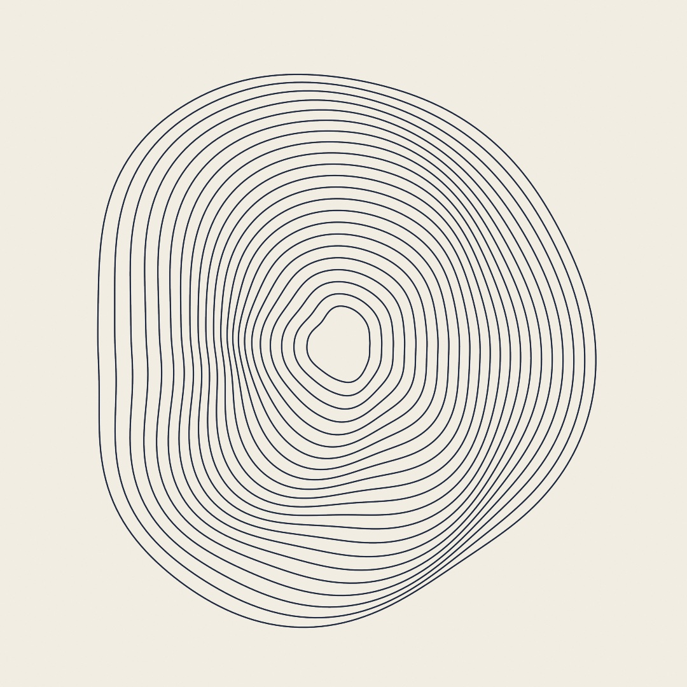
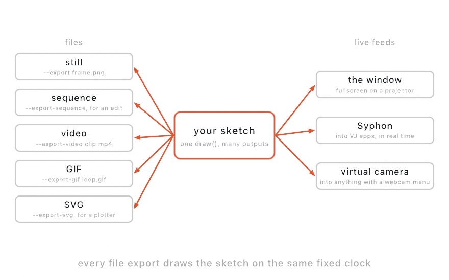
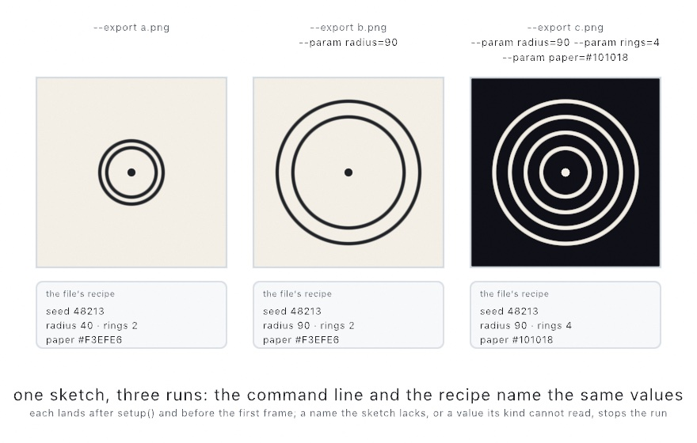
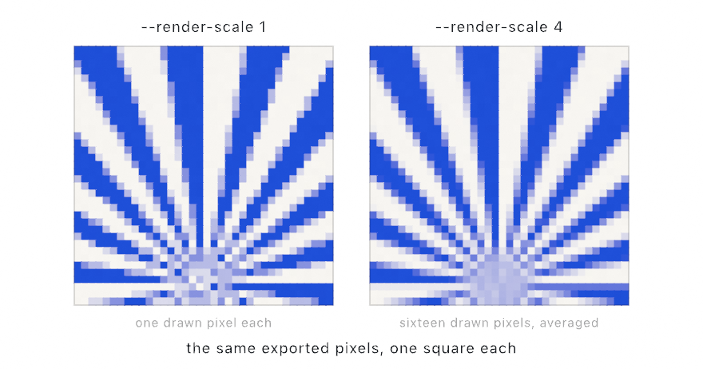
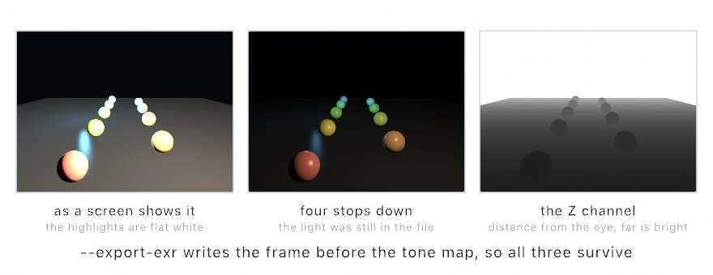
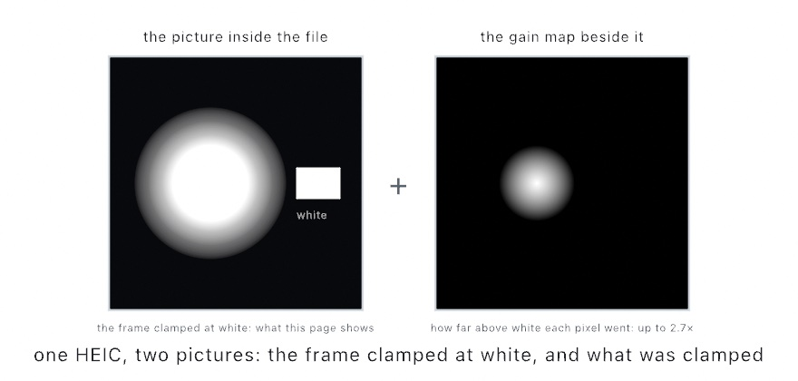
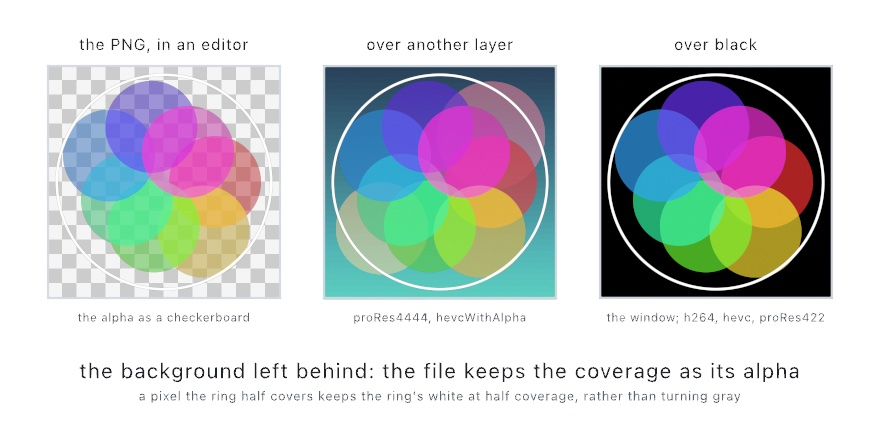

#### <sup>[Ollin](../README.md) → [Guide](README.md) → Chapter 41</sup>

---

# 41. Finishing a sketch



This chapter takes a sketch from a draft on your screen to files you can keep and share. You pick a keeper from a contact sheet, fix its seed and parameters, then size it, describe it, and export it with its recipe inside. Its steps turn the contour chart above into a poster, a loop, and a plot. Finer stills, more kinds of video, and a web page come after it, and [Chapter 42](42-MakingItPhysical.md) takes a sketch to machines, inks, and objects.

## Every export runs without a window

<picture>
  <source media="(prefers-color-scheme: dark)" srcset="Images/41-FinishingASketch/ExportMap-dark.jpg">
  
</picture>

Every file export runs the sketch *headlessly*, with no window. `setup()` runs, the clock advances to the frame you asked for, `draw()` runs, and the result is written. The clock steps by a fixed amount each frame, however long a frame takes to render. So an export repeats. The same sketch, seed, and frame make the same file every time. Sources follow the same clock. A video decodes by frame position. An `AudioPlayer` feeds its analyzer the matching slice of its file each frame. So a sketch that reacts to sound exports with its beats in the same places.

The export flags work on any example's executable. A sketch file of your own gets the same flags through the live host. Here and in the commands below, `MySketches/YourSketch.swift` stands for any sketch of yours:

```sh
swift run OllinLive MySketches/YourSketch.swift --export poster.png --frame 200
swift run --package-path Examples Example-Basic-HelloCircle --export-sequence /tmp/out --seconds 5 --fps 60
```

`--export` writes one frame as a PNG, or as HEIC when the file name ends in `.heic`. `--export-sequence` writes every frame as a numbered PNG, ready for a video editor. `--fps` sets how many frames make a second of the file. It takes a number, a fraction such as `30000/1001`, or the name of a broadcast rate, which the [Export reference](../Docs/Output/Export.md#frame-rates) lists. An export draws at the best render quality, `.detail`, since a file has no frame rate to protect. `--render-quality` lowers it when you want a fast draft.

The right side of the map, the window and the feeds that other apps read live, belongs to [Chapter 43](43-Performing.md#live-feeds-into-other-apps).

## Picking a keeper: a contact sheet and a fixed seed

A sketch that uses randomness is many pictures, one for each seed. Finishing it starts with choosing one, the **keeper**, the variation you will finish. [Chapter 4](04-Randomness.md#finding-a-seed-to-keep) made a **contact sheet** for that, many seeds laid out side by side. A photographer prints a whole roll small the same way, before choosing a frame to enlarge. `--seed` sets the seed the sheet starts from:

```sh
swift run OllinLive MySketches/YourSketch.swift --export-grid sheet.png --seeds 25 --seed 4810
```

That sheet shows seeds 4810 to 4834, each tile labeled with its seed. When a tile is the one, write its seed into `setup()`. The contour chart in [Putting it together](#putting-it-together-the-contour-chart) was found this way, at 4821:

```swift
override func setup() {
    seed(4821)          // the variation this keeper was found at
}
```

From then on every export draws that same variation. A sketch that sets its own seed ignores the `--seed` flag, so make the contact sheet before you write this line.

The parameters need the same care. A headless export reads the values written in the code, not the ones you last set in the inspector. So once the sliders feel right, press **Save parameters** in the inspector, which writes each tuned value into its `@Param` line ([Chapter 1](01-HelloOllin.md#saving-the-values-you-tuned)). A value you want for one render only can go on the command line instead, which the recipe step shows.

## Sized for the output: fractions of the canvas, and paper sizes

A keeper often leaves at a size you did not draw it at: a poster, a small loop, a sheet for a pen. A sketch whose sizes are all fractions of the canvas draws the same picture at any of them. [Chapter 1](01-HelloOllin.md#placing-things-without-pixels) showed the habit. Take the shorter side of the canvas as the unit, and write every radius and every line weight as a fraction of it.

The canvas can also be a sheet of paper. `CanvasSize` has named sheets, such as `.a4`, `.a3`, and `.usLetter`, and `.landscape` turns one on its side:

```swift
override var canvasSize: CanvasSize { .a4 }
```

A vector export maps one canvas pixel to one PDF point, 1/72 of an inch, so the exported page *is* that sheet. `.a4.dpi(300)` draws the pixels at 300 dots per inch for a raster export, and the PDF page stays A4. [Canvas](../Docs/Core/Canvas.md#export-size) lists every named sheet.

## Motion: video and GIF

A sketch that moves leaves as video or as a GIF, encoded straight from the frames:

```sh
swift run OllinLive MySketches/YourSketch.swift --export-video clip.mp4 --seconds 12
swift run OllinLive MySketches/YourSketch.swift --export-gif loop.gif --seconds 4 --gif-width 540
```

Reach for video first. A **codec** is the method a video file is compressed with, and `h264`, `hevc`, and ProRes are three of them. The default, `h264`, plays everywhere. `--codec hevc` gives better quality for the same size when the file needs to be smaller. The two ProRes codecs are for editing programs rather than for sharing. `--bitrate`, in megabits a second, sets the file size, and a 1080-pixel square looks clean at about 10 to 15 in `h264`.

A GIF suits a short loop. It holds at most 256 colors a frame, and each second weighs a lot. Keep it to a few seconds, and shrink it with `--gif-width`. A sketch where every pixel changes every frame defeats the format's compression, and the file grows large. The palette starts from the first frame's colors, and later colors join it until all 256 are used. `--gif-palette per-frame` chooses a new palette for every frame, for a sketch whose colors keep changing.

A sketch that declares `loopDuration`, as [Chapter 3](03-MotionAndTime.md#putting-it-together-a-loop-that-never-ends) did, exports one lap with `--export-loop`, and no `--seconds` is needed. The file then repeats without a seam.

## Lines for a pen: SVG and PDF

[Chapter 15](15-ShapesAsMaterial.md#how-a-plot-runs) planned a plot: one file per pen, the pen order, hatch spacing from the nib, and a test strip first. The file that carries all that is written by `--export-svg`:

```sh
swift run OllinLive MySketches/Plate.swift --export-svg plot.svg
swift run OllinLive MySketches/Plate.swift --export-svg plot.svg --hatch
```

The exporter records each draw call as geometry, before any pixels exist. Circles become `<circle>`, polylines become `<polyline>`, or `<polygon>` when closed, and shapes and outline text become `<path>`. Transforms and opacity carry over. The file opens in a browser or a vector editor, and a pen plotter's software reads it. A pen cannot fill, so `--hatch` turns solid fills into parallel lines spaced by tone. Add `--cross-hatch`, or set `--hatch-spacing` and `--hatch-angle`. Stroke fonts and stroked lines pass through as the single lines they already are. Ollin leaves images out of a vector file.

The same recording writes as a PDF with `--export-pdf plot.pdf`, and that is the path to a printer. On a paper-sized canvas the PDF is that sheet, sharp at any printer's resolution. Everything the SVG carries, the PDF carries too, hatching included.

## Saying what it shows: describable output

<picture>
  <source media="(prefers-color-scheme: dark)" srcset="Images/41-FinishingASketch/SayingWhatItShows-dark.jpg">
  
</picture>

A finished picture should reach people who cannot see it. Somebody using a screen reader, a program that reads the screen aloud, gets nothing from pixels. They arrive at your window or your exported drawing and find a rectangle with nothing to say. One line gives it something to say:

```swift
describe("A bay at noon, with a small boat crossing the water.")
```

That sentence becomes the canvas's accessible name, the text a screen reader reads for it. Turn on VoiceOver with ⌘F5 and the window reads it out.

A sketch with things in it can name them. Here `sun` and `boat` are the points the two are drawn at, and each box is the rectangle around one:

```swift
let sunBox = Rectangle(center: sun, width: 80, height: 80)
let boatBox = Rectangle(center: boat, width: 60, height: 44)
describe("the sun", as: "a pale yellow disc high on the left", in: sunBox)
describe("the boat", as: "a small dark hull with one sail", in: boatBox)
```

Each named part becomes something a screen reader can move to. The `in:` region is optional. With one, a listener can find a part by where it is, rather than only in order.

**Write the words from the same numbers that draw the picture.** A description written that way cannot fall out of date. Here `x`, `y`, and `r` are the sun's position and radius, and its height places the disc and chooses the word:

```swift
let p = Vector2(x, y)
drawCircle(center: p, radius: r)
describe("the sun", as: "a yellow disc \(p.y < height / 2 ? "high" : "low")")
```

Call `describe` every frame. Naming a part again replaces what you said, so the list never grows. Empty text takes a part out when it leaves the picture. Naming it again puts it back in the same place, so the reading order stays put.

Keep the parts few, and describe what is there rather than how it is made. Say "a red circle drifting left", not "a `drawCircle` driven by `sin(time)`". A texture is not a part, so the glow around the sun is drawn and not named.

The words travel with the work. An exported SVG carries them as `<title>` and `<desc>`, where a browser and a screen reader look. A PDF carries the summary as its document title. PNG, GIF, and video exports do not carry it. Ollin will not write the description for you. It could list your shapes, but only you know which circle is the sun. [Accessibility](../Docs/Helpers/Accessibility.md) has the rest, and `Examples/Basic/Describing` is a day passing over that bay, saying what it shows as it goes.

## The recipe in the file

Every PNG, SVG, PDF, and video Ollin writes carries a small **recipe** in its metadata, the part of a file that describes the file. The recipe holds the seeds the run used, the value of every `@Param`, and which frame at which rate produced it. It also holds the git commit the code was at, marked dirty if you had uncommitted edits. Read it back with a metadata tool such as ExifTool, which reads the recipe out of the file:

```sh
exiftool -Description poster.png
```

Say you find an image from four months ago that you like. You do not remember which variation produced it, and the sketch has changed since. The file tells you the seed, 48213, the parameter values, and the commit. Check out the commit, pass the seed, and you have it back. Ollin writes no recipe into a GIF.

A recipe leads back to the code only if the code still exists, and uncommitted edits often do not. The commit is marked dirty, and the next save overwrites what you rendered. Add `--capture-source` to any export and the code is kept for you:

```sh
swift run --package-path Examples Example-Randomness-Variations --export keeper.png --capture-source
```

Your working files go into the repository as a commit that sits on no branch, and the file is named after it. `keeper.png` becomes `keeper-93ae989.png`. Your branch, your staged changes, and your edits stay where you left them. Months later the file name is enough to get the code back:

```sh
git show 93ae989:Examples/Randomness/Variations/Sketch.swift
```

[Export](../Docs/Output/Export.md#reproducibility-metadata) lists every field the recipe holds, and [captures that know their source](../Docs/Output/Export.md#captures-that-know-their-source) the rest of that flag.

### Passing the parameters back in

Reading a recipe is half of it. The other half is handing its values back to a run, with the `--param` flag that [Chapter 1](01-HelloOllin.md#a-shorter-way-to-run-things) named. `--param name=value` sets one declared parameter for this run, and it repeats, so a run can carry as many as you need:

```sh
swift run --package-path Examples Example-Live-Parameters --export keeper.png --param radius=40 --param paper=#101018
```

Each value is read by its own parameter's kind. A number stays a number, and a color is a hex string. A 2D vector is two numbers with a comma between them, and a 3D one three. A menu choice is its name, spelled loosely, so `easeOut`, `ease-out`, and `"Ease Out"` all find the same one. The [Export reference](../Docs/Output/Export.md#setting-a-parameter-for-the-run) lists every kind.

<picture>
  <source media="(prefers-color-scheme: dark)" srcset="Images/41-FinishingASketch/ParametersBackIn-dark.jpg">
  
</picture>

The three panels are one sketch rendered with three sets of flags. Under each render is the recipe its file would carry, naming the values it was drawn with. A file tells you its parameters, and the flag hands them back.

The value is set on the parameter before `setup()` runs, and set again after it. So what `setup()` builds reads it, it wins over a value the sketch sets for itself, and the new file's recipe names it. Ask for a parameter the sketch does not have, or a value its kind cannot read, and the run stops and says so. It never renders something you did not ask for.

A sketch you wrote last year, or somebody else's file, does not announce its parameters anywhere. `--list-params` asks it. For a sketch file named `Rings.swift` with five parameters, the listing looks like this:

```sh
swift run OllinLive MySketches/Rings.swift --list-params
```

```
5 parameters, as --param takes them

  radius  Double  120      20...300
  rings   Int     5        1...12
  paper   Color   #FFFFFF
  style   menu    dots     Dots, Rings, Mesh Lines

  Paper
  grain   Double  0.35     0...1
```

Each line gives the name, the kind, the value it holds, and what it will take. Every value is printed the way `--param` reads it, so a line can be pasted straight into a flag. The listing runs `setup()` first and honors anything given beside it. So with `--cue dusk` beside it, which applies a cue, a saved look from [Chapter 43](43-Performing.md#a-look-you-come-back-to-cues), the listing says what that cue holds.

## Putting it together: the contour chart

The contour chart is one keeper made ready to leave. Rings of single lines circle a still center. One looping noise field pushes them in and out, so neighboring rings bend together and the outer ones bend most. It leaves three ways, as a poster, a loop, and a plot, and then its recipe is read back to render it again. Make `MySketches/ContourChart.swift`:

```swift
import Ollin

final class ContourChart: Sketch {
    @Param(4...40) var rings = 22
    @Param(0...0.2) var swell = 0.06
    @Param var paper = Color(hex: 0xF2EDE3)
    @Param var ink = Color(hex: 0x1D2A44)

    let lapSeconds = 8.0
    override var loopDuration: Double? { lapSeconds }

    override func setup() {
        seed(4821)          // the variation this keeper was found at
    }

    override func draw() {
        background(paper)
        noFill()
        stroke(ink)
        let unit = min(width, height)       // every size is a fraction of the canvas
        strokeWeight(unit * 0.002)

        let lap = loopProgress(over: lapSeconds)
        for k in 0..<rings {
            let depth = Double(k) / Double(rings)
            let base = unit * (0.04 + 0.36 * depth)
            let ring = (0..<240).map { j -> Vector2 in
                let angle = Double(j) / 240 * .tau
                let push = signedNoise(cos(angle) * 0.8 + depth * 1.5,
                                       sin(angle) * 0.8, loop: lap)
                let r = base + push * unit * swell * (0.3 + depth)
                return center + Vector2(cos(angle), sin(angle)) * r
            }
            drawPolyline(ring, closed: true)
        }

        describe("\(rings) contour lines around a still center, the outer ones bending most, drifting in an eight-second loop.")
    }
}
```

Most of the listing is the drawing. The rest is what makes it ready to leave, and each part is a step of the chapter:

- **The seed** is the keeper from [the contact sheet](#picking-a-keeper-a-contact-sheet-and-a-fixed-seed). The keeper was 4821, so `seed(4821)` fixes it, and every export draws that same chart.
- **The four parameters** hold the values tuned in the inspector and saved into their declarations.
- **The lap** is declared. The noise is read with `loop:` from [Chapter 5](05-Noise.md#coming-home-the-loop-argument), and `loopProgress(over:)` runs it through once every `lapSeconds`, so the field drifts and comes home. The same number is `loopDuration`, which lets the loop export find its own length.
- **Every size is a fraction of `unit`**, the shorter side of the canvas, as in [Sized for the output](#sized-for-the-output-fractions-of-the-canvas-and-paper-sizes). The radii and the line weight scale together, so the chart draws the same on any canvas. Every line is stroked, so a pen gets the lines it needs with nothing to hatch.
- **The description** is built from `rings`, so it stays true when the count changes.

> **Swift note.** `(0..<240).map { j -> Vector2 in … }` builds a list of 240 points, one for each `j`. `j -> Vector2 in` names the closure's input and says it hands back a `Vector2`, which helps a reader follow a closure several lines long.

Then make it yours:

- Size it for paper. Add `override var canvasSize: CanvasSize { .a3.dpi(300) }`, and the PDF is a true A3 page. The chart stays centered and sized to the shorter side, since every size in it is a fraction of the canvas.
- Put it on a page. `--export-web contours.html` records one lap with no length given, because the sketch declares it, and the page wraps the lap without a seam. [A page that plays it](#a-page-that-plays-it-the-web-export) has the rest.
- Keep the code with the file. Add `--capture-source` to any of the exports below. Each file is then named after a commit of your working files, so even edits you never committed come back.

When it is ready, it leaves as a poster, a loop, and a plot:

```sh
swift run OllinLive MySketches/ContourChart.swift --export-pdf poster.pdf
swift run OllinLive MySketches/ContourChart.swift --export-loop contours.gif --gif-width 540
swift run OllinLive MySketches/ContourChart.swift --export-svg plot.svg
```

The poster is a PDF, because every line in it is geometry, so it prints sharp at any size. The loop is one lap, with no `--seconds` given. The plot is the same polylines as single paths, in the order they were drawn, and the SVG carries the description with it.

Then read the recipe back. Ollin writes no recipe into a GIF, so read it from the poster. A PDF keeps it in its Subject field:

```sh
exiftool -Subject poster.pdf
```

It names seed 4821, the four parameter values, the frame, and the commit the code was at. To render a sibling with one thing changed, hand a parameter back in:

```sh
swift run OllinLive MySketches/ContourChart.swift --export-pdf dusk.pdf --param paper=#14182A --param ink=#E9DCC4
```

The new file's recipe names the new colors, and the sketch on disk is untouched.

## More from a still: code, finer sampling, linear light, and brighter than white

The chart's poster is all lines, and a line prints sharp at any size. A still made of filled shapes, light, and color asks more of the file. You can render stills from your own code and sample each pixel more finely. You can also keep the light from before it is fitted to a screen, or keep light above white for a display that shows it.

### Rendering from code: `OllinApp.image(of:frame:)`

The export flags wrap one function, and you can call it yourself. Use it to render many pictures on your own terms. Thumbnails for a catalog, a batch over a folder of inputs, and a test that checks a render has not changed all work this way. It is how a render farm or a test suite works, with no screen attached. The figure shows one sketch rendered at four frames, each from a new instance, so every render starts from `setup()`:

<picture>
  <source media="(prefers-color-scheme: dark)" srcset="Images/41-FinishingASketch/HeadlessCapture-dark.jpg">
  
</picture>

```swift
do {
    let frame = try OllinApp.image(of: MySketch(), frame: 200)
    // a CGImage, rendered with no window anywhere in sight
} catch {
    print(error)   // why the frame did not draw
}
```

Here `MySketch` stands for your own sketch's class. `OllinApp.image(of:frame:)` takes the sketch you pass it, runs `setup()`, and advances the clock to the frame you asked for. Then it renders and hands back a `CGImage`, the platform's type for a picture in memory. When the frame does not draw, the call throws an `ExportError` instead, and `catch` prints its sentence. The usual cause is a shader that stopped compiling, and the sentence says so. `OllinApp.export` is that call with a file writer after it, which is all `--export` is. Each job is a loop around this one call, and none of them needs a window.

### Drawing finer than you save: supersampling

`--render-scale` sets quality the other way from `--render-quality`. `--render-scale 2` draws the frame at twice the width and twice the height, then averages every block of four drawn pixels back into one. The file comes out the size it always was. Drawing a picture larger than you keep it and averaging it down is called **supersampling**. It is one of the oldest ways to smooth edges in computer graphics.

<picture>
  <source media="(prefers-color-scheme: dark)" srcset="Images/41-FinishingASketch/SamplingFiner-dark.png">
  
</picture>

The difference shows along the edges of filled shapes and the letters of outline text. Those reach the screen as triangles, and every pixel along an edge decides how much of one it covers. A drawn pixel already takes several samples of the triangles, and a larger drawing multiplies them, so the decision gets finer. Circles, rectangles, circular arcs short of a full turn, and every stroked line work out their coverage by formula instead. They are already as sharp as they get, so the setting does nothing for them, and the contour chart's poster gains nothing from it.

The cost is four times the pixels at 2 and sixteen times at 4, the highest setting. It is too slow for a window that owes you a frame every sixteen milliseconds, and cheap for a poster:

```sh
swift run OllinLive MySketches/YourSketch.swift --export poster.png --render-scale 2
```

A blur, a flare, and anything else you asked for with `postProcess` still measure in canvas pixels. A `.gaussianBlur(radius: 12)` is twelve pixels wide at every scale, so the setting never changes the look of an effect.

### The frame before the tone map: OpenEXR

A PNG is a frame in its final form. The renderer adds light up in linear light, with numbers proportional to the light itself, and those numbers run past white wherever a highlight is. The last step folds them into the range a screen can show, the tone map of [Chapter 19](19-LayersAndEffects.md#brighter-than-the-screen-tonemap). Then it rounds each color to one of 256 levels. A PNG is the right file to look at. It is the wrong file for a colorist, who adjusts a film's color, because the part above white is already gone.

`--export-exr` writes the frame one step earlier, as an OpenEXR file. OpenEXR is the format compositing programs read, the programs that layer images into one. Industrial Light & Magic made it for film work and released it in 2003. The figure shows one frame three ways, as a screen shows it, darker so the highlights keep their shape, and as depth:

<picture>
  <source media="(prefers-color-scheme: dark)" srcset="Images/41-FinishingASketch/LinearFile-dark.jpg">
  
</picture>

Its red, green, and blue hold the light itself, so a highlight ten times brighter than white is still ten times brighter in the file. Its alpha, the fourth number per pixel, holds how opaque each pixel is, the same transparency `background(.clear)` gives a PNG. If the sketch drew through a 3D camera, a fifth channel, `Z`, holds the distance from the eye at every pixel. It is in the sketch's own units.

Export one frame, or a sequence:

```sh
swift run OllinLive MySketches/Plaza.swift --export-exr frame.exr
swift run OllinLive MySketches/Plaza.swift --export-sequence /tmp/frames --seconds 2 --exr
```


A compositing program holding the depth channel can add fog after the render, at a distance it picks, or throw the background out of focus. A grade, an adjustment of exposure and color, can pull the exposure down. It then finds the shape of a highlight that the PNG clipped to a flat white disk. None of it needs a new render.

The cost is size. The file is uncompressed, so a 1080-pixel square frame with depth is about 14 MB, and a sequence of them is large. Export the moments you need rather than every frame. Surface normals and per-object masks are not in the file. Ollin shades in one pass and keeps no buffer of geometry to write them from. `Examples/Export/LinearFrame` is a lane of glossy spheres under one hard lamp. Its highlights reach ten times over white, and its depth runs from about three units to the far plane.

### Brighter than white: HDR output

The EXR keeps the light above white for another program. Some displays can show part of it directly, which is called HDR, for high dynamic range. Tone mapping is what you do when the screen cannot go any higher, and a recent Apple display sometimes can.

That display holds two things back from an ordinary sketch. It can show colors more saturated than sRGB, the standard range of screen colors, can describe. It can also, for a while, make small areas brighter than white. One declared line switches both on:

```swift
final class Lamps: Sketch {
    override var colorOutput: ColorOutput { .extended }
}
```

Now a value of 2.0 is drawn twice as bright as white. White text beside it stays white while the lamp's core glows. Leave `toneMap` off here. `.aces` exists to squash those values back under 1.0, which you no longer want.

The other half is color. `Color` stays an sRGB type, and a color outside that range is named in Display P3, the wider range of recent Apple displays:

```swift
fill(Color(displayP3: 1, green: 0, blue: 0))    // a red sRGB cannot make
```

Its stored components come out slightly outside 0…1, which is how a color says it goes further than sRGB. Nothing clamps it on the way through. On a `.standard` sketch it lands on the nearest sRGB red at the end, so naming one is always safe.

The brightness depends on the display having room to spare at that moment, which it calls headroom. The system gives and takes it as screen brightness changes. Read `displayHeadroom` to see what you got, where 1.0 means none.

An exported PNG keeps the wide color but not the brightness, because PNG stops at white. Two formats keep both. An `.extended` sketch's `--export-video` is written as HDR10, the usual format for HDR video, with no extra flags. A still asked for by name as HEIC, the format iPhone photos use, keeps its highlights:

```sh
swift run --package-path Examples Example-Rendering-ColorOutput --export lamp.heic
# Ollin: exported frame 0 → lamp.heic (1080×1080, highlights to 2.70x white in a gain map)
```

The picture inside that file is the PNG's picture, so any viewer can open it. Beside it sits a record of the light that was clipped away, called a **gain map**. Its form is set out in the standard ISO 21496-1. A display with headroom puts the light back. A page like this one cannot show light above white, so the figure shows the two parts of such a file instead:

<picture>
  <source media="(prefers-color-scheme: dark)" srcset="Images/41-FinishingASketch/WhatTheStillKeeps-dark.jpg">
  
</picture>

The left panel is the picture inside the file, clamped at white, and the lamp's flat plateau is where everything above 1.0 went. The right panel is a gain map, drawn in shades of one gray. It is black where the frame stayed in range, and it gets brighter the further above white a pixel went. A display with headroom multiplies the two together, and the plateau turns back into a lamp. Run [`Examples/Rendering/ColorOutput`](../Examples/Rendering/ColorOutput/Sketch.swift) on a recent Mac laptop to see it, and turn the screen brightness down while you look.

## More ways to leave as motion: transparency, broadcast rates, slow motion, and settled frames

The chart leaves as one lap of a GIF, and it could leave as an `h264` video. Other settings change what a video holds. A clip can keep a see-through background, or keep a broadcast's frame rate to the fraction. It can run slower than the sketch did, or wait for a picture to settle before each frame is written.

### Leaving the background behind: transparent video

A canvas that starts with `background(.clear)` leaves its background out of the file. Ed Catmull and Alvy Ray Smith gave computer pictures this fourth channel in the 1970s. Use it for a sketch that goes over a camera feed or another layer rather than over black. That happens in an editing program, or in a VJ program, the software a video jockey performs live visuals with. The PNG gets an **alpha channel**, the fourth number per pixel that says how opaque it is. A video keeps one only when its codec carries one. `--codec proRes4444` is the one for an editing program, and `hevcWithAlpha` makes a file a fraction of that size. `h264` has no alpha channel, so it is drawn over black, and the export says so. The window draws the same frame over black too, so open the file to see the cut.

<picture>
  <source media="(prefers-color-scheme: dark)" srcset="Images/41-FinishingASketch/LeavingTheBackground-dark.jpg">
  
</picture>

The figure is one export drawn three times. The first panel is the PNG as an image editor shows it, with a checkerboard standing for the transparency. The second is the same file over another layer, which is what a compositing program does with a `proRes4444` or `hevcWithAlpha` clip. The third is over black, which is what the window showed while you drew it, and what `h264`, `hevc`, and `proRes422` keep.

Look at the edge of the white ring in the first two. A pixel the ring half covers keeps the ring's white at half coverage, rather than turning gray. A blur or another frame filter runs on the frame with each color already multiplied by its coverage, which is called **premultiplied**. So it spreads the coverage along with the color. A live feed keeps the alpha too. In code, `VideoCodec.carriesAlpha` tells the two kinds of codec apart, and `Examples/Export/Cutout` is the cluster of lobes in the figure.

### The grid a broadcast asks for: named frame rates

A clip for a broadcast or an edit has a frame rate somebody else chose. It is often a fraction, such as the 29.97 frames a second of NTSC, the color television standard the United States adopted in 1953. The `--fps` flag takes a name for those, and the name is the safer thing to type:

```sh
swift run OllinLive MySketches/YourSketch.swift --export-video spot.mp4 --seconds 30 --fps ntsc
```

`ntsc` is 30000/1001 rather than its decimal. So the frames land where a broadcast editor expects them, however long the clip runs. In code the same rate is a `FrameRate`, and a plain number still stands in for one. The [Export reference](../Docs/Output/Export.md#frame-rates) has the named rates, the fractions they keep, and what drifts when a decimal is used instead. The live window runs at the display's own rate, and `frameRate` on the sketch reads what it measured.

### Slower than it happened: slow motion

Some sketches move faster than the eye can follow, such as a collision or a burst. On screen you can only watch it again. In a file you can slow it down, the way film does by shooting more frames a second than it plays. The figure shows the frames a slow-motion export adds:

<picture>
  <source media="(prefers-color-scheme: dark)" srcset="Images/41-FinishingASketch/SlowerThanItHappened-dark.jpg">
  
</picture>

`--slow-motion` renders more frames of the same stretch of time:

```sh
swift run OllinLive MySketches/YourSketch.swift --export-video slow.mp4 --seconds 4 --slow-motion 4
```

That renders four seconds of the sketch's own time and writes sixteen seconds of video. The file still plays at its `--fps`. What changes is how many frames cover the run. The clock steps four times finer, so the sketch is asked for the moments in between. The motion then takes four times as long to play.

`--seconds` still counts the sketch's own time, and the export prints both lengths. The figure uses `--slow-motion 3`, which puts two more frames between each pair the sketch drew at 30 a second.

**Motion measured in seconds slows down, and motion measured in frames does not.** A radius built from `sin(time)` follows the clock, and a finer clock slows it. So does a position moved by `speed * deltaTime`. A position moved by a fixed step once per `draw()`, with no `deltaTime` in it, moves the same amount every frame. The finer clock does not change it. If a slow-motion export comes out at ordinary speed, that is why, and the `deltaTime` of [Chapter 3](03-MotionAndTime.md#when-a-frame-takes-too-long) is the fix.

When a frame is expensive to draw, the GPU can make the frames in between instead:

```sh
swift run OllinLive MySketches/YourSketch.swift --export-video half.mp4 --seconds 4 --slow-motion 2 --made-frames
```

`--made-frames` draws the frames it would have drawn anyway, and asks the GPU to build the ones in between from the pair on either side. It is the interpolator a live window can use ([Chapter 33](33-TracedLight.md#drawing-fewer-frames-frame-interpolation)). The made frames are pictures your sketch never drew, so the export says so on the console and writes `"madeFrames":true` into the file's recipe. It needs a 3D scene under a perspective camera, and it only halves the speed. [Export](../Docs/Output/Export.md#slow-motion) compares the two ways.

### Settled, then written: a running mean in a video

Some pictures are not finished by one draw. A running mean, the `Accumulator` from [Chapter 19](19-LayersAndEffects.md#converging-instead-of-brightening-the-running-mean) or a `LineSpray` through a lens from [Chapter 33](33-TracedLight.md#a-lens-made-of-samples-depth-of-field-from-light), starts grainy and settles as frames pile up. It starts over whenever the camera moves. In a video of a turning scene every frame has a new camera, so every frame is the grainy first one. `--settle N` draws each written frame N times with the clock held, and writes the last:

```sh
swift run --package-path Examples Example-Rendering-LineSpray --export-video turn.mp4 --seconds 10 --settle 40
```

The clock does not move during the held draws. A camera driven by `time` stays put while the mean settles, and then the clock steps on. It costs N times a plain export. The [export reference](../Docs/Output/Export.md#settled-frames) has what it refuses, and why a `noClear` canvas that piles up is the one thing it does not settle.

## A page that plays it: the web export

The chart could also leave as a page. A video carries pixels, and a page can carry what made them. `--export-web` records what the sketch draws over a duration, frame by frame at a fixed rate. Then it writes a page that plays the recording back in a browser, with the motion and the parameters still live:

```sh
swift run OllinLive MySketches/YourSketch.swift --export-web page.html --seconds 6
swift run OllinLive MySketches/YourSketch.swift --export-web page.html --seconds 6 --inline
```

The recorder writes down the shape records the renderer would have received each frame. Nothing is rendered on the Mac, so nothing that depends on the Mac's GPU lands in the file. The page draws those records with the framework's own shape shader, rewritten from Metal to GLSL. GLSL is the shader language of WebGL2, the browser's graphics interface. The GLSL import of [Chapter 18](18-YourFirstShader.md#somebody-elses-shader-glsl-import) does the same kind of rewriting in the other direction. A frame on the page matches the frame `--export` gives, to within a few levels.

A sketch that declares `loopDuration` records one lap with no length given, and the page wraps it without a seam. On a lap, each motion is fitted to the sine waves it is made of. The page then works it out at any moment from a few numbers. A parameter can be driven by a formula, a rule written as text in [Chapter 43](43-Performing.md#writing-the-parameter-as-a-rule-formulas). It crosses as the formula, worked out on the page's own clock. What fits neither travels as samples, and the page blends between them.

<picture>
  <source media="(prefers-color-scheme: dark)" srcset="Images/41-FinishingASketch/PageFromRecords-dark.jpg">
  
</picture>

The figure follows one ring of circles across. On the left is the frame the Mac renders. In the middle is what the recorder wrote instead of pixels, twelve circles a frame. The parts that never change are stored once, and the three that move are kept as columns. The sketch declared a lap, so each column is fitted to sines. On the right is the page, with the three parameters the exporter could wire, offered as a slider and two color wells. The size on the arrow is the page's measured weight, and most of it is the player and its shaders rather than the ring.

The first form is one file you can open, host, or place in another page with an `iframe`. The second, `--inline`, is the canvas and one script block with no page around them, to paste into a page you already have. The script leaves a handle on the canvas, `canvas.ollin`, that plays, pauses, and seeks. A reader whose system asks for less motion sees the first frame, still.

The sketch's parameters cross as controls. After recording, the exporter tries each `@Param` at a few other values, records again, and checks that what moved changed along a straight line. Each parameter that passes is offered as a slider, a stepper, a checkbox, or a color well. A parameter that changes what is drawn, or moves a number some other way, stays at its recorded value. The exporter says which and why.

Most 2D drawing crosses. It includes the shapes, strokes, fills, and text of the earlier chapters, and the layers and filters of [Chapter 19](19-LayersAndEffects.md). Your own shaders, pictures, and the fields of [Chapter 32](32-SculptingWithFields.md) cross too. A video clip, a mesh, and a few other calls stop the export before a file is written. The message names the call and the frame where it met it. Those sketches leave as video. [Web page](../Docs/Output/Web.md#what-crosses) lists everything that crosses and what the page weighs. [`Examples/Web/BreathingRing`](../Examples/Web/BreathingRing/Sketch.swift) is a sketch to try it on.

## Where this comes from

The contact sheet is the photographer's, a whole roll printed small to choose from. The pen-plotter revival that SVG export serves grew around the AxiDraw plotter and the #plottertwitter community. They carry on from the computer-art plotters of the 1960s that this guide's recreations visit. Reading a recipe back uses Phil Harvey's ExifTool, the common reader for the metadata a file carries. Full credits are in the project's [attribution notes](../ATTRIBUTION.md).

## Go deeper

- [Wide gamut & HDR output](../Docs/Drawing/ColorOutput.md): `colorOutput`, colors outside sRGB, and what each export format carries.
- [Export](../Docs/Output/Export.md): every flag, codec advice, GIF timing, SVG mapping, hatching, the named frame rates, and transparent output.
- [Perfect loops](../Docs/Output/Export.md#perfect-loops), [contact sheets](../Docs/Output/Export.md#contact-sheets-proofing-a-variation-space), and [the recipe](../Docs/Output/Export.md#reproducibility-metadata): the lap an export finds for itself, the sheet a keeper is chosen from, and where each format keeps its recipe.
- [Web page](../Docs/Output/Web.md): the flag and its length, what crosses and what stops the export, the two forms, the handle on the canvas, and what the page weighs.
- [Canvas](../Docs/Core/Canvas.md): the canvas presets, the named paper sheets, and the export size.
- [Accessibility](../Docs/Helpers/Accessibility.md): `describe` and the rest of what makes a sketch readable without sight.
- Worked examples: [`Examples/Export/`](../Examples/Export/).

---

[Contents](README.md#contents) · Previous: [Chapter 40, Music by rule](40-MusicByRule.md) · Next: [Chapter 42, Making it physical](42-MakingItPhysical.md)
