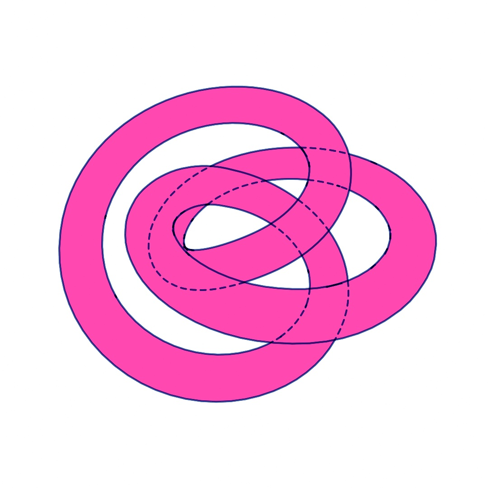
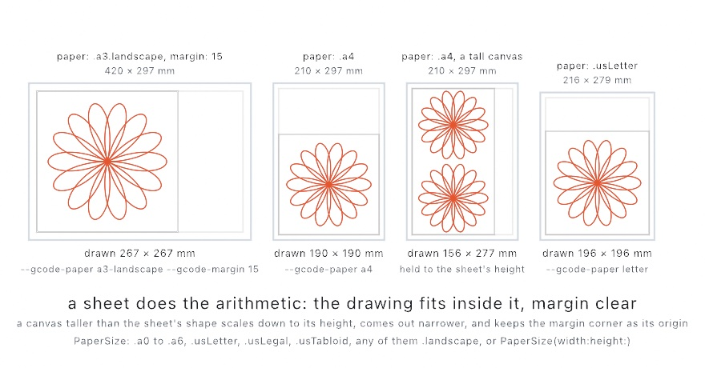
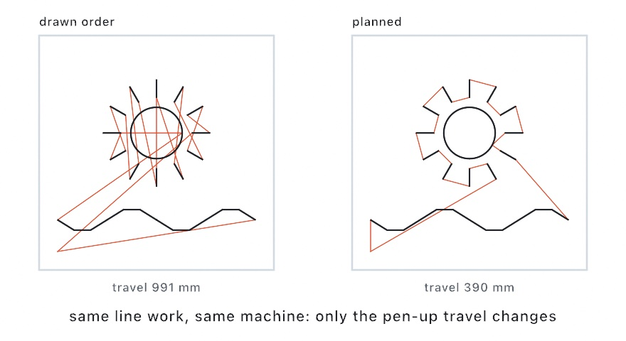
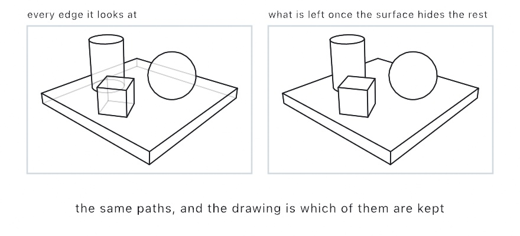
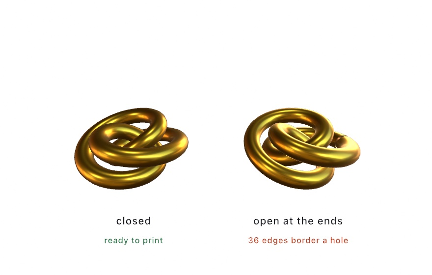
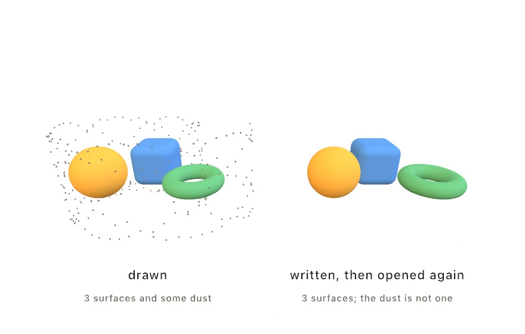
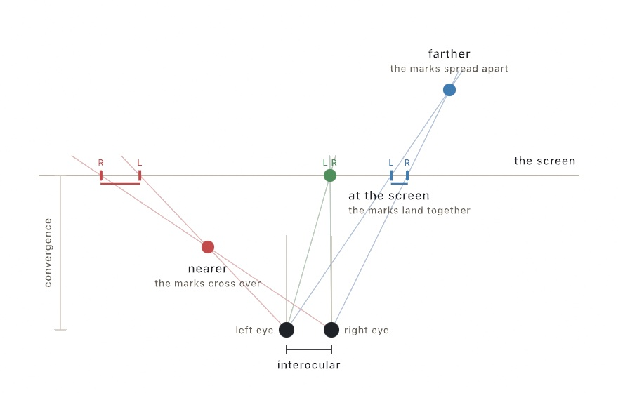

#### <sup>[Ollin](../README.md) → [Guide](README.md) → Chapter 42</sup>

---

# 42. Making it physical



A sketch can leave the screen as lines a plotter draws, inks a press prints, or a solid a 3D printer builds. You learn the file each machine reads, and how a 3D scene becomes lines a pen can follow. The knot at the top is one design sent three ways, as G-code for a pen, two ink plates, and a file to print. After it come embroidery and DXF, proofs and process plates, and a model and spatial video.

## Driving the machine itself: G-code

[Chapter 41](41-FinishingASketch.md) made files for screens, printers, and browsers. Its [contour chart](41-FinishingASketch.md#putting-it-together-the-contour-chart) also left as an SVG for a plotter, and the plotter's own software planned the moves. Some machines take their moves more directly.

**G-code** is a program of moves in millimeters, the language many hobby plotters, laser cutters, and CNC routers run. A CNC router is a cutter a computer drives. Use G-code to drive a machine directly, without its own software in between. It grew out of the numerical control of machine tools in the 1950s and was standardized as RS-274. Nearly every computer-driven machine tool reads a version of it. `--export-gcode` writes one from the same recorded frame as the SVG. `MySketches/Plate.swift` is the plate of [Chapter 15](15-ShapesAsMaterial.md#putting-it-together-the-plate), the file [Chapter 41](41-FinishingASketch.md#lines-for-a-pen-svg-and-pdf) sent to a pen:

```sh
swift run OllinLive MySketches/Plate.swift --export-gcode plot.gcode
swift run OllinLive MySketches/Plate.swift --export-gcode cut.gcode --gcode-machine laser
```

A machine needs real units, so the export asks for a physical width. The flag maps the canvas to 150 mm wide unless `--gcode-width` says otherwise. In code, `GCode(.plotter(), width: 150)` carries the finer settings: the pen lift, a laser's power and passes, a router's depth per pass. A named sheet saves the arithmetic. `GCode(.plotter(), paper: .a4)` fits the drawing inside an A4 page with ten millimeters clear on every side. On the command line, `--gcode-paper a4` does the same. Only line work travels. A stroke is drawn along its centerline, and a fill gives its outline, with `--hatch` shading fills as it does for the SVG of [Chapter 41](41-FinishingASketch.md#lines-for-a-pen-svg-and-pdf).

<picture>
  <source media="(prefers-color-scheme: dark)" srcset="Images/42-MakingItPhysical/OnTheSheet-dark.jpg">
  
</picture>

The figure plans a drawing of rose curves onto four sheets and prints the size each came to. On A4 with the default margin, the drawing is 190 millimeters square, the sheet's width less ten on each side. The drawing is held to the sheet's height as well as its width. So a canvas much taller than it is wide, 1080 by 1920 here, scales down to the 277 millimeters an A4 leaves for height. It comes out 156 wide. The A3 sheet lies wide with a 15-millimeter margin, which `margin: 15` sets in code and `--gcode-margin 15` sets on the command line. Its square drawing stops at 267 millimeters, the sheet's height less two margins. The drawing starts at the lower-left corner of the margin, one margin in from the corner the machine counts from. So a narrower fit sits at the left of the sheet, and a shorter one sits at the bottom. The [G-code reference](../Docs/Output/GCode.md) lists every named sheet, and `DXF(paper:)` sizes a [shop drawing](#a-drawing-for-the-shop-dxf) the same way.

The exporter plans the route before it writes a move. Open paths whose ends touch merge, so the pen stays down across them. Then the paths are reordered, each one starting near where the last one ended, to keep the moves with the pen up short:

<picture>
  <source media="(prefers-color-scheme: dark)" srcset="Images/42-MakingItPhysical/MachineRoute-dark.jpg">
  
</picture>

The planner is public. `GCode.toolpath(_:in:)` returns the route as plain contours, with the drawn and travel lengths in millimeters. The `Export/Toolpath` example walks a pen along its own route at machine speed. Give any program a dry run first, with the pen out, the laser disarmed, or the cutter above the material. [G-code](../Docs/Output/GCode.md) has the three machine profiles and every setting.

## A 3D scene on the plotter: `lineDrawing(of:)`

A vector file has nowhere to put a lit surface, so everything [Chapter 26](26-3DGently.md) and [Chapter 27](27-Meshes.md) drew stops at the raster. `lineDrawing(of:)` takes the same meshes and the same camera and hands back 2D paths. They are the lines a draftsman would draw, with everything the surfaces hide taken out. Use it to send a 3D scene to a pen. It follows the conventions of technical drawing, where hidden edges are left out or dashed. The figure shows one scene both ways:

<picture>
  <source media="(prefers-color-scheme: dark)" srcset="Images/42-MakingItPhysical/SceneAsLines-dark.jpg">
  
</picture>

Here `meshes` is a list of meshes, each already placed:

```swift
camera(Camera3D(eye: Vector3(6.4, 4.6, 7.2), target: Vector3(0, 0.7, 0)))
stroke(.black)
noFill()
for line in lineDrawing(of: meshes).paths {
    drawPolyline(line.points, closed: line.isClosed)
}
```

Three kinds of line are kept. The **silhouette** is where a surface turns away from the camera, the outline of a ball or a cylinder. A **crease** is where two faces meet at more than `creaseAngle`, the edge of a cube or the rim of a cap. A **boundary** is where a surface ends. The triangles inside a smooth surface are left out, which is why the ball is a circle rather than a net. Lower the crease angle and gentler ridges show. At 0 every edge is kept, which is a wireframe.

Everything handed to one call hides everything else in it, which is why it takes a list of meshes. `Mesh.transformed(by:)` puts each one where it belongs first, taking the same `MeshInstance` the instanced draws take. Two separate calls are two drawings that know nothing of each other, and the near one will not hide the far one.

The paths are ordinary line work, so `--export-svg` and `--export-gcode` both take them, and so does the [DXF](#a-drawing-for-the-shop-dxf) a shop opens. They are also paths on the canvas, so a brush or a hand-drawn wobble can go on them. The covered stretches are kept as `lineDrawing(of:).hidden`, and drawing them faint or dashed shows what is behind, as the left panel does. [Line drawing](../Docs/3D/LineDrawing.md) has the rest.

## Printing one ink at a time: separations

A pen draws a sketch's lines, and a press prints its colors. A risograph, a stencil printer that prints one ink at a time, or a screen-printing press lays down one ink per pass. It needs a separate grayscale plate for each ink, each a **spot ink**, one named ink mixed before printing. Use separations to print a sketch in a few chosen inks. The method is the standard one in prepress, where each ink acts as a colored filter over the paper. Each ink gets a **master**, a grayscale image where black means full ink and white means bare paper. The press runs the paper through once per master, and the inks stack up.

<picture>
  <source media="(prefers-color-scheme: dark)" srcset="Images/42-MakingItPhysical/Separations-dark.jpg">
  
</picture>

Printing inks are see-through, so overlapping inks mix. Pink over blue makes a purple that neither ink could print alone. So three plain-looking plates make a picture with more than three colors. Read the plates against the photograph. The flowers take nearly all the yellow plate has, and the blue one leaves them bare and goes to the woman instead. The pink one runs mid-gray almost everywhere, which is what a warm picture asks of it.

```swift
override var printInks: [Ink]? { [.fluorescentPink, .blue, .yellow] }
```

Declare that on your sketch and export with `--export-separations`. You get one master per ink, plus a preview with registration marks, the small crosses that line the passes up. Check the preview before committing to paper. In code, `artwork.separated(into:)` does the same to any `Image`, so you can look at the plates while you compose.

For a color no single ink can make, Ollin searches for the mix of ink coverages whose overprint comes closest. It measures closeness the way the eye does, in the same perceptual space [Chapter 2](02-Color.md)'s color mixing uses. Draw in an ink's own color and it separates without loss. Anything else, gradients and photographs included, lands on the nearest mix those inks can reach.

A press cannot hold a dot smaller than about two percent coverage, so anything fainter drops to bare paper. `separation.halftoned(pitch:)` turns each plate into dots `pitch` apart, as in [Chapter 9](09-Pictures.md)'s halftone. It turns each ink's grid of dots to its own angle. The inks then overprint into a small rosette rather than a moiré, the wavy stripes two grids make. `PrintSeparation.screenAngles(for:)` says which angle each ink got, and `separation.dithered()` is the grainier choice. [Print separations](../Docs/Output/PrintSeparations.md) has the ink catalog, with the measured colors of the standard risograph inks, and the screening details.

## Something you can hold: a 3D print

The plot and the plates are flat. A 3D printer builds a `Mesh` as a solid object. Use it to hold a shape your sketch made. Here `sculpture` is a mesh the sketch built, and the call is short:

```swift
try? sculpture.normalized(scale: 60).write(to: "sculpture.3mf")
```

A mesh carries bare numbers, and a printer needs millimeters. `normalized(scale: 60)` centers the shape on the origin, where a build platform wants it, and fits its longest side to 60 mm. The extension picks the file format: STL, OBJ, or 3MF, three common formats for 3D printing. The file records that size, and `try?` skips the write if it fails.

A shape can look finished on screen and still be impossible to print. A printer has to decide, for every point in space, whether it is inside the object or outside. It can only answer if the surface closes. Here are two copies of the same knot, one swept closed and one left open at its ends:

<picture>
  <source media="(prefers-color-scheme: dark)" srcset="Images/42-MakingItPhysical/Fabrication-dark.jpg">
  
</picture>

On screen an open surface looks as solid as a closed one. So check before you print:

```swift
let check = sculpture.printCheck()
print(check.summary)        // "9360 triangles, 60.00 x 52.50 x 26.02 units: ready to print"
```

`printCheck()` reports whether the surface closes, and whether neighboring triangles agree on which side is outside. It also reports whether the shape is inside out, and how big the file says it is. When something is wrong, `problems` says so in words. A mesh that fails is still written, with a note, because an open surface is fine to draw and only a print needs it sealed.

A shape that closes by construction saves the repair. The metaballs and isosurfaces of [Chapter 32](32-SculptingWithFields.md#the-other-way-out-field-to-mesh) close, since a field has an inside. So do the solid primitives and a tube swept with `closed: true`. A plane, or a lathe without caps, does not.

One more thing happens on the way out. Ollin's mesh generators make flat-shaded meshes, so every triangle carries its own three corners, and neighboring triangles share no corner at all. Read as a solid, that is nothing but holes. The writers merge those duplicate corners first and settle which way each triangle faces against the mesh's own normals. They also stand the model up on the z axis, because Ollin's world has y up and a build platform does not. [Fabrication](../Docs/Output/Fabrication.md) has the details, and `Examples/3D/Geometry/Fabrication` is the figure's gold knot, with parameters.

## Putting it together: the printed knot

The printed knot sweeps a knotted path into a closed tube and draws that tube the way each machine will take it. The body is one flat ink, ready for [separations](#printing-one-ink-at-a-time-separations). Its [line drawing](#a-3d-scene-on-the-plotter-linedrawingof) goes on top in a second ink, dashed where the knot hides it, and leaves as [G-code](#driving-the-machine-itself-g-code) for a pen. The tube itself is [the 3D print](#something-you-can-hold-a-3d-print), written when you press S. Make `MySketches/PrintedKnot.swift`:

```swift
import Ollin

final class PrintedKnot: Sketch {
    @Param(2...7) var windings = 3
    @Param(2...7) var turns = 2
    @Param(0.08...0.3) var thickness = 0.18
    @Param(20...120) var millimeters = 70.0

    let blockInk = Ink.fluorescentPink
    let lineInk = Ink.mediumBlue
    override var printInks: [Ink]? { [blockInk, lineInk] }

    override func setup() {
        seed(1207)
    }

    override func draw() {
        background(.white)
        camera(Camera3D(eye: Vector3(0, 2.9, 2.6), target: Vector3(0, -0.3, 0)))
        rotateY(time * 0.1)
        let knot = knotMesh()

        withoutLights {                 // one flat color, for the pink plate
            fill(blockInk.color)
            drawMesh(knot)
        }

        let pen = shortSide * 0.7 / 190  // a 0.7 mm pen, on an A4 sheet
        let drawing = lineDrawing(of: knot)
        noFill()
        stroke(lineInk.color)
        strokeWeight(pen)
        strokeCap(.round)
        strokeJoin(.round)
        blendMode(.multiply)            // ink over ink, as the press lays it
        strokeDash(.dashes(pen * 3, gap: pen * 2.5))
        for line in drawing.hidden { drawPolyline(line.points, closed: line.isClosed) }
        noStrokeDash()
        for line in drawing.paths { drawPolyline(line.points, closed: line.isClosed) }
    }

    override func keyPressed() {
        guard key == "s" else { return }
        let solid = knotMesh().normalized(scale: millimeters)
        print(solid.printCheck().summary)
        try? solid.write(to: "knot.3mf")
    }

    /// The knot as a solid: a path that winds `windings` times around and
    /// `turns` times through, nudged by looping noise, swept into a closed tube.
    func knotMesh() -> Mesh {
        let steps = 240
        let path = (0..<steps).map { i -> Vector3 in
            let u = Double(i) / Double(steps)
            let t = u * .tau
            let r = 2 + cos(Double(turns) * t)
            let wobble = Vector3(signedNoise(0, loop: u), signedNoise(4, loop: u),
                                 signedNoise(8, loop: u)) * 0.08
            return Vector3(r * cos(Double(windings) * t), sin(Double(turns) * t),
                           r * sin(Double(windings) * t)) * 0.5 + wobble
        }
        return Mesh.tube(along: path, radius: thickness, sides: 20, closed: true)
    }
}
```

Here is what needs a closer look:

- **The knot.** `knotMesh()` places 240 points on an unseen ring shaped like a doughnut, a torus. The path circles the ring's center `windings` times and its tube `turns` times, which ties it into a torus knot. `signedNoise(0, loop: u)` is [Chapter 5](05-Noise.md#coming-home-the-loop-argument)'s `loop:` argument in one dimension, and the 0, 4, and 8 pick a different stretch of noise for each axis. The wobble comes home when `u` reaches 1, so the path ends where it began. `Mesh.tube(along:radius:sides:closed:)` is `drawTube` as a mesh you keep. `closed: true` joins the two ends, so the surface closes and can print.
- **One knot in every run.** `seed(1207)` fixes the wobble. Each export is a run of its own, and without the seed the plot and the plates would each get a different knot.
- **Colors a press can read.** [Chapter 26](26-3DGently.md#light-presets-and-the-kinds-of-light)'s `withoutLights` draws the body flat, in the pink ink's own color, so the separation reads it as solid pink. Lit, its shading would come back as grays on the plates. `pen` is a 0.7 mm pen at the 190 millimeters a square canvas gets on A4. G-code ignores stroke weight, so this width is for the screen and the plates, to show what the pen will draw. `strokeCap(.round)` gives every dash round ends, the mark a round pen tip leaves.
- **Lines that turn with the body.** `lineDrawing(of: knot)` reads the same camera and the same `rotateY` that `drawMesh` does. The `hidden` stretches are drawn first, dashed, and `noStrokeDash()` puts the line back whole for `paths`.
- **The print.** `keyPressed()` builds the knot again without the turn, and `normalized(scale: millimeters)` fits its longest side to the parameter. It prints what `printCheck()` found and writes `knot.3mf`.

The lines are drawn in multiply, which [Chapter 19](19-LayersAndEffects.md#how-new-paint-meets-old-blend-modes) described as stacking color like layered ink. Where a blue line lies over the pink, the screen shows the dark purple the two inks make together. `--export-separations` reads each pixel's color back into inks, and that purple comes back as full pink and full blue. So the pink plate stays solid under every line. Drawn in the normal mode, a line over the knot would be plain blue, and the pink plate would have a gap under it. Two passes through a press never line up perfectly, so bare paper would show at the edge of every line.

Multiply costs something on screen. Where two lines cross or run over each other, it stacks blue on blue, and those spots turn nearly black. A plate carries one pass of ink, so the blue plate prints them at the same full blue as the rest of the line. On paper they come out lighter than the screen shows them.

Then make it yours:

- Wind it another way. Set `windings` to 5, and the path goes five times around the center before it closes. Keep the two numbers free of a common factor. With 4 and 2 the path goes around one loop twice, and the tube lies over itself.
- Change the body's ink. Set `blockInk` to `Ink.yellow`, and the body turns yellow and its master becomes `knot-1-yellow.png`. Where a line crosses the knot, the screen now shows blue over yellow, a dark green.
- Leave the hidden lines out. Delete the line that draws `drawing.hidden`. The plot and the blue plate then keep only the edges the eye can see, like the right panel in [the line-drawing step](#a-3d-scene-on-the-plotter-linedrawingof).

The knot is kept as files, one for each way out. Two commands write the plot and the plates:

```sh
swift run OllinLive MySketches/PrintedKnot.swift --export-gcode knot.gcode --gcode-paper a4
swift run OllinLive MySketches/PrintedKnot.swift --export-separations knot.png
```

The first writes the line drawing for a pen on an A4 sheet. It comes to 190 millimeters square, the size `pen` was worked out for, and `--gcode-width 190` gives the same size with no margin. Only the lines travel, since a surface has no line work to plot. The second writes the two masters, `knot-1-fluorescent-pink.png` and `knot-2-medium-blue.png`, and `knot-preview.png` with the two inks overprinted. Both read frame 0, the start of the turn. Give both the same `--frame` for another view, and the plot and the plates still show the same knot. The print needs no command. Run the sketch and press S, and `knot.3mf` is written to the folder you ran it from.

## More line work for machines: embroidery and DXF

The knot's lines went to a pen plotter as G-code. Other machines take line work in formats of their own. An embroidery machine reads stitches, and a shop opens a drawing sorted into jobs.

### Thread instead of ink: embroidery

An embroidery machine is a plotter that sews. It moves a hoop under a needle, and every move ends with the needle going down. It puts line work on cloth. Ollin writes a frame as those moves, in the `.dst` format of the Tajima machines, which nearly every machine reads.

<picture>
  <source media="(prefers-color-scheme: dark)" srcset="Images/42-MakingItPhysical/StitchPlan-dark.jpg">
  
</picture>

In code the call takes an instance of your sketch, here `sketch`, such as `YourSketch()`, and a width. `try?` skips the write if it fails. On the command line the flag works on any sketch:

```swift
try? OllinApp.exportEmbroidery(sketch, to: "leaf.dst", settings: Embroidery(width: 100))
```

```sh
swift run --package-path Examples Example-Export-Embroidery --export-embroidery leaf.dst
```

Three things change on the way from pixels to thread. A stroke becomes a **running stitch**, a line of needle holes no farther apart than `stitchLength`, with every corner hit. A fill becomes rows of running stitch across it, `fillSpacing` apart and joined end to end, so the thread stays down. And every color becomes its own thread, in the order you drew them. A `.dst` file holds no colors, only stitches, jumps, and the stops between threads, so you load each thread when the machine asks for it. What you drew later is sewn later and lies on top.

The width is yours to give, as for G-code, because a hoop has real millimeters. Between two paths the thread is sewn across when the gap is short, and carried over in a jump when it is not. The planner reorders the paths within each thread to keep those jumps short. [Embroidery](../Docs/Output/Embroidery.md) has the settings and what to check before you sew.

### A drawing for the shop: DXF

A laser shop, a waterjet, or a sign maker opens a drawing in its own software and sets up the job there. That software reads **DXF**, the drawing exchange format Autodesk introduced with AutoCAD in 1982. It tells one job from another by the layer a line sits on. Use it when somebody else's machine cuts your work. `--export-dxf` writes the frame as that drawing, with each color on its own layer, as the figure shows:

<picture>
  <source media="(prefers-color-scheme: dark)" srcset="Images/42-MakingItPhysical/LayerStack-dark.jpg">
  
</picture>

From the command line, or in code with `sketch` as before:

```sh
swift run OllinLive MySketches/Plate.swift --export-dxf plate.dxf
```

```swift
try? OllinApp.exportDXF(sketch, to: "plate.dxf", settings: DXF(width: 150))
```

So the sketch's colors sort the work. Draw the outline in one color, the fold lines in another, and the engraving in a third, and the file arrives sorted into three jobs. A layer is named by its color's bytes, such as `color-1B1040`. It also carries the nearest of the few standard colors a DXF names by number, and close colors land on the same one. Here the red and the blue both come out gray, so the layer names are what keep the jobs apart.

The width is yours to give here too. Strokes arrive as lines and polylines along their centerlines, and fills as their outlines, unless hatching turns them into line work. A circle that nothing has skewed stays a circle, which a cutter drilling a hole prefers. Paths whose ends touch merge into one, and a clip cuts the work as it cuts the render. [`Examples/Export/Drafting`](../Examples/Export/Drafting/Sketch.swift) draws a box panel that way and lists its layers. Check the drawing's size against the material in the shop's software before anything moves.

## More for the press: proofs and process plates

The knot went to the press as two spot inks. A press can also mix every color from four standard inks, and a profile describes what that press does. The profile shows the print on screen before you print, and it splits a picture into the four plates.

### Seeing the print before you print it: soft proofs

A screen makes color with light, and a press makes it with ink on paper. The screen reaches colors the ink cannot. A bright screen cyan is not a color four inks can lay down. It comes back from the press as the nearest thing ink can do. A **soft proof** shows that on screen first. Use one before you pay for paper.

<picture>
  <source media="(prefers-color-scheme: dark)" srcset="Images/42-MakingItPhysical/ProofBeforePrint-dark.jpg">
  
</picture>

A **profile**, an ICC profile, is a file that describes what one device does with color. Its format comes from the International Color Consortium, founded in 1993. Your print shop can give you the one for the press and paper the job will run on. Ollin carries a generic four-ink one for when you have not asked yet:

```swift
var press = SoftProof(.genericCMYK)     // or ICCProfile(contentsOf: theShopsFile)
postProcess(.softProof(press))          // the canvas, as it will print
```

Every color on the canvas is carried into the press's profile and back out again. Whatever comes back changed is what the press will change. It runs on the GPU, so you can leave it on while you work. Two things always move on that trip. Saturated colors come back duller, because ink reaches fewer colors than a lit screen. Blacks come back lighter, because ink on paper is not as dark as a black pixel. Paper color is a third, and you ask for it with `press.simulatesPaper = true`.

The proof shows what changes. The **gamut check** marks what the press cannot reach at all, the gamut being the range of colors a device can make. The third panel paints those colors gray, and the call takes the warning color you choose:

```swift
postProcess(.softProof(press, warning: .magenta, amount: 0))   // flag it, change nothing
artwork.outOfGamutFraction(press)                              // 0…1, how much is at risk
```

Print that fraction while you tune a palette. A few percent is ordinary. A third of the canvas means you are drawing in colors that will not survive the press. The marigolds are past half, because a wall of cempasúchil is the orange four inks reach for and miss.

When the sketch is ready, the same profile splits it into **plates**, one grayscale image per ink:

```swift
override var printProfile: ICCProfile? { .genericCMYK }
```

Declare that, and `--export-plates poster.png` writes the four plates plus the proof, with registration marks, as `--export-separations` does for spot inks. The separation also reports **total ink**, the sum of all four coverages at the heaviest spot. Ask your shop what they will take. Around 300% is usual for coated paper, and newsprint takes less.

The profile tells the two paths apart. Spot separations are for a shop printing named inks one at a time, where no profile exists and Ollin models the overprint. Plates are for a press whose behavior has been measured, where the profile answers directly. [Print color](../Docs/Output/PrintColor.md) has the rest.

## More objects: a model and spatial video

The knot left as one mesh, written for a printer. A whole 3D scene can leave too, as a model that someone turns and walks around. Motion can leave with its depth, recorded from two eyes at once.

### Something you can walk around: USDZ

**USDZ** is the model format Apple's platforms open without extra software, and it holds a whole 3D scene rather than one mesh. Use it to hand over a scene that the viewer turns and walks around. It packs Pixar's Universal Scene Description into one file, a form Apple and Pixar made together in 2018. A scene leaves as one with `--export-usdz`:

```sh
swift run --package-path Examples Example-3D-Geometry-Solids --export-usdz solids.usdz
```

Double-click the file and Quick Look, the Mac's preview, opens it, and a message shows it too. On an iPhone, tap the AR button, and the camera view shows the scene standing on the floor in front of you. It stands at the size the file gives it. An app for Apple's headset can use it as a model directly. The stills and videos of [Chapter 41](41-FinishingASketch.md) and the drawings above are pictures of the sketch from one camera. A model holds the scene itself, and whoever opens it picks their own angle.

Any `Scene` writes the same way, including one you loaded or built by hand. A frame becomes a scene when you ask for one. Here `scene` is a `Scene` and `sketch` an instance of your sketch, and `try?` skips a failed write:

```swift
try? scene.write(to: "model.usdz")
let frameScene = OllinApp.spatialScene(of: sketch, frame: 120)
```

That hands back an ordinary `Scene`, the kind [Chapter 27](27-Meshes.md#a-scene-with-its-camera-and-lights-loadscene) loaded from a file. You can look at what your own frame is made of, move a node, and write it out. One writer serves both paths, so the file and the frame agree.

<picture>
  <source media="(prefers-color-scheme: dark)" srcset="Images/42-MakingItPhysical/SpatialExport-dark.jpg">
  
</picture>

The figure shows the rule. On the left is a frame with dust drawn around its solids. On the right is what a model of that frame holds, the solids without the dust. **A model file holds surfaces**. Meshes travel with their transforms, colors, textures, and as much of their finish as the format has room for. The camera and the lights travel too. A point cloud, a GPU particle system, and a raymarched field are not surfaces, so they stay behind. So does 2D drawing, which is why a labeled diagram arrives without its labels. Ollin prints one note for each thing it left.

To send a field or a cloud, give it a surface first. The `isosurface(at:in:field:)` of [Chapter 32](32-SculptingWithFields.md#any-field-as-a-mesh-isosurface) and the `particleSurface(of:radius:)` of [Chapter 35](35-Depth.md) each turn one into a mesh, and a mesh always travels.

One number decides how big the model is when it arrives:

```swift
try? scene.write(to: "model.usdz", metersPerUnit: 0.05)
```

A model file records how big one scene unit is, and nothing is scaled on the way out. At the default of 1, a sphere of radius 1 arrives two meters across. For something someone will set on a table, a value between `0.01` and `0.1` is usually right.

The lights travel, but an [environment](../Docs/3D/3D.md#environment-lighting) does not. A viewer supplies its own, and in AR that is a camera looking at the room the viewer is in. A metal surface exported this way reflects the room it ends up in. [Spatial](../Docs/Output/Spatial.md) has the full list of what travels, and `Examples/3D/Geometry/SpatialExport` is a ring of solids with a save key.

### Something you can look into: spatial video

A model lets someone choose an angle because the scene holds still. Motion is handed over another way, as **spatial video**, recorded from two eyes at once, the way you see the room around you. It is the format Apple's platforms record and play with depth, introduced in 2023 with Apple Vision Pro. Use it for a moving 3D sketch someone watches in a headset. Its two cameras stand side by side and look parallel, the rig that Lenny Lipton's *Foundations of the Stereoscopic Cinema* set out in 1982:

```sh
swift run --package-path Examples Example-3D-Geometry-SpatialVideo --export-spatial colonnade.mov --seconds 8
```

The drive is the export you already know from [Chapter 41](41-FinishingASketch.md#every-export-runs-without-a-window), on the same fixed clock. The difference is that each frame is rendered twice, from two cameras a little way apart, and the two views travel together in one file.

Two numbers decide how the depth looks, and choosing them is part of composing the shot.

<picture>
  <source media="(prefers-color-scheme: dark)" srcset="Images/42-MakingItPhysical/StereoPair-dark.jpg">
  
</picture>

**Convergence** is the distance at which the two eyes agree. Follow a line from each eye through an object to the screen. The two landing places are where each eye sees it. For something at the convergence distance they land together, so it appears *on* the screen. For something nearer, the lines have already crossed, and the marks come out the wrong way round. Your eyes read that as an object in front of the screen. Farther away, the marks spread apart the ordinary way, and the object sits behind. So choosing the convergence distance chooses what sits on the screen, with nearer things in front of it and farther things behind.

**Interocular** is how far apart the eyes stand, in world units, and it sets the amount of depth. Half reads flatter. Twice reads deeper, and then it starts to hurt. Left alone, Ollin puts the eyes 1% of the frame's width apart, measured at the convergence distance. At that distance the far background separates by 1% of the frame too, which is less than a viewer's own eyes span. So nothing ever asks their eyes to turn outward, which is the one thing stereo must never do.

A sketch declares both the way it declares a loop:

```swift
override var stereoGeometry: StereoGeometry {
    StereoGeometry(interocular: 0.1, convergence: 6)
}
```

Leave either out and it is worked out from the camera. The convergence distance then defaults to what the camera points at, the thing the sketch is about. `--interocular` and `--convergence` override either one for a single export, which is the quickest way to try values.

The frame is **drawn once and rendered twice**. Drawing again would roll the sketch's randomness a second time and step every simulation a second time. Some simulations do not repeat, so the two eyes would see different worlds. One draw with two cameras gives both eyes the same instant. It follows that anything the sketch already flattened while drawing keeps its one answer. A `project(_:)`, a `depth(at:)` placement, and a billboard each land flat on the screen in both eyes, which suits captions and overlays. A 2D sketch comes out flat and says so, and so does an accumulating sketch, because its pile lives in one surface.

The file records how far apart the eyes that shot it were, so a player can scale the depth it shows. `--meters-per-unit` says what a world unit is, as for a model. [Spatial](../Docs/Output/Spatial.md#spatial-video) has the rest, and `Examples/3D/Geometry/SpatialVideo` is a colonnade that recedes far from the camera, with both numbers on parameters.

## Where this comes from

G-code grew out of the numerical control of machine tools in the 1950s and was standardized as RS-274. DXF is Autodesk's, from AutoCAD in 1982, and the stitch files follow Tajima's `.dst` format. A solid written down as the lines a draftsman would draw was first worked out by Lawrence G. Roberts at MIT in 1963. Arthur Appel gave it its classic form in 1967. The separations follow the prepress model, where each ink acts as a colored filter over the paper. The soft proof reads profiles in the format of the International Color Consortium. USDZ is the package Pixar and Apple defined in 2018 around Pixar's USD. The two parallel cameras of spatial video follow the rig Lenny Lipton set out in *Foundations of the Stereoscopic Cinema* in 1982. Full credits are in the project's [attribution notes](../ATTRIBUTION.md).

## Go deeper

- [G-code](../Docs/Output/GCode.md): the three machines and their arguments, a named sheet, what the planner does, previewing the route, and the dry run.
- [Embroidery](../Docs/Output/Embroidery.md): a frame as the stitches a machine sews, with strokes as running stitch, fills as rows, and each color as its own thread.
- [DXF](../Docs/Output/DXF.md): a frame as the drawing a shop program opens, each color on its own layer, with circles kept as circles and touching paths merged.
- [Line drawing](../Docs/3D/LineDrawing.md): a 3D scene as the line work a machine can follow, which edges are kept and why, placing several meshes so they hide each other, and what the hidden set is for.
- [Print separations](../Docs/Output/PrintSeparations.md): the spot-ink model, the ink catalog, screening angles, and the overprint preview.
- [Print color](../Docs/Output/PrintColor.md): profiles, the soft proof, the gamut check, and the four plates.
- [Fabrication](../Docs/Output/Fabrication.md): writing a mesh as STL, OBJ, or 3MF, real-world sizing, and what makes a surface printable.
- [Spatial](../Docs/Output/Spatial.md): what a USDZ model carries, and spatial video with its two numbers.
- Worked examples: [`Examples/Export/`](../Examples/Export/) (`Toolpath`, `Embroidery`, `Drafting`, and `LineDrawing` among them) and [`Examples/3D/Geometry/`](../Examples/3D/Geometry/) (`Fabrication`, `SpatialExport`, and `SpatialVideo`).

---

[Contents](README.md#contents) · Previous: [Chapter 41, Finishing a sketch](41-FinishingASketch.md) · Next: [Chapter 43, Performing](43-Performing.md)
