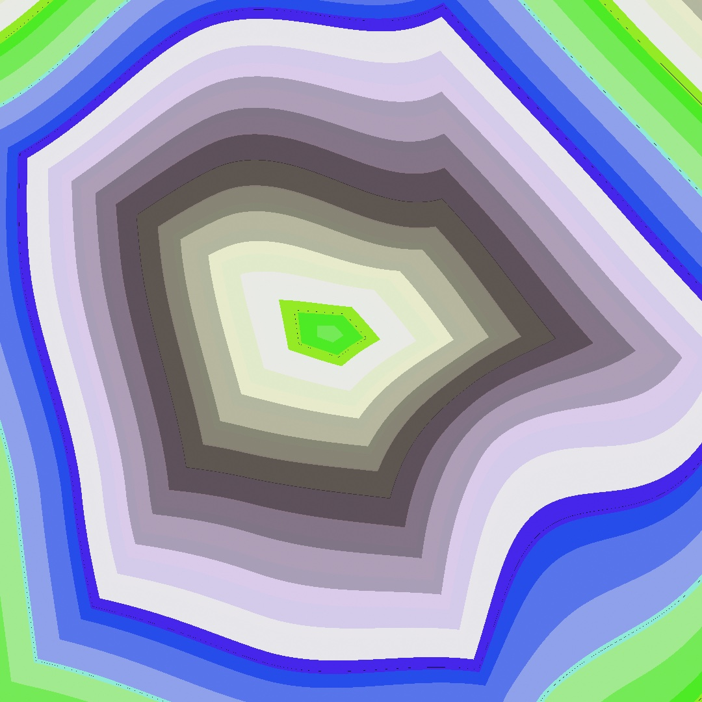
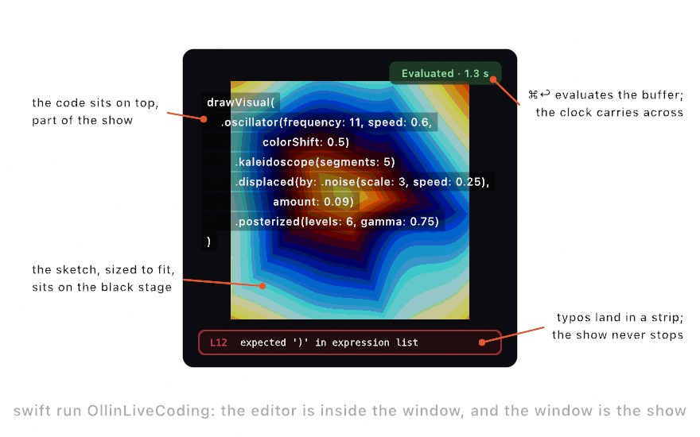
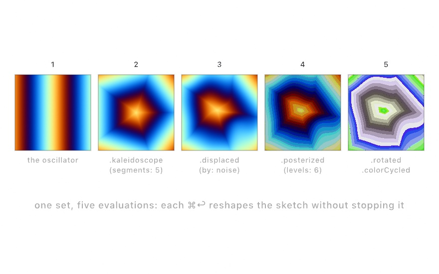
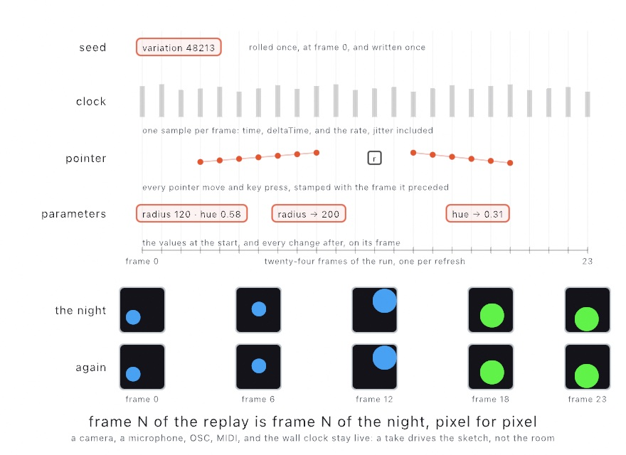
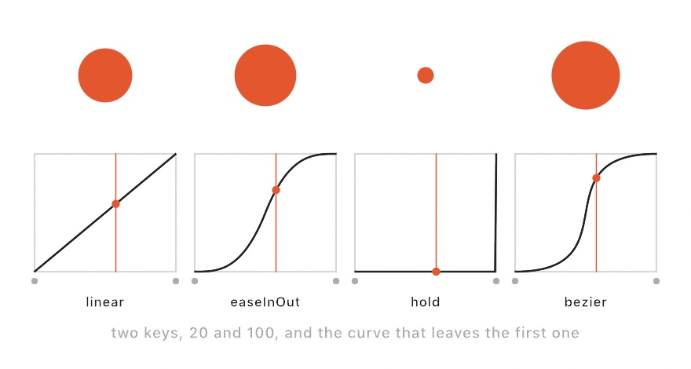
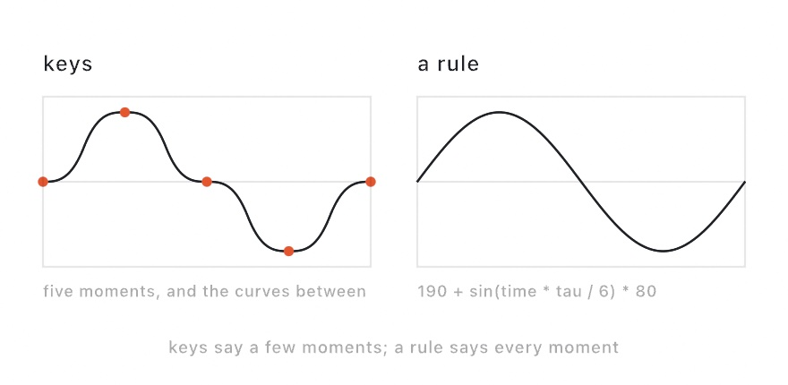

#### <sup>[Ollin](../README.md) → [Guide](README.md) → Chapter 43</sup>

---

# 43. Performing



Code can be the performance: you type over the running picture and evaluate each change without stopping it. Here you learn live coding in a performance host, how to record the set from start to end, and cues, looks saved to call back. The picture at the top is the last state of a set in five evaluations. Past it come completion and a controller, replay, parameters directed or written as rules, and live feeds into other apps.

## Performing the code itself: live coding

**Live coding** is writing and changing a program in front of an audience while it runs, with the code shown as part of the show. `swift run OllinLiveCoding` opens the performance host for it. The sketch sits on a black stage, sized to fit, and the code sits over it as translucent text:

<picture>
  <source media="(prefers-color-scheme: dark)" srcset="Images/43-Performing/StageDiagram-dark.jpg">
  
</picture>

The loop differs from the live-reload host you have used since [Chapter 1](01-HelloOllin.md). There is no separate editor and no file being watched. You type in the window, into the **buffer**, the text the host holds, and press **⌘↩** to **evaluate** it. Evaluating compiles the buffer, turning the Swift into a program the Mac can run, and swaps the running sketch for the new one. The compile happens in the background while the old sketch keeps drawing. When it succeeds, the new sketch takes over with the clock carried across. A motion driven by `time` then does not jump in the middle of a set.

The swap happens twice. A plain build goes on stage the moment it compiles. An optimized build, whose code runs faster, follows when it is ready, with the clock carried again. So an edit shows sooner, and the sketch still runs at full speed. [Live coding](../Docs/Tools/LiveCoding.md#the-evaluate-loop) has the numbers, and a flag that keeps to one build. Tuned `@Param` values carry across too, including ones bound over MIDI or OSC.

A typing mistake leaves the stage alone. The last good sketch keeps playing, the errors appear in a strip along the bottom, and you fix them and evaluate again. **⌃⇧H** hides the code when it should get out of the way, and **⌃⌘F** makes the window fill the projector. For a real set, `Scripts/OllinLiveCoding` builds the host itself optimized, in what Swift calls release mode, so the framework renders at full speed.

Evaluation never writes your file. **⌘S** does, so you can try things freely and keep only what worked.

What a swap does to the run depends on what you changed. The host compares your buffer with the code the stage was built from. If you changed nothing but the inside of a method, the run carries on. `setup()` does not run again, so the canvas keeps what is piled on it, and `random()` picks up where it was. A canvas that has been piling up marks for ten minutes keeps them. Add or remove a declaration, change a stored property, a method's name or arguments, `setup()`, or anything `setup()` calls, and the run starts over. It also starts over when `setup()` names a stored property that is not marked `@Saved`, because the carried run would find that property empty. The small message that appears on the stage after each evaluation says which happened, and the editor lights the block you were in. To carry state of your own across an edit, mark it `@Saved`, a word written before a property that keeps its value. [Chapter 45](45-Installations.md#picking-up-where-it-left-off-checkpoints-and-saved) uses it to carry a sketch across a relaunch. [Live coding](../Docs/Tools/LiveCoding.md#what-the-edit-changed) has the full rule.

## Keeping the take

A set happens once. The parameter you moved and the evaluation that landed at the right moment will not happen the same way again. Every exporter in [Chapter 41](41-FinishingASketch.md) renders the sketch again on a fixed clock, which gives the same file every run. A performance needs the opposite: a recording of what happened in real time. One recorded run of a performance is called a **take**.

The host records one. Press **⌘⇧R** and a small red counter starts on the stage. Play the set. Press **⌘⇧R** again, and the take is a movie in `~/Movies/Ollin/`, picture and sound together, named after the sketch and the moment. The recording carries on through evaluations as long as the canvas keeps its size. A set that changed its code twelve times is still one continuous movie.

A sketch can also record itself, with one pair of calls. Here the R key starts and stops it:

```swift
override func keyPressed() {
    guard key == "r" else { return }
    if isRecording {
        stopRecording()
    } else {
        startRecording()
    }
}
```

The sound needs no wiring. The recorder finds the instruments the sketch holds, and what they play lands in the movie's sound in time with the picture. When the music comes from outside the sketch, record the room instead. `startRecording(audio: .microphone)` asks for the microphone and records what it hears.

For a run filmed from its first frame, the live-reload host takes a flag:

```sh
swift run OllinLive MySketches/Finale.swift --record
```

Quitting the host finishes the movie first, and so does Control-C in the terminal, so the file is complete however the take ends. [`Examples/Export/Record`](../Examples/Export/Record/Sketch.swift) is an instrument you drag to play, and [Recording](../Docs/Output/Recording.md) has the rest.

## A look you come back to: cues

A **cue** is a saved look: every parameter's value at once, under a name. Use cues for the looks a set returns to, called up in a moment. They come from theater, where a cue is a planned change of lights or sound called at a moment in the show. `saveCue("night")` saves one in code, and a name typed into the Cues card under the parameters saves one by hand. `cue("night", over: 2)` brings every parameter back to it over two seconds, and `nextCue()` walks the list of cues in order. A cue can be called from anywhere a sketch reads, such as a key, a beat, or a sensor.

<picture>
  <source media="(prefers-color-scheme: dark)" srcset="Images/43-Performing/CalledBack-dark.jpg">
  
</picture>

The kind of parameter decides whether it eases or jumps. A number, a color, a point, and a range have values between two settings, so they ease there, slowly at both ends. A switch, a menu choice, and a piece of text have nothing in between. They take the cue's value on the first frame of the fade. So the middle look in the figure is already lit while its dots are still growing. A cue called while another is still fading starts from wherever the parameters are, so a change of mind never snaps back first.

The hosts keep the list of cues in a file beside the sketch, named after it, such as `Finale.cues.json`. So a reload never loses a look. On stage, a MIDI program change, a message that asks for a numbered preset, calls a cue by number. `/ollin/cue` calls one by name, and a pad learned onto **Next cue** steps through the set. [`Examples/Live/Cues`](../Examples/Live/Cues/Sketch.swift) holds five looks on the number keys. [Cues](../Docs/Helpers/Cues.md) has the rest, including `--cue night` for a still at a saved look.

A cue differs from a parameter's default. The **Save parameters** button above the card writes the values you set into the `@Param` lines, which is where the sketch starts. A cue is where it goes back to.

## Putting it together: a set in five evaluations

The finished sketch is a short performed set. You build the picture above the way an audience would watch it grow, one evaluation at a time. The set uses the performance host and its evaluate loop, a take recorded with ⌘⇧R, cues, and the `Visual` chains of [Chapter 18](18-YourFirstShader.md#patching-without-typing-metal-visual-chains). Each evaluation adds to one chain.

Open the host with a new buffer. It starts with a small sketch of circles. Delete the body of its `draw()`, and type each step into it:

<picture>
  <source media="(prefers-color-scheme: dark)" srcset="Images/43-Performing/SetSteps-dark.jpg">
  
</picture>

1. Start with bands. Type `drawVisual(.oscillator(frequency: 11, speed: 0.6, colorShift: 0.5))`, press ⌘↩, and drifting bands fill the stage.
2. Add `@Param(3...12) var segments = 5.0` above `draw()`, and `.kaleidoscope(segments: segments)` to the chain. It folds the bands into a five-sided mandala that still moves, and a `segments` slider appears in the inspector.
3. Add `@Param(0...0.3) var bend = 0.09` beside it, and `.displaced(by: .noise(scale: 3, speed: 0.25), amount: bend)` to the chain, which bends the fold with noise.
4. Add `@Param(2...12) var levels = 6.0`, and `.posterized(levels: levels, gamma: 0.75)`. The bent fold hardens into flat contour bands like a screen print.
5. Add `.rotated(time * 0.03)` and `.colorCycled(time * 0.04)`. The picture turns slowly, and its colors shift a little more every second.

Then play between looks. Open the inspector with ⌘/. In the **Cues** card, save the look as it stands under the name `print`. Drag `segments` to 9, `bend` to 0.25, and `levels` to 3, and the print breaks into more folds, bent further and cut into fewer bands. Save that as `shatter`. Press `print` in the card, and the three sliders ease back over the card's fade while the picture keeps turning. The picture at the top is that look, called back.

Save the buffer as `MySketches/Finale.swift`, and the cues are written beside it as `Finale.cues.json`. With the class renamed `Finale` and the starter's unused parameter removed, it is this listing:

```swift
import Ollin

final class Finale: Sketch {
    @Param(3...12) var segments = 5.0
    @Param(0...0.3) var bend = 0.09
    @Param(2...12) var levels = 6.0

    override func draw() {
        drawVisual(
            .oscillator(frequency: 11, speed: 0.6, colorShift: 0.5)
                .kaleidoscope(segments: segments)
                .displaced(by: .noise(scale: 3, speed: 0.25), amount: bend)
                .posterized(levels: levels, gamma: 0.75)
                .rotated(time * 0.03)
                .colorCycled(time * 0.04)
        )
    }
}
```

It is short enough to type from memory on stage. Steps 1 and 5 change only the inside of `draw()`, so the run carries on through them. Steps 2 to 4 each add a parameter, which is a declaration, so the run starts over on each. The clock carries across anyway, and nothing is lost, because the chain paints the whole picture every frame. `.colorCycled` adds to the hue, the saturation, and the brightness together, so the last look turns lilac and gray rather than only changing hue.

Then make it yours:

- Play the steps in another order, or swap step 2's fold for `.repeated(x: 3, y: 3)`, and the mandala becomes wallpaper.
- Bind `bend` to a MIDI knob, as in [Chapter 38](38-ControlsAndSignals.md#one-parameter-three-hands-binding-and-smoothing). The set then has a second instrument. Learn a pad onto **Next cue** in the host's Controls card, as [below](#the-host-on-a-controller-osc-and-learned-midi) shows, and step between the looks without the mouse.
- Perform a sketch from earlier in the guide, since any of them runs in the host as it is. [Chapter 1](01-HelloOllin.md#putting-it-together-a-breathing-ring)'s breathing ring has no `setup()`, so every edit to its `draw()` carries the run. A sketch that builds its state in `setup()` starts over on each evaluation instead.

Keep the set as you play it. Press ⌘⇧R before the first evaluation, and the take keeps every evaluation and every cue as it happened. Save the buffer with ⌘S. For a clean copy of a look, export the saved file as video. `--cue` picks the look it renders:

```sh
swift run OllinLive MySketches/Finale.swift --export-video finale.mp4 --seconds 12
swift run OllinLive MySketches/Finale.swift --export-video shatter.mp4 --seconds 12 --cue shatter
```

## More of the performance host: completion, a controller, and the drag

The set used the host's editor and its evaluate key. More parts of the host help during a longer set. Completion finishes the names you type, and a controller can run the host's own actions. A drag on the stage moves a shape by rewriting its numbers.

### Finishing a name as you type: completion

Completion offers the names that can follow what you have typed. Use it on stage to type a call without looking it up. It comes from SourceKit, the Swift toolchain's own completion service, which Xcode uses too. The first letters of a call open a list under the text cursor. It holds every drawing call, every color, and every member of a value the buffer holds. Return or Tab takes the row, and the call lands with its arguments as blanks that Tab walks through. A dot after `Color` lists the palette. Escape opens the list when it is closed and closes it when it is open. So a stray Escape never drops the stage out of full screen. [Live coding](../Docs/Tools/LiveCoding.md#completing-a-name) has the keys, and the switch that keeps the list away until you ask.

### The host on a controller: OSC and learned MIDI

The host's own actions, such as evaluating, hiding the code, and recording, can answer to a controller. Use it to run a set from a pad or a second machine without touching the keyboard. It uses the OSC and MIDI of [Chapter 38](38-ControlsAndSignals.md#parameters-from-anywhere-midi-and-osc). Set a port in the inspector's Controls card, and the host listens for OSC at `/ollin/evaluate`, `/ollin/code/hidden`, `/ollin/record`, and the rest. For a MIDI pad or fader, press Learn on an action and then press or move the control, and the host remembers it. Evaluate can then sit on a pad next to the ones playing the notes. This is a preference of the host, and none of it is in the sketch. [Live coding](../Docs/Tools/LiveCoding.md#the-host-on-a-controller) lists the addresses.

### Moving a shape on stage: the Command-drag

The drag from [Chapter 1](01-HelloOllin.md#moving-something-by-hand) works on the stage too, through the code. Use it to place a shape by hand while the audience watches the numbers change. Hold Command, and the shape under the pointer is outlined over the text. Drag it, pull a corner, or turn the knob, and the numbers change in the code the room is reading. The host evaluates that for you, so the shape stays where you left it and the clock carries on. If you have typed since the last evaluation, the host asks you to evaluate first rather than guess which line moved.

## A night you can play again: replay

The set's cues bring back a look, and its movie keeps what the night looked like. A take file keeps the performance itself, so a run played by hand can be played again, frame for frame.

### Playing the night again: replay

A movie keeps what a take looked like. A **take file** keeps the performance itself: the seed the run rolled, the clock it followed, every pointer move, and every parameter you changed. Use one to play a run again, find a frame in it, or render it again at a higher quality. It is one small JSON file, and playing it back walks the sketch through the same frames, pixel for pixel. Games have long recorded demos the same way, storing the player's inputs rather than the picture.

<picture>
  <source media="(prefers-color-scheme: dark)" srcset="Images/43-Performing/TheTake-dark.jpg">
  
</picture>

The file holds four lanes. The seed is one number, rolled once. The clock is one sample per frame, written down as the display drove it, jitter included, so a replay keeps the night's own timing. The pointer lane holds every move, press, and key, each stamped with the frame it came before. The parameter lane holds where every `@Param` started and each change after, on its frame. Nothing else drives a sketch that repeats itself ([Chapter 4](04-Randomness.md#seeds-randomness-you-can-keep)), so a fresh sketch fed the same four lanes walks through the same frames. The two rows under the lanes are five frames of a run and the same five replayed.

A take file records a run in OllinLive, from launch to quit, and a reload ends it. So it keeps a sketch played by hand, such as the Record example's instrument you drag to play, rather than a live-coded set:

```sh
swift run OllinLive Examples/Export/Record/Sketch.swift --record-take take.json   # play; quitting writes the file
swift run OllinLive Examples/Export/Record/Sketch.swift --replay take.json        # the same run again
```

During a replay the mouse belongs to the recording, so the keyboard becomes the **transport**, the play, pause, and step controls. Space pauses. The arrows step one frame, and with Shift held they jump thirty. Home rewinds, End jumps to the last frame, and Space at the end starts the night over. Stepping backward runs the sketch again from the start up to the frame you asked for, which gives the same frame every time. So the arrow keys find the one frame to keep.

A take file also feeds every exporter in [Chapter 41](41-FinishingASketch.md):

```sh
swift run OllinLive Examples/Export/Record/Sketch.swift --replay take.json --export-video night.mov
swift run OllinLive Examples/Export/Record/Sketch.swift --replay take.json --export still.png --frame 412
```

A replayed video needs no `--seconds`, because it renders the take from start to end. A take of a 3D sketch played by hand, such as the plaza of [Chapter 26](26-3DGently.md), can also render with `--path-traced`. A run played at sixty frames a second can then render again overnight, path-traced, as performed. `--seed` beside `--replay` keeps your gestures while `random()` rolls differently, so one good performance can try many variations.

What replays is time, the pointer and the keys, the parameters, and randomness. A dropped file, OSC, and MIDI do not replay, and a camera feed or a microphone keeps playing live. So a sketch that listens follows your recorded hands, but hears the room around it now. [Replay](../Docs/Core/Replay.md) has the rest, and the `Take` type under the flags.

## Directing the parameters: keyframes, the timeline, and timecode

In the set, every change came from your hands. A parameter can also follow a plan. Keyframes write the plan as code, the timeline panel lets you place it by hand, and timecode lets another machine's timeline drive it.

### A value at each moment: keyframes

A **keyframe** is a value placed at a moment. An **automation** moves a parameter from one key to the next along a curve. You write down what a parameter does instead of moving it yourself. A **track** is one parameter's keys. Use an automation for a change that should happen the same way every time. Keyframes come from animation, where a lead artist drew the key poses and others drew the frames between. Here `radius` is a `@Param` of the sketch, and `$radius` is the parameter itself, as in [Chapter 38](38-ControlsAndSignals.md#one-parameter-three-hands-binding-and-smoothing):

```swift
override func setup() {
    automate($radius) { track in
        track.key(at: 0, 40)
        track.key(at: 2, 320, curve: .easeInOut)
        track.key(at: 4, 40)
    }
    automation?.loops = true
}
```

Every frame, before your `draw()` runs, the parameter is set to whatever its curve holds at the sketch's clock. `automation` is the sketch's set of tracks. It is nil until the first `automate` call, so the `?` reaches it only if it exists.

Each key carries the curve that *leaves* it, so the last key's curve is never read. The figure draws four of the curves between the same two keys:

<picture>
  <source media="(prefers-color-scheme: dark)" srcset="Images/43-Performing/ParameterOnACurve-dark.jpg">
  
</picture>

`.linear` is the straight line. `.easeIn`, `.easeOut`, and `.easeInOut` are the eases from [Chapter 3](03-MotionAndTime.md#shaping-time). `.hold` sits still and then jumps. `.bezier(x1:y1:x2:y2:)` is the one you shape by hand. Its two handles bend the timing as well as the value, as they do on a curve in an animation program.

A parameter moves along a curve only when it has values in between. A number, a color, a point, or a range has values between two settings, so it follows the curve. A switch, a menu choice, and a piece of text have nothing in between. They step instead, holding each key's value until the next key takes over, so a fill switch on a track blinks rather than fades.

Four properties set how the tracks play. `loops` wraps back to the start at the end. `speed` scales the clock, so `2` runs twice as fast, and a negative speed runs the tracks backward. `start` sets where playback begins, and `length` holds past the last key before the wrap, which leaves a moment of stillness in a loop.

The tracks read the sketch's clock, and every exporter drives that clock at a fixed step. So a directed sketch renders the same way it played:

```sh
swift run --package-path Examples Example-Motion-Automation --export-video directed.mp4 --seconds 12
```

An automation is plain data too, so a sketch can read its own tracks back and draw them. The [Automation example](../Examples/Motion/Automation/Sketch.swift) plots each of its four tracks under the stage, with a line for the current moment. `--automation file.json` drives parameters from a file, for any the code does not track itself. [Automation](../Docs/Core/Automation.md) has the full list of calls.

### Directing by hand: the timeline panel

You can place keys by hand instead of writing them as code. Use the timeline panel of OllinLive to place a key at the moment you are looking at. It follows the timelines of video and animation programs, with a lane for each parameter.

Click **Timeline** in the title bar, or press **⌘T**, and a floating panel opens. It has a **ruler** of time across the top, a transport, and one **lane** per track. The **playhead** is the line that marks the current moment. Try it on the Automation example, whose tracks appear as lanes:

```sh
swift run OllinLive Examples/Motion/Automation/Sketch.swift
```

<picture>
  <source media="(prefers-color-scheme: dark)" srcset="Images/43-Performing/DirectingByHand-dark.jpg">
  
</picture>

In the figure, the inspector beside the panel shows four parameters: Radius, Hue, Ground, and Lit. Every parameter row in the inspector carries a small diamond, and the diamond says what drives the parameter. Radius and Ground have tracks, so theirs are filled. Hue has none yet, so its diamond is hollow. Lit is worked out from a rule typed into its row, so it shows a function mark instead. [Writing the parameter as a rule](#writing-the-parameter-as-a-rule-formulas) explains rules.

Placing a key takes three moves. Drag the playhead along the ruler, or step a frame at a time, and the picture follows. Set a parameter in the inspector until the frame looks right. Then click the diamond in that parameter's row, and a key lands at the playhead holding that value. A hollow diamond starts a track. Clicking the diamond while the playhead stands on a key takes that key away.

The lanes draw what will happen. A number lane plots its curve, a color lane shows the blend as a band, and a switch lane steps between its two values. A lane worked out from a rule, like Lit's, names the rule and draws no keys. Drag a key to move it in time. Click a key to select it and pick the curve that leaves it, and a Bezier grows two handles you shape by eye. Double-click a key to remove it. Option-drag the ruler to choose a stretch of time, and the loop button repeats it while you work. That stretch belongs to the transport alone, the tinted band in the figure, and it never changes the tracks.

Everything you place lands in a file beside the sketch, named after it, such as `Finale.automation.json`. `--automation` reads that file, and so do OllinLive's own exports. The live host reads it back on launch and across every reload, so the keys survive the edit loop. If your `setup()` writes a track for the same parameter, the code's track wins, because the code is the source of truth. [The parameter timeline](../Docs/Tools/Timeline.md) has the full tour.

### Following another timeline: timecode

The timeline panel runs on the sketch's own clock. In a show, the timeline often belongs to another machine. It may be a video player or deck, a lighting console, or a DAW locked to a film. It may be a show controller, the computer that runs a show's cues. **Timecode** is how such a machine says where it is, as hours, minutes, seconds, and frames. It comes from film and television, where it labels every frame of a recording. Use it to land a change on the exact frame a video reaches. A `TimecodeClock` reads MIDI Time Code, the form timecode takes over MIDI. Here `midi` is a `MIDIInput`, started as in [Chapter 38](38-ControlsAndSignals.md#parameters-from-anywhere-midi-and-osc), with `import OllinMIDI` at the top of the file:

```swift
lazy var timecode = TimecodeClock(from: midi)
// in draw():
let t = timecode.seconds                                          // where the timeline is
drawText(timecode.timecode.map { "\($0)" } ?? "--:--:--:--", 40, 60)   // 00:01:30:12
```

`timecode.timecode` is optional, nil before the first message arrives, and `.map` turns it into text only when it has a value. The **Timecode** example (`Examples/Integration/Timecode`) plays a deck itself with an internal timer. You can watch changes land under a scrolling timeline with nothing plugged in.

The frames in a timecode are the other machine's frames, often 25 or 30 a second, not the sketch's. A position is too big for a single MIDI message, so the sender spells it out in eight small ones, four to a frame:

<picture>
  <source media="(prefers-color-scheme: dark)" srcset="Images/43-Performing/TimecodePieces-dark.jpg">
  
</picture>

Each message carries four bits, half of one number. The frames take two messages, the seconds two more, and so on up to the hours, whose last message carries the frame rate too. Eight messages take two frames to arrive, so a full set of eight names a time that has already passed. The clock sets itself 1.75 frames past the spelled time and moves on smoothly at the frame rate. So `seconds` moves smoothly while `timecode` changes on frame boundaries.

Stop the deck, the player sending the timecode, and the messages stop, so the position holds where it was. Press locate, which jumps to a position, and the deck sends the full position in one message. The figure shows the eight bytes inside it, between the bytes that start and end the message. The clock jumps there rather than waiting for a new set of eight.

`timecode.timecode` is the frame the timeline is on, and `seconds` is the same moment as a number to compute with. `frameRate` is the rate once a full set has arrived, and `isPlaying` says whether messages are still coming. Landing a change is a comparison of two timecodes. Here `flash()` stands for a function of your own:

```swift
let mark = Timecode(hours: 0, minutes: 1, seconds: 30, frames: 12, frameRate: .fps25)
if let now = timecode.timecode, now >= mark { flash() }
```


## Writing the parameter as a rule: formulas

Keys say where a parameter is at a few moments. Sometimes you want to say what the parameter is at every moment instead, as a rule, and change the rule while the sketch plays.

### A rule instead of keys: formulas

A **formula** is a parameter's rule written as text. Use one to make a parameter follow the clock, the pointer, or another parameter. In OllinLive you can change the rule while the sketch runs, with no compile. It works like a formula in a spreadsheet cell, which reads other values and works out its own. Here `radius` is a `@Param` again:

```swift
override func setup() {
    drive($radius, "190 + sin(time * tau / 6) * 80")
}
```

<picture>
  <source media="(prefers-color-scheme: dark)" srcset="Images/43-Performing/ParameterAsARule-dark.jpg">
  
</picture>

The rule is in quotation marks, so it is text rather than Swift. Text can arrive while the sketch runs. It can be typed into a field, read out of a file, or changed during a set, and no compile is needed.

The field is in the inspector. In OllinLive, right-click the diamond of a number or switch that has no track, and choose **Write a Rule**. A field opens under the row. Type the rule and press Return, and the parameter follows it from the next frame. Its diamond turns into a function mark, and its slider dims. Get a character wrong and the row says so, with a mark under the character and the reason beneath. The rule that was running keeps running. A rule written this way lands in the same automation file as the keys, so an export plays it. [Writing a rule in the row](../Docs/Tools/Timeline.md#writing-a-rule-in-the-row) has the details.

The arithmetic is the arithmetic you already write. `sin`, `clamp`, `lerp`, and `smoothstep` are spelled and ordered as they are in `draw()` and in a shader. `noise`, `pi`, and `tau` are there too. A formula reads `time`, the moment the tracks are at, plus `frame`, `width`, `height`, `mouseX`, `mouseY`, and your other parameters by name. A comparison gives 1 when it is true and 0 when it is false. Here `count`, `edge`, and `filled` are three more parameters:

```swift
drive($radius, "190 + sin(time * tau / 6) * 80")
drive($count, "8 + round(sin(time * tau / 12) * 5)")   // a whole number rounds
drive($edge, "radius / 22")                            // worked out from another parameter
drive($filled, "time % 6 < 3")                         // a switch, on when it is not zero
```

The `edge` line reads *this* frame's radius, because a parameter a formula names is always worked out first. That order keeps a formula a plain function of the clock. The same second gives the same picture whether the window runs at 60 frames a second or an export steps at 30.

So two parameters cannot name each other, and a parameter cannot name itself. `"n + 1"` never settles on one frame. Ollin says so and leaves that parameter alone, rather than play a value that would drift with the frame rate. For a number that builds on itself, keep a plain property and step it in `draw()`, as [Chapter 3](03-MotionAndTime.md#the-clock) does.

A formula is a track like any keyed one. It loops, plays at any speed, and renders frame for frame through every export. It travels in the same `--automation` file, as the text you typed. The [Formula example](../Examples/Motion/Formula/Sketch.swift) drives six parameters this way and prints each rule under the picture. [Formula](../Docs/Helpers/Formula.md) lists every name a formula knows.

Two spellings differ from what you might write first. In a formula `^` raises to a power, where Swift uses it for something else. `-2^2` is `-4`, because a power binds tighter than a minus sign, as on a calculator. And `-1 % 3` is `2`, because the remainder wraps around rather than turning negative, which keeps a phase continuous as it crosses zero.

### A rule for each part: parameters that hold several numbers

A point holds two numbers, and a color holds four. A rectangle holds four of its own. Each part can take its own rule, named where you write it. Use it to move some parts by rule and keep the others by hand. Here `box` is a `Rectangle` parameter and `eye` a point parameter:

```swift
drive($box, width: "300 + sin(time) * 120", height: "150 + cos(time) * 60")
drive($eye, x: "box.x + box.width / 2", y: "height / 2")
```

<picture>
  <source media="(prefers-color-scheme: dark)" srcset="Images/43-Performing/ParameterParts-dark.jpg">
  
</picture>

The parts you leave out keep their values. Here `x` and `y` have no rule, so the corner stays where it was set while the width and height change, as in the figure. You can still move the corner from the inspector's `x` and `y` fields.

One part of a parameter is a name too, spelled `parameter.part`, and `eye` above follows the rectangle it sits in that way. The name works whether keys carry that part or another rule works it out.

Three rules apply when you write one. One call carries every part of the parameter, so give them all at once, because a second call replaces the first. A range parameter's two ends, `lower` and `upper`, stay in order, so a `lower` that climbs past `upper` lifts it along. And a color's parts are plain numbers from 0 to 1 with nothing holding them there. Write `saturate(...)`, which holds a number between 0 and 1, where you want a limit. The [FormulaParts example](../Examples/Motion/FormulaParts/Sketch.swift) drives four such parameters and prints each part's rule under the picture.

## Live feeds: into other apps

The set was recorded as a movie and saved as a file. A sketch can also stay alive and send its frames into another program while it runs. Syphon hands them to another app on the same Mac, and the virtual camera makes the sketch a camera that any app can choose.

### Into another app: Syphon

**Syphon** is the macOS standard for passing frames on the GPU between running apps. Use it to feed a sketch into a VJ app or a projection-mapping app during a show. A projection-mapping app fits a picture onto a building or an object. Tom Butterworth and Anton Marini wrote it, and Maxime Touroute and Philippe Chaurand wrote its Metal version, the part Ollin carries. One line makes a sketch a source:

```swift
import Ollin
import OllinSyphon

override func setup() {
    publishSyphon(name: "Ollin")     // every frame is now a Syphon source
}
```

VJ apps such as Resolume and VDMX, projection-mapping apps such as MadMapper, and other creative-coding tools all read it live. They get the frame at the canvas's size, with nothing written to disk. It works the other way too. `SyphonClient` subscribes to another app's feed and hands you each frame as an `Image` to draw or warp. With [Chapter 38](38-ControlsAndSignals.md)'s OSC and MIDI, the frames go one way and the control comes back the other. The `Integration/SyphonLoopback` example runs both ends in one sketch, a feedback tunnel that watches its own output. You can try it with no second app installed. Adding the import and the `setup()` restarts a live-coded run, so add the publishing line before a set begins.

### The sketch as a webcam: the virtual camera

Syphon works between apps that both speak it. A web page or a video call asks the operating system for a *camera* instead. The virtual camera makes the sketch one. Use it to show a sketch in a video call or on a web page that takes a camera. It is a camera extension, the kind of software camera macOS has supported since 2022.

It needs a one-time setup, because a camera device is a part of the operating system. The device is a macOS **system extension**, installed by the Ollin Camera app, which is built from [`Apps/OllinCameraApp`](../Apps/OllinCameraApp/README.md) in this repository. Launch the app from `/Applications`, and approve the extension in *System Settings ▸ General ▸ Login Items & Extensions ▸ Camera Extensions*. From then on the device exists whether or not a sketch is running. When nothing is publishing, it shows a "no signal" test card. If you publish before installing it, the sketch keeps drawing, and `isAvailable` and `unavailableReason` say what is missing.

Then one line in `setup()` publishes to it:

```swift
import Ollin
import OllinCamera

override func setup() {
    publishVirtualCamera()      // every frame now feeds a system-wide camera
}
```

With the extension installed, "Ollin Camera" is in the camera menu of every app on the machine. Zoom, Meet, QuickTime, Photo Booth, and OBS, a program for streaming and recording, can take the sketch as their input. So can any web page that asks for a camera.


Two facts about the frame:

- **The camera frame is a fixed 1280×720.** Your canvas is scaled to fit and centered. A square canvas arrives with black bars down both sides. For a sketch meant for a call, `override var canvasSize: CanvasSize { .size(1280, 720) }` fills the frame.
- **The camera runs at 30 frames a second.** A sketch running faster publishes every other frame. A slower one updates the camera at its own pace.

When the picture looks wrong, check the viewer before the sketch. Photo Booth shows every camera mirrored, so text in your sketch reads backward there. It also crops, because its preview is not 16:9. Video-call apps usually mirror your own view while sending the unmirrored picture to everyone else. QuickTime's File ▸ New Movie Recording shows the frame as published, uncropped and unmirrored, which is the quickest way to see what other apps receive.

## Where this comes from

TOPLAP, founded in 2004, gathered live coders around a manifesto that asks performers to show their screens. This host's code over the visuals follows that idea, and its most direct model is Olivia Jack's browser instrument Hydra. Musicians live code too, in languages such as Alex McLean's TidalCycles. The families' entries name their own sources, and full credits are in the project's [attribution notes](../ATTRIBUTION.md).

## Go deeper

- [Live coding](../Docs/Tools/LiveCoding.md): the evaluate loop, errors, recovery, completion, the host on a controller, and the keyboard reference.
- [Recording](../Docs/Output/Recording.md): recording a live run in real time, what the sound modes hear, and how a take survives an evaluation.
- [Cues](../Docs/Helpers/Cues.md): looks you saved and call back, over a fade, from a key, the card, a program change, or `--cue`.
- [Replay](../Docs/Core/Replay.md): what a take file holds, the transport keys, rendering a take again through any export, and what stays live.
- [Automation](../Docs/Core/Automation.md): keys, curves, tracks, how a pass plays, and the file that drives them.
- [The parameter timeline](../Docs/Tools/Timeline.md): the panel, its lanes and keys, the rule field in the row, the transport, and the file it writes.
- [Timecode](../Docs/Integration/MIDI.md#timecode-timecodeclock): `TimecodeClock` over MIDI Time Code, the frame rates, the hold and the locate, and landing a change.
- [Formula](../Docs/Helpers/Formula.md): every name a parameter's rule can use, what it can name, and what it reports rather than throws.
- [Syphon](../Docs/Integration/Syphon.md): publishing, receiving, discovery, and the loopback.
- [Virtual camera](../Docs/Integration/VirtualCamera.md): the one-time install, publishing, and the test card.
- Worked examples: [`Examples/Live/`](../Examples/Live/) and [`Examples/Integration/SyphonLoopback`](../Examples/Integration/SyphonLoopback/Sketch.swift).

---

[Contents](README.md#contents) · Previous: [Chapter 42, Making it physical](42-MakingItPhysical.md) · Next: [Chapter 44, Handing it over](44-HandingItOver.md)
