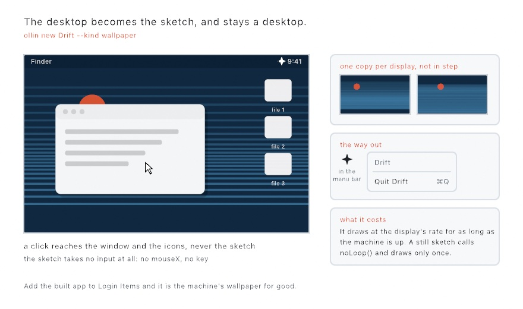
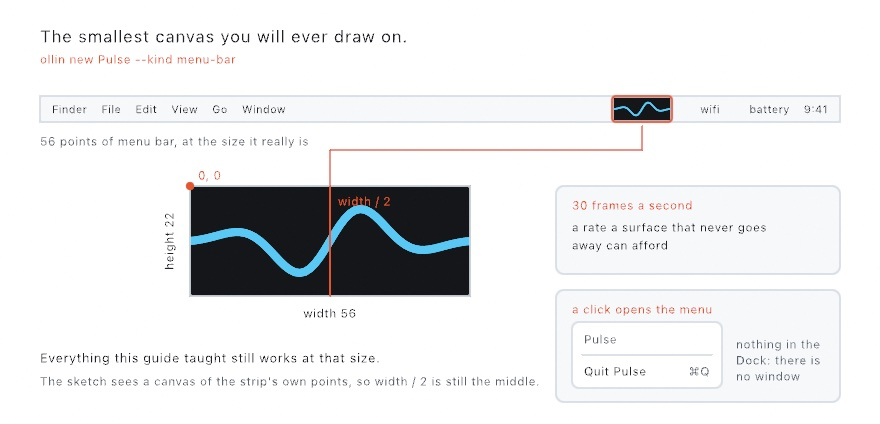
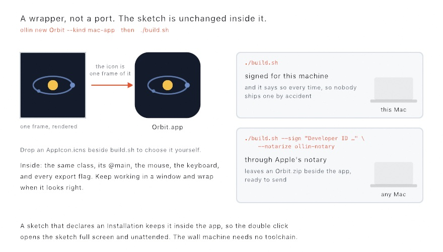
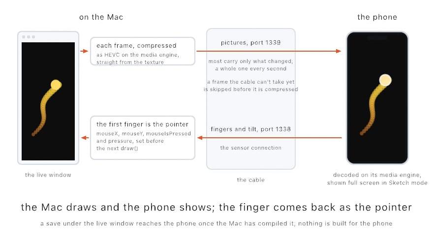
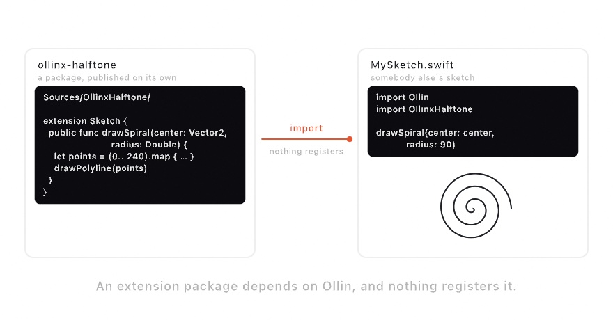

#### <sup>[Ollin](../README.md) → [Guide](README.md) → Chapter 44</sup>

---

# 44. Handing it over


Outside its window, a finished sketch lives where people already look, and nobody has to run code. This chapter makes it a screen saver, a wallpaper, a menu-bar strip, a widget, and an app a friend can double-click. One sketch, the sky clock above, follows the hour and goes to four of those places. After it, a phone takes a sketch in two ways, and other programmers take your behavior and your drawing calls.

## Living in the system: a screen saver

Start with the machine you wrote the sketch on. A Mac shows a screen saver when nobody has used it for a while, and your sketch can be one of the choices. Every project in this chapter comes from the `ollin new` command that [Chapter 1](01-HelloOllin.md#when-one-file-isnt-enough) used to make a package. If you have not installed `ollin` yet, run `Scripts/ollin install` once, as [A shorter way to run things](01-HelloOllin.md#a-shorter-way-to-run-things) shows. A `--kind` says where the sketch is going. `ollin new` makes the project folder inside the folder you run it from. So start each one from the same place, such as your `MySketches` folder. A screen saver takes two commands:

```sh
ollin new Ripple --kind screen-saver
cd Ripple && ./build.sh --install
```

Open System Settings, go to Screen Saver, and choose **Ripple** from the list. The sketch did not change to get there. It is the same class you would run in a window, and you can still open it in a window while you work on it.

<picture>
  <source media="(prefers-color-scheme: dark)" srcset="Images/44-HandingItOver/LivingInTheSystem-dark.jpg">
  
</picture>

A screen saver is a **plug-in**, code that another program loads and runs. This one is a folder called `Ripple.saver` that holds the program and what it loads. The system loads it when it needs something to show. A project's sketch usually carries `@main` above its class, the mark that tells Swift where a program starts. A screen saver is started by the system instead, so it has no `@main`, and one small class stands in for it:

```swift
@objc(RippleSaverView)
final class RippleSaverView: SketchSaverView {
    override func makeSketch() -> Sketch { Ripple() }
}
```

`SketchSaverView` builds the canvas when the system starts the saver. It times the frames by the display's own clock, and it puts everything away when the saver ends. `makeSketch()` hands it your sketch. `@objc(RippleSaverView)` fixes the name the system looks the class up by. The folder's **property list**, the `Info.plist` file that tells the system what the folder holds, names the same class. The two names have to agree, or nothing shows.

### What a screen saver takes away: input and writing files

Running inside the system changes two things for the sketch.

**Your sketch gets no input.** A key press or a click is how a person ends a screen saver, so the system keeps them and the canvas never sees them. `mouseX`, `mouseY`, and `key` keep the values they started with. Write the sketch to run on `time` alone, which is how most of this guide's sketches already run.

**Your sketch cannot write files.** The system runs a screen saver in a **sandbox**, a fenced-off space where a program can read almost anything and write almost nothing. Pictures, fonts, meshes, and clips load as they always did. Exporting a frame fails, and so does any other file the sketch tries to save.

### Filling the screen or fitting in it: `windowMode`

A display is almost never the shape of a canvas, so the sketch has to say what happens at the edges. The sketch's own `windowMode` decides it, the same property that decides its window in [Chapter 1](01-HelloOllin.md#the-canvas-is-not-the-window):

```swift
override var windowMode: WindowMode { .resizable }
```

With `.resizable`, the canvas is the display. `width` and `height` are the screen's, and the drawing goes edge to edge. `ollin new` writes that line for you, because most people expect a screen saver to fill the screen. Without it, a square sketch stays square, as large as fits, centered on black. Neither one stretches the drawing, so a circle stays a circle on a wide screen.

### Rebuilding, and one copy per display

The system loads the installed copy, so every edit needs a rebuild. Do the work in a window, as Chapter 1 did for a package, and install when it looks right:

```sh
ollin Sources/Ripple/Sketch.swift     # the same file, reloading as you save
./build.sh --install                  # when you are happy with it
```

The script signs the saver for this machine. A **signature** is a seal that says who built a program and that nobody changed it since. Another Mac refuses a saver signed only for yours. Handing one to somebody else needs a Developer ID and notarization, the same as an app, which [An app to hand somebody](#an-app-to-hand-somebody-signing-and-notarizing) explains. [The reference page](../Docs/Output/ScreenSaver.md) has the commands for a saver.

The system also makes a separate saver for each display. Two screens run two copies of your sketch, each from its own first frame, and they share nothing. A sketch that has to line up across two screens belongs in an installation, and [Chapter 45](45-Installations.md#several-displays-one-machine-spanning) spreads one canvas over every display.

## Wallpaper and a menu-bar strip

A screen saver runs while nobody is at the machine. The desktop and the menu bar are there while you work. A **wallpaper** runs a sketch behind the icons, and a **menu-bar strip** runs one beside the clock. Each is two commands, and the sketch stays an ordinary sketch.

```sh
ollin new Drift --kind wallpaper
cd Drift && swift run Drift
```

The desktop becomes the sketch. Windows still stack over it, icons still sit on it, and clicks still land where they always did.

<picture>
  <source media="(prefers-color-scheme: dark)" srcset="Images/44-HandingItOver/BehindTheIcons-dark.jpg">
  
</picture>

Like a screen saver, a wallpaper gives the sketch no input. Every click goes to the icon or the window under it, which is what keeps the desktop working as a desktop. The app has no window, so it puts a sparkle in the menu bar, and the sparkle's menu holds Quit. Each display runs its own copy, edge to edge, and the copies are not in step. `./build.sh --install` puts the app in /Applications. Add that app to Login Items in System Settings, and the wallpaper starts with the machine.

A wallpaper draws at the display's rate for as long as the machine is up, and that uses power. A slow, calm sketch suits it. A still one can call `noLoop()`, and then it draws only once.

A menu-bar strip is the same idea at the smallest size:

```sh
ollin new Pulse --kind menu-bar
cd Pulse && swift run Pulse
```

A strip 56 points wide appears among the status items, the icons at the right end of the menu bar, and starts moving.

<picture>
  <source media="(prefers-color-scheme: dark)" srcset="Images/44-HandingItOver/SmallestCanvas-dark.jpg">
  
</picture>

The strip draws at 30 frames a second, because it stays on screen all day. The sketch inside sees a canvas of the strip's own points, so `width / 2` is still the middle. Everything this guide taught still works at that size. The strip takes no input either. A click opens its menu, which holds Quit.

Both kinds write the same wrapper as an app, plus one line that keeps the app out of the Dock. A program with no window has nothing to show from a Dock icon. [An app to hand somebody](#an-app-to-hand-somebody-signing-and-notarizing) describes the wrapper. The reference pages ([wallpaper](../Docs/Output/Wallpaper.md), [menu bar](../Docs/Output/MenuBar.md)) carry the rest, including how to change the strip's width.

## A widget, and what it does to a sketch

The wallpaper and the strip draw frame after frame. A widget is the one surface here that does not, and that changes how its sketch has to be written. A widget sits on the desktop and in Notification Center, beside the weather and the calendar. It takes two commands, like the others:

```sh
ollin new Tide --kind widget
cd Tide && ./build.sh --install
```

Open the app once, so the system sees the widget inside it. Then Control-click the desktop, choose Edit Widgets, and look for **Tide**.

<picture>
  <source media="(prefers-color-scheme: dark)" srcset="Images/44-HandingItOver/AQuarterHourApart-dark.jpg">
  
</picture>

A widget draws a handful of pictures ahead of time. The system keeps them and puts each one up when its moment comes, and nothing runs in between. In the figure that is four pictures an hour. A person sees the difference between two pictures rather than any motion between them.

So a widget suits a sketch that **changes** over time rather than one that moves. A dial that turns through the day works, and so does a color that drifts from morning to evening. A bouncing ball does not. A ball that bounces once a second would bounce nine hundred times between two pictures, and the widget shows none of them.

### A widget's clock: the time of day

In a widget, `time` is the seconds since midnight of the moment being drawn. `time / 3600` is the hour, and the number runs from 0 to 86400 and starts over.

The rest of this guide counts `time` from the launch, and a widget cannot use that clock. The system throws a run of pictures away and asks for another whenever it likes. If `time` counted from the start of a run, the sketch would jump back to its beginning each time. When `time` reads the day instead, a quarter past two draws the same picture today and tomorrow, whichever run drew it.

The other clock values follow from that. `deltaTime` is the spacing, the time that really passed since the picture before. `frameCount` is always 1, because each picture is the first frame of a sketch of its own. Nothing carries from one picture to the next, so a moment draws the same way every time.

Most of a widget's pictures are also drawn *before* their moments arrive, the last one as much as three quarters of an hour before. So a sketch that reads `Date()`, Swift's own clock, gets the wrong moment. `date` is the moment being drawn. At a desk it is now, so a sketch that reads `date` is right in both places.

### How far apart the pictures sit: `widgetTimeline`

The sketch asks for its spacing the same way it declares its canvas size:

```swift
override var widgetTimeline: WidgetTimeline { .every(minutes: 15, count: 4) }
```

This line asks for four pictures a quarter of an hour apart, which covers the next hour. The system treats it as a request. It decides when it comes back, and it will not come back every minute. So asking for less than a quarter of an hour gains nothing.

The moments land on a grid counted from midnight, not from whenever the system asked. So a quarter-hour widget steps at the quarter hours, and the next run carries on along the same grid.

The grid decides which motion a widget can show. Motion that repeats a whole number of times within the spacing is caught at the same place in every picture. So it never seems to move. A run every fifteen minutes cannot show anything that repeats every fifteen minutes, or every five. Give the motion a period of several spacings, an hour or longer, as the figure's ring does. Or read the hour directly, as the sky clock does.

### Seeing the run without waiting: `--export-widget`

Waiting a quarter of an hour to judge each change is slow. Work in the window as usual, and use one more command to see the run:

```sh
swift run TideApp --export-widget frames --size 360x360
```

`TideApp` is the app half of the widget project. The command writes the run into `frames/`, one picture per moment, each named by its moment. The pictures are what the widget will show, drawn by the same code, and once the project is built, the export takes a second. The flag works on any sketch, so you can try a sketch as a widget before you make a project for it.

A widget project holds three **targets** rather than one, where a target is one program or library that a package builds. A widget is two programs, the app the system finds it through and the widget itself. Two programs cannot share a folder of sources, so the sketch moves into a library that both of them use. [The reference page](../Docs/Output/Widget.md) has the split, and the one public line that keeps your sketch an ordinary sketch.

## An app to hand somebody: signing and notarizing

The screen saver, the wallpaper, the strip, and the widget all stay on your own machine. A finished sketch can also leave it. It can go to a friend who has never typed `swift`, or to the gallery machine that will run the wall for a month. For that, the sketch becomes an app, and the path is the same two commands:

```sh
ollin new Orbit --kind mac-app
cd Orbit && ./build.sh
```

`Orbit.app` appears beside the script. Double-click it, and the sketch opens in its window, the same window `swift run` gives you.

<picture>
  <source media="(prefers-color-scheme: dark)" srcset="Images/44-HandingItOver/AppToHand-dark.jpg">
  
</picture>

The sketch inside is unchanged. It keeps its `@main`, its mouse, its keyboard, and every export flag. The app is a wrapper around it. So you keep working in a window (`ollin Sources/Orbit/Sketch.swift`), and build the app again when it looks right.

The wrapper makes two choices for you.

**The icon is a frame of the sketch.** The script runs the program it just built, renders one frame, and makes that picture the icon the Finder shows. So the icon changes when the sketch does. To choose it yourself, put an `AppIcon.icns` beside `build.sh`.

**The signature decides where it runs.** Plain `./build.sh` signs the app for this machine only, and says so every time, so nobody sends one out by mistake. Any other Mac needs two more things. A **Developer ID** is a signing certificate from Apple's paid developer program. **Notarization** is Apple's service that scans a signed app and records that it passed. One more flag does both:

```sh
./build.sh --sign "Developer ID Application: Your Name (TEAMID)" --notarize ollin-notary
```

The flag signs the app with the hardened runtime, the set of protections notarization requires. It sends the app to Apple's notary service and leaves an `Orbit.zip` beside the app, ready to send. Any Mac opens what is inside. `ollin-notary` is the name your notary account's details are saved under, once, and [the reference page](../Docs/Output/App.md) sets it up.

The app is also how the finished sketch of [Chapter 45](45-Installations.md#putting-it-together-the-wall-of-bars) reaches its wall. A sketch set up as an installation, which that chapter teaches, stays one inside the app. A double-click then opens it full screen and unattended, with its opening hours. The machine that runs it needs only the app, not the repository or the toolchain.

## Putting it together: the sky clock

The sky clock is one sketch handed to four surfaces: a widget, the wallpaper, the menu-bar strip, and an app. A sky changes color through the day. A sun crosses it from six in the morning to six at night, and a moon crosses it for the other twelve hours. It reads nothing but the hour, so one file works on each surface. Start it as a loose file, the way [A shorter way to run things](01-HelloOllin.md#a-shorter-way-to-run-things) showed:

```sh
ollin new SkyClock.swift
```

Then replace what it writes with this:

```swift
import Ollin

final class SkyClock: Sketch {
    // The day as a band, midnight to midnight: 0.25 is six in the morning, 0.5 is noon.
    @Param var zenith = Ramp(stops: [(0.00, Color(hex: 0x060A1C)),
                                     (0.21, Color(hex: 0x0E1535)),
                                     (0.30, Color(hex: 0x4F77BF)),
                                     (0.50, Color(hex: 0x2B6ED3)),
                                     (0.72, Color(hex: 0x4A6CB4)),
                                     (0.79, Color(hex: 0x1C1B45)),
                                     (1.00, Color(hex: 0x060A1C))])
    @Param var horizon = Ramp(stops: [(0.00, Color(hex: 0x10162E)),
                                      (0.21, Color(hex: 0x2A2A55)),
                                      (0.26, Color(hex: 0xF3A06B)),
                                      (0.33, Color(hex: 0xC9E0F2)),
                                      (0.68, Color(hex: 0xC4DCF0)),
                                      (0.76, Color(hex: 0xEE7F4A)),
                                      (0.81, Color(hex: 0x2A2450)),
                                      (1.00, Color(hex: 0x10162E))])
    @Param var land = Color(hex: 0x10131C)

    override var canvasSize: CanvasSize { .size(1600, 900) }   // the shape it opens and exports at
    override var windowMode: WindowMode { .resizable }         // on a surface, the surface's size
    override var widgetTimeline: WidgetTimeline { .every(minutes: 15, count: 4) }

    var stars: [Vector2] = []

    override func setup() {
        seed(1440)                                              // the same stars and ridge in every picture
        stars = (0..<80).map { _ in Vector2(random(1), random(0.7)) }   // fractions, not pixels
    }

    override func draw() {
        let hour = WidgetTimeline.timeOfDay(at: date) / 3600    // 0 up to 24
        let day = hour / 24                                     // where the ramps are read

        noStroke()
        fill(.linear(from: uv(0, 0), to: uv(0, 0.8),
                     [zenith.color(at: day), horizon.color(at: day)]))
        drawRect(0, 0, width, height)

        let night = max(0, cos(day * .tau))                     // 1 at midnight, 0 from six to six
        fill(Color.white.withAlpha(night * 0.9))
        for star in stars {
            drawCircle(center: uv(star.x, star.y), radius: 2 * scale)
        }

        drawBody(at: (hour - 6) / 12, radius: 70 * scale, color: Color(hex: 0xFFD27A))
        drawBody(at: (hour + 6).truncatingRemainder(dividingBy: 24) / 12,
                 radius: 45 * scale, color: Color(hex: 0xE8ECF6))

        var ridge: [Vector2] = []
        for i in 0...48 {
            let u = Double(i) / 48
            ridge.append(uv(u, 0.76 + noise(u * 4) * 0.08))
        }
        fill(land)
        drawShape(Shape(ridge + [uv(1, 1), uv(0, 1)]))
    }

    // A sun or a moon, `arc` of the way along its path: 0 rising at the left, 1 setting at the right.
    func drawBody(at arc: Double, radius: Double, color: Color) {
        guard arc > -0.1, arc < 1.1 else { return }             // below the land for the other half of the day
        let spot = uv(arc, 0.8 - sin(arc * .pi) * 0.6)
        fill(.radial(center: spot, radius: radius * 4, [color.withAlpha(0.3), color.withAlpha(0)]))
        drawCircle(center: spot, radius: radius * 4)
        fill(color)
        drawCircle(center: spot, radius: radius)
    }
}
```

Most of the listing is the sky. The rest is what lets one file live on every surface.

The hour comes from `date`, as [A widget's clock: the time of day](#a-widgets-clock-the-time-of-day) advised. `WidgetTimeline.timeOfDay(at:)` turns that moment into seconds since midnight, the same clock a widget's `time` runs on. A widget's `time` would give the hour too, but in a window `time` counts from the launch. Reading `date` makes the hour right on every surface.

Dividing by 3600 gives the hour, and dividing that by 24 gives how far through the day it is. The two ramps are read at that fraction. Each one is the day laid along a [`Ramp`](02-Color.md#kits-you-carry-palette-and-ramp), with midnight at 0, noon at 0.5, and midnight again at 1. `zenith` is the top of the sky and `horizon` is its bottom. The linear gradient from [Gradients as paint](02-Color.md#gradients-as-paint) runs from one to the other.

The stars, the sun, and the moon follow the same hour. `cos(day * .tau)` is 1 at midnight and 0 at six in the morning, and it stays below 0 until six at night. `max` holds it at 0 through the day, so `night` fades the stars in and out. The sun's arc runs from 0 at six in the morning to 1 at six at night. The moon's adds six hours and wraps at 24 with `truncatingRemainder`, so it runs from six at night to six in the morning. `drawBody` places either one on an arch across the canvas. It skips the body during the other half of the day, when it is below the land.

The land is drawn last, so a setting sun goes behind the ridge. Its top edge dips in and out, so it is filled as a [`Shape`](15-ShapesAsMaterial.md#contours-shapes-and-holes), which fills any outline. `drawPolygon` fills only an outline with no dents.

The wallpaper, the strip, and the widget give a sketch no input, so nothing in the listing reads `mouseX` or `key`.

Every position is a fraction of the canvas, and every size is a multiple of `scale`, as [Placing things without pixels](01-HelloOllin.md#placing-things-without-pixels) advised. The stars are kept as fractions too, so they keep their places on any shape. With `windowMode` set to `.resizable`, the canvas is whatever surface the sketch is on. The menu-bar strip is about 22 points tall. There `scale` is about 0.022, so the sun's radius is about a point and a half. `canvasSize` only sets the shape the window opens at and the shape of an export.

The seed is fixed in `setup()` for the widget. Each of its pictures is a sketch of its own, with its own `setup()`. The fixed seed gives every picture the same stars and the same ridge.

`widgetTimeline` asks for four pictures a quarter of an hour apart. Between two of them, the sun's arc moves a forty-eighth of the way across, and the ramps move with it.

Then make it yours:

- Move the dawn. In the inspector, each ramp shows as the day on a band. Drag the stops near 0.25 to bring the dawn earlier or later. Then press **Save parameters**, as in [Chapter 1](01-HelloOllin.md#saving-the-values-you-tuned), to write the new stops into the file.
- Turn the stars. The night sky turns fifteen degrees an hour. Keep each star as an angle and a distance from a point below the ridge. Add `hour / 24 * .tau` to its angle before you place it, and the stars cross from left to right, the way the sun does.
- Make it a screen saver too. One more project, made with `--kind screen-saver`, takes the file the way the others below do. The call to change is the one in `SaverView.swift`.

When it looks right, see the widget's run before you hand it over. The window shows one moment, and the second command writes the next hour:

```sh
ollin SkyClock.swift                                           # a window, reloading as you save
ollin SkyClock.swift --export-widget frames --size 360x360     # the next hour, as the widget shows it
```

Then hand it over, one project per surface. Name each project for where it goes, so each app it builds has a name of its own:

```sh
ollin new SkyWidget --kind widget
ollin new SkyDesktop --kind wallpaper
ollin new SkyStrip --kind menu-bar
ollin new SkyClock --kind mac-app
```

In each project, copy `SkyClock.swift` over the project's own `Sketch.swift`, which is under `Sources/` in a folder named after the project. Each project wrote a class named after itself, and the file around the sketch still calls that name. Change that call to `SkyClock()`. The widget makes the call once, in `Piece.swift`. The wallpaper and the strip make it twice, in `Main.swift`. The app has no such file, because it starts from the sketch itself. Its copy needs `@main` on the line above `final class SkyClock`. Then run `./build.sh --install` in each folder.

The widget appears under Edit Widgets once its app has been opened. The wallpaper and the strip are apps in /Applications, and adding them to Login Items starts them with the machine. The app's icon is a frame the build renders, and this sketch draws the hour it runs at. So the icon shows the sky at the hour you built it. Build at noon for a daytime icon, or put an `AppIcon.icns` of your own beside `build.sh`. `--sign` and `--notarize` then make an app any Mac opens, as [An app to hand somebody](#an-app-to-hand-somebody-signing-and-notarizing) showed. The widget's script takes `--sign` only.

Each project keeps its own copy of the sketch. Keep working in the loose file, and copy it over again when it changes.

## The sketch on a phone: installed, or shown from the Mac

The sky clock reads only the hour and draws in fractions of the canvas. So it would fit a phone's tall screen as well as a wide display. The surfaces it went to are all on the Mac. A phone takes a sketch in two ways: as its own app, or as the screen of a sketch running on the Mac.

### In your pocket: the sketch on the phone

The sketch on the phone is the same sketch, built into an iPhone app. The renderer is the same, and so is `draw()`. A finger is the pointer, so `mouseX` and `mouseIsPressed` read the touch. It is for a sketch meant to be held, one that answers a finger or one you want to carry and show. It is built on the way Xcode puts any app onto a phone for testing, joined to the live reload of [Chapter 1](01-HelloOllin.md).

<picture>
  <source media="(prefers-color-scheme: dark)" srcset="Images/44-HandingItOver/SaveToPhone-dark.jpg">
  
</picture>

The phone command below builds an Xcode project with a tool called `xcodegen`. Install it once from Homebrew, the package manager at brew.sh, with `brew install xcodegen`. After that, working on the sketch is one command. Run it from the repository folder, here on a sketch of rings that comes with Ollin:

```sh
ollin phone Apps/OllinSketchApp/Sources/TouchRings.swift
```

The rings appear on the phone. A phone runs only code signed inside its app, so nothing can be swapped into it while it runs. Each save is a small build and a reinstall instead, and the figure times it. The save recompiles the one file and relinks and signs the app, in about five to seven seconds. It reinstalls the app over the cable or Wi-Fi in about two and a half, and launches it. The framework itself is built for the phone once, in about eighty seconds.

The phone on the right in the figure is what launches. The rings have their new colors, at the radii the old version had reached. The app writes its state down every second and reads it back at launch. That state is the clock and the seed, every `@Param` value, and every `@Saved` property. So the animation keeps its phase, and a value you tuned stays tuned.

The phone's parameters also open in a browser on the Mac, and a change on either side shows on the other. [Chapter 45](45-Installations.md#tuning-it-from-the-floor-remoteinspector) does the same the other way round, with a sketch's parameters on a phone.

Each save also needs two things from the phone. It has to be unlocked for the Mac to open the app. It also has to be on the cable, or awake on the same network. [The sketch on the phone](../Docs/Tools/OnThePhone.md) says what comes along, what stays on the desk, and how to write the app by hand.

The app that command writes is its own, under the caches folder. To keep one, make it a project:

```sh
ollin new Rings --kind ios-app
```

Out comes the sketch, a host that owns the entry point, and the spec that `xcodegen` writes the Xcode project from. Run `cd Rings && xcodegen generate`, open the project, pick the phone, and press Run. The signing team is the one question this kind asks that no other does, and Xcode asks it for you when it is left off. The generator window from [Chapter 1](01-HelloOllin.md#when-one-file-isnt-enough) offers the same kind from its menu.

### Leaving it on the Mac: the phone as the sketch's screen

The other way keeps the sketch running on the Mac. The phone shows its frames and sends its touches back. It is for trying how a sketch looks and plays in the hand while you are still shaping it, with nothing built for the phone. The idea is the one behind Sidecar, which since macOS Catalina in 2019 has let an iPad act as a second screen for a Mac. The capture app from [Chapter 36](36-ThePhoneAsASensor.md#ollins-own-app-ollin-capture) is the screen. In the figure, a finger rests on the phone's screen, with the marks it left on its way there fading behind it.

<picture>
  <source media="(prefers-color-scheme: dark)" srcset="Images/44-HandingItOver/ShowOnPhone-dark.jpg">
  
</picture>

One call in `setup()` sends the sketch to the phone:

```swift
import Ollin
import OllinPhone

final class Pour: Sketch {
    let device = PhoneDevice()

    override var canvasSize: CanvasSize { .size(1080, 2340) }

    override func setup() {
        device.show(self)
    }

    override func draw() {
        background(Color(white: 0.05))
        if mouseIsPressed {
            drawCircle(mouseX, mouseY, 20 + pressure * 40)
        }
    }
}
```

`device.show(self)` asks the phone for its **Sketch** mode. From then on the Mac compresses each frame as video and sends it down the cable, and the phone shows it full screen. The first finger on the picture is the pointer, as it is in the installed app, so the same `mouseX` and `mouseIsPressed` work both ways. `pressure` is how hard the finger presses, where the glass can measure it. Elsewhere it is 1 while the finger is down. The canvas is the phone's own shape, nine across and nineteen and a half down.

Two connections share the cable. The pictures go down on one of their own, because they are most of what crosses it. On the sensor connection, a picture would wait behind a sensor reading. Most pictures carry only what changed since the one before, and a whole picture goes out every second. A whole one also goes out when the phone connects or comes back to Sketch mode. When the cable is still busy, the Mac skips the next frame before it compresses it. A picture already made is never dropped, since every picture after it builds on it. The fingers and the tilt come back on the sensor connection, and the first finger becomes the pointer before the next `draw()`.

The loop is the live window's. Save, and the phone shows the edit as soon as the Mac has compiled it. The inspector and the console stay where you are working. [`Examples/3D/Phone/PhoneCanvas`](../Examples/3D/Phone/PhoneCanvas/Sketch.swift) is the fuller version. A finger paints, and the paint falls the way you tilt the phone, read from the device motion stream of [Chapter 36](36-ThePhoneAsASensor.md#ollins-own-app-ollin-capture).

The two ways answer different questions. The picture from the Mac shows how a sketch looks and plays in the hand while you shape it. The installed app shows whether the phone's own GPU keeps up, and that the sketch runs with no Mac nearby. [The sketch on the phone's screen](../Docs/3D/Phone.md#the-sketch-on-the-phones-screen) has how the pictures travel and what happens on a reload.

## Behavior and packages for other programmers

The sky clock was handed over whole, as a file each project copies. Some of what you write is smaller than a sketch. It may be behavior you want in every sketch, or a drawing call you keep copying from one sketch to the next. A sketch extension adds behavior to a sketch without editing its `draw()`. An extension package hands your calls to other programmers.

### Adding behavior from outside `draw()`: `SketchExtension`

A **sketch extension** is a small object that the draw loop tells when things happen. You register it once with `extend`, in `setup()`. From then on it hears about setup, and about each frame before and after `draw()`. If it asks, it also receives the finished rendered image.

It is for behavior that belongs to your working session rather than to the picture, and that you want in every sketch. A frame recorder, an on-screen frame rate, and a guide overlay you turn on while composing are all of this kind. So is a log of which seed made which render. Ollin's own frame-rate statistics are an extension that the host registers, with nothing in your sketch. The idea comes from OPENRNDR, where a program calls `extend` to add extensions that run before and after its draw.

This one draws a crosshair over whatever the sketch drew:

```swift
final class Crosshair: SketchExtension {
    func afterDraw(_ sketch: Sketch) {
        sketch.withState {
            sketch.stroke(Color(white: 0, alpha: 0.25))
            sketch.drawLine(sketch.width / 2, 0, sketch.width / 2, sketch.height)
            sketch.drawLine(0, sketch.height / 2, sketch.width, sketch.height / 2)
        }
    }
}

override func setup() {                     // in your sketch's class
    extend(Crosshair())
}
```

> **Swift note.** The name after the colon in `Crosshair: SketchExtension` is a **protocol**, a list of methods a type promises to have. `SketchExtension` gives each of its methods a default that does nothing, so a class writes only the ones it needs.

`afterDraw` runs after your `draw()` and before the frame is rendered, so what it draws goes over the sketch's drawing. It draws through `sketch.`, because the extension is not a sketch itself. Receiving the rendered image is opt-in, through `wantsRenderedFrame`. Reading pixels back from the GPU costs time, so an extension that only reads the timing skips that cost. [`Examples/Basic/Guides`](../Examples/Basic/Guides/Sketch.swift) draws a border and a crosshair this way, and the [extension seam](../Docs/Core/Sketch.md#extensions) lists every hook.

### Giving it to somebody else: an extension package

An **extension package** is a Swift package that depends on Ollin and adds calls to it. A Swift package is a folder with a `Package.swift` **manifest**, which names what it builds and what it needs. Every Mac project `ollin new` made in this chapter is one. An extension package is for a drawing call, an effect, or a source of frames that other people's sketches should be able to use. Somebody adds your package to their own, writes one `import`, and your call works the way `drawCircle` does. Its name starts with `ollinx-`, a prefix in the manner of openFrameworks' `ofx` addons and OPENRNDR's `orx-` extras.

<picture>
  <source media="(prefers-color-scheme: dark)" srcset="Images/44-HandingItOver/ExtensionShape-dark.jpg">
  
</picture>

This works because `drawCircle` is a method on `Sketch`, and yours can be one too:

```swift
import Ollin

extension Sketch {
    public func drawSpiral(center: Vector2, radius: Double, turns: Double = 3) {
        let points = (0...400).map { i -> Vector2 in
            let t = Double(i) / 400
            let angle = t * turns * .tau
            return center + Vector2(cos(angle), sin(angle)) * (radius * t)
        }
        drawPolyline(points)
    }
}
```

> **Swift note.** `extension Sketch` adds methods to a type from outside its declaration, even from another package, and every sketch then has them. `public` lets code outside your package call the method, and a sketch that imports the package is outside it. The keyword has no tie to `SketchExtension` beyond the shared word.

The call ends in `drawPolyline`, so the drawing state applies to it. The current `stroke`, the transform stack, clipping, `symmetry`, and SVG export all apply, and you write none of it.

The command that made your other projects makes this one too:

```sh
ollin new Halftone --kind extension
```

The folder is `ollinx-halftone`, and the module you import is `OllinxHalftone`. Nothing enforces the prefix, but there is no catalog to search, so a shared prefix is how people find packages.

Inside are a worked starter, tests that check it, and a list of what to fix before publishing. The first item on the list matters most. The generated manifest points at the copy of Ollin on *your* machine. Change it to the framework's repository before anyone else builds the package.

`--seam` picks what the starter is built on:

- a drawing call, like `drawSpiral`;
- a GPU effect, written as a shader and wrapped so that it reads like a built-in filter;
- a source of frames, which any tracker from [Chapter 34](34-Seeing.md) then accepts;
- a `SketchExtension`, packaged.

[Writing an extension](../Docs/Tools/Extensions.md) has all four, and the parts of Ollin that a package cannot reach.

The generator window from [Chapter 1](01-HelloOllin.md#when-one-file-isnt-enough) makes the same package. Pick **Extension package** from its kind menu, and the seams take the place of the templates. The stage shows the starter's source instead of a running sketch, checked against the framework. A seam that stopped compiling says so before you press Create.

## Where this comes from

Most of this chapter wraps a sketch in something Apple's platforms already provide. A screen saver is a plug-in for the ScreenSaver framework, and the wallpaper is a borderless window at the desktop's own level. The menu-bar strip is a status item, and a widget is a WidgetKit timeline of pictures. An app opens on another Mac once it carries a Developer ID signature that Apple's notary service has checked. Screen savers began as a guard against a still picture burning into a monitor's phosphor. After Dark, from Berkeley Systems in 1989, made them something people chose for fun. A wallpaper that follows the hour came to the Mac with the Dynamic Desktop of macOS Mojave in 2018. The phone's pictures are HEVC, the video standard ITU-T and ISO published together in 2013. Each machine's video hardware does the compressing and the decoding. The families' entries name their own sources, and the project's [attribution notes](../ATTRIBUTION.md) hold its credits.

## Go deeper

- [Screen saver](../Docs/Output/ScreenSaver.md): the project the generator writes, the sandbox a saver runs in, filling against fitting, and signing one for somebody else's machine.
- [Wallpaper](../Docs/Output/Wallpaper.md) and [menu bar](../Docs/Output/MenuBar.md): a sketch behind the desktop and one in the menu bar.
- [Widget](../Docs/Output/Widget.md): the three targets a widget needs and why, the run and its grid, the clock a picture is drawn on, `--export-widget`, and the order the widget and its app are signed in.
- [Sketch as an app](../Docs/Output/App.md): the project the generator writes, the icon, and the one-time setup behind signing and notarizing.
- [The project generator](../Docs/Tools/ProjectGenerator.md): every kind `ollin new` writes, how a project is named, and every option.
- [Canvas](../Docs/Core/Canvas.md): [`scale`](../Docs/Core/Canvas.md#resolution-independence), [`uv`](../Docs/Core/Canvas.md#normalized-coordinates-uv), and [the window modes](../Docs/Core/Canvas.md#the-preview-window), which let one sketch fit any surface.
- [The sketch on the phone](../Docs/Tools/OnThePhone.md): what a save does, the parameters on the Mac, what comes along, the options, and an app of your own.
- [Writing an extension](../Docs/Tools/Extensions.md): the four seams, the naming convention, the publishing checklist, and what is deliberately closed.

---

[Contents](README.md#contents) · Previous: [Chapter 43, Performing](43-Performing.md) · Next: [Chapter 45, Installations](45-Installations.md)
