#### <sup>[Ollin](../README.md) → [Guide](README.md) → Chapter 45</sup>

---

# 45. Installations

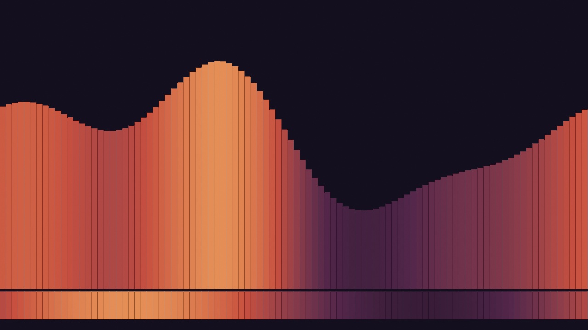

Left in one place for days with nobody watching, a sketch becomes an installation, and it can light the room around it. You learn what keeps a sketch running that long, from checkpoints to opening hours, and how it sends light to lamps. In the wall of bars above, the bottom band lights a strip of lamps under the screen. Then come a lighting console and a show laser, projectors and many screens, and ways to keep watch from the floor. The guide closes with where to go next.

## Leaving it running: `Installation`

[Chapter 44](44-HandingItOver.md#an-app-to-hand-somebody-signing-and-notarizing) made a sketch into an app that a gallery machine can run. On a wall, or in a shop window, that app runs for a week with nobody watching it. Different things end a run there than at a desk. A crash is one, and a frame that never finishes is another. The rest have nothing to do with your code. The screen saver comes on at midnight, the display sleeps, or somebody unplugs the monitor to borrow it. Any of them stops the sketch.

One line asks Ollin to prevent them:

```swift
override var installation: Installation { .on }
```

Now the window takes the whole screen with no title bar, the pointer disappears, and the display stays lit with the screen saver held off. Command-Q still quits.

You can try this on any example without editing it, and turn it off again the same way:

```sh
swift run --package-path Examples Example-Motion-Orbits --installation                 # any sketch, up on the wall
swift run --package-path Examples Example-Installation-Unattended --no-installation    # back to a window to work in
```

A sketch of your own goes up through `OllinRun`, the host that gives a single file its own window:

```sh
swift run OllinRun MySketches/YourSketch.swift --installation
```

The live host keeps its window for itself, so it runs a sketch as an ordinary one, whatever the sketch declares. `OllinRun` does not reload on save, so the wall runs the code you started it with. Keep working on the sketch in `swift run OllinLive`, and put it up with `OllinRun` when it is ready. A sketch that declares its own installation needs no flag. For the gallery machine, wrap the sketch in an app as Chapter 44 did, and the installation travels inside it.

## The clock over a long run: gaps and precision

The screen saver and a sleeping display are problems you can see. The clock goes wrong in two ways you cannot see, so Ollin handles both.

<picture>
  <source media="(prefers-color-scheme: dark)" srcset="Images/45-Installations/LongRunClock-dark.jpg">
  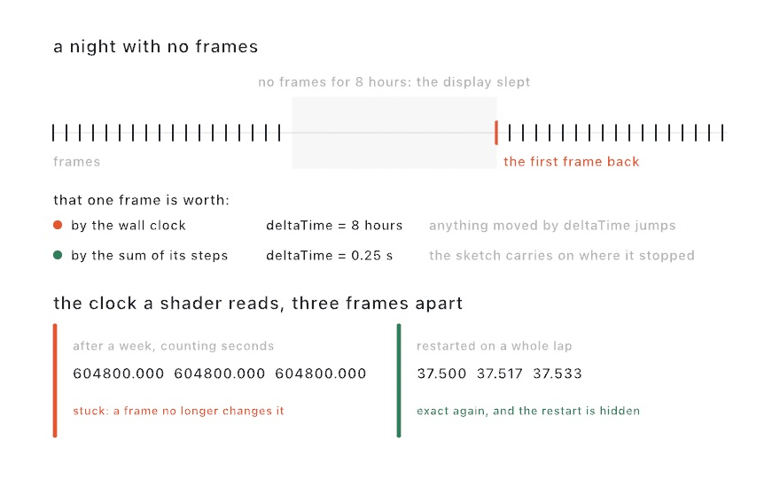
</picture>

The first is a gap. While the display sleeps, no frames are drawn, and the first frame back comes eight hours after the last one. Read from the wall clock, that frame has a `deltaTime` of eight hours. Anything that moves by `speed * deltaTime` then jumps off the canvas in one step.

So the sketch clock is the sum of its own frame steps, and each step is capped at a quarter of a second. A gap becomes a pause, and the sketch carries on where it stopped. This holds whether or not you declare an installation, because a laptop lid closes in the middle of an afternoon too.

The second is precision. Your `time` is a 64-bit number, and it stays exact for centuries. The copy your shaders read is a 32-bit number, which is too coarse to count seconds for a week. After a day, the steps between frames go uneven. After a week, adding one frame to it changes nothing, and every motion written in a shader stops.

The fix is a shader clock that starts over. The restart can only go unseen where the sketch repeats, so it is tied to the loop you declare:

```swift
override var installation: Installation { .on }
override var loopDuration: Double? { 120 }     // two minutes a lap
```

The shader clock then starts over after a whole number of laps, as many as fit in a thousand seconds. The sketch is back at the start of a lap at that moment, so nothing moves. A sketch with no declared loop keeps counting, because no moment is safe to jump at. If you know a safe period, say it with `Installation(clock: .restarting(every: 600))`.

## Picking up where it left off: checkpoints and `@Saved`

A sketch that draws only from the clock and the seed is the same after a relaunch, as long as it gets its clock back. A **checkpoint** gives it back. It is a file the sketch writes every so often, holding what it needs to carry on.

Other sketches grow. A wall that fills in one tile at a time is one, and so is a drawing that builds up over days. Three days in, such a sketch cannot be rebuilt from its seed. Getting back there would mean running the three days again.

<picture>
  <source media="(prefers-color-scheme: dark)" srcset="Images/45-Installations/Resuming-dark.jpg">
  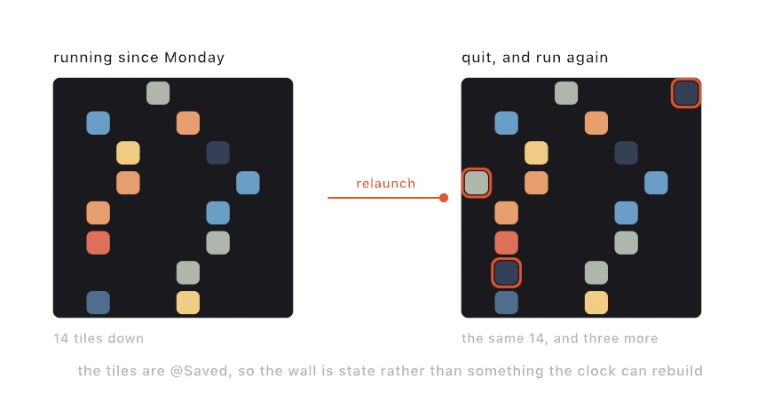
</picture>

So write the state down. A checkpoint needs two lines, one for how often and one for what:

```swift
override var installation: Installation { Installation(checkpoint: .every(seconds: 60)) }

@Saved var tiles: [Tile] = []            // Tile is a struct of yours, marked Codable
```

`@Saved` marks a property for the checkpoint. Every `@Saved` property goes into the file on that cadence, along with the seed, the clock, and every `@Param` value. A relaunch puts them all back before your first frame draws, and the sketch carries on.

A saved property has to be `Codable`, which is Swift's name for a type that can be written to a file and read back. Numbers, text, colors, and lists of them already are. Your own struct becomes one when you add `: Codable` to its declaration, as long as everything inside it is `Codable` too. What cannot be saved is anything that lives on the GPU: an accumulated canvas, a feedback layer, or a simulation field. Those are textures the framework owns, and the checkpoint does not reach them.

You will often edit the sketch while an old checkpoint is still on disk, so a mismatch loses only the value that changed. Rename a property, and the old value finds nothing. Change its type, and that property fails alone, named in the log, while everything else restores. Damage the file, and it is ignored. A sketch on a wall that refuses to start is worse than one that starts over.

`--fresh` ignores the saved state for one run without deleting it. Use it when a sketch comes back in a state you do not want.

## When it falls over: restarting

A sketch on a wall can crash at three in the morning with nobody there. The wall then stays dark until somebody notices, usually the next day. One more setting starts it again:

```swift
override var installation: Installation {
    Installation(checkpoint: .every(seconds: 60), restarts: .onFailure)
}
```

The process you start becomes a small **watch** with no window of its own, and your sketch runs under it as a child process. When a run ends badly, the watch starts another one. Pair it with a checkpoint, or the sketch comes back at its beginning every time. Restarting is off until you ask for it, even under `.on`. So a sketch that crashes at your desk stays crashed, and you can read the error. The watch runs wherever the sketch owns its window: under `OllinRun`, under `swift run` of an example or a package, and in an app.

<picture>
  <source media="(prefers-color-scheme: dark)" srcset="Images/45-Installations/BackUp-dark.jpg">
  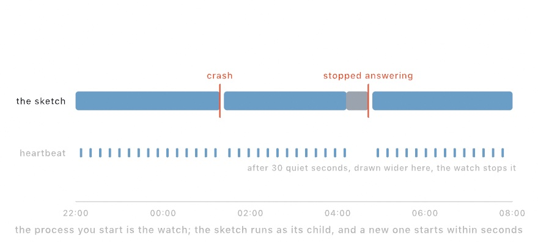
</picture>

Two things end a run badly. A crash is the one you expect. The other is a frame that never finishes, where the process stays alive and the picture freezes. That frozen picture is what a viewer sees. So the sketch writes a **heartbeat** every two seconds from its main thread, the thread that draws. A frame stuck on that thread stops the heartbeat. After 30 quiet seconds, the watch stops the run and starts a new one. The figure stretches that wait so it can be seen.

Quitting ends the watch too. Command-Q stops the sketch and the watch together, and nothing starts it again.

A sketch that fails one second after it starts will not be fixed by starting it again. So each try waits longer than the last. After five short runs in a row, the watch gives up and says so in the log. A run of thirty seconds or more clears that record. The watch also waits up to two minutes for a new run's first heartbeat, so a slow launch is not taken for a stall.

## Gallery hours: the schedule

A sketch on a wall is in a building, and buildings have opening hours:

```swift
Installation(schedule: .open(from: 10, to: 18))
```

Outside those hours, the screen goes dark and the display is allowed to sleep. The frames stop, and the clock stops with them. In the morning, the sketch carries on from where it stopped, not from the time the clock now reads.

<picture>
  <source media="(prefers-color-scheme: dark)" srcset="Images/45-Installations/GalleryHours-dark.jpg">
  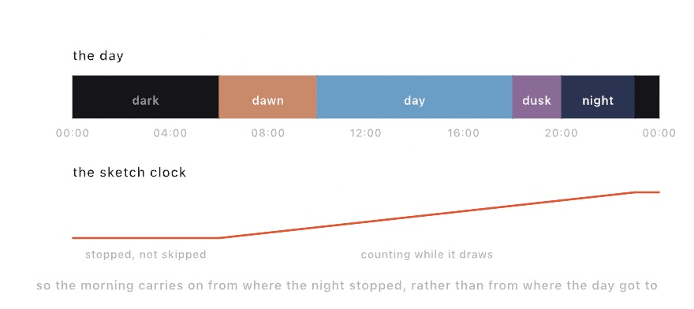
</picture>

A schedule can also name the parts of the day, for a sketch that changes as the day goes on. `scheduledPeriod` reads the part you are in:

```swift
override var installation: Installation {
    Installation(schedule: [.from(6, "dawn"), .from(10, "day"),
                            .from(18, "dusk"), .from(20, "night"),
                            .dark(from: 23)])
}

override func draw() {
    background(scheduledPeriod == "night" ? Color(white: 0.04) : .white)
}
```

Each part lasts until the next one starts, and the last part lasts until the first one comes around again. So a night can cross midnight. `.dark(from: 23)` is a part with nothing on screen. So this schedule is the one in the figure, dark from eleven at night until six. `scheduledProgress` says how far through the current part you are, from 0 to 1, for a sketch that changes gradually rather than all at once.

Both readings work at your desk as well as on a wall. So you can build a sketch that changes at dusk without waiting for dusk. Going dark is the one part that needs the installation, since only a sketch that owns its window can take the screen away.

## Light instead of pixels: DMX and LED maps

Everything so far keeps a screen running. An installation can also light the room itself. A lighting rig is a display with a few very bright pixels, and a sketch can render for it too.

Stage lighting speaks **DMX**, a protocol that has told dimmers, colored lamps, and moving lights what to do since 1986. DMX itself runs over a cable from one light to the next. **Art-Net** and **sACN** carry the same data over an ordinary network, which is how a Mac sends it. A **node** is the small box on that network that turns it back into a DMX cable for the lights.

The model is small. A **universe** is 512 channels of one byte each. A **fixture** is one light, such as a **par**, the round can of a stage light. A fixture listens at an address and reads a few channels from there. The fixture's manual says what each channel means, such as red, green, blue, a dimmer, or a pan motor. The sketch fills 512 bytes and sends them, and the lights change.

```swift
import OllinDMX

let dmx = DMXSender()                           // sACN, to the whole network
let par = DMXFixture.rgb(at: 1)                 // an RGB par on channels 1-3

override func draw() {
    var rig = DMXUniverse()
    rig.set(par, color: Color(hue: fract(time * 0.1), saturation: 1, brightness: 1))
    dmx.send(rig)                               // universe 1, every frame
}
```

`DMXSender()` with no address sends sACN to the whole network, and any listening node picks it up with no setup. `DMXSender(artNet: "192.168.1.60")` sends Art-Net to the one node at that address instead. Either way, you send every frame, like a second `draw()` aimed at the room. The sender paces the network itself. It sends data only when it changes, and it caps the rate near DMX's own refresh rate. While nothing moves, it repeats the last state now and then. `DMXFixture` keeps the addressing in one place. To **patch** a light, in lighting terms, is to give it its start address, and you patch one `DMXFixture` per light. A second light can start right after the first, with `DMXFixture.rgbw(at: par.nextAddress)`. A light the presets do not cover lists its channels' roles from the manual, as in `DMXFixture(at: 4, .dimmer, .red, .green, .blue)`. Then `rig.set(par, color:)` lands on whatever channels the fixture names.

<picture>
  <source media="(prefers-color-scheme: dark)" srcset="Images/45-Installations/LampsAndBytes-dark.jpg">
  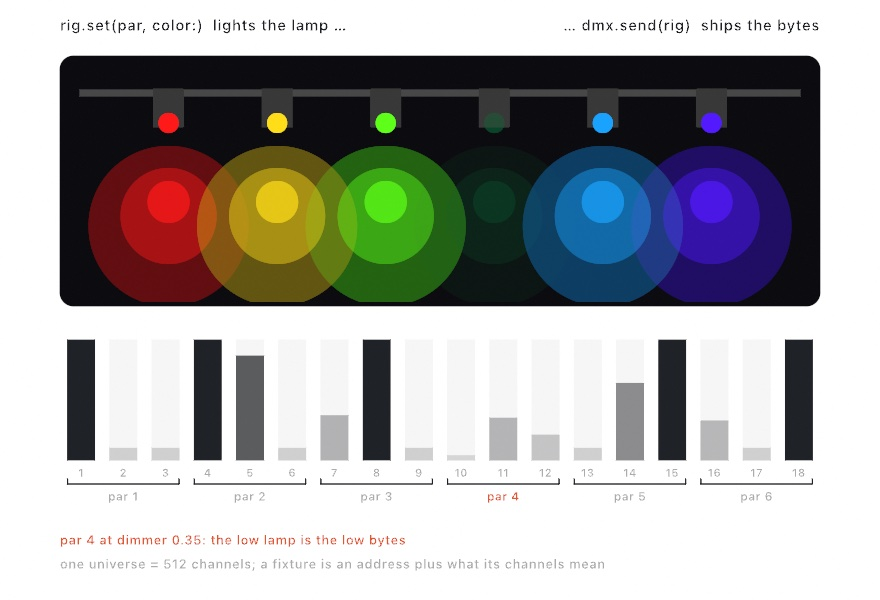
</picture>

[`Examples/Integration/DMXLoopback`](../Examples/Integration/DMXLoopback/Sketch.swift) runs a sender and a receiver on one Mac, so you can try the path with no hardware. Two notes help with real lights. macOS asks once for Local Network permission, and the terminal you launched from gets the answer. A free sACN monitor app shows every universe on the network, which helps while you find a fixture's address.

A wall of LEDs has too many lights to fill by hand. An `LEDMap` lays the LEDs over the canvas instead. A strip is a run of sample points along a line or a curve, and a matrix is a grid of them. Every frame, the map reads the rendered pixels under each LED and sends them through a `DMXSender`. The GPU reads only those few hundred points, never the whole frame.

```swift
import OllinDMX

let dmx = DMXSender()                     // or DMXSender(artNet:) for one controller
lazy var leds = LEDMap(sender: dmx)       // lazy, because it reads dmx

override func setup() {
    leds.addStrip(from: Vector2(100, 540), to: Vector2(980, 540), leds: 144)
    leds.addMatrix(in: Rectangle(x: 390, y: 150, width: 300, height: 300),
                   columns: 16, rows: 16, universe: 2)
    extend(leds)                          // from here on it feeds itself
}
```

After `extend(leds)`, draw as if the LEDs were not there, and whatever lands under the mapped points is what they show. An `LEDMap` is a sketch extension, so `extend` registers it, the way it registered [Chapter 44](44-HandingItOver.md#adding-behavior-from-outside-draw-sketchextension)'s crosshair. Each LED averages the patch of canvas it stands for, so a strip over fine detail glows steadily instead of flickering. On the network, the map packs whole LEDs into universes, 170 RGB LEDs to a universe, and a longer run continues on the next universe. A **pixel controller**, the node an LED strip plugs into, expects that layout. Patch yours to the numbers `leds.universes` reports. [`Examples/Integration/LEDMapping`](../Examples/Integration/LEDMapping/Sketch.swift) runs it all on one Mac, with a drawn strip and panel lit from what a receiver reads back.

<picture>
  <source media="(prefers-color-scheme: dark)" srcset="Images/45-Installations/LEDWall-dark.jpg">
  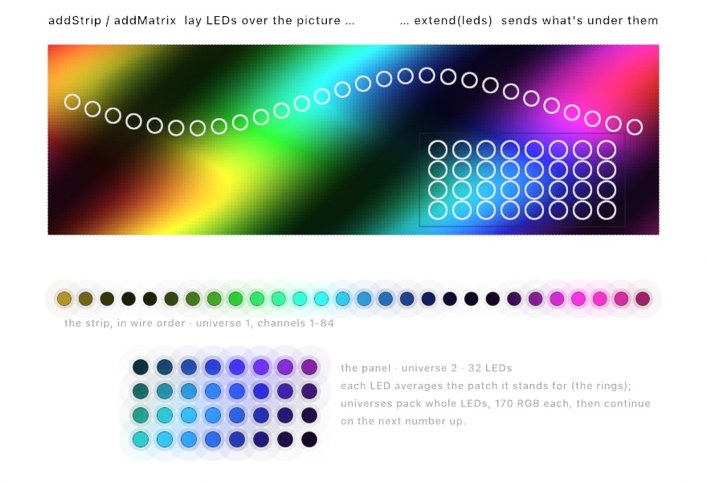
</picture>

## Putting it together: the wall of bars

The finished sketch is one you could hang. It is a wall of bars that rise and fall across a slow lap, colored by the part of the day. Everything the room needs is in its declaration. The drawing is slow on purpose, because people pass it many times over a week rather than looking once. Make `MySketches/WallPiece.swift`.

The first part is what the room needs to know. One `Installation` fills the screen and keeps it awake, writes a checkpoint every minute, and restarts after a crash or a stall. It also names the parts of the day, and goes dark from eleven at night until six. `loopDuration` says the sketch repeats every three minutes, the lap the drawing reads through `loopProgress`.

```swift
import Ollin
import OllinDMX

final class WallPiece: Sketch {
    override var canvasSize: CanvasSize { .size(1280, 720) }

    /// Everything the room needs to know, in one declaration.
    override var installation: Installation {
        Installation(checkpoint: .every(seconds: 60),
                     restarts: .onFailure,
                     schedule: [.from(6, "dawn"), .from(10, "day"),
                                .from(18, "dusk"), .from(21, "night"),
                                .dark(from: 23)])
    }

    /// Three minutes a lap, so the sketch is back where it was every three
    /// minutes and the shader clock never has to count a week.
    override var loopDuration: Double? { 180 }

    /// Which part of the day to draw. Leave it nil on the wall and the schedule
    /// answers; name one here to see any hour without waiting for it.
    let showing: String? = "dusk"
    var period: String { showing ?? scheduledPeriod ?? "day" }

    let palettes: [String: [Color]] = [
        "dawn":  [Color(hex: 0x1B1B2E), Color(hex: 0x5B4A78), Color(hex: 0xD98E73), Color(hex: 0xF3D9A4)],
        "day":   [Color(hex: 0x16324A), Color(hex: 0x3E7CA6), Color(hex: 0x9FD2E0), Color(hex: 0xF4F1E4)],
        "dusk":  [Color(hex: 0x140F1E), Color(hex: 0x53264A), Color(hex: 0xC7503F), Color(hex: 0xF0A860)],
        "night": [Color(hex: 0x05070F), Color(hex: 0x122744), Color(hex: 0x2E5C7A), Color(hex: 0x8FB8CE)],
    ]

    let leds = LEDMap(sender: DMXSender())

    override func setup() {
        noStroke()
        // The wall under the screen: one run of lamps reading the canvas above
        // them. After this the sketch draws as if they were not there.
        leds.addStrip(from: Vector2(90, Double(height) - 54),
                      to: Vector2(Double(width) - 90, Double(height) - 54), leds: 96)
        extend(leds)
    }

```

The second part is the drawing, and it keeps nothing between frames. Every bar's height comes from where it stands and how far along the lap the sketch is. So a restart at any hour puts it back where the checkpoint left it, and nothing drifts over a week.

```swift
    override func draw() {
        let ramp = Ramp(palettes[period] ?? palettes["day"]!)
        background(ramp.color(at: 0))

        // One lap of the loop, so nothing in the picture depends on how long the
        // machine has been switched on.
        let lap = loopProgress(over: 180) * .tau
        let columns = 96
        let step = Double(width) / Double(columns)

        for i in 0 ..< columns {
            let u = (Double(i) + 0.5) / Double(columns)
            // Three slow waves that share one lap, so their sum repeats with it.
            let swell = sin(lap + u * .tau) * 0.5
                      + sin(lap * 2 - u * .tau * 2) * 0.3
                      + sin(lap * 3 + u * .tau * 3) * 0.2
            let t = swell * 0.5 + 0.5
            let tall = Double(height) * (0.16 + t * 0.6)
            fill(ramp.color(at: 0.15 + t * 0.85))
            drawRect(corner: Vector2(Double(i) * step, Double(height) - tall - 90),
                     width: step - 1.5, height: tall)
        }

        // The band the lamps read, kept plain so a strip over it glows steadily.
        for i in 0 ..< columns {
            let u = (Double(i) + 0.5) / Double(columns)
            let t = sin(lap + u * .tau) * 0.5 + 0.5
            fill(ramp.color(at: 0.2 + t * 0.7))
            drawRect(corner: Vector2(Double(i) * step, Double(height) - 84),
                     width: step - 1.5, height: 60)
        }
    }
}
```

The sketch composes the chapter's steps:

- **The declaration** is [Leaving it running](#leaving-it-running-installation)'s `Installation`, filled in. `Installation(...)` fills the screen and keeps the display awake by default, so only the checkpoint, the restart, and the schedule are written out.
- **The lap** is the long-run clock. `loopDuration` of 180 seconds lets the shader clock start over on a whole lap. `loopProgress(over: 180)` goes from 0 to 1 over each lap, and `* .tau` turns it into the angle `lap`. Three waves share that lap, so their sum repeats with it.
- **The checkpoint** has no `@Saved` property to write here, since the drawing keeps nothing. It saves the seed and the clock. So when the sketch is started again after a power cut, it comes back at most a minute behind.
- **The restart** starts it again after a crash, and after a stall of 30 seconds.
- **The schedule** picks the palette through `scheduledPeriod`, and its dark part turns the screen off at eleven. `showing` holds dusk while you work, and `period` falls back to the schedule when `showing` is nil.
- **The light** is the `LEDMap`. One strip of 96 LEDs runs across the bottom of the canvas, and the drawing leaves a plain band there for it to read. So the lamps under the screen take the same colors as the bars above them.

> **Swift note.** `let showing: String? = "dusk"` is a constant that may hold a name or nothing. `??` picks the next choice when it holds nothing, as in [Chapter 8](08-Words.md). A dictionary lookup answers with an optional, as [Chapter 24](24-Automata.md#a-circuit-made-of-cells-wireworld) showed, so `palettes["day"]!` unwraps it with `!`.

Then make it yours:

- Set `showing` to `"dawn"` to see the morning at any hour.
- Press Command-K on the running sketch, and drag the corners onto a wall that is not square to the projector. [Fitting a projector: corner pinning](#fitting-a-projector-corner-pinning) shows how.
- Give it a second display with `displays: .spanning` and a canvas twice as wide. The bars carry on across both screens, because the wall divides one canvas rather than running the sketch twice.

Work on it with `swift run OllinLive MySketches/WallPiece.swift`, which runs it as an ordinary sketch whatever it declares. Before it goes up, set `showing` to nil, so the palette follows the real clock. Then put it up with `OllinRun`, which reads the declaration, and send its log to a file as [The log](#the-log) shows:

```sh
swift run OllinRun MySketches/WallPiece.swift
```

For the gallery machine, make it an app with `--kind mac-app`, as [Chapter 44](44-HandingItOver.md#an-app-to-hand-somebody-signing-and-notarizing) did. The installation, the checkpoint, and the watch all travel inside the app. Add the app to Login Items, as Chapter 44 did for the wallpaper, so it starts again whenever the Mac does.

## More light instead of pixels: a console and a show laser

The wall's strip of lights only listened: the sketch sent bytes, and the LEDs lit. Light can also come the other way, from a console a lighting designer is holding. It can also be drawn rather than spread over lamps, by a show laser.

### A console that drives the sketch: `DMXReceiver`

A `DMXReceiver` turns the sketch into a fixture. The faders of a lighting **console**, the desk a lighting designer runs a show from, arrive as channels, and the sketch reads them. It is for a show where the lighting designer runs the sketch from the same desk as the lights. The picture and the light then change on one cue. Media servers, the computers that play video in a theater, take their cues from the lighting console the same way.

```swift
import OllinDMX

let console = DMXReceiver()                    // listens for sACN
@Param(10...400) var radius = 120.0

override func setup() {
    try? console.start(universes: [1])         // join universe 1
    console.bind(channel: 2, to: $radius)      // fader 2 moves the parameter
}

override func draw() {
    background(Color(white: console.level(1))) // fader 1, from 0 to 1
    drawCircle(center: center, radius: radius)
}
```

`start(universes:)` opens the network port and joins the universes a console sends to. It throws when it cannot open the port. `try?` lets the sketch carry on without it, and every level then reads 0. `level` reads a channel from 0 to 1. `bind(channel:to:)` puts a fader on the same parameter the inspector slider moves, like the MIDI and OSC bindings of [Chapter 38](38-ControlsAndSignals.md#one-parameter-three-hands-binding-and-smoothing). `DMXLoopback` runs both directions on one Mac. A sender chases colors across a drawn rig, and the rig is lit from what the receiver reads back.

### Drawing with light: a show laser

A show laser draws the picture itself, in light, with one moving dot. Two small mirrors steer the beam. A fixed clock decides how often they are told where to point, and at each of those points the beam is on or off. The laser holds no picture. The dot moves along a loop so fast that the eye sees the whole shape at once.

It is for line work at a size and brightness no screen reaches. A figure can cover the front of a building, or lines can hang in the air over a crowd. Laser shows came to planetariums with Laserium, which opened at the Griffith Observatory in Los Angeles in 1973. The ILDA file, from the International Laser Display Association founded in 1986, is still how one laser system hands a show to another.

The line geometry from [Chapter 15](15-ShapesAsMaterial.md) is the material, the same lines a plotter takes in [Chapter 41](41-FinishingASketch.md#lines-for-a-pen-svg-and-pdf). On the way to the projector, the lines become the path the beam takes:

<picture>
  <source media="(prefers-color-scheme: dark)" srcset="Images/45-Installations/BeamPath-dark.jpg">
  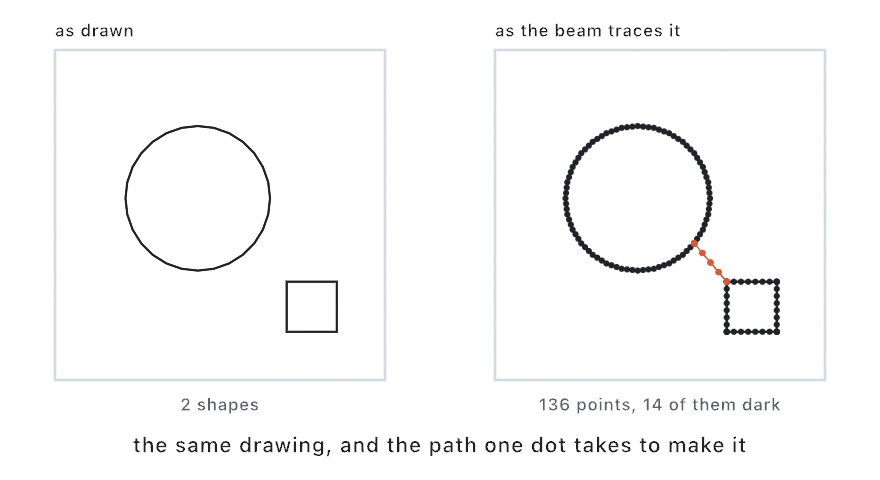
</picture>

Points are spread evenly along each line, so the beam moves at a steady speed and the line looks even. A few points are held at a sharp corner, because the mirrors have mass and would round it off. Between two shapes, the beam goes dark and the mirrors travel. Points are held at both ends of that jump too. Otherwise the beam would light while the mirrors are still moving, and drag a tail across the gap. The shapes are then visited nearest first, since dark travel is time that draws nothing.

`OllinLaser` sends a frame to a projector through an Ether Dream. An Ether Dream is a small box on the network that turns points into the signals the mirrors follow:

```swift
import OllinLaser

let laser = LaserProjector(etherDream: "192.168.1.50")

override func setup() {
    laser.connect()
    laser.arm()                       // no light before this
}

override func draw() {
    background(.black)
    let ring = Contour((0..<64).map { i -> Vector2 in
        let angle = Double(i) / 64 * .tau
        return center + Vector2(cos(angle), sin(angle)) * 300
    }, closed: true)
    var frame = LaserFrame(canvas: bounds)
    frame.add(ring, color: .green)
    laser.send(frame)
    drawLaserPreview(laser.stream)    // watch it on screen too
}
```

A frame holds paths in canvas coordinates, the same numbers every drawing call takes. A `Shape` adds its outlines. A laser has no fills, so shade a region with `Hatching`, the way the plotter does.

Time is the budget. The point rate divided by the laser's refresh rate is every point a frame can hold. At the default 20,000 points a second and the laser's default 30 frames a second, that is 666 points. Past it, the frame still plays whole but repeats more slowly, and the eye sees it flicker. `laser.stream?.isOverBudget` says when you are past it. Draw less, or set `laser.optimizer.spacing` wider so the points sit farther apart.

A projector puts real power into its beam, and only the moving mirrors spread it out. So **a `LaserProjector` gives no light until you call `arm()`**. Once armed, the brightness is capped at half, and `laser.safety.maxBrightness` raises the cap. A beam that stops moving is turned off, and so is a frame the sketch stopped sending. Treat the first run like a machine that cuts: low power, pointed at a wall, and nobody in the beam.

[`Examples/Integration/LaserPreview`](../Examples/Integration/LaserPreview/Sketch.swift) is that preview with parameters attached, and it runs with no hardware at all. [Laser](../Docs/Integration/Laser.md) has the rest, including the ILDA file for a laser system this library does not drive directly.

## Fitting the room: a projector and many screens

The wall of bars filled one screen at the canvas's own shape. A real room is rarely that simple. A projector hangs off to one side, a long wall needs two projectors, or several screens have to show one picture.

### Fitting a projector: corner pinning

A projector is almost never square to what it is aimed at. It hangs off a beam or sits on a shelf to one side, so the rectangle lands on the wall as a skewed shape. **Corner pinning** moves the picture's four corners onto the wall's four corners and bends everything between them to match. It is for any projection you cannot hang straight on. The warp is the projective mapping of a square onto four corners, as Paul Heckbert set it out in 1989.

<picture>
  <source media="(prefers-color-scheme: dark)" srcset="Images/45-Installations/FittingTheWall-dark.jpg">
  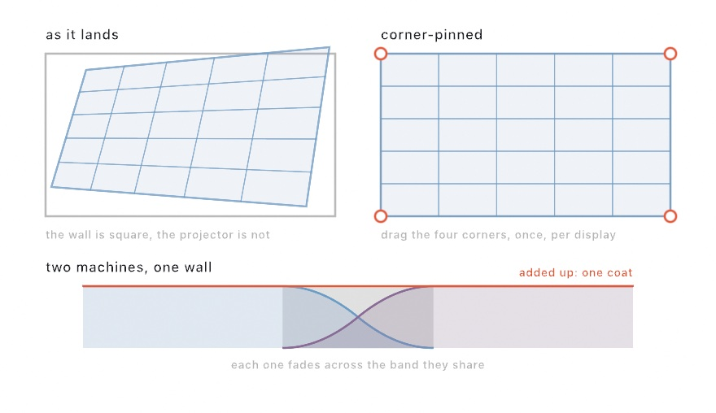
</picture>

Press **Command-K** on the running sketch. Four handles appear on the corners. Drag each one onto a corner of the wall, and press Command-K again. The corners are kept with the display rather than with the sketch, since the projector is off square by the same amount whatever is playing. Line it up once, and everything you show there opens square.

### Two projectors, one picture: edge blending

A wall longer than one projector needs two, each showing part of the canvas. Where their pictures overlap, each fades out across the shared band. The two fades add up to one even coat of light instead of a bright bar down the join. This is **edge blending**, and Ollin's fades follow Paul Bourke's 2004 method for ordinary projectors. With two machines, each declares its part:

```swift
// The machine on the left.
Installation(projection: .init(visibleRegion: Rectangle(x: 0, y: 0, width: 0.6, height: 1),
                               blend: Insets(right: 0.2)))
```

`visibleRegion` is measured in fractions of the canvas, so this machine shows the left 0.6 of it. `blend` is the band where it fades, the right 0.2. The machine on the right declares the mirror of that: `visibleRegion` starting at 0.4, and the same 0.2 fading in from its left. Both describe the same band with the same numbers, so their fades add up to one coat. None of this reaches an export, since a file has no wall to fit.

### Several displays, one machine: `.spanning`

Two projectors do not need two machines. A Mac with two outputs can drive both, and one sketch can span every display it has. It is for a wall of screens or projectors run from one computer, where one drawing has to cross from screen to screen. Using several displays as one desktop goes back to the Macintosh II in 1987.

<picture>
  <source media="(prefers-color-scheme: dark)" srcset="Images/45-Installations/ManyDisplays-dark.jpg">
  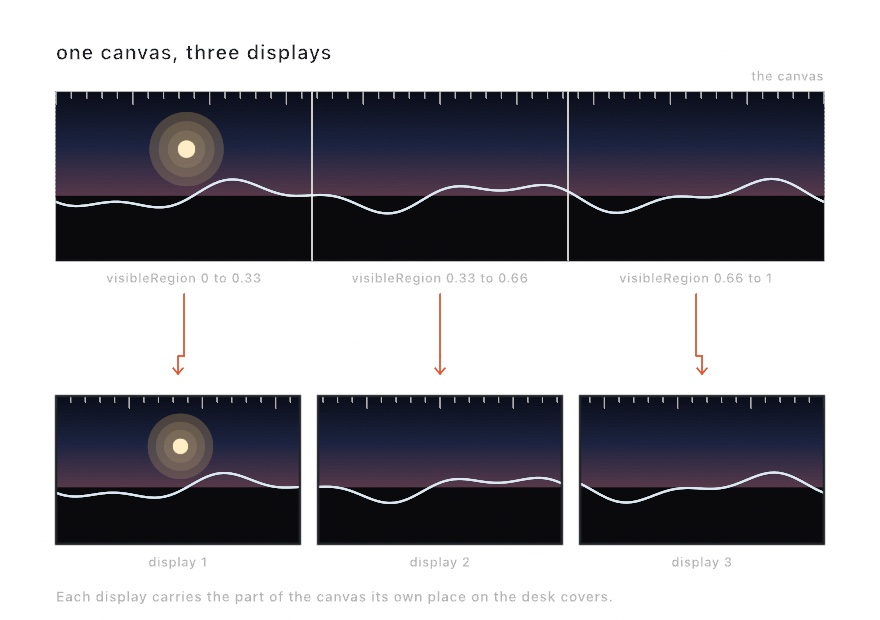
</picture>

```swift
override var installation: Installation {
    Installation(displays: .spanning)
}
```

That spreads one canvas over every display the machine has, in the arrangement they are in. Two monitors side by side carry a half each, and one above the other carries a band each. You declare no numbers, because macOS already knows how the displays are arranged.

The sketch draws one canvas, and the wall decides which part of it each display carries. It is the same split as the two-machine wall, with both parts on one machine. For a wall that is not a plain row of monitors, declare the parts yourself. Two projectors overlapping in the middle look like this:

```swift
Installation(displays: .parts([
    .init(visibleRegion: Rectangle(x: 0, y: 0, width: 0.6, height: 1), blend: Insets(right: 0.2)),
    .init(visibleRegion: Rectangle(x: 0.4, y: 0, width: 0.6, height: 1), blend: Insets(left: 0.2)),
]))
```

Command-K raises the handles on every display at once, since a wall is lined up as one thing. The arrow keys that move a corner go to the display you clicked last.

Before you reach the room, you can lay the wall out on your desk:

```sh
swift run --package-path Examples Example-Installation-ManyDisplays --rehearse 3
```

That opens one window per part, side by side, each carrying its own part. It shows you the layout rather than the light. Two beams sharing a band add up to one coat, but two windows sharing one would only hide each other.

The sketch is drawn once a frame however many displays it goes on. What grows is the size it is drawn at, since each display wants its own part at its own resolution.

### Several windows, one world: `canvasOnScreen`

A sketch can also run as several separate windows that look into one scene. Run it three times, and the three windows each show their own part of the same world. It is for a desk or a shop window of separate screens that should read as one picture. It is the idea of a desktop spread over several displays, done by the sketch itself. The windows never talk to each other. Each one reads the time of day, the same trick [Chapter 44](44-HandingItOver.md#a-widgets-clock-the-time-of-day)'s widget used, so they cannot disagree.

<picture>
  <source media="(prefers-color-scheme: dark)" srcset="Images/45-Installations/OneWorldManyWindows-dark.jpg">
  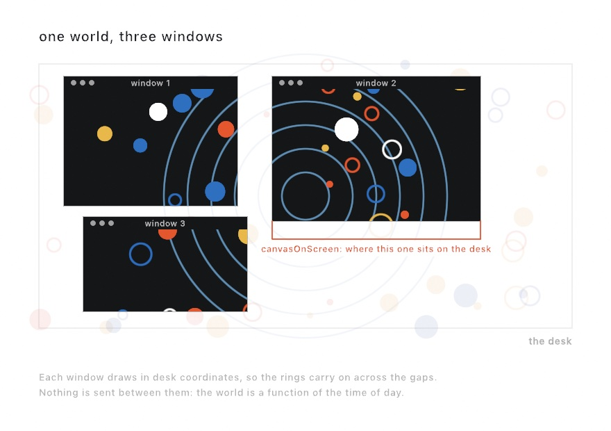
</picture>

Each window needs to know where it is. `canvasOnScreen` says where this canvas sits on the desk, the space all your screens share. It is in screen points, measured from the top left of the main screen. So all three windows describe the same desk in the same numbers:

```swift
guard let mine = canvasOnScreen else { return }
let onCanvas = (worldPoint - mine.corner) * (width / mine.width)   // the desk, seen from here
```

`worldPoint` is a point of your world, in desk coordinates. Subtracting the window's corner moves it into this window. The last factor turns screen points into canvas pixels, since a canvas usually has more pixels than its window has points. Draw in desk coordinates, and move each point into this canvas at the last moment. Drag a window, and the next frame reads its new place, so the world stays where it is while the window slides over it. [`Examples/Installation/ManyWindows`](../Examples/Installation/ManyWindows/Sketch.swift) is the full example.

Windows on one machine can share a clock that way, because they read the same machine's time. Separate machines cannot, which is what a room is for.

### Several machines, one sketch: `Room`

The two-machine wall told each machine which part of the canvas it shows, but not what time it is. Each sketch starts its clock when it starts. Switch on the machine at the left of the wall, walk to the one at the right, and switch that one on. The two are now seconds apart, and everything that moves shows it.

A **room** puts several machines on one sketch. They find each other by a name you make up, with no server and no address to configure. It is for a wall or a space where several machines have to move together. The shared clock uses Flaviu Cristian's method from 1989. A machine asks the one that keeps the time, and allows for half the time the question and its answer took.

<picture>
  <source media="(prefers-color-scheme: dark)" srcset="Images/45-Installations/OneRoom-dark.jpg">
  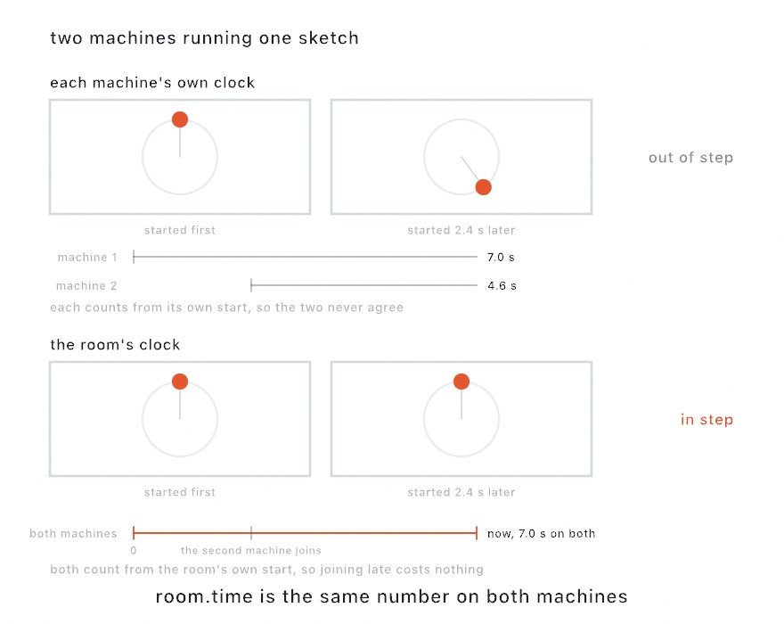
</picture>

```swift
import OllinRoom

let room = Room(named: "wall", seat: 0)   // the machine at the right says seat: 1

override func setup() {
    extend(room)
    room.shareAll()
}

override func draw() {
    background(.black)
    let angle = room.time * 0.5           // room.time, not time
    drawCircle(center: center + Vector2(cos(angle), sin(angle)) * 300, radius: 30)
}
```

A room gives the machines a clock, a seat each, and one set of parameters.

**The clock.** `room.time` is the same number on every machine. One machine keeps it, and the others ask it the time a few times a second. The answer allows for the time it spent on the network. Measured between two sketches on one Mac, the first answer lands within a quarter of a second of joining. After that, the clocks agree to a tenth of a millisecond, which is as fine as the measurement could see. Before that first answer, `room.clockError` is `nil`, so a sketch that must not start early can wait for it. When the machine keeping the clock leaves, the room picks another and keeps the time it already had.

**The seats.** `room.seat` counts from zero, and `room.seatCount` says how many there are. A sketch can then lay itself out across the whole wall and slide its own part into view:

```swift
let wall = width * Double(room.seatCount)
withState {
    translate(-Double(room.seat) * width, 0)
    drawWall(across: wall)                // your drawing, as wide as the wall
}
```

A seat differs from the `visibleRegion` of the two-machine wall. `visibleRegion` cuts a finished canvas for a projector in a fixed place. A seat tells the sketch which part of the wall it *is*, so the drawing itself can be wider than one screen. Ask for a fixed seat, as above, and a machine that restarts comes back to the same part.

**The parameters.** `room.shareAll()` makes every `@Param` travel, and `room.share("speed", "hue")` picks some. Change a parameter on any machine, and the others take the change on their next frame after it arrives. If two people move one parameter at the same moment, the room's clock settles it, and the later change wins everywhere.

Anything else the sketch wants to say travels under a key, and reads the way OSC and MIDI read in [Chapter 38](38-ControlsAndSignals.md#parameters-from-anywhere-midi-and-osc):

```swift
room.send("bird", position, reliable: false)      // your bird's Vector2, every frame
let bird = room.point("bird", default: center)     // the latest one
for message in room.messages() { }                 // or every one that arrived
```

`reliable: false` sends it the quick way, which suits a value sent every frame, since the next one matters more than one that goes missing. The first time a sketch opens a room, the system asks to use the local network. A sketch run from a terminal gets the terminal's answer, so grant it once at the desk before the show. Anyone on that network who knows the room name can join. That suits a show network, and on a network you do not control, give the room a `passcode:`.

You do not need a second machine to see it work. `RoomLoopback` puts two rooms in one sketch. The left panel sends where the pointer is, the right panel draws only what arrived, and holding the space bar cuts the connection.

```sh
swift run --package-path Examples Example-Integration-RoomLoopback
```

## Keeping watch: the log, a phone, and the building

Once the wall of bars is up, you are no longer in front of it. Three things report on it or reach it from somewhere else. They are the log it writes, a phone that holds its parameters, and the building's own sensors.

### The log

An unattended run writes a line when it starts, when it resumes, and when the machine wakes or the displays change. The schedule and the watch write their own lines. It is for finding out on Monday what happened over the weekend. Servers keep logs for the same reason, a habit Unix made standard with syslog, which Eric Allman wrote in the 1980s. Send the wall's log to a file:

```sh
swift run OllinRun MySketches/WallPiece.swift >> ~/wall.log 2>&1
```

`>>` adds the output to the end of the file, and `2>&1` sends the error lines there too. A few lines from one weekend:

```
Ollin installation [2026-08-15 08:41:45]: running unattended; Command-K lines it up, Command-Q quits
Ollin installation [2026-08-15 08:41:45]: resumed the run saved at 2026-08-15 08:40:12 (frame 4098, 68s in)
Ollin installation [2026-08-15 23:00:05]: dark until 06:00
Ollin installation [2026-08-16 06:00:05]: on screen until 10:00
```

### Tuning it from the floor: `RemoteInspector`

The sketch is on the wall and the Mac is behind it. The place to judge a speed or a color is in front of the wall, twenty steps from the keyboard. A `RemoteInspector` serves every parameter the sketch declares to a web page, so your phone becomes the inspector. It is the same inspector as the Mac's, with each control drawn for a touch screen. It works like the settings page a network printer or a lighting console serves, which any browser on the network can open.

<picture>
  <source media="(prefers-color-scheme: dark)" srcset="Images/45-Installations/TuningFromTheFloor-dark.jpg">
  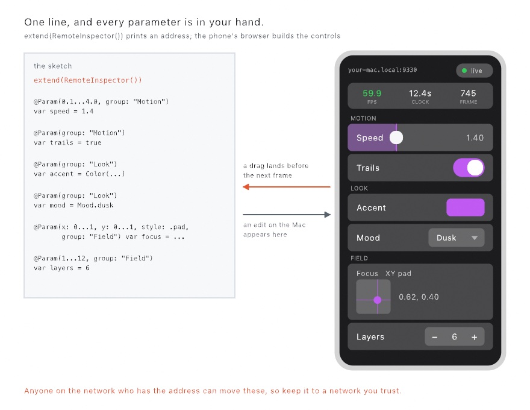
</picture>

```swift
import OllinRemote

@Param(0.1...4) var speed = 1.4
@Param var accent = Color.purple

override func setup() {
    extend(RemoteInspector())
}
```

On launch, the sketch prints `Remote surface: http://your-mac.local:9330`. Open that address in the phone's browser, on the same Wi-Fi. Every `@Param` appears as a touch control, and the kind of control follows the property's type, as it does in the inspector. Sliders take the width of the screen, a `style: .pad` vector becomes an XY pad, and switches, menus, and a color picker cover the rest. The groups match the inspector's. A strip at the top carries the frame rate, the clock, and the frame count. So you can read the sketch's health from the floor.

Changes go both ways. Drag a slider on the phone, and the value lands before the next frame, where the inspector's own changes land. Change a parameter on the Mac, and the phone follows. So you can stand in front of the wall, look at the sketch, and turn the speed until it looks right.

Anyone on the same network who has the address can move the parameters. On your studio Wi-Fi or a private show network, that is what you want. On a network you do not control, remove the `extend(RemoteInspector())` line before you leave the sketch running.

[`Examples/Integration/RemoteSurface`](../Examples/Integration/RemoteSurface/Sketch.swift) serves a tunable aurora with every kind of control. It draws its own address at the bottom of the canvas, so the sketch tells you how to reach it:

```sh
swift run --package-path Examples Example-Integration-RemoteSurface
```

### What the building already says: MQTT

A building has more on its network than lights. A thermostat, a door sensor, a power meter, and a smart plug often talk over **MQTT**, a protocol for small messages between devices. A device **publishes** a reading to a named **topic**, such as `home/kitchen/temperature`. A **broker** in the middle receives it and passes it to everything that **subscribed** to that topic. Neither end knows the other exists, which is why a sketch can join a building it had nothing to do with. It is for a sketch that answers the room, such as the heating or a door, or that sends a lamp a command. Andy Stanford-Clark and Arlen Nipper wrote MQTT in 1999 to watch oil pipelines over expensive satellite links.

```swift
import OllinMQTT

let bus = MQTTClient(host: "192.168.1.20")     // the broker, wherever it lives

override func setup() {
    try? bus.connect()
    bus.subscribe(to: "home/+/temperature")
}

override func draw() {
    let warmth = bus.number("home/kitchen/temperature", default: 20)
    background(Color.blue.mixed(with: .red, (warmth - 15) / 15))
}
```

You need a broker somewhere. A house that runs a home automation system already has one, and its address is what goes in `host:`. On your own Mac, install one with Homebrew, as [Chapter 44](44-HandingItOver.md#in-your-pocket-the-sketch-on-the-phone) did for `xcodegen`. `brew install mosquitto` and then `mosquitto -v` start a broker, which is enough to build against. The sketch then reaches it with `MQTTClient(host: "localhost")`.

A subscription is a filter that can match many topics, through two wildcards. `+` stands for a single level of the topic, and `#` for every level from there down. So `home/+/temperature` matches the kitchen and the hall. A trailing `#` also matches its own parent, so `home/#` matches `home` itself. No wildcard reaches a topic that starts with `$`, which is where a broker keeps its own statistics.

<picture>
  <source media="(prefers-color-scheme: dark)" srcset="Images/45-Installations/TopicsAndFilters-dark.jpg">
  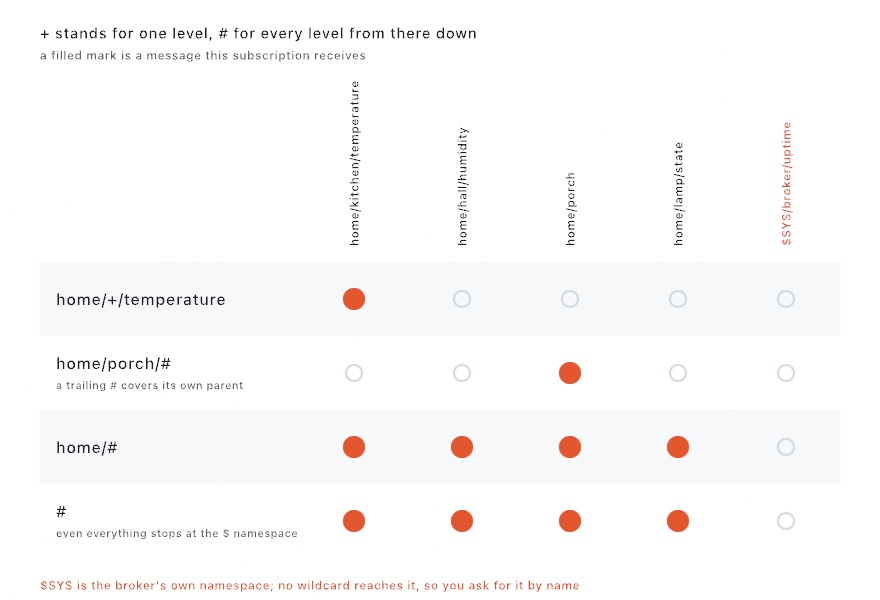
</picture>

Reading works the way [Chapter 38](38-ControlsAndSignals.md)'s controllers did, because it is the same problem. A reading that keeps coming is read at its latest with `bus.number(topic, default:)`. Something that happens once is drained from `bus.messages()` every frame. `bus.bind("home/dial/level", to: $radius)` puts a dial on a wall onto a parameter. A message's **payload** is its bytes, and the protocol says nothing about what they mean. So `MQTTMessage` reads what devices usually write: a decimal number, a switch word like `ON` or `offline`, or a small JSON object. A field of the object comes out through `message.number(named: "temperature")`.

The messages go both ways. `bus.publish("home/lamp/set", true, qos: .atLeastOnce)` sends the word a switch expects. `qos:` is how hard the client tries. A message at `.atLeastOnce` is kept until the broker confirms it, and sent again after a lost connection. A command needs that, since a lamp that never heard `OFF` stays on all night. The default, `.atMostOnce`, sends and forgets, which suits a reading that will be published again in a moment. Publish with `retains: true`, and the broker keeps the message as the topic's current value. The next thing to subscribe then learns it at once, so a sketch starts up already knowing the room.

Two parts of the protocol help with a long run. The first is the **will**, a message you hand the broker when you connect:

```swift
let bus = MQTTClient(host: "192.168.1.20",
                     will: MQTTWill(topic: "gallery/wall/status",
                                    text: "gone", retains: true))
```

If the machine loses power, the broker notices the silence within 45 seconds of the last message. The wait is one and a half times the keep-alive, a check the client sends every 30 seconds by default. The broker then publishes `gone` to every device subscribed to `gallery/wall/status`. Call `disconnect()` on the way out, and the broker throws the will away instead, because the sketch left on purpose. So the building can tell whether your sketch is alive without anyone walking to the wall.

The second is what happens when the network drops for a moment. The client reconnects on its own. It waits a quarter of a second at first and doubles the wait each time, up to eight seconds. So a broker that is restarting is not flooded with attempts. It puts every subscription back when it returns, and sends again anything at `.atLeastOnce` that was never confirmed. `bus.connectionCount` counts how many times the broker has accepted the client. A log that watches that number sees a dropped connection, even one that lasted less than a frame.

## Where this comes from

DMX512 was standardized by the United States Institute for Theatre Technology in 1986, and it is still what a lighting console speaks. It has lasted by being simple: 512 numbers, sent over and over, with nothing to negotiate. The two ways this chapter puts it on a network came later: Art-Net from Artistic Licence, and sACN as ANSI E1.31. The rest of the chapter uses the usual answers for software that runs unattended. Bound the step, write down what you can lose, and start again when it stops. The families' entries name their own sources, and full credits are in the project's [attribution notes](../ATTRIBUTION.md).

## Go deeper

- [Installation](../Docs/Output/Installation.md): leaving a sketch running, what each part of the declaration turns on, the checkpoint file's shape, the schedule's parts, projection and blending, several displays, and several windows.
- [DMX](../Docs/Integration/DMX.md): universes and fixtures, Art-Net and sACN, the send cadence, the console-drives-the-sketch direction, and the LED map's sampling.
- [Laser](../Docs/Integration/Laser.md): frames and colors, how the path is ordered and spaced, the point budget, the safety gate, the Ether Dream, and the ILDA file for a laser system the library does not drive directly.
- The Bonačić homage [`NamaFrieze`](../Examples/Recreations/VladimirBonacic/NamaFrieze/Sketch.swift): a light frieze from 1969 that ran 36 meters across a department store. It is drawn to scale and sent out as eighteen dimmer channels, so the same universe that lights the picture can light a wall.
- [MQTT](../Docs/Integration/MQTT.md): the broker and the client, topics and their wildcards, what devices write in a payload, the two service levels, retained values, the last will, and reconnecting.
- [Remote](../Docs/Integration/Remote.md): the `@Param` parameters served to a phone as touch controls, what each kind becomes, how values land, and who else can reach them.
- [Room](../Docs/Integration/Room.md): several machines joining by name, the three ways to read what arrives, shared parameters, the clock they agree on and what it costs, seats, and who can join.
- Worked examples, in [`Examples/Installation/`](../Examples/Installation/): `Unattended` (the one-line declaration), `Watched`, `Hours`, `Fitted`, `ManyDisplays`, and `ManyWindows`, plus [`Examples/Integration/DMXLoopback`](../Examples/Integration/DMXLoopback/Sketch.swift), [`Examples/Integration/LEDMapping`](../Examples/Integration/LEDMapping/Sketch.swift), [`Examples/Integration/LaserPreview`](../Examples/Integration/LaserPreview/Sketch.swift), [`Examples/Integration/MQTTRoom`](../Examples/Integration/MQTTRoom/Sketch.swift), [`Examples/Integration/RemoteSurface`](../Examples/Integration/RemoteSurface/Sketch.swift), [`Examples/Integration/RoomCanvas`](../Examples/Integration/RoomCanvas/Sketch.swift), and [`Examples/Integration/RoomLoopback`](../Examples/Integration/RoomLoopback/Sketch.swift).

## Where to go from here

This is the end of the guide. It started with a circle that breathed in a window. It ends with a sketch that runs on a wall for a week and lights the room around it. In between, you drew with chance and noise, built systems that move by forces and rules, and wrote shaders. You lit 3D scenes, read cameras, microphones, and sensors, and made sound and music. Then you sent the work out as files, performances, apps, and installations. Most of these techniques belong to the field rather than to Ollin, so they carry over to whatever tool you use next.

To keep going with Ollin, the [API reference](../Docs/README.md) has every call this guide pointed to. [Appendix D](D-CompleteToolbox.md) lists every capability with where it is taught. [`Examples/`](../Examples/) holds working sketches to read and change, including [recreations](../Examples/Recreations/README.md) of works by artists such as Vera Molnár and Bridget Riley. To keep learning the field, go to the sources this guide credited. *The Nature of Code* goes deeper into forces and agents, and *The Book of Shaders* into drawing with pixels. The Processing, p5.js, openFrameworks, and OPENRNDR communities hold years of sketches. [Appendix C](C-ComingFromP5.md) and [Appendix E](E-ComingFromOpenFrameworksAndOPENRNDR.md) show how their code maps onto Ollin.

When you make something, share it in [Show and tell](https://github.com/eaviles/Ollin/discussions/categories/show-and-tell), the project's discussion space. [Chapter 41](41-FinishingASketch.md) has the exports that suit a post, a print, or a plot.

If a page confused you, a step did not work, or a figure did not match its code, the problem is in the guide. Please [open an issue](https://github.com/eaviles/Ollin/issues) and name the chapter and the section, so it can be fixed for the next reader.

---

[Contents](README.md#contents) · Previous: [Chapter 44, Handing it over](44-HandingItOver.md) · Next: [Appendix A, Just enough Swift](A-JustEnoughSwift.md)
