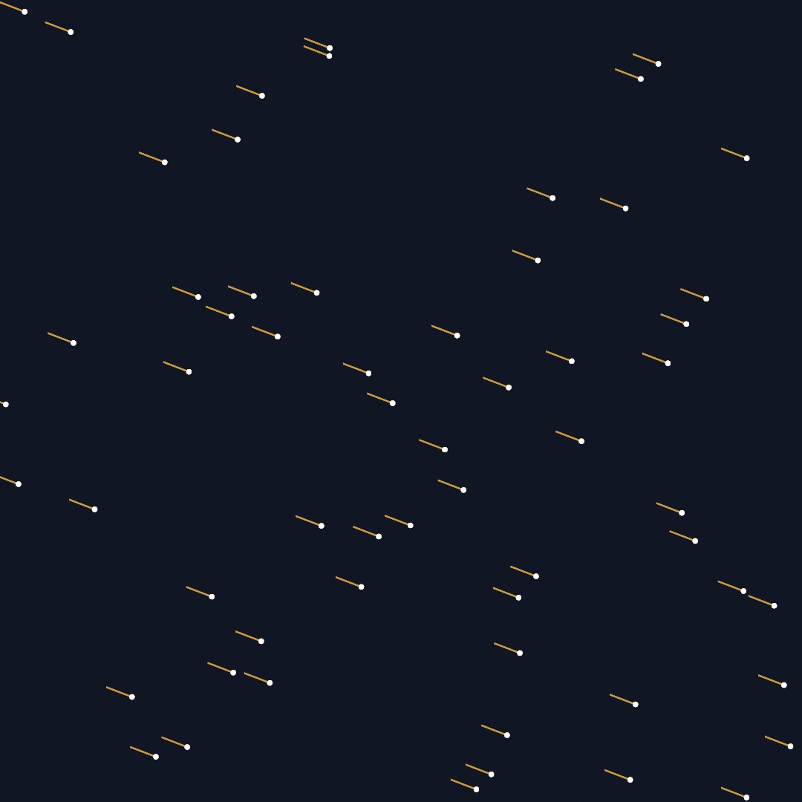

#### <sup>[Ollin](../README.md) → [Guide](README.md) → Appendix A</sup>

---

# A. Just enough Swift

The guide teaches Swift the way it teaches everything else: a short note at the exact moment you first need a construct, and no sooner. Those notes work well in the flow of a chapter, but they're scattered across twenty-two of them. This appendix is the same ground gathered into one continuous pass, for people who'd rather meet the language in order. It covers every piece of Swift the guide leans on, from `let` to `@Param`, with nothing that the guide doesn't actually use.

You don't need to have written Swift before. You do need to have programmed a little in something, because if loops and functions are familiar in any language, this is a translation job rather than a first language.

Two sibling pages cover the same territory at different speeds. The [Swift quick reference](../Docs/Swift.md) is the fast pass, a page to keep open while you work. [Appendix C](C-ComingFromP5.md) is the dictionary for people arriving from p5.js or Processing. Read this appendix before [Chapter 1](01-HelloOllin.md) if you like to meet the language first, or come back to it whenever a chapter's Swift note goes by too quickly.

## One sketch, top to bottom

Here is a complete sketch that uses most of what this appendix covers. Sixty streaks drift across a night sky, and when one leaves the right edge it re-enters on the left.

```swift
import Ollin

final class Meteors: Sketch {
    var meteors: [Vector2] = []

    override func setup() {
        seed(11)
        for _ in 0..<60 {
            meteors.append(Vector2(random(width), random(height)))
        }
    }

    override func draw() {
        background(Color(hex: 0x101623))
        for i in 0..<meteors.count {
            meteors[i] += Vector2(2.3, 0.9)
            if meteors[i].x > width {
                meteors[i] = Vector2(-30, random(height))
            }
            drawMeteor(at: meteors[i])
        }
    }

    func drawMeteor(at p: Vector2) {
        stroke(Color(hex: 0xF2B33D, alpha: 0.7))
        strokeWeight(2)
        drawLine(p.x - 34, p.y - 13, p.x, p.y)
        noStroke()
        fill(.white)
        drawCircle(p.x, p.y, 3.5)
    }
}
```



The listing lives at [`Figures/A-JustEnoughSwift/Meteors.swift`](Figures/A-JustEnoughSwift/Meteors.swift), and you can run it with `swift run OllinLive` pointed at the file and edit along. Read it once now, even if half of it is new. Every construct in it gets a section below: naming values, types, numbers, functions, loops, arrays, the class itself, and the little `?`s and `.`s that decorate the rest of the guide.

## Naming values: `let` and `var`

Swift has two ways to name a value. `let` makes a constant, and reassigning it is a compile error. `var` makes a variable you can reassign.

```swift
let radius = 120.0     // fixed
var angle = 0.0        // will change
angle += 0.05          // fine
radius = 90            // error: radius is a let
```

The habit that serves sketches is to reach for `let` first. Most values in `draw()` are computed fresh every frame from `time`, the mouse, or the frame's own math, and never reassigned within the frame. `var` earns its place on state that changes across frames, like the `meteors` array above. When you type `var` and never reassign, the compiler nudges you back to `let`.

## Types, mostly invisible

Swift is statically typed, so every value has one fixed type, checked before the sketch runs. You rarely write the types out, because the compiler infers them from the values:

```swift
let r = 120.0                    // Double
let name = "Meteors"             // String
let p = Vector2(300, 200)        // Vector2
```

You spell a type yourself in about one situation per sketch, which is when there's nothing yet to infer from. An empty array is the classic case, which is why the sketch above declares `var meteors: [Vector2] = []`. The `[Vector2]` reads as "an array of Vector2".

The strictness has a practical result. A typo'd name or a wrong-type argument is caught the moment you save, not three minutes into a run. Most of the reason a saved Ollin sketch that compiles tends to just behave is the type checker having already read it.

## Two kinds of number

This is the section to read if you only read one. Swift keeps whole numbers (`Int`) and decimals (`Double`) strictly apart, and division behaves differently on each side of the line:

```swift
1 / 2       // 0, because both sides are Int
1.0 / 2.0   // 0.5
```

Integer division throws the remainder away. Ollin's drawing API speaks `Double` throughout (coordinates, radii, seconds), so write literals with a decimal point when they'll flow into drawing: `let spacing = 100.0 / 3.0`, not `100 / 3`.

Swift also refuses to mix the two silently. Counts are `Int` (a loop counter, `meteors.count`) and measures are `Double`, so crossing between them takes an explicit conversion:

```swift
let n = 50                          // Int, a count
let spacing = width / Double(n)     // convert, then divide
let column = Int(mouseX / spacing)  // Int(...) drops the fraction
```

`Int(x)` truncates toward zero, which is often exactly what you want ("which cell is the mouse in"). One more relative shows up at the borders of the framework: `Float`, a smaller decimal that audio and GPU hardware prefer. When a chapter meets one (an `amplitude` from the audio analyzer, say), it converts on arrival, `Double(level)`, and moves on.

## Functions and their labels

A function is declared with `func`. Your sketch's helpers sit right on the class, beside `setup()` and `draw()`:

```swift
func drawMeteor(at p: Vector2) {
    ...
}
```

The distinctive Swift habit is that arguments carry **labels**, and the labels are part of the function's name. `drawMeteor(at:)` is called as `drawMeteor(at: meteors[i])`, and spelling the label wrong, or leaving it off, is an error. Reading call sites aloud is the point: `drawRect(center: p, width: 40, height: 60)` says where the anchor is without a trip to the documentation.

An underscore in the declaration removes a label, which is how APIs offer terse positional forms. Ollin uses both deliberately, since everyone knows what the three bare numbers in `drawCircle(x, y, radius)` mean and labels there would be noise, while the `Vector2` form spells its anchor, `drawCircle(center: p, radius: r)`.

Arguments can also carry **defaults**, and callers mention only what they want to change. That's why calls like `cameraShowcase(radius: 5)` are legal even though the function takes half a dozen parameters, because everything unmentioned keeps its default.

## Choosing and repeating

`if` needs no parentheses around the condition, and the braces are required:

```swift
if meteors[i].x > width {
    meteors[i] = Vector2(-30, random(height))
}
```

The compact one-line choice is the ternary, `condition ? whenTrue : whenFalse`. The chapters use it for small pick-one-of-two moments, like `fill(random() < 0.12 ? accent : ink)`.

Counted loops run over ranges. `0..<n` is "0 up to but not including n", the everyday case, while `0...n` includes `n`:

```swift
for i in 0..<meteors.count { ... }   // i is an Int
for _ in 0..<60 { ... }              // don't need the counter? _ discards it
```

There's no C-style `for (;;)`. When a loop isn't counted but conditional, `while` works the way you expect, though the guide reaches for it rarely.

## Arrays

An array is written `[Element]` and keeps its order. These are the operations a sketch actually uses:

```swift
var trail: [Vector2] = []
trail.append(p)                 // add to the end
trail.count                     // how many
trail[0]                        // index (crashes past the end)
trail.removeFirst()             // trim, e.g. to cap a trail's length
for p in trail { ... }          // iterate the values directly
```

Iterating with `for p in trail` hands you each element, and when you also want its index, `for (i, p) in trail.enumerated()` gives both. Two transformations appear once the closures section below makes sense of the `{ }`: `map` builds a new array by transforming every element, and `filter` keeps the elements that pass a test.

```swift
let xs = trail.map { $0.x }                  // every x coordinate
let low = trail.filter { $0.y > 400 }        // only the low points
```

## Classes and structs, or who copies

A sketch is a class:

```swift
final class Meteors: Sketch {
    var meteors: [Vector2] = []
    ...
}
```

Read the first line this way. `Meteors` is a new class built on `Sketch`, the framework's base class, and `final` means nothing will subclass it in turn (a small clarity and speed win, worth using on your own sketches). Properties declared at the top of the class, like `meteors`, are the sketch's memory, because they persist across frames, which is what separates them from a `let` inside `draw()` that's born and gone within one frame.

**`override`** marks a method that replaces one the base class already defines: `setup()`, `draw()`, `mousePressed()`, and friends. It's checked, which is a quiet gift. Misspell `draw` as `darw` and the compiler says there's nothing to override, instead of silently never calling it. Your own helpers, like `drawMeteor(at:)`, take no `override`.

**`self`** is the current instance, and Swift almost never makes you write it. Inside the class, `meteors` means `self.meteors`.

The deeper split behind the keyword is **who copies**. Swift types come in two kinds:

- **Structs are values.** Assigning one, or passing it to a function, copies it, and the copy and the original then lead separate lives. `Vector2`, `Color`, `Rectangle`, and `Shape` are structs, which is why you can hand a position to a function without worrying it'll be changed behind your back.
- **Classes are references.** Assigning one shares it, so both names point at the same object. Ollin's living, stateful things are classes: the physics `World` and its particles, trackers, your sketch itself. [Chapter 10](10-ForcesAndPhysics.md) leans on this when a `Particle` added to the world and kept in your own array is one object seen from two places.

One consequence trips everyone once: `let` on a class instance means the *reference* can't be reassigned, but the object it points to can still change. `let world = World()` happily accepts `world.gravity = ...` forever. On the struct side the fine print runs the other way, because many Ollin structs are immutable, so instead of assigning into `p.x` you build a changed copy with arithmetic (`p + Vector2(2.3, 0)`) or a helper like `p.with(x: 0)`.

## Closures: functions as values

A closure is an unnamed function written inline, `{ }`. When it's the last argument to a call, Swift lets it trail outside the parentheses, and that syntax is all over Ollin:

```swift
withState {
    translate(width / 2, height / 2)
    rotate(time)
    drawRect(-50, -50, 100, 100)
}   // the transform changes end with the block
```

`withState { }` is an ordinary function call, and the block is the argument. The same shape scopes layers (`layer { }`), fields, and feedback later in the guide. Inside a closure, `$0`, `$1`, … name the arguments when you don't want to name them yourself, which keeps one-liners like `.map { $0.x }` short, and the longhand `.map { p in p.x }` means the same thing.

Closures can see the variables around them, which is why a `layer { }` block can read your sketch's properties without any hand-off ceremony.

## Optionals: maybe a value, maybe nothing

Swift bakes "might be missing" into the type system. A `Color?` is either a `Color` or `nil`, and the compiler won't let you use it as a plain `Color` until you've said what happens when it's missing. You'll meet optionals wherever the world can say no: a file that isn't there, a hex string that doesn't parse, a first element of an empty array.

Here are the four tools, in the order the guide meets them:

```swift
// ?? provides a fallback
let font = OutlineFont(name: "Zapfino") ?? .systemMedium

// if let unwraps for a block
if let image = loadImage("texture.png") {
    drawImage(image, 0, 0)
}

// guard let unwraps or leaves early, keeping the happy path unindented
guard let source else { return }

// ?. calls through only when the value is there
let mesh = loadMesh("model.obj")?.normalized(scale: 3)
```

What this really gives you is best measured by what *doesn't* happen. `nil` can't sneak into a non-optional value, so the "crashed on a missing thing four functions later" class of bug mostly isn't a thing.

## Enums and the leading dot

Where p5 and many C-family APIs use string or integer constants, Swift APIs use enums, which are closed lists of typed cases. You've been reading them all along in calls like `background(.white)`, `strokeCap(.round)`, and `drawArc(..., mode: .pie)`. The leading dot is shorthand, so when Swift already knows the expected type, `.pie` means `ArcMode.pie`, and there's nothing more to it.

Because the list is closed and typed, a misspelled case is a compile error, and Xcode can offer the complete list at the cursor. That's the whole trade against strings, and it's a good one.

## Property wrappers: properties with machinery

A word like `@Param` before a property attaches machinery to it. The property still reads and writes normally, and the wrapper adds behavior around it.

The guide uses three, all from Ollin:

```swift
@Param("Size", 8...80) var size = 38.0                        // an inspector knob
@Eased(duration: 0.9, curve: .easeOutElastic) var x = 540.0   // glides toward what you assign
@Smoothed var level = 0.0                                     // calms a jittery incoming value
```

`@Param` exposes the property as a live control in the host's inspector ([Chapter 1](01-HelloOllin.md)), and later chapters bind MIDI knobs and OSC faders to the same properties, spelled `$size` when a binding wants the parameter itself rather than its current value. `@Eased` and `@Smoothed` ([Chapter 3](03-MotionAndTime.md)) change *when* the value moves, not what it is. You won't write your own wrappers in this guide, and recognizing the `@` is enough.

## Strings, briefly

`\( )` interpolates any value into a string, which covers nearly every string a sketch builds:

```swift
drawText("frame \(frameCount)", 40, 40)
```

Triple quotes make a multiline string, verbatim, line breaks and all. That matters in [Chapter 16](16-YourFirstShader.md), where a fragment shader rides inside your Swift file as one `"""` literal.

## What the guide never needed

Swift is a big language, and a working sketch touches a small, pleasant corner of it. Protocols, generics, enums with payloads, error handling with `throws`, and concurrency with `async` are all real, and all skippable here. The guide gets through twenty-two chapters without asking you to write any of them, and the framework's design keeps them off your side of the API. When you're curious, [*The Swift Programming Language*](https://docs.swift.org/swift-book/) is the canonical book, free and readable.

If a chapter's Swift ever still feels like the obstacle, that's a bug in this guide, not in you, and the same [issue tracker](https://github.com/eaviles/Ollin/issues) that takes confusing math takes confusing Swift.

## Go deeper

- [The Swift quick reference](../Docs/Swift.md): this appendix compressed to one page, for looking things up mid-sketch.
- [Appendix C](C-ComingFromP5.md): the p5.js and Processing dictionary, if that's where you're coming from.
- [Chapter 1, Hello, Ollin](01-HelloOllin.md): the toolchain and first sketch, where the callout versions of these notes begin.
- [`Examples/`](../Examples/README.md): dozens of small complete sketches; reading them is the fastest Swift course there is.

---

[Contents](README.md#contents) · Previous: [Chapter 23, Sharing and performing](23-SharingAndPerforming.md) · Next: [Appendix B, Just enough math, visually](B-JustEnoughMath.md)
