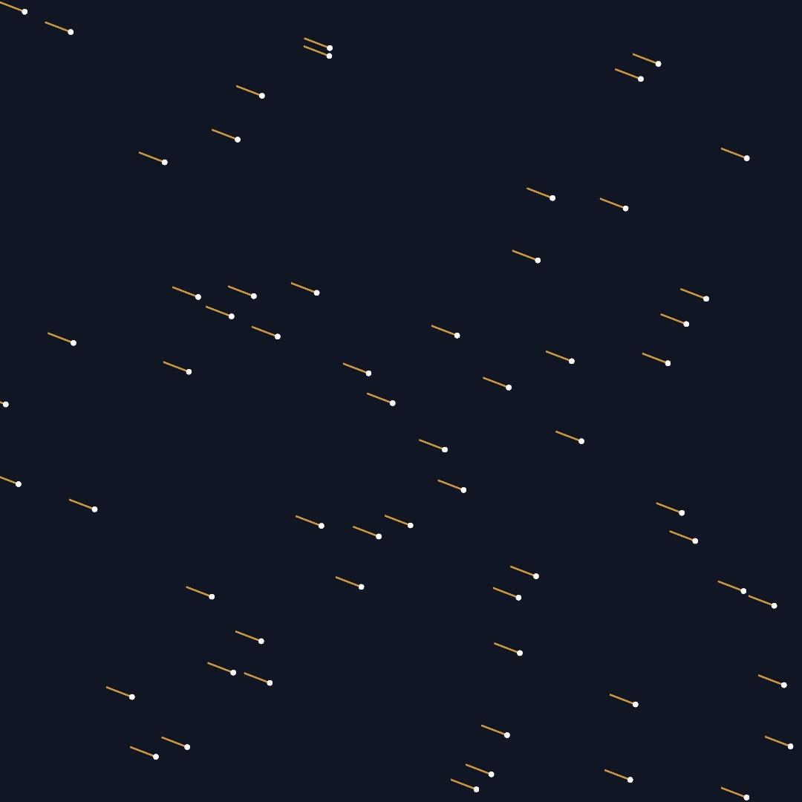

#### <sup>[Ollin](../README.md) → [Guide](README.md) → Appendix A</sup>

---

# A. Just enough Swift

The guide teaches Swift the way it teaches everything else, with a short note at the moment you first need a construct. Those notes are spread through the chapters. This appendix gathers the same ground into one pass, for people who'd rather meet the language in order. The sections from `let` to strings teach the core a sketch uses on almost every page. After them, [Swift you'll see in listings](#swift-youll-see-in-listings) collects most of the rest, each piece with the chapter where it first appears.

You don't need to have written Swift before. You do need to have programmed a little in some language. If you know loops and functions, most of this is new spelling for ideas you already have.

Two sibling pages cover the same territory at different speeds. The [Swift quick reference](../Docs/Swift.md) is the fast pass, a page to keep open while you work. [Appendix C](C-ComingFromP5.md) is the dictionary for people arriving from p5.js or Processing. Read this appendix before [Chapter 1](01-HelloOllin.md) if you like to meet the language first. Or come back to it whenever a chapter's Swift note goes by too quickly.

## One sketch, top to bottom

Here is a complete sketch that uses most of what this appendix covers. Sixty streaks drift across a night sky, and when one leaves the right edge it re-enters on the left.

```swift
import Ollin

final class Meteors: Sketch {
    var meteors: [Vector2] = []

    override func setup() {
        seed(11)
        for _ in 0..<60 {
            meteors.append(Vector2(random(width), random(height)))
        }
    }

    override func draw() {
        background(Color(hex: 0x101623))
        for i in 0..<meteors.count {
            meteors[i] += Vector2(2.3, 0.9)
            if meteors[i].x > width {
                meteors[i] = Vector2(-30, random(height))
            }
            drawMeteor(at: meteors[i])
        }
    }

    func drawMeteor(at p: Vector2) {
        stroke(Color(hex: 0xF2B33D, alpha: 0.7))
        strokeWeight(2)
        drawLine(p.x - 34, p.y - 13, p.x, p.y)
        noStroke()
        fill(.white)
        drawCircle(p.x, p.y, 3.5)
    }
}
```



The listing lives at [`Figures/A-JustEnoughSwift/Meteors.swift`](Figures/A-JustEnoughSwift/Meteors.swift), and you can run it with `swift run OllinLive` pointed at the file and edit along. Read it once now, even if half of it is new. Every construct in it gets a section below, from naming values to the class itself. The sections after those cover closures, optionals, enums, and the `@` in front of a property.

## Naming values: `let` and `var`

Swift has two ways to name a value. `let` makes a constant, and reassigning it is a compile error. `var` makes a variable you can reassign.

```swift
let radius = 120.0     // fixed
var angle = 0.0        // will change
angle += 0.05          // fine
radius = 90            // error: radius is a let
```

The habit that serves sketches is to reach for `let` first. Most values in `draw()` are computed fresh every frame from `time`, the mouse, or the frame's own math, and never reassigned within the frame. `var` is for state that changes across frames, like the `meteors` array above. When you write `var` and never reassign it, the compiler warns you and suggests `let`.

## Types, mostly invisible

Swift is statically typed, so every value has one fixed type, checked before the sketch runs. You rarely write the types out, because the compiler infers them from the values:

```swift
let r = 120.0                    // Double
let name = "Meteors"             // String
let p = Vector2(300, 200)        // Vector2
```

You spell a type yourself in about one situation per sketch, which is when there's nothing yet to infer from. An empty array is the classic case, which is why the sketch above declares `var meteors: [Vector2] = []`. The `[Vector2]` reads as "an array of Vector2".

The strictness has a practical result. A misspelled name or an argument of the wrong type is caught when you save, not three minutes into a run.

## Two kinds of number

This is the section to read if you only read one. Swift keeps whole numbers (`Int`) and decimals (`Double`) strictly apart, and division behaves differently on each side of the line:

```swift
1 / 2       // 0, because both sides are Int
1.0 / 2.0   // 0.5
```

Integer division throws the remainder away. Ollin's drawing calls take `Double` throughout, for coordinates, radii, and seconds. So write a literal with a decimal point when it will reach a drawing call: `let spacing = 100.0 / 3.0`, not `100 / 3`.

Swift also refuses to mix the two silently. Counts are `Int` (a loop counter, `meteors.count`) and measures are `Double`, so crossing between them takes an explicit conversion:

```swift
let n = 50                          // Int, a count
let spacing = width / Double(n)     // convert, then divide
let column = Int(mouseX / spacing)  // Int(...) drops the fraction
```

`Int(x)` drops the fraction, rounding toward zero, which is what you want for "which cell is the mouse in". A third kind of number appears where the framework meets sound and the GPU. `Float` is a smaller decimal that audio and GPU hardware prefer. A chapter that reads one, such as an `amplitude` from the audio analyzer, converts it on arrival with `Double(level)`. Going the other way, `Float(x)` narrows a `Double` for a shader.

## Functions and their labels

A function is declared with `func`. Your sketch's helpers sit right on the class, beside `setup()` and `draw()`:

```swift
func drawMeteor(at p: Vector2) {
    ...
}
```

The distinctive Swift habit is that arguments carry **labels**, and the labels are part of the function's name. `drawMeteor(at:)` is called as `drawMeteor(at: meteors[i])`, and spelling the label wrong, or leaving it off, is an error. The labels let a call read aloud. `drawRect(center: p, width: 40, height: 60)` says where the anchor is without a trip to the documentation.

An underscore in the declaration removes a label, which is how APIs offer short positional forms. Ollin uses both on purpose. Everyone knows what the three bare numbers in `drawCircle(x, y, radius)` mean, so labels there would add nothing. The `Vector2` form names its anchor instead: `drawCircle(center: p, radius: r)`.

Arguments can also carry **defaults**, and callers mention only what they want to change. That's why `cameraShowcase(radius: 5)` is a complete call, though the function takes many more arguments. Everything you leave out keeps its default.

## Choosing and repeating

`if` needs no parentheses around the condition, and the braces are required:

```swift
if meteors[i].x > width {
    meteors[i] = Vector2(-30, random(height))
}
```

The compact one-line choice is the ternary, `condition ? whenTrue : whenFalse`. The chapters use it for small pick-one-of-two moments, like `fill(random() < 0.12 ? accent : ink)`.

Counted loops run over ranges. `0..<n` is "0 up to but not including n", the everyday case, while `0...n` includes `n`:

```swift
for i in 0..<meteors.count { ... }   // i is an Int
for _ in 0..<60 { ... }              // don't need the counter? _ discards it
```

There's no C-style `for (;;)`. When a loop should run until something changes rather than a set number of times, `while` repeats for as long as its condition holds.

## Arrays

An array is written `[Element]` and keeps its order. These are the operations a sketch uses most, and the [lists table](#lists-pairs-and-tables) below has the rest:

```swift
var trail: [Vector2] = []
trail.append(p)                 // add to the end
trail.count                     // how many
trail[0]                        // index (crashes past the end)
trail.removeFirst()             // trim, e.g. to cap a trail's length
for p in trail { ... }          // iterate the values directly
```

Iterating with `for p in trail` hands you each element. When you also want its index, `for (i, p) in trail.enumerated()` gives both. Two more calls read clearly once the closures section below explains the `{ }`. `map` builds a new array by transforming every element, and `filter` keeps the elements that pass a test.

```swift
let xs = trail.map { $0.x }                  // every x coordinate
let low = trail.filter { $0.y > 400 }        // only the low points
```

## Classes and structs, or who copies

A sketch is a class:

```swift
final class Meteors: Sketch {
    var meteors: [Vector2] = []
    ...
}
```

Read the first line this way. `Meteors` is a new class built on `Sketch`, the framework's base class. `final` says no other class will build on this one in turn, which is the usual choice for a sketch. Properties declared at the top of the class, like `meteors`, are the sketch's memory, because they persist across frames. A `let` inside `draw()` is made and thrown away within one frame.

**`override`** marks a method that replaces one the base class already defines: `setup()`, `draw()`, `mousePressed()`, and the other methods Ollin calls. The compiler checks it. Misspell `draw` as `darw` and the compiler says there's nothing to override. Without that check, the misspelled method would never be called, and nothing would say why. Your own helpers, like `drawMeteor(at:)`, take no `override`.

**`self`** is the current instance, and Swift almost never makes you write it. Inside the class, `meteors` means `self.meteors`.

The deeper split behind the keyword is **who copies**. Swift types come in two kinds:

- **Structs are values.** Assigning one, or passing it to a function, copies it, and the copy and the original then change separately. `Vector2`, `Color`, `Rectangle`, and `Shape` are structs. So a function you hand a position to works on its own copy, and yours stays as it was.
- **Classes are references.** Assigning one shares it, so both names point at the same object. The things in Ollin that keep changing state are classes: the physics `World` and its particles, the trackers, and your sketch itself. [Chapter 11](11-ForcesAndPhysics.md) leans on this when a `Particle` added to the world and kept in your own array is one object seen from two places.

`let` on a class instance means the *reference* can't be reassigned, but the object it points to can still change. So `let world = World()` still accepts `world.gravity = …` later. Some Ollin structs work the other way, because their properties are read-only. `Vector2` is one. Instead of assigning into `p.x`, you build a changed copy, with arithmetic (`p + Vector2(2.3, 0)`) or with a helper like `p.with(x: 0)`.

## Closures: functions as values

A closure is an unnamed function written inline, `{ }`. When it's the last argument to a call, Swift lets it trail outside the parentheses, and that syntax is all over Ollin:

```swift
withState {
    translate(width / 2, height / 2)
    rotate(time)
    drawRect(-50, -50, 100, 100)
}   // the transform changes end with the block
```

`withState { }` is an ordinary function call, and the block is the argument. The same shape scopes layers (`layer { }`), fields, and feedback later in the guide. Inside a closure, `$0`, `$1`, … name the arguments when you don't want to name them yourself. That keeps one-liners like `.map { $0.x }` short. The longhand `.map { p in p.x }` means the same thing.

Closures can see the variables around them, which is why a `layer { }` block can read your sketch's properties without passing them in.

## Optionals: maybe a value, maybe nothing

Swift writes "might be missing" into the type itself. A `Color?` is either a `Color` or `nil`. The compiler won't let you use it as a plain `Color` until you've said what happens when it's missing. Optionals appear wherever an answer can be missing, such as a file that isn't there or a hex string that doesn't parse.

Here are the four tools the guide uses most, in the order it meets them:

```swift
// if let unwraps for a block
if let image = try? loadImage("texture.png") {
    drawImage(image, 0, 0)
}

// guard let unwraps or leaves early, keeping the happy path unindented
guard let source else { return }

// ?? provides a fallback
let font = OutlineFont(name: "Zapfino") ?? .systemMedium

// ?. calls through only when the value is there
let mesh = (try? loadMesh("model.obj"))?.normalized(scale: 3)
```

`nil` can't get into a value that isn't optional. So a sketch doesn't crash four functions later on a value that was missing all along.

## Enums and the leading dot

Where p5 and many C-family APIs use string or integer constants, Swift APIs use enums, which are closed lists of typed cases. You've been reading them all along in calls like `strokeCap(.round)` and `drawArc(..., mode: .pie)`. The leading dot is shorthand for a name on the type Swift expects there, so `.pie` means `ArcMode.pie`. The same dot reaches a named value on a struct, which is why `background(.white)` means `Color.white`.

Because the list is closed and typed, a misspelled case is a compile error. An editor that reads Swift, such as Xcode, can also offer the complete list at the cursor.

## Property wrappers: properties with machinery

A word like `@Param` before a property attaches machinery to it. The property still reads and writes normally, and the wrapper adds behavior around it.

The guide uses five, all from Ollin:

```swift
@Param("Size", 8...80) var size = 38.0                        // a parameter in the inspector
@Eased(duration: 0.9, curve: .easeOutElastic) var x = 540.0   // glides toward what you assign
@Sprung(duration: 0.5, bounce: 0.3) var y = 540.0             // springs toward what you assign
@Smoothed var level = 0.0                                     // calms a jittery incoming value
@Saved var visits = 0                                         // kept when the sketch restarts
```

`@Param` shows the property as a live control in the host's inspector, which [Chapter 1](01-HelloOllin.md) sets up. Later chapters bind MIDI knobs and OSC faders to the same properties. A binding spells the property `$size` when it wants the parameter itself rather than its current value. [Chapter 3](03-MotionAndTime.md#values-that-chase-a-target-eased-and-sprung) teaches `@Eased` and `@Sprung`, and [Chapter 38](38-ControlsAndSignals.md#a-value-that-is-not-a-parameter-smoothed) teaches `@Smoothed`. All three change *when* the value moves, not what it is. `@Saved` keeps a value when the sketch starts again. [Chapter 43](43-Performing.md#performing-the-code-itself-live-coding) uses it to carry state across a live-coding edit, and [Chapter 45](45-Installations.md#picking-up-where-it-left-off-checkpoints-and-saved) to carry an installation across a relaunch. You won't write your own wrappers in this guide, and recognizing the `@` is enough.

## Strings, briefly

`\( )` interpolates any value into a string, which covers nearly every string a sketch builds:

```swift
drawText("frame \(frameCount)", 40, 40)
```

Triple quotes make a multiline string, verbatim, line breaks and all. [Chapter 8](08-Words.md) first uses one for a passage of text. From [Chapter 18](18-YourFirstShader.md) on, a shader's Metal source sits inside your Swift file as one `"""` literal.

## Swift you'll see in listings

The sections above cover the Swift a sketch uses on almost every page. As the sketches grow, the chapters reach for more of the language. Most new pieces get a short Swift note or a sentence where they first appear. This section gathers them in one place, grouped by what they do. Each row links to the chapter section where the piece first appears, so you can see it at work.

### Numbers, names, and operators

Beyond `+`, `-`, `*`, and `/`, the listings use a few more operators. The comparisons `==`, `!=`, `<`, `<=`, `>`, and `>=` answer `true` or `false`. Then `!` reverses an answer, `&&` asks for both of two answers, and `||` for either of them.

| In a listing | What it does | First in |
|---|---|---|
| `0x2B2B2B` | A whole number written in base 16, the usual way to write a color. Each pair of digits is one channel, red, green, then blue, from `00` to `FF`. | [Chapter 1](01-HelloOllin.md#your-first-sketch) |
| `i % n` | The remainder after dividing `i` by `n`. It wraps a count around, so `colors[i % colors.count]` never runs off the end of the list. | [Chapter 1](01-HelloOllin.md#putting-it-together-a-breathing-ring) |
| `x += 1`, `x -= 1`, `x *= 2` | Change a variable by an amount. `x += 1` is short for `x = x + 1`. | [Chapter 2](02-Color.md#putting-it-together-a-color-field) |
| `.pi`, `-.pi / 2` | π as a `Double`, and a minus sign in front of a name, which makes the value negative. | [Chapter 2](02-Color.md#gradients-as-paint) |
| `let margin = 70.0, gutter = 7.0` | Two constants in one declaration. `var px = x, py = y` does the same for variables. | [Chapter 2](02-Color.md#putting-it-together-a-color-field) |
| `print(x)` | Writes a value to the terminal the sketch was started from, for checking a number while you work. | [Chapter 2](02-Color.md#will-everybody-see-it) |
| `min(a, b)`, `max(a, b)`, `abs(x)`, `pow(x, n)` | The smaller of two values, the larger, the value without its sign, and `x` to the power `n`. | [Chapter 4](04-Randomness.md#the-random-walk-by-hand) |
| `noStroke(); fill(.white)` | A semicolon lets two statements share a line. | [Chapter 6](06-GridsAndRepetition.md#walking-a-grid-numbers-in-a-spiral) |
| `let body: Body` | A constant declared without a value. Each branch of the `if` after it gives it one, once. | [Chapter 11](11-ForcesAndPhysics.md#putting-it-together-the-wrecking-ball) |
| `x.truncatingRemainder(dividingBy: n)` | The `%` of a `Double`. | [Chapter 16](16-CurvesAndFigures.md#a-corner-a-car-could-take-clothoids) |
| `atan2(y, x)` | The angle of the arrow from the origin to `(x, y)`, between `-.pi` and `.pi`. It is how a vector's `angle` is worked out. | [Chapter 17](17-MarksAndMedia.md#painting-as-it-happens-stroke-dynamics) |
| `i.isMultiple(of: 2)` | Whether `i` divides evenly by 2, the same test as `i % 2 == 0`. | [Chapter 17](17-MarksAndMedia.md#ink-on-water-marbling) |
| `60_000` | Underscores group the digits of a long number, and Swift ignores them. | [Chapter 22](22-IteratedForms.md#the-same-fern-played-as-a-game-the-chaos-game) |
| `SIMD4<Float>(…)` | Four `Float` values packed together, the shape a GPU reads them in. | [Chapter 25](25-ParticleSimulations.md#a-million-grains-gpu-particles) |
| `x.squareRoot()`, `x.rounded()` | The square root of `x`, and the nearest whole number, still a `Double`. | [Chapter 28](28-MaterialsAndSurroundings.md#putting-it-together-the-bench) |
| `x &* y`, `x ^ y`, `x >> 29`, `1 << 23` | Arithmetic on the bits of a whole number, used to scramble a counter into noise. `&*` multiplies and lets a result that is too large wrap around, where `*` would stop the program. `^` mixes the bits of two numbers, and `>>` and `<<` slide the bits right or left by that many places. | The `StageMic` class that [Chapter 37](37-Listening.md#a-band-that-plays-the-same-every-run-stagemic) has you copy |
| `((step % steps) + steps) % steps` | A remainder that stays between 0 and `steps - 1`. Swift's `%` keeps the sign of the number on its left, so a negative `step` needs the extra `+ steps`. | [Chapter 40](40-MusicByRule.md#putting-it-together-the-music-box) |

### Loops and choices

The section on choosing and repeating covers `if`, the ternary, counted `for` loops, and `while`. The listings add these.

| In a listing | What it does | First in |
|---|---|---|
| `for (a, b) in zip(xs, ys)` | `zip` pairs two lists up, first with first, and the loop takes each pair apart into two names. | [Chapter 7](07-Tiles.md#one-coin-per-line-hitomezashi) |
| `for i in positions.indices` | Every valid index of a list, the same as `0..<positions.count`. | [Chapter 10](10-Vectors.md#steering-the-chase) |
| `continue` | Skips the rest of this pass through the loop and goes on to the next element. | [Chapter 11](11-ForcesAndPhysics.md#breaking-things) |
| `for body in grabbable where …` | A loop that skips every element the test after `where` rejects. | [Chapter 11](11-ForcesAndPhysics.md#putting-it-together-the-wrecking-ball) |
| `guard depth > 0 else { return }` | Leaves early unless the condition holds, with `return` in a function or `continue` in a loop. `guard let` is the same move for an optional. | [Chapter 13](13-GrowingThings.md#a-tree-from-one-rule-recursion) |
| A function that calls itself | Recursion. `branch` draws a line, then calls `branch` again with a shorter length, until its `guard` stops it. | [Chapter 13](13-GrowingThings.md#a-tree-from-one-rule-recursion) |
| `stride(from: 0.3, through: 0.75, by: 0.045)` | Counts from one number to another in steps of any size. `through:` includes the last value, and `to:` stops before it. | [Chapter 14](14-FieldsAndFlow.md#where-the-field-equals-something-contours) |
| `switch index { case 0: … default: … }` | Picks one branch by a value. Each `case` names a value, and `default` catches every other. | [Chapter 22](22-IteratedForms.md#putting-it-together-a-plate-of-four-orbits) |
| `while true { … }` | Repeats until something inside leaves the loop, with a `return` or a `break`. | [Chapter 28](28-MaterialsAndSurroundings.md#putting-it-together-the-bench) |
| `case .box(let w, let h, let d):` | A `Collider3D` is an enum whose cases carry values, such as a box's three sizes. This case matches a box and names its sizes `w`, `h`, and `d`. | [Chapter 30](30-WorldsWithWeight.md#putting-it-together-the-contraption) |
| `break` | Leaves a loop or a `switch` at once. | [Chapter 30](30-WorldsWithWeight.md#putting-it-together-the-contraption) |
| `if case .box(let w, let h, let d) = body.collider` | The same match for a single case, written as an `if`. | [Chapter 31](31-CharactersAndCloth.md#putting-it-together-the-yard) |

### Lists, pairs, and tables

Arrays hold most of a sketch's data. The chapters use a few more of their calls, and three other ways to hold several values: tuples, dictionaries, and sets.

| In a listing | What it does | First in |
|---|---|---|
| `[blank] + line + elbow` | `+` joins lists end to end. | [Chapter 7](07-Tiles.md#every-neighbor-must-agree-wave-function-collapse) |
| `.map(\.corners)` | A key path, the short way to write `.map { $0.corners }`. | [Chapter 7](07-Tiles.md#tiles-that-never-repeat-aperiodic-tilings) |
| `isEmpty`, `first`, `last`, `min()`, `max()` | Whether a list is empty, then its first, last, smallest, and largest element. All but `isEmpty` answer an optional, because an empty list has none of them. | [Chapter 9](09-Pictures.md#putting-it-together-a-picture-painted-with-type) |
| `Array(message)`, `String(ch)` | A string taken apart into a list of its characters, and one character made back into a string. | [Chapter 9](09-Pictures.md#putting-it-together-a-picture-painted-with-type) |
| `(picture, mouse)` | A tuple, two values carried together as one. A loop can take a pair apart, as in `for (a, b) in bolt.segments`. | [Chapter 9](09-Pictures.md#a-picture-you-drop-on-the-window) |
| `[[Vector2]]` | A list of lists, such as one trail of points for each creature. | [Chapter 10](10-Vectors.md#steering-the-chase) |
| `removeLast(n)`, `removeAll()`, `reversed()`, `prefix(n)` | Drop the last `n` elements, empty the list, read it backward, and read its first `n` elements. | [Chapter 10](10-Vectors.md#putting-it-together-the-swarm) |
| `bricks.remove(at: i)` | Takes the element at index `i` out of the list and hands it back. | [Chapter 11](11-ForcesAndPhysics.md#putting-it-together-the-wrecking-ball) |
| `(0..<40).map { … }` | Runs the closure once for each number in the range and collects the answers into a list. | [Chapter 11](11-ForcesAndPhysics.md#breaking-things) |
| `reduce(0) { $0 + $1 }` | Combines a list into one value, here a sum. `$1` names the closure's second argument. | [Chapter 15](15-ShapesAsMaterial.md#the-circle-they-were-scattered-around-fitminimize) |
| `append(contentsOf: other)` | Adds every element of another list to the end. | [Chapter 15](15-ShapesAsMaterial.md#putting-it-together-the-plate) |
| `flatMap { $0.contours }` | Maps each element to a list, then joins those lists into one. | [Chapter 17](17-MarksAndMedia.md#putting-it-together-the-monogram) |
| `reserveCapacity(n)` | Sets room aside for `n` elements before a loop fills the list, so it never has to grow. | [Chapter 22](22-IteratedForms.md#putting-it-together-a-plate-of-four-orbits) |
| `[Character: WireworldCell]` | A dictionary, a table from keys to values. `legend[ch]` looks a key up and answers an optional, since the key might be missing. | [Chapter 24](24-Automata.md#a-circuit-made-of-cells-wireworld) |
| `[UInt8](repeating: 0, count: n)` | A list of `n` copies of one value. `UInt8` is a whole number from 0 to 255, one byte. | [Chapter 28](28-MaterialsAndSurroundings.md#putting-it-together-the-bench) |
| `(x: Double, z: Double)` | A tuple whose parts have names, read as `.x` and `.z`. | [Chapter 29](29-Landscapes.md#putting-it-together-the-valley) |
| `text.lowercased()`, `text.contains("red")` | A copy of a string in lowercase, and whether a string holds a piece of text. | [Chapter 37](37-Listening.md#words-as-they-are-spoken-speechlistener) |
| `strokes[id, default: []]` | Reads the value for a key, or the default when the key is new, so the answer can be changed at once. | [Chapter 38](38-ControlsAndSignals.md#a-table-you-put-things-on-tuio) |
| `Set(ids)` | A collection with no order and no repeats. Asking whether it holds a value is quick. | [Chapter 38](38-ControlsAndSignals.md#a-table-you-put-things-on-tuio) |
| `[(drum, "C3")] as [(Shape, Pitch)]` | `as` gives Swift the type of a literal it cannot work out alone, here that `"C3"` is a `Pitch`. | [Chapter 39](39-MakingSound.md#putting-it-together-the-workbench) |
| `samples[a ..< b]` | A slice, the elements from index `a` up to `b`, read in place without a copy. | [Chapter 39](39-MakingSound.md#putting-it-together-the-workbench) |

### More about optionals

The section on optionals shows the four tools the guide uses most. These are the rest.

| In a listing | What it does | First in |
|---|---|---|
| `Color(hex: "#ff0066")!` | A force unwrap. The `!` says the value is there. If it is `nil`, the sketch stops with an error. | [Chapter 2](02-Color.md#naming-a-color) |
| `OutlineFont(name: "Avenir Next")` | An initializer, the call named after a type that makes a new value of it. One that can fail answers an optional. Later, `if let modes = StruckShape(outline)` uses one only when it worked. | [Chapter 8](08-Words.md#three-kinds-of-letters-outline-bitmap-and-stroke-fonts) |
| `if let photo { … }` | Short for `if let photo = photo`, when the unwrapped value keeps its name. `guard let source else { return }` is the same for `guard`. | [Chapter 9](09-Pictures.md#a-picture-on-the-canvas-loadimage-and-drawimage) |
| `guard let lowest = …, let highest = … else { return }` | Unwraps several optionals at once. The code after it runs only if every one has a value. | [Chapter 9](09-Pictures.md#from-numbers-to-marks) |
| `body.userData as? Look` | Asks whether a value is of a more specific type. The answer is the value as that type, or `nil`. | [Chapter 11](11-ForcesAndPhysics.md#breaking-things) |
| `if let ball, ball.velocity.length > 900` | Unwraps and tests in one `if`, the two parts joined by a comma. | [Chapter 11](11-ForcesAndPhysics.md#putting-it-together-the-wrecking-ball) |
| `held = nil`, `flock == nil` | Empties an optional, and asks whether it is empty. | [Chapter 11](11-ForcesAndPhysics.md#putting-it-together-the-wrecking-ball) |
| `var flock: Boids!` | A property that starts empty and is filled in `setup()`. It is read afterward without unwrapping, on the promise that it was filled. | [Chapter 12](12-FlocksAndSwarms.md#the-flock-assembled-boids) |
| `(index: Int, distance: Double)?` | An optional tuple, a named pair or nothing. | [Chapter 36](36-ThePhoneAsASensor.md#pointing-at-it-with-the-phone-the-wand) |
| `timecode.map { "\($0)" }` | On an optional, `map` changes the value when there is one and stays `nil` when there isn't. | [Chapter 43](43-Performing.md#following-another-timeline-timecode) |

### Functions and closures

| In a listing | What it does | First in |
|---|---|---|
| `using: &randomness` | `&` hands a function a variable it may change, rather than a copy. | [Chapter 4](04-Randomness.md#seeds-randomness-you-can-keep) |
| `Int.random(in: 1 ... 6)`, `Vector2.zero` | A function or a value that belongs to the type itself, reached through the type's name. | [Chapter 4](04-Randomness.md#seeds-randomness-you-can-keep) |
| `points(where: { $0 % 7 == 0 })` | A closure passed inside the parentheses with its label, rather than trailing after them. | [Chapter 6](06-GridsAndRepetition.md#walking-a-grid-numbers-in-a-spiral) |
| `{ index, cell in … }` | A closure that names its arguments before `in`. `{ _ in … }` ignores its argument. | [Chapter 7](07-Tiles.md#every-neighbor-must-agree-wave-function-collapse) |
| `whole: Bool = false` | A default value for an argument of your own, which callers may leave out. | [Chapter 11](11-ForcesAndPhysics.md#breaking-things) |
| `crowd.preferredVelocity = { walker in … }` | A closure kept in a property, for the framework to call later. | [Chapter 12](12-FlocksAndSwarms.md#a-crowd-that-makes-room-crowd) |
| `{ i -> Vector2 in … }` | A closure that says what type it returns, for when Swift cannot work it out alone. | [Chapter 15](15-ShapesAsMaterial.md#putting-it-together-the-plate) |
| `func handwrite(_ path: Contour) -> StrokeMark` | A function that returns a value. The type after `->` is what comes back, and `return` hands it over. A body that is one expression returns it without the word. | [Chapter 17](17-MarksAndMedia.md#putting-it-together-the-monogram) |
| `func midpoint<V: Vector>(_ a: V, _ b: V) -> V` | A generic function. `V` stands for any type that is a `Vector`, so one function serves `Vector2` and `Vector3`. | [Chapter 26](26-3DGently.md#where-things-are-in-the-world-vector3-and-world-units) |
| `height: (Double, Double) -> Double` | An argument that is itself a function, here one that turns two numbers into one. The caller passes a closure. | [Chapter 28](28-MaterialsAndSurroundings.md#putting-it-together-the-bench) |
| `self.bareness(u, v)` | Inside a closure, `self.` names the sketch's own method. Some closures require it, and a listing may write it anyway to show whose method it is. | [Chapter 28](28-MaterialsAndSurroundings.md#putting-it-together-the-bench) |
| `func draw(_ collider: Collider3D, tint: Color?)` | Two functions can share a name when their labels or argument types differ, as this one does with the sketch's `draw()`. | [Chapter 30](30-WorldsWithWeight.md#putting-it-together-the-contraption) |
| `scan.mesh { surface in switch surface { … } }` | A closure that picks its answer with a `switch`, one `return` for each case. | [Chapter 36](36-ThePhoneAsASensor.md#a-surface-the-phone-already-built-the-room-mesh) |

### Types of your own

| In a listing | What it does | First in |
|---|---|---|
| `var canvasSize: CanvasSize { .square(1080) }` | A computed property. Its code runs each time the property is read. | [Chapter 1](01-HelloOllin.md#the-canvas-is-not-the-window) |
| `final class Look { … }` | A class of your own, declared inside the sketch so it stays with the code that uses it. Its `init` fills in its properties. | [Chapter 11](11-ForcesAndPhysics.md#breaking-things) |
| `struct Shard { … }` | A struct of your own. It gets an initializer for free, `Shard(body:shape:color:)`, with its properties as the labels. | [Chapter 11](11-ForcesAndPhysics.md#putting-it-together-the-wrecking-ball) |
| `private var tree` | A property that only this class can see. | [Chapter 13](13-GrowingThings.md#putting-it-together-a-garden) |
| `.init(frequency: 3)` | Short for the initializer of the type Swift expects there. | [Chapter 16](16-CurvesAndFigures.md#curves-you-can-write-down-the-classic-curves) |
| `lazy var sand = Particles(…)` | A property built the first time it is read, so it can use the sketch's other properties. | [Chapter 25](25-ParticleSimulations.md#a-million-grains-gpu-particles) |
| `var paint = Material.glitter` | Copies a preset into a variable, so you can change the copy and leave the preset alone. | [Chapter 26](26-3DGently.md#materials) |
| `hit.body === crate` | Asks whether two names point at the same object. `!==` asks whether they don't. | [Chapter 30](30-WorldsWithWeight.md#what-is-in-the-way-rays-sweeps-and-overlaps) |
| `enum Style: String, CaseIterable, ParamOption { … }` | A type of your own with a fixed set of cases. The names after the colon give it abilities, such as listing its cases. | [Chapter 38](38-ControlsAndSignals.md#the-sketch-that-says-what-it-takes-oscquery) |
| `MarkovChain<Int>` | A generic type. The type in angle brackets fills in what it holds, here whole numbers. | [Chapter 40](40-MusicByRule.md#putting-it-together-the-music-box) |
| `final class MyOverlay: SketchExtension` | A protocol, a list of methods a type promises to have. `SketchExtension` gives each one a default that does nothing, so a class writes only the ones it needs. | [Chapter 44](44-HandingItOver.md#adding-behavior-from-outside-draw-sketchextension) |
| `extension Sketch { public func drawSpiral(…) }` | Adds methods to a type from outside its declaration. `public` lets code in other packages call them. | [Chapter 44](44-HandingItOver.md#giving-it-to-somebody-else-an-extension-package) |
| `Codable` | Marks a type that can be written to a file and read back, which is what lets `@Saved` keep it. | [Chapter 45](45-Installations.md#picking-up-where-it-left-off-checkpoints-and-saved) |

### Failures, files, and waiting

A call that can fail is marked `throws` where it is declared, and every call to it is written with `try`. The listings write `try` in a few forms, and use a few names from Apple's own libraries.

| In a listing | What it does | First in |
|---|---|---|
| `try? loadImage(path)` | Calls something that can fail, and turns a failure into `nil`. | [Chapter 2](02-Color.md#palettes-from-a-file) |
| `try! loadPalettes("1000.json")` | Calls something that can fail, and stops the sketch with an error if it does. The listings use it for a file that comes with the sketch. | [Chapter 2](02-Color.md#palettes-from-a-file) |
| `in: .module` | The folder the sketch's own files are read from. | [Chapter 9](09-Pictures.md#a-picture-on-the-canvas-loadimage-and-drawimage) |
| `import Foundation` | Apple's base library. It brings `URL`, the address of a file, and `FileManager`, which asks the disk whether a file exists. | [Chapter 28](28-MaterialsAndSurroundings.md#putting-it-together-the-bench) |
| `do { try … } catch { … }` | Runs calls that can fail. A failure jumps to `catch`, where `error` says what went wrong. | [Chapter 30](30-WorldsWithWeight.md#a-world-saved-as-it-stands-snapshot-and-restore) |
| `try? waitFor { try await … }` | `await` marks a call that finishes later. `waitFor` waits for it and hands back the answer. | [Chapter 34](34-Seeing.md#the-body-as-a-controller-hands-faces-and-bodies) |
| `import simd` | Apple's library of small vectors and matrices, the kind the GPU works in. | [Chapter 35](35-Depth.md#putting-it-together-the-ghost-room) |
| `Date()` | The date and time right now. | [Chapter 38](38-ControlsAndSignals.md#the-weather-outside-weather) |

### Comments and attributes

| In a listing | What it does | First in |
|---|---|---|
| `/// …` | A comment that documents the declaration below it. Editors show it beside the name. | [Chapter 11](11-ForcesAndPhysics.md#breaking-things) |
| `// MARK: …` | A comment that names a part of the file, for the editor's list of what the file holds. | [Chapter 28](28-MaterialsAndSurroundings.md#putting-it-together-the-bench) |
| `@objc(RippleSaverView)` | Fixes the name the system uses to find the class. | [Chapter 44](44-HandingItOver.md#living-in-the-system-a-screen-saver) |
| `@main` | Marks the place where a program starts. | [Chapter 44](44-HandingItOver.md#living-in-the-system-a-screen-saver) |

## What the guide never needed

Swift is a big language, and a working sketch uses a small part of it. The guide never asks you to declare a protocol or an enum whose cases carry values. It doesn't ask you to write a property wrapper or an `async` function of your own either. When you want the rest, [*The Swift Programming Language*](https://docs.swift.org/swift-book/) is Apple's book on the language, free to read online.

If a chapter's Swift still stops you, that's a bug in this guide, not in you. The same [issue tracker](https://github.com/eaviles/Ollin/issues) that takes confusing math takes confusing Swift.

## Go deeper

- [The Swift quick reference](../Docs/Swift.md): this appendix compressed to one page, for looking things up mid-sketch.
- [Appendix C](C-ComingFromP5.md): the p5.js and Processing dictionary, if that's where you're coming from.
- [Chapter 1, Hello, Ollin](01-HelloOllin.md): the toolchain and first sketch, where the callout versions of these notes begin.
- [`Examples/`](../Examples/README.md): hundreds of small complete sketches, each a Swift file you can read, run, and change.

---

[Contents](README.md#contents) · Previous: [Chapter 45, Installations](45-Installations.md) · Next: [Appendix B, Just enough math, visually](B-JustEnoughMath.md)
