#### [Ollin](../README.md) → [Guide](README.md) → Appendix B

---

# B. Just enough math, visually

Every math idea in the guide, re-explained on one page each: a picture, the intuition in plain words, and a pointer to the chapter that puts it to work. This is the safety net behind the guide's first promise: if a page anywhere loses you, the missing piece is here.

The entries are grouped by theme rather than by chapter, so related ideas sit together. Read it straight through if you like (it's a decent tour of the field's math on its own), but it's built for dipping: come with one confusion, leave with one picture.

**Contents:** [Where things are](#where-things-are) · [Angles and circles](#angles-and-circles) · [Fractions, mapping, and wrapping](#fractions-mapping-and-wrapping) · [Shaping a value](#shaping-a-value) · [Randomness](#randomness) · [Noise](#noise) · [Moving the paper](#moving-the-paper) · [Vectors, motion, and forces](#vectors-motion-and-forces) · [Fields and following them](#fields-and-following-them) · [Local rules, global structure](#local-rules-global-structure) · [Shapes as regions](#shapes-as-regions) · [Color and light as numbers](#color-and-light-as-numbers) · [Per-pixel thinking and distance](#per-pixel-thinking-and-distance) · [Into three dimensions](#into-three-dimensions) · [Sound as numbers](#sound-as-numbers)

## Where things are

### The canvas: x right, y down

Every position on the canvas is two numbers, counted in pixels from the top-left corner: x grows to the right, y grows *downward*. That last part is the one to internalize, because it's upside down from school graphs: to move something toward the bottom of the screen, you *add* to y. The convention comes from how screens have been addressed since text terminals, and [Chapter 1](01-HelloOllin.md) starts here.

### Normalized coordinates: 0…1 anywhere

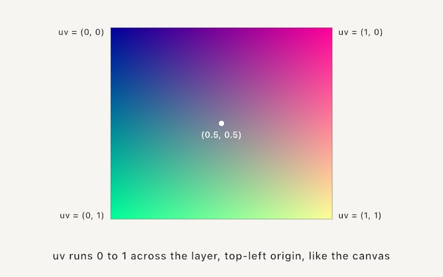

Instead of pixels, an address can be a *fraction* of the whole: 0 at one edge, 1 at the other, so (0.5, 0.5) is the center of anything, at any resolution. Shaders live entirely in these `uv` coordinates ([Chapter 15](15-YourFirstShader.md)), and subtracting 0.5 re-centers them so distances measure from the middle. The same trick names positions inside a camera image regardless of its size ([Chapter 21](21-Seeing.md)).

### Putting a normalized point onto the canvas

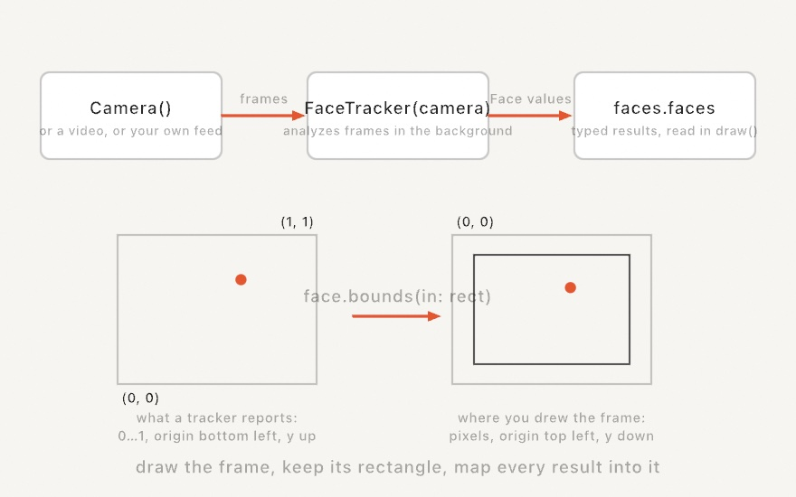

A fraction-of-the-image point becomes a canvas point by scaling it into the rectangle you drew the image in. There's one wrinkle: vision results count y *up* from the bottom-left, the canvas counts y *down* from the top-left, so the y fraction flips on the way (`1 - y`). [Chapter 21](21-Seeing.md) wraps the flip-and-scale into one call, but this is all that call does.

### The 3D world frame

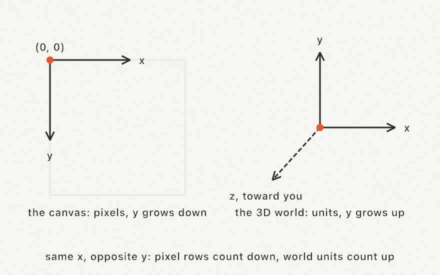

The 3D world uses its own frame: the origin sits wherever you like, x still grows right, y grows *up*, and z comes toward you. Positions are in world units rather than pixels (a sphere of radius 1 is "one unit", and the camera's distance decides how big it looks). The canvas's y-down is the odd one out, a 2D screen habit; 3D follows the mathematician's y-up. [Chapter 17](17-3DGently.md) makes the switch, and depth data in meters lands in the same kind of frame in [Chapter 19](19-DepthAndThePhone.md).

## Angles and circles

### Radians and tau

Angles here are radians, and the friendly way in is `.tau`, the angle of one full turn (about 6.283, twice pi). Fractions of tau read as fractions of a turn: `.tau / 4` is a quarter turn, `.tau / 12` a clock hour. Because the canvas's y points down, angles sweep *clockwise* on screen, starting from 3 o'clock. Thinking in turns spares you both degrees and memorized decimals; [Chapter 1](01-HelloOllin.md) adopts it immediately.

### An angle and a radius make a point

To stand on a circle's rim, you need how far around (an angle) and how far out (a radius). `cos(angle) * radius` gives the across part, `sin(angle) * radius` the down part, and adding them to the center lands the point. This one pattern places petals, clock hands, orbiting moons, and everything else arranged in a ring; it first appears in [Chapter 1](01-HelloOllin.md) and never really leaves.

### Sine: a smooth swing

`sin` is the height of a point walking around a circle, which is why it swings smoothly between -1 and 1 forever. Its **period** is how long one lap takes: write `sin(time * .tau / period)` and each `period` seconds completes one cycle. Its **amplitude** is the swing's size, just the circle's radius, set by whatever you multiply the result by. [Chapter 3](03-MotionAndTime.md) builds most of its motion from these two dials, with `cos` as the same walk read as "across" instead of "up".

### Phase: a head start

Adding a constant inside `sin(...)` starts the swing partway through its cycle: a head start, called phase. Give each element a *different* head start, usually derived from its position (`sin(time + x * 0.02)`), and identical motions turn into a traveling wave across space. It's the cheapest large effect in [Chapter 3](03-MotionAndTime.md).

### n copies close the circle

Rotational symmetry is repetition around a point: draw one arm, rotate by `.tau / n`, draw again, n times. Because n equal steps of `tau / n` add up to exactly one full turn, the last copy lands flush against the first with no seam. [Chapter 6](06-GridsAndRepetition.md) builds rosettes and mandalas this way from a single drawing.

## Fractions, mapping, and wrapping

### t, the fraction along: lerp and map

A value between 0 and 1 can mean "how far along": 0 at the start, 1 at the end, 0.25 a quarter of the way. `lerp(a, b, t)` walks from `a` to `b` by that fraction, and `map(v, inLo, inHi, outLo, outHi)` carries a value from one range to another by *keeping* its fraction along: 75% into the input range comes out 75% into the output range. The same idea squeezes sine's -1…1 into 0…1 (`sin(x) * 0.5 + 0.5`). [Chapter 2](02-Color.md) mixes colors by `t`; [Chapter 3](03-MotionAndTime.md) makes both calls everyday tools.

### Wrapping: remainder, fract, and pingPong

A clock that only grows becomes a cycle by wrapping: the `%` remainder wraps whole numbers (`i % 4` cycles 0, 1, 2, 3), and `fract` keeps just the fraction of a decimal, wrapping it into 0…1. `loopProgress(over: 3)` is that wrap applied to the sketch clock, "how far through the current 3-second lap", and `pingPong` folds each lap so the trip goes out and back instead of snapping home. [Chapter 1](01-HelloOllin.md) meets `%`; [Chapter 3](03-MotionAndTime.md) supplies the two helpers.

### The perfect loop

An animation loops invisibly when every time-driven term completes *whole* cycles in the loop length: a 4-second loop can hold sine waves with periods of 4, 2, or 1 second, but a period of 3 will pop at the seam. The same thinking loops randomness: `noise(x, loop: t)` tours a closed circle through the noise field, so one lap ends exactly where it began ([Chapter 5](05-Noise.md)). [Chapter 3](03-MotionAndTime.md) states the rule; exported GIFs live and die by it.

### Sampling one grid with another

To read an image at any grid's resolution, use fractions as the go-between: a cell 30% across and 60% down the grid reads the pixel 30% across and 60% down the image. Nothing needs to match in size; the fractions do the translation. This is how [Chapter 7](07-WordsAndPictures.md) rebuilds a photo as a mosaic of letters, and it's the same idea as normalized coordinates wearing work clothes.

## Shaping a value

### Reading a shaping curve

A shaping function takes a 0…1 value and hands back a reshaped 0…1 value; its graph shows input along the bottom and output up the side, with the straight diagonal meaning "unchanged". Where the curve is steep, the value moves fast; where it's flat, the value lingers, which is why the dot strips under each curve bunch and spread. `step` is an if in curve form (0 then 1 at an edge), and `smoothstep` is the gentle S between two edges (`t * t * (3 - 2 * t)` inside). Squaring a 0…1 value is a shaping curve too: it pushes the middle down and keeps the ends, which is [Chapter 7](07-WordsAndPictures.md)'s one-line contrast boost. The whole toolkit lives in [Chapter 3](03-MotionAndTime.md).

### Exponential decay

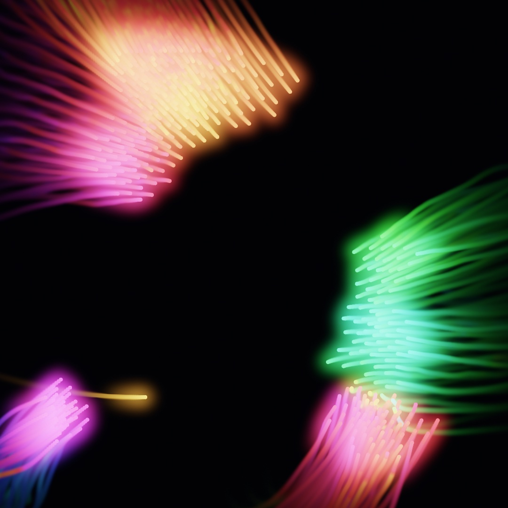

Multiply a value by a little less than 1 every frame (keep 93%, say) and it melts away smoothly, fast at first, ever slower, never quite reaching zero. That's exponential decay, and it's the shape of every fading trail: the newest mark is full strength, each older one has been multiplied down one more time. [Chapter 14](14-LayersAndEffects.md) uses it as the feedback fade behind these comet tails.

## Randomness

### Pseudo-random: a scramble you can replay

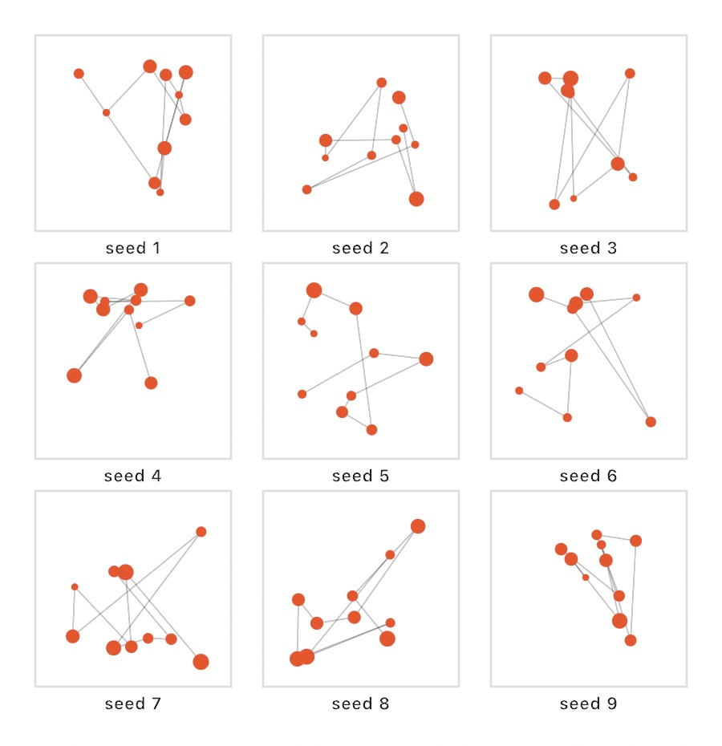

`random()` isn't dice; it's a deterministic scramble that plays out the same sequence from a chosen starting point, the **seed**. Same seed, same "random" piece, every run, which is what makes generative work reproducible: a seed is a piece's serial number. Change the seed and you get a sibling, not a variation. [Chapter 4](04-Randomness.md) builds the whole workflow on this.

### Probability as a threshold

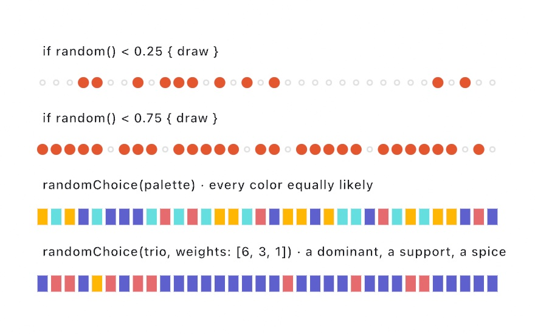

`random() < 0.25` is true a quarter of the time: a uniform 0…1 roll passes a threshold exactly as often as the threshold is high. Stack several thresholds and you've built a weighted choice, common outcomes owning wide slices of the 0…1 line and rare ones thin slivers. [Chapter 4](04-Randomness.md) turns this into scattered accents and weighted palettes.

### Uniform vs Gaussian

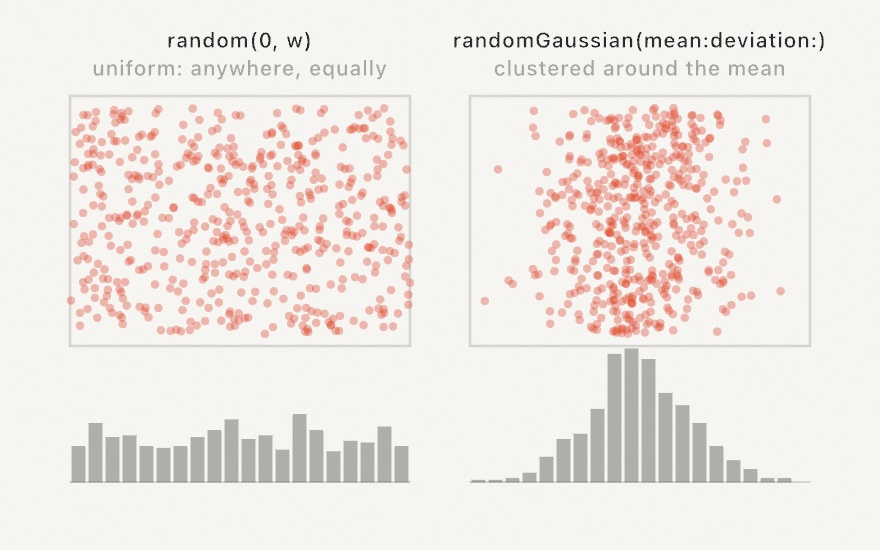

`random(a, b)` spreads values evenly, every part of the range equally likely: a flat histogram. `randomGaussian()` piles them around a center in a bell: the **mean** is where the pile sits, the **deviation** is how wide it spreads, and about two thirds of values land within one deviation of the mean. Uniform reads as "scattered", Gaussian as "clustered, with strays", and [Chapter 4](04-Randomness.md) shows when each texture is the right one.

### Chance is lumpy

Independent random placements clump and leave holes; they do not space themselves out, because each roll ignores every other. The clumps aren't a bug in the generator, they're what independence looks like. When you want "random but even", you need an algorithm that pushes points apart, like the blue-noise scatter on the right. [Chapter 4](04-Randomness.md) names the lump problem; [Chapter 13](13-ShapesAsMaterial.md) fixes it.

### The random walk

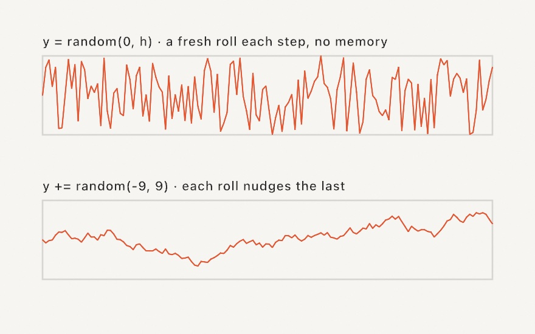

Re-roll a position every frame and you get noise with no memory: a jagged hash. *Accumulate* small random nudges instead (`x += random(-2, 2)`) and a path appears, because each position remembers all the nudges before it. That one change, re-rolling versus accumulating, separates static from wandering, and it's the first living thing [Chapter 4](04-Randomness.md) makes.

## Noise

### Coherence: a fixed, smooth landscape

`noise(x)` is not a roll; it's a *lookup* into a fixed, smooth landscape of values. Nearby inputs land on nearby outputs, so a sequence of close questions traces a rolling curve instead of a hash. That property, coherence, is the entire difference between noise and random, and everything [Chapter 5](05-Noise.md) builds rests on it.

### The input multiplier is a zoom knob

`noise(x * scale)` doesn't change the landscape, it changes how far apart your questions land on it. A small multiplier asks about points close together and sees one broad feature; a large one strides across many hills and sees busy detail. When noise output looks wrong, the first dial to reach for is almost always this one. [Chapter 5](05-Noise.md) calls it the zoom knob.

### A field of answers, drifting in time

Give noise two inputs and it answers everywhere on a plane: a **field**, one value per position, which you can render as brightness, dot size, or anything else. A third input works as time, sliding the whole landscape smoothly so the field churns without jumping. And because far-apart regions of the landscape don't resemble each other, offsetting your questions (`noise(t + 1000)` vs `noise(t)`) yields independent signals from one field. All of [Chapter 5](05-Noise.md) is variations on this.

### Layering scales

Natural forms have big shapes *and* fine texture, so take noise at both scales and add them, weighted: mostly the broad curve, a little of the busy one, weights summing to 1 so the result stays in range. Stack a few layers like that (each smaller and fainter) and you get the fractal texture `fbm` packages up. [Chapter 5](05-Noise.md) builds it by hand first, so the packaged call has no mystery in it.

## Moving the paper

### Transforms move the paper, not the shape

`translate`, `rotate`, and `scale` don't touch your shapes; they move the paper under the pen. Every draw call afterward lands in the moved frame, and later transforms ride on earlier ones (translate then rotate is not rotate then translate). The habit that makes this easy: draw your motif *around the origin*, with coordinates straddling (0, 0), then translate to where it goes and rotate; it pivots about its own center instead of swinging around a distant corner. [Chapter 6](06-GridsAndRepetition.md) turns this into the draw-one-thing-many-ways engine, with `withState { }` to undo the moves after each copy.

### Small moves compound

Repeat "move a little, turn a little, draw" without resetting, and the little moves stack: each copy starts where the last one ended, and a straight repetition curls into an arc, a spiral, or (with a lift per step) a helix. Scoping is the control: resets between copies give you a grid, no resets give you a staircase. [Chapter 6](06-GridsAndRepetition.md) shows both in 2D; [Chapter 17](17-3DGently.md) builds these stairs with the same loop.

## Vectors, motion, and forces

### A vector is a point and an arrow

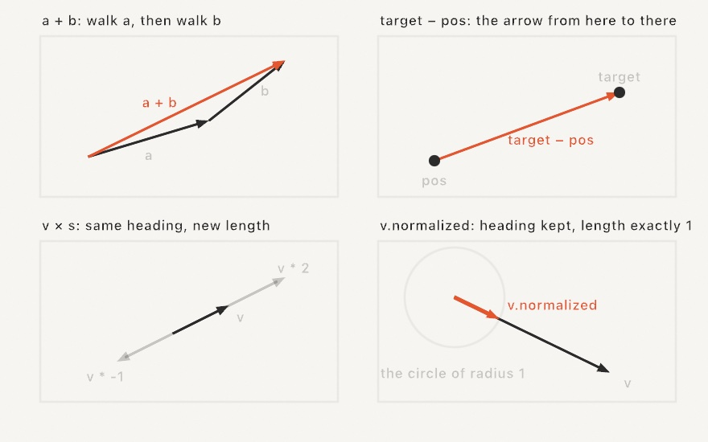

A `Vector2` is two numbers with two readings: a *place* (a position) or a *way to move* (a direction with a length). The arithmetic is drawing: adding chains arrows head to tail; `target - position` is the arrow *from* here *to* there; multiplying by a number stretches, shrinks, or (negative) flips. An arrow's `length` comes from Pythagoras, and `normalized` keeps its heading at length exactly 1, ready to be scaled to any speed you want. [Chapter 8](08-Vectors.md) is a gentle bootcamp in exactly this.

### The motion trio

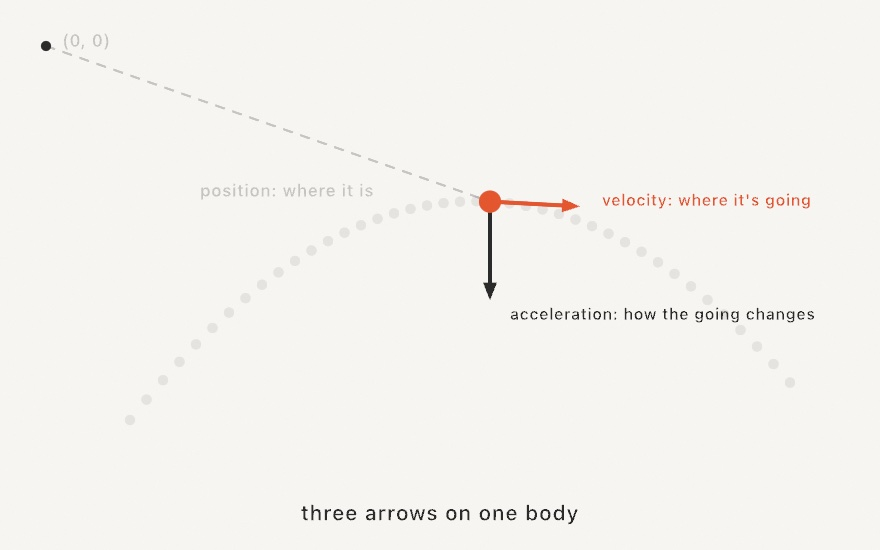

Motion is three vectors in a strict chain: **acceleration** changes velocity, **velocity** changes position, and never the other way around. Each frame: `velocity += acceleration; position += velocity`. Steer a thing by pushing on its acceleration and letting the chain carry the push downstream; the lag between push and path is where the lifelike feel comes from. At the canvas's edges you choose a policy: *wrap* (exit one side, enter the other) or *bounce* (flip the velocity component that hit, usually keeping less than all of it). The trio arrives in [Chapter 8](08-Vectors.md) and drives everything in Part II.

### Steering is a correction

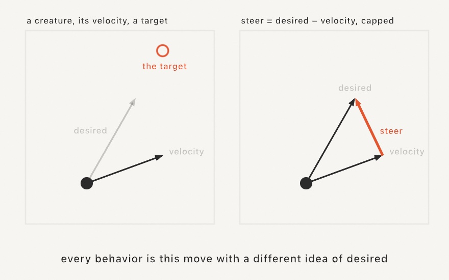

A creature that can't teleport steers by comparing wish and state: compute the velocity it *wants* (toward the target, at full speed), subtract the velocity it *has*, and the difference is the correcting force, capped so the turn takes time. `desired - velocity`, nothing more. That one subtraction, re-aimed, becomes seek, flee, arrive, and wander in [Chapter 8](08-Vectors.md) and [Chapter 10](10-FlocksAndSwarms.md).

### Forces add; mass divides

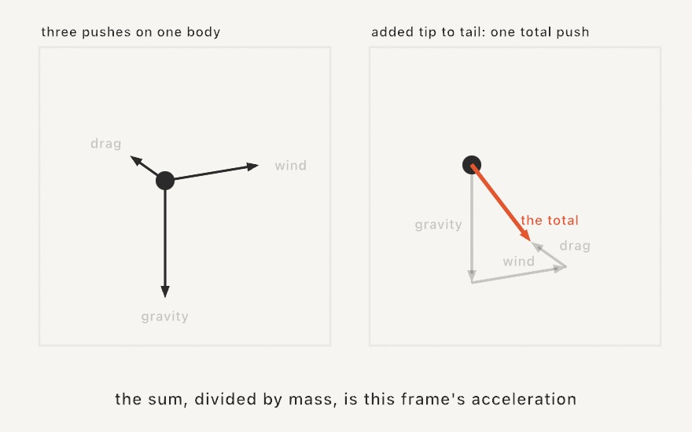

A force is a push with a direction, and simultaneous pushes on one body simply add, tip to tail, into one total. What the body *does* with the total depends on its mass: `acceleration = force / mass`, so the same wind barely moves a boulder and flings a leaf. Real gravity is the special case that scales *with* mass, so after the division everything falls alike, while drag doesn't, which is why the feather drifts. [Chapter 9](09-ForcesAndPhysics.md) builds its confetti on exactly this asymmetry.

### The spring's rule

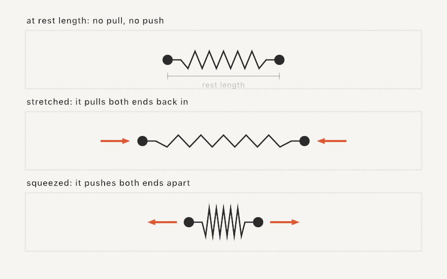

A spring has one opinion, its **rest length**. Longer than that, it pulls its ends together; shorter, it pushes them apart; at rest length, silence. The correction grows with the error (twice as stretched, twice the pull), and **stiffness** scales how sharply it acts. Everything soft in [Chapter 9](09-ForcesAndPhysics.md), from blobs to bridges, is dots connected by this one rule.

### Verlet: motion without a velocity

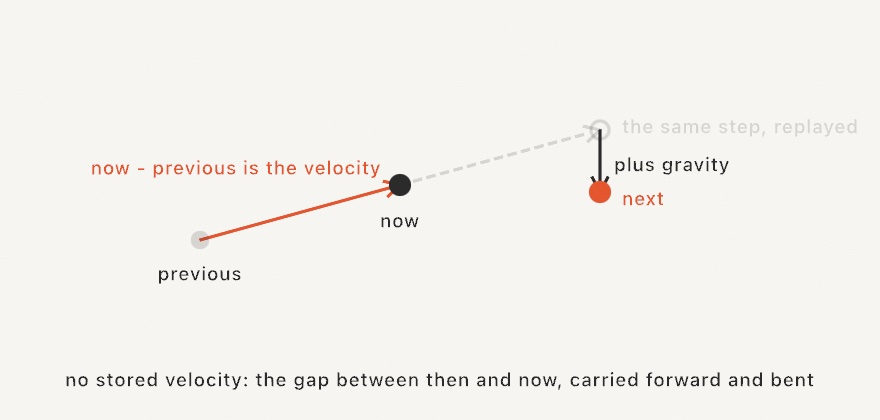

Verlet integration stores no velocity at all; it remembers where the particle *was* last frame. The gap between then and now *is* the velocity, so each step replays that gap and bends it by the frame's forces. The payoff is sturdiness under constraints: when a spring yanks a particle somewhere new, its implied velocity updates automatically, no bookkeeping to contradict. It's the quiet engine under [Chapter 9](09-ForcesAndPhysics.md)'s soft bodies.

### One second is one second

`draw()` runs once per screen refresh, and screens disagree: a fixed "move 2 pixels per frame" travels twice as far per second at 120 Hz as at 60. Two honest fixes: derive positions from `time` directly, or scale each step by `deltaTime`, the seconds since the last frame, so per-frame steps become per-second speeds. Simulations sometimes choose the third road on purpose, a *fixed* step per tick, trading frame-rate independence for exact repeatability, run for run. [Chapter 3](03-MotionAndTime.md) sets the rule; [Chapter 10](10-FlocksAndSwarms.md) explains the trade.

## Fields and following them

### A field: a question answered everywhere

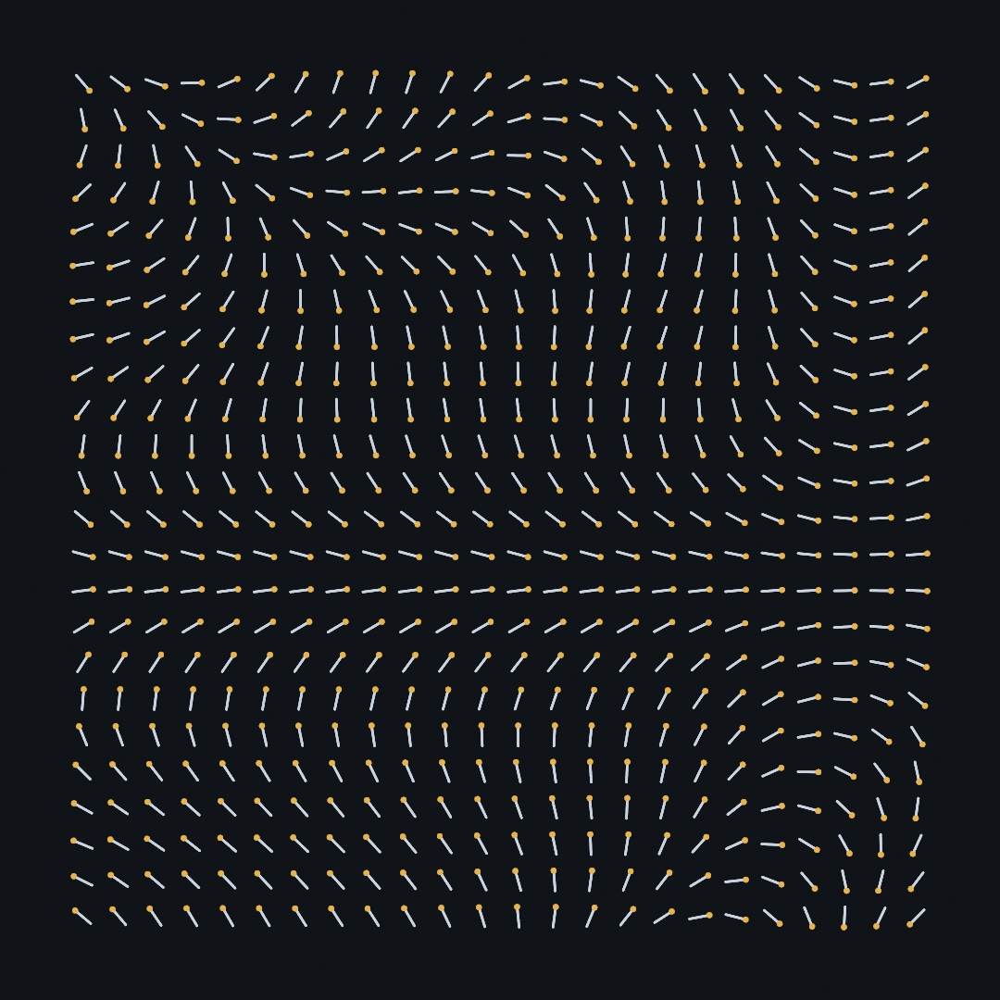

A field is a rule that answers a question at *every* point of the plane: "how bright here?" gives a number field (noise is one), "which way here?" gives a direction field. The field itself is invisible and continuous; the needles in the picture are just samples of it on a grid. Once you hold that distinction, sampling versus the thing sampled, [Chapter 12](12-FieldsAndFlow.md)'s flow work and [Chapter 5](05-Noise.md)'s terrain are the same idea with different questions.

### Following a field: ask, step, ask again

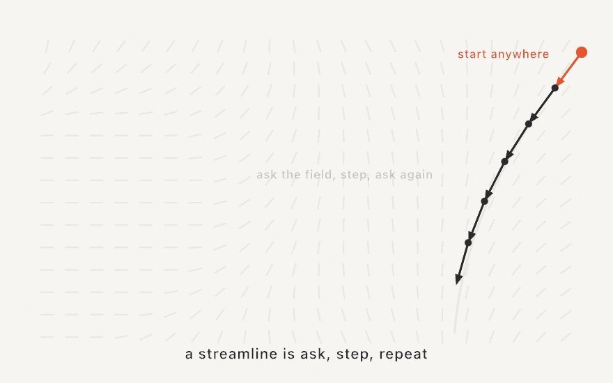

To trace a line through a direction field, ask the field which way at your position, take a small step that way, and repeat. That loop is Euler integration, and its one parameter is the step size: big steps cut corners where the field bends, small steps follow faithfully and cost more asks. Every streamline in [Chapter 12](12-FieldsAndFlow.md) is this loop running until it's told to stop.

### Iterated maps: orbits that pile up

Take a formula, feed it a point, feed it its own answer, and keep going: the visited points form an **orbit**. For most formulas the orbit shoots away or settles into a dot, but for special ones it wanders forever inside a bounded shape, the **attractor**, and plotting a million faint visits reveals where it likes to be. The ghostly plates in [Chapter 12](12-FieldsAndFlow.md) are nothing but visit counts made luminous.

### Optical flow: a measured field

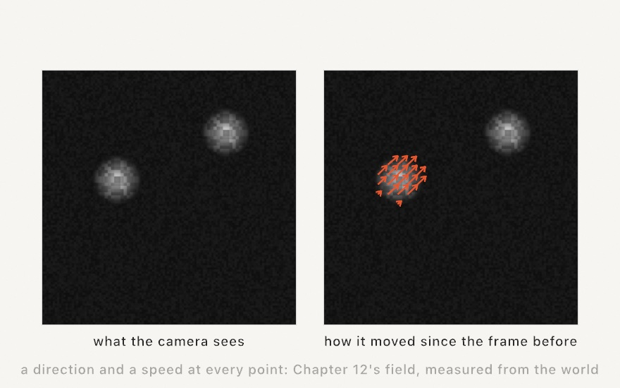

Every field so far was invented; optical flow is *measured*. Comparing one camera frame with the next assigns each point an arrow, "which way did the picture move here", and the result is a direction field you can trace, advect particles through, or paint with, exactly like a noise-built one. The camera becomes a field generator in [Chapter 21](21-Seeing.md).

## Local rules, global structure

### Neighborhoods: who counts as nearby

Distributed systems need a definition of "nearby": a perception radius around each creature, inside which others count and outside which they don't exist. Every flocking rule in [Chapter 10](10-FlocksAndSwarms.md) is an average over that circle, and the radius is a character dial: small circles make jittery individualists, large ones make committees.

### Local rules, global structure

No cell in the Game of Life knows what the board looks like; each one asks only its eight neighbors and follows three lines of rules. Gliders, blinkers, and all the rest emerge unbidden. The same principle runs gentler machinery: Truchet tiles agree only at their shared edges, yet loops and mazes appear ([Chapter 6](06-GridsAndRepetition.md)); boids know only their circle, yet the flock turns as one ([Chapter 10](10-FlocksAndSwarms.md)); reaction-diffusion asks even less and builds coral ([Chapter 16](16-Simulations.md)). When a pattern looks globally planned, look for the local law first.

### Recursion: a rule applied to its own output

A branch is a stick with two smaller branches on top, and each of *those* is a stick with two smaller branches on top. A function that calls itself expresses that directly; the two guardrails are that something must shrink on each call (the length, here) and a floor must say when to stop (a depth counter). Since every level doubles the branches, n levels make 2ⁿ tips, which is why nine levels is already a canopy. [Chapter 11](11-GrowingThings.md) grows this tree in a dozen lines.

### Rewriting growth

An L-system grows a *sentence*, not a picture: start from an axiom, replace every symbol by its rule, and repeat, so the string lengthens exponentially. A turtle then walks the final string, reading symbols as "forward", "turn", "branch". The drawing gets richer only because the sentence got longer; all the botany lives in the rewriting. [Chapter 11](11-GrowingThings.md) writes ferns and lichens this way.

### Constraint propagation

Wave Function Collapse solves a grid the way you solve sudoku: every cell starts as "could be anything", and each placement rules options out of its neighbors, which rule options out of theirs. The solver always settles the most-constrained cell next (the one with fewest options left), because that's where a contradiction would surface soonest. One local law, "edges must match", propagated relentlessly, forces global coherence. [Chapter 11](11-GrowingThings.md) closes with it.

### A parameter space is a map

Two knobs span a plane: every pair of settings is a point on it, and a system's behaviors live in *regions* of that plane, spots here, mazes there, dead calm nearly everywhere. Rendering the map (one small run per grid cell) turns knob-fiddling into geography, and interesting settings cluster along the borders between regions. [Chapter 16](16-Simulations.md) maps Gray-Scott's feed and kill this way.

### Escape time

Iterate a formula at every pixel and ask one question: how many rounds until the value flies off past a bound? Points that never escape are painted the set's interior; everywhere else, the *count itself* becomes the color, and the smooth bands you see are equal-patience contours. The most famous images in mathematics are literally a loop counter, colorized. [Chapter 16](16-Simulations.md) shades both fractals this way.

### Density as tone

Draw one faint dot and you see a dot; draw a million and you see a *material*, because overlapping near-transparent marks add up to smooth tone exactly where they crowd. The count is the brush: each tenfold increase trades grain for cream. This is how attractor plates, sandpaintings, and [Chapter 16](16-Simulations.md)'s GPU grains all get their finish, and why they need so many particles to get it.

## Shapes as regions

### Set operations on regions

Treat shapes as *regions of space* and logic applies to them: union is "in either" (or), intersection "in both" (and), subtraction "in one but not the other" (and-not), symmetric difference "in exactly one" (xor). Four sentences about membership, drawn. [Chapter 13](13-ShapesAsMaterial.md) uses them to build forms no single primitive could draw.

### Offsets: growing and shrinking

Offsetting moves a region's whole boundary by the same distance everywhere: outward grows it, inward shrinks it. The interesting part is that insets aren't scaled-down copies: narrow passages thin faster than broad ones, and a deep enough inset pinches the waist apart into islands. That behavior is honest geometry (it's where the shape is thin), and [Chapter 13](13-ShapesAsMaterial.md) leans on it for insets, outlines, and plotter work.

### Convexity: the rubber band

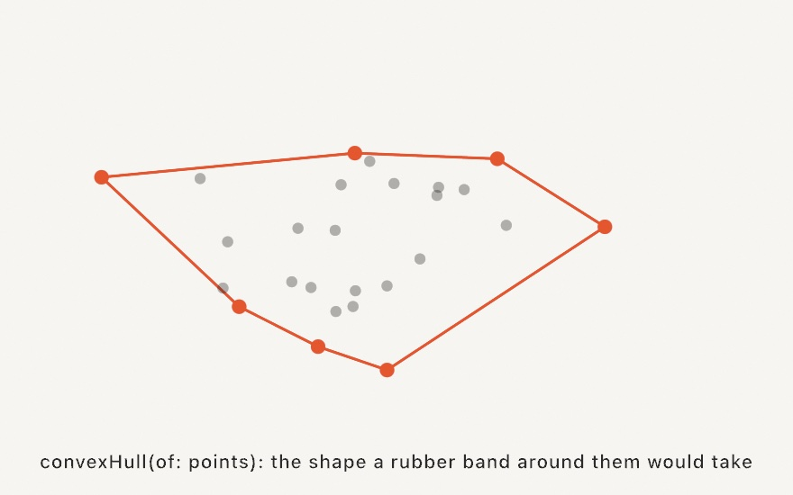

A region is convex if the straight line between any two of its points stays inside it: no dents. The convex hull of a scatter is the smallest convex region containing all of it, exactly the shape a rubber band takes when released around the points; walking its boundary, you turn in only one direction. [Chapter 13](13-ShapesAsMaterial.md) uses hulls to wrap scatters into clean silhouettes.

### Duality: two readings of one point set

From one set of points, two structures: each point's Voronoi cell is the territory closer to it than to anyone else, and the Delaunay triangulation connects each point to its natural neighbors. They're duals, two answers to "who's near whom": cells share an edge exactly when their points share a triangle edge. Mosaics want the territories; networks and meshes want the neighbors. [Chapter 13](13-ShapesAsMaterial.md) builds with both.

## Color and light as numbers

### Numeric vs perceptual mixing

Averaging two colors channel by channel gives the numeric midpoint, and your eye often disagrees with it: RGB's halfway between blue and yellow is a muddy olive. Perceptual spaces like OKLab are laid out so that numeric distance matches *seen* distance, and midpoints in them look like what you'd mix. The lesson generalizes: whenever math on colors looks wrong, ask which space the math ran in. [Chapter 2](02-Color.md) shows the three rows side by side.

### Perceived brightness

The eye doesn't weigh channels equally: green counts most, red less, blue least (the standard weights are 0.2126, 0.7152, 0.0722). Averaging r, g, and b calls a saturated blue as bright as a green, and it visibly isn't; the weighted sum, luminance, matches what you see. Any effect driven by "how bright is this pixel", like the dot sizes here, needs the weighted version. [Chapter 7](07-WordsAndPictures.md) meets this the first time it reads pixels.

### Blend modes are arithmetic

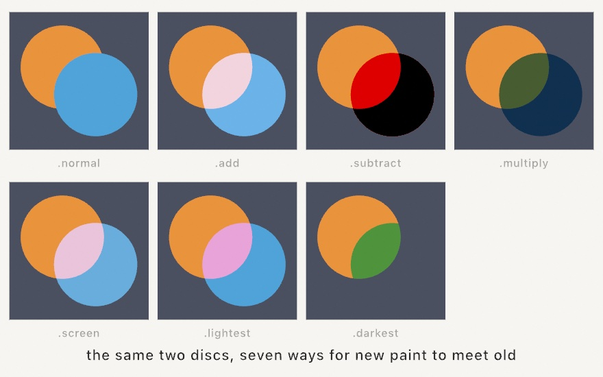

Every blend mode is a small per-channel formula for combining the color being drawn with the color already there: normal covers, add sums (light on light gets brighter), multiply darkens like stacked filter gels, screen brightens like layered projections, lightest and darkest keep the winner. Once you read them as arithmetic, choosing one stops being trial and error. [Chapter 14](14-LayersAndEffects.md) puts the whole row to work.

### Light past 1, and bringing it back

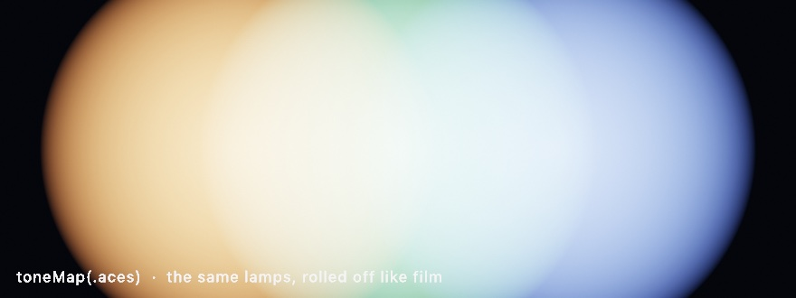

Add enough light and channel values sail past 1, brighter than the screen can show. Something must bring them back: **clamping** chops everything at 1, so overlapping glows flatten into white slabs with hard seams, while a **roll-off curve** like film's compresses the highlights gradually, keeping their tints on the way up. Same scene, different return trip. [Chapter 14](14-LayersAndEffects.md) covers when each is right.

### Feeding a picture back to itself

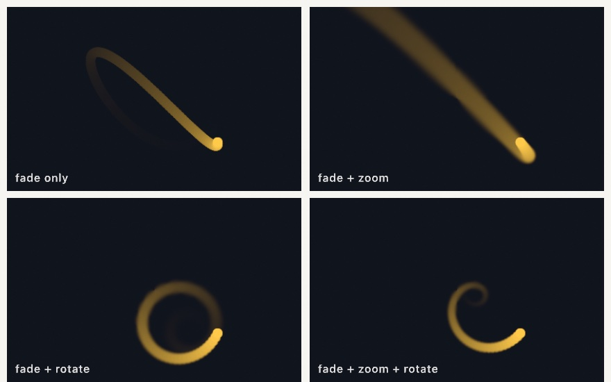

Draw this frame on top of a transformed copy of the *last* frame, and the transform applies again every frame: iteration. A gentle zoom becomes an ever-deepening tunnel, a small rotation a tightening swirl, because each frame inherits all the transforms before it. Tiny per-frame moves compound into large structure, the same way the staircase compounded, but in pixels. [Chapter 14](14-LayersAndEffects.md) builds video feedback from it.

## Per-pixel thinking and distance

### A function from position to color

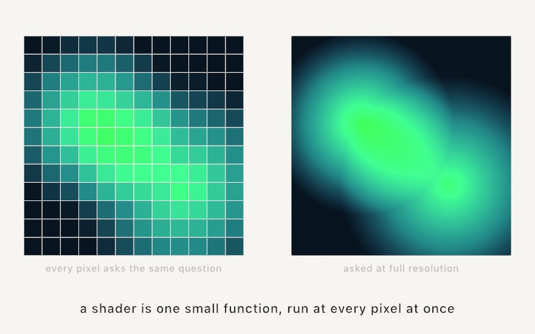

A shader is one function answering one question, "what color at this position?", asked independently at every pixel. There's no canvas to accumulate onto and no loop you can see; the image is just hundreds of thousands of simultaneous answers, fusing smoothly because the function varies smoothly. Evaluate it coarsely and you can watch the answers before they fuse. [Chapter 15](15-YourFirstShader.md) starts pixel thinking here.

### Signed distance: how far, and which side

A signed distance field describes a shape by answering, at every point, "how far to the surface?", with the *sign* saying which side you're on: negative inside, positive outside, zero exactly on the boundary. The shape stops being a list of vertices and becomes a question you can ask anywhere, which is what makes the sculpting in [Chapter 18](18-SculptingWithFields.md) possible.

### Level sets: an edge at a chosen distance

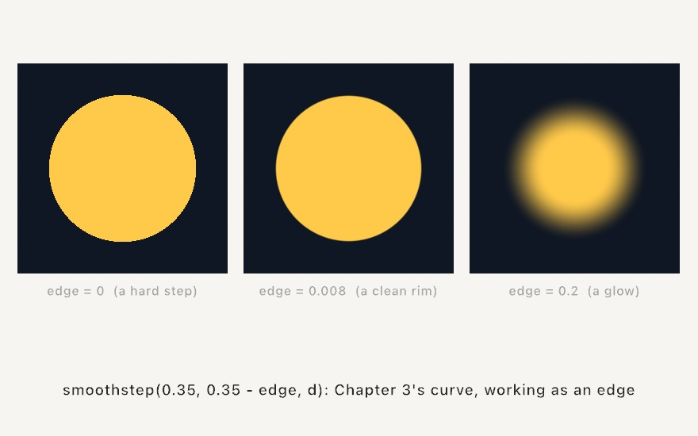

Given a distance field, a shape is "all points within r": the edge lives where the distance crosses that level, like one contour line on a topographic map. Testing the crossing with `step` gives a hard edge; testing it with a `smoothstep` window turns the same boundary into a crisp anti-aliased rim or a wide glow, just by widening the window. Every disc in [Chapter 15](15-YourFirstShader.md) is drawn this way, distance in, coverage out.

### min melts, max trims

Combine two distance fields and set operations fall out of two tiny functions: `min` keeps whichever surface is nearer (union), `max` keeps the farther (intersection; negate one for subtraction). The magic option is the **smooth minimum**, a min with a blending radius: where the two fields are nearly tied, it dips below both, and the shapes neck together and melt like wax instead of merely touching. The k dial in the picture is that radius. [Chapter 18](18-SculptingWithFields.md) sculpts with it.

### Sphere tracing: hop by what the field promises

To render a distance field, march a ray from the eye: ask the field "how far to the nearest surface?", and since nothing can be closer than that answer, hop exactly that far, safely. Repeat; the hops shrink as the surface nears, and a hop below a threshold is a hit. No triangles anywhere, just a field asked a few dozen times per pixel. It's how all of [Chapter 18](18-SculptingWithFields.md)'s 3D sculptures reach the screen.

### Folding space

Instead of copying a shape n times, fold the *question*: mirror the query point, wrap it into a repeating cell, or rotate it into one wedge before asking the field. One shape, one evaluation, and the fold makes it appear everywhere the transformed points coincide, so a grid of a thousand copies costs the same as one. It's repetition run backward, applied to space itself. [Chapter 18](18-SculptingWithFields.md) mirrors, tiles, and fans with it.

## Into three dimensions

### An eye on a sphere

Three numbers aim a camera at a thing: **azimuth**, how far around; **elevation**, how far up; **radius**, how far away. Together they place an eye anywhere on a sphere around the target, which is why orbiting feels like turning an object in your hand. It's the polar-coordinates idea from the circle entries, plus one more angle for up. [Chapter 17](17-3DGently.md) drives its cameras with these three.

### Perspective, and who's in front

Perspective is one rule: apparent size falls with distance, so equal spheres shrink as they recede. The **field of view** is the lens angle, wide exaggerating the shrink, narrow flattening it like a telephoto. And notice the hiding: in 3D, drawing order stops deciding who's in front. Every pixel remembers the depth of the nearest surface drawn so far and rejects anything farther, which is the **depth test**. [Chapter 17](17-3DGently.md) leans on both without ceremony.

### The pinhole: a pixel plus a depth is a ray

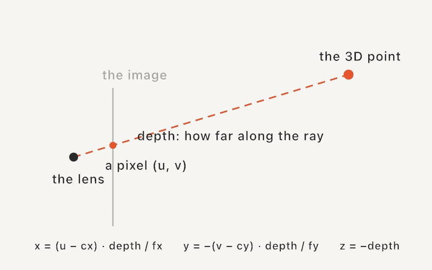

A camera flattens the world by sliding every point down a ray through the lens; a depth sensor records how far along its ray each pixel's surface was. Unprojection runs the flattening backward: slide the pixel off the image center, scale by depth over focal length, and the 3D point returns. A flat photo plus a flat depth map quietly holds a full 3D scene. [Chapter 19](19-DepthAndThePhone.md) stands its point clouds up with exactly this.

### A pose places points in the world

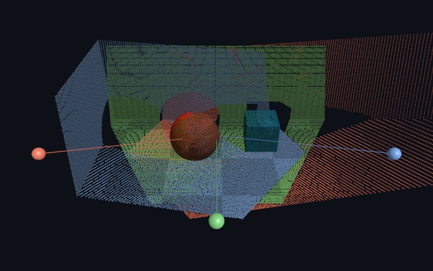

Points recovered from a camera come out in *its* frame, "two meters ahead of me", wherever "me" was. A **pose** is the transform recording where the camera stood and how it was turned; applying it carries camera-frame points into one shared world frame. Do that for every frame of a moving sweep and the fragments fuse into a single room, each capture parked where its camera actually stood. [Chapter 19](19-DepthAndThePhone.md) fuses its scans this way.

### Occlusion voids: the shape of not knowing

A depth image knows only what its rays touched; behind every object lies a shadow of unmeasured space. View the cloud from the capture's own vantage and it looks whole. Step to the side and the voids yawn open, holes shaped exactly like what stood in front of them. They're not errors: they're an honest record of where the sensor couldn't see, filled only by more viewpoints. [Chapter 19](19-DepthAndThePhone.md) treats them as material.

## Sound as numbers

### The spectrum

Any sound, however messy, splits into a sum of pure vibrations, and the spectrum reports the energy at each frequency: the moment's recipe, bass at the left, brilliance at the right. One more fact makes it drawable: hearing is logarithmic, each *doubling* of frequency (an octave) sounding like one equal step, so useful band bars are log-spaced: the low and high octaves get equal width instead of the treble hogging the axis. [Chapter 20](20-SoundAndControl.md) turns spectra into instruments.

### Events, not levels

Loudness is a level; a beat is an *event*, and you can't find events by watching a level's height (a sustained chord is loud forever without ever being "a hit"). Detection compares each instant with the moment just before: a sudden rise above the recent trend is an arrival, and a short refractory pause keeps one drum hit from counting twice. The signal is change over time, not amount. [Chapter 20](20-SoundAndControl.md) builds its beat-reactive pieces on that comparison.

---

[Contents](README.md#contents)
