#### <sup>[Ollin](../README.md) → [Guide](README.md) → Appendix B</sup>

---

# B. Just enough math, visually

This appendix explains every math idea in the guide again, in one short entry each. Each entry gives a picture, a plain-words explanation, and a link to the chapter that uses it. It supports the guide's first rule, that a concept comes before anything uses it. If you get lost on a page anywhere, look here for what you are missing.

The entries are grouped by theme rather than by chapter, so related ideas sit together. You can read it from start to end, or go straight to the one idea you need.

**Contents:** [Where things are](#where-things-are) · [Angles and circles](#angles-and-circles) · [Fractions, mapping, and wrapping](#fractions-mapping-and-wrapping) · [Shaping a value](#shaping-a-value) · [Randomness](#randomness) · [Noise](#noise) · [Moving the paper](#moving-the-paper) · [Vectors, motion, and forces](#vectors-motion-and-forces) · [Fields and following them](#fields-and-following-them) · [Local rules, global structure](#local-rules-global-structure) · [Iteration: a rule applied again](#iteration-a-rule-applied-again) · [Shapes as regions](#shapes-as-regions) · [Color and light as numbers](#color-and-light-as-numbers) · [Per-pixel thinking and distance](#per-pixel-thinking-and-distance) · [Into three dimensions](#into-three-dimensions) · [Sound as numbers](#sound-as-numbers)

## Where things are

### The canvas: x right, y down

<picture>
  <source media="(prefers-color-scheme: dark)" srcset="Images/01-HelloOllin/CoordinateSystem-dark.jpg">
  
</picture>

Every position on the canvas is two numbers, counted in pixels from the top-left corner. Here x grows to the right, and y grows *downward*. Graphs in school math do the opposite, with y growing upward. To move something toward the bottom of the screen you *add* to y. The convention comes from how screens have been addressed since text terminals, and [Chapter 1](01-HelloOllin.md) starts here.

### Normalized coordinates: 0…1 anywhere

<picture>
  <source media="(prefers-color-scheme: dark)" srcset="Images/18-YourFirstShader/UVSpace-dark.jpg">
  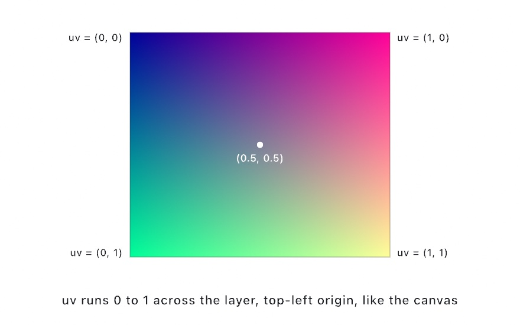
</picture>

Instead of pixels, an address can be a *fraction* of the whole, 0 at one edge and 1 at the other. So (0.5, 0.5) is the center of anything, at any resolution. A shader's `shade` function gets each position in these `uv` coordinates, and [Chapter 18](18-YourFirstShader.md) works in them. Subtracting 0.5 re-centers them, so distances measure from the middle. The same trick names positions inside a camera image regardless of its size ([Chapter 34](34-Seeing.md)).

### Putting a normalized point onto the canvas

<picture>
  <source media="(prefers-color-scheme: dark)" srcset="Images/34-Seeing/TrackerFlow-dark.jpg">
  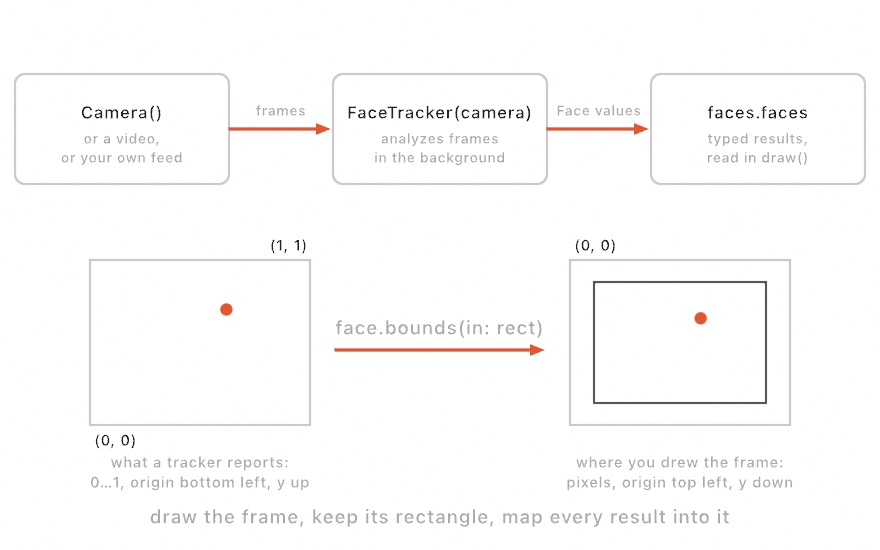
</picture>

A point given as fractions of an image becomes a canvas point when you scale it into the rectangle you drew the image in. Vision results count y *up* from the bottom-left, while the canvas counts y *down* from the top-left. So the y fraction flips on the way (`1 - y`). In [Chapter 34](34-Seeing.md), the `in:` helpers such as `bounds(in:)` do the flip and the scale for you, with this same math.

### The 3D world frame

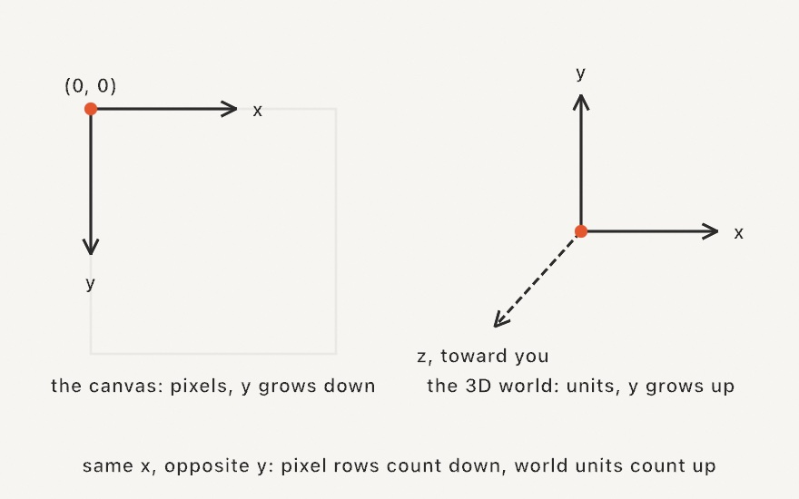

The 3D world uses its own frame. The origin sits wherever you like, x still grows right, y grows *up*, and z comes toward you. Positions are in world units rather than pixels. A sphere of radius 1 is one unit, and the camera's distance decides how big it looks. The canvas's y-down is a habit of 2D screens, and 3D keeps the y-up of school math. [Chapter 26](26-3DGently.md) makes the switch. Depth data in meters lands in the same kind of frame in [Chapter 35](35-Depth.md).

## Angles and circles

### Radians and tau

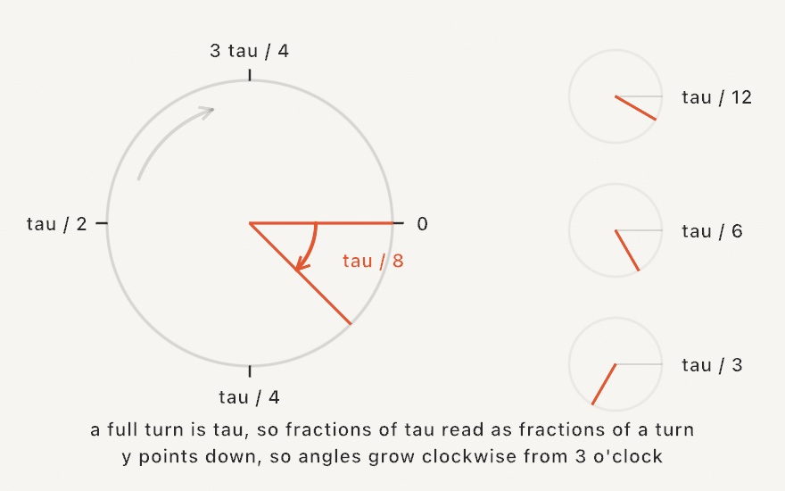

Angles here are radians, and the easiest way to write them is with `.tau`, the angle of one full turn (about 6.283, twice pi). Fractions of tau read as fractions of a turn: `.tau / 4` is a quarter turn, `.tau / 12` a clock hour. Because the canvas's y points down, angles sweep *clockwise* on screen, starting from 3 o'clock. Thinking in turns spares you both degrees and memorized decimals, and [Chapter 1](01-HelloOllin.md) measures angles this way.

### An angle and a radius make a point

<picture>
  <source media="(prefers-color-scheme: dark)" srcset="Images/01-HelloOllin/AroundACircle-dark.jpg">
  
</picture>

To stand on a circle's rim, you need how far around (an angle) and how far out (a radius). `cos(angle) * radius` gives the across part, `sin(angle) * radius` the down part, and adding them to the center gives the point. The angle in the picture is negative, so its point sits above the center. This one pattern places petals, clock hands, orbiting moons, and everything else arranged in a ring. It first appears in [Chapter 1](01-HelloOllin.md), and later chapters keep using it.

Once you know the pattern, you can also write it as one call. `polar(angle, radius, around: center)` returns the same point, and `angles(12)` returns twelve evenly spaced angles to place things at. A ring of things becomes a `for` loop with no index arithmetic. This appendix keeps spelling the trig out so you can see it work.

### The angle of an arrow: `atan2`

<picture>
  <source media="(prefers-color-scheme: dark)" srcset="../Docs/Images/VectorHeading-dark.jpg">
  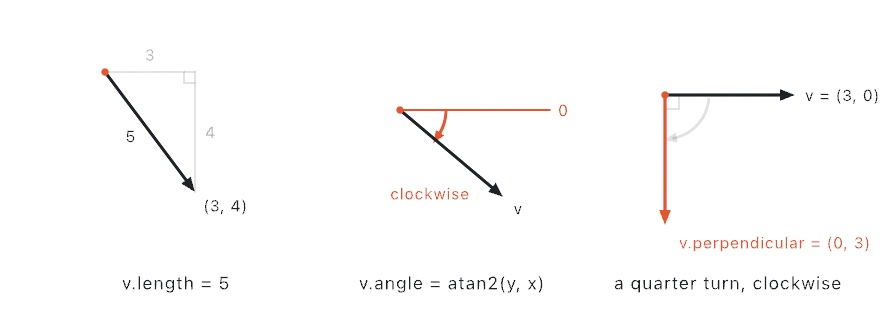
</picture>

[An angle and a radius make a point](#an-angle-and-a-radius-make-a-point) goes from an angle to a point. `atan2(y, x)` goes back, from a point to its angle. Given the two parts of an arrow, it answers the angle the arrow points at, measured from the positive x-axis, between `-.pi` and `.pi`. It takes y first. It needs both parts, because an arrow and its opposite have the same ratio of y to x. (1, 1) and (-1, -1) are one example. A vector's `angle` is this call. [Chapter 10](10-Vectors.md) turns a shape to face where it moves with it, and [Chapter 17](17-MarksAndMedia.md) reads the lean of a pen.

### Two angles and a radius make a point in space

In the [3D world frame](#the-3d-world-frame) a point on a sphere needs two angles and a distance. The first angle is the azimuth, and it turns around the y axis like a compass bearing. `0` points along +z toward you, and a quarter turn points along +x. The second is the elevation, which lifts the point above the floor of x and z: `0` is level, `.pi / 2` is straight up. These are latitude and longitude with a radius added, the way maps have named places since Ptolemy's *Geography*, nearly two thousand years ago.

```swift
let planet = Vector3(0, 1, 0)
let moon = spherical(time, 0.3, 3, around: planet)    // circles the planet, a little above its level
```

`spherical(azimuth, elevation, radius, around:)` takes the angles first and the radius last, as `polar` does. Inside, it is the circle pattern twice. The elevation splits the radius into a height of `sin(elevation) * radius` and a reach along the floor of `cos(elevation) * radius`. The azimuth then places that reach on a circle. It is the same convention as the camera's orbit, so `spherical(a, e, r)` is where a camera stands when it orbits the origin at those angles. A `Vector3`'s `azimuth` and `elevation` go the other way and read the two angles off a direction. Each is an `atan2` like the one above.

### Sine: a smooth swing

<picture>
  <source media="(prefers-color-scheme: dark)" srcset="Images/03-MotionAndTime/CircleToSine-dark.jpg">
  
</picture>

`sin` is the height of a point walking around a circle, which is why it swings smoothly between -1 and 1 forever. Its **period** is how long one lap takes, so writing `sin(time * .tau / period)` completes one cycle every `period` seconds. Its **amplitude** is the swing's size, just the circle's radius, set by whatever you multiply the result by. [Chapter 3](03-MotionAndTime.md) builds most of its motion from these two dials, with `cos` as the same walk read as "across" instead of "up".

### Phase: a head start

<picture>
  <source media="(prefers-color-scheme: dark)" srcset="Images/03-MotionAndTime/Phase-dark.jpg">
  
</picture>

Adding a constant inside `sin(...)` starts the swing partway through its cycle, a head start, called phase. Give each element a *different* head start, usually from its position, as in `sin(time + x * 0.02)`. Then identical motions turn into a wave that travels across space. [Chapter 3](03-MotionAndTime.md) gives a row of dots their head starts this way.

### n copies close the circle

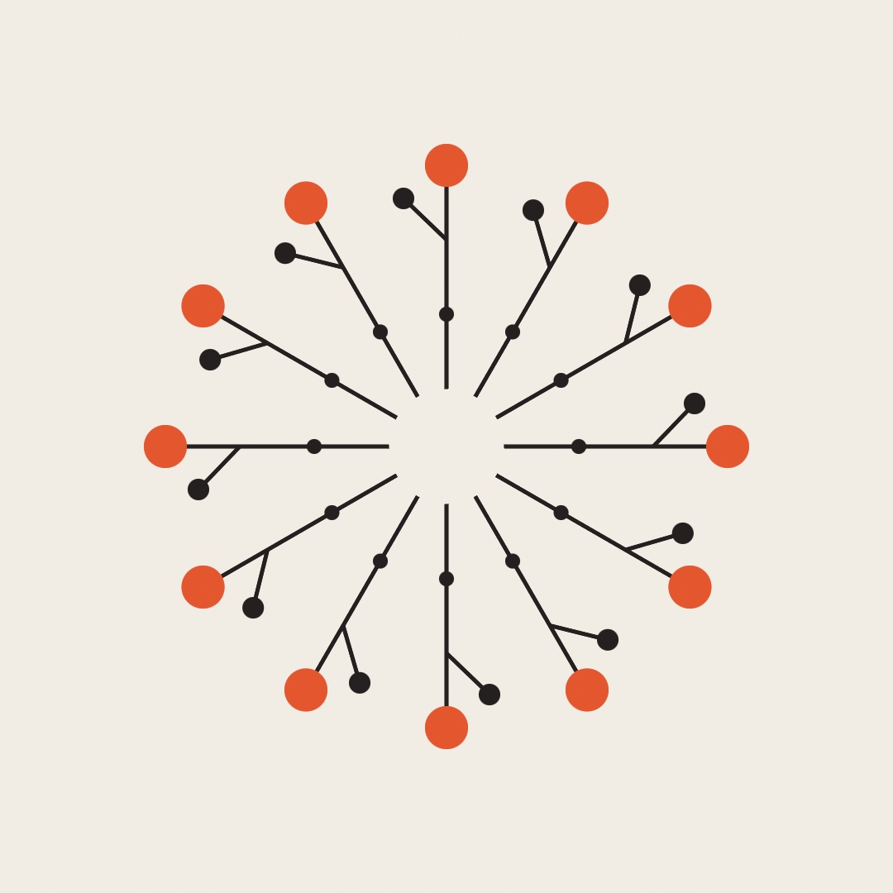

Rotational symmetry is repetition around a point: draw one arm, rotate by `.tau / n`, draw again, n times. Since n equal steps of `.tau / n` add up to exactly one full turn, the last copy meets the first with no seam. [Chapter 6](06-GridsAndRepetition.md) builds rosettes and mandalas this way from a single drawing.

### An angle that never closes: the golden angle

<picture>
  <source media="(prefers-color-scheme: dark)" srcset="Images/B-JustEnoughMath/GoldenAngle-dark.jpg">
  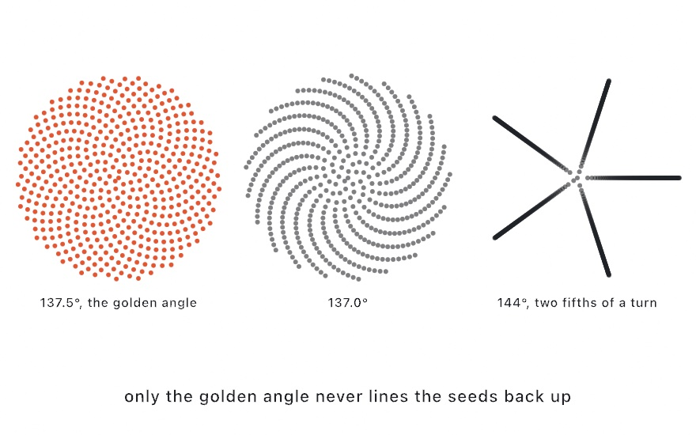
</picture>

Turning by a simple fraction of a turn brings you back to the start after a few steps, which is what closes [the rosette](#n-copies-close-the-circle). Sometimes you want the opposite, many things placed around a center with none lined up behind another. The golden angle, about 137.5 degrees or 0.382 of a turn, does that. As a fraction of a turn, it is the number that simple fractions like 2/5 or 3/8 come least close to. So no two steps ever line up, and each new one lands in one of the widest gaps left. A sunflower's seeds grow this way. The middle disk turns the same seeds by 137.0 degrees, which lines them up into curving arms with gaps between them. The right one turns them by 144 degrees, two fifths of a turn, and they fall on five straight spokes. [Chapter 16](16-CurvesAndFigures.md) turns each seed by the golden angle and pushes it out by the square root of its number. [Chapter 29](29-Landscapes.md) spreads its lamps the same way.

### Numbers that turn: complex multiplication

<picture>
  <source media="(prefers-color-scheme: dark)" srcset="Images/B-JustEnoughMath/MultiplyingTurns-dark.jpg">
  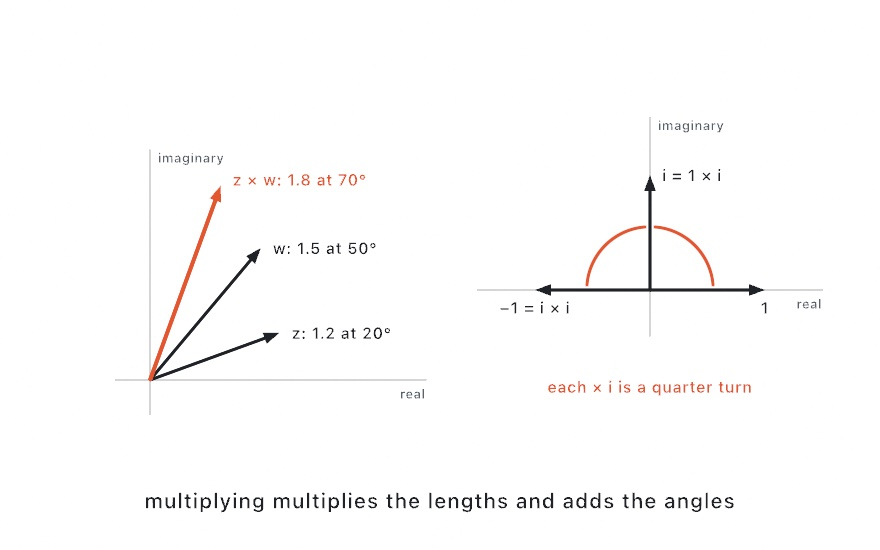
</picture>

A point `(x, y)` can also be read as one number, written `x + y·i`, where `i` is a number whose square is -1. Read that way, the plane is the **complex plane**, and its use here is multiplication. Multiplying two of these numbers multiplies their lengths and adds their angles. In the left panel, z points at 20 degrees and w at 50 degrees, so z times w points at 70 degrees. The lengths multiply too, and 1.2 times 1.5 makes the 1.8 of the orange arrow. So multiplying by `i`, which has length 1 and points a quarter turn around, turns anything a quarter turn. Two quarter turns make half a turn, which is why `i` times `i` is -1. Squaring a point doubles its angle and squares its length. [Chapter 22](22-IteratedForms.md#multiplying-turns-the-complex-plane) builds escape-time fractals and domain coloring on this.

### Circles on circles: Fourier

<picture>
  <source media="(prefers-color-scheme: dark)" srcset="Images/16-CurvesAndFigures/EpicycleTerms-dark.jpg">
  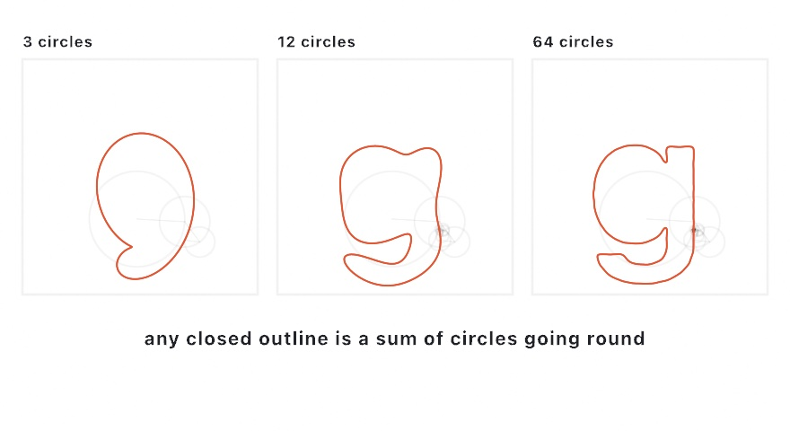
</picture>

A closed outline can be rebuilt from circles. Each circle turns a whole number of laps while centered on the tip of the one before it, and the last tip traces the shape. A few large, slow circles give the rough form, and more small, fast ones add the detail. This is Joseph Fourier's idea from the 1820s: a repeating shape is a sum of plain waves. [Chapter 16](16-CurvesAndFigures.md) draws with the circles, and [Chapter 21](21-PicturesYouSolve.md) reads a whole picture as waves. [Chapter 33](33-TracedLight.md) finds it in the star around a bright light in a lens. A sound splits the same way, as [the spectrum](#the-spectrum) shows.

## Fractions, mapping, and wrapping

### t, the fraction along: lerp and map

<picture>
  <source media="(prefers-color-scheme: dark)" srcset="Images/03-MotionAndTime/MapAndLerp-dark.jpg">
  
</picture>

A value between 0 and 1 can mean "how far along". It reads 0 at the start, 1 at the end, and 0.25 a quarter of the way. `lerp(a, b, t)` walks from `a` to `b` by that fraction. `map(v, inLo, inHi, outLo, outHi)` carries a value from one range to another by *keeping* its fraction along. So 75% into the input range comes out 75% into the output range. The same idea squeezes sine's -1…1 into 0…1 (`sin(x) * 0.5 + 0.5`). [Chapter 2](02-Color.md) mixes colors by `t`, and [Chapter 3](03-MotionAndTime.md) makes both calls everyday tools.

### Three fractions at once: barycentric coordinates

<picture>
  <source media="(prefers-color-scheme: dark)" srcset="Images/B-JustEnoughMath/Barycentric-dark.jpg">
  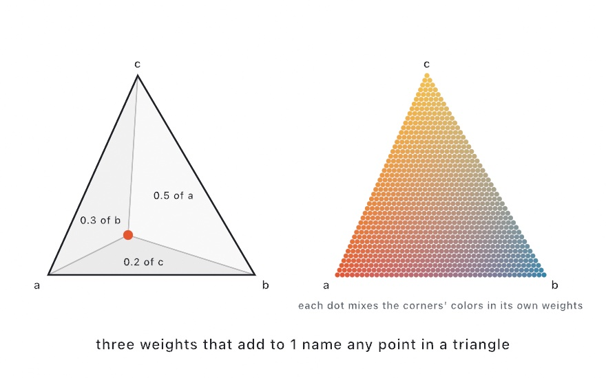
</picture>

`lerp` names a point between two ends with one fraction. A point inside a triangle takes three, one for each corner, and the three add up to 1. The point is that much of each corner mixed together. A weight of 0.5 on the first corner puts the point halfway from the opposite edge to that corner. Each weight is also a share of area. Lines from the point to the corners cut the triangle into three. A corner's weight is the share of the piece opposite it. The orange point on the left has a weight of 0.5 on corner a, so the piece opposite that corner is half the triangle. The same weights mix anything the corners carry, such as a color or a height. The right half of the picture gives each corner a color and mixes the three at every dot. [Chapter 29](29-Landscapes.md) reads the weights off a point scattered over a mesh, to blend what the mesh stores at its corners.

### Wrapping: remainder, fract, and pingPong

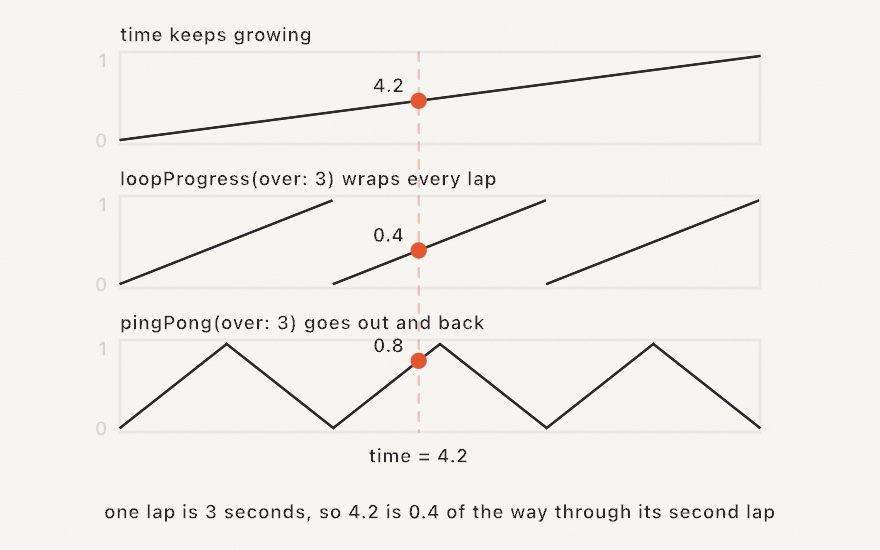

A clock that only grows becomes a cycle by wrapping. The `%` remainder wraps whole numbers, so `i % 4` cycles 0, 1, 2, 3. `fract` keeps only the part after the decimal point, so 2.75 becomes 0.75, and a growing value wraps into 0…1. `loopProgress(over: 3)` is that wrap applied to the sketch clock, "how far through the current 3-second lap". `pingPong` folds each lap, so the value goes out and back instead of jumping to 0. [Chapter 1](01-HelloOllin.md) meets `%`, and [Chapter 3](03-MotionAndTime.md) supplies the two helpers.

### What two counts share: the greatest common divisor

<picture>
  <source media="(prefers-color-scheme: dark)" srcset="Images/07-Tiles/KolamLoops-dark.jpg">
  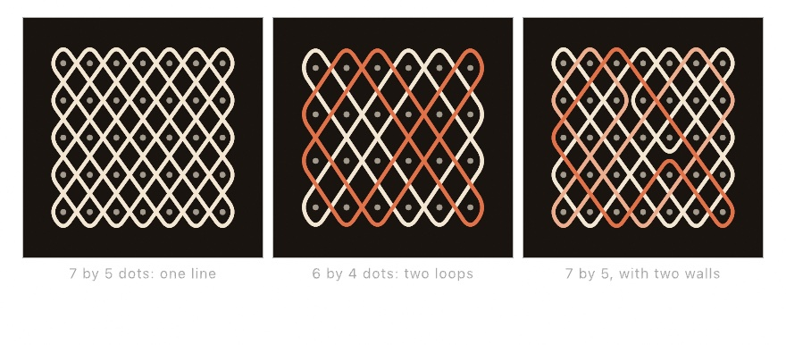
</picture>

The greatest common divisor of two whole numbers is the largest number that divides both. For 6 and 4 it is 2, and for 7 and 5 it is 1. It decides how two repeating things line up. [Chapter 7](07-Tiles.md)'s kolam draws one unbroken line around a field of seven by five dots. Around six by four it draws two separate loops, as the first two panels show. The number of loops is the greatest divisor the two sides share. Euclid's method finds it by taking remainders again and again, and [Chapter 40](40-MusicByRule.md)'s Euclidean rhythms spread their hits by the same steps.

### The perfect loop


An animation loops with no visible jump when every time-driven term completes *whole* cycles in the loop length. A 4-second loop can hold sine waves with periods of 4, 2, or 1 second. A period of 3 jumps where the loop starts over. Noise loops the same way. `noise(x, loop: t)` walks a closed circle through the noise field, so one lap ends where it began ([Chapter 5](05-Noise.md)). [Chapter 3](03-MotionAndTime.md) states the rule. An exported GIF depends on it, because a GIF plays its first frame again after its last.

### Sampling one grid with another


To read an image at any grid's resolution, connect the grid and the image through fractions. A cell 30% across and 60% down the grid reads the pixel 30% across and 60% down the image. Nothing needs to match in size, because the fractions do the translation. This is how [Chapter 9](09-Pictures.md) rebuilds a photo as a mosaic of letters. It is the idea of normalized coordinates, from the start of this appendix, used on a grid.

## Shaping a value

### Reading a shaping curve

<picture>
  <source media="(prefers-color-scheme: dark)" srcset="Images/03-MotionAndTime/ShapingCurves-dark.jpg">
  
</picture>

A shaping function takes a 0…1 value and hands back a reshaped 0…1 value. Its graph shows input along the bottom and output up the side, and the straight diagonal means "unchanged". Where the curve is steep, the value moves fast. Where it's flat, the value lingers, which is why the dot strips under each curve bunch and spread. `step` is an if in curve form, 0 then 1 at an edge. `smoothstep` is the gentle S between two edges, with `t * t * (3 - 2 * t)` inside. Squaring a 0…1 value is a shaping curve too, since it pushes the middle down and keeps the ends. That's [Chapter 9](09-Pictures.md)'s one-line contrast boost. [Chapter 3](03-MotionAndTime.md) has the rest of these curves.

### Exponential decay


Multiply a value by a little less than 1 every frame, keeping 93% say, and it fades smoothly. It falls fast at first, then more and more slowly, and never quite reaches zero. That's exponential decay, and it is the shape of a fading trail. The newest mark is full strength, and each older one has been multiplied down one more time. [Chapter 19](19-LayersAndEffects.md) uses it as the feedback fade behind these comet tails. [Chapter 37](37-Listening.md) fades a pulse the same way, scaled by `deltaTime` so it falls at the same speed at any frame rate.

## Randomness

### Pseudo-random: a scramble you can replay

<picture>
  <source media="(prefers-color-scheme: dark)" srcset="Images/04-Randomness/SeedSheet-dark.jpg">
  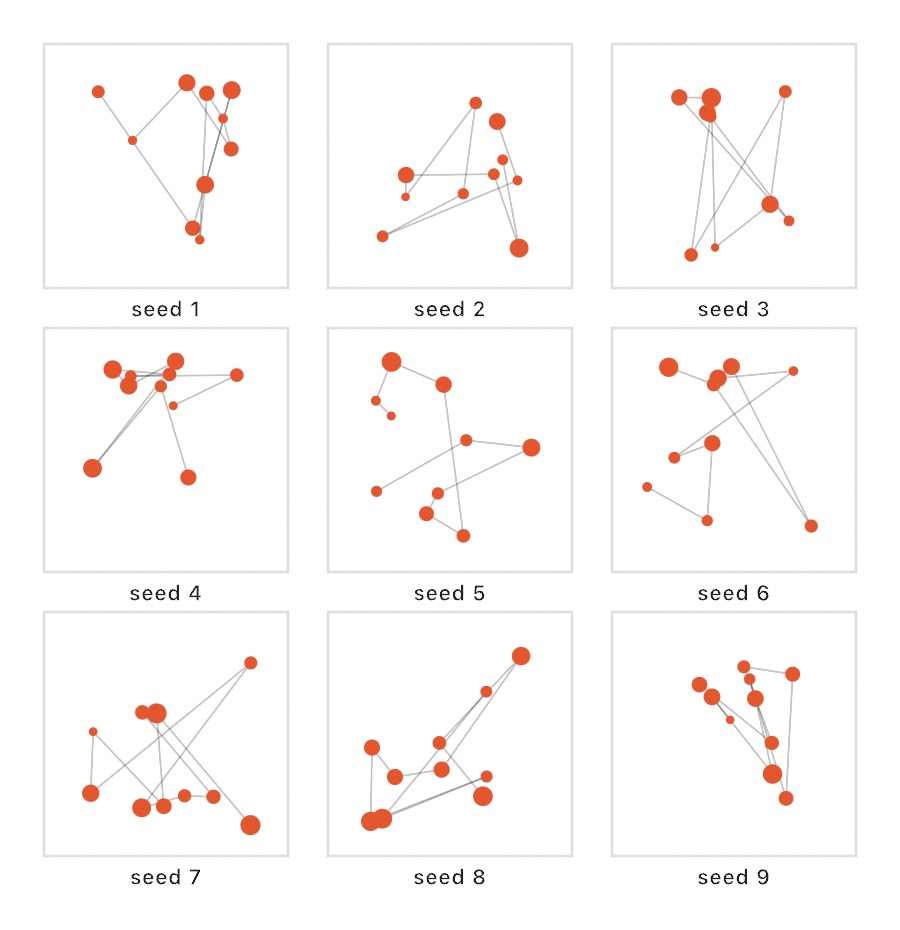
</picture>

`random()` is a deterministic scramble that plays out the same sequence from a chosen starting point, the **seed**. The same seed gives the same "random" result on every run, which is what makes generative work reproducible. A seed works like a serial number. Change it and you get another variation, a different result from the same code. [Chapter 4](04-Randomness.md) builds its seed workflow on this.

### Probability as a threshold

<picture>
  <source media="(prefers-color-scheme: dark)" srcset="Images/04-Randomness/Choices-dark.jpg">
  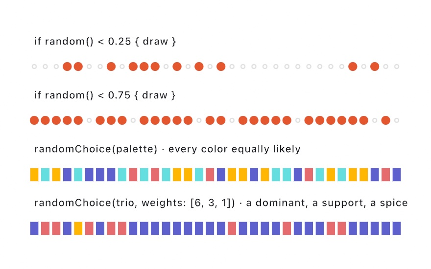
</picture>

`random() < 0.25` is true a quarter of the time. Every part of 0…1 is equally likely, and 0 to 0.25 is a quarter of it. By the same reasoning, `random() < 0.5` is true half the time. Stack several thresholds and you have a weighted choice. A common outcome gets a wide slice of the 0…1 line, and a rare one gets a thin slice. [Chapter 4](04-Randomness.md) turns this into scattered accents and weighted palettes.

### Uniform vs Gaussian

<picture>
  <source media="(prefers-color-scheme: dark)" srcset="Images/04-Randomness/UniformVsGaussian-dark.jpg">
  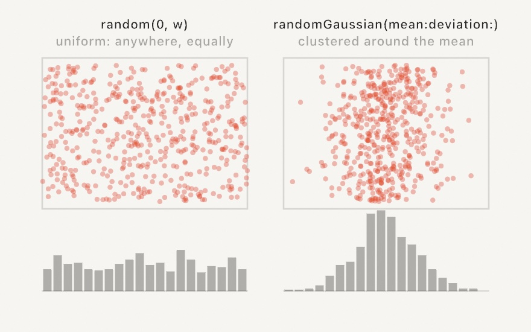
</picture>

`random(a, b)` spreads values evenly, every part of the range equally likely, which makes a flat histogram. `randomGaussian()` piles them around a center in a bell. The **mean** is where the pile sits, and the **deviation** is how wide it spreads. About two thirds of values land within one deviation of the mean. Uniform reads as "scattered", Gaussian as "clustered, with strays", and [Chapter 4](04-Randomness.md) shows when each texture is the right one.

### Rare but huge: a heavy tail

<picture>
  <source media="(prefers-color-scheme: dark)" srcset="Images/04-Randomness/WalkFamily-dark.jpg">
  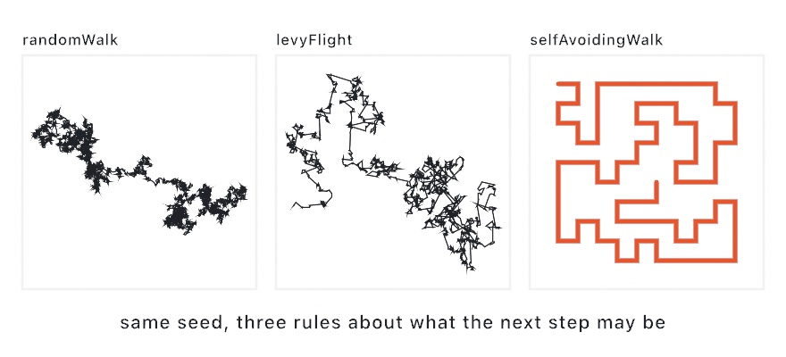
</picture>

The **tail** of a distribution is its far end, the values that almost never come up. A Gaussian's tail thins fast, so a value three deviations from the mean is rare. A **heavy tail** thins slowly. Most draws stay small, and now and then one is enormous. [Chapter 4](04-Randomness.md)'s Lévy flight takes its step lengths from a heavy tail. That is why the middle walk here moves in tight clusters and then leaps far.

### Even over a disk: the square root

<picture>
  <source media="(prefers-color-scheme: dark)" srcset="Images/B-JustEnoughMath/SquareRootSpread-dark.jpg">
  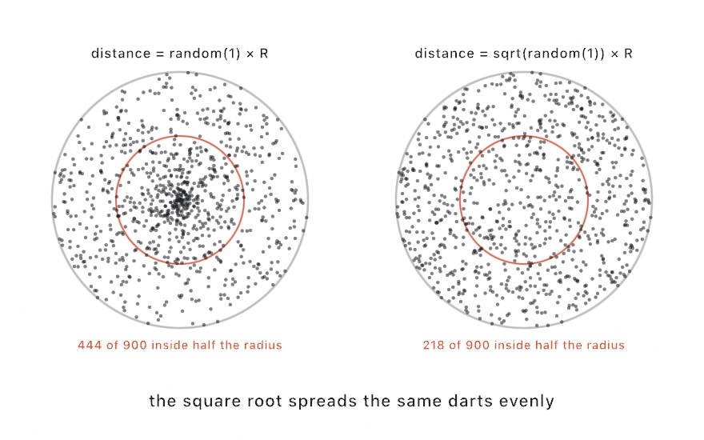
</picture>

To scatter points in a disk, pick an angle and a distance from the center. A plain distance, `random(1)` times the radius, crowds the points toward the middle. Half of them land within half the radius, but that inner circle holds only a quarter of the disk's area. The square root fixes it. With `sqrt(random(1))` as the fraction, a quarter of the points land within half the radius, which matches the area. The picture counts them. With the plain distance, 444 of 900 dots land inside the orange circle, and with the square root, 218 do, about a quarter. [Chapter 29](29-Landscapes.md) places its trees this way. [Chapter 16](16-CurvesAndFigures.md)'s sunflower spreads its seeds by the square root of their number for the same reason.

### Chance is lumpy

<picture>
  <source media="(prefers-color-scheme: dark)" srcset="Images/04-Randomness/ScatterCompare-dark.jpg">
  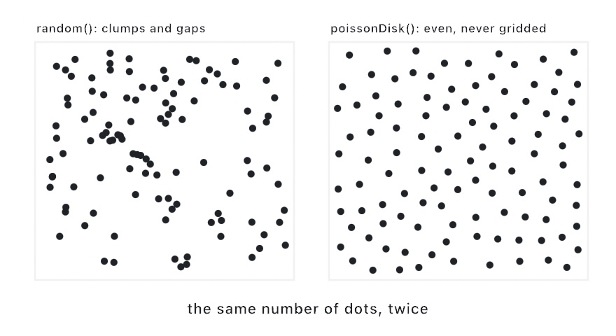
</picture>

Independent random placements clump and leave holes, because each roll ignores every other. Clumps are what independent rolls look like, even from a good generator. When you want "random but even", you need an algorithm that pushes points apart, like the blue-noise scatter on the right. [Chapter 4](04-Randomness.md) names the lump problem and fixes it with blue noise, and [Chapter 15](15-ShapesAsMaterial.md) scatters the same way inside a shape.

### The random walk

<picture>
  <source media="(prefers-color-scheme: dark)" srcset="Images/04-Randomness/WalkVsJumps-dark.jpg">
  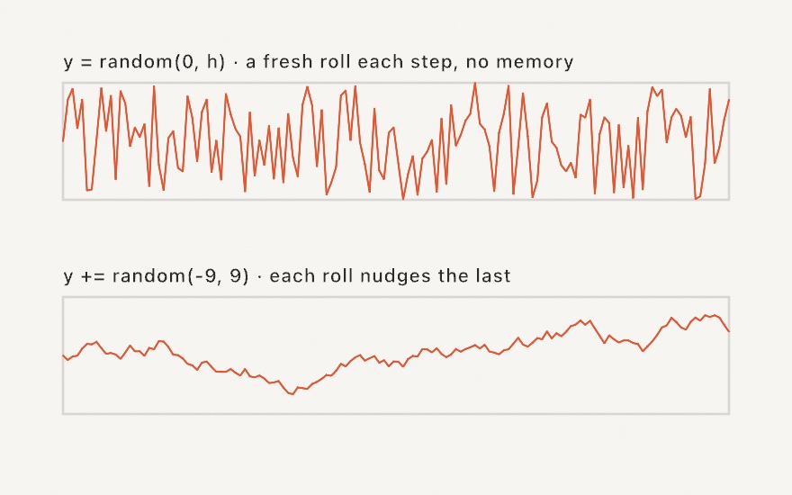
</picture>

Re-roll a position every frame and you get a jagged hash with no memory. *Accumulate* small random nudges instead (`x += random(-2, 2)`) and a path appears, because each position remembers all the nudges before it. That one change, re-rolling or accumulating, is the difference between a jagged hash and a wandering path. [Chapter 4](04-Randomness.md) builds its random walks this way.

## Noise

### Coherence: a fixed, smooth landscape

<picture>
  <source media="(prefers-color-scheme: dark)" srcset="Images/05-Noise/RandomVsNoise-dark.jpg">
  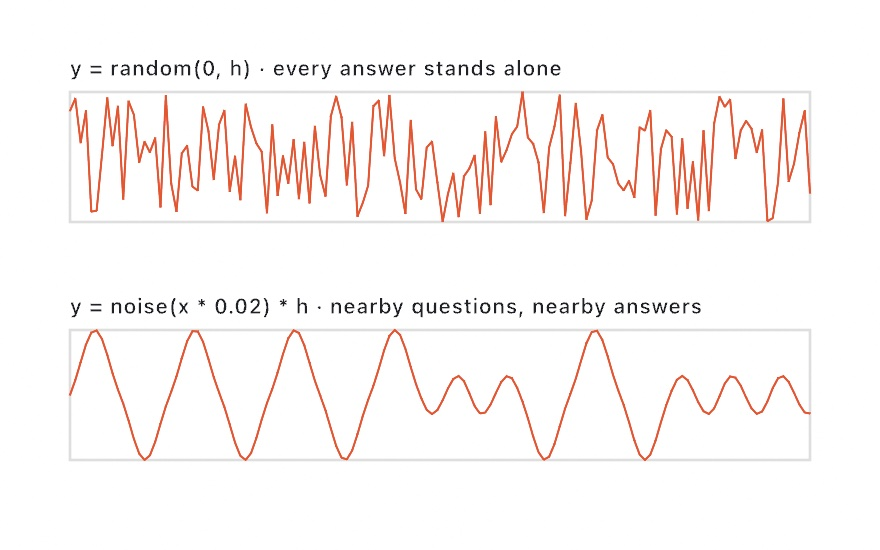
</picture>

`noise(x)` is a *lookup* into a fixed, smooth landscape of values. Nearby inputs land on nearby outputs, so a sequence of close questions traces a rolling curve instead of a hash. This property is called coherence. It is what separates noise from random, and [Chapter 5](05-Noise.md) builds on it throughout.

### The input multiplier is a zoom control

<picture>
  <source media="(prefers-color-scheme: dark)" srcset="Images/05-Noise/NoiseZoom-dark.jpg">
  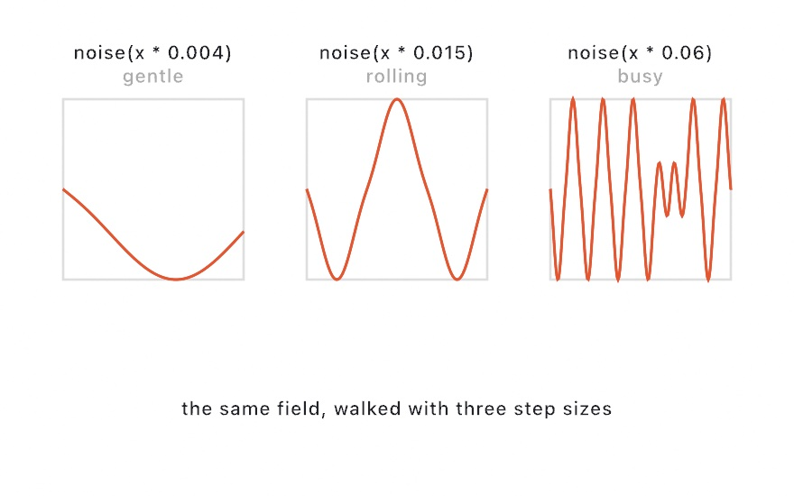
</picture>

The multiplier in `noise(x * scale)` sets how far apart your questions land on the landscape. The landscape itself stays the same. A small multiplier asks about points close together and sees one broad feature, while a large one steps across many hills and sees busy detail. When noise looks wrong, try changing this multiplier first. [Chapter 5](05-Noise.md) calls it the zoom multiplier.

### A field of answers, drifting in time

<picture>
  <source media="(prefers-color-scheme: dark)" srcset="Images/05-Noise/NoiseTerrain-dark.jpg">
  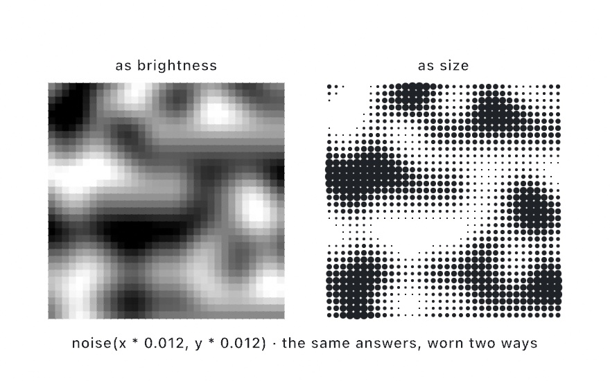
</picture>

Give noise two inputs and it answers everywhere on a plane. That's a **field**, one value per position, which you can render as brightness, dot size, or anything else. A third input works as time, sliding the whole landscape smoothly so the field changes without jumping. And because far-apart regions of the landscape don't resemble each other, offsetting your questions (`noise(t + 1000)` vs `noise(t)`) yields independent signals from one field. Most of [Chapter 5](05-Noise.md) works with fields like this.

### Layering scales

<picture>
  <source media="(prefers-color-scheme: dark)" srcset="Images/05-Noise/NoiseLayers-dark.jpg">
  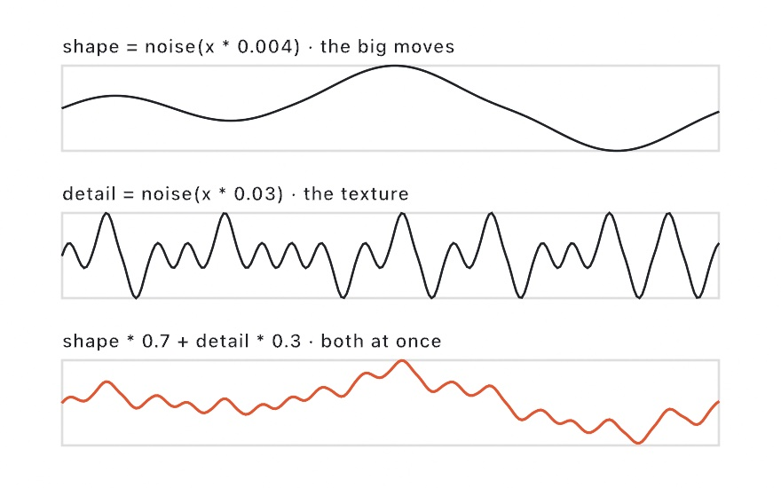
</picture>

Natural forms have big shapes *and* fine texture. So take noise at both scales and add them, weighted mostly toward the broad curve and a little toward the busy one. Keep the weights summing to 1 and the result stays in range. Stack a few layers like that (each smaller and fainter) and you get the fractal texture that `fbm` gives in one call. [Chapter 5](05-Noise.md) builds it by hand first, so you know what that call does.

### Distance to the nearest point makes cells

<picture>
  <source media="(prefers-color-scheme: dark)" srcset="Images/05-Noise/CellsFromPoints-dark.jpg">
  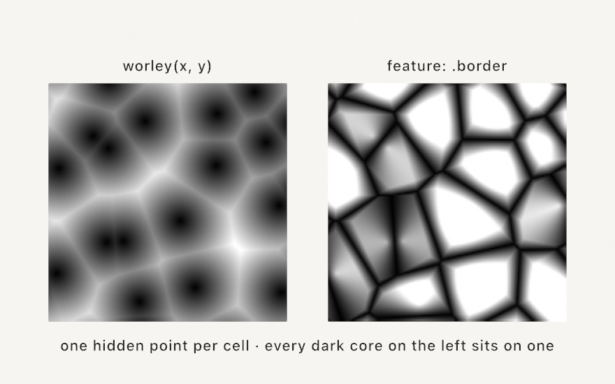
</picture>

Scatter points across a plane, then ask everywhere how far the nearest one is. The answers are small beside each point and peak on the walls between two, so shading them divides the plane into cells, one per point. Asking instead how much *farther* the second-nearest point is gives a value that is zero on those walls. Shading it draws the walls as dark lines. [Chapter 5](05-Noise.md) meets this as `worley`, the cellular member of the noise family.

## Moving the paper

### Transforms move the paper, not the shape

<picture>
  <source media="(prefers-color-scheme: dark)" srcset="Images/06-GridsAndRepetition/TransformSteps-dark.jpg">
  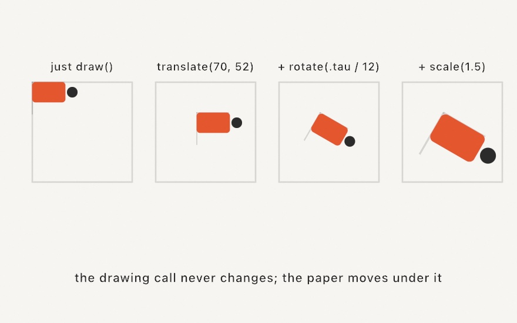
</picture>

`translate`, `rotate`, and `scale` don't touch your shapes. They move the paper under the pen. Every draw call afterward lands in the moved frame, and later transforms build on earlier ones (translate then rotate is not rotate then translate). The habit that makes this easy is to draw your motif *around the origin*, with (0, 0) at its center. Then translate to where it goes and rotate. It pivots about its own center instead of swinging around a distant corner. [Chapter 6](06-GridsAndRepetition.md) uses this to draw one thing many ways, with `withState { }` to undo the moves after each copy.

### Small moves compound


Repeat "move a little, turn a little, draw" without resetting, and the little moves stack, because each copy starts where the last one ended. A straight repetition then curls into an arc, a spiral, or a helix if you lift by a step each time. `withState { }` controls where the moves reset. Resets between copies give you a grid, and no resets give you a staircase. [Chapter 6](06-GridsAndRepetition.md) shows both in 2D, and [Chapter 26](26-3DGently.md) builds these stairs with the same loop.

### The plane turned inside out: inversion in a circle

<picture>
  <source media="(prefers-color-scheme: dark)" srcset="Images/B-JustEnoughMath/CircleInversion-dark.jpg">
  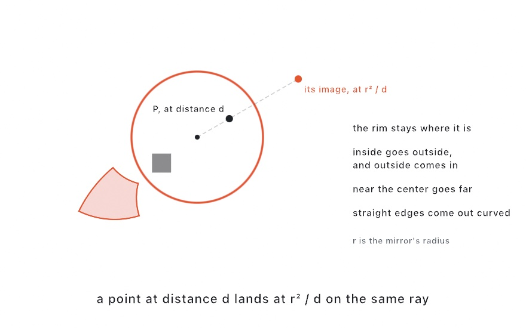
</picture>

Inversion in a circle moves every point along the line from the circle's center through it. A point at distance d from the center lands at r² / d, where r is the circle's radius. Points on the circle stay where they are, points inside go outside, and points near the center go far away. Inverting twice brings every point back, so the circle works like a mirror. A circle comes out as another circle, or as a straight line when it passes through the center. In reverse, a straight line that misses the center comes out as a circle through the center. So the gray square in the picture comes out with curved sides, and its corner nearest the center lands farthest away. Since circles come out as circles, [Chapter 22](22-IteratedForms.md#circles-used-as-mirrors-inversion-limit-sets)'s limit sets are made of round shapes.

### Four corners anywhere: corner pinning

<picture>
  <source media="(prefers-color-scheme: dark)" srcset="Images/45-Installations/FittingTheWall-dark.jpg">
  
</picture>

Translate, rotate, and scale keep parallel lines parallel. A projector aimed at a wall from an angle turns the picture's rectangle into a lopsided four-sided shape. Fixing that takes one more kind of move. A **projective map** sends the four corners of a square to any four points and carries everything between them along. Straight lines stay straight, but equal steps no longer stay equal, the way a road's stripes crowd together toward the horizon. [Chapter 45](45-Installations.md) fits a projector to a wall by dragging the four corners, and Paul Heckbert set out the math in 1989.

## Vectors, motion, and forces

### A vector is a point and an arrow

<picture>
  <source media="(prefers-color-scheme: dark)" srcset="Images/10-Vectors/VectorArithmetic-dark.jpg">
  
</picture>

A `Vector2` is two numbers with two readings. It's a *place*, meaning a position, or a *way to move*, meaning a direction with a length. Each operation has a picture. Adding chains arrows head to tail, and `target - position` is the arrow *from* here *to* there. Multiplying by a number stretches or shrinks the arrow, and a negative number flips it. An arrow's `length` comes from Pythagoras. `normalized` keeps its heading at length exactly 1, ready to be scaled to any speed you want. [Chapter 10](10-Vectors.md) teaches all of this, one step at a time.

### The motion trio

<picture>
  <source media="(prefers-color-scheme: dark)" srcset="Images/10-Vectors/MotionTrio-dark.jpg">
  
</picture>

Motion is three vectors in a strict chain. **Acceleration** changes velocity, **velocity** changes position, and never the other way around. Each frame runs `velocity += acceleration` and then `position += velocity`. Steer a thing by pushing on its acceleration and letting the chain pass the push on to velocity and position. The lag between push and path is where the lifelike feel comes from. At the canvas's edges you choose a policy. *Wrap* sends a thing out one side and back in the other. *Bounce* flips the velocity component that hit, usually keeping less than all of it. The trio arrives in [Chapter 10](10-Vectors.md), and the forces and flocks of [Chapter 11](11-ForcesAndPhysics.md) and [Chapter 12](12-FlocksAndSwarms.md) are built on it.

### Steering is a correction

<picture>
  <source media="(prefers-color-scheme: dark)" srcset="Images/10-Vectors/SteeringMove-dark.jpg">
  
</picture>

A creature that cannot jump straight to its target steers by correcting its course. Compute the velocity it *wants*, toward the target at full speed, then subtract the velocity it *has*. The difference is the correcting force, capped so the turn takes time. In code, that is `desired - velocity`. That one subtraction, re-aimed, becomes seek, flee, arrive, and wander in [Chapter 10](10-Vectors.md) and [Chapter 12](12-FlocksAndSwarms.md).

### Forces add; mass divides

<picture>
  <source media="(prefers-color-scheme: dark)" srcset="Images/11-ForcesAndPhysics/ForceAccumulation-dark.jpg">
  
</picture>

A force is a push with a direction, and simultaneous pushes on one body add, tip to tail, into one total. What the body *does* with the total depends on its mass, through `acceleration = force / mass`. So the same wind barely moves a boulder and flings a leaf. Real gravity is the special case that scales *with* mass, so after the division everything falls alike. Drag doesn't scale that way, which is why a feather drifts. [Chapter 11](11-ForcesAndPhysics.md) builds its confetti on this difference.

### Weaker with distance: the inverse square

<picture>
  <source media="(prefers-color-scheme: dark)" srcset="Images/B-JustEnoughMath/InverseSquare-dark.jpg">
  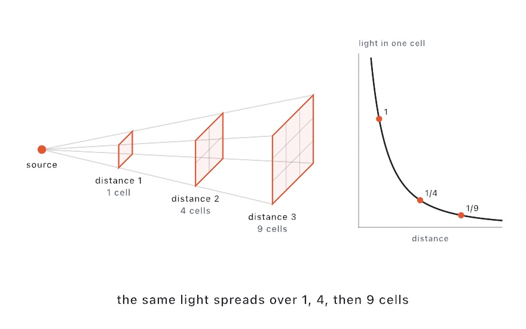
</picture>

Light from a point spreads out as it travels. At twice the distance, the same light covers four times the area, so each part of it gets a quarter as much. At three times the distance, each part gets a ninth. That is the **inverse square**: the strength falls as one over the distance squared. Its curve in the picture falls steeply near the source and flattens farther out. Gravity follows the same rule, and it is how [Chapter 11](11-ForcesAndPhysics.md)'s `NBody` pulls its bodies together. [Chapter 29](29-Landscapes.md) says why its lamps use a gentler curve that ends.

### Floating: the weight of the water pushed aside

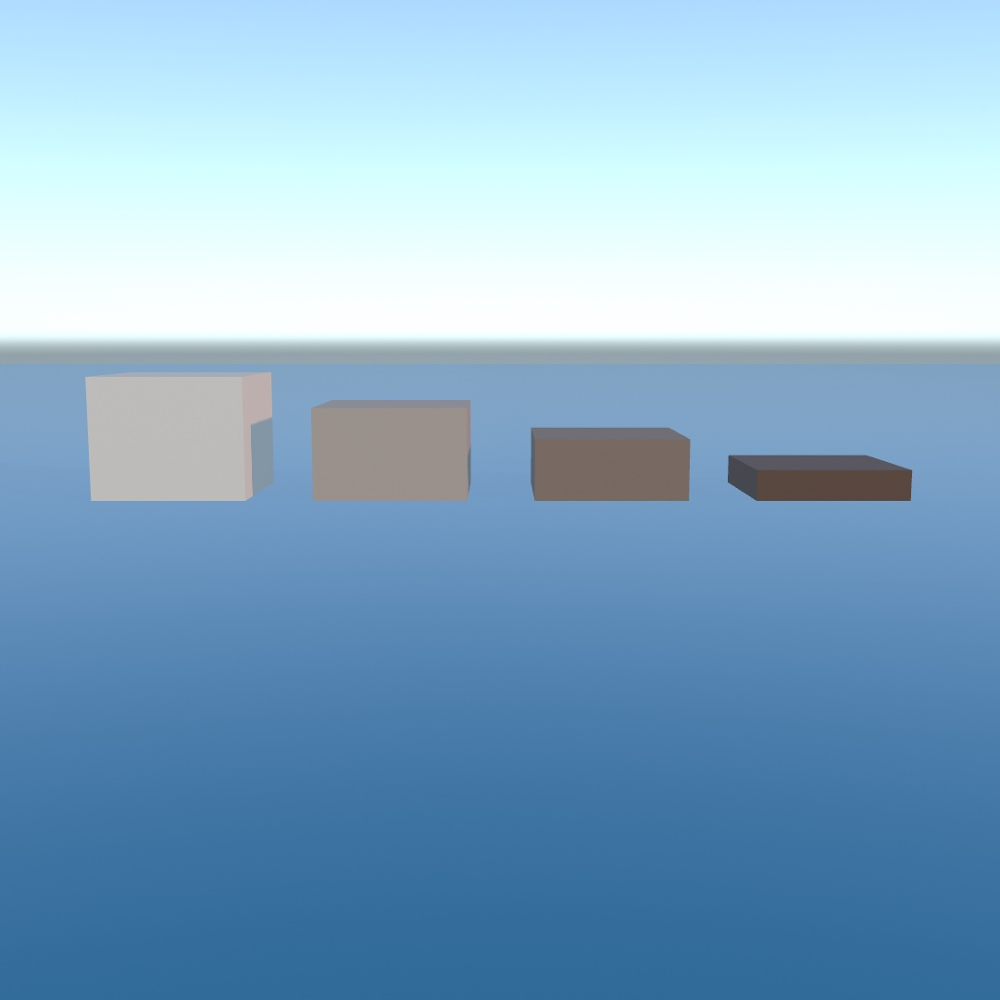

A body in water sinks until the water it pushes aside weighs as much as the body. That is Archimedes' principle. So a body half as dense as water floats with half of itself under the surface. One at 0.8 of the water's density floats low, with a fifth above. [Chapter 30](30-WorldsWithWeight.md) works each crate's waterline out from its density alone.

### The spring's rule

<picture>
  <source media="(prefers-color-scheme: dark)" srcset="Images/11-ForcesAndPhysics/SpringRestLength-dark.jpg">
  
</picture>

A spring is built around one number, its **rest length**. When it is longer than that, it pulls its ends together. When it is shorter, it pushes them apart, and at its rest length it does nothing. The correction grows with the error (twice as stretched, twice the pull), and **stiffness** scales how sharply it acts. Everything soft in [Chapter 11](11-ForcesAndPhysics.md), from ropes to blobs, is dots connected by this one rule.

### Damping: a swing that dies away

<picture>
  <source media="(prefers-color-scheme: dark)" srcset="Images/B-JustEnoughMath/Damping-dark.jpg">
  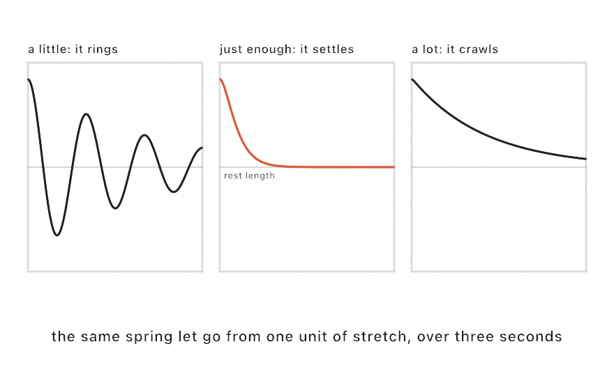
</picture>

A spring on its own would swing forever. **Damping** is a force against the velocity, and it takes a little energy out of every swing. With a little damping the spring rings for a long time. With a lot, it creeps back without swinging at all. Between the two is the amount that settles soonest without passing the rest length. In the picture, that amount, in orange, settles within about a second, while the other two have not settled after three seconds. [Chapter 3](03-MotionAndTime.md)'s `@Sprung` sets this with `bounce`, and in [Chapter 11](11-ForcesAndPhysics.md) the world's built-in drag calms the springs.

### Verlet: motion without a velocity

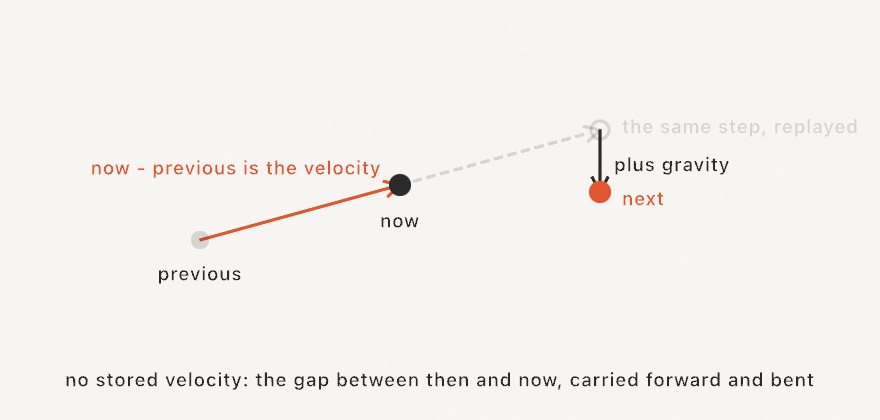

Verlet integration stores no velocity at all. It remembers where the particle *was* last frame. The gap between then and now *is* the velocity, so each step replays that gap and bends it by the frame's forces. This makes Verlet steady under constraints. When a spring pulls a particle somewhere new, its velocity changes with it. There is no stored velocity that could fall out of step with the position. The particles in [Chapter 11](11-ForcesAndPhysics.md)'s physics world move this way, which is part of why its springs and piles stay calm.

### One second is one second

<picture>
  <source media="(prefers-color-scheme: dark)" srcset="Images/03-MotionAndTime/DeltaTime-dark.jpg">
  
</picture>

`draw()` runs once per screen refresh, and screens refresh at different rates. So a fixed "move 2 pixels per frame" travels twice as far per second at 120 Hz as at 60. There are two fixes. Derive positions from `time` directly, or scale each step by `deltaTime`, the seconds since the last frame, so per-frame steps become per-second speeds. Simulations sometimes choose a third option on purpose, a *fixed* step per tick. That gives up frame-rate independence so that every run repeats the same way. [Chapter 3](03-MotionAndTime.md) sets the rule, and [Chapter 12](12-FlocksAndSwarms.md) explains the trade.

## Fields and following them

### A field: a question answered everywhere

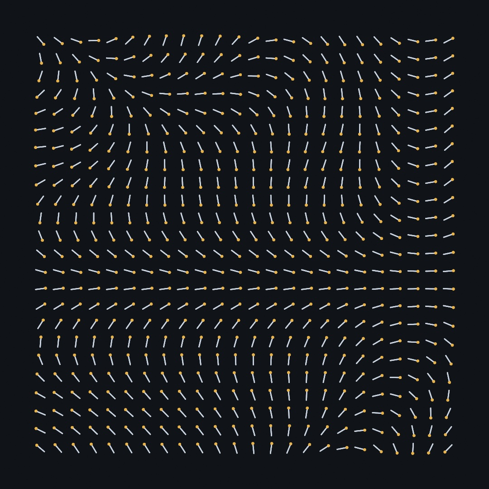

A field is a rule that answers a question at *every* point of the plane. "How bright here?" gives a number field, and noise is one. "Which way here?" gives a direction field. The field itself is invisible and continuous, and the needles in the picture are only samples of it on a grid. The flow work in [Chapter 14](14-FieldsAndFlow.md) and the terrain in [Chapter 5](05-Noise.md) are the same idea with different questions.

### Following a field: ask, step, ask again

<picture>
  <source media="(prefers-color-scheme: dark)" srcset="Images/14-FieldsAndFlow/TraceSteps-dark.jpg">
  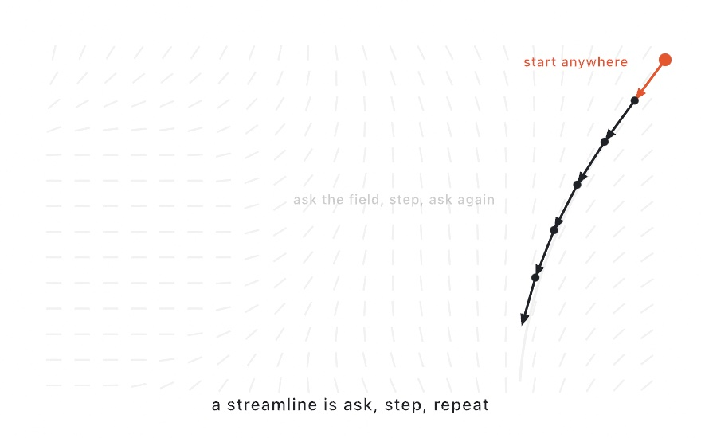
</picture>

To trace a line through a direction field, ask the field which way at your position, take a small step that way, and repeat. That loop is Euler integration, and its one parameter is the step size. Big steps cut corners where the field bends, while small steps follow it closely but need more questions. Every streamline in [Chapter 14](14-FieldsAndFlow.md) is this loop running until it's told to stop.

### Optical flow: a measured field

<picture>
  <source media="(prefers-color-scheme: dark)" srcset="Images/34-Seeing/FlowArrows-dark.jpg">
  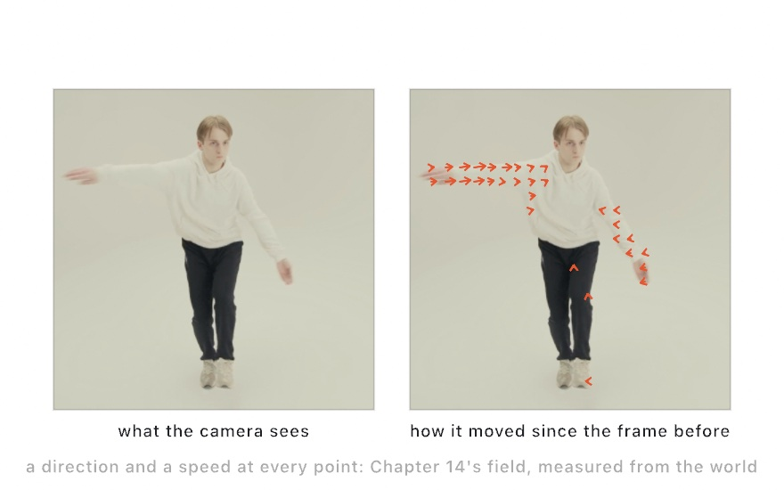
</picture>

Every field so far was invented, while optical flow is *measured*. Comparing one camera frame with the next assigns each point an arrow, "which way did the picture move here". The result is a direction field you can trace, carry particles through, or paint with, the same way as a field built from noise. The camera becomes a field generator in [Chapter 34](34-Seeing.md).

## Local rules, global structure

### Neighborhoods: who counts as nearby

<picture>
  <source media="(prefers-color-scheme: dark)" srcset="Images/12-FlocksAndSwarms/RuleAlignment-dark.jpg">
  
</picture>

Systems of many creatures need a definition of "nearby". That's a perception radius around each creature. Others inside it count, and others outside it are ignored. Every flocking rule in [Chapter 12](12-FlocksAndSwarms.md) is an average over that circle. The radius changes how the group behaves. Small circles make creatures that jitter on their own, and large circles make them move together.

### Everyone against everyone: counting pairs

<picture>
  <source media="(prefers-color-scheme: dark)" srcset="Images/B-JustEnoughMath/EveryPair-dark.jpg">
  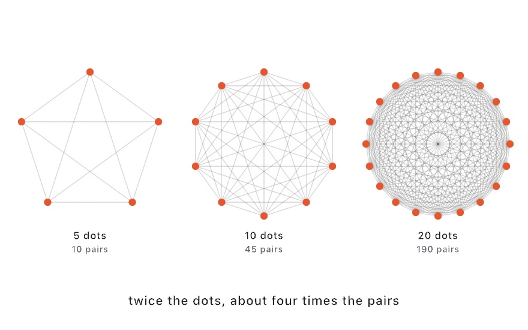
</picture>

Asking every creature about every other one grows fast. A group of n things has n × (n − 1) / 2 pairs, about half of n squared. So twice the things make about four times the pairs. In the picture, 10 dots make 45 pairs, and 20 make 190. Growth like this, with the square of the count, is called **quadratic**. With 300 boids each looking at the other 299, a frame makes about 90,000 looks, two for each of the 44,850 pairs. That is where [Chapter 12](12-FlocksAndSwarms.md) starts before it cuts the plane into cells and asks only the nearby ones.

### Emergence: local rules, large patterns

<picture>
  <source media="(prefers-color-scheme: dark)" srcset="Images/23-GridSimulations/LifeRules-dark.jpg">
  
</picture>

No cell in the Game of Life knows what the board looks like. Each one asks only its eight neighbors and follows three lines of rules, and gliders, blinkers, and other patterns appear with no one planning them. Other systems work the same way. Truchet tiles in [Chapter 7](07-Tiles.md) agree only at their shared edges, yet loops and mazes appear. Boids in [Chapter 12](12-FlocksAndSwarms.md) know only their circle, yet the flock turns as one. Reaction-diffusion in [Chapter 23](23-GridSimulations.md) asks even less and builds coral. When a pattern looks globally planned, look for the local law first.

### Constraint propagation

<picture>
  <source media="(prefers-color-scheme: dark)" srcset="Images/07-Tiles/TilesAgree-dark.jpg">
  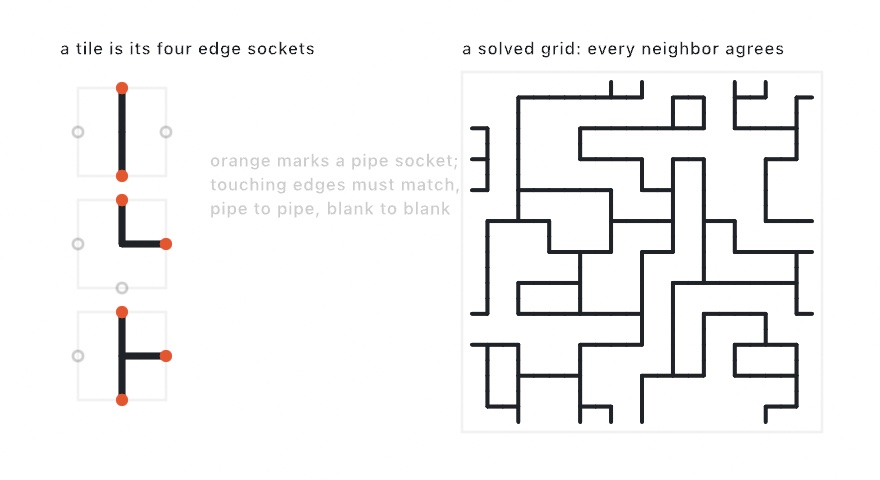
</picture>

Wave Function Collapse solves a grid the way you solve sudoku. Every cell starts as "could be anything", and each placement rules options out of its neighbors, which rule options out of theirs. The solver always settles the most-constrained cell next (the one with fewest options left), because that's where a contradiction would surface soonest. One local law, "edges must match", spread from cell to cell, makes the grid fit together everywhere. [Chapter 7](07-Tiles.md#every-neighbor-must-agree-wave-function-collapse) solves a pipe network with it.

### A parameter space is a map

<picture>
  <source media="(prefers-color-scheme: dark)" srcset="Images/23-GridSimulations/FeedKillMap-dark.jpg">
  
</picture>

Two parameters span a plane, where every pair of settings is a point. A system's behaviors live in *regions*, spots here, mazes there, and dead calm over wide stretches. Render the map, one small run per grid cell, and you can see which settings give which behavior. Interesting settings cluster along the borders between regions. [Chapter 23](23-GridSimulations.md) maps Gray-Scott's feed and kill this way.

## Iteration: a rule applied again

### Recursion: a rule applied to its own output

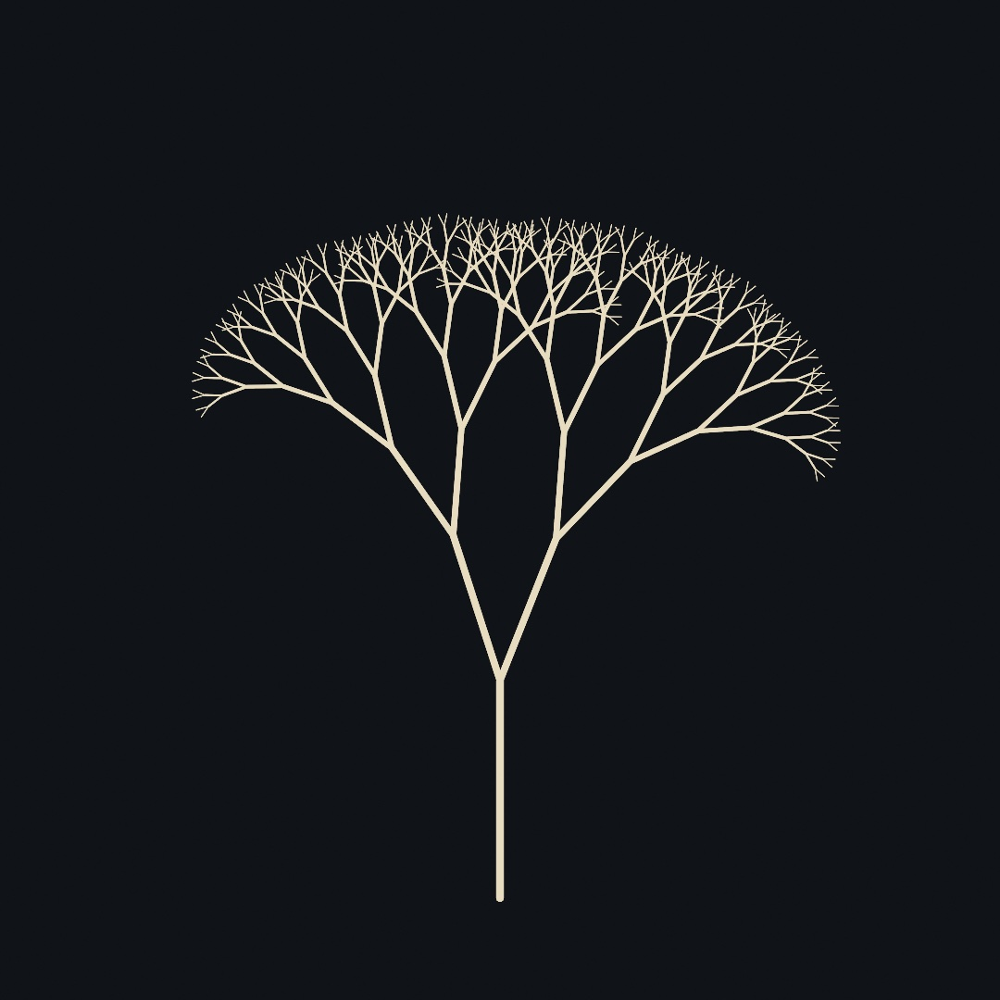

A branch is a stick with two smaller branches on top, and each of *those* is a stick with two smaller branches on top. A function that calls itself expresses that directly. It needs two rules. Something must shrink on each call, the length here, so each branch is smaller than the one below it. And a floor must say when to stop, a depth counter, or the calls would never end. Since every level doubles the branches, n levels end in 2ⁿ⁻¹ tips, so nine levels make a canopy of 256 tips. [Chapter 13](13-GrowingThings.md) grows this tree from one short function.

### Rewriting growth

<picture>
  <source media="(prefers-color-scheme: dark)" srcset="Images/13-GrowingThings/LSystemExpansion-dark.jpg">
  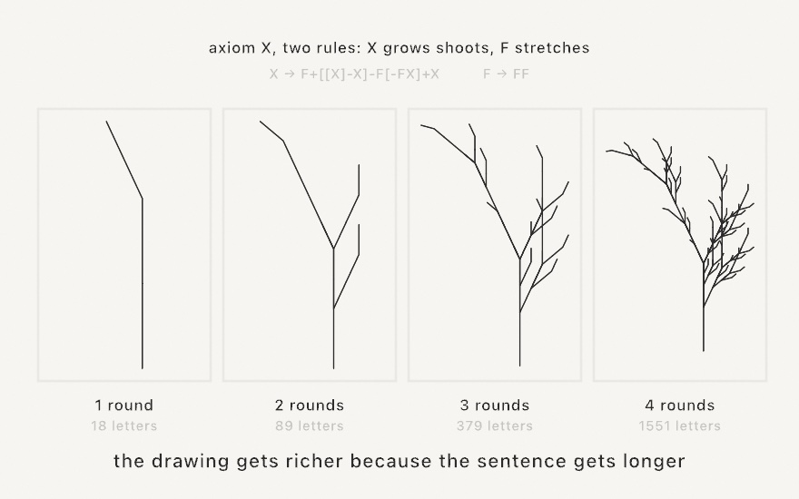
</picture>

An L-system grows a *sentence* first and draws it afterward. Start from an axiom, replace every symbol by its rule, and repeat. The string lengthens exponentially. A turtle then walks the final string, reading symbols as "forward", "turn", "branch". The drawing gets richer only because the sentence got longer, so the plant's shape comes from the rewriting rules. [Chapter 13](13-GrowingThings.md) grows its fern and the garden's row of plants this way.

### Iterated maps: orbits that pile up


Take a formula, feed it a point, feed it its own answer, and keep going, and the visited points form an **orbit**. For most formulas the orbit shoots away or settles into a dot. For special ones it wanders forever inside a bounded shape, the **attractor**. Plotting a million faint points shows where it goes most often. The plates in [Chapter 22](22-IteratedForms.md) are visit counts drawn as brightness.

### Escape time

<picture>
  <source media="(prefers-color-scheme: dark)" srcset="Images/22-IteratedForms/FractalPair-dark.jpg">
  
</picture>

Iterate a formula at every pixel and ask one question. How many rounds until the value flies off past a bound? Points that never escape are painted as the inside of the set. Everywhere else the *count itself* becomes the color. Points that took about the same number of rounds get about the same color, and that is what makes the bands. Which of the formula's two numbers you hold still decides which fractal you get. The marked point in the first panel is the one whose Julia set sits beside it. [Chapter 22](22-IteratedForms.md) shades both this way.

## Shapes as regions

### Set operations on regions

<picture>
  <source media="(prefers-color-scheme: dark)" srcset="Images/15-ShapesAsMaterial/BooleanOps-dark.jpg">
  
</picture>

Treat shapes as *regions of space* and logic applies to them. Union is "in either", the or. Intersection is "in both", the and. Subtraction is "in one but not the other", the and-not. Symmetric difference is "in exactly one", the xor. [Chapter 15](15-ShapesAsMaterial.md) uses them to build forms no single primitive could draw.

### Offsets: growing and shrinking

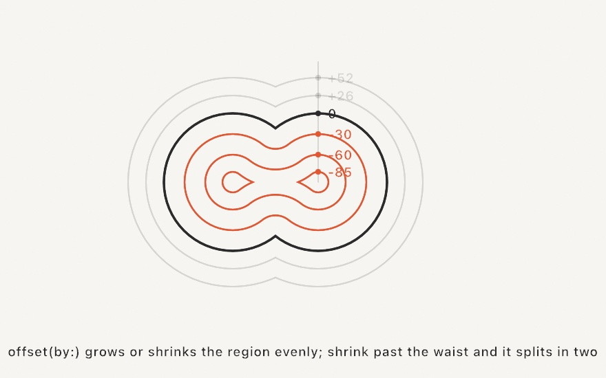

Offsetting moves a region's whole boundary by the same distance everywhere, so outward grows it and inward shrinks it. But an inset, an inward offset, is not a scaled-down copy. Narrow passages thin faster than broad ones, and a deep enough inset pinches the waist apart into islands. The split is useful, since it marks where the shape is thin. [Chapter 15](15-ShapesAsMaterial.md) uses offsets for insets, outlines, and plotter work.

### Convexity: the rubber band

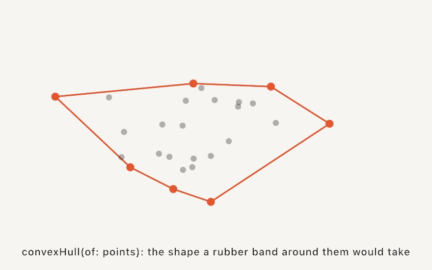

A region is convex if the straight line between any two of its points stays inside it, with no dents. The convex hull of a scatter is the smallest convex region containing all of it. It is the shape a rubber band takes when you let it close around the points. Walking its boundary, you turn in only one direction. [Chapter 15](15-ShapesAsMaterial.md) uses hulls to wrap scatters into clean silhouettes.

### Duality: two readings of one point set

<picture>
  <source media="(prefers-color-scheme: dark)" srcset="Images/15-ShapesAsMaterial/Duals-dark.jpg">
  
</picture>

One set of points supports two structures. Each point's Voronoi cell is the territory closer to it than to any other point. The Delaunay triangulation connects each point to its natural neighbors. They're duals, two answers to "who's near whom", since cells share an edge exactly when their points share a triangle edge. Mosaics use the territories, and networks and meshes use the neighbors. [Chapter 15](15-ShapesAsMaterial.md) builds with both.

## Color and light as numbers

### Numeric vs perceptual mixing

<picture>
  <source media="(prefers-color-scheme: dark)" srcset="Images/02-Color/MixingSpaces-dark.jpg">
  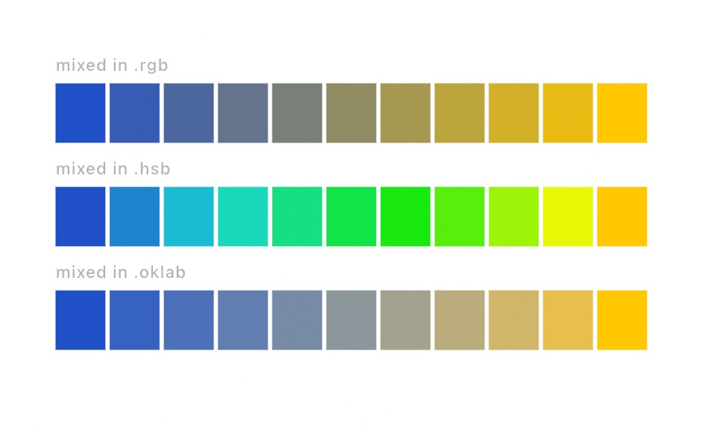
</picture>

Averaging two colors channel by channel gives the numeric midpoint, and your eye often disagrees with it. RGB's halfway between blue and yellow is a muddy olive. Perceptual spaces like OKLab are laid out so that numeric distance matches *seen* distance, and midpoints in them look like what you'd mix. More generally, whenever math on colors looks wrong, ask which space the math ran in. [Chapter 2](02-Color.md) shows the three rows side by side.

### Perceived brightness

<picture>
  <source media="(prefers-color-scheme: dark)" srcset="Images/09-Pictures/PixelSampling-dark.jpg">
  
</picture>

The eye doesn't weigh channels equally. Green counts most, red less, blue least, and the standard weights are 0.2126, 0.7152, 0.0722. Averaging r, g, and b rates a saturated blue as bright as a green, though the blue looks much darker. The weighted sum, luminance, matches what you see. Any effect driven by "how bright is this pixel", like the dot sizes here, needs the weighted version. [Chapter 9](09-Pictures.md) meets this the first time it reads pixels.

### Light and the number stored for it: linear light

<picture>
  <source media="(prefers-color-scheme: dark)" srcset="Images/B-JustEnoughMath/LinearLight-dark.jpg">
  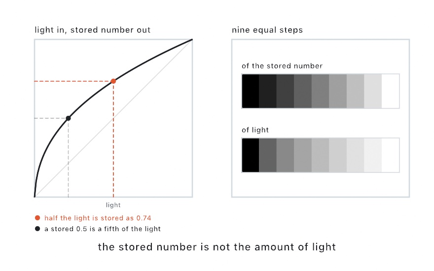
</picture>

A picture file stores a number for each pixel. That number gives more of its steps to dark tones, where the eye notices small changes most. That encoding is **sRGB**. The amount of light itself is called **linear light**, and it is what adds up and averages correctly. The two strips in the picture show the difference. Nine equal steps of the stored number look evenly spaced, while nine equal steps of light leave black at once and crowd toward white. On the curve, half the light is stored as about 0.74, and a stored 0.5 is about a fifth of the light. So Ollin mixes and blends in linear light, and turns the result back into stored numbers at the end. [Chapter 9](09-Pictures.md) averages pixels this way, and [Chapter 19](19-LayersAndEffects.md)'s blend modes add light the same way.

### What a device can show: gamut

<picture>
  <source media="(prefers-color-scheme: dark)" srcset="Images/42-MakingItPhysical/ProofBeforePrint-dark.jpg">
  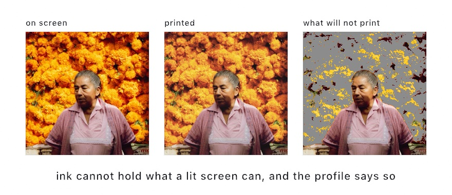
</picture>

The **gamut** of a screen or a printer is the range of colors it can make. The gamut of a color space is the range it can describe. A screen makes color from light, and a press from ink on paper, so each reaches colors the other cannot. The standard gamut for screens is sRGB. Display P3, a wider gamut that many Apple screens show, reaches more saturated reds and greens. Written in sRGB numbers, the way Ollin's `Color` holds it, a color outside sRGB has components below 0 or above 1. The gamut check of [Chapter 42](42-MakingItPhysical.md#seeing-the-print-before-you-print-it-soft-proofs) paints gray over what a press cannot print.

### Blend modes are arithmetic

<picture>
  <source media="(prefers-color-scheme: dark)" srcset="Images/19-LayersAndEffects/BlendModes-dark.jpg">
  
</picture>

Every blend mode is a small per-channel formula for combining the color being drawn with the color already there. Normal covers. Add sums, so light on light gets brighter. Multiply darkens like stacked filter gels, and screen brightens like layered projections. Lightest and darkest keep the lighter or the darker of the two. Once you read them as arithmetic, choosing one stops being trial and error. [Chapter 19](19-LayersAndEffects.md) draws with each of them.

### Density as tone

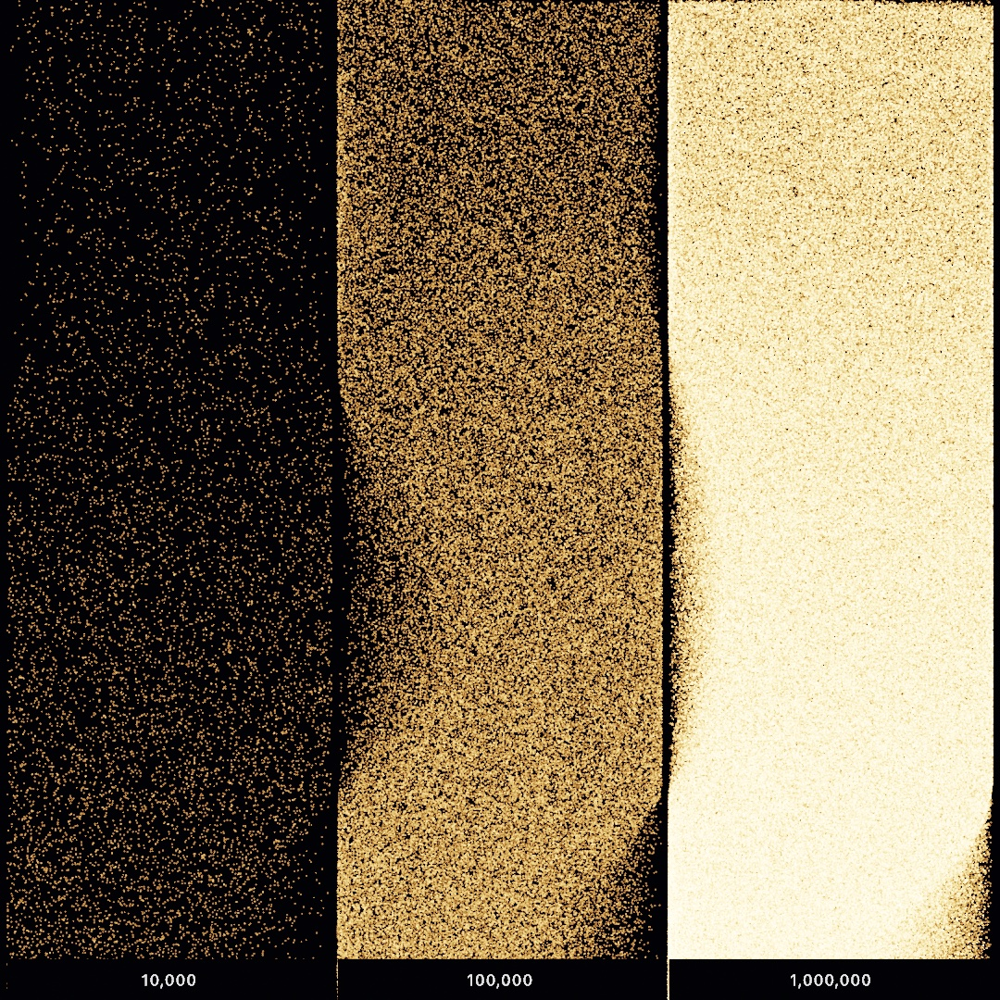

Draw one faint dot and you see a dot. Draw a million and you see a *material*, because overlapping near-transparent marks add up to smooth tone where they crowd. The count sets the texture, and each tenfold increase trades grain for smoothness. This is how attractor plates, sandpaintings, and [Chapter 25](25-ParticleSimulations.md)'s GPU grains all get their finish. It's also why they need so many particles.

### Light past 1, and bringing it back


Add enough light and channel values go past 1, brighter than the screen can show. Something must bring them back. **Clamping** chops everything at 1, so overlapping glows flatten into white slabs with hard seams. A **roll-off curve** like film's compresses the highlights gradually, keeping their tints on the way up. [Chapter 19](19-LayersAndEffects.md) covers when each is right.

### Feeding a picture back to itself

<picture>
  <source media="(prefers-color-scheme: dark)" srcset="Images/19-LayersAndEffects/FeedbackSteps-dark.jpg">
  
</picture>

Draw this frame on top of a transformed copy of the *last* frame, and the transform applies again every frame, which is iteration. A gentle zoom becomes an ever-deepening tunnel, a small rotation a tightening swirl, because each frame inherits all the transforms before it. Tiny changes each frame add up to large structure, as the staircase did in [Small moves compound](#small-moves-compound), but in pixels. [Chapter 19](19-LayersAndEffects.md) builds video feedback from it.

## Per-pixel thinking and distance

### A function from position to color

<picture>
  <source media="(prefers-color-scheme: dark)" srcset="Images/18-YourFirstShader/PixelGrid-dark.jpg">
  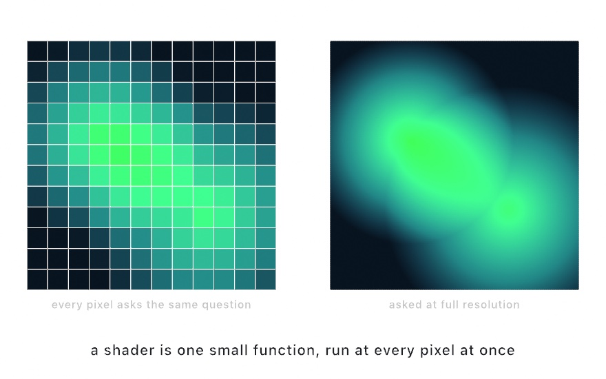
</picture>

A shader is one function answering one question, "what color at this position?", asked independently at every pixel. There's no canvas to accumulate onto and no loop you can see. The image is only hundreds of thousands of simultaneous answers, fusing smoothly because the function varies smoothly. Evaluate it coarsely and you can watch the answers before they fuse. [Chapter 18](18-YourFirstShader.md) starts pixel thinking here.

### Signed distance: how far, and which side

<picture>
  <source media="(prefers-color-scheme: dark)" srcset="Images/32-SculptingWithFields/FieldMap-dark.jpg">
  
</picture>

A signed distance field describes a shape by answering, at every point, "how far to the surface?". The *sign* says which side you're on. Negative is inside, positive is outside, and zero is exactly on the boundary. The shape stops being a list of vertices and becomes a question you can ask anywhere. [Chapter 32](32-SculptingWithFields.md) sculpts with shapes described this way.

### Level sets: an edge at a chosen distance

<picture>
  <source media="(prefers-color-scheme: dark)" srcset="Images/18-YourFirstShader/EdgeStep-dark.jpg">
  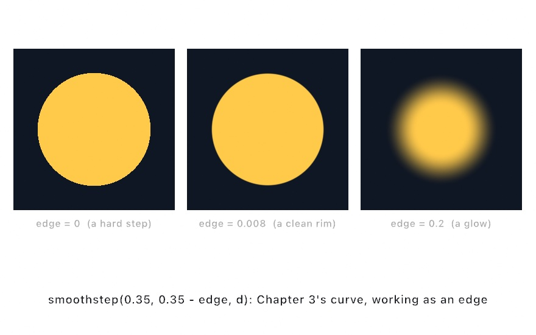
</picture>

Given a distance field, a shape is "all points within r". The edge lives where the distance crosses that level, like one contour line on a topographic map. Testing the crossing with `step` gives a hard edge. Testing it with a `smoothstep` window turns the same boundary into a crisp anti-aliased rim, or a wide glow if you widen the window. Every disc in [Chapter 18](18-YourFirstShader.md) is drawn this way, by turning each pixel's distance into how strongly it is painted.

### min melts, max trims

<picture>
  <source media="(prefers-color-scheme: dark)" srcset="Images/32-SculptingWithFields/MeltStrip-dark.jpg">
  
</picture>

Combine two distance fields and set operations come from two small functions. `min` keeps whichever surface is nearer, the union. `max` keeps the farther, the intersection, and negating one gives subtraction. Then there is the **smooth minimum**, a min with a blending radius. Where the two fields are nearly tied it dips below both, so the shapes join through a smooth neck instead of only touching. The `k` under each pair of circles is that radius, and the neck widens as `k` grows. [Chapter 32](32-SculptingWithFields.md) sculpts with the smooth minimum.

<picture>
  <source media="(prefers-color-scheme: dark)" srcset="Images/B-JustEnoughMath/SmoothMin-dark.jpg">
  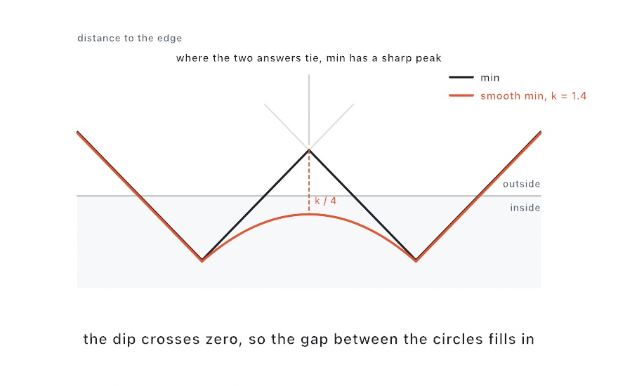
</picture>

This plot follows the line through the centers of two circles. The plain min comes to a sharp peak where the two distances tie, and the smooth min, in orange, rounds that peak off. At an exact tie the dip is a quarter of `k`. It shrinks as the two distances move apart and is gone once they differ by `k`. Here the dip takes the curve below zero, so the gap between the circles counts as inside and fills in.

### Sphere tracing: hop by what the field promises

<picture>
  <source media="(prefers-color-scheme: dark)" srcset="Images/32-SculptingWithFields/MarchRay-dark.jpg">
  
</picture>

To render a distance field, march a ray from the eye. Ask the field "how far to the nearest surface?", and since nothing can be closer than that answer, it is safe to hop that far. Repeat until a hop below a threshold counts as a hit. The hops shrink wherever the ray passes close to a surface and grow again in open space. There are no triangles, only a field asked a few dozen times per pixel. It's how all of [Chapter 32](32-SculptingWithFields.md)'s 3D sculptures reach the screen.

### Folding space

<picture>
  <source media="(prefers-color-scheme: dark)" srcset="Images/32-SculptingWithFields/DomainFold-dark.jpg">
  
</picture>

Instead of copying a shape n times, fold the *question*. Mirror the query point, wrap it into a repeating cell, or rotate it into one wedge before asking the field. The field still holds one shape, and each point asks it only once. The fold makes that shape appear at every point whose folded copy lands on it. A grid of a thousand copies costs the same as one. [Chapter 32](32-SculptingWithFields.md) mirrors, tiles, and fans with it.

## Into three dimensions

### An eye on a sphere

<picture>
  <source media="(prefers-color-scheme: dark)" srcset="Images/26-3DGently/Orbit-dark.jpg">
  
</picture>

Three numbers aim a camera at a thing: **azimuth** is how far around, **elevation** how far up, and **radius** how far away. Together they place an eye anywhere on a sphere around the target, which is why orbiting feels like turning an object in your hand. It's the polar-coordinates idea from the circle entries, plus one more angle for up. [Chapter 26](26-3DGently.md) drives its cameras with these three.

### Perspective, and who's in front


Perspective is one rule, that apparent size falls with distance, so equal spheres shrink as they recede. The **field of view** is the lens angle, wide exaggerating the shrink, narrow flattening it like a telephoto. And notice the hiding, because in 3D drawing order stops deciding who's in front. Every pixel remembers the depth of the nearest surface drawn so far and rejects anything farther, which is the **depth test**. [Chapter 26](26-3DGently.md) uses both.

### Which way a face points: the normal

<picture>
  <source media="(prefers-color-scheme: dark)" srcset="Images/B-JustEnoughMath/EdgesAndNormal-dark.jpg">
  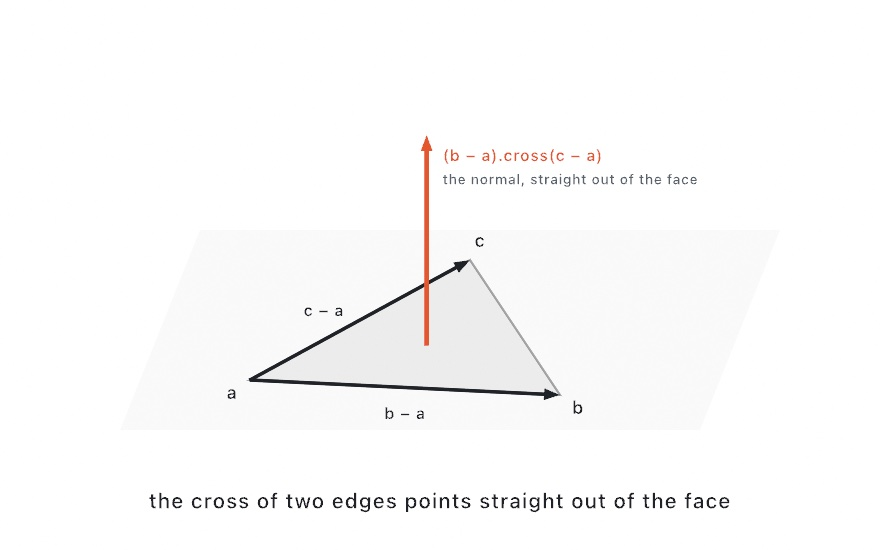
</picture>

A flat triangle faces one way, and the arrow standing straight out of it is its **normal**. Light needs it, because a face turned toward a lamp is lit and a face turned away is dark. Two edges from the same corner give it. The cross product of two directions is a third direction at right angles to both. So `(b - a).cross(c - a)` stands straight out of the face. Which side it comes out of depends on the order of the corners. Name them counter-clockwise as you look at the face, and the normal points toward you. In the picture, a, b, and c run counter-clockwise as you look down on the face, so the normal points up. [Chapter 26](26-3DGently.md#what-a-solid-is-made-of-triangles-and-normals) builds its solids from triangles and their normals.

### The pinhole: a pixel plus a depth is a ray

<picture>
  <source media="(prefers-color-scheme: dark)" srcset="Images/35-Depth/Unproject-dark.jpg">
  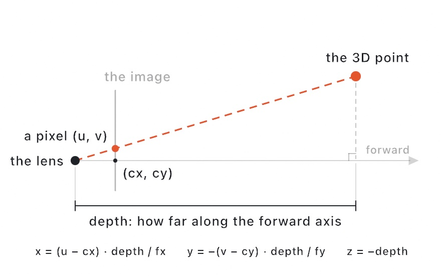
</picture>

A camera flattens the world by sliding every point down a ray through the lens. A depth sensor records how far in front of the camera each pixel's surface was. It measures along the camera's forward axis, not along the ray. Unprojection runs the flattening backward. Slide the pixel off the image center, scale by depth over focal length, and the 3D point returns. So a flat photo plus a flat depth map holds the 3D shape of everything the camera saw. [Chapter 35](35-Depth.md) builds its point clouds with this recipe.

### A pose places points in the world

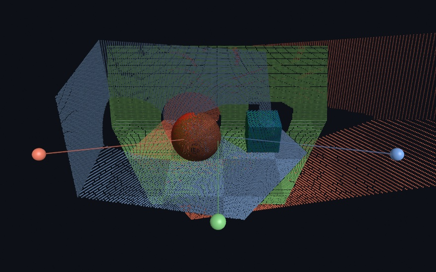

Points recovered from a camera come out in *its* frame, "two meters ahead of me", wherever "me" was. A **pose** is the transform recording where the camera stood and how it was turned. Applying it carries camera-frame points into one shared world frame. Do that for every frame of a moving sweep and the fragments fuse into a single room, each capture placed where its camera stood. [Chapter 35](35-Depth.md) fuses its scans this way.

### Occlusion voids: what the camera could not see


A depth image knows only what its rays touched, so nothing measured the space behind each object. View the cloud from where the camera stood and it looks whole. Step to the side and the voids open, holes in the shape of whatever stood in front. Only more viewpoints fill them. [Chapter 35](35-Depth.md) fills them by fusing frames from a moving camera.

## Sound as numbers

### The spectrum

<picture>
  <source media="(prefers-color-scheme: dark)" srcset="Images/37-Listening/Anatomy-dark.jpg">
  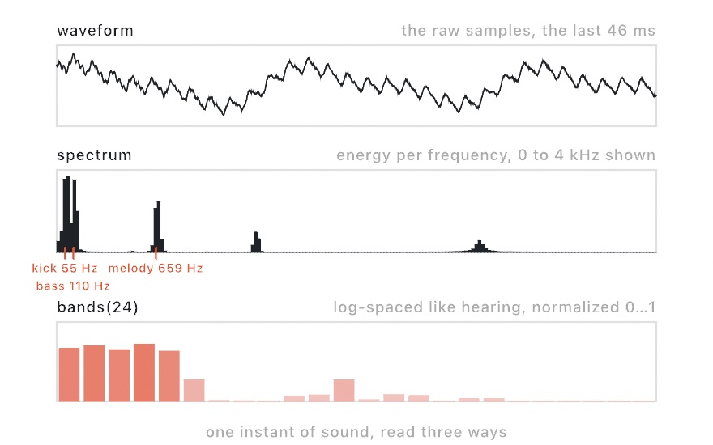
</picture>

Any sound, however messy, splits into a sum of pure vibrations. The spectrum reports the energy at each frequency in one moment, with bass at the left and treble at the right. To draw it well, you need one more fact. Hearing is logarithmic, and each *doubling* of frequency, an octave, sounds like one equal step. So band bars are usually log-spaced, which gives every octave the same width. If the bars were spaced evenly in hertz, the treble octaves would fill most of the axis. [Chapter 37](37-Listening.md) maps these bands onto pictures.

### Equal steps that multiply: log scales

<picture>
  <source media="(prefers-color-scheme: dark)" srcset="Images/40-MusicByRule/Sonification-dark.jpg">
  
</picture>

Some amounts are felt by ratio rather than by difference. The step from 220 Hz to 440 sounds the same as the step from 440 to 880, though the second is twice as many hertz. A **logarithmic scale** spaces values by their ratios, so each doubling takes the same distance. Spread notes evenly in hertz and the high ones bunch together when you hear them. Spread them evenly in semitones, a log scale, and they sit evenly, as the second and third rows here show. [Chapter 40](40-MusicByRule.md) spreads data this way, and [Chapter 22](22-IteratedForms.md)'s flames take the logarithm of their counts to fit a huge range into one picture.

### Pitch as ratios: octaves, semitones, and cents

<picture>
  <source media="(prefers-color-scheme: dark)" srcset="Images/40-MusicByRule/Tunings-dark.jpg">
  
</picture>

Doubling a frequency raises a note an octave, and every octave sounds like the same step, whatever note it starts on. Equal temperament splits the octave into twelve semitones of one ratio each. That ratio is the twelfth root of 2, about 1.0595, so twelve of them make exactly 2. **Cents** divide each semitone into a hundred, so an octave is 1200 cents. They measure how far apart two tunings put a note. A just major third, the ratio 5/4, is 386 cents, and equal temperament puts it at 400. [Chapter 40](40-MusicByRule.md) builds scales on the semitone and compares tunings in cents.

### A level in steps: decibels

<picture>
  <source media="(prefers-color-scheme: dark)" srcset="Images/B-JustEnoughMath/Decibels-dark.jpg">
  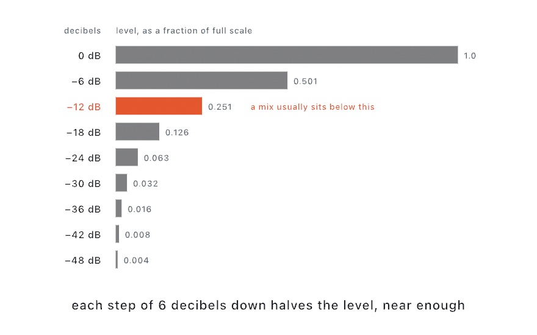
</picture>

Decibels count a sound's level by ratio, the way a log scale counts pitch. A level in decibels is 20 times the base-10 logarithm of the level as a fraction of full scale. So 0 dB is as loud as a sample can be. Every 6 decibels down about halves the level, and every 20 down divides it by ten. The orange bar in the picture marks -12 dB, and a level you would mix at sits somewhere under it. [Chapter 39](39-MakingSound.md)'s compressor and gate set their thresholds, and its limiter its ceiling, in decibels below full scale.

### Events, not levels

<picture>
  <source media="(prefers-color-scheme: dark)" srcset="Images/37-Listening/BeatTimeline-dark.jpg">
  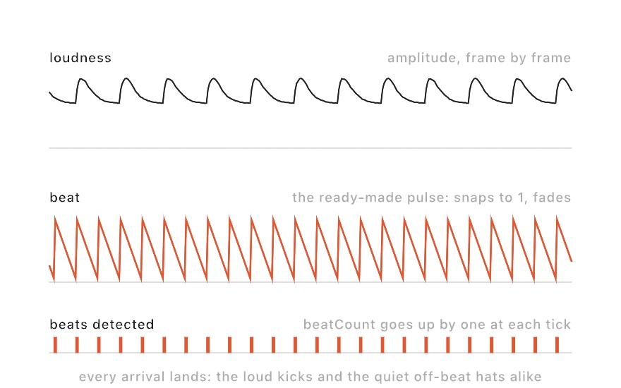
</picture>

Loudness is a level, while a beat is an *event*. You can't find events by watching a level's height, because a held chord stays loud without ever being "a hit". Detection compares each instant with the moment just before. A sudden rise above the recent trend is an arrival, and a short pause after each beat keeps one drum hit from counting twice. So the detector watches change over time rather than loudness. [Chapter 37](37-Listening.md) builds its beat-reactive sketches on that comparison.

---

[Contents](README.md#contents) · Previous: [Appendix A, Just enough Swift](A-JustEnoughSwift.md) · Next: [Appendix C, Coming from p5.js and Processing](C-ComingFromP5.md)
