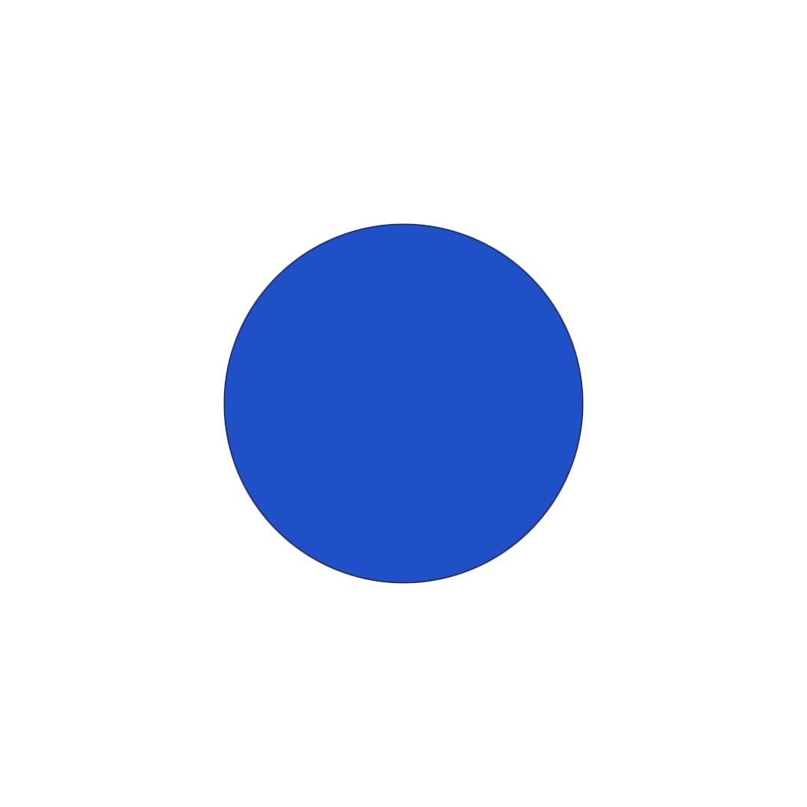

#### <sup>[Ollin](../README.md) → [Guide](README.md) → Appendix C</sup>

---

# C. Coming from p5.js and Processing

If you've sketched in p5.js or Processing, you already know how to think here. The model carries over whole: `setup()` runs once, `draw()` runs every frame, shapes paint in the order you call them, the origin is the top-left corner with y growing downward, angles are radians, and `fill` and `stroke` set the ink for everything drawn after them. Plenty of names survive unchanged too, from `width` and `mouseX` through `translate`, `strokeWeight`, `noise`, and `map`. Your instincts are right; mostly the spelling changes.

This appendix is the dictionary for the rest. It's a lookup page, not a lesson: the tables map the calls you know onto their Ollin spellings, and the sections after them cover what's different on purpose and the habits worth dropping at the border. Everything here is taught properly somewhere in the guide, so entries point at chapters as they go. The Swift language itself (types, `let` and `var`, optionals) has its own pages: the [Swift quick reference](../Docs/Swift.md) for a fast pass, Appendix A for the gentle one.

Tables show p5.js names. Processing's are the same, except where a row says otherwise.

## One sketch, twice

In p5.js:

```js
function setup() {
  createCanvas(1080, 1080);
}

function draw() {
  background(255);
  fill("#2050C8");
  circle(width / 2, height / 2, 480 + sin(frameCount * 0.03) * 160);
}
```

The same sketch in Ollin:

```swift
import Ollin

final class Pulse: Sketch {
    override func draw() {
        background(.white)
        fill(Color(hex: 0x2050C8))
        drawCircle(width / 2, height / 2, 240 + sin(time * 1.8) * 80)
    }
}
```



Save it as `Pulse.swift`, run `swift run OllinLive Pulse.swift`, and it breathes like the original. Reading the two against each other shows most of what this appendix has to say:

- **The sketch is a class.** Global functions become methods you `override` on a `Sketch` subclass, and sketch state that lived in globals becomes properties on the class. Chapter 1 walks through every line of this.
- **There is no `createCanvas`.** The canvas is 1080 by 1080 unless you say otherwise, and the size is a declaration rather than a call: `override var canvasSize: CanvasSize { .size(800, 600) }`.
- **`drawCircle` takes a radius.** p5's `circle()` takes a diameter, which is why 480 became 240. Watch for this one; it's the classic off-by-two.
- **Motion reads a clock.** `frameCount * 0.03` becomes `time * 1.8`. `time` is seconds since the sketch started, so the speed holds on any display; at 60 frames a second the two expressions match exactly.
- **Colors are values.** `fill("#2050C8")` becomes `fill(Color(hex: 0x2050C8))`, a typed value you can store, mix, and pass around. Channels run `0...1`, not 0 to 255.

## The dictionary

### The sketch and the loop

| p5.js | Ollin | Notes |
|---|---|---|
| `function setup()` | `override func setup()` | Processing: `void setup()` |
| `function draw()` | `override func draw()` | runs at the display's refresh rate |
| `createCanvas(800, 600)` | `override var canvasSize: CanvasSize { .size(800, 600) }` | a property, not a call; `.square(1080)` is the default |
| `noLoop()` / `loop()` | same names | stills are the escape hatch, motion is the default |
| `frameCount` | `frameCount` | an `Int` |
| `millis()` | `time` | seconds as a `Double`, not milliseconds |
| `deltaTime` | `deltaTime` | seconds, not milliseconds |
| `frameRate(30)` | no equivalent | `draw()` follows the display; read `frameRate` to see what you're getting |

There's no `windowWidth` pair: the canvas has a fixed size you declare, and the window is a scaled preview of it ([Canvas](../Docs/Core/Canvas.md) covers `windowMode`).

### Shapes

Geometry calls wear a `draw` prefix, and circular things take radii where p5 takes diameters.

| p5.js | Ollin | Notes |
|---|---|---|
| `circle(x, y, d)` | `drawCircle(x, y, r)` | radius, not diameter |
| `ellipse(x, y, w, h)` | `drawEllipse(x, y, rx, ry)` | radii, so halve both |
| `rect(x, y, w, h)` | `drawRect(x, y, w, h)` | same corner anchor; round with `cornerRadius:` |
| `square(x, y, s)` | `drawRect(x, y, s, s)` | |
| `line(x1, y1, x2, y2)` | `drawLine(x1, y1, x2, y2)` | |
| `point(x, y)` | `drawPoint(x, y)` | |
| `triangle(x1, y1, …, y3)` | `drawTriangle(x1, y1, …, y3)` | |
| `quad(…)`, `beginShape()`+`vertex()`+`endShape(CLOSE)` | `drawPolygon([Vector2])` | the corners ride in as an array |
| `endShape()` left open | `drawPolyline([Vector2])` | |
| `arc(x, y, w, h, start, stop, PIE)` | `drawArc(x, y, rx, ry, start: a, stop: b, mode: .pie)` | same angles (radians, clockwise from 3 o'clock); `.open` / `.chord` / `.pie` |
| `bezier(…)` (cubic) | `drawShape { }` with `cubicCurve(to:control1:control2:)` | `drawBezier(…)` exists but is quadratic: one control point |
| `curveVertex(…)` splines | `drawCurve([Vector2], closed: true)` | a smooth curve through the points |
| `rectMode(CENTER)` | `drawRect(center: p, width: w, height: h)` | anchors are labels on the call, never a sticky mode |

The catalog runs well past p5's: stars, rings, hearts, n-gons, and a few dozen more, all listed in [Drawing](../Docs/Drawing/Drawing.md).

### Ink and color

| p5.js | Ollin | Notes |
|---|---|---|
| `background(255)` | `background(.white)` | grays: `Color(white: 0.3)`; channels are `0...1` |
| `fill(255, 0, 102)` | `fill(Color(red: 1, green: 0, blue: 0.4))` | |
| `fill("#ff0066")` | `fill(Color(hex: 0xFF0066))` | the string form works too: `Color(hex: "#ff0066")` |
| `fill(r, g, b, 128)` | `fill(color.withAlpha(0.5))` | or `alpha:` on any color initializer |
| `noFill()` / `noStroke()` | same names | |
| `stroke(…)` / `strokeWeight(5)` | same names | |
| `strokeCap(ROUND)` / `strokeJoin(MITER)` | `strokeCap(.round)` / `strokeJoin(.miter)` | enums instead of constants |
| `colorMode(HSB, 360, 100, 100)` | `Color(hue: h, saturation: s, brightness: b)` | no mode state; everything `0...1`, hue wraps |
| `lerpColor(a, b, 0.3)` | `Color.mix(a, b, t: 0.3)` | mixes in a perceptual space by default, so midpoints don't go muddy (Chapter 2) |
| `blendMode(ADD)` | `blendMode(.add)` | |

### Transforms and state

| p5.js | Ollin | Notes |
|---|---|---|
| `translate(x, y)`, `rotate(a)`, `scale(s)` | same names | radians in both |
| `push()` / `pop()` | `pushState()` / `popState()` | Processing: `pushMatrix()`/`popMatrix()` plus `pushStyle()`/`popStyle()`; one pair here snapshots both |
| `push()` … `pop()` around a block | `withState { }` | the scoped form; the pop can't be forgotten (Chapter 6) |
| `angleMode(DEGREES)` | no equivalent | radians only; `.tau` is one full turn |
| `TWO_PI`, `PI`, `HALF_PI` | `.tau`, `.pi`, `.pi / 2` | |
| `radians(d)` / `degrees(r)` | `d * .pi / 180` / `r * 180 / .pi` | better: stay in radians and think in fractions of `.tau` |

### Randomness and noise

| p5.js | Ollin | Notes |
|---|---|---|
| `random()`, `random(10)`, `random(5, 10)` | same shapes | |
| `random(array)` | `randomChoice(array)` | a weighted form exists: `randomChoice(array, weights:)` |
| `shuffle(array)` | `shuffled(array)` | |
| `randomGaussian()` | `randomGaussian()` | also `randomGaussian(mean:deviation:)` |
| `randomSeed(n)` / `noiseSeed(n)` | same names | `seed(n)` sets both at once (Chapter 4) |
| `noise(x)`, `noise(x, y)`, `noise(x, y, z)` | same | `0...1` in both, same small-steps habit (Chapter 5) |
| `noiseDetail(lod, falloff)` | `fbm(x, y, octaves: 4, gain: 0.5)` | layered noise is its own call |

Worth meeting while you're here: `signedNoise` swings `-1...1` (no more `* 2 - 1`), and `noise(x, loop: t)` closes on itself exactly, for seamless loops. Chapter 5 covers both.

### Vectors

| p5.js | Ollin | Notes |
|---|---|---|
| `createVector(3, 4)` | `Vector2(3, 4)` | Processing: `new PVector(3, 4)`; `Vector3` for 3D |
| `a.add(b)` | `a + b` | real operators: `+`, `-`, `*`, `/`, `+=` |
| `v.mult(2)` | `v * 2` | |
| `v.mag()` | `v.length` | |
| `v.normalize()` | `v.normalized` | |
| `v.heading()` | `v.angle` | |
| `a.dist(b)` | `a.distance(to: b)` | |
| `p5.Vector.lerp(a, b, t)` | `a.lerp(to: b, t)` | |
| `a.dot(b)` | `a.dot(b)` | |

One habit to notice: p5's vector methods change the vector in place, so `a.add(b)` alters `a`. Ollin's return new values and leave the inputs alone, which is why they read as math. Chapter 8 makes vectors comfortable.

### Everyday math

| p5.js | Ollin | Notes |
|---|---|---|
| `map(v, 0, 100, 0, width)` | same | the clamping flag is labeled: `clamp: true` |
| `constrain(v, lo, hi)` | `clamp(v, lo, hi)` | |
| `norm(v, a, b)` | `map(v, a, b, 0, 1)` | |
| `lerp`, `dist`, `sin`, `cos`, `atan2`, `sqrt`, `pow`, `abs`, `min`, `max`, `floor` | same | `floor` returns a `Double`; `Int(x)` truncates to a whole number |

### Text

| p5.js | Ollin | Notes |
|---|---|---|
| `text("hi", x, y)` | `drawText("hi", x, y)` | |
| `textSize(32)` / `textWidth(s)` | same names | |
| `textAlign(CENTER, CENTER)` | `textAlign(.center, .middle)` | the vertical center is `.middle` |
| `textFont(f)` | `textFont(f)` | three font kinds: outline, bitmap, and stroke (Chapter 7) |
| `loadFont("x.otf")` | `OutlineFont(name:)` for installed fonts | or `OutlineFont(resource:in:)` for a bundled file |

### Images and pixels

| p5.js | Ollin | Notes |
|---|---|---|
| `loadImage("a.png")` | `loadImage("a.png")` | returns an optional, since a path can be wrong (Chapter 7) |
| `image(img, x, y)` / `image(img, x, y, w, h)` | `drawImage(img, x, y)` / `drawImage(img, x, y, w, h)` | |
| `tint(…)` / `noTint()` | `tint(_:)` / `noTint()` | |
| `img.get(x, y)` / `img.set(x, y, c)` | `img[x, y]` | one subscript reads and writes |
| `createImage(w, h)` | `Image(width:height:)` | |
| `createGraphics(w, h)` | `renderTarget()` + `withTarget(layer) { }` | off-screen layers (Chapter 14) |

### Mouse and keyboard

| p5.js | Ollin | Notes |
|---|---|---|
| `mouseX`, `mouseY`, `mouseIsPressed` | same names | |
| `mousePressed()`, `mouseReleased()` | same names, as overrides | |
| `mouseDragged()` | poll `mouseIsPressed` in `draw()` | dragging is state you read, not an event |
| `pmouseX`, `pmouseY` | keep your own | store `Vector2(mouseX, mouseY)` in a property at the end of `draw()` |
| `key`, `keyCode` | same names | typed: a `Character?` and a `KeyCode?` |
| `keyPressed()`, `keyReleased()` | same names | |
| `keyIsDown(LEFT_ARROW)` | `isKeyDown(.leftArrow)` | also by character: `isKeyDown("a")` |

### The bigger machines

Each of these gets a chapter, so the table only points.

| p5.js | Ollin | Where |
|---|---|---|
| `createSlider`, `createButton`, the DOM | `@Param` knobs in the inspector | Chapter 1 |
| `filter(BLUR)` | layers and the `Filter` catalog | Chapter 14 |
| `loadShader` / `shader()` | the `Shader` type: `generate`, `.filtered`, `.combined` | Chapter 15 |
| `WEBGL` mode, `box()`, `sphere()` | `camera()` or `perspective(…)`, then `drawBox()`, `drawSphere()`, … | Chapter 17 |
| `orbitControl()` | `cameraControl()` | Chapter 17 |
| `ambientLight`, `pointLight`, `directionalLight` | same names | Chapter 17 |
| p5.sound: `getLevel()`, `p5.FFT` | `AudioAnalyzer`: `amplitude`, `spectrum`, `bands`, beats | Chapter 20 |

### Saving your work

Exporting is a run flag rather than a call in the sketch, so any sketch can render to a file without changing its code.

| p5.js | Ollin | Notes |
|---|---|---|
| `saveCanvas()` | `swift run OllinLive Pulse.swift --export out.png` | `--frame 90` picks the frame |
| `saveFrames(…)` | `--export-sequence out --seconds 5` | |
| `saveGif(…)` | `--export-gif loop.gif --seconds 4` | |
| video capture libraries | `--export-video out.mp4 --seconds 10` | |
| (no built-in SVG) | `--export-svg out.svg` | true vectors, plotter-ready (Chapter 22) |

## Different on purpose

**`let` changes teams.** JavaScript's `let` is Swift's `var`, and JavaScript's `const` is Swift's `let`. It stings for a week. Swift sketches prefer `let` (most values in `draw()` are computed fresh each frame), and the [Swift quick reference](../Docs/Swift.md) covers the rest of the language delta.

**Values have types.** Positions are `Vector2`, colors are `Color`, outlines are `Shape`: values you store and pass around, where p5 scatters loose numbers across calls. The compiler checks all of it before the sketch runs, which is most of why a saved file that compiles tends to behave.

**Modes became labels and enums.** There's no `rectMode`, `ellipseMode`, `colorMode`, or `angleMode` to set and later forget: the anchor is a label on the call (`drawRect(center:width:height:)`), the color model is the initializer you pick (`Color(hue:…)`), and the constants are typed cases (`.pie`, `.round`, `.add`). A drawing can't be broken by a mode set three functions away.

**Every sketch is already an instance.** What p5 calls instance mode is the only mode: a sketch is a class, its state is properties, and nothing leaks between sketches. `this.` ceremony doesn't come along; inside the class you write `particles`, not `self.particles`.

**The clock replaces the frame counter.** `time` and `deltaTime` are seconds, and motion written against them holds its speed on a 60 Hz display and a 120 Hz one alike. `frameCount` is still there for counting frames; it's the wrong unit for speed. Chapter 3 builds the whole motion vocabulary on this.

**Files, not browser tabs.** The working loop is `swift run OllinLive Pulse.swift`: save the file and the running window swaps in the change. What you give up is the browser; sharing a sketch means exporting an artifact (a still, a video, a GIF, an SVG) rather than sending a URL, and Chapter 22 is about doing that well.

## Habits worth dropping

- **Balancing `push()` and `pop()` by hand.** `withState { }` scopes the save and restore to a block, so the restore can't be forgotten or misplaced.
- **Thinking in degrees.** There's no `angleMode`, and you won't miss it: a full turn is `.tau`, half a turn is `.tau / 2`, and fractions of a turn read better than either 90 or 1.5708.
- **Animating with `frameCount` arithmetic.** Reach for `time`. The magic numbers become real units (turns per second, pixels per second) and survive a change of display.
- **Mixing colors in RGB.** `Color.mix` defaults to a perceptual space, so the midpoint of blue and yellow is a color you'd actually want. Chapter 2 shows the difference side by side.
- **Hand-rolling grids from margins and nested loops.** `grid(columns: 12, rows: 8)` hands you the cells and their centers in one loop, indices included. Chapter 6.
- **Hardcoding a constant, re-running, hardcoding again.** Declare it `@Param` and drag the knob while the sketch runs; when the value feels right, make it the new default. Chapter 1.
- **Writing pixel loops for effects.** Blur, glow, and their relatives are GPU filters on layers (Chapter 14), and anything per-pixel you'd invent yourself is a short `shade` function away (Chapter 15).

## Go deeper

- [Chapter 1, Hello, Ollin](01-HelloOllin.md): the toolchain, the live-reload loop, and the first sketch, from zero.
- [The Swift quick reference](../Docs/Swift.md): the language delta (types, optionals, closures) at speed; Appendix A is its narrative sibling.
- [Drawing](../Docs/Drawing/Drawing.md): the full shape catalog and ink state.
- Appendix D: everything Ollin ships, one line each, including all the territory p5 doesn't cover.
- [`Examples/`](../Examples/README.md): working sketches to read and tweak, including a [Recreations](../Examples/Recreations/README.md) section that will feel like home.

---

[Contents](README.md#contents)
