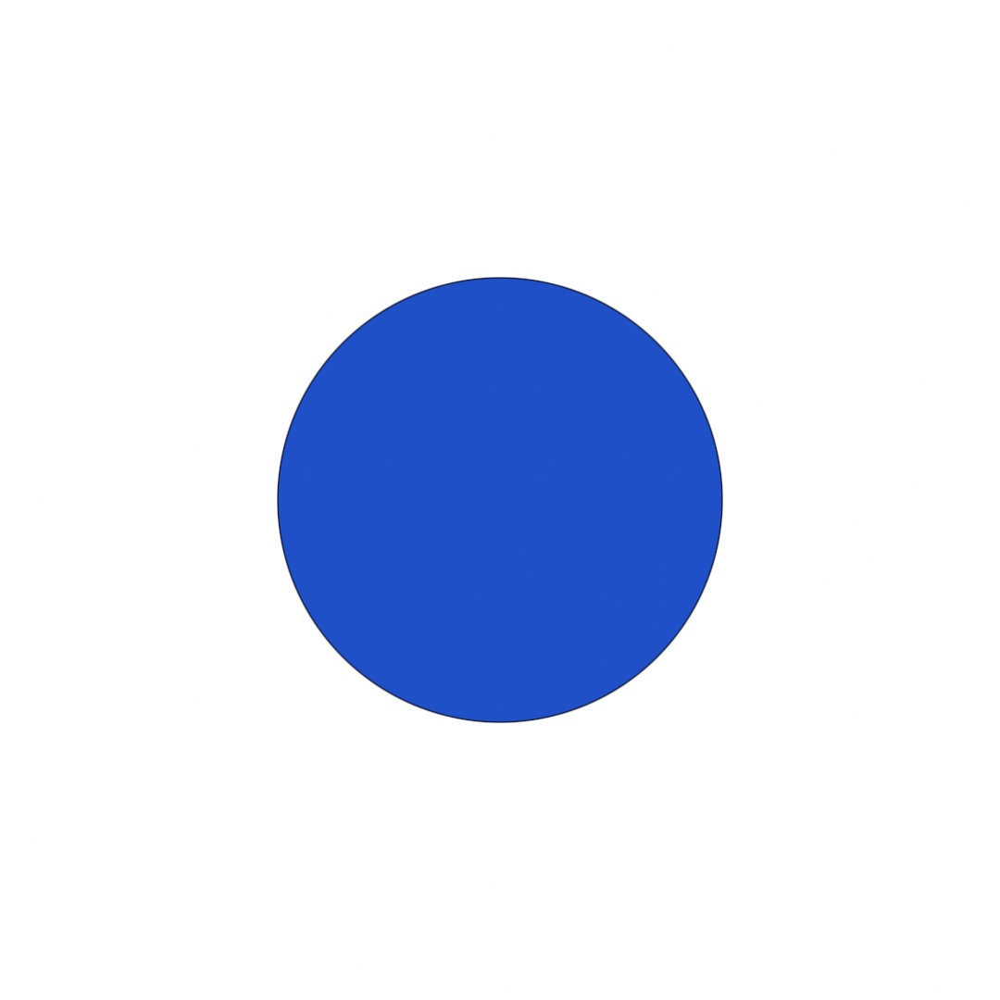

#### <sup>[Ollin](../README.md) → [Guide](README.md) → Appendix C</sup>

---

# C. Coming from p5.js and Processing

If you've sketched in p5.js or Processing, the model you know carries over whole. `setup()` runs once and `draw()` runs every frame. Shapes paint in the order you call them. The origin is the top-left corner, with y growing downward, and angles are radians. `fill` and `stroke` set the ink for everything drawn after them. Plenty of names survive unchanged too, from `width` and `mouseX` through `translate`, `strokeWeight`, `noise`, and `map`. Mostly the spelling changes.

This appendix is the dictionary for the rest, a page to look things up in. The tables map the calls you know onto their Ollin spellings. The sections after them cover what's different on purpose, and the habits to leave behind. Most entries point at the chapter that teaches them. The Swift language itself, with its types, `let` and `var`, and optionals, has its own pages. The [Swift quick reference](../Docs/Swift.md) is a fast pass, and [Appendix A](A-JustEnoughSwift.md) is the gentle one.

Tables show p5.js names. Processing's are the same, except where a row says otherwise.

## One sketch, twice

In p5.js:

```js
function setup() {
  createCanvas(1080, 1080);
}

function draw() {
  background(255);
  fill("#2050C8");
  circle(width / 2, height / 2, 480 + sin(frameCount * 0.03) * 160);
}
```

The same sketch in Ollin:

```swift
import Ollin

final class Pulse: Sketch {
    override func draw() {
        background(.white)
        fill(Color(hex: 0x2050C8))
        drawCircle(width / 2, height / 2, 240 + sin(time * 1.8) * 80)
    }
}
```



Save it as `Pulse.swift`, run `swift run OllinLive Pulse.swift`, and it breathes like the original. Reading the two against each other shows most of what this appendix has to say:

- **The sketch is a class.** Global functions become methods you `override` on a `Sketch` subclass. Sketch state that lived in globals becomes properties on the class. [Chapter 1](01-HelloOllin.md) walks through every line of this.
- **There is no `createCanvas`.** The canvas is 1080 by 1080 unless you say otherwise. The size is a declaration rather than a call, spelled `override var canvasSize: CanvasSize { .size(800, 600) }`.
- **`drawCircle` takes a radius.** p5's `circle()` takes a diameter, which is why 480 became 240. A ported sketch that misses this draws every circle twice as big.
- **Motion reads a clock.** `frameCount * 0.03` becomes `time * 1.8`. `time` is seconds since the sketch started, so the speed holds on any display. At 60 frames a second the two expressions match.
- **Colors are values.** `fill("#2050C8")` becomes `fill(Color(hex: 0x2050C8))`, a typed value you can store, mix, and pass around. Channels run `0...1`, not 0 to 255.

## The dictionary

### The sketch and the loop

| p5.js | Ollin | Notes |
|---|---|---|
| `function setup()` | `override func setup()` | Processing: `void setup()` |
| `function draw()` | `override func draw()` | runs at the display's refresh rate |
| `createCanvas(800, 600)` | `override var canvasSize: CanvasSize { .size(800, 600) }` | a property, not a call; `.square(1080)` is the default. Processing: `size(800, 600)` in `setup()` or `settings()` |
| `noLoop()` / `loop()` | same names | motion is the default, and `noLoop()` stops after one frame |
| `frameCount` | `frameCount` | an `Int` |
| `millis()` | `time` | seconds as a `Double`, not milliseconds |
| `deltaTime` | `deltaTime` | seconds, not milliseconds |
| `frameRate(30)` | no equivalent | `draw()` follows the display; read `frameRate` to see what you're getting |

There's no `windowWidth` pair. The canvas has a fixed size you declare, and the window is a scaled preview of it. [Canvas](../Docs/Core/Canvas.md) covers `windowMode`.

### Shapes

Geometry calls take a `draw` prefix, and circular things take radii where p5 takes diameters.

| p5.js | Ollin | Notes |
|---|---|---|
| `circle(x, y, d)` | `drawCircle(x, y, r)` | radius, not diameter |
| `ellipse(x, y, w, h)` | `drawEllipse(x, y, rx, ry)` | radii, so halve both |
| `rect(x, y, w, h)` | `drawRect(x, y, w, h)` | same corner anchor; round with `cornerRadius:`, or one radius per corner with `cornerRadii:` |
| `square(x, y, s)` | `drawRect(x, y, s, s)` | |
| `line(x1, y1, x2, y2)` | `drawLine(x1, y1, x2, y2)` | |
| `point(x, y)` | `drawPoint(x, y)` | |
| `triangle(x1, y1, …, y3)` | `drawTriangle(x1, y1, …, y3)` | |
| `quad(…)`, `beginShape()`+`vertex()`+`endShape(CLOSE)` | `drawPolygon([Vector2])` | the corners go in as an array |
| `endShape()` left open | `drawPolyline([Vector2])` | |
| `beginContour()` … `endContour()` | `drawShape(Shape(outer: [Vector2], holes: [[Vector2]]))` | a contour inside another is a hole under the default even-odd rule, whichever way it runs; a `drawShape { }` path is always one outline ([Chapter 15](15-ShapesAsMaterial.md#contours-shapes-and-holes)) |
| `arc(x, y, w, h, start, stop, PIE)` | `drawArc(x, y, rx, ry, start: a, stop: b, mode: .pie)` | same angles (radians, clockwise from 3 o'clock); `.open` / `.chord` / `.pie` |
| `bezier(…)` (cubic) | `drawShape { }` with `cubicCurve(to:control1:control2:)` | `drawBezier(…)` exists but is quadratic: one control point |
| `curveVertex(…)` splines | `drawCurve([Vector2], closed: true)` | a smooth curve through the points; `spline: .hobby` for a fit that bends evenly |
| `rectMode(CENTER)` | `drawRect(center: p, width: w, height: h)` | anchors are labels on the call, never a sticky mode |

The catalog runs well past p5's. It holds stars, rings, hearts, n-gons, and a few dozen more, all listed in [Drawing](../Docs/Drawing/Drawing.md).

### Ink and color

| p5.js | Ollin | Notes |
|---|---|---|
| `background(255)` | `background(.white)` | grays: `Color(white: 0.3)`; channels are `0...1` |
| `fill(255, 0, 102)` | `fill(Color(red: 1, green: 0, blue: 0.4))` | |
| `fill("#ff0066")` | `fill(Color(hex: 0xFF0066))` | the string form returns an optional, so a literal is written `Color(hex: "#ff0066")!` ([Chapter 2](02-Color.md)) |
| `fill(r, g, b, 128)` | `fill(color.withAlpha(0.5))` | or `alpha:` on the initializer, as in `Color(hex: 0xFF0066, alpha: 0.5)` |
| `noFill()` / `noStroke()` | same names | |
| `stroke(…)` / `strokeWeight(5)` | same names | |
| `strokeCap(ROUND)` / `strokeJoin(MITER)` | `strokeCap(.round)` / `strokeJoin(.miter)` | enums instead of constants |
| `colorMode(HSB, 360, 100, 100)` | `Color(hue: h, saturation: s, brightness: b)` | no mode state; everything `0...1`, hue wraps |
| `lerpColor(a, b, 0.3)` | `Color.mix(a, b, 0.3)` | mixes in a perceptual space by default, so midpoints don't go muddy ([Chapter 2](02-Color.md)) |
| `blendMode(ADD)` | `blendMode(.add)` | |

### Transforms and state

| p5.js | Ollin | Notes |
|---|---|---|
| `translate(x, y)`, `rotate(a)`, `scale(s)` | same names | radians in both |
| `push()` / `pop()` | `pushState()` / `popState()` | Processing: `pushMatrix()`/`popMatrix()` plus `pushStyle()`/`popStyle()`; one pair here snapshots both |
| `push()` … `pop()` around a block | `withState { }` | the scoped form; the pop can't be forgotten ([Chapter 6](06-GridsAndRepetition.md)) |
| `angleMode(DEGREES)` | no equivalent | radians only; `.tau` is one full turn |
| `TWO_PI`, `PI`, `HALF_PI` | `.tau`, `.pi`, `.pi / 2` | |
| `radians(d)` / `degrees(r)` | `.degrees(d)` / `r * 180 / .pi` | better: stay in radians and think in fractions of `.tau` |

### Randomness and noise

| p5.js | Ollin | Notes |
|---|---|---|
| `random()`, `random(10)`, `random(5, 10)` | same shapes | |
| `random(array)` | `randomChoice(array)` | a weighted form exists: `randomChoice(array, weights:)` |
| `shuffle(array)` | `shuffled(array)` | |
| `randomGaussian()` | `randomGaussian()` | also `randomGaussian(mean:deviation:)` |
| `randomSeed(n)` / `noiseSeed(n)` | same names | `seed(n)` sets both at once ([Chapter 4](04-Randomness.md)) |
| `noise(x)`, `noise(x, y)`, `noise(x, y, z)` | same | `0...1` in both, same small-steps habit ([Chapter 5](05-Noise.md)) |
| `noiseDetail(lod, falloff)` | `fbm(x, y, octaves: 4, gain: 0.5)` | layered noise is its own call |

Two more have no p5 counterpart. `signedNoise` swings `-1...1`, so you drop the `* 2 - 1`. And `noise(x, loop: t)` comes back to its starting value, for seamless loops. [Chapter 5](05-Noise.md) covers both.

### Vectors

| p5.js | Ollin | Notes |
|---|---|---|
| `createVector(3, 4)` | `Vector2(3, 4)` | Processing: `new PVector(3, 4)`; `Vector3` for 3D |
| `a.add(b)` | `a + b` | real operators: `+`, `-`, `*`, `/`, `+=` |
| `v.mult(2)` | `v * 2` | |
| `v.mag()` | `v.length` | |
| `v.normalize()` | `v.normalized` | |
| `v.heading()` | `v.angle` | |
| `a.dist(b)` | `a.distance(to: b)` | |
| `p5.Vector.lerp(a, b, t)` | `a.lerp(to: b, t)` | |
| `a.dot(b)` | `a.dot(b)` | |

One difference changes how vector code reads. p5's vector methods change the vector in place, so `a.add(b)` alters `a`. Ollin's return new values and leave the inputs alone, so `a + b` reads like the math it does. [Chapter 10](10-Vectors.md) teaches vectors from the start.

### Everyday math

| p5.js | Ollin | Notes |
|---|---|---|
| `map(v, 0, 100, 0, width)` | same | the clamping flag is labeled: `clamped: true` |
| `constrain(v, lo, hi)` | `clamp(v, lo, hi)` | |
| `norm(v, a, b)` | `map(v, a, b, 0, 1)` | |
| `lerp`, `dist`, `sin`, `cos`, `atan2`, `sqrt`, `pow`, `abs`, `min`, `max`, `floor` | same | `floor` returns a `Double`; `Int(x)` truncates to a whole number |
| `width * 0.3, height * 0.7` | `uv(0.3, 0.7)` | a point as canvas fractions, so the sketch survives a resize |

### Text

| p5.js | Ollin | Notes |
|---|---|---|
| `text("hi", x, y)` | `drawText("hi", x, y)` | |
| `font.textToPoints("hi", x, y, 96)`, in p5 only | `textSize(96)`, then `textToShapes("hi", x, y)` | one `Shape` per letter, holes kept; `resampled(spacing: 8)` spaces the points evenly along each contour ([Chapter 8](08-Words.md#text-as-geometry-texttoshapes)) |
| `textSize(32)` / `textWidth(s)` | same names | |
| `textAlign(CENTER, CENTER)` | `textAlign(.center, .middle)` | the vertical center is `.middle` |
| `textFont(f)` | `textFont(f)` | three font kinds: outline, bitmap, and stroke ([Chapter 8](08-Words.md)) |
| `loadFont("x.otf")` | `OutlineFont(name:)` for installed fonts | or `OutlineFont(resource:in:)` for a bundled file |

### Images, pixels, and data

| p5.js | Ollin | Notes |
|---|---|---|
| `loadImage("a.png")` | `try? loadImage("a.png")` | throws when a path is wrong, and `try?` turns that into `nil` ([Chapter 9](09-Pictures.md)) |
| `image(img, x, y)` / `image(img, x, y, w, h)` | `drawImage(img, x, y)` / `drawImage(img, x, y, w, h)` | |
| `tint(…)` / `noTint()` | `tint(_:)` / `noTint()` | |
| `img.get(x, y)` / `img.set(x, y, c)` | `img[x, y]` | one subscript reads and writes |
| `img.loadPixels()`, `img.pixels[i]`, `img.updatePixels()` | `img[x, y]` | no load or update step: a write shows the next time the image is drawn ([Chapter 9](09-Pictures.md#an-image-you-can-ask-imagex-y)) |
| `loadPixels()` and `pixels[]` on the canvas | no read-back inside `draw()` | per-pixel work is a `shade` function ([Chapter 18](18-YourFirstShader.md)); a layer's `image[x, y]` reads `.clear`, because its pixels stay on the GPU; a `SketchExtension` can receive each finished frame ([Chapter 44](44-HandingItOver.md#adding-behavior-from-outside-draw-sketchextension)) |
| `createImage(w, h)` | `Image(width:height:)` | |
| `createGraphics(w, h)` | `makeRenderTarget()` + `withTarget(layer) { }` | off-screen layers ([Chapter 19](19-LayersAndEffects.md)) |
| `loadTable("data.csv", "csv", "header")`; Processing: `loadTable("data.csv", "header")` | `try? loadTable("data.csv")` | the format and the header row are guessed, or say `format: .csv, hasHeader: true`; read a cell with `row.number("col")`, or `row["col"]` for its text ([Chapter 9](09-Pictures.md#reading-a-table-loadtable)) |
| `loadJSON("data.json")`; Processing: `loadJSONObject` and `loadJSONArray` | `try? loadJSON("data.json")` | it reads at once rather than through a callback, so call it in `setup()`; walk it with `doc?["points"][0]["x"].number` ([Chapter 9](09-Pictures.md#documents-with-a-shape-loadjson)) |

### Mouse and keyboard

| p5.js | Ollin | Notes |
|---|---|---|
| `mouseX`, `mouseY`, `mouseIsPressed` | same names | |
| `mousePressed()`, `mouseReleased()` | same names, as overrides | |
| `mouseDragged()` | poll `mouseIsPressed` in `draw()` | dragging is state you read, not an event |
| `pmouseX`, `pmouseY` | `previousMouse` | one `Vector2` for where the mouse was last frame, beside `mouse` for where it is now |
| `key`, `keyCode` | same names | typed: a `Character?` and a `KeyCode?` |
| `keyPressed()`, `keyReleased()` | same names | |
| `keyIsDown(LEFT_ARROW)` | `isKeyDown(.leftArrow)` | also by character: `isKeyDown("a")` |

### The bigger machines

Each of these gets a chapter, so the table only points.

| p5.js | Ollin | Where |
|---|---|---|
| `createSlider`, `createButton`, the DOM | `@Param` parameters in the inspector | [Chapter 1](01-HelloOllin.md) |
| `filter(BLUR)` | layers and the `Filter` catalog | [Chapter 19](19-LayersAndEffects.md) |
| `loadShader` / `shader()` | a `Shader` written in Metal, run over a layer with `generate(_:)` and drawn with `drawImage` | [Chapter 18](18-YourFirstShader.md) |
| `WEBGL` mode, `box()`, `sphere()` | `cameraShowcase(…)`, `camera(.orbiting(…))`, or `perspective(…)`, then `drawBox()`, `drawSphere()`, … | [Chapter 26](26-3DGently.md) |
| `orbitControl()` | `cameraControl()` | [Chapter 26](26-3DGently.md) |
| `ambientLight`, `pointLight`, `directionalLight` | same names | [Chapter 26](26-3DGently.md) |
| p5.sound: `getLevel()`, `p5.FFT` | `AudioAnalyzer`: `amplitude`, `spectrum`, `bands(_:)`, `beat` | [Chapter 37](37-Listening.md) |
| `createCapture(VIDEO)`; Processing: `new Capture(this)` from its video library | `Camera()` from `OllinVision`, started in `setup()` and drawn with `drawFrame(camera)` | [Chapter 34](34-Seeing.md) |

Many people who sketch in p5 learn forces and flocks from Daniel Shiffman's *The Nature of Code*. There you write the code for each system by hand. Four chapters here teach the same ground. [Chapter 11](11-ForcesAndPhysics.md) covers forces and a physics world, [Chapter 12](12-FlocksAndSwarms.md) steering and flocks, and [Chapter 13](13-GrowingThings.md) recursion and L-systems. Each starts by hand and moves on to Ollin's own types. [Chapter 14](14-FieldsAndFlow.md) builds flow fields from the `flowField` helper.

### Saving your work

Exporting is a run flag rather than a call in the sketch, so any sketch can render to a file without changing its code.

| p5.js | Ollin | Notes |
|---|---|---|
| `saveCanvas()` | `swift run OllinLive Pulse.swift --export out.png` | `--frame 90` picks the frame |
| `saveFrames(…)` | `--export-sequence out --seconds 5` | |
| `saveGif(…)` | `--export-gif loop.gif --seconds 4` | |
| video capture libraries | `--export-video out.mp4 --seconds 10` | |
| (no built-in SVG) | `--export-svg out.svg` | true vectors, plotter-ready ([Chapter 41](41-FinishingASketch.md)) |
| the sketch runs in the browser | `--export-web out.html` | a page that plays what the sketch drew, with no framework in the browser ([Chapter 41](41-FinishingASketch.md)) |

## Different on purpose

**`let` means a constant.** JavaScript's `let` is Swift's `var`, and JavaScript's `const` is Swift's `let`. Swift sketches prefer `let`, because most values in `draw()` are computed fresh each frame. The [Swift quick reference](../Docs/Swift.md) covers the rest of what changes.

**Values have types.** Positions are `Vector2`, colors are `Color`, and outlines are `Shape`. These are values you store and pass around, where p5 scatters loose numbers across calls. The compiler checks all of it before the sketch runs. A misspelled name or a wrong type stops at the save, not in the middle of a run.

**Modes became labels and enums.** There's no `rectMode`, `ellipseMode`, `colorMode`, or `angleMode` to set and later forget. The anchor is a label on the call, as in `drawRect(center:width:height:)`. The color model is the initializer you pick, as in `Color(hue:…)`. The constants are typed cases such as `.pie`, `.round`, and `.add`. A drawing can't be broken by a mode set three functions away.

**Every sketch is already an instance.** What p5 calls instance mode is the only mode. A sketch is a class, its state is properties, and nothing leaks between sketches. Inside the class you write `particles`, with no `this.` or `self.` in front.

**The clock replaces the frame counter.** `time` and `deltaTime` are seconds. Motion written against them holds its speed on a 60 Hz display and a 120 Hz one alike. `frameCount` is still there for counting frames, but it's the wrong unit for speed. [Chapter 3](03-MotionAndTime.md) builds its motion on this.

**The canvas wipes itself.** In p5 the pixels persist, `background()` is the wipe, and leaving it out is the classic trails trick. Ollin clears every frame whether or not you call `background`, so a ported trails sketch loses its trails in silence. The opt-out is one call, `noClear()`, and [Chapter 19](19-LayersAndEffects.md) builds the long-exposure style on it.

**Files, not browser tabs.** The working loop is `swift run OllinLive Pulse.swift`, so you save the file and the running window swaps in the change. What you give up is the browser as the place you work. Sharing a sketch means exporting an artifact, such as a still, a video, a GIF, an SVG, or a page that plays in a browser. [Chapter 41](41-FinishingASketch.md) covers each of them.

## Habits to leave behind

- **Balancing `push()` and `pop()` by hand.** `withState { }` scopes the save and restore to a block, so the restore can't be forgotten or misplaced.
- **Thinking in degrees.** There's no `angleMode`. A full turn is `.tau`, and half a turn is `.tau / 2`. Fractions of a turn read better than either 90 or 1.5708.
- **Animating with `frameCount` arithmetic.** Reach for `time`. The bare numbers become units, such as turns per second or pixels per second, and they hold on any display.
- **Mixing colors in RGB.** `Color.mix` defaults to a perceptual space, so blue and yellow meet in an even neutral rather than a muddy olive. [Chapter 2](02-Color.md) shows the difference side by side.
- **Hand-rolling grids from margins and nested loops.** `grid(columns: 12, rows: 8)` hands you the cells and their centers in one loop, indices included. [Chapter 6](06-GridsAndRepetition.md).
- **Hardcoding a constant, re-running, hardcoding again.** Declare it `@Param` and drag the parameter while the sketch runs. When the value feels right, make it the new default. [Chapter 1](01-HelloOllin.md).
- **Writing pixel loops for effects.** Blur, glow, and their relatives are GPU filters on layers, which [Chapter 19](19-LayersAndEffects.md) covers. Anything per-pixel you'd invent yourself becomes a short `shade` function, which [Chapter 18](18-YourFirstShader.md) teaches.

## Go deeper

- [Chapter 1, Hello, Ollin](01-HelloOllin.md): the toolchain, the live-reload loop, and the first sketch, from zero.
- [The Swift quick reference](../Docs/Swift.md): the language delta (types, optionals, closures) at speed; [Appendix A](A-JustEnoughSwift.md) is its narrative sibling.
- [Drawing](../Docs/Drawing/Drawing.md): the full shape catalog and ink state.
- [Appendix D](D-CompleteToolbox.md): everything Ollin ships, one line each, including what p5 has no function for.
- [`Examples/`](../Examples/README.md): working sketches to read and tweak, including [Recreations](../Examples/Recreations/README.md), homages to works by artists such as Vera Molnár and Bridget Riley.

---

[Contents](README.md#contents) · Previous: [Appendix B, Just enough math, visually](B-JustEnoughMath.md) · Next: [Appendix D, The complete toolbox](D-CompleteToolbox.md)
