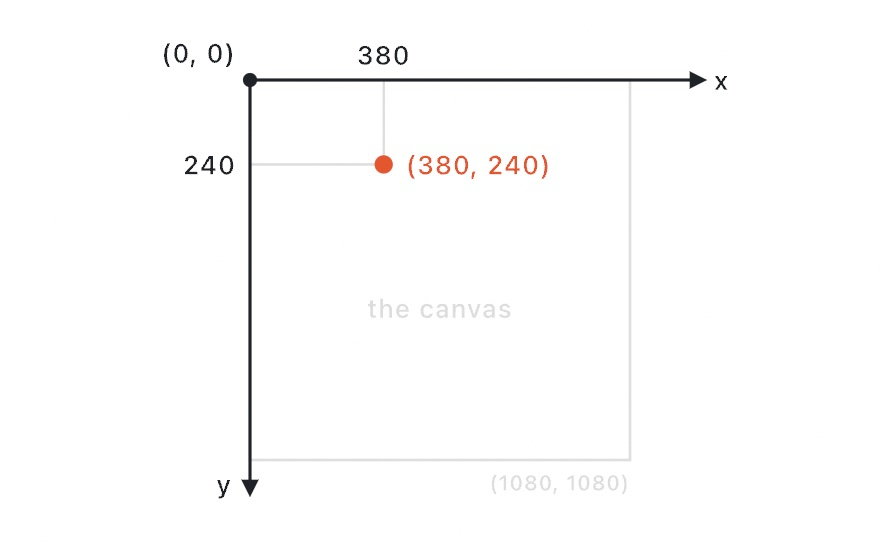

#### [Ollin](../README.md) → Guide

---

# The Ollin Guide

*A practical introduction to creative coding.*

This guide teaches creative coding from zero, using [Ollin](../README.md). You write small programs called sketches that draw, move, and react. Along the way you learn the techniques the field is built on: randomness, noise, forces, flocks, shaders, simulation, and 3D. Each chapter teaches a few ideas through short runnable steps, and it ends with a finished piece you made yourself.

**Who it's for.** Anyone who can program a little, in any language. You don't need to know Swift, because the guide teaches what you need as it comes up, and [Appendix A](A-JustEnoughSwift.md) is a primer. You don't need a background in math, graphics, or shaders either. If you can write a loop and a function, you can start.

**What you need.** A Mac running macOS 26 or newer, and this repository. That's it.

**Where this sits.** The guide is the narrative layer. Read it from start to finish and it teaches you to think in sketches. The [API reference](../Docs/README.md) answers the question "what does this call do", and [`Examples/`](../Examples/) is working code to browse. Chapters link into both as you go.

## Four promises

Guides like this tend to fail in known ways. A concept appears out of nowhere and you're stuck. The examples no longer compile. The theory runs three chapters ahead of anything you can see. So this guide is built around four promises:

1. **Nothing arrives unexplained.** Every concept is introduced before it's used, with a picture. When math shows up, it comes with a visual and a plain-words intuition, never notation alone. If you still get lost on a page, [Appendix B](B-JustEnoughMath.md) explains every math idea in the guide again, with a picture for each.
2. **Every listing runs.** Each code listing is a real file under [`Figures/`](Figures/), compiled and rendered by a tool in this repository. If the framework changes underneath a listing, the build breaks, so the guide cannot show you code that no longer runs.
3. **Every image is made by the code next to it.** Ollin itself renders every figure and diagram from committed source. You can open any of them, run it, and change it.
4. **Practice first.** You see something on your canvas within the first page of every chapter. Everything a chapter teaches ends up in one finished piece.

Both kinds of image are already on this page. The grid above is the sketch each chapter builds, forty-one committed figures, one per cell, and the first of them is [`Figures/01-HelloOllin/HelloMotion.swift`](Figures/01-HelloOllin/HelloMotion.swift). The [Chapter 1](01-HelloOllin.md) diagram below is a sketch too, [`CoordinateSystem.swift`](Figures/01-HelloOllin/CoordinateSystem.swift):

<picture>
  <source media="(prefers-color-scheme: dark)" srcset="Images/01-HelloOllin/CoordinateSystem-dark.jpg">
  
</picture>

## How to read it

Read the chapters in order the first time, because each one builds only on the ones before it. It also helps to know roughly what each part is going to ask of you. The page counts reckon three hundred words of prose to a page, listings aside.

- **Part I, chapters 1 to 9.** Around 130 pages. It is the base everything else stands on, so it is the one part you cannot skip.
- **Part II, chapters 10 to 14.** Around 55 pages. The rest of the guide depends on chapter 10 more than on any other chapter, so do not skim it.
- **Part III, chapters 15 to 17.** Around 45 pages, the shortest part. Read chapter 15 first, because the curves and marks after it come back as the shapes it teaches you to hold.
- **Part IV, chapters 18 to 24.** Around 110 pages. Chapter 18 is its gate, because chapters 23 and 24 write shader code of their own, and chapters 20 and 21 filter the layers chapter 19 makes.
- **Part V, chapters 25 to 31.** Around 150 pages, the longest part. Chapter 25 is its gate, and chapter 28 also wants the physics from chapter 11.
- **Part VI, chapters 32 to 35.** Around 75 pages. Its chapters barely depend on each other, so read the ones you need in any order.
- **Part VII, chapters 36 to 41.** Around 120 pages. Chapter 37 plays the instruments chapter 36 builds, and chapter 39 replays a performance through chapter 38's exports.

A few chapters are better with hardware beyond the Mac, and every one of them starts with what you can do on the Mac alone. For [Chapter 32](32-Seeing.md) you want a webcam, and for [Chapter 33](33-DepthAndThePhone.md) an iPhone with a LiDAR sensor. [Chapter 34](34-Listening.md) wants a microphone, [Chapter 35](35-ControlsAndSignals.md) a MIDI controller, and [Chapter 41](41-Installations.md) a lighting node or a projector. You can skip any of them, and nothing later in the guide breaks.

Work along in the live-reload host, `swift run OllinLive path/to/YourSketch.swift`. It recompiles your sketch on save, so the window never closes while you experiment. [Chapter 1](01-HelloOllin.md) sets this up.

If you're coming from p5.js or Processing, [Appendix C](C-ComingFromP5.md) maps what you already know onto Ollin, and [Appendix E](E-ComingFromOpenFrameworksAndOPENRNDR.md) does the same for openFrameworks and OPENRNDR. If you're new to Swift, [Appendix A](A-JustEnoughSwift.md) and the [Swift quick reference](../Docs/Swift.md) cover just enough of the language to be productive.

## Contents

### Part I: Seeing something move

1. **[Hello, Ollin](01-HelloOllin.md).** Your first sketch, the draw loop, coordinates, shapes, and motion by default. It also sets up the workflow the rest of the guide uses: live reload and tunable parameters.
2. **[Color that works](02-Color.md).** Naming colors, thinking in hue, mixing that matches what your eye expects, palettes and ramps, and gradients used as paint.
3. **[Motion and time](03-MotionAndTime.md).** Time, shaping functions drawn as curves (map, lerp, smoothstep, easing), sine and cosine explained simply, and timelines.
4. **[Randomness](04-Randomness.md).** Random values, seeds, choices, distributions, and why reproducibility matters. Then scatters that are random but even: blue noise and the Halton and Sobol sequences.
5. **[Noise](05-Noise.md).** What Perlin noise is, what it's for, and how to drive motion and form with it.
6. **[Grids and repetition](06-GridsAndRepetition.md).** The grid helper, transforms that move the paper, symmetry and the kaleidoscope fold, clipping, and divisions that aren't square: hex, triangle, and recursive panels.
7. **[Tiles that cover the plane](07-Tiles.md).** Patterns that cover the plane by rule: Truchet tiles, hitomezashi stitching, the ten-print maze and the perfect maze, kolam and sona, Celtic knotwork, polyominoes, Wave Function Collapse from tiles or from a picture, the tilings that never repeat (Penrose, Wang, girih, and the single-shape spectre), a ring where every window appears once, hyperbolic tiling on the Poincaré disk, and parquet deformations.
8. **[Words](08-Words.md).** Drawing text, the three kinds of font, per-glyph motion, letters as geometry you can warp and respace, and typesetting in any script: vertical, justified, and with hanging punctuation.
9. **[Pictures and data](09-Pictures.md).** Reading a picture as data instead of displaying it: fitting it to a box, a palette taken out of a photograph and dithering back into it, marks and halftone, mosaics made of pictures, a shape hidden in an autostereogram, stipple and one unbroken line, thread between pins, sorted pixels, and seam carving. Then numbers from CSV and JSON.

### Part II: Systems that come alive

10. **[Vectors, gently](10-Vectors.md).** Vectors as arrows, then position, velocity, and acceleration, then steering toward a target.
11. **[Forces and physics](11-ForcesAndPhysics.md).** Forces by hand, then a physics world: springs and particles, rigid bodies and joints, grabbing with the mouse.
12. **[Flocks and swarms](12-FlocksAndSwarms.md).** One creature that steers (seek, arrive, wander), chases that trace curves of pursuit, flocking from three local rules and the grid that keeps it cheap, a crowd that makes room, and fireflies falling into step.
13. **[Growing things](13-GrowingThings.md).** A recursive tree, L-system grammars with and without arithmetic, and shape grammars. Then growth by crowding, claiming space, chance, voltage, collision, and wandering: differential growth, space colonization, frost from frozen walkers, dielectric breakdown, cracks, and meanders.
14. **[Fields and flow](14-FieldsAndFlow.md).** A direction at every point: contours where a field equals something and the still lines of a ringing plate, streamlines, evenly spaced flow, particles carried along, and a field you pin down yourself.

### Part III: Shapes, lines, and marks

15. **[Shapes as material](15-ShapesAsMaterial.md).** Geometry you keep and edit as data: contours and shapes with holes, booleans, offsets, and the questions an outline answers. Then Voronoi territories, packing by growth and by rule (the Apollonian gasket and Ford circles), hulls and skeletons, and hatching and SVG for pen plotters, with batches to draw it fast. After the plate, crease patterns fold and cut the paper itself.
16. **[Curves and figures](16-CurvesAndFigures.md).** Figures that come from a rule. Hobby splines and the curves you can write down (Lissajous figures, roses, spirographs, superellipses, guilloche, harmonographs), then spirolaterals, envelopes and caustics, clothoids, Fourier epicycles, morphs, and mirror anamorphosis.
17. **[Marks and media](17-MarksAndMedia.md).** Strokes with a hand in them: width profiles, stroke dynamics, brushes that stamp a tip, and dashes. Then two wet media made from geometry, marbled ink and watercolor pigment.

### Part IV: Pixels and light

18. **[Your first shader](18-YourFirstShader.md).** Per-pixel thinking, uv space, writing a `shade` function, the design generators and pattern fields Ollin ships, smoothing the stair-stepped edges a shader leaves, and chaining visuals.
19. **[Layers and effects](19-LayersAndEffects.md).** Off-screen layers, GPU filters, compositing, feedback, accumulation, HDR.
20. **[Pictures restyled](20-PicturesRestyled.md).** Filters that make a photograph into another kind of picture. Ink lines, brushwork, flat regions, and hatching, a colorist's look and the film look, relighting and dithering, the picture inside itself, chromatic aberration, the design filters, and melt.
21. **[Pictures you solve](21-PicturesYouSolve.md).** Layers treated as problems to solve. Diffusion curves, a seamless paste, the measured distance field, the frequency domain, light worked out in a flat sketch, and local averages.
22. **[Iterated forms](22-IteratedForms.md).** Pictures made by applying one rule over and over: the chaos game, fractal flames, the Buddhabrot, circles used as mirrors, Kleinian and Schottky groups, chaotic maps, the bifurcation diagram, a ball bouncing in a room, the double pendulum, escape-time fractals, Newton's basins, domain coloring, and complex arithmetic in a shader of your own.
23. **[Simulations on a grid](23-GridSimulations.md).** Fields that carry their own state on the GPU: cellular automata, sand, percolation, reaction-diffusion, multi-scale Turing, fluid, ripples, and watercolor.
24. **[Simulations made of particles](24-ParticleSimulations.md).** A buffer of individuals updated by one small program: a million grains, a million riding a strange attractor, slime mold, ant colonies, Particle Life, crowds at scale, SPH fluid and jellies, and evolution.

### Part V: The third dimension

25. **[3D, gently](25-3DGently.md).** A camera, depth, flat drawing placed at a depth, solids and words made solid, lights and the shadows they throw, air you can see, materials and matcaps, and the depth buffer's own effects.
26. **[Meshes, maps, and materials](26-Meshes.md).** Meshes loaded from a file, built from other meshes, or carved to throw the shadows you ask for, pictures that set what a surface is, texel by texel, and finishes you set with numbers: metal and dielectric, environments as the light source and the sky's haze over distant ground, glass, coated paint, cloth, and skin.
27. **[Landscapes and multitudes](27-Landscapes.md).** Ground grown from noise and weathered by rain, and the rivers read off it. Then ways to draw more copies of something than you could place by hand: instanced meshes, copies scattered over a surface, a world cut down to what the camera sees, a courtyard of lamps that each light only their own corner, and grass that is drawn without ever being built. Last, a sea made from its waves.
28. **[Worlds with weight](28-WorldsWithWeight.md).** Rigid bodies in the 3D scene: stacking and contact, asking what a body would hit, collision groups, degrees of freedom, machines made out of joints, structures that stand on their own cables, water that bodies float in, and snapshots of a settled world.
29. **[Characters, vehicles, and cloth](29-CharactersAndCloth.md).** The three things a rigid body models badly: a figure that walks, a vehicle on sprung wheels, and cloth, ropes, ragdolls, and a raft.
30. **[Sculpting with fields](30-SculptingWithFields.md).** Distance fields that merge, carve, and fold, in 2D and raymarched 3D, turned into meshes, sculpted like clay, or grown as fractals.
31. **[Traced light](31-TracedLight.md).** Light followed past the first surface: mirrors that see off screen, bounce light, caustics, and the path-traced still. Then the work done across frames and in the lens. Temporal anti-aliasing, highlights that hold still, motion blur, lens flare, the shape of a blur, depth of field built from samples of light, upscaling, and frames drawn in between.

### Part VI: The world coming in

32. **[Seeing](32-Seeing.md).** The webcam as input and as the light in a 3D scene, then faces, hands, bodies, the lifted subject, edges, motion, printed text, a followed object, and labels and saliency as typed values. Then models of your own, footage as material, the screen as a source, and slit scan.
33. **[Depth and the iPhone as a sensor](33-DepthAndThePhone.md).** Point clouds, recorded and live RGBD, the phone's body, hand, and gaze streams, and scanning the room you're in.
34. **[Listening](34-Listening.md).** Hearing loudness, spectrum, beats, pitch, speech, and sound events.
35. **[Controls and signals](35-ControlsAndSignals.md).** Everything that steers a sketch from outside the inspector. MIDI, timecode, OSC and OSCQuery, a beat shared over Link, and MIDI and OSC bound straight to your parameters. Then TUIO tables, game controllers, serial and Bluetooth wires, feeds that poll a server or hold a stream open, the weather outside, and the trackpad's knock.

### Part VII: Out into the world

36. **[Making sound](36-MakingSound.md).** A sketch that plays sound: synths and the voices inside them, effects, and a room you can draw. Instruments built by patching or from recordings, wavetables and grains, physical models of a string, a struck shape, a bow and a tube, and expression under the finger.
37. **[Music by rule](37-MusicByRule.md).** Which notes, and when: rhythms, scales, chains, a sequencer and an arpeggiator, chords from a key, and tunings. Then playing along with the room, sonification, sound placed in a room and kept in an export, and MIDI files.
38. **[Finishing a sketch](38-FinishingASketch.md).** Stills, frames kept in linear light or brighter than white, video, GIF, slow motion, SVG for plotters, and a page that plays in a browser. G-code, embroidery, DXF, a show laser, prints and 3D prints, USDZ and spatial video, reproducibility, and describable output.
39. **[Performing](39-Performing.md).** Live coding on stage, cues, takes and replay, keyframes and the timeline, parameters written as rules, and live feeds into other apps.
40. **[Handing it over](40-HandingItOver.md).** A sketch as a screen saver, a wallpaper, a menu-bar companion, or a widget, and as an app somebody double-clicks. Then on your phone, and as behavior or a package other programmers import.
41. **[Installations](41-Installations.md).** A piece that stays installed in one place: light instead of pixels through DMX and LED maps, the cost row for when it gets slow, and everything a room does to a sketch left running for weeks.

### Appendices

- **[A. Just enough Swift](A-JustEnoughSwift.md).** The language, for people coming from other languages.
- **[B. Just enough math, visually](B-JustEnoughMath.md).** Every math idea in the guide, each with a picture.
- **[C. Coming from p5.js and Processing](C-ComingFromP5.md).** A side-by-side translation.
- **[D. The complete toolbox](D-CompleteToolbox.md).** Everything Ollin can do, one line each, with where it's taught and where it's documented.
- **[E. Coming from openFrameworks and OPENRNDR](E-ComingFromOpenFrameworksAndOPENRNDR.md).** The big moves from either one, each as a pair of code.

---

If something is confusing, or you get stuck anywhere, that is a bug in the guide, not in you. Please [open an issue](https://github.com/eaviles/Ollin/issues).
